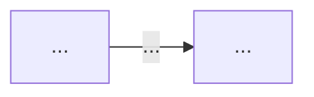

# Skill: escrever-nota

Cria nota nova de domínio do zero. Combina um **núcleo mínimo** (sempre presente) com **seções
opcionais** escolhidas por tema — sem template rígido que não serve a todos os assuntos.

Registro obrigatório: **Técnica Feynman**. Toda seção de conteúdo lê como quem ensina, não como
quem cataloga.

## Invocação

```
/escrever-nota [path] [instrução]
```

- **Sem `path`:** pergunta onde salvar e o título.
- **Com `path`:** cria em `path` (relativo à raiz do vault).
- **Instrução complementar:** foco temático, fontes a usar, fase-alvo, seções desejadas.

---

## Fase 0 — Levantamento

Antes de pesquisar ou escrever, coleta:

1. **Título e path de destino** — se não fornecidos. Filename = Title Case, espaços, `.md`.
2. **Fase-alvo** — Iniciado/Adepto/Magus. Infere pelo galho/domínio se possível; pergunta se ambíguo.
3. **Fontes disponíveis** — URLs, glosas linkadas, livros, notas internas mencionadas.
4. **Fronteiras do tema** — o que esta nota cobre e o que fica em notas-irmãs. Verificar notas
   adjacentes no galho com `find` para evitar overlap.
5. **Menu de seções opcionais** — apresenta o menu abaixo e pede confirmação (instrução pode pré-selecionar).

### Menu de seções opcionais

```
NÚCLEO (sempre gerado):
[✓] Frontmatter completo
[✓] TL;DR callout (> [!abstract])
[✓] Abertura com problema/cenário real
[✓] Corpo técnico: mecanismo explicado (por quê, não só o quê)
[✓] O que vem a seguir
[✓] Fontes

SEÇÕES OPCIONAIS — escolha as pertinentes ao tema:
[ ] Diagrama Mermaid — fluxo, comparação, sequência, estado
[ ] Tabela comparativa — quando há N variantes/opções
[ ] Casos práticos — ≥2 cenários de produção concretos
[ ] Armadilhas comuns — [!warning] individuais por armadilha
[ ] Código comentado — snippet com falha + solução
[ ] Como explicar em inglês + tabela PT↔EN
[ ] Fundamento teórico — para notas Magus: conecta à teoria formal
[ ] Veja também — wikilinks cross-galho
[ ] Callouts pedagógicos — [!example], [!question]-, [!info]
[ ] Resumo em 1 linha ("X em uma frase")
```

---

## Fase 1 — Pesquisa

1. **WebSearch** pelas fontes mais relevantes sobre o tema (3-5 fontes autoritativas).
2. Para cada fonte: extrai mecanismo, trade-offs, exemplos de produção, armadilhas reais.
3. Identifica **wikilinks internos** potenciais: `find 03-Dominios -iname "*<tema*"` e buscas por termos-chave.
4. Lista fontes e ângulos encontrados; confirma com o usuário antes de escrever (se dúvida de escopo).

---

## Fase 2 — Registro de escrita: Técnica Feynman

> "Se você não consegue explicar de forma simples, você não entendeu bem o suficiente."
> — Richard Feynman

Todo conteúdo gerado — cada seção, cada parágrafo, cada explicação — segue estas regras de registro:

| Princípio | Como aplicar |
|-----------|--------------|
| **Problema-primeiro** | Abre com o problema/cenário que o conceito resolve; nunca começa com definição |
| **Analogia antes da técnica** | Quando o mecanismo for abstrato, 1 analogia concreta antes de explicar (decorativa = ruído) |
| **Por que, não só o quê** | Explica o mecanismo causal; anti-padrão: "X faz Y" sem dizer como/por quê |
| **Pergunta do leitor** | Antes de responder algo não-óbvio, escreve a pergunta que o leitor faria: `> [!question]-` |
| **Camadas explícitas** | Separa sintoma de causa, o quê de por quê, caso normal de edge case |
| **Resumo em 1 linha** | Ao fim da seção principal: "X em uma frase: ..." |
| **Anti-padrão a evitar** | Prosa enciclopédica neutra — tecnicamente correta, mas que não antecipa a dúvida do leitor |

---

## Fase 3 — Rascunho estruturado

### Frontmatter

```yaml
---
title: "<título>"
created: <YYYY-MM-DD>
updated: <YYYY-MM-DD>
type: concept
status: seedling
fase: <iniciado|adepto|magus>
tags:
  - <galho-kebab-case>
  - <dominio-kebab-case>
publish: true
---
```

### TL;DR (núcleo obrigatório)

```markdown
> [!abstract] TL;DR
> <3-5 linhas densas: o que é, por que importa, quando usar, trade-off principal.>
> <Deve funcionar standalone — não é copiar a intro.>
```

### Abertura (núcleo obrigatório)

Parágrafo inicial com **problema ou cenário real** que o conceito resolve. O leitor se identifica
com o problema antes de receber a solução. Nunca começa com "X é um..." ou "X é definido como...".

### Corpo técnico (núcleo obrigatório)

Explica o mecanismo — o por quê. Cada conceito introduzido tem:
- O que é (1 frase)
- Por que funciona assim (o mecanismo)
- Quando usar / quando não usar (se relevante)

### Diagrama Mermaid (opcional)



Use Mermaid para **mostrar estrutura, fluxo ou contraste visual**, nunca como decoração. Se um
diagrama não acrescenta além do texto, omita.

### Casos práticos (opcional)

```markdown
## Casos práticos

### Cenário 1: <nome do cenário>
<contexto de produção real + código ou pseudocódigo>

### Cenário 2: <nome do cenário>
<contexto diferente do Cenário 1>
```

### Armadilhas comuns (opcional)

Cada armadilha em callout **individual** (não lista bullet):

```markdown
## Armadilhas comuns

> [!warning] <Nome da armadilha>
> **O que acontece:** <sintoma observado>
> **Por quê:** <mecanismo causal>
> **Como evitar:** <correção concreta>
```

### Como explicar em inglês (opcional)

```markdown
## Como explicar em inglês

<2-3 frases em inglês natural, prontas para entrevista.>

| PT | EN |
|----|----|
| <termo> | <term> |
```

### O que vem a seguir (núcleo obrigatório)

Ponte narrativa pro próximo conceito — não só lista de links:

```markdown
## O que vem a seguir

<1-2 frases de transição que explicam por que o próximo conceito importa dado o que acabamos de ver.>

- [[Próxima Nota]] — <por que vem depois>
- [[Conceito Relacionado]] — <conexão>
```

### Fontes (núcleo obrigatório)

```markdown
## Fontes

- **<Autor>** — [*<Título>*](<url>) — <por que é autoritativo para este tema>
- **<Livro>** — <autor>, cap. X — <o que cobre>
```

---

## Fase 4 — Revisão e gate

1. **Apresenta o rascunho completo** para aprovação — não grava sem confirmar.
2. Aplica ajustes pedidos.
3. **Salva o arquivo** no path confirmado.
4. **Invoca `/verificar-nota`** automaticamente sobre a nota recém-criada.
5. Se `/verificar-nota` reportar itens `✗` em ESTRUTURA ou PROFUNDIDADE, sugere rodada de
   `/enriquecer-nota` para fechar as lacunas.

---

## Convenções rígidas

- **Confirmação antes de salvar** — mostra rascunho completo; não grava sem aprovação.
- **Sem template rígido** — seções opcionais são escolhidas por tema, não impostas todas.
- **Registro Feynman obrigatório** — regras da Fase 2 aplicadas a todo bloco de conteúdo.
- **Mermaid com semântica cromática**: azul `#4A90D9` = ok, âmbar `#F5A623` = atenção, vermelho `#D0021B` = erro.
- **Não duplica conteúdo de notas-irmãs** — wikilink em vez de copiar.
- **Fontes na seção `## Fontes`**, nunca no corpo da nota.
- **Brotos** (filename `Xa`, `Xb`): estrutura mais livre, fase: magus, isentos do piso de linhas.

## Edge cases

| Caso | Comportamento |
|------|---------------|
| Path já existe | Aborta — use `/enriquecer-nota` para nota existente |
| Sem fontes encontradas na pesquisa | Avisa; pergunta se quer prosseguir com conhecimento interno |
| Galho sem dicionário | Omite wikilinks para dicionário; sugere criá-lo |
| Fase não inferível | Pergunta antes de prosseguir |
| Instrução pede seções incompatíveis com o tema | Apresenta as sugeridas e confirma ajuste |
