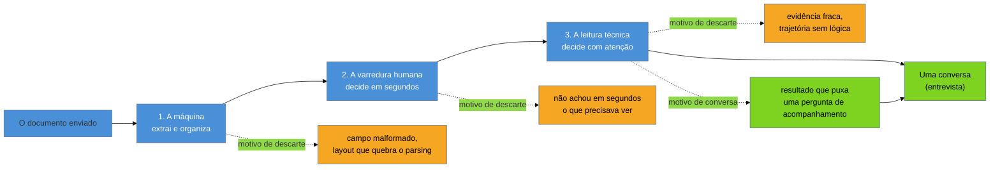

# Para que serve um currículo

> [!abstract] TL;DR
> Um currículo tem **um objetivo único: gerar uma conversa**, não relatar uma vida — e a maior parte dos currículos ruins nasce de confundir os dois. Três enquadramentos errados competem pelo lugar do objetivo certo: tratar o documento como autobiografia (contar tudo o que aconteceu), como lista de tudo (provar competência por acúmulo) ou como vitrine gráfica (impressionar pelo design). Os três erram porque esquecem quem está do outro lado — um leitor apressado e cético, cujo trabalho profissional é achar motivo pra descartar, não motivo pra aprovar. A formulação que resolve isso é simples de enunciar e difícil de executar: um bom currículo **remove motivo de descarte e cria motivo de conversa**. E vale registrar, desde a primeira nota, o contrapeso honesto que este galho inteiro carrega: o currículo te coloca na fila — quem te tira dela costuma ser uma pessoa.

## "Alguém aqui tem um template pra me passar?"

> [!example] Caso real
> "Alguém aqui tem um template de currículo para me passar?" É uma pergunta recorrente em grupos de tecnologia no WhatsApp e no Discord — recorrente o bastante para abrir um post inteiro sobre o assunto. Josenaldo Matos descreve isso em [Como escrever o seu currículo como desenvolvedor](https://josenaldo.com.br/blog/como-escrever-o-seu-curriculo): "Volta e meia alguém pede um modelo pronto, porque não sabe por onde começar." A cena que segue é sempre parecida — a pessoa abre o editor de texto, digita o nome, e trava diante da tela em branco por vinte minutos, começa a listar tecnologias, apaga, copia o currículo de um amigo como base, muda o nome, e manda.

Vale parar um segundo nessa cena antes de seguir em frente, porque ela não é sobre preguiça nem sobre falta de competência técnica — é sobre um vácuo de critério. Quem pede um template não está pedindo um layout; está pedindo alguém que já decidiu, em lugar dela, o que um currículo precisa conter e por quê. E um template emprestado resolve o problema errado: ele copia a **forma** de um documento que funcionou para outra pessoa, numa vaga diferente, com uma trajetória diferente, sem nunca responder a pergunta que deveria vir antes de qualquer formatação — para que, exatamente, esse documento serve?

Essa é a pergunta que esta nota responde, porque é a única pergunta cuja resposta muda todas as decisões que vêm depois. Sem ela, cada seção do currículo — o cabeçalho, o sumário, a experiência, as habilidades — vira uma escolha isolada, guiada por instinto ou por imitação de um modelo alheio. Com ela, cada seção do galho que segue esta nota — de [[03-Dominios/Carreira/Currículo/02 - As portas de entrada no mercado|02]] a [[03-Dominios/Carreira/Currículo/26 - Seis currículos, uma carreira|26]] — deixa de ser uma lista de regras soltas e passa a ser a aplicação repetida de um único critério.

## Um objetivo, e só um

Vale começar por uma ironia que ajuda a explicar por que o primeiro enquadramento errado é tão sedutor: a expressão latina *curriculum vitae*, de onde vem o nome do próprio documento, significa literalmente "o curso da vida" — e é fácil, a partir daí, concluir que o documento deveria mesmo contar essa vida inteira, do começo ao fim. Mas o nome descreve a origem histórica do gênero, não a função que ele cumpre hoje num processo seletivo de tecnologia. O documento herdou o nome de uma tradição mais ampla de credencial acadêmica e profissional; herdou, junto com o nome, uma tentação de tratar "curso da vida" como sinônimo de "tudo que aconteceu", quando o que o mercado de trabalho atual precisa dele é muito mais estreito.

Uma forma útil de calibrar o que um currículo é, antes de discutir o que ele deveria conter, é compará-lo a outro gênero de documento que a maioria das pessoas já conhece de outro contexto: um *one-pager* de vendas, ou a primeira página de uma proposta comercial. Ninguém espera que um *one-pager* conte a história completa da empresa que o produziu — ele existe para fazer uma coisa só, que é conseguir uma segunda reunião. Um currículo cumpre exatamente essa função: não é o produto final da avaliação, é o convite para a etapa em que a avaliação de verdade acontece. Tratá-lo como qualquer outra coisa — um dossiê completo, um portfólio, uma prova documental de valor — é pedir ao documento errado para fazer um trabalho que não é dele.

Um currículo tem um objetivo, e é útil dizê-lo em voz alta antes de discutir qualquer seção específica: **fazer com que alguém, do outro lado, decida conversar com você**. Não é convencer o leitor de que você é a melhor pessoa do mundo para o cargo — essa decisão nunca é tomada só com base num documento de uma ou duas páginas. Não é registrar tudo o que você fez na carreira — isso é o papel de um portfólio, de um LinkedIn completo, ou de uma conversa mais longa. O currículo existe para produzir uma decisão específica, pequena e barata: **vale a pena investir vinte minutos de uma ligação, ou uma hora de entrevista, para saber mais sobre essa pessoa?**

Tratar o currículo como se ele tivesse esse objetivo único — e nenhum outro — muda o critério de cada frase que entra no documento. Uma informação só merece espaço se ela empurra o leitor em direção a essa decisão de conversar. Se uma linha não faz isso — se ela só preenche espaço, prova um ponto que ninguém pediu, ou reafirma algo já óbvio pelo cargo anterior — ela é candidata a sair, não importa quão verdadeira ou quão orgulho ela cause em quem escreveu. Essa é a régua que separa um currículo enxuto de um currículo curto por preguiça: o enxuto cortou o que não serve ao objetivo; o preguiçoso simplesmente não escreveu.

Vale notar, também, o que essa formulação **não** diz. Ela não diz que o currículo precisa ser modesto, nem que exagero é proibido por princípio — a [[03-Dominios/Carreira/Currículo/19 - Declarar lacuna|nota 19]] trata da fronteira entre honestidade estratégica e autodepreciação. E ela não diz que o currículo é o único documento que importa na busca por emprego — o galho inteiro reconhece, e a última seção desta nota reforça, que boa parte do que de fato move a agulha acontece fora do documento. O que a formulação diz é mais estreito e mais útil: **dentro do espaço de uma ou duas páginas, cada decisão de conteúdo se resolve perguntando se ela aproxima ou afasta o leitor da decisão de conversar.**

Um jeito prático de aplicar esse critério, linha por linha, é fazer quatro perguntas curtas antes de decidir se algo fica ou sai do documento:

- Essa informação ajuda o leitor a entender, mais rápido, se eu tenho o requisito básico da vaga?
- Se eu cortasse essa linha, o documento perderia algum motivo concreto para gerar interesse?
- Essa linha prova alguma coisa, ou só afirma? ("Proativo" afirma; "reduzi o tempo de deploy de 40 minutos para 5" prova.)
- Essa informação é sobre mim, ou é sobre o que o leitor precisa decidir?

Uma linha que passa nas quatro perguntas quase sempre merece o espaço que ocupa. Uma linha que falha em pelo menos duas é candidata forte a sair — não porque seja falsa, mas porque não está fazendo o trabalho que o documento existe para fazer. É essa disciplina, aplicada seção por seção, que separa currículo enxuto de currículo raso: o primeiro cortou o que não servia; o segundo nunca chegou a preencher o que servia.

## Os três enquadramentos errados

A maioria dos currículos ruins não é malfeita por incompetência — é malfeita porque parte de um enquadramento errado sobre o que o documento deveria ser. Três enquadramentos aparecem com uma frequência alta o bastante para merecer nome próprio, porque cada um puxa o autor numa direção sistematicamente diferente do objetivo único descrito acima.

### O currículo como autobiografia

O primeiro enquadramento trata o currículo como um relato cronológico da própria vida profissional — cada cargo, cada responsabilidade, cada mudança de rumo, contados em ordem, como se o leitor precisasse entender a história inteira para julgar o presente. É o enquadramento mais intuitivo, porque é como a maioria das pessoas naturalmente conta a própria trajetória quando alguém pergunta "me fala sobre você" numa conversa informal — e é exatamente por ser intuitivo que ele passa despercebido como erro.

O problema não é incluir experiência passada — é claro que ela importa, e a [[03-Dominios/Carreira/Currículo/16 - A seção de experiência profissional|nota 16]] trata dela em profundidade. O problema é organizar o documento em torno da lógica de "isso é o que aconteceu comigo, em ordem", em vez de "isso é o que você precisa saber pra decidir se vale a pena conversar comigo". Um relato cronológico completo é interessante para quem já decidiu te conhecer — é o material de uma entrevista, não de um documento de triagem.

Vale entender por que esse enquadramento é tão difícil de largar, mesmo depois de reconhecê-lo como erro: contar a própria trajetória em ordem é como qualquer pessoa organiza a própria memória — cronologicamente, com causa e efeito entre um capítulo e o próximo. Cortar essa ordem para reorganizar o conteúdo por relevância, em vez de por sequência temporal, exige um esforço editorial que não é natural para ninguém, porque significa tratar a própria história como material bruto a ser recortado, não como narrativa a ser preservada inteira. É esse mesmo esforço — editar, não só narrar — que separa um currículo bem escrito de um relato honesto mal organizado.

> [!example] Caso fictício
> Marina, desenvolvedora pleno com seis anos de experiência, escreve o currículo como quem escreve um resumo de carreira para si mesma. Abre com uma frase sobre como descobriu programação no ensino médio, mencionando o curso técnico, o primeiro estágio numa empresa que já não existe, uma passagem breve por suporte técnico antes de conseguir a primeira vaga de desenvolvedora, e só então chega à experiência dos últimos quatro anos — que é, na prática, a única parte que qualquer recrutador de vaga pleno vai considerar relevante. O documento não está errado em nenhuma frase individual; está errado na lógica que organiza o espaço, dedicando linhas valiosas a uma trajetória de origem que ninguém, do outro lado, precisa conhecer para decidir se marca uma conversa.

### O currículo como lista de tudo

O segundo enquadramento trata o currículo como prova de competência por acúmulo — quanto mais tecnologias, cursos, certificados e ferramentas aparecerem, maior a chance de impressionar. É uma lógica compreensível: se o leitor não sabe exatamente o que procura, mais informação parece sempre mais seguro do que menos. Na prática, o efeito é o oposto — um documento que lista trinta tecnologias sem hierarquia nenhuma não comunica profundidade em nada, comunica dispersão em tudo, e obriga o leitor a fazer o trabalho de filtrar o que importa, trabalho que ele, na maior parte das vezes, simplesmente não vai fazer.

Esse enquadramento tem um nome próprio dentro do galho — a [[03-Dominios/Carreira/Currículo/09 - Habilidades técnicas|nota 09]] chama esse padrão de "Alphabet Soup" e trata em detalhe da regra de lastro que evita cair nele: não liste o que você não sustenta numa pergunta de acompanhamento. Aqui basta reconhecer o mecanismo — a lista de tudo nasce do medo de deixar algo relevante de fora, e produz, como efeito colateral, um documento onde nada se destaca porque tudo compete pela mesma atenção.

A raiz psicológica desse enquadramento é o medo de omissão, não a vaidade — quem já passou por um processo seletivo sabe a sensação de descobrir, tarde demais, que a vaga pedia exatamente a tecnologia que ficou de fora do currículo por parecer irrelevante demais para mencionar. Esse medo é legítimo, mas a resposta a ele não é incluir tudo — é adaptar a lista por vaga, o que a [[03-Dominios/Carreira/Currículo/18 - Adaptar por vaga sem reescrever|nota 18]] trata em detalhe. Completude e relevância parecem, à primeira vista, a mesma coisa; na prática, quanto mais completa a lista fica, menos ela comunica relevância para qualquer vaga específica, porque relevância é sempre relativa a um contexto, e uma lista de tudo recusa, por definição, escolher um contexto.

> [!example] Caso fictício
> Rafael, recém-formado, monta o currículo pensando em cada curso que já fez, cada linguagem que já tocou, cada framework que testou num fim de semana. A seção de habilidades técnicas tem quatro linhas de tecnologias separadas por vírgula — da linguagem que ele usa profissionalmente há um ano até uma biblioteca que ele abriu uma vez para seguir um tutorial. Um recrutador que abre esse currículo, procurando confirmar rapidamente se o candidato tem a stack principal da vaga, precisa ler a lista inteira para achar o termo que importa, porque não há nenhuma hierarquia entre "sei usar profissionalmente" e "já ouvi falar". O documento tenta provar amplitude e, ao fazer isso, torna invisível justamente a profundidade que existia.

### O currículo como vitrine gráfica

O terceiro enquadramento trata o currículo como uma peça de design — um objeto visual que precisa impressionar antes mesmo de ser lido, com ícones, colunas, barras de proficiência e paleta de cores cuidadosamente escolhida. É o enquadramento mais fácil de entender e mais difícil de largar, porque um currículo bonito produz uma satisfação imediata e visível em quem o fez — amigos elogiam, o autor se sente orgulhoso do resultado — mesmo quando o documento carrega um problema estrutural que só aparece do lado de quem recebe o arquivo, não de quem o desenha.

Vale uma ressalva importante aqui, porque é fácil simplificar demais: a ferramenta de design não é a vilã. A [[03-Dominios/Carreira/Currículo/04 - Quem lê o seu currículo — e o que a evidência diz|nota 04]] já examinou isso com cuidado — o problema real não é usar Canva, Figma ou qualquer editor gráfico; é que esse tipo de ferramenta convida a decisões de layout (colunas lado a lado, ícones no lugar de texto, caixas sobrepostas) que tendem a atrapalhar a extração de texto por máquina e a leitura rápida por humano ao mesmo tempo. Um documento de duas colunas feito no Word tem exatamente o mesmo problema estrutural que um feito no Canva — a causa é o layout escolhido, não o programa usado para produzi-lo. A [[03-Dominios/Carreira/Currículo/05 - Formato e legibilidade de máquina|nota 05]] trata do mecanismo em detalhe; esta nota fica só com o enquadramento: quando o objetivo declarado (ainda que implicitamente) é "impressionar visualmente", cada decisão passa a otimizar para estética, e a comunicação — o objetivo real — vira coadjuvante.

> [!example] Caso fictício
> Bianca, estagiária buscando a primeira vaga, monta um currículo num template de design bonito — competências à esquerda numa coluna colorida, com barras de progresso indicando o nível em cada ferramenta, ícones ao lado de e-mail e telefone, uma foto de perfil bem posicionada. O resultado, visto na tela, parece o de uma pessoa cuidadosa e capaz. O problema aparece só do outro lado: uma barra de progresso não tem equivalente textual nenhum — "React ■■■■□ 80%" não diz nada mensurável a ninguém, nem à máquina, nem ao humano — e o layout em colunas quebra a ordem de leitura que qualquer sistema de triagem espera. Bianca não errou por falta de cuidado; errou porque o critério que guiou cada escolha foi visual, não comunicativo.

O padrão por trás desse caso — um elemento visual que parece comunicar algo mas não tem nenhum conteúdo textual equivalente por baixo — se repete em alguns elementos gráficos comuns o bastante para valer uma tabela de referência rápida, cada um com o equivalente textual que carrega a mesma informação sem depender de layout:

| Elemento decorativo | O que parece comunicar | Equivalente textual que de fato comunica |
| --- | --- | --- |
| Barra de progresso de habilidade | "Nível X% em React" | "3 anos usando React em produção" |
| Ícone sem texto ao lado (telefone, e-mail) | Contato disponível | O próprio número ou e-mail, em texto puro |
| Colunas lado a lado | Organização visual densa | Seções empilhadas, uma coluna, com hierarquia por título |
| Foto de perfil | Profissionalismo, identidade | Nome completo em destaque no cabeçalho |

A lógica que atravessa a tabela inteira é sempre a mesma: **um elemento gráfico só vale a pena se ele carrega informação que também existe em texto puro por baixo dele** — a barra de progresso falha porque não existe; o ícone de contato só funciona se o dado ao lado dele também está em texto; a coluna só é um problema porque rearranja a ordem de leitura sem nenhum ganho de conteúdo. A [[03-Dominios/Carreira/Currículo/05 - Formato e legibilidade de máquina|nota 05]] aprofunda cada um desses pontos com o mecanismo técnico completo.

Os três enquadramentos têm uma estrutura em comum que vale nomear antes de seguir: cada um deles responde a uma pergunta diferente da que o leitor realmente faz, e é essa troca de pergunta — silenciosa, quase sempre não percebida por quem escreve — que produz o documento errado mesmo quando cada frase individual é verdadeira.

| Enquadramento | Pergunta que ele responde | Pergunta que o leitor realmente faz |
| --- | --- | --- |
| Autobiografia | "Como cheguei até aqui?" | "Você resolve o problema que eu tenho agora?" |
| Lista de tudo | "Tudo que eu já toquei conta a meu favor?" | "Você tem, com profundidade, o que esta vaga específica exige?" |
| Vitrine gráfica | "Isso parece cuidado e profissional?" | "Consigo, em segundos, achar o que preciso ver?" |

## O currículo como peça de comunicação

Vale distinguir "peça de comunicação" de dois outros gêneros com os quais o currículo é comumente confundido, porque a confusão entre gêneros é, ela mesma, uma fonte de enquadramento errado. Uma carta de apresentação — tratada à parte, com sua própria evidência contraditória, na [[03-Dominios/Carreira/Currículo/18a - A carta de apresentação|nota 18a]] — é uma peça mais discursiva, com espaço para contexto e voz pessoal que o currículo não tem. Um perfil de LinkedIn, tratado na [[03-Dominios/Carreira/Currículo/23 - LinkedIn — o par que responde a busca|nota 23]], serve a uma função de descoberta contínua, não de resposta pontual a uma vaga específica. O currículo ocupa um espaço mais estreito que os dois: uma resposta objetiva, de leitura rápida, a uma decisão específica sobre uma vaga específica — e é justamente essa estreiteza que torna a formulação desta nota tão exigente.

Os três enquadramentos acima têm uma coisa em comum, e nomear essa coisa é o que resolve todos os três de uma vez: cada um deles esquece que existe um leitor específico do outro lado, com um tempo específico e um critério específico — e escreve, em vez disso, para si mesmo, para a própria história, para o próprio acervo de competências, ou para o próprio gosto estético. Um currículo não é um registro. É uma **peça de comunicação**, no sentido mais literal do termo: um documento produzido por alguém, com a intenção deliberada de mudar o que outra pessoa pensa e faz a seguir.

E o leitor dessa peça específica tem duas características que quase nenhum outro gênero de escrita profissional precisa enfrentar ao mesmo tempo: ele está com **pressa**, e ele está **cético**. A [[03-Dominios/Carreira/Currículo/04 - Quem lê o seu currículo — e o que a evidência diz|nota 04]] já detalhou a estrutura de três leitores em sequência — a máquina que extrai texto, o humano que varre em segundos, o humano que lê com atenção — e o que a evidência disponível sustenta sobre cada etapa; esta nota não repete os números nem as fontes de lá, e remete a eles sempre que a pergunta for "quanto tempo" ou "quão automático". O que importa aqui é o que essa estrutura implica sobre a postura do leitor: em pelo menos duas das três etapas, o trabalho dele não é procurar motivo para aprovar — é procurar motivo para descartar.

Essa inversão merece ser dita com todas as letras, porque ela contradiz a intuição de quem escreve. Um candidato, ao redigir o próprio currículo, naturalmente pensa em como se apresentar da melhor forma — está numa postura de venda, tentando convencer. Mas quem recebe dezenas ou centenas de candidaturas para uma única vaga não tem tempo nem energia para avaliar cada uma com a mesma generosidade; a única forma prática de reduzir o volume a algo administrável é eliminar rápido, e eliminar rápido significa procurar ativamente por um motivo — qualquer motivo suficiente — para tirar aquele documento da pilha. Não é maldade, nem desrespeito ao candidato: é a única estratégia viável diante de um volume que nenhum ser humano consegue avaliar com cuidado igual, item a item.

E o ceticismo tem uma origem concreta, não é traço de personalidade do recrutador: todo mundo que já leu currículo suficiente viu a mesma frase repetida centenas de vezes — "comunicativo, proativo, trabalho bem em equipe" — sem nenhuma evidência atrás. Depois de ver isso repetido à exaustão, o leitor experiente para de acreditar em afirmação sem prova, e passa a tratar qualquer alegação não sustentada como ruído a ser descontado, não como sinal a ser somado. Isso não é um capricho do leitor — é um mecanismo de defesa razoável contra um gênero de escrita que, historicamente, se acostumou a inflar.

Há um jeito mais formal de nomear a pressa do primeiro leitor, que ajuda a explicar por que ela não é preguiça nem desrespeito: o economista **Herbert Simon** descreveu, décadas atrás, a ideia de que a maioria das decisões humanas, sob restrição real de tempo e informação, não busca a melhor opção possível — busca a primeira opção *boa o suficiente*, um comportamento que ele chamou de *satisficing*. Um recrutador triando um volume alto de candidaturas não está procurando o candidato perfeito em cada currículo que abre; está procurando sinais rápidos e suficientes para decidir "isso passa" ou "isso não passa", e segue para o próximo assim que a decisão está tomada. Escrever um currículo pensando nesse comportamento — dar sinais claros e imediatos, em vez de exigir que o leitor monte o quebra-cabeça sozinho — é escrever para o leitor real, não para um leitor ideal que nunca existiu.

Essa pressa e esse ceticismo, juntos, explicam por que cada seção do documento existe para responder a uma pergunta específica e implícita — nenhuma delas escrita literalmente em lugar nenhum, mas todas presentes na cabeça de quem está triando. Nomear essas perguntas, seção por seção, é o que transforma a estrutura convencional de um currículo de "assim que se faz" em "assim que se faz porque resolve um problema real do leitor":

| Seção | Pergunta implícita do leitor | Nota que aprofunda |
| --- | --- | --- |
| Cabeçalho | Quem é essa pessoa, e como eu entro em contato? | [[03-Dominios/Carreira/Currículo/06 - Cabeçalho e identidade\|06]] |
| Sumário | Vale a pena continuar lendo o resto? | [[03-Dominios/Carreira/Currículo/07 - O sumário profissional\|07]] |
| Experiência | O que essa pessoa realmente fez, e importou? | [[03-Dominios/Carreira/Currículo/16 - A seção de experiência profissional\|16]] |
| Habilidades técnicas | Ela tem a stack que a vaga exige? | [[03-Dominios/Carreira/Currículo/09 - Habilidades técnicas\|09]] |
| Formação | Qual é o contexto educacional dessa trajetória? | [[03-Dominios/Carreira/Currículo/08 - Formação, cursos e certificações\|08]] |

Nenhuma dessas seções existe por convenção arbitrária ou porque "todo currículo tem isso" — cada uma existe porque responde a uma pergunta que o leitor, apressado e cético, precisa resolver antes de decidir marcar uma conversa. Um documento que segue a estrutura convencional sem entender a pergunta por trás de cada seção corre o risco de preencher o espaço certo com o conteúdo errado — um cabeçalho tecnicamente completo que não facilita o contato, um sumário presente que não convence ninguém a continuar lendo.

> [!question]- Isso soa cínico. O recrutador não está do meu lado, torcendo por mim?
> Em algum nível, sim — ninguém quer preencher uma vaga difícil, e um bom candidato resolve um problema real para quem contrata. Mas "torcer por você" e "ter tempo e energia ilimitados para avaliar você com cuidado" são coisas diferentes, e o volume de candidaturas de uma vaga concorrida raramente permite as duas ao mesmo tempo. O jeito produtivo de pensar nisso não é como adversário versus aliado, é como alguém com um problema de tempo genuíno, resolvendo esse problema com a única ferramenta disponível — eliminação rápida — até sobrar um grupo pequeno o bastante para dar atenção de verdade. Escrever pensando nesse leitor real, com essa restrição real, produz um documento melhor do que escrever pensando num leitor idealizado que vai ler cada linha com paciência infinita.

> [!question]- E se a minha trajetória for incomum — uma transição de carreira, um hiato, um caminho que não segue a ordem esperada?
> Uma trajetória incomum não quebra a formulação, só muda o que "criar motivo de conversa" precisa fazer. Em vez de esconder a irregularidade (o que costuma ler como evasão) ou explicá-la em detalhe no próprio currículo (o que costuma virar autobiografia disfarçada), o documento deixa a irregularidade visível e deixa a explicação para a conversa — que é, afinal, o objetivo único que esta nota descreve. A [[03-Dominios/Carreira/Currículo/02 - As portas de entrada no mercado|nota 02]] trata das dez portas de entrada que produzem esse tipo de trajetória não linear, e a [[03-Dominios/Carreira/Currículo/19 - Declarar lacuna|nota 19]] trata especificamente de onde e como declarar uma lacuna sem que ela vire motivo de descarte.

## A formulação que fecha: remove motivo de descarte e cria motivo de conversa

Juntando o objetivo único com o retrato honesto do leitor, chega-se à formulação que organiza o resto do galho inteiro, do cabeçalho ao capstone: **um bom currículo remove motivo de descarte e cria motivo de conversa.** As duas metades não são a mesma coisa, e vale separá-las com cuidado, porque é comum confundir uma pela outra.

**Remover motivo de descarte** é um trabalho essencialmente defensivo. Não é sobre impressionar — é sobre não dar ao leitor apressado nenhum pretexto barato para eliminar o documento antes mesmo de chegar à parte que importa. Um layout que quebra a extração de texto é motivo de descarte. Um cabeçalho sem a tecnologia principal da vaga visível no topo é motivo de descarte. Um erro de português numa frase de destaque é motivo de descarte. Uma afirmação genérica sem lastro ("proativo, comunicativo") não chega a ser motivo de descarte por si só, mas é ruído que consome espaço sem empurrar nada na direção certa — e espaço, num documento de uma ou duas páginas, é o recurso mais escasso que existe. É esse lado da formulação que as notas [[03-Dominios/Carreira/Currículo/05 - Formato e legibilidade de máquina|05]], [[03-Dominios/Carreira/Currículo/06 - Cabeçalho e identidade|06]] e [[03-Dominios/Carreira/Currículo/09 - Habilidades técnicas|09]] endereçam com mais detalhe — todas elas sobre como não dar munição para uma eliminação rápida e barata.

**Criar motivo de conversa** é o lado ofensivo, e é onde a maioria dos currículos fracos fica devendo mesmo depois de acertar o lado defensivo. Um currículo pode ser tecnicamente limpo — sem erro de formatação, sem cliché vazio — e ainda assim não dar ao leitor nenhum gancho concreto para querer saber mais. Criar motivo de conversa significa deixar, no documento, pontos específicos o bastante para gerar curiosidade genuína: um resultado que faz o leitor pensar "como assim, conta mais"; uma decisão técnica que sugere julgamento, não só execução; uma trajetória que tem lógica interna visível, não uma lista solta de cargos. É esse lado que as notas sobre a [[03-Dominios/Carreira/Currículo/11 - A linha de bullet|linha de bullet]], os [[03-Dominios/Carreira/Currículo/14 - Números que você pode defender|números que você pode defender]] e a [[03-Dominios/Carreira/Currículo/13 - Responsabilidade, realização e alavancagem|escada de alavancagem]] existem para ensinar — como transformar uma frase neutra numa frase que puxa uma pergunta de acompanhamento.

Um exemplo curto ajuda a ver as duas metades operando na mesma frase, porque a diferença entre uma versão e outra não está em nenhum fato novo, só em quanto de cada metade a frase carrega. "Responsável pela manutenção do sistema de faturamento" não afasta ninguém, mas também não puxa nenhuma pergunta — é neutro nas duas metades ao mesmo tempo, e por isso passa despercebido, sem nunca ser lembrado. "Reduzi em 30% o tempo de fechamento mensal do faturamento, automatizando três etapas manuais que a equipe fazia por planilha" remove o motivo de descarte que a primeira versão já não tinha, mas cria, além disso, pelo menos três perguntas de acompanhamento óbvias — que etapas, por que eram manuais, como o número foi medido — e é exatamente essa segunda função que faz a diferença entre um bullet esquecível e um bullet que sustenta uma entrevista inteira.

Vale notar que as duas metades não competem pelo mesmo espaço da mesma forma — um erro comum é achar que "remover motivo de descarte" significa cortar tudo até sobrar o mínimo seguro, e que isso, sozinho, já é suficiente. Não é. Um currículo perfeitamente limpo, sem nenhum erro, sem nenhum cliché, mas também sem nenhum ponto de interesse real, sobrevive à triagem e morre na terceira leitura — a mais lenta e a mais decisiva, segundo a nota 04. As duas metades da formulação precisam acontecer juntas: o documento tem que sobreviver às duas primeiras leituras rápidas **e** merecer a atenção da terceira.

O diagrama mostra as duas metades operando em pontos diferentes do mesmo caminho: **remover motivo de descarte** age nas três etapas de leitura, evitando as saídas laterais em laranja; **criar motivo de conversa** age concentradamente na última etapa, empurrando o documento para a saída verde — a única que de fato importa no final. Um currículo pode sobreviver às três etapas sem nunca produzir o segundo efeito, e é exatamente esse o retrato do documento "seguro, mas esquecível" que tantas pessoas produzem sem entender por que não recebem retorno.

> [!warning] Otimizar só o lado defensivo
> **O que acontece:** o candidato revisa o currículo obcecado por eliminar qualquer possível motivo de descarte — corrige formatação, ajusta palavras-chave, remove clichês — e considera o trabalho terminado quando não encontra mais nada "errado". **Por quê:** o lado defensivo é mais fácil de verificar objetivamente (um erro de formatação ou uma palavra-chave ausente é binário — está lá ou não está), enquanto o lado ofensivo exige julgamento sobre o que realmente desperta interesse, que é mais difícil de autoavaliar. **Como evitar:** depois de garantir que nada afasta o leitor, pergunte especificamente: que frase deste documento, se um entrevistador a lesse em voz alta, faria ele querer perguntar "como assim, me conta mais"? Se a resposta for "nenhuma", o documento está seguro e vazio ao mesmo tempo — e vazio também é, de um jeito mais silencioso, um motivo de descarte.

## Por que esta nota abre o galho

Vale nomear uma escolha de ordem que não é acaso: esta é a nota 01, mas não foi a primeira a ser escrita — a [[03-Dominios/Carreira/Currículo/04 - Quem lê o seu currículo — e o que a evidência diz|nota 04]] foi redigida antes, precisamente para que o vocabulário de evidência que ela estabelece (o que tem evidência sólida, o que é plausível mas não medido, o que é caixa-preta declarada) já estivesse disponível para esta nota citar, em vez de reabrir a discussão do zero. A ordem de leitura, porém, é a inversa da ordem de escrita, e por um motivo estrutural: esta nota estabelece o **critério** — o objetivo único, os enquadramentos errados, a formulação de duas metades — que todas as outras 25 notas do galho, incluindo a 04, aplicam a um pedaço específico do documento. Sem o critério desta nota, "quem lê o seu currículo" seria só um capítulo de curiosidades sobre ATS; com ele, vira a primeira aplicação concreta de uma régua que se repete até o capstone.

Essa é a mesma disciplina que a nota 04 descreve sobre si mesma, aplicada aqui na direção oposta: uma nota que estabelece vocabulário antes das que vão usá-lo evita que o mesmo conceito seja reinventado, com nuances ligeiramente diferentes, em cinco lugares distintos do galho — o que, ao longo de 26 notas, corroeria a coerência do todo tanto quanto um mito mal verificado repetido sem checagem.

Um jeito prático de verificar se essa nota está cumprindo o papel de âncora do vocabulário é observar o que acontece quando outra nota do galho discorda, na superfície, do que foi dito aqui. A [[03-Dominios/Carreira/Currículo/18a - A carta de apresentação|nota 18a]], por exemplo, vai admitir que a evidência sobre um documento complementar é genuinamente contraditória — o que parece, à primeira vista, tensionar a ideia de um critério único aplicado sem exceção. Não tensiona: o critério desta nota (objetivo único, leitor específico, formulação de duas metades) segue valendo; o que muda, nota a nota, é só o material concreto disponível para aplicá-lo — às vezes farto e sólido, às vezes escasso e contestado, como a nota 04 já ensinou a reconhecer e declarar sem disfarce.

## O currículo te coloca na fila — quem te tira dela costuma ser uma pessoa

Fecha esta nota, e abre o galho inteiro, um contrapeso que seria desonesto omitir: por melhor que um currículo seja escrito, ele não é, sozinho, a força que decide uma contratação. Ele coloca você **na fila** — na lista de quem merece uma primeira conversa. Mas quem tira você dessa fila, na prática concreta da maioria dos processos, quase sempre é uma pessoa — um recrutador que reconhece, numa linha do seu currículo, um padrão que já viu funcionar antes; um gestor que recebe uma indicação de alguém em quem confia e pula direto para a entrevista; um par técnico que, numa conversa de cinco minutos num evento ou numa thread do LinkedIn, decide levar seu nome para dentro do processo antes mesmo de qualquer triagem formal acontecer.

Isso não desvaloriza o trabalho de escrever um currículo bom — pelo contrário, é o que dá esse trabalho um limite honesto. O documento é necessário, mas raramente é suficiente sozinho, e tratar a escrita do currículo como se fosse a variável que resolve tudo é o mesmo erro de enquadramento, só que num nível acima: em vez de confundir o objetivo do documento, confunde-se o papel do documento dentro da busca inteira por uma vaga.

Vale notar que "necessário, mas raramente suficiente" não é uma forma educada de dizer "o currículo não importa". Mesmo nos casos em que uma indicação abre a porta, quase sempre existe um momento em que alguém — o próprio recrutador, um segundo gestor, um comitê de contratação — vai pedir o documento formal antes de seguir adiante, e um currículo malfeito nesse momento pode desperdiçar uma vantagem que custou meses de rede e reputação para construir. O documento e a rede não competem pelo mesmo espaço de esforço; eles resolvem dois problemas diferentes, e um problema resolvido não substitui o outro sem resolver. Josenaldo Matos trata essa distinção diretamente em [Por que ainda sou invisível?](https://josenaldo.com.br/blog/por-que-ainda-sou-invisivel), com a metáfora de caçar (*hunting* — enviar candidaturas, uma a uma, competindo num funil com taxa de conversão baixa) contra plantar (*farming* — cultivar reputação e relacionamento até que oportunidades comecem a chegar por indicação, não por candidatura fria). O currículo bem escrito melhora a taxa de conversão da caça — é o que este galho ensina, nota a nota. Mas ele não substitui o plantio, e boa parte de quem "tira alguém da fila" antes mesmo de uma triagem formal existir é fruto exatamente desse segundo trabalho, mais lento e menos visível.

Vale ser concreto sobre o que esse "plantio" significa na prática, porque é fácil tratá-lo como conselho vago demais para agir — e o próprio blog do autor, na sequência do trecho citado acima, o descreve como algo que se constrói de forma deliberada, não como sorte:

- manter uma presença técnica visível — contribuições públicas, projetos documentados, participação em comunidade — que dá a outras pessoas algo concreto para reconhecer antes mesmo de qualquer candidatura formal existir;
- cultivar relacionamento profissional continuamente, não só quando se está procurando vaga — porque uma indicação genuína raramente nasce de um contato feito na semana em que a busca começou;
- manter o material de evidência (o [[03-Dominios/Carreira/Currículo/21 - O brag document|brag document]], tratado adiante no galho) sempre atualizado, para que uma oportunidade inesperada — uma indicação, uma mensagem fria de recrutador, um convite de ex-colega — encontre material pronto, não um currículo de dois anos atrás para ser reconstruído às pressas.

Nenhum desses três itens substitui um currículo bem escrito — eles operam em paralelo, aumentando a chance de alguém chegar até você por um caminho que nunca passa pela triagem fria descrita na [[03-Dominios/Carreira/Currículo/04 - Quem lê o seu currículo — e o que a evidência diz|nota 04]]. Mas nenhum currículo, por melhor que seja, substitui esse trabalho — e é essa consciência, mais do que qualquer técnica de escrita, que separa quem trata a busca por vaga como um problema de documento de quem a trata como o que ela realmente é: um problema de comunicação continuada, do qual o documento é só a parte mais visível.

Esse contrapeso não é um desvio de assunto — é o gancho que sustenta duas notas mais adiante no galho. A [[03-Dominios/Carreira/Currículo/20 - A âncora|nota 20]] trata do sistema por trás do documento — a ideia de que currículo, LinkedIn, pitch de entrevista e conversa de corredor são quatro saídas diferentes da mesma base de evidência, e que investir nessa base compensa mais do que reescrever o currículo do zero a cada vaga. E o [[03-Dominios/Carreira/Currículo/26 - Seis currículos, uma carreira|capstone]], a última nota do galho, mostra seis currículos reais ancorados em seis trajetórias — um exercício que só faz sentido depois de aceitar que o documento é uma peça dentro de uma estratégia maior, não a estratégia inteira.

Vale terminar onde a nota começou. A pergunta "alguém tem um template pra me passar?" pede uma resposta pronta para o problema errado. O template certo não é um arquivo — é o critério: um objetivo único, um leitor específico, e uma formulação de duas metades que cabe em uma frase. O resto deste galho é a aplicação repetida desse critério, seção por seção, nível por nível, até chegar ao ponto em que o próprio autor reconhece o limite dele.

E o limite reconhecido aqui não é retórico — é o que separa este galho de qualquer guia que promete resolver a busca por emprego inteira com um documento melhor. Um currículo que remove todo motivo de descarte e cria motivo de conversa fez, sozinho, o que um documento consegue fazer. O que acontece depois — a conversa em si, a rede que trouxe a oportunidade antes mesmo do documento ser necessário, a reputação que faz alguém vouch por você sem que ninguém peça — é trabalho de outra natureza, tratado com a mesma honestidade ao longo do galho, sem nunca fingir que o documento sozinho resolveria tudo.

## Quando esta formulação pesa menos

Vale uma ressalva de honestidade antes de fechar esta nota: a formulação "remove motivo de descarte e cria motivo de conversa" pressupõe um cenário específico — uma candidatura que vai, de fato, passar por algum tipo de triagem por documento, feita por alguém que não conhece o candidato de antemão. Esse é o cenário mais comum, e é o que justifica um galho inteiro dedicado a currículo. Mas ele não é o único cenário possível, e vale nomear onde o peso do documento diminui, para não tratar a formulação como lei universal.

| Cenário | Por que o documento pesa menos | Onde investir em vez disso |
| --- | --- | --- |
| Vaga preenchida por indicação direta, sem processo formal | A pessoa que indica já resolveu, informalmente, boa parte do trabalho que o currículo faria | A rede e a reputação — a seção anterior desta nota, e a [[03-Dominios/Carreira/Currículo/20 - A âncora|nota 20]] |
| Contratação interna, movendo-se dentro da mesma empresa | O histórico de trabalho já é conhecido por quem decide | O relacionamento com o time de destino e o pitch verbal |
| Processo acadêmico ou de pesquisa | O gênero equivalente é o *Curriculum Vitae* completo, com lógica diferente da deste galho | Fora do escopo deste galho — CV acadêmico segue convenções próprias, não tratadas aqui |

Em nenhum desses três casos o currículo deixa de existir ou de importar — ele só deixa de ser a peça central da decisão, porque outra coisa (a indicação, o histórico já conhecido, a convenção do gênero acadêmico) já fez parte do trabalho que, no cenário padrão, o documento faria sozinho. A regra prática para saber em qual cenário você está: se alguém do outro lado já formou uma opinião sobre você antes de abrir o arquivo, o documento importa menos como filtro e mais como confirmação — e o que confirma bem muda pouco em relação ao que já foi discutido aqui, só muda o quanto de peso ele carrega sozinho.

## Casos práticos

Os dois cenários abaixo isolam, cada um, uma metade da formulação — porque é mais fácil enxergar o efeito de "remover motivo de descarte" e de "criar motivo de conversa" quando eles não estão misturados na mesma história.

> [!example] Caso fictício — o currículo enxuto que virou entrevista
> Um desenvolvedor pleno passa dois meses aplicando para vagas com um currículo de duas páginas organizado como histórico de carreira — quase uma autobiografia, com cada cargo desde o primeiro estágio, oito anos atrás. Nesses dois meses, ele envia o currículo para 40 vagas e recebe três respostas automáticas de rejeição; o resto, silêncio. Ele reescreve o documento aplicando a formulação desta nota: corta a metade mais antiga da experiência, reduz de dezoito bullets de responsabilidade para nove bullets de resultado, e move a seção de projetos pessoais — antes escondida na última página — para logo depois do sumário, porque é ali que tem o material mais forte para gerar conversa. O documento cai de duas páginas para uma. Nas quatro semanas seguintes, aplica para 15 vagas parecidas com as anteriores e recebe quatro chamadas de recrutador. Nada mudou na experiência real dele nesse intervalo — o que mudou foi quanto do documento sobrevivia à leitura rápida e quanto dele dava ao leitor um motivo concreto para continuar.

> [!example] Caso fictício — o currículo limpo que não gerava nenhuma pergunta
> Uma candidata a vaga sênior revisa o próprio currículo com cuidado técnico: corrige a formatação para coluna única, remove todo clichê sem evidência, garante que as tecnologias da vaga aparecem isoladas no texto, e confirma que o arquivo passa no teste de copiar e colar sem erro. O documento está, nesse sentido, impecável — nenhum motivo óbvio de descarte sobrevive à revisão. Ainda assim, em três meses de candidaturas para o mesmo tipo de vaga, ela passa da triagem inicial em boa parte dos processos, mas para na entrevista técnica com uma frequência incomum. Ao reler os próprios bullets de experiência, percebe o padrão: cada linha descreve o que ela fez ("liderei a migração do sistema de pagamento"), mas nenhuma descreve uma decisão específica, um trade-off considerado, ou um resultado que convide alguém a perguntar "como você chegou nesse número?". O documento removeu todo motivo de descarte e, ao fazer isso, parou — sem nunca ter criado um motivo de conversa. A correção não foi de formatação, foi de conteúdo: acrescentar, a cada bullet central, o dado que faz o entrevistador querer puxar o fio.

> [!example] Caso fictício — a vitrine gráfica que custou quatro vagas em silêncio
> Um designer de produto que também programa monta um currículo caprichado num editor visual, com ícones ao lado de cada seção, uma barra de habilidade para cada linguagem e um layout de duas colunas que ele considera coerente com a área em que atua. Aplica para seis vagas de front-end ao longo de dois meses, todas em empresas de porte médio que usam algum sistema de triagem — e não recebe retorno de nenhuma delas. Só na sétima candidatura, para uma vaga menor, sem nenhum sistema automatizado no meio, o mesmo currículo chega direto às mãos de um gestor, que o lê no arquivo original e chama para entrevista na mesma semana. A diferença entre as seis primeiras tentativas e a sétima não foi o conteúdo — foi se havia, ou não, uma etapa de extração de texto entre o envio e o primeiro par de olhos humanos. O currículo nunca foi ruim; ele só carregava, sem que o autor soubesse, um custo que só aparecia quando o caminho até o leitor passava por uma máquina.

Nenhum dos três casos depende de um algoritmo secreto nem de sorte — o primeiro mostra o efeito de reduzir o que afasta o leitor; o segundo mostra que reduzir isso, sozinho, não é o mesmo que dar ao leitor um motivo real para investir tempo; o terceiro mostra que uma peça de comunicação tecnicamente boa ainda pode falhar se o caminho até o leitor tem um obstáculo que o autor nunca chegou a considerar. As notas [[03-Dominios/Carreira/Currículo/11 - A linha de bullet|11]] e [[03-Dominios/Carreira/Currículo/14 - Números que você pode defender|14]] ensinam, em detalhe, como transformar o segundo tipo de bullet no primeiro; a [[03-Dominios/Carreira/Currículo/05 - Formato e legibilidade de máquina|nota 05]] resolve o terceiro caso.

## Armadilhas comuns

> [!warning] Escrever para si mesmo, não para o leitor
> **O que acontece:** o candidato inclui uma informação porque ela é importante *para ele* — marcou uma virada de carreira, custou esforço, ou é motivo de orgulho pessoal — sem perguntar se ela também é relevante *para quem lê*. **Por quê:** é natural que a própria trajetória pareça, de dentro, mais significativa do que qualquer leitor de fora vai conseguir perceber sem contexto adicional que o documento não tem espaço para dar. **Como evitar:** para cada linha, perguntar não "isso é verdade e importante pra mim?", mas "isso empurra o leitor em direção à decisão de conversar comigo?". As duas perguntas têm respostas diferentes com frequência maior do que se imagina.

> [!warning] Confundir "completo" com "bom"
> **O que acontece:** ao revisar o currículo, o candidato mede a qualidade pelo que está incluído — quantas experiências, quantos cursos, quantas tecnologias — em vez de medir pelo que foi deliberadamente deixado de fora. **Por quê:** cortar informação verdadeira parece, instintivamente, uma perda; incluir tudo parece uma escolha mais segura, porque nenhuma informação relevante corre o risco de ficar de fora. **Como evitar:** tratar cada seção como espaço finito e caro, não como formulário a preencher. Um currículo de uma página, denso de sinal, quase sempre supera um de duas páginas diluído por informação de baixo valor — a [[03-Dominios/Carreira/Currículo/03 - Os seis níveis e o que muda entre eles|nota 03]] trata da regra de páginas por nível com mais detalhe.

> [!warning] Achar que o documento resolve o processo inteiro
> **O que acontece:** depois de escrever um currículo tecnicamente bom, o candidato passa a tratar o envio de candidaturas como a única alavanca disponível, e se frustra quando o volume de candidaturas não converte em proporção à qualidade do documento. **Por quê:** o currículo é a parte mais concreta e controlável do processo — dá para revisar, refazer, testar — e é tentador achar que controlar essa parte é controlar o resultado inteiro. **Como evitar:** lembrar que o currículo coloca você na fila; ele raramente é, sozinho, o que tira você dela. Investir também no que constrói reputação e rede — o "plantio" descrito acima — não é uma alternativa ao currículo bem escrito, é o complemento que faz o documento ter chance de ser visto por alguém disposto a agir antes mesmo da triagem formal.

> [!warning] Culpar a ferramenta de design, não o layout que ela convida a fazer
> **O que acontece:** depois de um currículo caprichado não gerar retorno, o candidato conclui que "ferramentas de design como Canva não são feitas pra currículo" e passa a evitar qualquer editor visual, sem entender o que de fato causou o problema. **Por quê:** é mais fácil culpar a ferramenta — um objeto externo, fácil de trocar — do que revisar decisões específicas de layout, que exigem entender o mecanismo por trás da falha. **Como evitar:** lembrar que a causa real é a complexidade do layout (colunas, ícones sem texto, barras de progresso), não o software usado para produzi-lo — um documento de coluna única, texto selecionável e hierarquia clara funciona igual, seja feito no Canva, no Word ou no LaTeX. A [[03-Dominios/Carreira/Currículo/04 - Quem lê o seu currículo — e o que a evidência diz|nota 04]] e a [[03-Dominios/Carreira/Currículo/05 - Formato e legibilidade de máquina|nota 05]] tratam do mecanismo completo.

Fecha o argumento desta nota, então, um mapa curto de como cada peça se encaixa — do enquadramento errado, passando pelo que ele ignora sobre o leitor, até a metade da formulação que resolve o problema:

| Enquadramento errado | O que ele ignora sobre o leitor | Metade da formulação que resolve |
| --- | --- | --- |
| Autobiografia | O leitor não precisa da história inteira, só do presente relevante | Remove motivo de descarte (corta o que não serve à decisão) |
| Lista de tudo | O leitor procura profundidade, não amplitude | Remove motivo de descarte (elimina ruído que dilui o sinal) |
| Vitrine gráfica | O leitor, ou a máquina antes dele, precisa extrair e ler rápido | Remove motivo de descarte (elimina obstáculo de forma) |
| Currículo tecnicamente limpo, mas sem substância | O leitor final quer algo que justifique uma conversa | Cria motivo de conversa (dá ao documento um gancho real) |

A última linha da tabela é a que fecha o círculo: mesmo depois de corrigir os três enquadramentos errados, um currículo só está completo quando também cumpre a segunda metade da formulação — porque remover todo motivo de descarte é condição necessária, mas nunca suficiente, para que o objetivo único desta nota, gerar uma conversa, de fato aconteça.

Vale reler essa tabela sempre que uma seção específica do galho parecer, isoladamente, um detalhe técnico menor demais para importar — um item de formatação, uma escolha de verbo num bullet, a ordem de duas seções. Nenhuma dessas decisões é grande sozinha. O que as torna relevantes é que cada uma cai, sempre, num dos dois lados da mesma formulação — e um documento que acerta uma dezena de decisões pequenas desse tipo, na direção certa, produz um resultado que nenhuma decisão isolada explicaria sozinha.

> [!question]- E currículo gerado ou otimizado por IA — isso muda alguma coisa do que esta nota defende?
> Muda a ferramenta, não o critério. Um currículo gerado com ajuda de IA ainda precisa passar pelo mesmo teste — ele remove motivo de descarte e cria motivo de conversa, ou só parece bem escrito sem fazer nenhuma das duas coisas? A tentação específica da geração por IA é produzir texto fluente e genérico, que soa profissional mas não carrega nenhum fato específico sustentável numa pergunta de acompanhamento — o oposto exato do que a segunda metade da formulação exige. A [[03-Dominios/Carreira/Currículo/25 - IA nos dois lados|nota 25]], no fim do galho, trata desse tema — geração por IA, triagem por IA, e o que muda quando os dois lados do processo usam a mesma tecnologia — em profundidade.

## Como soa em inglês

> "I try to write a resume as a piece of communication, not a record. It has one job: get someone to want a conversation with me. The reader is skeptical and short on time, so my rule of thumb is that every line either removes a reason to reject the resume — a formatting issue, a vague claim with no evidence — or gives the reader a concrete reason to want to talk, usually a specific result that invites a follow-up question. And I try not to overload the document itself: a resume gets you in the queue, but what actually pulls someone out of that queue is usually a person — a recruiter who recognizes a pattern, a referral, a five-minute conversation at a meetup. So I treat the resume as necessary, not sufficient."

| PT | EN |
| --- | --- |
| gerar uma conversa | to spark a conversation |
| motivo de descarte | reason to reject / dealbreaker |
| motivo de conversa | reason to talk / hook |
| leitor apressado e cético | time-pressed, skeptical reader |
| autobiografia (enquadramento) | résumé-as-life-story |
| lista de tudo | laundry list |
| vitrine gráfica | design showcase |
| te coloca na fila | gets you in the queue |
| plantio / caça | farming / hunting |

## O que vem a seguir

Estabelecido o objetivo único e a formulação que organiza o resto do galho, os próximos passos preenchem o terreno antes de entrar seção por seção no documento em si:

- [[03-Dominios/Carreira/Currículo/02 - As portas de entrada no mercado|02 - As portas de entrada no mercado]] — as dez portas de entrada e por que duas pessoas no mesmo nível podem ter inventários de evidência completamente diferentes.
- [[03-Dominios/Carreira/Currículo/03 - Os seis níveis e o que muda entre eles|03 - Os seis níveis e o que muda entre eles]] — o vocabulário de nível usado no galho inteiro, e a regra de páginas por nível.
- [[03-Dominios/Carreira/Currículo/04 - Quem lê o seu currículo — e o que a evidência diz|04 - Quem lê o seu currículo — e o que a evidência diz]] — já citada várias vezes nesta nota; vale a leitura completa antes de seguir para as notas de formato.

## Veja também

- [[03-Dominios/Carreira/Currículo/index|Currículo]] — o índice do galho, com a tese e o mapa das 26 notas.
- [[03-Dominios/Carreira/Entrevistas/01 - O que uma entrevista sênior avalia|Entrevistas — o que uma entrevista sênior avalia]] — o galho parceiro: o que a etapa seguinte, a conversa que o currículo existe para gerar, de fato avalia.
- [[03-Dominios/Carreira/Currículo/20 - A âncora|20 - A âncora]] — o sistema por trás do documento, que sustenta o contrapeso desta nota.
- [[03-Dominios/Carreira/Currículo/25 - IA nos dois lados|25 - IA nos dois lados]] — o que muda quando geração e triagem, dos dois lados do currículo, passam a usar a mesma tecnologia.

## Fontes

- **Josenaldo Matos** — [Como escrever o seu currículo como desenvolvedor](https://josenaldo.com.br/blog/como-escrever-o-seu-curriculo), blog pessoal do autor deste vault, fev/2026. Origem da abertura desta nota ("alguém tem um template pra me passar?") e do enquadramento inicial dos três filtros de leitura — os números específicos de tempo e triagem que esse post cita foram deliberadamente **não** reproduzidos aqui; a [[03-Dominios/Carreira/Currículo/04 - Quem lê o seu currículo — e o que a evidência diz|nota 04]] os substitui pela versão apurada contra fonte primária.
- **Josenaldo Matos** — [Por que ainda sou invisível?](https://josenaldo.com.br/blog/por-que-ainda-sou-invisivel), blog pessoal do autor deste vault, jul/2024. Origem da distinção caça/plantio (*hunting/farming*) usada na seção de fechamento desta nota, para separar o que um currículo bem escrito pode e não pode fazer sozinho.
- **Herbert A. Simon** — o conceito de *satisficing* (decisão por "suficientemente bom", não por ótimo absoluto), desenvolvido ao longo de sua obra sobre racionalidade limitada, com origem em *Administrative Behavior* (1947). Usado nesta nota para explicar por que a pressa do primeiro leitor não é desrespeito, é o comportamento decisório esperado sob volume alto e tempo escasso — um conceito de teoria da decisão, não um dado medido especificamente sobre triagem de currículo.
