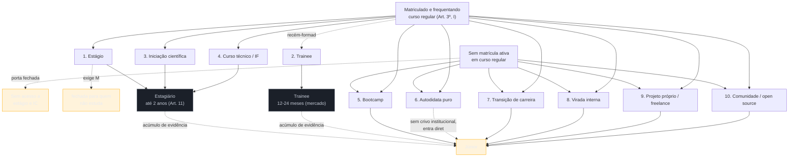

# As portas de entrada no mercado

> [!abstract] TL;DR
> **Estágio e trainee não são níveis de senioridade — são portas, cada uma com um requisito formal de acesso que não depende de quanto a pessoa sabe.** Estágio exige matrícula e frequência regular numa instituição de ensino (Lei 11.788/2008, Art. 3º, I); trainee, embora sem lei própria, é prática de mercado voltada a quem acabou de se formar. Quem não tem vínculo ativo com uma instituição — o autodidata puro, por exemplo — não alcança nenhuma das duas portas, não importa o quanto tenha estudado sozinho, e entra direto no mercado como júnior, competindo por vaga com gente que já acumulou até dois anos de estágio remunerado dentro de empresa real. Esta nota mapeia as dez portas que levam ao primeiro emprego em tecnologia, o requisito formal de cada uma, o que ela entrega de evidência para o currículo, e a dúvida específica que desperta em quem lê. Nenhum guia de currículo do mercado trata disso como estrutura — a maioria trata estágio, trainee e júnior como se fossem degraus da mesma escada.

## A pergunta que ninguém faz em voz alta

Há uma frustração recorrente entre quem estudou programação por conta própria — cursos online, documentação, projetos pessoais, meses de disciplina sem professor nem prazo — e que, ao tentar a primeira vaga, se choca com um padrão difícil de nomear: currículos de gente com a mesma idade, às vezes com conhecimento técnico aparentemente mais raso, chegando à entrevista com "dois anos de experiência" já escritos no documento. A reação mais comum é procurar a explicação em algum defeito pessoal — talvez o portfólio não seja bom o suficiente, talvez falte um certificado, talvez o currículo esteja malformatado. Às vezes é isso mesmo. Mas com uma frequência maior do que se supõe, a explicação real não está em nenhuma dessas coisas — está numa porta que a pessoa nunca teve como atravessar, porque o requisito para atravessá-la nunca foi competência.

Essa é a lacuna que esta nota preenche, e é também a razão pela qual ela é, das 26 notas do galho, a mais original: nenhum guia de currículo do mercado — nem os gratuitos, nem os vendidos por assinatura, nem os produzidos por universidades — trata o caminho de entrada como uma estrutura própria, com regras próprias, algumas delas escritas em lei. O que existe, tipicamente, é uma lista solta de "opções para quem está começando" (estágio, trainee, bootcamp, autodidatismo), tratadas como se fossem escolhas equivalentes dentro de um mesmo cardápio. Não são. Duas dessas opções são **portas com requisito formal de acesso**, e as outras oito não são. Entender essa diferença — e o que ela produz de vantagem acumulada para quem passa por uma porta formal — é o que torna o resto do galho, sobretudo a [[03-Dominios/Carreira/Currículo/10 - Inventário de evidência|nota 10]], utilizável de verdade.

## A observação central: porta, não nível

Um erro de enquadramento comum, silencioso o bastante para nunca ser questionado, trata "estagiário", "trainee" e "júnior" como três pontos na mesma régua de senioridade — como se estagiário soubesse menos que trainee, que soubesse menos que júnior, numa progressão linear de competência. Essa régua existe de fato — é o assunto da [[03-Dominios/Carreira/Currículo/03 - Os seis níveis e o que muda entre eles|nota 03]], que trata dos seis níveis usados no resto do galho — mas ela mede algo diferente do que estágio e trainee de fato são.

**Estágio e trainee não são níveis de conhecimento. São portas de acesso ao mercado, cada uma trancada por um requisito formal que não é técnico.** A porta do estágio se abre para quem está matriculado e frequentando um curso regular, não para quem sabe programar bem. A porta do trainee, ainda que sem lei própria, tipicamente se abre para quem acabou de concluir uma formação, não para quem domina uma stack específica. Uma pessoa pode saber mais Python do que qualquer estagiário do mercado, e ainda assim ficar do lado de fora das duas portas, simplesmente porque não está matriculada em curso nenhum nem tem um diploma recém-emitido para exibir. É essa distinção — porta versus nível — que organiza o resto desta nota, e é ela que explica a frustração descrita na abertura: **o autodidata puro não é rejeitado por falta de competência nas duas portas mais comuns de entrada; ele é estruturalmente inelegível para atravessá-las**, e por isso entra direto no mercado como júnior, competindo por vaga com quem passou até dois anos dentro de uma empresa, remunerado, com tarefas reais e um gestor disposto a assinar uma carta de recomendação.

Vale marcar, antes de seguir, uma linha que separa dois tipos de afirmação nesta nota — porque a nota carrega uma restrição de rigor maior do que o resto do galho, dado que trata de lei. Sempre que esta nota afirma algo sobre estágio, o texto cita o artigo específico da Lei 11.788/2008 que sustenta a afirmação. Sempre que trata de trainee, o texto declara explicitamente que está descrevendo prática de mercado observada em fontes secundárias, não norma jurídica — porque trainee, ao contrário de estágio, não tem lei própria no Brasil. A diferença entre "a lei diz" e "o mercado costuma fazer" é, ela mesma, parte do que esta nota ensina, e confundir as duas categorias seria repetir, num assunto jurídico, o mesmo tipo de erro que a [[03-Dominios/Carreira/Currículo/04 - Quem lê o seu currículo — e o que a evidência diz|nota 04]] já apontou em números de mercado sem lastro.

## O que a lei de estágio de fato diz

A Lei 11.788, de 25 de setembro de 2008, é a norma federal que regula o estágio no Brasil, e o texto consolidado dela — verificado diretamente no Planalto, não repetido de blog corporativo de RH — sustenta um punhado de fatos precisos que valem mais do que qualquer impressão geral sobre "como funciona um estágio".

**O estágio é, por definição legal, um ato educativo escolar supervisionado** (Art. 1º), o que já entrega a chave de tudo o que segue: ele existe *dentro* de uma relação com uma instituição de ensino, não ao lado dela. Uma pessoa só pode ser estagiária enquanto estiver **frequentando o ensino regular** — a lei não fala em "ter concluído", nem em "ter conhecimento equivalente"; fala em frequentar. E o Art. 3º, inciso I, torna esse requisito operacional: o estágio exige **matrícula e frequência regular do educando, atestadas pela instituição de ensino**. Não é o estagiário quem declara que está estudando — é a instituição quem confirma isso perante a empresa. É esse atestado, e não o currículo, o portão real da porta 1.

O mesmo Art. 3º, no caput, resolve outra confusão comum: o estágio **não cria vínculo empregatício de nenhuma natureza**. Isso significa que, juridicamente, um estagiário não é um empregado — o que explica por que a remuneração do estágio se chama bolsa, não salário, e por que a rescisão de um contrato de estágio não segue as mesmas regras da CLT. Essa ausência de vínculo empregatício é, ao mesmo tempo, o que torna o estágio atrativo para empresas (menor custo, menor rigidez) e o que sustenta a crítica mais comum ao instituto — a de que ele às vezes é usado para preencher função de empregado efetivo pagando menos, um risco que a própria lei tenta mitigar limitando carga horária e duração, como as próximas duas regras mostram.

O **Art. 2º** distingue dois tipos de estágio, e a distinção importa para quem lê um currículo: o **estágio obrigatório**, em que a carga horária cumprida é requisito para obtenção do diploma — ou seja, o curso exige aquele estágio como parte da formação —, e o **estágio não obrigatório**, uma atividade opcional, acrescida à carga horária regular e obrigatória do curso. Um estágio obrigatório de seis meses num curso técnico carrega um peso de evidência diferente de um estágio não obrigatório de dois anos numa empresa de tecnologia — o segundo, por ser opcional e mais longo, tende a comunicar iniciativa e continuidade de um jeito que o primeiro, cumprido porque a grade exige, não comunica sozinho.

Sobre carga horária, o **Art. 10, inciso II**, fixa o teto para quem está no ensino superior — o caso que mais interessa a este galho: **6 horas diárias e 30 horas semanais**. É um teto pensado para caber ao lado das aulas, não para competir com elas — o que também explica por que um estágio de meio período, tão comum, não é uma escolha estética da empresa, é o limite que a lei permite para quem ainda está estudando.

Sobre duração, o **Art. 11** limita o estágio a **no máximo dois anos na mesma parte concedente** — a mesma empresa, no vocabulário da lei —, com exceção para o estagiário com deficiência, que não está sujeito a esse teto. Esse limite de dois anos é o número que dá sentido concreto à frase de abertura desta nota: quando alguém que entrou por esta porta chega à primeira vaga de júnior, é plausível que já carregue até vinte e quatro meses de experiência supervisionada dentro de uma empresa real — dois anos de tarefas entregues, de feedback recebido, de código revisado por alguém mais experiente. É esse acúmulo, não um dom especial, que produz a vantagem competitiva sentida — e raramente entendida — por quem entrou pela porta do autodidatismo puro e não teve dois anos assim para acumular.

Duas garantias adicionais completam o quadro legal e valem entrar no currículo de quem passou por essa porta, porque comunicam profissionalismo, não só aprendizado: o **Art. 12** torna **compulsórias a bolsa e o auxílio-transporte** no estágio não obrigatório — não é um benefício que a empresa concede por generosidade, é uma obrigação legal —, e o **Art. 13** garante **recesso de trinta dias** a quem completa um ano ou mais de estágio, preferencialmente durante as férias escolares. Nenhuma das duas garantias muda o que um estagiário sabe fazer. As duas mudam o que um estágio *é*, juridicamente — uma relação estruturada, com direitos mínimos, não um trabalho informal disfarçado de oportunidade de aprendizado.

> [!success] O achado que sustenta a porta 3
> Uma mudança de 2024 na Lei 11.788/2008 abre uma porta que quase nenhum currículo de estudante explora, e que merece destaque próprio nesta nota porque é recente e pouco conhecida mesmo entre quem já a atravessou. O **Art. 2º, § 3º**, na redação dada pela **Lei nº 14.913, de 2024**, estabelece que atividades de **extensão, monitoria, iniciação científica** e intercâmbio no exterior **poderão ser equiparadas ao estágio em caso de previsão no projeto pedagógico do curso**. Isso significa que a bolsa de iniciação científica — tratada, na cultura do mercado de TI, como uma coisa acadêmica, distante do currículo profissional — pode ter, hoje, o mesmo status legal de um estágio, desde que o curso da pessoa preveja essa equiparação no próprio projeto pedagógico. A porta 3 desta nota, portanto, não é uma analogia forçada com o estágio; ela tem lastro legal explícito, e recente o suficiente para que boa parte de quem passou por ela nem saiba disso.

## Trainee: prática de mercado, não lei

Diferente do estágio, o programa de trainee **não tem lei própria no Brasil**. Não existe um equivalente da Lei 11.788/2008 regulando duração, carga horária ou benefícios compulsórios de um trainee — porque, juridicamente, um trainee é apenas um empregado contratado sob o regime **CLT comum, com todos os direitos trabalhistas de qualquer outro empregado**: carteira assinada, décimo terceiro, férias remuneradas, FGTS, aviso prévio. A palavra "trainee" descreve um formato de programa, não uma categoria jurídica — é um rótulo de RH aplicado a uma contratação CLT normal, com um desenho específico por trás.

Esse desenho, apurado em fonte secundária de mercado — Exame, Serasa Experian e a União Brasileira dos Estudantes Secundaristas figuram entre as fontes mais citadas sobre o formato no Brasil — costuma seguir um padrão razoavelmente estável, embora varie de empresa para empresa: programas tipicamente duram de **12 a 24 meses**, são dirigidos a **recém-formados ou a quem se formou há até cerca de dois anos**, envolvem **rodízio por diferentes áreas ou squads** dentro da empresa durante o programa, e miram, ao final, uma **posição de liderança ou de maior responsabilidade** — o trainee é, na concepção original do formato, um investimento da empresa em formar gestores ou especialistas de dentro, não apenas mais uma contratação júnior com nome diferente. **Vale repetir com todas as letras: isso é prática de mercado observada, não determinação legal.** Uma empresa pode desenhar seu programa de trainee de um jeito completamente diferente disso, e ainda assim chamá-lo de "trainee" com total legalidade — não há lei que fixe o formato, só convenção.

Essa ausência de lei própria é, ela mesma, informação relevante para quem lê um currículo com "trainee" escrito nele: ao contrário de "estagiário", que carrega um piso legal mínimo garantido (bolsa compulsória, carga horária limitada, recesso de trinta dias), "trainee" não carrega piso nenhum além do que qualquer contrato CLT já garante por lei geral. Duas empresas diferentes podem chamar de "trainee" programas com desenhos radicalmente distintos — uma com rodízio estruturado de seis meses por área e mentoria formal, outra com pouco mais do que o nome. É por isso que o leitor experiente de currículo tende a olhar menos para o rótulo "trainee" e mais para o que a pessoa efetivamente fez dentro do programa — o [[03-Dominios/Carreira/Currículo/10 - Inventário de evidência|inventário de evidência]] importa mais do que o título, um princípio que vale para todas as dez portas desta nota, e que o caso real de Cassiana, mais adiante, ilustra de um jeito particularmente nítido.

## As dez portas

Com o gate legal estabelecido, o resto desta nota mapeia dez caminhos observados de entrada no mercado de tecnologia — não como uma lista exaustiva e fechada (trajetórias reais frequentemente combinam mais de uma), mas como um vocabulário comum que o resto do galho, sobretudo a nota 10, vai reusar. Cada porta é descrita por três coisas: o **requisito de acesso** — o que é preciso ter ou ser para atravessá-la —, o que ela entrega de **evidência aproveitável** para o currículo, e a **dúvida específica** que ela desperta em quem lê o documento e precisa decidir se vale a pena investir vinte minutos numa conversa.

### 1. Ensino superior → estágio → efetivação

O requisito de acesso é o descrito na seção legal acima: matrícula e frequência regular num curso superior, atestadas pela instituição (Art. 3º, I). É, das dez portas, a única cujo requisito de acesso está escrito em lei federal com essa precisão. A evidência que essa porta produz, quando bem aproveitada, é considerável: até dois anos de experiência supervisionada (Art. 11) dentro de uma empresa real, com tarefas atribuídas por um gestor, código revisado por colegas mais experientes, e — no caso comum de efetivação ao final do estágio — um sinal forte de que a própria empresa decidiu investir na contratação daquela pessoa depois de vê-la trabalhar de perto por meses. A dúvida que essa porta desperta no leitor não é sobre competência técnica bruta — é sobre **autonomia**: alguém que passou dois anos sob supervisão direta, com tarefas definidas por outra pessoa, ainda não demonstrou, necessariamente, como se comporta diante de ambiguidade sem ninguém apontando o próximo passo. É essa lacuna específica que a entrevista de júnior costuma sondar quando o candidato vem dessa porta.

### 2. Ensino superior → programa de trainee

O requisito de acesso, como descrito acima, é prática de mercado, não lei: tipicamente formação recente ou próxima da conclusão. A evidência que essa porta entrega é de natureza diferente da do estágio — não é tempo acumulado de execução técnica sob supervisão contínua, é **exposição estruturada a múltiplas áreas** num intervalo curto, o que costuma sinalizar capacidade de adaptação rápida e de aprendizado acelerado. A dúvida que o leitor carrega aqui é dupla: primeiro, "em qual área a pessoa efetivamente ficou ao final do rodízio, e por quê" — porque o rodízio, por definição, não deixa a pessoa se aprofundar tanto quanto dois anos fixos num só time deixariam; segundo, um filtro implícito de seletividade, porque processos de trainee costumam ter volume alto de inscritos e taxa de conversão baixa, o que faz o próprio rótulo "trainee" carregar, para quem conhece o mercado, um sinal de que a pessoa passou por um funil competitivo antes de chegar lá.

### 3. Iniciação científica / laboratório de pesquisa

O requisito de acesso é o mesmo requisito estrutural das outras portas acadêmicas — matrícula ativa — somado a um vínculo com um orientador ou um laboratório, geralmente sustentado por bolsa (CNPq, FAPESP ou institucional). Depois da mudança de 2024 descrita na caixa acima, essa porta pode carregar status legal explícito de estágio, quando o curso prevê a equiparação no projeto pedagógico. A evidência que ela entrega é distinta das duas primeiras: rigor metodológico, capacidade de trabalhar com problema aberto e sem solução conhecida de antemão, e — quando o tema de pesquisa tem qualquer componente computacional — código escrito sob exigência de reprodutibilidade, não de prazo comercial. A dúvida que essa porta desperta é quase o espelho da dúvida da porta 1: o leitor não pergunta se a pessoa sabe pesquisar, pergunta se ela sabe **operar sob pressão de prazo comercial e ambiguidade de negócio** — porque pesquisa acadêmica, por natureza, tem um relacionamento com tempo e com "cliente" muito diferente do de uma empresa que precisa entregar uma feature na sprint seguinte.

### 4. Curso técnico / Instituto Federal → jovem aprendiz ou estágio técnico

O requisito de acesso aqui é estar matriculado num curso técnico, seja num Instituto Federal, seja numa escola técnica privada ou estadual — um requisito estrutural parecido com o das portas 1 e 3, só que cumprido numa etapa de formação anterior à graduação, e frequentemente combinado com regimes específicos de trabalho protegido para menores de idade, que carregam regras próprias fora do escopo desta nota. A evidência que essa porta entrega tende a ser mais concentrada em fundamentos — lógica, sistemas, redes — do que em uma stack específica de mercado, porque o currículo técnico normalmente prioriza base ampla sobre especialização precoce. A dúvida do leitor, aqui, costuma girar em torno de **maturidade e continuidade**: alguém que entrou no mercado formal antes da maioridade, ou logo depois dela, ainda está descobrindo o que quer fazer dentro de tecnologia, e o histórico dessa porta, quando bem contado no currículo, precisa mostrar direção, não só precocidade.

### 5. Bootcamp / curso livre

Diferente das quatro primeiras, essa porta não tem requisito formal de acesso nenhum — qualquer pessoa pode se matricular num bootcamp, pagando por ele, sem exigência de diploma prévio ou de instituição atestando frequência. A evidência que essa porta entrega depende inteiramente da intensidade e da seriedade do programa específico: bootcamps sérios produzem projetos completos, sob prazo real e com avaliação de pares ou de mentores, o que se aproxima — sem a mesma robustez institucional — da experiência de um estágio curto. A dúvida do leitor, precisamente por não haver requisito formal de entrada, recai sobre **profundidade real versus conclusão nominal**: um certificado de bootcamp, por si só, não distingue quem absorveu o conteúdo de quem só cumpriu presença, e é por isso que o material produzido durante o curso — os projetos entregues, não o certificado — carrega o peso real de evidência, um ponto que a [[03-Dominios/Carreira/Currículo/17 - Projetos, portfólio e GitHub depois da IA|nota 17]] trata em profundidade.

### 6. Autodidata puro

Essa é a porta que não é porta nenhuma, no sentido estrito do termo — é a ausência de todas as anteriores. Não há requisito de acesso a satisfazer, porque não há uma instituição, um processo seletivo ou um programa estruturado envolvido; há só a pessoa, o material de estudo que ela escolheu, e o próprio ritmo. Precisamente por isso, essa é a única das dez trajetórias que não produz, por construção, nenhuma evidência de terceiro atestando o aprendizado — nenhuma instituição confirma frequência, nenhum orientador assina uma recomendação, nenhum gestor de estágio pode ser contatado como referência. A evidência que sobra é inteiramente autoral: o código escrito, os projetos publicados, o histórico de estudo, se documentado. E é exatamente essa ausência de crivo institucional que produz a dúvida mais dura entre as dez portas: o leitor, sem nenhum terceiro para confirmar nada, pede prova redobrada — cadê o código, cadê o link do produto rodando, cadê alguém disposto a atestar que aquilo funciona e que a pessoa escreveu de fato. É essa exigência de prova redobrada, mais do que qualquer déficit real de conhecimento técnico, que explica boa parte da dificuldade que autodidatas relatam na primeira candidatura — e é o motivo estrutural pelo qual esta nota inteira existe.

### 7. Transição de carreira

O requisito de acesso, aqui, é inverso ao das portas 1-4: em vez de vínculo institucional, o que abre essa porta é **experiência profissional real em outra área** — contabilidade, direito, engenharia mecânica, marketing, o que for. A evidência que essa porta entrega não é de natureza técnica; é de natureza profissional em sentido mais amplo: alguém que já sabe entregar sob prazo, já foi avaliado por um gestor, já lidou com cliente ou com processo de negócio, e chega à tecnologia carregando um domínio que muitos desenvolvedores júniores tradicionais simplesmente não têm. A dúvida do leitor divide-se entre reconhecimento e ceticismo ao mesmo tempo: reconhece que a pessoa tem maturidade profissional genuína, mas precisa se convencer de que ela sabe entregar **tecnicamente**, sob as mesmas exigências que qualquer outro júnior técnico enfrentaria — a experiência anterior importa, mas não substitui a demonstração de código funcionando.

### 8. Virou dev por dentro da empresa

Essa porta cobre um leque de origens específicas — suporte técnico, QA, analista de negócio, e, no caso mais extremo, alguém que entrou numa função completamente alheia à tecnologia e se tornou, com o tempo, a pessoa responsável pelo software da empresa. O requisito de acesso não é externo, é interno: **já estar empregado** naquela empresa e, de algum jeito, ter assumido tarefas cada vez mais técnicas até que o título formal acompanhasse o que a pessoa já vinha fazendo na prática. A evidência que essa porta produz é peculiar entre as dez: um histórico de confiança já construído dentro daquela organização específica, frequentemente mais longo do que o título técnico sugere — porque a mudança de título costuma vir depois da mudança real de função, não antes. A dúvida do leitor, nesse caso, é justamente sobre esse intervalo: **há quanto tempo a pessoa vinha fazendo trabalho técnico de fato, antes de o título mudar, e quem — que gestor, que colega — pode confirmar isso**? Um currículo que só menciona o título recente, sem contar a história de como ele foi conquistado por dentro, desperdiça exatamente o dado mais interessante dessa porta.

### 9. Projeto próprio, freelance, indie

O requisito de acesso, como na porta 6, é nenhum formal — qualquer pessoa pode abrir um projeto, aceitar um freelance ou lançar um produto próprio. O que diferencia essa porta da porta 6 é o risco assumido de forma explícita: alguém que constrói e mantém um produto próprio, ou que entrega para clientes reais em regime de freelance, carrega responsabilidade de ponta a ponta — da decisão técnica ao suporte pós-entrega — que raramente aparece numa posição júnior tradicional dentro de uma empresa estruturada. A evidência é concreta e verificável quando o produto está no ar ou o histórico de entregas é documentável. A dúvida do leitor aqui é sobre **viés de autorrelato**: como qualquer métrica de sucesso vem do próprio empreendedor, sem terceiro independente para confirmar números de uso ou de receita, o leitor precisa decidir quanto confiar na palavra da pessoa — o que reforça, de um jeito prático, por que a [[03-Dominios/Carreira/Currículo/14 - Números que você pode defender|nota sobre números que você pode defender]] trata com tanto cuidado a diferença entre número medido e número lembrado.

### 10. Comunidade e open source

O requisito de acesso é, mais uma vez, nenhum formal, mas com uma peculiaridade que a distingue de todas as outras nove: a evidência que essa porta produz é **publicamente verificável por qualquer pessoa**, sem depender da palavra de quem contribuiu. Um histórico de commits, pull requests aceitos, discussões técnicas em issues e revisão de código recebida de estranhos — tudo isso fica registrado, com timestamp, em plataformas abertas, sem que o candidato precise convencer ninguém de que aconteceu. A dúvida do leitor não é sobre veracidade, então — é sobre **substância e continuidade**: uma contribuição pontual, um único pull request corrigindo um erro de digitação na documentação, não carrega o mesmo peso que meses de colaboração sustentada, com discussão técnica real e código revisado por mantenedores experientes de um projeto relevante. É essa distinção entre contribuição pontual e colaboração sustentada que separa, na prática, um item decorativo de currículo de uma evidência genuína de capacidade técnica.

O diagrama carrega a tese inteira desta nota num único traço: as portas 1, 2 e 3 exigem um vínculo institucional que só quem está matriculado (ou recém-formado, no caso do trainee) consegue satisfazer — e é esse vínculo, não competência técnica, que abre ou fecha a passagem. As portas 5 a 10 estão abertas para qualquer um, matriculado ou não, mas nenhuma delas entrega, por construção, os até dois anos de experiência supervisionada e remunerada que a porta 1 pode entregar. O autodidata puro (porta 6) chega ao mesmo destino final — a vaga de júnior — mas chega direto, sem o intervalo de acúmulo que quem passou por estágio ou trainee teve. Não é uma falha pessoal; é a arquitetura do próprio mercado, e é essa arquitetura, não a falta de talento, que explica boa parte da dificuldade que o autodidata relata na primeira candidatura.

## Casos práticos — as portas se compõem, e quem as abre costuma ser uma pessoa

Um jeito de ler as dez portas acima, além de mapa isolado de opções, é como peças que se encaixam numa trajetória real — e a trajetória a seguir, do próprio autor deste vault, mostra exatamente esse encadeamento.

> [!example] Caso real
> Em 1999, Josenaldo Matos fez seu primeiro software: um sistema em Access para uma empresa de Itabuna. Entrou sem saber nada sobre a ferramenta, aprendeu ali mesmo, no próprio trabalho — implementou tabelas, consultas, relatórios e menus, e deu manutenção ao sistema durante o ano inteiro. É a porta 8 desta nota, virar dev por dentro da própria oportunidade, num momento em que ele ainda nem tinha entrado numa graduação. Foi essa experiência que o motivou a entrar no curso de graduação em 2000. Foi bolsista de iniciação científica no laboratório Labbi, na UESC, de abril de 2003 a agosto de 2004 — a porta 3 — e é essa a experiência que ele mesmo considera sua primeira experiência profissional de fato, ainda que, tecnicamente, fosse uma bolsa acadêmica, não um vínculo empregatício. (Repare na sobreposição: o estágio no CEPEDI, de novembro de 2003 a fevereiro de 2004, aconteceu **dentro** do período da bolsa — ele acumulou os dois por quatro meses. Sobreposição de vínculos é comum no início de carreira e costuma assustar quem escreve currículo, mas ela é factual e verificável, e esconder um dos dois para "simplificar" a linha do tempo cria justamente a divergência que quem entrevista confere contra o LinkedIn.) Em novembro de 2003, entrou no CEPEDI como Java Júnior — não como estagiário —, contratação viabilizada pelo orientador do Labbi, que era diretor da instituição naquele momento. Terminada a bolsa, seguiu na UESC como desenvolvedor de agosto de 2004 a setembro de 2006, em trabalho ligado à pró-reitoria de pós-graduação e pesquisa, onde o mesmo orientador era então pró-reitor. Em setembro de 2006 voltou ao CEPEDI — agora como coordenador, não mais como programador júnior — e ficou até abril de 2008. Link verificável: [josenaldo.com.br/experiences](https://josenaldo.com.br/experiences).

A lição que essa sequência ensina não cabe inteira em nenhuma das dez portas isoladas: **as portas se compõem, e quem as abre, na prática, costuma ser uma pessoa.** A porta 8 (aprender fazendo, dentro de um trabalho) levou à decisão de estudar formalmente; o estudo formal abriu a porta 3 (iniciação científica); e a porta 3 — não o currículo, não um processo seletivo anônimo, mas a relação de confiança construída com um orientador — abriu duas portas subsequentes na mesma instituição, com o mesmo orientador movendo-se para posições de maior influência. Isso não invalida nenhuma das dez categorias descritas acima; reforça que elas raramente aparecem isoladas numa trajetória real, e que a rede de relações construída dentro de uma porta costuma valer tanto quanto — às vezes mais do que — a evidência técnica que ela produz. É o mesmo ponto que a [[03-Dominios/Carreira/Currículo/01 - Para que serve um currículo|nota 01]] já havia levantado, de um ângulo diferente, ao lembrar que o currículo coloca alguém na fila, mas quem tira a pessoa da fila costuma ser uma pessoa, não um algoritmo.

Uma segunda trajetória, de uma pessoa diferente, ilustra um aspecto distinto da mesma estrutura: o de como duas portas podem se sobrepor no mesmo movimento, e o de como o rótulo sob o qual alguém entra não determina onde essa pessoa vai ficar.

> [!example] Caso real
> Cassiana Gabriela Lima Barreto fez graduação em Engenharia Biomédica na UFU entre 2008 e 2015, mestrado em Engenharia de Sistemas de Saúde entre 2016 e 2018, e doutorado em Sistemas Computacionais e dispositivos aplicados à saúde entre 2020 e 2025. Aprendeu Python durante o próprio doutorado, por necessidade da pesquisa, e, na sequência, banco de dados e engenharia de dados de forma mais ampla. Entrou na Dadosfera em 2024 como trainee — a porta 2 — ainda cursando o doutorado, o que significa que ela entrou formalmente no mercado de tecnologia **antes de concluir a própria formação**, um traço que sobrepõe a porta 7, transição de carreira, à mesma porta 2, no mesmo movimento: alguém com uma carreira acadêmica inteira em engenharia biomédica migrando para tecnologia, via um programa de trainee. O detalhe mais instrutivo do caso não é a entrada em si — é o que aconteceu logo depois dela: contratada como trainee de **ciência de dados**, foi alocada em **engenharia de dados**, área onde a carreira evoluiu até a promoção a júnior. Fontes citáveis: LinkedIn ([linkedin.com/in/cassianalima](https://linkedin.com/in/cassianalima)), a página de carreiras da Dadosfera e o histórico acadêmico público da UFU.

O que esse detalhe ensina é uma correção a uma leitura ingênua das dez portas: **o título sob o qual alguém entra é uma aposta da empresa sobre onde essa pessoa vai ser útil, não um contrato de destino sobre onde ela vai ficar.** Uma pessoa contratada como trainee de ciência de dados pode, dentro do mesmo programa, acabar alocada numa área vizinha, e a carreira que se constrói a partir dali costuma pesar mais, no currículo de anos depois, do que o rótulo que abriu a porta em primeiro lugar. A [[03-Dominios/Carreira/Currículo/26 - Seis currículos, uma carreira|nota 26]], capstone do galho, retoma essa trajetória com mais detalhe, mostrando como cada peça do currículo dela mudou ao longo da carreira — esta nota fica só com o que é público e relevante para o mapa das portas.

## Armadilhas comuns

> [!warning] Tratar a porta de entrada como julgamento de valor
> **O que acontece:** quem passou por estágio ou trainee lê a própria trajetória como prova de mérito superior; quem entrou por autodidatismo lê a própria trajetória como prova de valor inferior — nos dois casos, atribuindo à porta um julgamento moral que ela não carrega. **Por quê:** é mais fácil transformar uma diferença estrutural (quem tinha acesso a um vínculo institucional e quem não tinha) numa diferença de mérito individual do que reconhecer que o acesso a essas portas depende de circunstância — idade, situação financeira, cidade onde mora, informação disponível na hora certa. **Como evitar:** separar, com clareza, o requisito formal (que é circunstancial) da competência técnica (que é demonstrável de outras formas). O currículo de quem entrou por uma porta sem crivo institucional precisa carregar mais prova concreta — não porque a pessoa vale menos, mas porque a porta que ela atravessou não produziu, por construção, o mesmo tipo de terceiro dispostos a confirmar o aprendizado.

> [!warning] Confundir "sem lei própria" com "sem regra nenhuma"
> **O que acontece:** ao descobrir que o programa de trainee não tem lei específica, o candidato conclui que "vale tudo" nesse tipo de contratação, inclusive tratamento fora do que a CLT garante a qualquer empregado. **Por quê:** a ausência de uma lei setorial específica (como a Lei 11.788/2008 para estágio) é confundida com ausência total de proteção legal. **Como evitar:** lembrar que trainee é contratação CLT **completa** — todos os direitos trabalhistas de qualquer empregado se aplicam, porque juridicamente não existe uma categoria "trainee" separada de "empregado". O que varia de empresa para empresa é o desenho do programa (duração, rodízio, mentoria), não os direitos garantidos por trás dele.

> [!warning] Esquecer que a maioria das trajetórias reais combina mais de uma porta
> **O que acontece:** ao ler a lista de dez portas pela primeira vez, o leitor tenta encaixar a própria trajetória numa única categoria, e se frustra quando ela não cabe inteira em nenhuma. **Por quê:** a lista é apresentada, por necessidade didática, como dez categorias separadas — mas trajetórias reais raramente respeitam essa separação, como os dois casos reais desta nota mostram (o autor atravessa quatro portas encadeadas; Cassiana sobrepõe duas no mesmo movimento). **Como evitar:** usar as dez portas como vocabulário para nomear cada trecho da própria trajetória, não como caixa única onde a trajetória inteira precisa caber. A [[03-Dominios/Carreira/Currículo/10 - Inventário de evidência|nota 10]] ensina exatamente essa conversão — de trajetória real, muitas vezes multiportas, para inventário de evidência aproveitável no currículo.

## Como soa em inglês

> "One thing I try to be precise about, especially when I talk to people outside Brazil: internship and trainee programs here aren't skill levels, they're formal entry gates. An internship legally requires active enrollment in school — it's an educational activity by law, not just an employment arrangement — and trainee programs, while not backed by a specific law, are a market convention aimed at recent graduates. Someone who's self-taught doesn't have access to either gate, no matter how much they know, so they enter the market directly as a junior, competing against candidates who may have accumulated up to two years of supervised, paid experience inside a real company. That structural gap explains a lot of the frustration self-taught developers feel, and it's rarely named out loud."

| PT | EN |
| --- | --- |
| porta de entrada | entry gate / entry path |
| requisito formal de acesso | formal eligibility requirement |
| matrícula e frequência regular | active enrollment and attendance |
| vínculo empregatício | employment relationship |
| estágio obrigatório / não obrigatório | mandatory / non-mandatory internship |
| parte concedente | host organization (legal term for the hiring party in an internship) |
| bolsa | stipend |
| auxílio-transporte | transportation allowance |
| prática de mercado | market practice / industry convention |
| virada interna | internal transition |
| crivo institucional | institutional vetting |

## O que vem a seguir

Mapeadas as dez portas e o requisito formal de cada uma, o galho segue por dois caminhos que retomam este mapa em momentos diferentes:

- [[03-Dominios/Carreira/Currículo/03 - Os seis níveis e o que muda entre eles|03 - Os seis níveis e o que muda entre eles]] — o vocabulário de nível (estagiário, trainee, júnior, pleno, sênior, staff) usado no resto do galho, e a diferença entre nível de senioridade e porta de entrada que esta nota estabeleceu.
- [[03-Dominios/Carreira/Currículo/10 - Inventário de evidência|10 - Inventário de evidência]] — a ponte prática entre as duas lentes do galho: converte cada uma das dez portas descritas aqui em material aproveitável no currículo, e nomeia, para cada porta, a dúvida específica que o candidato precisa antecipar.

## Veja também

- [[03-Dominios/Carreira/Currículo/index|Currículo]] — o índice do galho, com a tese e o mapa das 26 notas.
- [[03-Dominios/Carreira/Currículo/01 - Para que serve um currículo|01 - Para que serve um currículo]] — o objetivo único do documento, que também tratou, de outro ângulo, do contrapeso "o currículo coloca na fila, quem tira dela costuma ser uma pessoa".
- [[03-Dominios/Carreira/Currículo/08 - Formação, cursos e certificações|08 - Formação, cursos e certificações]] — onde a porta de entrada pesa mais na curadoria do documento.
- [[03-Dominios/Carreira/Currículo/16 - A seção de experiência profissional|16 - A seção de experiência profissional]] — como o histórico produzido por cada porta entra na seção de experiência.
- [[03-Dominios/Carreira/Currículo/19 - Declarar lacuna|19 - Declarar lacuna]] — quando a trajetória entre portas deixa um intervalo que precisa ser declarado.
- [[03-Dominios/Carreira/Currículo/26 - Seis currículos, uma carreira|26 - Seis currículos, uma carreira]] — capstone do galho, com a trajetória completa de Cassiana Gabriela Lima Barreto detalhada além do que esta nota cobriu.
- [[03-Dominios/Carreira/Entrevistas/index|Entrevistas]] — o galho parceiro: a dúvida que cada porta desperta no leitor do currículo é, com frequência, a mesma pergunta que a entrevista técnica ou comportamental vai sondar diretamente.

## Fontes

- **Presidência da República — Casa Civil** — [Lei nº 11.788, de 25 de setembro de 2008](https://www.planalto.gov.br/ccivil_03/_ato2007-2010/2008/lei/l11788.htm), texto consolidado, consultado diretamente no Planalto em 2026-08-20. Fonte primária de todos os artigos citados nesta nota sobre estágio (Art. 1º, Art. 2º, Art. 3º, Art. 10, Art. 11, Art. 12, Art. 13), incluindo a redação do Art. 2º, § 3º dada pela Lei nº 14.913/2024.
- **Josenaldo Matos** — [josenaldo.com.br/experiences](https://josenaldo.com.br/experiences), página pública do site do autor deste vault. Fonte do caso real da trajetória encadeada (1999-2006) usada nesta nota.
- **Cassiana Gabriela Lima Barreto** — [linkedin.com/in/cassianalima](https://linkedin.com/in/cassianalima), perfil público no LinkedIn, com dados adicionais confirmados na página de carreiras da Dadosfera e no histórico acadêmico público da UFU. Fonte do segundo caso real desta nota, citado com autorização.
- **Exame, Serasa Experian, União Brasileira dos Estudantes Secundaristas (UBES)** — fontes secundárias de mercado citadas para descrever o formato típico de programas de trainee no Brasil (duração de 12 a 24 meses, público-alvo de recém-formados, rodízio por área, mira em posição de liderança). Declaradas aqui como prática de mercado observada, não como norma jurídica — trainee, ao contrário de estágio, não tem lei federal própria no Brasil.
