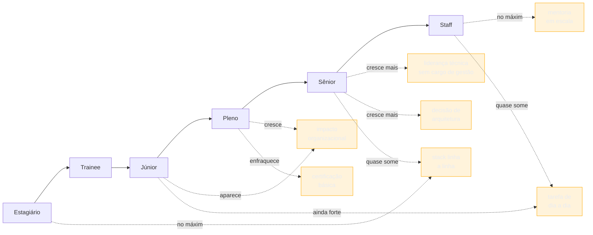

# Os seis níveis e o que muda entre eles

> [!abstract] TL;DR
> Este galho descreve seis níveis — estagiário, trainee, júnior, pleno, sênior, staff — não pelo que a pessoa sabe, mas pelo que o **documento precisa provar** em cada um: potencial e disciplina de aprendizado no início da escada, autonomia e resultado mensurável no meio, decisão de arquitetura e mentoria em escala no topo. A [[03-Dominios/Carreira/Currículo/02 - As portas de entrada no mercado|nota 02]] já estabeleceu que estagiário e trainee são **portas com requisito formal de acesso**, não pontos de uma régua de competência; esta nota não reabre essa discussão — trata os seis como estágios sucessivos de uma mesma carreira, sabendo que os dois primeiros também são portas, e que quem não passa por elas simplesmente começa a escada num degrau acima, sem o preparo que os degraus anteriores dariam. O eixo central desta nota é **o que sobe e o que desce** com a senioridade: sobem impacto organizacional e entre times, liderança técnica sem cargo de gestão, decisão de arquitetura e mentoria; descem a lista de tecnologias linha a linha, a tarefa de dia a dia e a certificação básica. A regra de uma página até pleno e duas a partir de sênior é **convenção de mercado sem fonte primária localizada nesta pesquisa** — mais perto de caixa-preta declarada do que de dado medido, na terminologia que a [[03-Dominios/Carreira/Currículo/04 - Quem lê o seu currículo — e o que a evidência diz|nota 04]] já fixou — e comprimir um currículo de staff numa única página costuma ser lido, no mercado, como sinal de que o candidato não percebeu que as regras do jogo mudaram.

## Quando o currículo não mudou, mas a pessoa sim

> [!example] Caso fictício
> Diego trabalha há catorze anos com engenharia de software e, nos últimos três, ocupa uma posição de staff engineer sem nunca ter gerenciado ninguém — é a pessoa a quem duas ou três equipes recorrem quando uma decisão de arquitetura trava, e é quem revisa, informalmente, quase todo projeto de escopo maior que nasce dentro do seu domínio. Ao se candidatar a uma vaga externa pela primeira vez em anos, ele abre o próprio currículo e o usa como base — sem perceber, a princípio, o que isso significa — o mesmo arquivo que escreveu há dez anos, quando ainda era pleno: atualiza datas, troca o cargo mais recente, acrescenta duas linhas na seção de experiência, reduz um pouco a lista de habilidades técnicas. A estrutura do resto do documento fica intacta. O currículo não está desatualizado no sentido óbvio e factual — cada linha é verdadeira, cada data confere. Está desatualizado num sentido mais silencioso, o de vocabulário: ele continua provando que Diego sabe **fazer** o trabalho, quando o cargo que ele ocupa hoje existe justamente porque ele já provou isso há muito tempo, e o que falta provar agora é outra coisa — que ele decide, para os outros, o que o trabalho deveria ser.

O desencontro que o caso de Diego ilustra é comum o bastante para merecer nome próprio, e é a razão de existir desta nota: quem escreve currículo raramente para para se perguntar **o que o documento precisa provar neste nível específico**, e por isso reaproveita, de um nível para o outro, a mesma lógica de prova que funcionava antes — só trocando os substantivos. Um currículo de júnior que lista quinze tecnologias comunica disposição para aprender; o mesmo formato, herdado sem revisão por um currículo de sênior, comunica o oposto do que deveria — que a pessoa ainda mede o próprio valor pela extensão da lista, não pelo peso do que decidiu. As seções seguintes desta nota existem para dar nome a essa mudança de vocabulário, nível a nível, e para fixar o eixo — o que sobe, o que desce — que separa um currículo que amadureceu junto com a carreira de um currículo que só envelheceu.

## Os seis níveis, e o que o leitor procura em cada um

Antes de descrever cada nível, vale registrar o critério que organiza a lista inteira, porque ele é diferente do que a maioria dos guias de currículo usa. A tentação natural é descrever um nível pelo **conteúdo técnico** que a pessoa domina — "júnior sabe X, pleno sabe X e Y, sênior sabe X, Y e Z" — e esse critério tem um defeito grave: ele empurra o currículo de volta para o enquadramento de "lista de tudo" que a [[03-Dominios/Carreira/Currículo/01 - Para que serve um currículo|nota 01]] já descartou. Um recrutador ou um par técnico não lê o currículo de um sênior perguntando "quantas tecnologias essa pessoa conhece" — pergunta "que tipo de problema essa pessoa resolveu sozinha, e para quem". É essa segunda pergunta, não a primeira, que muda de nível para nível, e é ela que organiza a lista abaixo: cada nível é descrito pelo que o **documento precisa provar** para convencer o leitor de que a pessoa pertence àquele degrau, não pelo inventário de conhecimento técnico que sustenta essa prova.

### Estagiário

O leitor de um currículo de estagiário não está avaliando competência consolidada — está avaliando **potencial e disciplina de aprendizado**. Como a [[03-Dominios/Carreira/Currículo/02 - As portas de entrada no mercado|nota 02]] já detalhou, o estágio é, por definição legal, um ato educativo escolar supervisionado, e isso muda o que o documento precisa provar de um jeito estrutural: ninguém espera que um estagiário já tenha entregue, sozinho, um resultado de negócio mensurável, porque a própria arquitetura da relação de estágio pressupõe supervisão constante. O que o documento precisa provar, então, é outra coisa — que a pessoa sustenta um compromisso ao longo do tempo (frequência, continuidade num curso, num projeto pessoal, numa atividade extracurricular), que já produziu algo concreto mesmo sem contexto profissional formal (um projeto de faculdade terminado, uma contribuição pequena a um repositório aberto, um problema pessoal resolvido com código), e que tem disposição visível para aprender rápido diante de instrução. A formação pesa mais aqui do que em qualquer outro nível da escada — não porque o diploma em si prove competência, mas porque, na ausência de histórico profissional, ela é o dado mais concreto e verificável disponível.

### Trainee

O leitor de um currículo de trainee busca algo próximo, mas não idêntico: **capacidade de adaptação rápida** mais do que profundidade num assunto único. Como a mesma nota 02 registrou, o programa de trainee tipicamente envolve rodízio por diferentes áreas dentro da empresa, e o formato pressupõe alguém capaz de aprender o suficiente de um domínio novo, entregar algo dentro dele, e migrar para outro domínio antes de se especializar de fato. O documento precisa provar, então, que a pessoa não trava diante de contexto novo — histórico de trocar de assunto, de curso, de projeto, e ainda assim produzir algo em cada um, comunica exatamente esse traço. É também o nível em que a formação recente pesa de um jeito particular: como a porta do trainee, segundo a nota 02, tipicamente se abre para quem acabou de concluir uma formação, o currículo desse nível costuma ganhar ao deixar visível não só o diploma, mas o que a pessoa fez **durante** o curso — projetos, iniciativas, qualquer sinal de que ela usou o período de formação para algo além de cumprir a grade.

### Júnior

Aqui o critério muda de registro. O leitor de um currículo de júnior — seja ele alguém que entrou pela porta do estágio, pela porta do autodidatismo puro ou por qualquer uma das outras oito descritas na nota 02 — já não está avaliando potencial abstrato; está avaliando se a pessoa **executa com confiabilidade sob orientação**. O documento precisa provar fundamentos técnicos sólidos e demonstráveis — não uma lista extensa de tecnologias, mas evidência de que a pessoa entende o que faz, não só reproduz um tutorial —, e precisa provar que ela entrega o que foi pedido dentro do prazo combinado, mesmo que a definição do problema tenha vindo de outra pessoa. É o nível em que a certificação básica ainda carrega algum peso, porque a pessoa ainda está construindo o histórico de trabalho real que, mais adiante, vai substituir a certificação como prova — e é também o nível em que listar a stack técnica ainda faz sentido, porque o leitor genuinamente quer saber, rápido, se há sobreposição suficiente com o que a vaga precisa para justificar investir em treinar essa pessoa. A [[03-Dominios/Carreira/Currículo/13 - Responsabilidade, realização e alavancagem|nota 13]] chama esse padrão de **task-taker** — alguém que recebe uma tarefa bem definida e a entrega —, e é essa a imagem que o currículo de júnior precisa sustentar, sem tentar parecer mais do que isso.

### Pleno

A mudança entre júnior e pleno é, das cinco transições desta escada, provavelmente a mais nítida — porque é aqui que o eixo entre "executar o que foi pedido" e "decidir o que fazer" começa a se inverter. O leitor de um currículo de pleno procura **autonomia e um resultado que a pessoa possa defender como próprio**: não mais "participei da migração do sistema de pagamento", mas "conduzi a migração", com um número atrás — a [[03-Dominios/Carreira/Currículo/14 - Números que você pode defender|nota 14]] trata em profundidade de como sustentar esse tipo de número sem inflar. O documento precisa provar que a pessoa recebe um problema, não uma tarefa já fatiada, e decide sozinha o caminho técnico dentro dele — é o degrau que a nota 13 chama de **owner**. A lista de tecnologias linha a linha já começa a perder espaço aqui, porque o leitor assume, corretamente, que alguém pleno já domina o básico do próprio ofício; o que ele quer ver, no lugar da lista, é a evidência de que essa pessoa tomou pelo menos uma decisão técnica que outra pessoa, no lugar dela, poderia ter tomado diferente — e que a decisão dela funcionou.

### Sênior

No nível sênior, o leitor deixa de perguntar "essa pessoa entrega o que pedimos" — essa pergunta já foi respondida nos dois níveis anteriores — e passa a perguntar **"essa pessoa decide bem quando ninguém definiu o problema para ela, e ajuda outras pessoas a decidirem também"**. O documento precisa provar decisão de arquitetura (não implementação de uma arquitetura definida por outra pessoa, mas a escolha entre alternativas, com trade-off explícito), impacto que atravessa mais de um time ou mais de um projeto, e um primeiro sinal de liderança técnica que não depende de cargo de gestão — mentorar um pleno, revisar decisões de outro time, ser a pessoa consultada antes de uma decisão irreversível ser tomada. É também, como a seção seguinte desta nota detalha, o primeiro nível em que a convenção de mercado aceita — e frequentemente espera — duas páginas em vez de uma, porque o histórico de decisões relevantes de uma carreira sênior raramente cabe, com honestidade, no espaço que bastava para provar execução confiável.

### Staff

No topo da escada tratada por este galho, o leitor de um currículo de staff procura algo que os outros cinco níveis não pedem: **influência organizacional que se sustenta sem autoridade formal de gestão**. É o nível mais difícil de descrever em uma frase porque é o mais fácil de descrever errado — staff não é "sênior com mais anos de experiência", é uma mudança de eixo, não de grau. O documento precisa provar que a pessoa moldou uma decisão que várias equipes vão sentir por anos (um padrão de arquitetura adotado além do próprio time, uma prática que se tornou norma na engenharia inteira), que ela exerce mentoria em escala — não um pleno, mas vários sêniores ou vários times ao mesmo tempo —, e que ela é procurada, não escalada por hierarquia, quando uma decisão técnica de peso trava em algum lugar da organização. É o nível em que a lista de tecnologias e a certificação básica quase desaparecem do documento — não porque deixaram de existir na prática, mas porque, neste ponto da escada, elas deixaram de ser o que o leitor precisa que o currículo prove.

O diagrama fixa a régua da próxima seção num único traço: cada seta verde é algo que só ganha peso no currículo à medida que a carreira sobe a escada, e cada seta laranja é algo que ocupa espaço generoso nos primeiros níveis e vai sendo deslocado do documento à medida que outra coisa passa a valer mais como prova.

## O que sobe e o que desce

Descritos os seis níveis, vale isolar o eixo que os atravessa, porque é ele — mais do que qualquer lista de sinônimos por cargo — que decide se um currículo soa do nível certo. Com a senioridade, **sobem** quatro coisas: impacto organizacional e entre times (o alcance do que a pessoa fez deixa de ser "minha tarefa" e passa a ser "o que várias pessoas passaram a fazer depois de mim"), liderança técnica sem cargo de gestão (influenciar decisão e comportamento de outras pessoas sem ocupar a cadeira formal de gestor), decisão de arquitetura (escolher entre alternativas técnicas, com trade-off nomeado, em vez de implementar uma escolha já feita por outra pessoa) e mentoria (o tempo investido em fazer outra pessoa crescer, não só em entregar o próprio trabalho). Ao mesmo tempo, **descem** três coisas, na ordem inversa: a stack listada linha a linha (útil como prova de fundamento no início, redundante como prova de julgamento no topo), a tarefa de dia a dia (o "o que eu fiz ontem" cede espaço para "o que eu decidi que devia acontecer"), e a certificação básica (relevante quando não há histórico de trabalho para provar competência, dispensável quando já existe um histórico de decisões reais para citar em seu lugar).

O jeito mais claro de ver esse eixo em ação não é uma lista abstrata — é a mesma coisa, descrita seis vezes, uma para cada nível da carreira.

> [!example] Caso fictício
> Renata Aquino trabalha há doze anos com engenharia de software, e a linha abaixo acompanha uma única situação recorrente na trajetória dela — o time em que ela está precisa trocar o provedor de processamento de pagamento do produto — descrita como teria entrado no currículo dela em cada um dos seis níveis desta nota, se a mesma pessoa tivesse vivido essa mudança seis vezes, uma em cada momento da carreira.
> **Estagiária:** "Apoiei a equipe de pagamentos durante a migração de gateway, documentando os cenários de teste manual executados em Java e SQL." **Trainee:** "Participei, em rodízio de dois meses no time de pagamentos, da validação da nova integração de gateway, entregando três casos de teste automatizados em Python." **Júnior:** "Implementei seis dos doze endpoints da nova integração de gateway de pagamento, sob orientação do time sênior, usando Node.js e a API do novo provedor." **Pleno:** "Conduzi a migração do gateway de pagamento do time de checkout, reduzindo a taxa de falha de transação de 2,3% para 0,4% em três meses." **Sênior:** "Defini a arquitetura de fallback entre dois provedores de pagamento, adotada por três squads depois da minha, e mentorei dois desenvolvedores plenos durante a implementação." **Staff:** "Estabeleci o padrão de integração de pagamento hoje usado por toda a engenharia de produto, evitando que cada novo squad reabrisse a mesma decisão de arquitetura de forma isolada — decisão ainda em vigor dois anos depois."

Repare no que muda entre as seis frases, porque nenhuma delas é mais "bem escrita" do que outra em termos de estilo — são frases igualmente honestas, cada uma no vocabulário certo para o nível que descreve. As duas primeiras nomeiam a linguagem de programação usada, porque nesse estágio da carreira essa informação ainda é a prova mais relevante disponível; a partir da versão de pleno, a linguagem desaparece da frase, porque o leitor de um currículo de pleno já não precisa dela para decidir se a pessoa é capaz — precisa saber o que ela decidiu e que resultado isso produziu. As duas primeiras descrevem uma tarefa fatiada por outra pessoa ("os cenários de teste", "três casos de teste"); a partir do pleno, o verbo muda de "participei" e "implementei" para "conduzi" e "defini" — o sujeito da frase deixa de receber trabalho e passa a produzi-lo. E só as duas últimas versões mencionam impacto que atravessa mais de um time, e só a última menciona mentoria e um efeito que persiste anos depois de a decisão ter sido tomada — porque são exatamente esses os traços que, segundo esta nota, só ganham peso real como prova nos dois últimos degraus da escada.

Vale marcar, antes de seguir, algo que fica implícito no exemplo e merece ser dito com todas as letras: nenhuma das seis versões é uma mentira sobre as outras cinco. Renata, staff, não deixou de saber Node.js — ela só parou de precisar prová-lo no currículo, porque a prova que o leitor deste nível espera dela é outra. É essa distinção — entre o que a pessoa sabe e o que o documento, naquele nível específico, precisa provar — que separa quem escreve um currículo maduro de quem, como Diego na abertura desta nota, continua provando a mesma coisa há uma década, mesmo depois de o próprio trabalho ter deixado de ser sobre isso.

## A regra de páginas — e por que ela é convenção, não estudo

Uma pergunta prática costuma aparecer assim que o eixo acima fica claro: se o que o documento precisa provar muda tanto de nível para nível, o espaço físico disponível para prová-lo também deveria mudar? A resposta que circula no mercado, de forma quase unânime entre coaches de carreira, sites de emprego e ferramentas comerciais de currículo, é uma regra simples: **uma página até pleno, duas páginas a partir de sênior**, com a segunda página frequentemente descrita como preferida, não só tolerada, em currículos de staff.

Vale ser explícito sobre o que sustenta essa regra, porque a resposta é desconfortável para quem espera uma citação. **A pesquisa para esta nota não encontrou fonte primária, survey nomeado com metodologia pública, nem dado quantitativo controlado que meça, de fato, se currículos de duas páginas convertem mais entrevistas do que currículos de uma página em nível sênior, ou o inverso.** Não há, aqui, nem o equivalente fraco que a [[03-Dominios/Carreira/Currículo/04 - Quem lê o seu currículo — e o que a evidência diz|nota 04]] encontrou para o "padrão de leitura em F" — um estudo pequeno, sem revisão por pares, mas ao menos um estudo com amostra e metodologia declaradas. Aqui não há estudo nenhum localizado, fraco ou forte. A regra de páginas por nível é, nos termos que a nota 04 já fixou para o galho inteiro, mais próxima de **caixa-preta declarada** do que de **plausível mas não medido**: não é que a evidência seja fraca, é que evidência nenhuma foi encontrada — só convenção repetida.

Isso não significa que a regra seja arbitrária ou aleatória — significa que ela nasce de um consenso de mercado, não de uma medição. E o consenso, mesmo sem estudo controlado atrás dele, tem uma lógica interna que vale nomear, porque ajuda a decidir quando segui-lo: o eixo desta nota inteira mostra que, à medida que a senioridade sobe, o histórico relevante de decisões, impacto e mentoria de uma pessoa cresce mais rápido do que o espaço de uma única página consegue comprimir sem perder substância. Uma página basta, com folga, para provar execução confiável — o que os quatro primeiros níveis desta nota pedem. A mesma página raramente basta para provar, ao mesmo tempo, decisão de arquitetura em mais de um contexto, mentoria sustentada e impacto que atravessa times, sem reduzir cada um desses pontos a uma linha genérica demais para convencer ninguém.

Fontes comerciais amplamente citadas no mercado — **Jobscan**, **Enhancv** e **Teal**, todas vendendo produtos de otimização de currículo, como a nota 04 já registrou sobre esse mesmo tipo de fonte — repetem essa regra de uma-ou-duas-páginas em praticamente qualquer artigo que publicam sobre extensão de currículo, quase sempre sem citar nenhum estudo por trás do número, e quase sempre com o mesmo padrão de lavagem de citação que a nota 04 descreveu: um artigo cita o outro, que cita um terceiro, até que a origem real — se é que ela existe — se perde. Vale registrar essas fontes nomeadamente, aqui, pelo mesmo motivo que a nota 04 as nomeia: não para emprestar autoridade a elas, mas para que o leitor saiba de onde vem o número que provavelmente já ouviu, e trate essa origem com a mesma cautela que trataria qualquer estatística de blog corporativo sem metodologia declarada.

> [!warning] O sinal que a página de staff comprimida em uma folha costuma dar
> **O que acontece:** um profissional staff, seguindo o instinto de "currículo enxuto é sempre melhor" que vale nos níveis iniciais, comprime a própria trajetória numa única página, cortando exemplos de decisão de arquitetura e mentoria até sobrar só uma lista rala de cargos e datas. **Por quê:** a regra "uma página é sempre melhor" é ensinada com tanta força nos primeiros anos de carreira que muita gente nunca a questiona depois — e cortar parece, instintivamente, mais seguro do que expandir. **Como evitar:** entender que, no mercado, um currículo de staff cabendo confortavelmente numa única página tende a ser lido não como disciplina, mas como sinal de que o candidato **não percebeu que as regras mudaram** — de que a pessoa talvez não tenha, de fato, o volume de decisão e impacto que o cargo staff deveria ter acumulado. Essa leitura, é importante repetir, também é convenção de mercado, não medição controlada — mas é a leitura que o leitor do outro lado provavelmente vai fazer, e o currículo existe para ser lido por ele, não para vencer um debate abstrato sobre o que "deveria" importar.

Vale fechar esta seção com uma ressalva simétrica à anterior, para não deixar a regra parecer mais rígida do que ela é: duas páginas não são um troféu, e um sênior ou staff que tem, de fato, menos para provar num determinado momento da carreira — uma trajetória mais curta, uma mudança recente de área — não ganha nada preenchendo a segunda página com conteúdo de baixo valor só para bater a convenção. O critério continua sendo o mesmo da [[03-Dominios/Carreira/Currículo/01 - Para que serve um currículo|nota 01]]: cada linha precisa empurrar o leitor em direção à decisão de conversar. A regra de páginas por nível é uma expectativa de espaço disponível, não uma cota de preenchimento obrigatório.

## A tabela-mapa: o índice funcional deste galho

A tabela abaixo é o que dá a esta nota o papel de mapa dentro do galho inteiro: para cada nível, o que o currículo precisa provar, resumido numa frase, e onde no galho isso é tratado com profundidade — a maior parte das 22 notas que seguem esta retoma um ou mais destes níveis, e é a esta tabela que vale voltar sempre que uma nota adiante disser "veja a variação por nível" sem repetir a explicação inteira.

| Nível | O que o documento precisa provar | Onde no galho |
| --- | --- | --- |
| Estagiário | Potencial e disciplina de aprendizado; compromisso sustentado sem histórico profissional formal | [[03-Dominios/Carreira/Currículo/02 - As portas de entrada no mercado\|02]] (o requisito formal da porta) · [[03-Dominios/Carreira/Currículo/08 - Formação, cursos e certificações\|08]] (a formação pesa mais aqui) |
| Trainee | Adaptação rápida a contexto novo; aprendizado acelerado através de áreas distintas | [[03-Dominios/Carreira/Currículo/02 - As portas de entrada no mercado\|02]] (prática de mercado, sem lei própria) · [[03-Dominios/Carreira/Currículo/07 - O sumário profissional\|07]] (variação do sumário nos seis níveis) |
| Júnior | Execução confiável sob orientação; fundamento técnico demonstrável | [[03-Dominios/Carreira/Currículo/09 - Habilidades técnicas\|09]] (a stack ainda pesa) · [[03-Dominios/Carreira/Currículo/11 - A linha de bullet\|11]] (a unidade de projeto) · [[03-Dominios/Carreira/Currículo/13 - Responsabilidade, realização e alavancagem\|13]] (o degrau task-taker) |
| Pleno | Autonomia; um resultado que a pessoa sustenta como próprio, com número defensável atrás | [[03-Dominios/Carreira/Currículo/13 - Responsabilidade, realização e alavancagem\|13]] (o degrau owner) · [[03-Dominios/Carreira/Currículo/14 - Números que você pode defender\|14]] (como sustentar o número) |
| Sênior | Decisão de arquitetura com trade-off nomeado; impacto entre times; primeiro sinal de liderança sem cargo | [[03-Dominios/Carreira/Currículo/13 - Responsabilidade, realização e alavancagem\|13]] (o degrau force multiplier) · [[03-Dominios/Carreira/Currículo/20 - A âncora\|20]] (o sistema por trás do documento) · [[03-Dominios/Carreira/Currículo/21 - O brag document\|21]] (registrar a decisão quando ela acontece, não meses depois) |
| Staff | Influência organizacional sustentada sem autoridade formal de gestão; mentoria em escala | [[03-Dominios/Carreira/Currículo/20 - A âncora\|20]] · [[03-Dominios/Carreira/Currículo/22 - O currículo como pipeline\|22]] (o sistema que sustenta uma trajetória longa) · [[03-Dominios/Carreira/Currículo/26 - Seis currículos, uma carreira\|26]] (capstone, com um currículo de staff completo) |

Vale notar, olhando a tabela como um todo, um padrão que confirma o eixo já descrito: as duas primeiras linhas remetem principalmente à nota 02 (a porta de entrada) e a notas de conteúdo factual — formação, sumário; as duas últimas remetem a notas do bloco Magus — a âncora, o brag document, o pipeline — que tratam o currículo como parte de um sistema maior, não como um documento isolado reescrito do zero a cada vaga. Isso não é coincidência: é o mesmo eixo desta nota, só visto pela lente de qual parte do galho cada nível mais precisa.

## Armadilhas comuns

> [!warning] Escrever com o vocabulário de um nível que já passou
> **O que acontece:** como no caso de Diego, a pessoa reaproveita a estrutura e a lógica de prova de um currículo escrito num nível anterior, atualizando datas e cargos sem revisar o que o documento precisa provar agora. **Por quê:** um currículo que já "funcionou" no passado parece uma base segura, e é mais fácil ajustar o que já existe do que repensar a lógica inteira do zero a cada mudança de nível. **Como evitar:** antes de editar o currículo depois de uma promoção ou mudança de cargo, reler a linha da tabela-mapa correspondente ao nível atual e perguntar, para cada seção, se ela ainda prova o que precisa provar — ou se só descreve, com mais detalhe, o que já foi provado no nível anterior.

> [!warning] Confundir porta de entrada com nível de senioridade
> **O que acontece:** ao ler esta nota, o leitor conclui que estágio e trainee funcionam como dois primeiros degraus de competência, na mesma lógica dos outros quatro níveis — como se um trainee soubesse necessariamente mais do que um estagiário, ou menos do que um júnior. **Por quê:** os seis nomes aparecem juntos, em sequência, na mesma escada, e a sequência visual convida a tratá-los como uma régua única de conhecimento. **Como evitar:** lembrar o que a [[03-Dominios/Carreira/Currículo/02 - As portas de entrada no mercado|nota 02]] já estabeleceu — estágio e trainee são portas com requisito formal de acesso (matrícula ativa, formação recente), não medidas de competência técnica. Uma pessoa pode ter mais conhecimento técnico real do que a maioria dos trainees do mercado e, ainda assim, não ter acesso a nenhuma das duas portas — e, nesse caso, ela não "pula" um degrau de conhecimento: ela entra na escada direto no degrau de júnior, sem o intervalo de acúmulo supervisionado que quem passou por uma das duas portas teve.

> [!warning] Preencher a segunda página em vez de ganhá-la
> **O que acontece:** ao chegar a sênior, o profissional passa a usar duas páginas por convenção, mas preenche o espaço extra com detalhamento repetitivo de tarefas do dia a dia, em vez de conteúdo que só um sênior teria para mostrar — decisão de arquitetura, mentoria, impacto entre times. **Por quê:** expandir o espaço disponível parece, à primeira vista, uma licença para incluir mais de tudo, quando na verdade o espaço extra deveria ser ocupado por um tipo diferente de conteúdo, não por mais do mesmo tipo. **Como evitar:** tratar a segunda página como espaço reservado especificamente para o que sobe na escada desta nota — impacto, liderança, arquitetura, mentoria — e não como uma extensão da primeira página para caber mais tarefas.

## Como soa em inglês

> "I try to think of each career level as answering a different question for the reader, not as knowing more stuff. A junior resume proves reliable execution under guidance; a staff resume proves organizational influence without a management title. What goes up the ladder is scope — cross-team impact, technical leadership without the manager label, architectural decisions, mentorship — and what goes down is the line-by-line tech stack, day-to-day task descriptions, and basic certifications. The one-page-versus-two-page convention past senior level is real in the market, but I'm careful to call it a convention, not a study — I haven't found a primary source that actually measured it."

| PT | EN |
| --- | --- |
| escada de senioridade | career ladder |
| liderança técnica sem cargo de gestão | technical leadership without a management title |
| decisão de arquitetura | architectural decision-making |
| mentoria em escala | mentorship at scale |
| task-taker / owner / force multiplier | task-taker / owner / force multiplier |
| convenção de mercado | market convention |
| caixa-preta declarada | declared black box |
| trilha de contribuidor individual | individual contributor (IC) track |

## O que vem a seguir

Fixado o vocabulário de nível que o galho inteiro usa, e a régua de páginas que o acompanha, o próximo passo natural é voltar ao gate factual que sustenta o restante das notas de formato, e então descer para o conteúdo peça por peça do documento:

- [[03-Dominios/Carreira/Currículo/04 - Quem lê o seu currículo — e o que a evidência diz|04 - Quem lê o seu currículo — e o que a evidência diz]] — já citada várias vezes nesta nota; fixa o vocabulário de evidência sólida, plausível mas não medido e caixa-preta declarada que esta nota reusou para a regra de páginas.
- [[03-Dominios/Carreira/Currículo/05 - Formato e legibilidade de máquina|05 - Formato e legibilidade de máquina]] — a primeira das notas de conteúdo que já assume o vocabulário de nível fixado aqui.
- [[03-Dominios/Carreira/Currículo/13 - Responsabilidade, realização e alavancagem|13 - Responsabilidade, realização e alavancagem]] — a escada de task-taker, owner e force multiplier, citada várias vezes nesta nota, tratada em profundidade mais adiante.

## Veja também

- [[03-Dominios/Carreira/Currículo/index|Currículo]] — o índice do galho, com a tese e o mapa das 26 notas.
- [[03-Dominios/Carreira/Currículo/02 - As portas de entrada no mercado|02 - As portas de entrada no mercado]] — a nota que estabelece a diferença entre porta de acesso e nível de senioridade, pressuposta por esta nota inteira.
- [[03-Dominios/Carreira/Currículo/20 - A âncora|20 - A âncora]] — por que a mudança de vocabulário entre níveis pesa mais quando o currículo é uma saída de um sistema maior, não um documento reescrito do zero.
- [[03-Dominios/Carreira/Currículo/26 - Seis currículos, uma carreira|26 - Seis currículos, uma carreira]] — capstone do galho, com um currículo completo para cada um dos seis níveis desta nota.
- [[03-Dominios/Carreira/Entrevistas/index|Entrevistas]] — o galho parceiro: a entrevista técnica ou comportamental de cada nível costuma sondar exatamente o que o currículo, no vocabulário desta nota, já precisou provar por escrito.

## Fontes

- Nenhuma fonte primária foi localizada nesta pesquisa para a regra de "uma página até pleno, duas a partir de sênior" — o parágrafo correspondente desta nota declara essa ausência explicitamente, seguindo o vocabulário de caixa-preta declarada que a [[03-Dominios/Carreira/Currículo/04 - Quem lê o seu currículo — e o que a evidência diz|nota 04]] fixou para o galho.
- **Jobscan** — [How Long Should a Resume Be in 2026?](https://www.jobscan.co/blog/how-long-should-a-resume-be/), consultado em 2026-08-20. Fonte comercial (vende otimização de currículo, como a nota 04 já registrou sobre esse mesmo fornecedor); recomenda duas páginas para 10-15 anos de experiência relevante, sem citar estudo ou metodologia por trás do número.
- **Enhancv** — [Resume Length: How Long Should a Resume Be in 2026](https://enhancv.com/blog/how-long-should-a-resume-be/), consultado em 2026-08-20. Fonte comercial (vende templates e "verificação de ATS", como a nota 04 já registrou); cita uma distribuição de mercado (47% dos currículos com duas páginas, 43% com uma) sem revelar a amostra ou a metodologia por trás dela — o próprio dado de distribuição é, ele mesmo, um exemplo do tipo de número sem lastro que esta seção descreve.
- **Teal** — nomeada aqui como a nota 04 já nomeia esse mesmo tipo de fonte comercial (rastreador de candidaturas e assistente de currículo com IA), por repetir a mesma convenção de uma-ou-duas-páginas em conteúdo próprio, sem estudo citado; nenhuma URL específica desta empresa foi verificada para esta nota.
