# Formato e legibilidade de máquina

> [!abstract] TL;DR
> "Não use Canva" é o conselho mais repetido sobre formato de currículo, e ele está certo pelo motivo errado. O problema nunca foi a ferramenta — é o **layout de duas colunas** e o **conteúdo essencial dentro de elemento gráfico**, dois defeitos que qualquer ferramenta, gráfica ou não, pode produzir ou evitar. Um extrator de texto lê a **ordem de desenho** dos elementos no arquivo, não a ordem visual que o olho humano reconstrói — por isso ele atravessa colunas no meio da frase e embaralha o conteúdo. Esta nota converte o núcleo defensável que a [[03-Dominios/Carreira/Currículo/04 - Quem lê o seu currículo — e o que a evidência diz|nota 04]] deixou em pé — simplicidade de layout nunca prejudica, só ajuda ou é neutra — em sete decisões concretas: coluna única, texto selecionável, contato fora de cabeçalho e rodapé, nada de tabela decorativa ou conteúdo essencial em imagem, nome de arquivo profissional, um único idioma por documento, e um teste que qualquer pessoa roda em trinta segundos sem instalar nada — copiar o texto do PDF e colar num editor de texto puro.

## O conselho certo pelo motivo errado

Comece pela cena que a nota 04 já descreveu de relance: alguém monta um currículo bonito numa ferramenta de design, mostra para os amigos, recebe elogios, e nunca mais é chamado para nenhuma vaga que tentou por um portal com ATS. Meses depois, descobre que o problema nunca foi o design — foi a estrutura por baixo dele. Essa história é comum o bastante para ter gerado um conselho de mercado que qualquer pessoa que já procurou emprego em tecnologia já ouviu: **não faça seu currículo no Canva**.

O conselho, tomado ao pé da letra, é falso. Não existe nada no Canva, no Word, no Google Docs ou em qualquer outra ferramenta de edição que amaldiçoe o arquivo de saída. Um PDF gerado pelo Canva com layout de coluna única, texto real (não convertido em imagem) e sem elementos decorativos sobre o conteúdo atravessa a extração de texto tão bem quanto um PDF equivalente gerado pelo Word. E o inverso também é verdadeiro, e é a parte que o folclore costuma esconder: um DOCX de duas colunas, feito inteiramente no Word — a ferramenta que o próprio conselho recomenda como alternativa segura — falha exatamente do mesmo jeito que o PDF de duas colunas que o conselho tenta evitar. A ferramenta não é a variável que decide se o currículo atravessa a extração de texto intacto. O layout é.

Isso não faz do conselho "não use Canva" um conselho inútil — faz dele um conselho que acerta a prescrição por um caminho indireto. Templates de design gráfico, pela própria natureza da ferramenta, convidam para decisões visuais que um processador de texto comum raramente sugere por padrão: aproveitar o espaço horizontal com duas ou três colunas, substituir texto por ícone ao lado de cada dado de contato, usar caixas de texto sobrepostas, desenhar barras de progresso para "nível de habilidade" sem equivalente em texto corrido. Nenhum desses elementos é exclusivo de ferramenta de design — mas ferramentas de design os tornam fáceis de arrastar para a tela, enquanto o caminho de menor resistência num processador de texto comum é digitar em linha reta, numa coluna só. O efeito prático — templates vistosos falham mais — é real; a causa que o conselho aponta — a ferramenta — está errada. E confundir as duas custa caro: quem troca de ferramenta sem trocar de layout carrega o mesmo problema para o novo arquivo, achando que já resolveu.

> [!example] Caso fictício
> Um candidato lê em três guias de carreira diferentes que "Canva quebra o ATS" e decide reescrever o próprio currículo inteiro no Word, linha por linha, para "ficar seguro". Ele mantém, no novo arquivo, a mesma estrutura visual do original — duas colunas, uma coluna estreita à esquerda com foto, dados de contato e barra de nível de idioma, uma coluna larga à direita com experiência e formação. O arquivo agora é um DOCX, não um PDF exportado do Canva, e ele se sente mais seguro por isso. Ao rodar o teste de copiar e colar descrito mais adiante nesta nota, o texto extraído do DOCX sai exatamente tão embaralhado quanto o do PDF original — porque o defeito nunca esteve na extensão do arquivo, estava na estrutura de duas colunas que o candidato preservou ao trocar de ferramenta.

Esse é o núcleo que esta nota converte em decisão de formato, e o mecanismo por trás dele — por que a ordem de desenho engana o extrator, e como isso se propaga da tela até a candidatura embaralhada — merece ser explicado uma vez, com detalhe, porque tudo o que segue depende de entendê-lo.

## Por que a ordem de desenho não é a ordem de leitura

Um documento digital — PDF ou DOCX, a lógica é a mesma nos dois formatos, embora os detalhes técnicos internos difiram — não guarda o texto como uma sequência de frases lidas de cima para baixo, da forma como um olho humano naturalmente reconstrói a página. Ele guarda uma lista de objetos, cada um com uma posição espacial na página (coordenadas x e y) e um conteúdo (um trecho de texto, uma imagem, uma forma). Quando um humano olha para a página inteira de uma vez, o cérebro reconstrói a ordem de leitura pretendida a partir de pistas visuais — a proximidade entre os blocos, o alinhamento, o espaço em branco entre colunas — quase instantaneamente e sem esforço consciente. Um extrator de texto automatizado não tem esse tipo de percepção espacial. A abordagem mais comum é percorrer a lista de objetos na ordem em que eles foram inseridos no arquivo — a **ordem de desenho** —, que geralmente, mas não sempre, coincide com a ordem de leitura pretendida.

Num documento de coluna única, essas duas ordens quase sempre coincidem, porque não há ambiguidade espacial nenhuma para o software resolver: o texto foi digitado de cima para baixo, um bloco depois do outro, e foi desenhado no arquivo exatamente nessa sequência. O extrator lê o objeto 1, depois o objeto 2, depois o objeto 3, e a saída é indistinguível do que um humano leria olhando a mesma página.

Num layout de duas colunas, a ordem de desenho depende inteiramente de como o software de edição gerou o arquivo por baixo — e a maioria dos editores organiza os objetos de texto seguindo a ordem em que os blocos foram criados ou a posição vertical de cada linha, não a coluna à qual ela pertence. É comum, por exemplo, que o arquivo desenhe a primeira linha de cada coluna, depois a segunda linha de cada coluna, alternando entre esquerda e direita conforme a posição vertical na página — porque foi assim que o motor de layout do editor decidiu organizar o conteúdo internamente, sem nenhuma noção de que "coluna" é um conceito visual que precisa ser preservado na leitura sequencial. O resultado, quando o extrator percorre essa lista na ordem em que ela existe no arquivo, é um texto que intercala fragmentos da coluna esquerda com fragmentos da coluna direita a cada poucas palavras — exatamente a "sopa de frases cortadas" que a nota 04 descreveu no caso da candidata de front-end.

O diagrama abaixo isola os dois caminhos lado a lado, porque é a comparação entre eles — não qualquer um dos dois isolado — que explica por que a mesma tecnologia de extração produz um resultado perfeito num layout e um resultado inutilizável no outro.

```mermaid
graph TD
    classDef destaque fill:#FFAA0024,stroke:#FFAA00,color:#E9ECF2
    subgraph UNICA["Coluna única"]
        U1["Bloco 1: Nome e cargo"] --> U2["Bloco 2: Sumário"] --> U3["Bloco 3: Experiência"] --> U4["Bloco 4: Formação"]
        U4 --> UOUT["Ordem de desenho = ordem visual<br/>texto extraído íntegro"]
    end

    subgraph DUPLA["Duas colunas"]
        D1["Coluna esquerda, linha 1<br/>'Habilidades'"] -.desenhado junto.-> D2["Coluna direita, linha 1<br/>'Experiência na empresa X'"]
        D2 --> D3["Coluna esquerda, linha 2<br/>'Python, SQL'"]
        D3 -.desenhado junto.-> D4["Coluna direita, linha 2<br/>'liderei a migração...'"]
        D4 --> DOUT["Ordem de desenho ≠ ordem visual<br/>frases intercaladas, sentido perdido"]
    end

    class UOUT destaque
    class DOUT destaque
```

O ponto que o diagrama fixa não é "duas colunas são feias" — é que a mesma tecnologia de extração, sem nenhuma falha nela mesma, produz saídas de qualidade radicalmente diferente dependendo só de uma decisão de layout tomada antes de qualquer software de triagem entrar em cena. Isso também explica por que o problema é praticamente impossível de perceber olhando o próprio PDF na tela: a página parece perfeita, porque o olho humano faz o trabalho de reconstrução espacial que o extrator não faz — e é exatamente por essa discrepância entre o que o humano vê e o que a máquina lê que o teste descrito mais adiante nesta nota existe.

Vale marcar uma distinção que evita um mal-entendido comum: a extração malformada não é um bug raro de sistema mal escrito. É uma limitação estrutural de qualquer abordagem que trata um documento como uma lista de objetos posicionados, em vez de renderizar a página inteira e aplicar reconhecimento visual sobre ela — caro demais para rodar em milhares de currículos por dia. Sistemas mais recentes, que incorporam modelos de linguagem na etapa de interpretação (como a nota 04 já mencionou), melhoram o reconhecimento de estruturas incomuns depois da extração — mas ainda dependem do texto bruto que a extração produziu como ponto de partida, e texto fora de ordem continua fora de ordem, não importa quão sofisticado seja o que o interpreta depois. Por isso a solução real fica na origem — no arquivo que você produz —, não na esperança de que a etapa seguinte compense o dano.

O mesmo mecanismo, com outro nome, aparece num domínio vizinho: um leitor de tela navega uma página ou um documento pela **ordem do DOM ou da árvore de acessibilidade**, não pela posição visual na tela — e um layout que parece organizado ao olho, mas foi montado fora de ordem por baixo, produz para quem usa tecnologia assistiva o mesmo tipo de sopa de fragmentos que um ATS produz a partir de um currículo de duas colunas. A [[03-Dominios/Tecnologia/Acessibilidade/Fundamentos e Modelo Mental/03 - Leitores de tela e tecnologias assistivas na prática|nota sobre leitores de tela]] trata esse mecanismo em profundidade, do lado da acessibilidade — vale a pena reconhecer o parentesco: ordem de leitura correta não é exigência exclusiva de recrutamento automatizado, é uma propriedade estrutural que qualquer sistema que "lê" um documento por software, humano ou não, depende dela.

## Coluna única, sem exceção nas seções que carregam conteúdo essencial

A decisão prática que decorre direto do mecanismo acima é a mais simples do gênero: **use coluna única para tudo o que precisa ser lido em ordem — nome, contato, sumário, experiência, formação, habilidades.** Não existe layout de duas colunas seguro para conteúdo essencial, porque a segurança dependeria de garantir que o motor de layout do seu editor específico desenhe os objetos na ordem visual correta — algo que você, como usuário comum de um editor, não tem como verificar nem controlar, e que muda de versão para versão do mesmo software.

Vale ser preciso sobre o que "coluna única" exclui e o que ela permite, porque a regra costuma ser interpretada de um jeito mais restritivo do que o necessário. Um cabeçalho com nome à esquerda e telefone/e-mail à direita, numa única linha, não é uma estrutura de "duas colunas" no sentido problemático — é uma linha só, com dois blocos de texto lado a lado dentro dela, e a maioria dos extratores lida bem com isso porque a ambiguidade de ordem se resolve numa única linha, não ao longo de várias. O problema real aparece quando a estrutura de colunas se repete por várias linhas ou por uma seção inteira — é aí que a alternância entre esquerda e direita, linha após linha, produz o entrelaçamento que embaralha o sentido. Uma régua prática, para quem está em dúvida sobre um elemento específico do próprio layout: se o elemento ocupa uma única linha visual, o risco é baixo; se ele se estende por várias linhas em paralelo com outro bloco de texto, é uma coluna, e precisa ser tratada como tal.

Também vale nomear o caso em que uma coluna estreita lateral parece inofensiva porque contém só ícones e palavras curtas — "Python", "SQL", "Inglês avançado" — sem frases completas. O risco é menor do que o de uma coluna com parágrafos inteiros, porque não há frase para cortar ao meio, mas ele existe: a lista de habilidades pode sair intercalada com o texto da coluna principal a cada linha, produzindo um campo de "experiência" com palavras soltas de tecnologia no meio da descrição do cargo — ruído que o segundo leitor, sob pressão de tempo segundo a nota 04, precisa decifrar em segundos.

> [!example] Caso fictício
> Um desenvolvedor pleno usa um template com uma barra lateral estreita à esquerda — ícones de contato, lista de tecnologias, nível de idioma — e o corpo principal do currículo à direita, ocupando o resto da página. Ele testa copiar o texto e colar num editor simples, e o resultado é legível na maior parte, exceto por um trecho no meio da seção de experiência em que aparecem, sem contexto, as palavras "Docker Kubernetes AWS" intercaladas entre duas frases da descrição de um projeto — exatamente onde a barra lateral, na página original, ficava ao lado daquele trecho específico do texto principal. Ele resolve o problema movendo a lista de tecnologias para uma seção própria, em coluna única, no fim do documento, e o teste passa a sair limpo.

## Texto selecionável — o currículo que é imagem de si mesmo

Uma segunda decisão, distinta da anterior mas com a mesma raiz, é garantir que o documento inteiro seja **texto real**, não uma imagem do texto. A distinção parece óbvia quando nomeada, mas ela acontece com frequência maior do que se imagina, de três jeitos concretos.

O primeiro é o currículo escaneado: alguém digitaliza uma folha impressa ou preenchida à mão com scanner ou câmera de celular, produzindo um arquivo de imagem salvo com extensão de PDF. Visualmente parece um documento normal — mas para o extrator não há uma única palavra de texto ali, só um retângulo de pixels que, ao olho humano, forma letras. Sem um módulo separado de reconhecimento óptico de caracteres (OCR), o campo correspondente fica vazio; alguns ATS rodam OCR automaticamente, mas isso não é garantido em todo sistema, e o OCR introduz sua própria fonte de erro de reconhecimento.

O segundo é o design que "achata" o documento inteiro numa imagem antes de exportar — algumas ferramentas, dependendo de como o usuário exporta o arquivo, produzem um PDF em que a página inteira é uma única imagem renderizada, com o texto convertido em formas geométricas. Isso costuma acontecer quando a exportação usa uma opção de "imagem" ou "rasterizar" em vez da opção nativa de "exportar como PDF" — a maioria das ferramentas, incluindo o Canva, tem a opção correta, mas a opção errada existe.

O terceiro, mais sutil, é o uso pontual de texto renderizado como imagem dentro de um documento majoritariamente correto — um nome estilizado como logotipo, uma legenda embutida numa imagem em vez de escrita ao lado dela. Se o elemento carrega informação essencial, o campo correspondente no ATS fica vazio exatamente onde deveria conter o dado mais básico do documento.

O teste para os três casos é o mesmo, e coincide com o teste operacional descrito mais adiante: se você consegue selecionar o texto com o cursor do mouse e copiá-lo, ele é texto real. Se a seleção não pega nada, ou pega só um retângulo vazio, há um problema de texto não selecionável naquele ponto — vale verificar seção por seção, porque um documento pode ter texto selecionável em 90% do conteúdo e ainda falhar exatamente na parte mais importante.

## Contato em cabeçalho e rodapé — por que ele costuma se perder

A nota 04 já registrou, na lista de elementos que quebram parsing, que "muitos parsers ignoram cabeçalho e rodapé por padrão, tratando-os como elementos decorativos repetidos em cada página." Vale explicar por que essa é uma decisão de design razoável do lado de quem constrói o extrator, mesmo sendo uma armadilha do lado de quem escreve o currículo, porque entender o motivo torna a regra mais fácil de lembrar do que apenas memorizá-la como uma proibição arbitrária.

Um cabeçalho e um rodapé, na estrutura interna de um documento com várias páginas, não são parte do fluxo principal de texto — são elementos posicionados fora dele, repetidos automaticamente em cada página, com a função original de exibir informação recorrente como número de página ou nome do autor em relatórios longos. Um extrator projetado para relatórios de várias páginas — contratos, artigos acadêmicos — frequentemente descarta cabeçalho e rodapé por padrão, porque nesses documentos o conteúdo ali é ruído decorativo. Um currículo de uma única página raramente aciona esse comportamento, mas um currículo de sênior ou staff — convencionalmente aceito em duas páginas, segundo a nota 03 — aciona exatamente essa condição: alguém coloca telefone e e-mail no rodapé da primeira página para economizar espaço vertical, sem perceber que está colocando o dado de contato mais crítico do documento dentro do elemento que o extrator é projetado para ignorar.

A prática segura é simples de enunciar: **todo dado de contato — nome, telefone, e-mail, localização, links — mora no corpo principal do documento, de preferência no topo da primeira página, nunca em cabeçalho ou rodapé configurados como tal na estrutura do editor.** Isso não significa que o contato precise se repetir em cada página de um currículo de duas páginas — significa que, onde quer que ele apareça, ele precisa estar dentro do fluxo de texto normal, não dentro de um elemento estrutural que o editor trata como decorativo por padrão.

> [!example] Caso fictício
> Uma desenvolvedora sênior monta um currículo de duas páginas seguindo a convenção descrita na nota 03, e usa o recurso de cabeçalho do próprio editor para repetir nome e telefone no topo de cada página, como faria num relatório formal. O ATS da empresa extrai o corpo do documento, ignora o cabeçalho configurado como tal por padrão, e o campo de telefone do registro criado no sistema fica vazio — mesmo com o telefone visível em duas páginas diferentes do PDF enviado. Ela só descobre semanas depois, ao perguntar a um conhecido de recrutamento por que nunca recebeu retorno: nome preenchido, e-mail preenchido, telefone em branco.

## Tabelas e conteúdo essencial dentro de elemento gráfico

O terceiro grupo de decisões cobre dois problemas com a mesma raiz mecânica das colunas, mas formas diferentes na tela.

**Tabelas usadas para layout, não para dados tabulares**, sofrem do mesmo problema estrutural das colunas: a ordem de leitura de célula em célula raramente coincide com a ordem em que o extrator percorre os objetos do arquivo, especialmente com colunas lado a lado lidas na horizontal antes de descer de linha. Uma tabela usada corretamente — uma lista real de dados tabulares, como certificações com colunas de "nome", "instituição" e "ano" — tem risco menor, porque o conteúdo de cada célula é curto e a perda de ordem ainda deixa o dado reconhecível. O risco alto está na tabela usada como truque de layout: uma tabela invisível (sem bordas visíveis) só para posicionar cabeçalho, experiência e formação em colunas paralelas, disfarçando uma estrutura de duas colunas sob um nome técnico diferente. O defeito é o mesmo, só a ferramenta que o produz muda de nome.

**Conteúdo essencial dentro de elemento gráfico** generaliza o caso de texto não selecionável para qualquer elemento visual que carregue significado inexistente em texto puro. O exemplo mais comum é a barra de progresso para "nível de habilidade" — um retângulo colorido preenchido até 80% da largura, sem número ou palavra que diga o que os 80% significam. Para o olho humano a barra comunica algo, ainda que vago; para o extrator, ela é um elemento gráfico sem conteúdo textual, e o campo correspondente fica vazio ou sem qualificação de nível nenhuma. O mesmo vale para ícones no lugar de palavras — um envelope ao lado do e-mail escrito é decorativo e inofensivo; uma bandeira sozinha, sem a palavra do idioma, não carrega informação nenhuma para quem lê o texto extraído.

A régua prática para esse grupo inteiro é uma pergunta única, que vale aplicar a cada elemento visual do documento antes de considerá-lo pronto: **se eu apagar tudo que não é texto simples desta página — cores, formas, ícones, barras — a informação essencial ainda está toda ali, em palavras?** Se a resposta é sim, o elemento visual é decoração legítima, sobreposta a um conteúdo que já existe como texto em algum lugar. Se a resposta é não — se alguma informação some junto com o elemento gráfico —, essa informação nunca existiu, do ponto de vista do extrator, em primeiro lugar.

## O nome do arquivo — a primeira coisa que o recrutador vê na pasta

Um detalhe pequeno o bastante para ser esquecido com frequência, e barato o bastante para corrigir que não há desculpa razoável para deixá-lo passar: **o nome do arquivo é a primeira coisa que o recrutador vê**, antes mesmo de abrir o documento — não na tela do currículo, mas na pasta de downloads do próprio computador dele, ou na lista de anexos dentro do painel do ATS, onde o nome do arquivo aparece como identificador de cada candidatura.

Um recrutador que baixa vinte currículos numa sessão de triagem, todos nomeados "curriculo.pdf", "CV.pdf" ou "Currículo atualizado (1).pdf", enfrenta um problema banal mas real: encontrar de volta o arquivo certo exige reabrir cada um até reconhecer o candidato pelo conteúdo, porque o nome não distingue nada. Isso não reprova ninguém automaticamente — mas cria fricção exatamente no momento em que o segundo leitor, sob pressão de tempo segundo a nota 04, já procura motivo para descartar rápido mais do que para investigar.

A convenção prática é nomear o arquivo com o nome completo da pessoa e a palavra "currículo" ou "CV", sem espaços problemáticos nem caracteres especiais que alguns sistemas de upload rejeitam — "Joao-Silva-Curriculo.pdf" ou "Joao_Silva_CV.pdf" funcionam de forma consistente, enquanto "João Silva - Currículo (versão final) v3.pdf" arrisca acentos e parênteses mal tratados, além de sinalizar um processo de revisão desorganizado antes mesmo de o documento ser aberto. Vale evitar também qualquer coisa que soe como rascunho — "final_final_v2", "curriculo_revisado_denovo" — porque o nome do arquivo já entrega uma primeira impressão de bagunça antes de qualquer parágrafo ser lido.

## O idioma do documento — e a regra de nunca misturar dois no mesmo arquivo

Uma decisão que costuma passar despercebida até dar errado é a consistência de idioma dentro de um único documento. A regra é simples de enunciar e fácil de violar sem perceber: **o currículo inteiro é escrito num único idioma, do título da seção ao último bullet — nunca uma mistura de português e inglês dentro do mesmo arquivo**, exceto pelo caso legítimo de um termo técnico consagrado sem tradução natural (algo como "framework" ou o nome próprio de uma tecnologia), que não conta como mistura de idioma porque é vocabulário técnico, não uma alternância de língua na prosa.

O erro mais comum nasce de reaproveitar conteúdo entre duas versões do mesmo currículo — uma em português, uma em inglês — sem revisar com atenção depois de copiar e colar trechos de um arquivo para o outro. Um candidato que mantém as duas versões como cópias do mesmo documento-base corre o risco real de atualizar um bullet numa versão depois de uma promoção, esquecer de refletir a mudança na outra, e meses depois copiar um trecho da versão errada para dentro da certa, deixando um parágrafo inteiro no idioma trocado no meio do documento. Esse tipo de erro raramente aparece nos testes desta nota — coluna única, texto selecionável, contato fora de cabeçalho — porque não é problema de extração; é problema de revisão humana antes do envio.

Do lado do primeiro leitor, misturar idiomas também prejudica de um jeito mecânico: um recrutador que busca por palavra-chave no próprio idioma — "gerente de projetos" em vez de "project manager" — pode não encontrar o termo se ele estiver escrito só no outro idioma, mesmo com o conceito presente. É o mesmo mecanismo de busca booleana que a nota 04 descreveu no Mito 1, aplicado ao eixo de idioma.

A prática recomendada é manter dois arquivos completamente separados, um por idioma, cada um revisado do início ao fim antes de ser enviado — nunca um único arquivo tentando servir aos dois públicos com seções alternadas ou parênteses de tradução. A [[03-Dominios/Carreira/Currículo/24 - Mercados, e o Brazilian Cultural Bug|nota 24]] trata das diferenças de conteúdo e tom entre mercados; esta nota fica só com a regra estrutural.

## O teste operacional — copiar, colar, e ler o que sobra

Chegou o ponto mais acionável desta nota inteira, e o único que resolve, de uma vez, a incerteza sobre todos os problemas descritos acima sem exigir que você entenda a estrutura interna de PDF ou DOCX. O teste não precisa de nenhuma ferramenta especial, nenhuma conta em nenhum serviço online, e nenhum conhecimento técnico além de copiar e colar texto — algo que qualquer pessoa que já usou um computador sabe fazer.

**Passo 1 — abra o arquivo final, exatamente como ele será enviado.** Não o rascunho no editor onde você o criou — o PDF ou DOCX pronto, do jeito que sai da sua tela para a tela do recrutador. Isso importa porque alguns problemas só aparecem depois da exportação, não durante a edição.

**Passo 2 — selecione todo o texto do documento.** Clique em algum ponto do conteúdo e use o atalho de selecionar tudo do seu sistema (geralmente Ctrl+A no Windows e Linux, Cmd+A no Mac), ou arraste o cursor do mouse desde o início até o fim de cada página, se o atalho de selecionar tudo não funcionar bem no visualizador que você está usando.

**Passo 3 — copie a seleção.** Ctrl+C ou Cmd+C — o mesmo atalho de copiar que você já usa para qualquer outro texto.

**Passo 4 — abra um editor de texto puro, sem formatação nenhuma.** O passo mais importante do teste, e o mais fácil de fazer errado: não abra o Word, não abra o Google Docs — abra o Bloco de Notas no Windows, o TextEdit em modo de texto simples no Mac, ou o equivalente no Linux. Um editor com formatação própria pode reorganizar o que você colou, mascarando o problema; um editor de texto puro só mostra exatamente os caracteres que chegaram, na ordem em que chegaram.

**Passo 5 — cole o texto copiado.** Ctrl+V ou Cmd+V.

**Passo 6 — leia o resultado, de cima para baixo, como se você não soubesse de antemão o que o currículo dizia.** Essa condição é a mais difícil de cumprir, porque quem escreveu o próprio currículo tende a "corrigir" mentalmente uma frase levemente fora de ordem, preenchendo a lacuna com o que já sabe que está ali. Pedir para outra pessoa, que nunca viu o documento, ler o texto colado contorna esse viés.

O critério de aprovação é simples: **se o texto colado lê como uma sequência de frases coerentes, na mesma ordem do original, o layout passou no teste.** Se sair embaralhado — frases cortadas ao meio, fragmentos de uma seção intercalados com fragmentos de outra —, **o extrator automatizado vai ler exatamente essa mesma bagunça**, porque o teste reproduz, com ferramentas comuns, o mesmo mecanismo de extração descrito na seção sobre ordem de desenho.

Vale rodar o teste seção por seção, não só no documento inteiro de uma vez: colar tudo junto e encontrar um problema não diz em qual seção o defeito mora. Selecionar e colar cabeçalho, sumário, experiência, formação e habilidades separadamente isola o ponto exato da falha, o que torna a correção muito mais rápida.

> [!warning] Rodar o teste só uma vez, na primeira versão
> **O que acontece:** o candidato roda o teste de copiar e colar na primeira versão do currículo, aprova, e depois faz várias edições ao longo dos meses seguintes — trocar um bullet, ajustar uma data, adicionar um projeto novo — sem rodar o teste de novo, presumindo que, se o layout passou uma vez, ele continua passando. **Por quê:** o teste parece um selo permanente de aprovação, quando na verdade ele só garante que aquela versão específica, naquele momento específico, estava íntegra. **Como evitar:** rodar o teste a cada edição que altere estrutura, não só conteúdo — mover uma seção de lugar, adicionar uma tabela nova, colar um trecho vindo de outro documento com formatação diferente são exatamente os tipos de mudança que introduzem o problema de volta, mesmo num documento que antes estava limpo.

## Caso real — quando formato deixa de ser problema humano

> [!example] Caso real
> O autor deste vault mantém um pipeline próprio de geração de currículo, fora deste galho: o conteúdo vive como texto em Markdown, um formato de texto puro sem nenhuma das ambiguidades de layout descritas nesta nota inteira — não existe coluna, não existe elemento gráfico, não existe ordem de desenho separada da ordem de leitura, porque o Markdown não tem conceito nenhum de posição espacial na página. A partir desse arquivo-fonte, uma ferramenta de linha de comando chamada `pandoc` converte o conteúdo para o formato ODT (o formato de documento de texto do LibreOffice/OpenOffice), usando a opção `--reference-doc` apontada para um arquivo-modelo que carrega só os estilos nomeados — título, subtítulo, corpo, ênfase — sem nenhum conteúdo próprio. O documento final é exportado dali para PDF, herdando os estilos do modelo mas o texto inteiro do arquivo-fonte em Markdown. O pipeline completo, com seus outros estágios, é assunto da [[03-Dominios/Carreira/Currículo/22 - O currículo como pipeline|nota 22]], que trata a fundo de fonte única, base e variante, e imutabilidade do que já foi enviado; o repositório específico é ferramental privado do autor, sem link público — o ponto didático desta nota não é o repositório em si, é o princípio por trás dele.

O ponto que esse caso ensina, isolado do resto do pipeline, é o mais importante desta nota inteira: **formato é problema resolvível por ferramenta, não um talento estético que algumas pessoas têm e outras não.** Separar o conteúdo — texto, frases, números — da apresentação — fonte, espaçamento, cor — elimina a classe inteira de defeito descrita até aqui, porque nenhuma das decisões que quebram parsing (coluna dupla, tabela decorativa, texto em imagem) é sequer representável num arquivo de texto puro como o Markdown. Não é que o autor seja mais disciplinado ao escrever — é que a ferramenta escolhida torna o erro estruturalmente impossível de cometer, em vez de exigir vigilância constante.

## A versão sem ferramental — o mesmo princípio, ao alcance de qualquer pessoa

O caso acima descreve um sistema com ferramenta de linha de comando, modelo de estilos e um processo de conversão em várias etapas — e vale ser explícito sobre uma coisa antes de seguir: **nada disso é necessário para aplicar o princípio central desta nota.** Quem está escrevendo o primeiro currículo, ou revisando um currículo antigo sem nenhum interesse em aprender uma ferramenta de linha de comando, chega ao mesmo resultado prático com um caminho muito mais curto.

A versão mínima do mesmo princípio é: **escrever o currículo num editor de texto comum — Word, Google Docs, LibreOffice Writer, qualquer um —, manter o layout inteiro em coluna única do início ao fim, exportar como PDF usando a opção nativa de exportação do próprio editor (não uma opção de "imagem" ou "impressão para PDF" de terceiros), e rodar o teste de copiar e colar descrito nesta nota antes de considerar o documento pronto para envio.** Esses quatro passos, sem nenhuma ferramenta além do que qualquer pessoa já tem instalada, cobrem a mesma superfície de risco que o pipeline em Markdown cobre por construção — a diferença é que, na versão manual, a disciplina de manter o layout simples é uma escolha ativa e repetida a cada edição, em vez de uma garantia automática da ferramenta.

Não há prejuízo prático real em ficar na versão manual indefinidamente — a maioria absoluta dos currículos bem-sucedidos nunca passou perto de uma linha de comando, e o teste de copiar e colar, sozinho, detecta o mesmo conjunto de problemas que o pipeline evita por construção. A diferença entre as duas abordagens não é qualidade do resultado final — um currículo bem escrito em coluna única no Google Docs, testado com atenção, atravessa a extração tão bem quanto um gerado por `pandoc` — é o custo de manter essa qualidade ao longo de dezenas de edições ao longo de uma carreira, o que a nota 22 trata em profundidade. O objetivo aqui é o princípio, não a ferramenta específica que o demonstra.

## Armadilhas comuns

> [!warning] Confundir "passou no teste visual" com "passou no teste de extração"
> **O que acontece:** o candidato olha o próprio PDF na tela, acha bonito, bem alinhado, sem nenhum elemento fora do lugar, e conclui que o documento está pronto — sem nunca rodar o teste de copiar e colar. **Por quê:** o olho humano reconstrói a ordem de leitura automaticamente a partir de pistas espaciais, então um layout problemático pode parecer perfeitamente legível para quem olha a página, mesmo quando a estrutura interna do arquivo está desalinhada com essa leitura visual. **Como evitar:** tratar "parece bom na tela" e "extrai corretamente" como dois testes independentes, e nunca pular o segundo por confiança no primeiro — são exatamente as situações em que os dois discordam que causam o maior dano, porque ninguém no processo percebe o problema até muito depois, se é que percebe.

> [!warning] Tratar coluna única como sinônimo de currículo sem graça
> **O que acontece:** ao ouvir "use coluna única", o candidato conclui que o documento precisa parecer burocrático ou sem nenhum cuidado visual, e abandona qualquer preocupação com hierarquia, espaçamento ou tipografia. **Por quê:** o oposto de "layout complexo" parece, à primeira vista, "layout pobre" — como se a única forma de fazer um documento visualmente cuidado fosse recorrer a colunas, ícones e elementos gráficos. **Como evitar:** lembrar que coluna única não significa ausência de design — negrito, tamanho de fonte, espaçamento entre seções, alinhamento e uma paleta de no máximo duas ou três cores continuam disponíveis, produzem hierarquia visual clara, e não introduzem nenhum dos riscos descritos nesta nota. A restrição é sobre estrutura espacial paralela, não sobre cuidado estético.

> [!warning] Aplicar a regra de formato e esquecer o conteúdo que ela deveria proteger
> **O que acontece:** o candidato passa todo o tempo de revisão ajustando margem, fonte e teste de extração, e nenhum tempo revisando se os bullets de experiência de fato comunicam impacto — como a nota 04 já descreveu como o erro mais comum de superestimar o primeiro leitor. **Por quê:** as regras de formato são objetivas e fáceis de checar (passou ou não passou no teste), enquanto a qualidade de um bullet exige julgamento mais difícil de validar sozinho. **Como evitar:** lembrar que um documento estruturalmente perfeito com conteúdo fraco continua sendo um documento fraco — o formato garante que o segundo e o terceiro leitor, descritos na nota 04, cheguem a ler o conteúdo; ele não substitui o trabalho de tornar esse conteúdo convincente, tratado nas notas [[03-Dominios/Carreira/Currículo/11 - A linha de bullet|11]] em diante.

## Como soa em inglês

> "The advice everyone repeats — 'don't design your resume in Canva' — is right for the wrong reason. It's not the tool, it's the layout: multi-column designs and content baked into graphics are what breaks text extraction, because parsers read the drawing order of elements on the page, not the visual order a human eye reconstructs. A single-column PDF exported from Canva parses fine; a two-column DOCX made in Word breaks the same way. My personal test before sending any resume is simple: copy the text out of the final PDF, paste it into a plain text editor, and read what comes out. If it reads as scrambled fragments, that's exactly what an automated parser will see too."

| PT | EN |
| --- | --- |
| coluna única | single column |
| texto selecionável | selectable text |
| ordem de desenho | drawing order |
| ordem de leitura | reading order |
| conteúdo essencial dentro de elemento gráfico | essential content embedded in a graphic |
| teste de copiar e colar | copy-paste test |
| editor de texto puro | plain text editor |
| separar conteúdo de apresentação | separating content from presentation |

## O que vem a seguir

Resolvida a legibilidade de máquina — o filtro que precisa ser vencido antes de qualquer conteúdo ser lido por qualquer um dos três leitores da nota 04 —, o próximo passo natural é entrar na primeira peça de conteúdo do documento, a que mora bem no topo, onde a leitura em F pesa mais:

- [[03-Dominios/Carreira/Currículo/06 - Cabeçalho e identidade|06 - Cabeçalho e identidade]] — contato, links, localização e fuso, e o que nunca entra; a continuação natural da seção sobre cabeçalho e rodapé desta nota, agora do lado do conteúdo, não do parsing.
- [[03-Dominios/Carreira/Currículo/22 - O currículo como pipeline|22 - O currículo como pipeline]] — o pipeline citado no caso real desta nota, tratado a fundo: fonte única, base e variante, imutabilidade do que foi enviado, guardas automatizadas.
- [[03-Dominios/Carreira/Currículo/24 - Mercados, e o Brazilian Cultural Bug|24 - Mercados, e o Brazilian Cultural Bug]] — a continuação da regra de idioma desta nota, agora olhando o conteúdo e o tom, não só a consistência estrutural do arquivo.

## Veja também

- [[03-Dominios/Carreira/Currículo/index|Currículo]] — o índice do galho, com a tese e o mapa das 26 notas.
- [[03-Dominios/Carreira/Currículo/04 - Quem lê o seu currículo — e o que a evidência diz|04 - Quem lê o seu currículo — e o que a evidência diz]] — o gate factual que esta nota converte em prática; a lista original de elementos que quebram parsing e a origem do vocabulário de evidência sólida / plausível mas não medido / caixa-preta declarada.
- [[03-Dominios/Carreira/Currículo/03 - Os seis níveis e o que muda entre eles|03 - Os seis níveis e o que muda entre eles]] — a regra de páginas por nível, relevante para quem decide onde colocar contato num documento de duas páginas.
- [[03-Dominios/Carreira/Currículo/22 - O currículo como pipeline|22 - O currículo como pipeline]] — o sistema completo por trás do caso real citado nesta nota.

## Fontes

- Esta nota não introduz dado quantitativo novo — ela converte em prática o núcleo já verificado pela [[03-Dominios/Carreira/Currículo/04 - Quem lê o seu currículo — e o que a evidência diz|nota 04]], cujas fontes primárias (Wilson & Caliskan, Duke/USENIX, Ladders, Greenhouse) sustentam a descrição do mecanismo de extração citada aqui.
- **Jobscan**, **Enhancv** e **Teal** são citadas de passagem no vocabulário de fonte comercial já fixado pela nota 04; nenhuma delas é usada como fonte de nenhuma afirmação técnica desta nota — todas vendem otimização de currículo e têm interesse direto em inflar a percepção de risco em torno de formato.
- O caso real do pipeline em Markdown/pandoc/ODT/PDF é relato de primeira mão sobre a prática do próprio autor deste vault; o repositório correspondente é ferramental privado, sem link público disponível para verificação externa.
