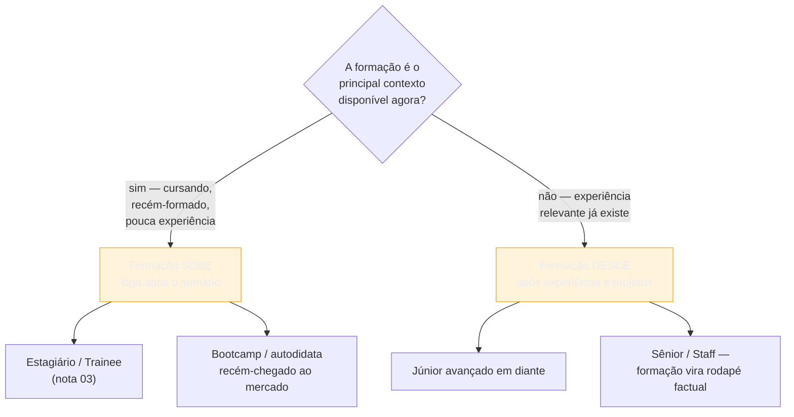

# Formação, cursos e certificações

> [!abstract] TL;DR
> **A seção de formação muda de posição, de tamanho e de peso conforme o nível de carreira e a porta de entrada pela qual a pessoa chegou até ali** — a [[03-Dominios/Carreira/Currículo/02 - As portas de entrada no mercado|nota 02]] mapeou as dez portas, e é aqui, mais do que em qualquer outra peça do documento, que a porta escolhida decide o que a seção precisa provar. Ensino superior concluído ou em andamento, curso técnico, bootcamp com carga horária significativa e certificação reconhecida pelo mercado entram; ensino médio quando já há superior, curso de poucas horas e certificado de participação sem avaliação técnica não entram — vão, quando muito, para uma seção diferente. A posição no documento **sobe** — para logo após o sumário — quando a formação é o principal contexto disponível, e **desce** — para depois de experiência e projetos — quando a experiência já fala por si, no mesmo par de verbos que a [[03-Dominios/Carreira/Currículo/03 - Os seis níveis e o que muda entre eles|nota 03]] usou para o conteúdo da escada de senioridade. Quem ainda estuda declara a previsão de conclusão, porque essa data é informação de planejamento de contratação, não curiosidade. E o coração desta nota é a curadoria: uma lista de trinta linhas de curso passa a impressão oposta da pretendida — acúmulo sem direção, não versatilidade —, e o critério que resolve isso é sempre o mesmo, curso a curso, "isto é relevante para **esta** vaga, ou só aconteceu."

## Trinta linhas de curso, e o que elas realmente comunicam

> [!example] Caso fictício
> Otávio Reis tem quatro anos de experiência como desenvolvedor front-end e está se candidatando a uma vaga de engenheiro front-end sênior numa fintech. A seção de formação do currículo dele começa com a graduação em Análise e Desenvolvimento de Sistemas, o que é esperado e correto — mas não para por aí: logo abaixo, ele lista, em ordem cronológica de conclusão, um curso de introdução a redes de computadores, uma certificação de Scrum Master, um bootcamp de ciência de dados de duzentas horas feito três anos atrás, um curso livre de machine learning com Python, duas certificações de nuvem de níveis introdutórios de dois provedores diferentes, um curso de UX writing, e mais oito cursos curtos de plataformas online, cada um com o nome completo da plataforma e a carga horária ao lado. A seção inteira ocupa quase um terço da primeira página. Otávio não inventou nada — cada linha é verdadeira, cada curso foi de fato concluído — e é exatamente por isso que o problema é mais difícil de enxergar do que um erro factual: a seção passa, tecnicamente, no teste de honestidade, e falha silenciosamente em outro teste, que é o teste da leitura de quem tria uma vaga de front-end em poucos segundos e vê, entre as primeiras linhas do documento, um curso de machine learning.

O que a pessoa que tria a vaga de Otávio conclui, diante dessa lista, não é "esse candidato investiu muito em aprender" — é algo mais parecido com "esse candidato não sabe o que é relevante para esta vaga, ou não teve tempo de descobrir antes de mandar o currículo". A intenção por trás da lista longa costuma ser generosa: mostrar disposição para aprender, amplitude, curiosidade técnica. O efeito, na prática, é o oposto do pretendido, porque uma lista de trinta linhas não lê como "essa pessoa aprende rápido" — lê como "essa pessoa acumula sem filtrar", e acumular sem filtrar é exatamente o traço que ninguém quer contratar para decidir arquitetura, escrever código de produção sob prazo, ou proteger o tempo escasso de quem revisa currículo. O curso de machine learning, especificamente, é o pior item da lista de Otávio, não porque machine learning seja um assunto ruim, mas porque ele está posicionado numa candidatura de front-end — e o corolário incômodo que esta nota vai tratar em detalhe mais adiante é justamente esse: um curso fora do escopo da vaga não demonstra versatilidade para quem tria, demonstra falta de foco na leitura de quem vai decidir se aquele currículo merece os próximos trinta segundos de atenção.

Esta nota trata a seção de formação como a peça do documento onde essa tensão — entre "mostrar tudo o que já foi feito" e "mostrar só o que importa para esta decisão" — fica mais nítida, porque é também a peça mais fácil de deixar crescer sem controle, já que cada curso concluído parece, isoladamente, um motivo legítimo para entrar. O resto da nota resolve essa tensão em quatro movimentos: o que entra e o que não entra na seção, como cada linha é escrita, onde a seção fica posicionada dependendo do nível e da porta de entrada, e — a parte que dá título a esta seção de abertura — o critério de curadoria que decide, item a item, o que fica e o que sai.

## O que entra e o que não entra

A regra que organiza esta seção não é "tudo que envolveu estudo formal", porque essa regra inclui coisa demais e não distingue o que o leitor precisa saber do que ele só teria que rolar a tela para ignorar. A regra que este galho usa é mais estreita: entra o que funciona como **credencial** — algo que um terceiro reconhece como marco de competência ou de trajetória —, e o resto, mesmo quando é verdadeiro e foi de fato estudado, vai para outro lugar do documento ou não entra de forma alguma.

Quatro categorias entram na seção de formação. A primeira é o **ensino superior**, concluído ou em andamento — bacharelado, licenciatura, tecnólogo — porque é a credencial mais reconhecível do mercado brasileiro e a que qualquer recrutador sabe interpretar sem precisar de contexto adicional. A segunda é o **curso técnico**, cursado numa ETEC, num SENAI, num Instituto Federal ou instituição equivalente — uma credencial com peso próprio, tratada com mais profundidade na seção desta nota que fala especificamente sobre essa porta de entrada. A terceira é o **bootcamp intensivo**, mas com dois filtros que a maioria dos currículos ignora: carga horária significativa (a diferença entre um programa de algumas semanas de imersão em tempo integral e um curso de fim de semana é real e o leitor percebe) e reputação reconhecível no mercado — um bootcamp que aparece com frequência em vagas, em grupos de recrutamento técnico ou em conversas do próprio setor carrega peso que um bootcamp desconhecido, por mais horas que tenha, não carrega sozinho. A quarta é a **certificação reconhecida pelo mercado** — uma certificação de nuvem de um provedor grande, uma certificação de metodologia com processo de exame estruturado, uma certificação de linguagem ou de segurança da informação com prova avaliativa por trás. O traço comum às quatro categorias é que todas produzem um terceiro disposto a confirmar, de algum jeito verificável, que a competência declarada existe — uma instituição de ensino, uma organização certificadora, um processo de avaliação com critério público.

Três categorias, por outro lado, não entram nesta seção, e cada uma tem um motivo diferente. **Ensino médio regular, quando já existe ensino superior**, não entra — não porque o ensino médio deixe de ser verdade, mas porque ele para de funcionar como credencial relevante assim que existe uma credencial mais recente e mais forte cobrindo o mesmo terreno; um currículo de quem já concluiu a graduação que lista o ensino médio ao lado dela está gastando uma linha inteira em algo que o leitor já presume, porque ninguém chega à graduação sem passar pelo ensino médio antes. **Curso de poucas horas** — um curso online de um fim de semana, uma trilha curta de plataforma, um workshop de algumas horas — também não entra nesta seção; se for relevante para a vaga específica, ele tem um lugar mais adequado, a seção de cursos curtos ou de desenvolvimento contínuo, separada da seção de formação, onde o leitor já espera uma lista mais densa e mais tolerante a itens pequenos, sem que cada um deles precise carregar o mesmo peso de credencial que um diploma ou uma certificação carregam. E **certificado de participação em evento sem conteúdo técnico avaliado** não entra em lugar nenhum do currículo — um certificado de presença numa palestra, numa conferência ou num evento de networking prova que a pessoa esteve numa sala, não que ela aprendeu ou demonstrou nada mensurável, e incluir esse tipo de item na seção de formação dilui, para o leitor, a credibilidade dos itens ao lado que de fato passaram por algum processo avaliativo.

## O formato da linha, e a previsão de conclusão para quem ainda estuda

Cada linha da seção de formação segue um formato compacto e previsível, porque o leitor já sabe, antes de ler, quais quatro informações procurar: o nome da credencial, a instituição, o período, e — quando aplicável — algum destaque que sustente relevância direta para a vaga. Uma linha de graduação concluída soa como "Bacharelado em Ciência da Computação — Universidade Federal de Uberlândia, 2019-2023"; uma certificação soa como "AWS Certified Solutions Architect – Associate — Amazon Web Services, obtida em março de 2024"; um bootcamp soa como "Formação em Desenvolvimento Web Full Stack, 900 horas — [nome do bootcamp], concluída em 2023". Nenhuma dessas linhas precisa de um parágrafo de contexto embaixo — a seção de formação existe, precisamente, para ser lida em segundos, não em minutos, e cada linha que exige explicação extra provavelmente pertence a outra parte do documento, como a seção de projetos ou a de experiência.

Para quem ainda está cursando, existe uma peça de informação que a maioria dos currículos brasileiros simplesmente omite, e essa omissão custa mais do que parece: a **previsão de conclusão**. "Cursando" sozinho é uma frase incompleta do ponto de vista de quem lê, porque ela não responde à pergunta que motivou a leitura da linha em primeiro lugar — quando essa pessoa está disponível para assumir um compromisso de trabalho integral? "Cursando, previsão de conclusão em dezembro de 2027" responde essa pergunta em seis palavras, e a diferença entre as duas versões não é estética, é informacional: quem recruta para um programa de estágio ou de trainee frequentemente planeja o calendário de contratação em torno de datas de formatura, porque programas desse tipo costumam ter janelas específicas ligadas ao momento em que turmas inteiras de formandos entram no mercado ao mesmo tempo. Uma linha sem data de previsão obriga o recrutador a perguntar isso numa etapa posterior do processo, ou — pior, do ponto de vista do candidato — a descartar o currículo por falta de informação suficiente para decidir se vale investir tempo numa conversa, quando a resposta, na verdade, já estava disponível e só não foi escrita.

A mesma lógica de data explícita vale, com menos urgência, para quem concluiu recentemente: "Bacharelado em Engenharia de Software — PUC-SP, 2020-2025" já comunica que a formação foi concluída dentro do período informado, sem precisar da palavra "concluído" ao lado, porque o intervalo de datas fechado já é, por convenção do formato, sinônimo de conclusão. A ambiguidade só aparece quando a data final falta — e é exatamente aí que a previsão de conclusão precisa suprir o vazio, para quem ainda está no meio do curso.

## A posição no documento: quando a formação sobe, quando ela desce

A pergunta "onde, no currículo, a seção de formação deve aparecer" não tem uma resposta única, porque a resposta certa depende do que mais o documento tem disponível para provar naquele momento específico da carreira — e é aqui que esta nota pega emprestado, deliberadamente, o par de verbos que a [[03-Dominios/Carreira/Currículo/03 - Os seis níveis e o que muda entre eles|nota 03]] já usou para descrever o conteúdo da seção de experiência ao longo da escada de senioridade, aplicando-o agora à posição física de uma seção inteira dentro do documento, não só ao conteúdo de uma linha.

A formação **sobe** — aparece logo depois do sumário profissional, antes mesmo da seção de experiência, quando existir uma — para quem está cursando ou se formou recentemente, porque, nesse momento da carreira, a formação é o principal contexto concreto e verificável que o documento tem disponível. Um estagiário ou um trainee, como a nota 03 já registrou ao descrever esses dois primeiros degraus da escada, não tem, tipicamente, um histórico profissional longo o suficiente para carregar o peso da primeira metade do documento sozinho — e colocar a formação logo no início não é um gesto de modéstia nem uma regra arbitrária de formatação, é reconhecer, com honestidade, qual informação o leitor mais precisa para decidir se aquele candidato vale uma conversa. Empurrar a formação para o final do documento, nesse estágio da carreira, obriga o leitor a atravessar seções mais rasas — um estágio curto, um projeto acadêmico, uma lista de habilidades ainda em construção — antes de chegar à informação mais forte que o candidato tem para oferecer.

A formação **desce** — passa para depois da seção de experiência e da seção de projetos, geralmente perto do fim do documento — assim que a experiência profissional já for suficiente para carregar sozinha o peso de convencer o leitor. Isso costuma acontecer a partir do nível júnior avançado ou pleno, e fica cada vez mais inequívoco à medida que a carreira sobe até sênior e staff: o leitor de um currículo de staff, como a nota 03 também já registrou, procura decisão de arquitetura, impacto entre times e mentoria em escala — nenhuma dessas três coisas está na seção de formação, e colocar a graduação concluída há quinze anos no topo do documento de um staff engineer empurra a informação mais relevante para uma posição secundária, atrasando exatamente o momento em que o leitor mais apressado teria acesso ao que de fato importa decidir.

O diagrama fixa a régua de decisão numa única pergunta, mas vale nomear a exceção que confirma a regra: a porta de entrada pode fazer a formação subir mesmo quando a experiência já existe, se essa formação for, especificamente, a credencial que abre a porta certa para a vaga em questão — um mestrado recente e diretamente ligado à área da candidatura, por exemplo, pode justificar uma posição mais alta mesmo para quem já tem alguns anos de trabalho, porque nesse caso a formação não está competindo com a experiência por relevância, está complementando-a de um jeito que o leitor da vaga específica vai valorizar. A seção mais adiante sobre pós-graduação em transição de carreira trata esse caso com mais detalhe.

## A curadoria é o coração da seção

Voltando ao problema que abriu esta nota: a seção de formação de Otávio Reis não está errada porque contém uma mentira — está errada porque não aplicou nenhum critério de seleção além de "eu fiz isso". E o critério que resolve o problema, para qualquer pessoa nessa mesma posição, cabe numa frase só: **o curso entra se for relevante para esta vaga específica, não porque foi feito.**

Essa frase parece óbvia quando lida isoladamente, mas ela exige um passo que a maioria das pessoas pula por economia de tempo — reler a própria seção de formação, vaga por vaga, e perguntar, item a item, se aquele curso ajuda o leitor **desta** candidatura específica a decidir que a pessoa serve para **esta** vaga, ou se ele só está ali porque nunca foi removido desde que entrou. A [[03-Dominios/Carreira/Currículo/18 - Adaptar por vaga sem reescrever|nota 18]], mais adiante neste galho, trata a fundo a adaptação cirúrgica do currículo inteiro por vaga — sumário, ordem, ênfase dos bullets — e a seção de formação segue exatamente a mesma lógica: o currículo de Otávio para uma vaga de front-end e o currículo de Otávio para uma vaga de engenharia de dados podem, legitimamente, ter seções de formação diferentes, porque a mesma pessoa, com a mesma trajetória real, tem itens diferentes que valem a pena destacar dependendo de qual conversa o documento está tentando abrir.

O corolário incômodo que esta nota já anunciou na abertura merece ser dito com todas as letras, porque é o ponto que mais gente resiste a aceitar: **um curso de machine learning numa candidatura de front-end não demonstra versatilidade — demonstra falta de foco na leitura de quem tria.** A intuição comum é que mostrar amplitude de interesses técnicos é sempre um ativo, porque prova curiosidade e capacidade de aprender coisa nova. Essa intuição não está errada em abstrato — só está no lugar errado. Quem tria uma vaga específica não está avaliando o quão interessante é a pessoa como profissional de tecnologia em geral; está avaliando, num intervalo curto de tempo, se aquele currículo específico serve para aquela vaga específica, e cada item fora do escopo que a pessoa colocou na frente aumenta o esforço cognitivo necessário para chegar aos itens que de fato importam para essa decisão. Um curso de machine learning é, em si, uma credencial perfeitamente respeitável — só não neste currículo, para esta vaga, nesta posição de destaque logo no topo do documento.

Isso não significa que o curso de machine learning precise desaparecer da vida profissional de Otávio, nem mesmo do próprio currículo dele em toda e qualquer situação — significa que ele pertence a uma versão diferente do documento, adaptada para uma vaga em que esse curso de fato é relevante, ou a uma seção de menor destaque quando a candidatura não tem relação direta com aquele assunto. A curadoria não é sobre esconder competência real; é sobre posicionar, em cada versão do currículo, apenas o que ajuda o leitor daquela versão específica a decidir mais rápido. Uma seção de formação com quatro ou cinco itens bem escolhidos, todos claramente relevantes para a vaga em questão, comunica disciplina de julgamento — a mesma disciplina que o leitor está, implicitamente, tentando avaliar em qualquer outra parte do currículo. Uma seção com trinta itens comunica o oposto, mesmo quando cada um dos trinta é, isoladamente, verdadeiro.

## Onde o caminho de entrada pesa mais

A [[03-Dominios/Carreira/Currículo/02 - As portas de entrada no mercado|nota 02]] já mapeou as dez portas de entrada no mercado de tecnologia e o requisito formal de cada uma. Nenhuma outra peça do currículo é tão sensível a qual dessas portas a pessoa atravessou quanto a seção de formação — porque é justamente essa seção que registra, de forma mais direta, o próprio caminho de entrada. Quatro situações merecem tratamento explícito, porque cada uma pede uma decisão diferente sobre o que colocar nessa seção e como apresentá-lo.

### Bootcamp e curso livre

Quem entrou pela porta do bootcamp ou do curso livre — a porta 5 na numeração da nota 02 — enfrenta um problema de calibração em duas direções opostas, e errar para qualquer um dos dois lados custa caro. Inflar o bootcamp como se fosse equivalente a um diploma de graduação — usando linguagem que sugere formação acadêmica completa quando o programa, na verdade, foi um curso intensivo de alguns meses — quebra a confiança do leitor assim que ele pergunta, na entrevista, um detalhe que só faria sentido para quem passou quatro anos numa graduação; e o custo de uma inconsistência descoberta na conversa é maior do que o custo de nunca ter tido a credencial em primeiro lugar. O erro simétrico — se envergonhar do bootcamp, escondê-lo ou apresentá-lo de um jeito tão discreto que ele quase desaparece da seção — desperdiça a credencial mais concreta que essa porta de entrada de fato produz, porque um bootcamp de carga horária significativa e reputação reconhecível no mercado é, sim, um sinal real de investimento estruturado em aprendizado, só que num formato diferente do universitário.

O que resolve essa calibração é nomear o programa pelo que ele é, sem eufemismo e sem inflar: "Formação em Desenvolvimento Web Full Stack, 900 horas — [nome do bootcamp], concluída em 2023" comunica exatamente o formato certo, sem se disfarçar de bacharelado nem se esconder atrás de uma linha genérica. O que substitui o diploma, na cabeça de quem lê um currículo com essa origem, não é o nome do bootcamp sozinho — é o que veio **depois** dele: projetos concluídos, contribuições em repositórios públicos, alguma experiência profissional real, por menor que seja, que confirme que o aprendizado do bootcamp virou capacidade de entrega. A [[03-Dominios/Carreira/Currículo/10 - Inventário de evidência|nota 10]], mais adiante neste galho, trata em profundidade como converter o material dessa porta específica em evidência aproveitável para o restante do documento — a seção de formação sozinha carrega parte do peso, mas não o peso inteiro.

### Autodidata sem diploma

Quem entrou pela porta do autodidatismo puro — a porta 6 da nota 02 — enfrenta uma situação estruturalmente diferente: para essa pessoa, a seção de formação, no sentido tradicional do termo, simplesmente está vazia, porque não existe instituição, programa ou certificado formal por trás da competência técnica que ela de fato tem. A tentação comum, diante de uma seção vazia, é preenchê-la de qualquer jeito — listar cursos curtos, tutoriais concluídos, playlists inteiras de vídeo assistidas até o fim — só para que a seção não pareça um buraco no meio do documento. Essa tentação produz exatamente o mesmo problema da curadoria descuidada de Otávio, só que pelo caminho inverso: em vez de trinta cursos irrelevantes acumulados sem filtro ao longo de uma carreira, é uma pessoa inflando o pouco que tem disponível na esperança de que o volume disfarce a ausência de credencial formal.

O que de fato ocupa o lugar da seção de formação, para quem entrou por essa porta, não é uma versão inflada da própria seção de formação — é outra seção inteira, deslocada para uma posição de destaque equivalente: projetos com código público e README explicando decisão técnica, contribuições verificáveis em repositórios de terceiros, um histórico de aprendizado sustentado ao longo do tempo que a [[03-Dominios/Carreira/Currículo/21 - O brag document|nota 21]] ensina a registrar antes que o esquecimento o apague. E, contraintuitivamente, **deixar a seção de formação vazia — ou reduzida a uma linha honesta como "formação autodidata em desenvolvimento de software desde [ano]", sem inflar cursos curtos como se fossem credenciais — costuma servir melhor ao candidato do que enchê-la artificialmente**, porque um leitor experiente reconhece o padrão de inflação com facilidade, e uma vez que reconhece esse padrão numa parte do documento, passa a desconfiar, por associação, das demais. Uma seção pequena e honesta preserva a credibilidade do resto do currículo; uma seção inflada arrisca contaminar a leitura inteira.

### Pós, mestrado e doutorado em transição de carreira

Quem atravessa a porta 7 — transição de carreira — carregando, além dela, uma pós-graduação, um mestrado ou um doutorado concluído numa área diferente de tecnologia enfrenta um problema que nenhuma das outras situações desta seção enfrenta: o risco real de ser lido como **acadêmico demais para o mercado**. Um doutorado inteiro, com anos de pesquisa, publicações e uma banca examinadora ao final, é uma credencial impressionante em qualquer contexto acadêmico — e é exatamente essa força que, mal posicionada num currículo de tecnologia, pode soar, para quem tria a vaga, como um sinal de que a pessoa talvez não se adapte ao ritmo, à linguagem e às prioridades de um ambiente de produto e engenharia, mesmo quando essa leitura está completamente equivocada sobre a pessoa real por trás do documento.

> [!example] Caso real
> Cassiana Gabriela Lima Barreto, cuja trajetória a [[03-Dominios/Carreira/Currículo/02 - As portas de entrada no mercado|nota 02]] já registrou com mais detalhe, fez graduação em Engenharia Biomédica na UFU entre 2008 e 2015, mestrado em Engenharia de Sistemas de Saúde entre 2016 e 2018, e doutorado em Sistemas Computacionais e dispositivos aplicados à saúde entre 2020 e 2025 — uma carreira acadêmica inteira, sem interrupção, num campo distante do desenvolvimento de software comercial. Aprendeu Python durante o próprio doutorado, por necessidade da pesquisa, e entrou na Dadosfera em 2024 como trainee **antes de concluir o doutorado**, o que significa que a decisão de contratação foi tomada com o título de doutora ainda incompleto no currículo dela. Fontes citáveis: LinkedIn ([linkedin.com/in/cassianalima](https://linkedin.com/in/cassianalima)) e a página de carreiras da Dadosfera; a trajetória é citada aqui com autorização.

O detalhe mais instrutivo do caso de Cassiana, para o propósito específico desta nota, não é que ela tenha conseguido a vaga apesar da formação acadêmica extensa — é que a formação, nesse caso, funcionou como **ativo**, não como passivo, e a diferença entre as duas leituras depende inteiramente de como a seção foi construída ao redor dela. Um doutorado que aparece no currículo como um bloco isolado, descrito em linguagem acadêmica, com título de tese e nome de orientador em destaque, tende a reforçar exatamente o medo de "acadêmico demais" que abriu esta seção. Um doutorado que aparece acompanhado do que ele produziu de aplicável — no caso dela, o aprendizado de Python e de análise de dados por necessidade concreta da pesquisa, não por interesse abstrato — reformula a mesma credencial como evidência de capacidade técnica real, adquirida sob pressão de um problema difícil, que é precisamente o tipo de prova que um currículo de tecnologia precisa entregar independentemente de qual porta a produziu.

O movimento prático que transforma pós-graduação de passivo em ativo tem três partes. A primeira é reduzir a descrição da formação em si ao essencial verificável — instituição, área, período —, sem o aparato acadêmico completo que faz sentido num currículo de pesquisador, mas soa deslocado num currículo de tecnologia. A segunda é elevar, para um lugar de destaque equivalente ou maior, o que a formação produziu de tecnicamente aplicável — ferramentas aprendidas, análises conduzidas, problemas computacionais resolvidos durante a pesquisa —, tratando esse conteúdo quase como se fosse experiência profissional, porque, do ponto de vista de competência demonstrável, frequentemente é. A terceira é deixar claro, no sumário profissional ou logo no início da seção de experiência, qual é o objetivo atual da pessoa — não "pesquisadora buscando continuar em academia", mas o cargo específico de tecnologia que ela está buscando agora —, porque um leitor que não sabe, de saída, que a pessoa já decidiu migrar de carreira tende a interpretar cada credencial acadêmica como sinal de que ela ainda hesita entre os dois mundos.

### Curso técnico e Instituto Federal

Quem entrou pela porta do curso técnico — ETEC, SENAI, Instituto Federal ou equivalente, a porta 4 da nota 02 — carrega uma vantagem estrutural que vale nomear explicitamente: entra no mercado de trabalho mais cedo do que a maioria das outras portas, com um diploma técnico real emitido por uma instituição reconhecida, muitas vezes antes mesmo de completar dezoito anos. Isso muda duas coisas na seção de formação. A primeira é que o diploma técnico, sozinho, já cumpre o papel de credencial verificável que outras portas — bootcamp, autodidatismo — precisam construir por outros meios; ele entra na seção de formação com o mesmo peso institucional de qualquer diploma, sem precisar de justificativa adicional. A segunda é que, para quem seguiu direto do curso técnico para o mercado sem cursar uma graduação depois, a seção de formação tende a permanecer relevante por mais tempo na carreira do que aconteceria para quem tem ensino superior — porque, na ausência de uma credencial de nível superior, o diploma técnico continua sendo, por mais anos, a peça mais concreta de formação formal disponível no documento, mesmo quando a experiência profissional já é longa o bastante para as demais seções decidirem a candidatura sozinhas.

Vale registrar, com a mesma honestidade que a [[03-Dominios/Carreira/Currículo/04 - Quem lê o seu currículo — e o que a evidência diz|nota 04]] já fixou para o galho inteiro, que esta nota não localizou dado quantitativo controlado comparando taxas de contratação entre quem entra pela porta técnica e quem entra por outras portas — a vantagem de entrada mais cedo descrita aqui é uma leitura estrutural do próprio desenho da porta (a idade mínima mais baixa e o formato mais curto do curso técnico em relação à graduação), não um número medido, e deve ser tratada como tal.

## Casos práticos

> [!example] Caso fictício
> Renata Aquino, a mesma persona que a nota 03 usa para ilustrar os seis níveis de senioridade através de uma única trajetória, acaba de concluir a graduação em Ciência da Computação e está se candidatando à primeira vaga de trainee da carreira. A seção de formação dela ocupa o segundo bloco do currículo, logo abaixo do sumário e acima de qualquer experiência — porque a única experiência prévia que ela tem é um estágio de um ano, cuja densidade de conteúdo ainda não sustenta o documento sozinha. A linha principal soa "Bacharelado em Ciência da Computação — Universidade Federal Fluminense, 2021-2025", seguida por duas linhas de destaque: um projeto de conclusão de curso relevante para a área da vaga, e uma certificação básica de nuvem obtida durante o último ano de graduação. Três outros cursos curtos que ela fez ao longo da faculdade — um workshop de design de interface, uma trilha introdutória de segurança da informação, um curso de oratória — não entram nesta seção; se algum deles for relevante para uma vaga específica no futuro, entra numa seção separada de cursos, não aqui.

> [!example] Caso fictício
> Doze anos depois, a mesma Renata Aquino — agora sênior, tendo liderado a migração de gateway de pagamento que a nota 03 descreve em detalhe — está se candidatando a uma vaga externa pela primeira vez em anos. A seção de formação do currículo dela desceu para o penúltimo bloco do documento, depois da experiência profissional e dos projetos de destaque, reduzida a três linhas: a graduação, sem qualquer menção ao projeto de conclusão de curso que fazia sentido destacar doze anos atrás; a certificação de nuvem básica que obteve no início da carreira, agora ausente, substituída por uma certificação de arquitetura de nível avançado obtida três anos atrás; e nenhuma menção aos três cursos curtos da época da faculdade, que já não carregam peso relevante diante do histórico de decisão técnica que a experiência profissional dela agora demonstra sozinha. O mesmo diploma, a mesma instituição, a mesma data — só a posição no documento e o que ao redor dele foi mantido ou cortado mudaram, seguindo exatamente o eixo sobe/desce descrito nesta nota.

## Armadilhas comuns

> [!warning] Encher a seção de formação para parecer mais robusto
> **O que acontece:** diante da sensação de que a seção de formação está curta demais, especialmente no início da carreira, a pessoa acrescenta cursos curtos, workshops e trilhas online até a seção parecer volumosa o bastante para "impressionar" — o padrão exato que a seção de abertura desta nota descreveu no currículo de Otávio Reis. **Por quê:** uma seção curta parece, à primeira vista, um sinal de pouco investimento em aprendizado, e encher o espaço parece corrigir esse sinal. **Como evitar:** aplicar o critério da curadoria a cada item antes de incluí-lo — "isto é relevante para a vaga que estou candidatando agora, ou só está aqui porque aconteceu" —, lembrando que uma seção curta e bem filtrada comunica disciplina de julgamento, enquanto uma seção longa e mal filtrada comunica o oposto do que pretendia.

> [!warning] Deixar "Cursando" sem previsão de conclusão
> **O que acontece:** quem ainda está no meio de uma graduação, um curso técnico ou uma pós escreve apenas "Cursando" na linha de formação, sem indicar quando o curso termina. **Por quê:** a data de conclusão parece um detalhe menor diante da informação principal — o nome do curso e da instituição —, e é fácil esquecer que o leitor do outro lado está, com frequência, tentando planejar uma contratação em torno de um calendário específico. **Como evitar:** tratar a previsão de conclusão como informação obrigatória, não opcional, sempre que o curso ainda estiver em andamento — "Cursando, previsão de conclusão em dezembro de 2027" em vez de apenas "Cursando" —, porque essa data responde à pergunta real de planejamento que motivou a leitura da linha.

> [!warning] Deixar um bootcamp ou certificação parecer o que não é
> **O que acontece:** a pessoa descreve um bootcamp de alguns meses usando linguagem que sugere formação universitária completa, ou lista uma certificação de nível introdutório com um nome genérico que soa mais avançado do que o exame realmente cobrou. **Por quê:** a intenção costuma ser boa — dar ao próprio esforço de aprendizado o peso que ele merece —, mas o resultado é uma inconsistência que só aparece depois, quando a conversa de entrevista revela um detalhe que só faz sentido para quem passou por uma formação mais longa ou mais avançada do que a credencial real sustenta. **Como evitar:** nomear cada credencial exatamente pelo que ela é — carga horária real, nível real do exame —, confiando que o formato e a reputação do programa, quando de fato significativos, já comunicam o peso certo sem precisar de inflação.

> [!warning] Preencher com cursos curtos a seção vazia de quem é autodidata
> **O que acontece:** quem entrou pela porta do autodidatismo puro, sem diploma nem bootcamp reconhecido, tenta disfarçar a ausência de credencial formal empilhando cursos curtos, tutoriais e trilhas online na seção de formação, na esperança de que o volume compense a falta de uma credencial única e forte. **Por quê:** uma seção de formação visivelmente vazia parece um vácuo constrangedor no meio de um documento que, em todas as outras seções, segue um formato convencional. **Como evitar:** aceitar que a seção pode, de fato, ficar pequena ou quase ausente para essa porta de entrada, e deslocar o peso da prova para onde ele de fato existe — projetos com código público, contribuições verificáveis, histórico de entrega registrado no brag document —, porque uma seção pequena e honesta preserva mais credibilidade do que uma seção inflada com itens que não sustentam comparação com credenciais formais reais.

## Como soa em inglês

> "I treat the education section as a moving target, not a fixed block — it moves up, right after the summary, when it's my strongest piece of context, and it moves down, past experience and projects, once my work history can carry the document on its own. The one discipline I apply every single time is curation: a course only stays in if it's relevant to this specific role, not just because I completed it once. Thirty lines of courses don't read as versatility to a recruiter — they read as someone who never learned to filter. And if I'm still studying, I always state an expected graduation date, because that date is planning information for whoever might hire me, not a detail to leave vague."

| PT | EN |
| --- | --- |
| formação | education |
| curso técnico | technical/vocational course |
| bootcamp | bootcamp (termo consagrado) |
| certificação reconhecida pelo mercado | industry-recognized certification |
| previsão de conclusão | expected graduation date |
| curadoria | curation |
| credencial | credential |
| autodidata | self-taught |
| transição de carreira | career changer / career transition |
| pós-graduação | graduate degree |

## O que vem a seguir

Fechada a seção de formação — a peça mais sensível à porta de entrada de todo o documento —, o galho segue para a seção que decide o que fica visível como competência técnica direta, e depois para a ponte que converte qualquer trajetória, formal ou não, em material aproveitável:

- [[03-Dominios/Carreira/Currículo/09 - Habilidades técnicas|09 - Habilidades técnicas]] — a próxima seção do documento, onde o mesmo princípio de curadoria desta nota reaparece sob outro nome: a regra de lastro, não listar o que não se sustenta numa pergunta.
- [[03-Dominios/Carreira/Currículo/10 - Inventário de evidência|10 - Inventário de evidência]] — a ponte entre as dez portas da nota 02 e o material real que cada uma produz, incluindo o que fazer quando a formação, sozinha, não é suficiente para provar competência.
- [[03-Dominios/Carreira/Currículo/18 - Adaptar por vaga sem reescrever|18 - Adaptar por vaga sem reescrever]] — a mesma lógica de curadoria por vaga, aplicada ao currículo inteiro, não só à seção de formação.
- [[03-Dominios/Carreira/Currículo/26 - Seis currículos, uma carreira|26 - Seis currículos, uma carreira]] — capstone do galho, com a trajetória completa de Cassiana Gabriela Lima Barreto retomada em mais detalhe.

## Veja também

- [[03-Dominios/Carreira/Currículo/index|Currículo]] — o índice do galho, com a tese e o mapa das 26 notas.
- [[03-Dominios/Carreira/Currículo/02 - As portas de entrada no mercado|02 - As portas de entrada no mercado]] — as dez portas, o requisito formal de cada uma, e o caso completo de Cassiana Gabriela Lima Barreto, retomado aqui sob o ângulo específico da formação.
- [[03-Dominios/Carreira/Currículo/03 - Os seis níveis e o que muda entre eles|03 - Os seis níveis e o que muda entre eles]] — o vocabulário sobe/desce que esta nota reaproveita para a posição da seção de formação no documento.
- [[03-Dominios/Carreira/Currículo/04 - Quem lê o seu currículo — e o que a evidência diz|04 - Quem lê o seu currículo — e o que a evidência diz]] — o gate factual do galho, cujo vocabulário de evidência sólida, plausível mas não medida e caixa-preta declarada esta nota reusa ao tratar a vantagem da porta técnica.
- [[03-Dominios/Carreira/Currículo/21 - O brag document|21 - O brag document]] — o hábito que ocupa, para quem é autodidata, o lugar que a formação ocupa para quem passou por uma porta institucional.
- [[03-Dominios/Carreira/Entrevistas/index|Entrevistas]] — o galho parceiro: a formação declarada no currículo costuma virar, na entrevista, a primeira pergunta de contexto sobre a trajetória de quem se candidata.

## Fontes

- Esta nota não depende de estudo quantitativo específico sobre composição da seção de formação; o critério central — relevância para a vaga específica, não acúmulo histórico — é análise estrutural do próprio autor, apoiada no vocabulário de leitores já sourced pela [[03-Dominios/Carreira/Currículo/04 - Quem lê o seu currículo — e o que a evidência diz|nota 04]].
- **Cassiana Gabriela Lima Barreto** — [linkedin.com/in/cassianalima](https://linkedin.com/in/cassianalima), perfil público no LinkedIn, com dados adicionais confirmados na página de carreiras da Dadosfera, conforme já registrado com a fonte completa na [[03-Dominios/Carreira/Currículo/02 - As portas de entrada no mercado|nota 02]]. Trajetória citada aqui, com autorização, sob o ângulo específico de formação acadêmica extensa em transição de carreira.
- Otávio Reis e as duas versões de Renata Aquino são personas fictícias criadas para esta nota, seguindo a mesma convenção de etiquetagem que o restante do galho usa para toda persona fictícia; Renata Aquino reutiliza a persona já apresentada na [[03-Dominios/Carreira/Currículo/03 - Os seis níveis e o que muda entre eles|nota 03]].
- A vantagem de entrada mais cedo atribuída à porta do curso técnico é leitura estrutural do desenho legal e etário dessa porta, já descrito com fonte primária na [[03-Dominios/Carreira/Currículo/02 - As portas de entrada no mercado|nota 02]] (Lei nº 11.788/2008); nenhum dado quantitativo comparando taxas de contratação entre portas foi localizado para esta nota, e a ausência é declarada explicitamente no corpo do texto.
