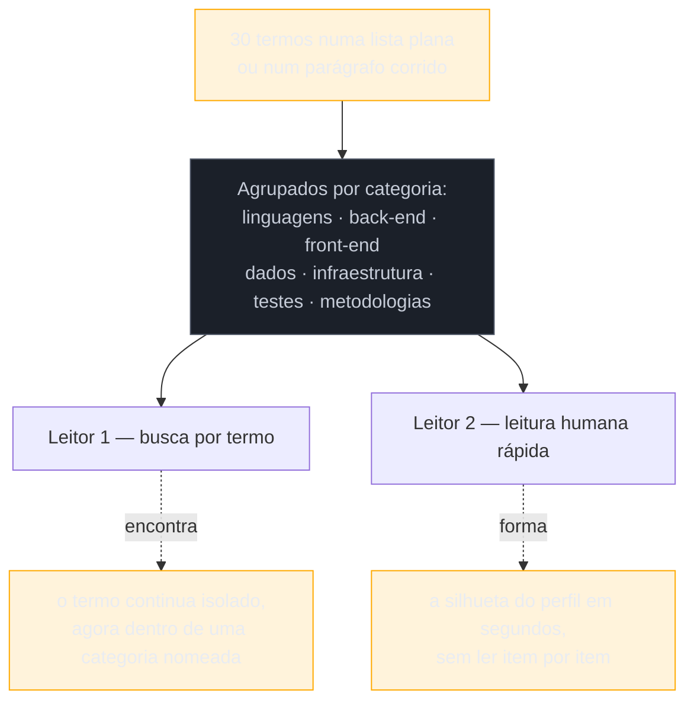
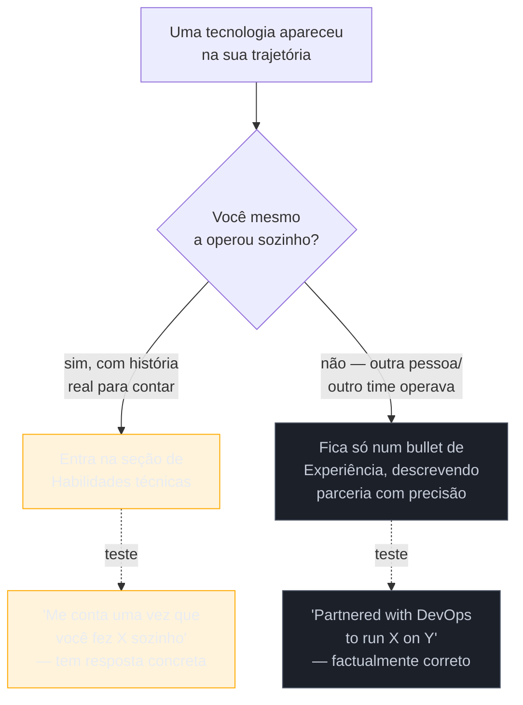

# Habilidades técnicas

> [!abstract] TL;DR
> A seção de habilidades técnicas serve **dois leitores com necessidades opostas** — a busca por termo, que quer encontrar a palavra exata da vaga, e a leitura humana rápida, que quer entender o perfil em segundos — e a maioria dos currículos escolhe um formato que atrapalha os dois ao mesmo tempo: a **lista de ingredientes**, trinta tecnologias despejadas sem categoria, sem hierarquia e sem contexto. A **barra de proficiência** — aquele retângulo colorido preenchido até 80% para "React" — é pior do que parece por duas razões independentes: ela quebra na extração de texto (mecanismo já tratado na [[03-Dominios/Carreira/Currículo/05 - Formato e legibilidade de máquina|nota 05]]) e, mais grave, **ela não significa nada** — não há escala, não há aferição, não há referência externa, só a sensação de quem preencheu a barra. O coração desta nota é a **regra de lastro**: não liste o que você não sustenta numa pergunta de entrevista, porque a entrevista expõe a lacuna de um jeito muito mais constrangedor do que a omissão jamais custaria — e a distinção mais fina que a regra ensina é que descrever **parceria** com uma tecnologia não é o mesmo que reivindicar **operação** dela.

## Dois leitores, um formato

Nenhuma outra seção do currículo serve dois leitores tão diferentes ao mesmo tempo quanto a de habilidades técnicas, e é essa tensão — não a falta de conteúdo, quase sempre há conteúdo de sobra — que explica por que ela costuma sair pior do que qualquer outra parte do documento.

**O primeiro leitor é a busca por termo.** A [[03-Dominios/Carreira/Currículo/04 - Quem lê o seu currículo — e o que a evidência diz|nota 04]] já descreveu esse mecanismo em detalhe: um recrutador com centenas de candidaturas na fila faz uma busca booleana dentro do próprio ATS — algo como "Java" AND "Spring" AND "5 anos" — para reduzir o volume a um subconjunto administrável, e um recrutador sem ATS algum faz a mesma coisa com os próprios olhos, escaneando o documento atrás da palavra que a vaga pede. Os dois processos têm o mesmo requisito: **o termo precisa estar ali, escrito, isolado, no vocabulário que quem procura vai digitar** — não embutido numa frase composta, não substituído por um sinônimo, não presumido a partir de contexto. A seção de habilidades é, estruturalmente, o lugar do documento mais bem desenhado para atender esse requisito, porque é onde o leitor espera encontrar uma lista concentrada de termos, sem precisar reconstruir o vocabulário a partir de bullets de experiência escritos em prosa.

**O segundo leitor é a leitura humana rápida.** É o segundo leitor da nota 04 fazendo a varredura de segundos que decide se vale a pena continuar, ou o terceiro leitor formando a primeira impressão de amplitude e profundidade antes de entrar nos detalhes da experiência. Esse leitor não está caçando um termo específico — está tentando responder, em poucos segundos, uma pergunta mais ampla: **que tipo de profissional é essa pessoa?** Front-end, back-end, dados, infraestrutura, um pouco de tudo sem foco em nada? A resposta que esse leitor busca é de forma, não de presença — ele quer a silhueta do perfil, não a lista completa de tudo que a pessoa já tocou.

O problema é que essas duas necessidades puxam o formato em direções opostas. Uma lista densa, sem organização nenhuma, maximiza a chance de qualquer termo específico aparecer — o que ajuda o primeiro leitor — mas produz exatamente o ruído que impede o segundo leitor de formar qualquer silhueta em segundos. Uma lista curadíssima, com só três ou quatro tecnologias centrais bem destacadas, ajuda o segundo leitor a formar a silhueta rápido, mas pode fazer o primeiro leitor não encontrar um termo que a pessoa de fato domina, só porque ele não pareceu central o suficiente para entrar na lista enxuta.

> [!example] Caso fictício
> Bianca Torres, desenvolvedora backend pleno, aplica para duas vagas na mesma semana com o mesmo currículo. Na primeira, uma fintech de porte médio, um recrutador humano abre o documento, passa cinco segundos na seção de habilidades tentando entender se ela é mais back-end ou mais dados antes de decidir se vale a pena ler o resto — ele nunca vai buscar um termo específico, porque não está usando busca nenhuma, só está olhando a página. Na segunda, uma multinacional com milhares de candidaturas por vaga, ninguém olha o documento inteiro na primeira passada — um recrutador roda uma busca por "Python" AND "PostgreSQL" dentro do próprio ATS, e o currículo de Bianca só chega à fila de revisão humana se as duas palavras aparecerem, isoladas, em algum lugar do texto extraído. O mesmo documento precisa passar pelos dois filtros ao mesmo tempo, sem saber de antemão qual dos dois vai processá-lo primeiro — e é exatamente por isso que o formato da seção não pode escolher servir só um dos dois leitores.

A boa notícia, que o resto desta nota converte em prática, é que as duas necessidades não são de fato incompatíveis — só parecem incompatíveis quando o formato escolhido é a lista plana. Uma lista **organizada por categoria** resolve as duas ao mesmo tempo: o termo continua presente, isolado, buscável, e a categoria em que ele aparece já entrega a silhueta que o segundo leitor procura, sem exigir que ele leia palavra por palavra.

## A lista de ingredientes e a sopa de letrinhas

Os dois anti-padrões mais comuns desta seção têm nome, e vale nomeá-los com precisão, porque cada um ataca um leitor diferente dos dois descritos acima.

**A lista de ingredientes** é o anti-padrão da quantidade sem hierarquia: uma enumeração de vinte, trinta tecnologias, todas no mesmo nível visual, sem nenhuma indicação de qual pesa mais, qual foi usada há anos e qual foi tocada uma vez num curso. O nome vem de uma comparação simples — é como ler o rótulo de um produto industrializado, uma lista de componentes em ordem de proporção que ninguém lê com atenção, porque não existe informação nenhuma além da presença. Quem escreve uma lista de ingredientes normalmente age de boa-fé: quer parecer completo, quer garantir que nenhuma tecnologia relevante fique de fora, teme que cortar algo custe uma oportunidade. O resultado, para o segundo leitor da seção anterior, é o oposto do pretendido — uma lista sem hierarquia não comunica amplitude, comunica **falta de critério**, porque não diz ao leitor o que de fato importa dentro dela.

**A sopa de letrinhas** é um anti-padrão vizinho, mas não idêntico: é a lista de ingredientes despejada dentro de um **parágrafo corrido**, em vez de uma lista visual — "desenvolvedor com experiência em Java, Python, JavaScript, React, Angular, Vue, Node.js, Spring Boot, Django, Flask, PostgreSQL, MySQL, MongoDB, Redis, Docker, Kubernetes, AWS, Azure, GCP, Git, Jenkins, CI/CD, Scrum, Kanban..." — um trecho de texto denso de siglas e nomes próprios, sem pontuação que ajude o olho a parar em algum lugar. O nome descreve o efeito de leitura com precisão: as letras se misturam numa massa indistinta, e nenhum termo se destaca dos vizinhos. É o mesmo problema da lista de ingredientes, piorado pela falta até da estrutura visual mínima que uma lista com marcadores oferece — pelo menos a lista de ingredientes deixa cada item numa linha própria; a sopa de letrinhas nem isso.

Os dois anti-padrões compartilham a mesma causa-raiz: tratar a seção de habilidades como um **inventário exaustivo**, em vez de uma **ferramenta de comunicação**. A régua errada é "quanto mais tecnologias eu listar, mais completo pareço"; a régua certa, que a seção seguinte converte em prática, é "que organização deste conjunto de termos ajuda o leitor a entender o meu perfil mais rápido, sem perder nenhum termo que a busca precisa encontrar".

> [!example] Caso fictício
> O mesmo conjunto de tecnologias, dois formatos lado a lado, ilustra a diferença sem precisar de explicação adicional.
>
> **Lista de ingredientes / sopa de letrinhas:** "Habilidades: Java, Python, JavaScript, TypeScript, React, Angular, Node.js, Spring Boot, Express, PostgreSQL, MySQL, MongoDB, Redis, Docker, Kubernetes, Jenkins, GitLab CI, AWS, Azure, Terraform, Ansible, Nginx, RabbitMQ, Kafka, Jest, Cypress, Selenium, Scrum, Kanban, JIRA."
>
> **Organizado por categoria:** "Linguagens: Java, Python, TypeScript. Back-end: Spring Boot, Node.js/Express, arquitetura de microsserviços. Dados: PostgreSQL, Redis, Kafka. Infraestrutura: Docker, Kubernetes, Terraform, AWS (EC2, RDS, S3). Testes: Jest, Cypress. Metodologias: Scrum."
>
> As duas versões contêm quase o mesmo conjunto de termos — a segunda cortou alguns itens de menor relevância e fundiu outros (GitLab CI dentro de um menção implícita de pipeline, Ansible e Nginx removidos por serem periféricos ao perfil) —, mas a segunda responde, em três segundos de leitura, à pergunta "que tipo de profissional é esse?" (back-end pleno, com peso real em infraestrutura), enquanto a primeira exige que o leitor monte essa resposta sozinho, item por item, sem nenhuma ajuda do próprio documento.

## Organização por categoria

A correção para os dois anti-padrões é a mesma, e é simples de enunciar: **agrupar os termos por função, não despejá-los numa sequência única.** As categorias variam de perfil para perfil, mas um conjunto comum, que cobre a maioria dos currículos de tecnologia, inclui linguagens, back-end, front-end, dados, infraestrutura, testes e metodologias — nem todo currículo usa todas as sete, e um currículo de front-end puro provavelmente não tem nada relevante para a categoria de dados, o que é esperado, não uma falha.

Vale ser preciso sobre o que a categorização resolve e o que ela não resolve. Ela não reduz, por si, a quantidade de termos — um currículo pode continuar listando vinte e cinco tecnologias, organizadas em sete categorias, sem que isso vire uma lista de ingredientes, porque a organização já entrega a hierarquia que a lista plana não tinha. E ela não substitui a curadoria — cortar tecnologias irrelevantes ou marginais continua sendo parte do trabalho, tratado na seção sobre a regra de lastro adiante. As duas decisões — organizar e cortar — são independentes, e a maioria dos currículos precisa das duas ao mesmo tempo, não de uma só.

Um efeito colateral útil da categorização, que poucos guias de currículo mencionam, é que ela também ajuda o **primeiro leitor** — a busca por termo — de um jeito indireto: um recrutador que varre visualmente a página, sem usar busca automatizada nenhuma, encontra mais rápido a categoria relevante (por exemplo, "Infraestrutura", se a vaga é de DevOps) e lê com atenção só aquela linha, ignorando o resto com segurança, porque a categoria já sinalizou que ali está o que ele procura. A categorização não beneficia só quem lê rápido em busca da silhueta — beneficia também quem lê rápido em busca de um termo específico, porque reduz a área de busca visual antes mesmo de o olho encontrar a palavra exata.

O diagrama fixa o ponto central desta seção: a categorização não é um sacrifício que troca um leitor pelo outro — é a única operação que atende os dois ao mesmo tempo, porque o problema nunca foi a quantidade de termos, foi a ausência de estrutura entre eles.

## A barra de proficiência, e por que ela é pior do que parece

Um elemento visual recorrente em currículos com pretensão de design é a **barra de proficiência**: um retângulo, ou uma fileira de círculos preenchidos, ao lado de cada tecnologia, indicando um nível — 80% de React, quatro de cinco bolinhas em Python, "avançado" numa escala de três degraus. O elemento parece resolver um problema real — nem toda tecnologia listada tem o mesmo peso na experiência da pessoa, e distinguir isso parece útil —, e é por isso que ele continua aparecendo em templates de currículo mesmo depois de anos de crítica ao formato.

A primeira razão pela qual a barra de proficiência é um problema já foi tratada em profundidade pela [[03-Dominios/Carreira/Currículo/05 - Formato e legibilidade de máquina|nota 05]]: é um elemento gráfico sem equivalente em texto simples, e o mecanismo de extração descrito ali — se apagar tudo que não é texto, a informação essencial ainda está ali em palavras? — falha exatamente aqui. Para o extrator, a barra é um retângulo colorido sem conteúdo textual nenhum; o campo correspondente ao "nível" fica vazio, mesmo que o olho humano leia "80% preenchido" sem esforço. Esta nota não repete o mecanismo — ele já está descrito com o detalhe técnico completo na nota 05 — mas vale marcar que esse é só o **primeiro** dos dois problemas, e não o mais grave.

**A razão mais forte é semântica, não mecânica: a barra de proficiência não significa nada.** Pare um segundo na pergunta que ela finge responder — o que é "80% de React"? Não existe uma escala pública, aferida, contra a qual esse número foi medido. Não há exame de certificação por trás dele, não há um avaliador externo, não há sequer uma definição compartilhada do que separaria 70% de 80% de 90%. O número inteiro nasce de um único lugar: **a sensação subjetiva de quem preencheu a barra**, no dia em que preencheu, sobre o próprio domínio de uma tecnologia — um julgamento que muda de humor para humor, que tende a subir depois de um projeto bem-sucedido recente e a cair depois de uma sessão de debugging frustrante, e que nunca foi calibrado contra nada fora da própria cabeça de quem o escreveu.

O problema não é só que o número seja impreciso — é que ele **finge precisão que não existe**. Um percentual é, por convenção visual e cultural, um número que soa medido: 80% evoca uma prova com 80 de 100 questões certas, uma métrica de sistema com 80% de disponibilidade, algo aferido por um instrumento externo ao próprio candidato. Aplicado a "nível de proficiência em React", o mesmo formato visual empresta uma autoridade que o conteúdo não tem — é o gênero de falsa precisão que a [[03-Dominios/Carreira/Currículo/14 - Números que você pode defender|nota 14]] trata em profundidade no contexto de métricas de resultado, e a barra de proficiência é o mesmo defeito aplicado a um domínio ainda mais frágil, porque nem sequer existe a pretensão de ter medido algo — é autoavaliação pura, vestida de gráfico.

Vale notar um efeito colateral prático, que qualquer pessoa que já entrevistou candidatos reconhece: a barra convida a pergunta que ela mesma não sabe responder. Um entrevistador que vê "React — 90%" tem todo o direito de perguntar "o que te falta para os 10% restantes?" — e a resposta honesta, na esmagadora maioria dos casos, é "nada específico, eu só escolhi 90 porque parecia um número alto e confiante". Essa resposta, dita em voz alta numa entrevista, desmonta em uma frase a autoridade que a barra tentou construir na tela.

> [!example] Caso fictício
> Rafael Duarte, desenvolvedor pleno, preenche o currículo com uma barra de proficiência de cinco níveis para cada tecnologia listada — Python em nível 5, React em nível 4, Docker em nível 3. Numa entrevista técnica, o entrevistador, sem hostilidade nenhuma, pergunta casualmente: "vejo que você marcou nível 5 em Python — o que diferencia, para você, um nível 5 de um nível 4?" Rafael hesita, porque nunca tinha pensado na pergunta ao preencher a barra — ele só sabia que Python era a linguagem que usava havia mais tempo, e "nível 5" pareceu o jeito natural de expressar isso num template que pedia um número de um a cinco. A resposta que ele consegue dar, depois de alguns segundos de silêncio, é vaga: "acho que é porque uso há mais tempo, tenho bastante confiança". A entrevista segue normalmente — não é um erro fatal —, mas o momento deixa uma marca pequena e evitável: o entrevistador percebeu que o número da barra não vinha de nenhum critério, só de uma escolha estética ao montar o documento.

O que fazer, no mesmo espaço que a barra ocupava, está descrito na seção seguinte da nota 05 sobre elementos gráficos, mas vale reafirmar aqui, no contexto específico de habilidades: o mesmo espaço visual serve muito melhor **dizendo onde a tecnologia foi usada e para quê**, em vez de quanto — não "React: 80%", mas "React (produção, 3 anos, dois produtos)" dentro da categoria de front-end, ou simplesmente a tecnologia nomeada dentro da categoria certa, deixando que a seção de experiência, mais adiante no documento, carregue o peso de mostrar profundidade através de resultado real. Onde e para quê são verificáveis contra a experiência descrita no resto do currículo; quanto não é verificável contra nada, porque não existe unidade de medida por trás do número.

## Os termos da vaga, não os sinônimos

Uma regra prática que decorre direto do primeiro leitor descrito no início desta nota, e que costuma soar como truque até ser explicada: **use os mesmos termos que a descrição da vaga usa, não sinônimos equivalentes.** Se a vaga escreve "React", escreva "React" — não "ReactJS", não "React.js", mesmo que as três formas se refiram exatamente à mesma tecnologia e qualquer desenvolvedor reconheça isso instantaneamente. Se a vaga pede "Node.js", escreva "Node.js" — não só "Node", nem "JavaScript no back-end" como paráfrase.

Isso não é trapaça, e vale explicar por que, porque a primeira reação de quem ouve essa regra costuma ser desconforto — soa como manipular o sistema em vez de comunicar com honestidade. A explicação é mais simples do que parece: **o leitor procura as palavras que ele mesmo escreveu.** A pessoa que redigiu a descrição da vaga, ou o recrutador que monta a busca booleana a partir dela, tem um vocabulário específico na cabeça no momento de procurar candidatos — e esse vocabulário é, quase sempre, o vocabulário exato da própria descrição da vaga, porque foi escrevendo aquele texto que a pessoa formulou o requisito. Escrever no seu currículo o termo exato que ela vai procurar não é enganar ninguém sobre a sua competência — é eliminar uma barreira de comunicação desnecessária entre dois vocabulários que já significam a mesma coisa.

O mecanismo que sustenta essa regra é o mesmo que a nota 04 já descreveu no Mito 1: uma busca booleana por "React" não encontra "ReactJS" a menos que o sistema tenha sido configurado com uma lista explícita de sinônimos — o que a maioria dos ATS reais não faz por padrão, e o que a maioria dos recrutadores fazendo busca manual, com os próprios olhos, também não considera, porque ninguém varre um documento procurando conscientemente por todas as variantes possíveis de escrita de um mesmo termo. Um candidato com anos de experiência real em React, cujo currículo diz apenas "ReactJS" porque foi assim que ele aprendeu a escrever no início da carreira, corre o risco real de nunca ser encontrado numa busca por "React" — não por falta de competência, mas por uma escolha de grafia que nada tem a ver com o que a vaga precisa dele.

Vale marcar o limite dessa regra, porque ela não licencia inflar a lista com termos da vaga que a pessoa não sustenta — isso é justamente o que a próxima seção proíbe com a regra de lastro. A regra dos termos da vaga se aplica só quando **a competência já existe e a única diferença é a grafia ou o sinônimo escolhido** — trocar "ReactJS" por "React" quando você de fato trabalha com React é comunicação eficaz; adicionar "Kubernetes" à lista porque a vaga pede, sem nunca ter operado um cluster, é o anti-padrão que a próxima seção nomeia e proíbe.

> [!example] Caso fictício
> Larissa Andrade tem quatro anos de experiência real com PostgreSQL, mas seu currículo, escrito quando ela ainda chamava a tecnologia informalmente, lista "Postgres" na seção de habilidades — abreviação comum entre desenvolvedores, mas rara em descrições de vaga formais, que quase sempre escrevem "PostgreSQL" por extenso. Ela aplica para uma vaga cuja descrição usa "PostgreSQL" quatro vezes ao longo do texto, e nunca é chamada, apesar de ter exatamente a experiência que a vaga pede. Meses depois, revisando o próprio currículo com um colega, ela percebe a discrepância de grafia e ajusta o documento para usar "PostgreSQL" — a mesma tecnologia, a mesma experiência, só a forma escrita mudou — e passa a aparecer em buscas que antes a ignoravam. Nada na competência dela mudou entre as duas versões do currículo; só o vocabulário passou a coincidir com o vocabulário de quem procura.

## A regra de lastro

Chega-se agora ao ponto mais importante desta nota, e o que mais separa um currículo honesto de um currículo que parece bom até a primeira pergunta difícil: **não liste, na seção de habilidades, o que você não sustenta numa pergunta de entrevista.** A regra soa óbvia quando enunciada assim, direta — mas é violada com uma frequência enorme, porque a pressão para parecer completo, discutida na seção sobre a lista de ingredientes, empurra na direção contrária: quanto mais a vaga pede, mais tentador é acrescentar o termo à lista, mesmo quando o contato real com a tecnologia foi superficial, indireto, ou nenhum.

O motivo pelo qual essa regra importa mais do que qualquer regra de formato desta nota é simples de nomear: **a entrevista expõe a lacuna de um jeito muito mais constrangedor do que a omissão jamais custaria.** Se você não lista Kubernetes porque nunca operou um cluster sozinho, o pior cenário é uma vaga que exigia exatamente isso não avançar — uma perda real, mas silenciosa, sem exposição nenhuma. Se você lista Kubernetes porque a vaga pedia e parecia importante mostrar familiaridade, e o entrevistador — como qualquer entrevistador técnico competente faria — pergunta algo como "me conta sobre uma vez que você precisou debugar um pod que não subia", o silêncio ou a resposta vaga que se segue não custa só aquela pergunta: ela lança dúvida retroativa sobre **todo o resto da lista**, porque agora o entrevistador não sabe mais quais dos outros itens também foram inflados. Uma mentira descoberta não é um item perdido — é a credibilidade do documento inteiro comprometida.

Vale notar que a regra de lastro não pede perfeição nem domínio absoluto de cada item listado — pede apenas que exista **alguma coisa real e específica** para dizer se a pergunta vier. Não é preciso ser especialista em Docker para listá-lo com segurança; é preciso ter usado Docker o suficiente para descrever, com detalhe concreto, uma situação real em que isso aconteceu — um Dockerfile que você escreveu, um problema de camada de cache que você resolveu, uma imagem que você precisou reduzir de tamanho. O teste não é "eu domino isso completamente?" — é "eu tenho uma história real para contar sobre isso, se perguntado?".

### Parceria não é operação — a distinção mais fina

A parte mais valiosa desta regra, e a que separa quem já pensou a fundo sobre o problema de quem só repete "não minta no currículo" como conselho genérico, é uma distinção mais fina: **descrever parceria com uma tecnologia não é o mesmo que reivindicar operação dela.**

A diferença importa porque ela aparece em dois lugares diferentes do currículo, com regras diferentes. A **seção de experiência** — tratada em profundidade a partir da [[03-Dominios/Carreira/Currículo/11 - A linha de bullet|nota 11]] — descreve o que aconteceu, e o que aconteceu pode legitimamente incluir trabalhar ao lado de outra equipe numa tecnologia que essa outra equipe operava, sem que você tenha sido a pessoa que operou. A **seção de habilidades técnicas**, ao contrário, é lida pelo leitor como uma lista de competências que você mesmo possui e pode aplicar sozinho — não como um mapa de tudo que já esteve presente ao seu redor. Um bullet de experiência dizendo "trabalhei junto com o time de DevOps para rodar um cluster Kafka em Kubernetes" é uma frase honesta sobre parceria, verificável, defensável em qualquer pergunta subsequente. A mesma tecnologia, "Kubernetes", entrando na lista de habilidades técnicas, reivindica algo diferente e mais forte — que você, sozinho, sabe operar um cluster Kubernetes —, uma afirmação que a mesma experiência real de parceria não sustenta, porque parceria significa precisamente que outra pessoa fazia a parte que a lista de habilidades estaria reivindicando como sua.

> [!example] Caso real
> O autor deste vault removeu "Kubernetes" da seção de habilidades técnicas do próprio currículo, porque não tem experiência própria de operação da ferramenta — nunca configurou sozinho um cluster, nunca depurou sozinho um problema de scheduling ou de rede dentro dele. Ao mesmo tempo, manteve, na seção de experiência profissional, um bullet que diz, em inglês no documento original, algo como "partnered with DevOps to run a Kafka cluster on Kubernetes" — descrevendo com precisão o que de fato aconteceu: ele trabalhou lado a lado com a equipe de DevOps, que operava o cluster, num projeto envolvendo Kafka rodando sobre Kubernetes. A mesma tecnologia sai de um lugar do documento e permanece no outro, e a diferença entre os dois lugares é exatamente a distinção que esta seção descreve: a seção de habilidades reivindicaria operação própria, que ele não tem e não sustentaria numa pergunta de entrevista sobre o assunto; o bullet de experiência descreve parceria, que é factualmente correto e inteiramente defensável, porque não afirma nada além do que de fato aconteceu. A trajetória profissional completa do autor, incluindo experiências como essa, está publicada em <https://josenaldo.com.br/experiences>.

O caso acima não é uma regra sobre Kubernetes especificamente — é uma regra sobre qualquer tecnologia que apareceu na sua trajetória através de trabalho colaborativo, sem que você tenha sido quem a operou diretamente. A pergunta que decide onde um termo mora, para cada tecnologia que passou perto da sua carreira sem estar sob seu controle direto, é sempre a mesma: **se um entrevistador perguntar "me conta sobre uma vez que você fez X sozinho", eu tenho uma resposta real, ou minha resposta honesta começaria com "na verdade quem fazia isso era outra pessoa/outro time"?** Se a resposta honesta é a segunda, o termo pertence, no máximo, a um bullet de experiência que descreve com precisão o papel de parceria — nunca à lista de habilidades técnicas, que reivindica competência própria.

Vale notar que essa distinção não é uma forma de esconder ou minimizar contato real com uma tecnologia — é o oposto: é o que permite **manter** informação valiosa e verdadeira (a parceria aconteceu, o projeto foi real, o resultado foi real) sem inflar essa informação para um nível que ela não sustenta. Remover Kubernetes da lista de habilidades não apaga a experiência de ter trabalhado perto dela — só coloca essa experiência no lugar certo do documento, no formato certo, com o verbo certo.

O diagrama fixa a régua de decisão inteira desta seção num único ponto de bifurcação: a mesma tecnologia pode aparecer no currículo de duas formas diferentes, dependendo só de quem, de fato, operou o quê — nunca de quanto a vaga valorizaria ver o termo listado.

## Variação por nível

A seção de habilidades não pesa igual nos seis níveis descritos pela [[03-Dominios/Carreira/Currículo/03 - Os seis níveis e o que muda entre eles|nota 03]], e a nota 03 já registrou o eixo geral: **a stack listada linha a linha desce com a senioridade**, enquanto impacto, decisão de arquitetura e mentoria sobem. Vale aplicar esse eixo especificamente à seção de habilidades, porque o mesmo eixo produz um efeito visível e concreto no tamanho e na função desta seção em cada ponto da escada.

No **início da escada** — estagiário, trainee, júnior —, a seção de habilidades carrega o perfil quase sozinha, porque a seção de experiência ainda é curta ou inexistente, e a formação, tratada na [[03-Dominios/Carreira/Currículo/08 - Formação, cursos e certificações|nota 08]], não substitui a necessidade concreta de mostrar sobreposição técnica com o que a vaga pede. Um leitor que avalia um júnior genuinamente quer ver a lista de tecnologias, porque é, junto com projetos pessoais, a evidência mais direta disponível de fundamento técnico demonstrável — o vocabulário exato que a nota 03 usa para esse nível. É por isso que, nos primeiros níveis, uma seção de habilidades bem organizada — categorizada, sem barra de proficiência, com os termos certos da vaga — pesa proporcionalmente mais do que em qualquer outro ponto da carreira: ela é, muitas vezes, a seção que decide se o documento sobrevive à primeira triagem.

No **meio da escada** — pleno, sênior —, a seção continua relevante, mas já divide protagonismo com a evidência de resultado que a experiência carrega, tratada nas notas de números do galho a partir da [[03-Dominios/Carreira/Currículo/14 - Números que você pode defender|nota 14]]. A lista já pode ser mais enxuta, porque o leitor, segundo a nota 03, assume que alguém pleno ou sênior domina o básico do próprio ofício e quer ver, no espaço economizado, evidência de decisão — não mais tecnologias.

No **topo da escada** — staff —, a nota 03 já registrou que a lista de tecnologias linha a linha "quase desaparece" do documento, não porque a pessoa deixou de usar tecnologia, mas porque, naquele ponto, ela deixou de ser o que o leitor precisa que o currículo prove. A seção de habilidades técnicas, quando ainda existe num currículo de staff, funciona menos como inventário de competência e mais como **índice rápido de uma experiência que já fala por si** — algumas palavras-chave centrais, sem categorização extensa, servindo sobretudo o primeiro leitor (a busca por termo), enquanto o peso real do documento já se deslocou para a seção de experiência, onde decisão de arquitetura e mentoria em escala carregam a prova que este nível exige.

| Nível | Função da seção de habilidades | Tamanho relativo |
| --- | --- | --- |
| Estagiário / trainee | Evidência quase única de fundamento técnico, na ausência de histórico profissional | Grande, com curadoria de qualquer contato real, mesmo que via curso ou projeto pessoal |
| Júnior | Prova de sobreposição direta com a stack da vaga; ainda decide triagem | Grande, categorizada, sem inflar |
| Pleno | Divide protagonismo com evidência de resultado na experiência | Média, mais enxuta que nos níveis anteriores |
| Sênior | Complementa decisão de arquitetura; a lista já não carrega a prova sozinha | Média a pequena |
| Staff | Índice rápido de uma trajetória que a experiência já demonstra | Pequena, poucas palavras-chave centrais |

Essa variação não é uma regra rígida — um staff que muda de domínio técnico, ou entra numa vaga que exige prova explícita de stack específica por razões de compliance ou de contratação em massa, pode legitimamente manter uma seção mais robusta. O eixo descreve a tendência dominante do mercado, não uma obrigação formal, e a régua final continua sendo a mesma da nota 01: cada linha da seção precisa empurrar o leitor em direção à conversa, não preencher espaço por convenção de nível.

## Armadilhas comuns

> [!warning] Inflar a lista com termos da descrição da vaga sem lastro real
> **O que acontece:** o candidato lê a descrição da vaga, identifica os termos que ela pede, e acrescenta cada um deles à seção de habilidades, mesmo quando o contato real com a tecnologia foi mínimo ou inexistente — confundindo a regra legítima de usar os termos exatos da vaga (seção anterior) com a licença de inventar competência que não existe. **Por quê:** a pressão de passar pela busca por termo do primeiro leitor é visível e mensurável — o candidato consegue "ver" o efeito de adicionar a palavra —, enquanto o custo de ser questionado sobre ela numa entrevista futura é abstrato e distante no tempo, então parece um risco pequeno diante de um ganho concreto. **Como evitar:** aplicar a regra de lastro a cada termo antes de digitá-lo — "eu tenho uma história real para contar sobre isso, se perguntado?" — e, quando a resposta for não, decidir entre não listar o termo ou investir o tempo necessário para de fato adquirir a experiência antes da próxima candidatura, nunca pular direto para listá-lo mesmo assim.

> [!warning] Confundir "vi de longe" com "sei usar"
> **O que acontece:** o candidato participou de uma reunião onde a arquitetura envolvia uma tecnologia específica, ou leu a documentação de uma ferramenta por curiosidade, ou assistiu a um curso introdutório sem aplicar o conteúdo em nenhum projeto real — e, a partir disso, sente que "conhece" a tecnologia o suficiente para listá-la. **Por quê:** o cérebro registra familiaridade passiva (reconhecer o nome, entender a proposta geral) como se fosse competência ativa (saber operar), e a distância entre as duas coisas só fica óbvia quando alguém pede uma demonstração concreta. **Como evitar:** usar o mesmo teste da distinção entre parceria e operação desta nota — se a resposta honesta a "me conta uma vez que você usou isso" é "na verdade eu só vi de longe" ou "eu li sobre isso", a tecnologia não pertence à seção de habilidades técnicas, por mais familiar que o nome pareça na sua própria cabeça.

> [!warning] Usar barra de proficiência achando que ela demonstra autoconhecimento
> **O que acontece:** o candidato inclui barras ou escalas de proficiência acreditando que elas comunicam maturidade e honestidade — "estou sendo transparente sobre onde ainda tenho o que aprender" —, sem perceber que o formato não comunica nada disso, porque não existe critério nenhum por trás do número. **Por quê:** a intenção por trás da barra costuma ser genuinamente boa (diferenciar o que domina do que só conhece superficialmente), e é fácil confundir a boa intenção com a eficácia real do formato escolhido para expressá-la. **Como evitar:** substituir a barra por uma frase curta que diz onde e para quê a tecnologia foi usada — a mesma informação que a barra tentava comunicar, só que verificável, defensável, e legível tanto pelo primeiro quanto pelo segundo leitor desta nota.

## Como soa em inglês

> "I organize my skills section by category — languages, back-end, front-end, data, infrastructure, testing — instead of dumping everything into one flat list, because a recruiter scanning for a specific keyword and someone trying to get a quick sense of my profile need different things from the same section, and categorization serves both. I don't use proficiency bars — '80% in React' doesn't mean anything without a scale behind it, it's just a number that sounds objective. And I hold myself to one rule above everything else: if I can't back something up in an interview, it doesn't go on the list. There's a real difference between partnering with a team that ran something and running it myself — I keep the first in my experience bullets, worded honestly, and I don't put the second on my skills list unless I've actually done it."

Essa é uma das seções deste galho em que soar cauteloso, não impressionante, é o ponto: um entrevistador técnico que já viu candidatos travarem diante da própria lista de habilidades reconhece, e valoriza, quando alguém demonstra ter aplicado esse mesmo critério na hora de montar o documento.

| PT | EN |
| --- | --- |
| lista de ingredientes | laundry list |
| sopa de letrinhas | alphabet soup |
| barra de proficiência | proficiency bar / skill bar |
| regra de lastro | backing rule (tradução livre, sem termo consagrado em inglês) |
| parceria vs. operação | partnered with vs. operated |
| busca por termo | keyword search |
| categorização | categorization |

## O que vem a seguir

Fechado o bloco Iniciado — terreno, níveis, portas, o gate factual, o formato, as peças do topo do documento e agora a regra de lastro que rege qualquer afirmação de competência —, o próximo passo natural é entrar no bloco Adepto, onde o galho para de descrever o documento e passa a descrever a **matéria-prima** que preenche cada peça dele:

- [[03-Dominios/Carreira/Currículo/10 - Inventário de evidência|10 - Inventário de evidência]] — a ponte entre as duas lentes do galho: como cada porta de entrada no mercado, descrita na nota 02, converte-se em material aproveitável para o currículo, incluindo a seção de habilidades.
- [[03-Dominios/Carreira/Currículo/11 - A linha de bullet|11 - A linha de bullet]] — onde a distinção entre parceria e operação desta nota reaparece, agora aplicada à construção de cada linha da seção de experiência.
- [[03-Dominios/Carreira/Currículo/14 - Números que você pode defender|14 - Números que você pode defender]] — a mesma lógica da falsa precisão da barra de proficiência, aplicada a métricas de resultado.

## Veja também

- [[03-Dominios/Carreira/Currículo/index|Currículo]] — o índice do galho, com a tese e o mapa das 26 notas.
- [[03-Dominios/Carreira/Currículo/04 - Quem lê o seu currículo — e o que a evidência diz|04 - Quem lê o seu currículo — e o que a evidência diz]] — o gate factual sobre busca por termo e os três leitores, que esta nota ancora sem repetir.
- [[03-Dominios/Carreira/Currículo/05 - Formato e legibilidade de máquina|05 - Formato e legibilidade de máquina]] — o mecanismo de extração por trás do problema da barra de proficiência como elemento gráfico.
- [[03-Dominios/Carreira/Currículo/03 - Os seis níveis e o que muda entre eles|03 - Os seis níveis e o que muda entre eles]] — o vocabulário de nível e o eixo sobe/desce que esta nota aplica à seção de habilidades.
- [[03-Dominios/Carreira/Entrevistas/index|Entrevistas]] — o galho parceiro: a entrevista técnica é onde a regra de lastro desta nota é, de fato, colocada à prova.

## Fontes

- Esta nota não introduz dado quantitativo novo — ela converte em prática o vocabulário de três leitores e o mecanismo de extração já verificados pelas notas [[03-Dominios/Carreira/Currículo/04 - Quem lê o seu currículo — e o que a evidência diz|04]] e [[03-Dominios/Carreira/Currículo/05 - Formato e legibilidade de máquina|05]], cujas fontes primárias sustentam as afirmações sobre busca por termo e extração de texto citadas aqui.
- O caso real da remoção de "Kubernetes" da seção de habilidades e da manutenção do bullet de parceria em Kafka/Kubernetes na experiência é relato de primeira mão do autor deste vault sobre a própria trajetória, verificável em <https://josenaldo.com.br/experiences> (200 confirmado nesta sessão, 2026-08-20).
