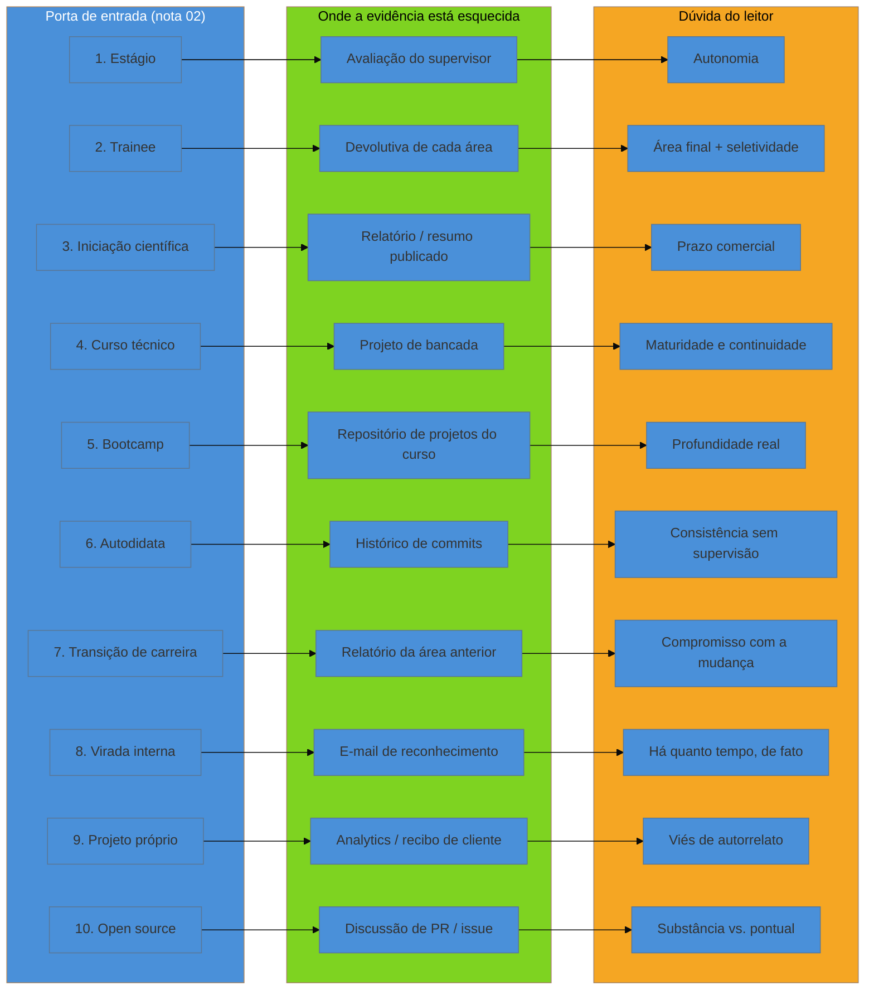

# Inventário de evidência

> [!abstract] TL;DR
> **Ninguém começa do zero.** O que separa um autodidata de um recém-formado não é *quanto* material existe para preencher um currículo — é **onde esse material está escondido** e **qual dúvida específica ele desperta** em quem lê. Esta nota converte cada uma das [[03-Dominios/Carreira/Currículo/02 - As portas de entrada no mercado|dez portas]] mapeadas na nota 02 num inventário prático: o que a porta produziu de evidência, onde essa evidência costuma ficar esquecida, e a dúvida exata que o leitor do currículo carrega ao ver aquela origem — nomear a dúvida é metade da resposta. Trata com a mesma seriedade o que a maioria dos guias descarta — bolsa de iniciação científica, monitoria, extensão, TCC com implementação real, trabalho voluntário técnico, freelance informal, contribuição pequena a open source, automação feita no emprego anterior de outra área — e crava a inversão mais valiosa do galho: para quem migra de carreira, a experiência da área anterior é **ativo**, não passivo, e quase todo mundo a esconde por engano. Fecha como exercício executável, não como conceito: um procedimento para varrer a própria trajetória em busca do que já foi esquecido.

## A pergunta errada que o inventário substitui

A pergunta que a maioria das pessoas faz diante de um currículo em branco é "o que eu tenho para colocar aqui?" — e essa pergunta, formulada assim, já parte de uma premissa falsa: a de que o material relevante precisa ser produzido, não encontrado. Quem se sente sem material para um currículo raramente está de fato sem material; está com o material espalhado em lugares que nunca associou à palavra "evidência profissional" — um relatório de estágio arquivado num e-mail de três anos atrás, uma planilha que automatizou sozinho no emprego anterior, um pull request aceito num projeto de código aberto que já nem lembra ter mandado, uma apresentação de iniciação científica salva num pen drive. O inventário de evidência é o exercício de **encontrar** esse material antes de sair **procurando** o que falta — e a diferença entre as duas palavras não é estilística, é a diferença entre um currículo escrito em uma tarde e um currículo escrito em duas semanas de bloqueio criativo.

Essa distinção explica por que esta nota é a primeira do bloco Adepto, e por que ela existe entre as nove notas que abriram o galho e as dez que vêm a seguir sobre como escrever cada linha de bullet. As nove primeiras notas ensinaram o vocabulário — o objetivo único do documento, as dez portas de entrada, os seis níveis, quem lê e o que a evidência diz sobre esse leitor, o formato, o cabeçalho, o sumário, a formação, as habilidades. As dez notas seguintes ensinam a técnica de escrita — verbo de ação, fórmulas, números defensáveis, a seção de experiência inteira. Entre um bloco e o outro falta uma peça que nenhum guia de currículo do mercado trata como etapa própria: **antes de escrever qualquer bullet, é preciso ter, na mão, o material bruto que aquele bullet vai transformar em frase.** Sem essa etapa, a técnica de escrita das próximas notas não tem sobre o que operar — é como ensinar a lapidar uma pedra antes de ter encontrado a pedra.

O que muda entre um autodidata e um recém-formado, então, não é a quantidade de material bruto disponível — as duas trajetórias, na maioria dos casos, produziram mais evidência aproveitável do que a pessoa percebe. O que muda é **a visibilidade institucional** dessa evidência. O recém-formado que passou pela porta 1 da nota 02 (ensino superior → estágio → efetivação) tem um terceiro — a universidade, o supervisor de estágio, o RH da empresa — que já validou parte do material por ele; o histórico escolar existe, a carta de recomendação pode ser pedida, a data de início e fim do contrato está registrada num sistema de RH que confirma tudo isso num telefonema. O autodidata da porta 6 não tem esse terceiro, e por isso o mesmo volume de trabalho real — código escrito, problema resolvido, decisão técnica tomada sob pressão — fica sem o selo institucional que faz o leitor confiar nele de bandeja. É essa assimetria de visibilidade, não uma assimetria de trabalho realizado, que o inventário desta nota existe para corrigir.

## A dúvida como metade da resposta

Cada porta de entrada, além de produzir um tipo específico de evidência, produz também uma **dúvida específica** na cabeça de quem lê o currículo — e essa dúvida não é um detalhe incidental, é a variável que decide se o material bruto vira uma frase que gera confiança ou uma frase que soa a currículo genérico. A [[03-Dominios/Carreira/Currículo/02 - As portas de entrada no mercado|nota 02]] já nomeou, porta a porta, qual é essa dúvida; esta nota reusa exatamente esse vocabulário — sem reinventá-lo, sem reclassificar nenhuma das dez portas — e acrescenta a peça que faltava: **onde procurar a evidência que responde a cada dúvida específica**, antes mesmo de sentar para escrever uma linha do documento.

Vale nomear o mecanismo com todas as letras, porque ele organiza o resto da nota: um bullet que ignora a dúvida do leitor fala sobre a pessoa em abstrato; um bullet que responde a dúvida do leitor fala com a pessoa certa, na hora certa. Alguém que veio de bootcamp e escreve "concluí formação intensiva em desenvolvimento web" não respondeu a dúvida real de quem lê — que é sobre profundidade, não sobre conclusão. Quem escreve, em vez disso, "entreguei, sob avaliação de mentores, um projeto full-stack com autenticação, testes automatizados e deploy em produção" está respondendo diretamente à dúvida de profundidade que a porta do bootcamp desperta, porque nomeou o que a instrução formal não consegue provar sozinha: que houve entrega real, sob julgamento de terceiro, não só presença num curso. É esse movimento — da evidência bruta para a frase que responde à dúvida certa — que este inventário prepara, e que as notas seguintes do galho, sobretudo a [[03-Dominios/Carreira/Currículo/11 - A linha de bullet|nota 11]], vão transformar em técnica de escrita linha a linha.

## As dez portas, convertidas em material

O que segue percorre as dez portas na mesma numeração e nomenclatura fixadas pela nota 02 — sem reordenar, sem renomear —, mas sob um ângulo diferente do dela: não o requisito formal de acesso, e sim **onde a evidência que cada porta produziu costuma estar esquecida**, e como essa evidência responde à dúvida específica que o leitor carrega.

### 1. Ensino superior → estágio → efetivação

A evidência mais forte desta porta não é a linha "Estagiário — Empresa X, 2023-2025" no currículo — é o **conteúdo** do que foi feito dentro desses meses, e esse conteúdo costuma estar esquecido nas avaliações periódicas de desempenho aplicadas pelo RH e raramente solicitadas de volta; nos e-mails de feedback do supervisor direto, que descrevem tarefa por tarefa com mais precisão do que a memória reconstrói dois anos depois; e no próprio sistema entregue, que muitas vezes continua em produção sem que o ex-estagiário saiba disso. A dúvida que essa porta desperta, como a nota 02 já nomeou, é sobre **autonomia** — alguém que passou dois anos sob supervisão direta ainda não demonstrou como se comporta diante de ambiguidade sem ninguém apontando o próximo passo. A evidência que responde não é o tempo de estágio em si, é o momento, dentro dele, em que a pessoa tomou uma decisão sem esperar instrução — um bug resolvido por conta própria, uma melhoria sugerida sem ser pedida, uma tarefa assumida quando o responsável saiu de férias. Esse momento específico, quase sempre, está esquecido, não ausente.

### 2. Ensino superior → programa de trainee

A evidência mais valiosa de um programa de trainee normalmente não está na apresentação final do rodízio — está nas **atas e devolutivas de cada área por onde a pessoa passou**, frequentemente arquivadas num sistema interno de gestão de talentos ao qual o ex-trainee perde acesso assim que sai do programa. Vale pedir essas devolutivas antes de sair, porque raramente sobrevivem sozinhas ao esquecimento. A dúvida dupla que essa porta desperta — em qual área a pessoa ficou e por quê, somada ao sinal implícito de seletividade do processo — se resolve com dois dados esquecidos juntos: o critério pelo qual a área final foi escolhida, e algum número sobre a taxa de conversão do processo seletivo original, quando disponível — porque um trainee que sabe dizer "fui um de doze aprovados entre mais de dois mil inscritos" responde direto ao sinal de seletividade que a nota 02 nomeou.

### 3. Iniciação científica / laboratório de pesquisa

A evidência mais forte desta porta costuma estar presa dentro de um artefato acadêmico que ninguém, fora da própria área de pesquisa, sabe interpretar: o resumo publicado em anais de congresso, o relatório final entregue à agência de fomento, ou o próprio código do experimento, raramente versionado num repositório público. A dúvida que essa porta desperta é sobre a capacidade de **operar sob pressão de prazo comercial** — pesquisa acadêmica tem um relacionamento com tempo muito diferente do de uma empresa que precisa entregar uma funcionalidade na sprint seguinte. A evidência que responde não está no resultado científico em si — está em qualquer momento em que houve um prazo externo real (submissão de congresso, apresentação para banca, entrega intermediária ao orientador) cumprido produzindo algo funcional. Nomear esse prazo, com data, transforma "iniciação científica" de item acadêmico distante em sinal de entrega sob pressão real.

### 4. Curso técnico / Instituto Federal → jovem aprendiz ou estágio técnico

A evidência desta porta costuma estar esquecida no **projeto de bancada ou de conclusão do curso técnico** — um sistema completo, muitas vezes com requisitos de negócio simulados de forma tão realista quanto os de um projeto comercial pequeno, mas tratado, pela própria pessoa, como "trabalho de escola" e nunca mais revisitado depois da formatura. A dúvida que essa porta desperta é sobre **maturidade e continuidade** — alguém que entrou no mercado formal antes ou logo depois da maioridade ainda está, aos olhos do leitor, descobrindo o que quer fazer. A evidência que responde a essa dúvida é justamente a continuidade: mostrar, no currículo, uma linha reta entre o que o curso técnico ensinou e o que a pessoa vem fazendo desde então — não porque a precocidade seja um problema a esconder, mas porque a direção sustentada é o que convence o leitor de que não foi um acaso de adolescência.

### 5. Bootcamp / curso livre

A evidência mais forte de um bootcamp quase nunca é o certificado — é o **repositório dos projetos entregues durante o curso**, com a avaliação de mentor ou de par anexada, quando existe. Muita gente apaga esses repositórios depois de formada, achando-os "só exercício", exatamente o material que responde à dúvida real dessa porta: **profundidade real versus conclusão nominal**, como a nota 02 já nomeou. Um certificado, sozinho, não distingue quem absorveu o conteúdo de quem só cumpriu presença — o que distingue é o projeto entregue, sob avaliação de terceiro, com decisão técnica visível dentro dele. Vale, especificamente, recuperar qualquer feedback escrito de mentor sobre esses projetos, porque é raro e porque funciona como o mesmo tipo de validação de terceiro que a porta 1 tem embutida por construção.

### 6. Autodidata puro

Essa é a porta que produz, por construção, nenhuma validação institucional — e é exatamente por isso que a evidência dela precisa ser mais concreta, não mais escassa. Costuma estar esquecida em três lugares: no **histórico de commits** de repositórios pessoais, muitas vezes com meses de consistência que a própria pessoa nunca contou; em **projetos abandonados no meio do caminho**, que, ao contrário do que parece, comunicam algo real quando o motivo do abandono é nomeado com honestidade (mudança de prioridade, decisão técnica que se provou errada, aprendizado suficiente já extraído); e em **anotações de estudo** — um caderno de erros resolvidos, um blog pessoal, um resumo de cada tecnologia aprendida — que raramente é tratado como material de currículo, mas que demonstra exatamente o traço que essa porta precisa provar. A dúvida que ela desperta é a mais dura das dez, porque combina duas coisas ao mesmo tempo: a exigência de prova redobrada que a nota 02 já nomeou (cadê o código, cadê o link, cadê alguém disposto a confirmar) e uma dúvida adicional que esta nota nomeia de forma explícita — a **consistência sem supervisão**: alguém que nunca teve um gestor cobrando prazo, um professor cobrando entrega, ou um orientador cobrando avanço, ainda não demonstrou que sustenta disciplina sozinho. O histórico de commits ao longo do tempo — não um projeto isolado, e sim a cadência dele — é a evidência que responde diretamente a essa segunda dúvida, porque uma sequência de meses de contribuição regular fala sobre hábito, não só sobre competência pontual.

### 7. Transição de carreira

A evidência desta porta é tratada com profundidade própria mais adiante nesta nota, porque é a que mais gente descarta por engano. Em resumo, aqui: costuma estar esquecida em **relatórios, planilhas e apresentações da área anterior** que nunca foram lidos como "trabalho técnico" porque não usavam a linguagem de tecnologia — mas que, sob outro nome, já eram análise de dados, automação de processo ou modelagem de sistema. A dúvida que essa porta desperta combina reconhecimento e ceticismo ao mesmo tempo, como a nota 02 já nomeou, e esta nota acrescenta o nome específico da segunda metade dessa dúvida: **compromisso com a mudança** — o leitor precisa se convencer de que a pessoa não está só experimentando tecnologia por curiosidade passageira, e sim decidida a migrar de verdade.

### 8. Virou dev por dentro da empresa

A evidência mais forte desta porta costuma estar esquecida em **e-mails de reconhecimento**, tickets de suporte técnico resolvidos com solução própria, e scripts internos escritos para resolver um problema recorrente antes mesmo de o título mudar oficialmente. A dúvida que essa porta desperta, como a nota 02 nomeou, é sobre o intervalo real: há quanto tempo a pessoa vinha fazendo trabalho técnico de fato, e quem pode confirmar isso. A evidência que responde é a data do primeiro artefato técnico produzido — não a data em que o cargo mudou no RH —, porque é essa diferença que conta a história real de como a mudança aconteceu por dentro.

### 9. Projeto próprio, freelance, indie

A evidência mais forte desta porta costuma estar esquecida em **analytics do próprio produto**, histórico de conversas com clientes, ou recibos e contratos de freelance informal nunca considerados "documento profissional" por não terem vindo de uma empresa formal. A dúvida que essa porta desperta, como a nota 02 nomeou, é sobre viés de autorrelato — sem terceiro independente para confirmar, o leitor precisa decidir quanto confiar na palavra da pessoa. A evidência que responde é qualquer fonte externa ao próprio autorrelato que ainda exista — uma avaliação de cliente, uma nota fiscal, um print de painel com data visível —, porque isso desloca a confirmação de "a pessoa diz que sim" para "há um registro externo que sustenta".

### 10. Comunidade e open source

A evidência desta porta é, por construção, a mais verificável das dez — mas costuma estar esquecida mesmo assim, porque a pessoa não separa **contribuição pontual** de **colaboração sustentada** dentro do próprio histórico. Um pull request de correção de digitação e seis meses de revisão de código recebida de mantenedores experientes ficam, na cabeça de quem contribuiu, com o mesmo peso informal de "coisas que fiz no GitHub" — e é justamente essa mistura que a dúvida do leitor, nomeada pela nota 02 como substância e continuidade, cobra separar. A evidência que responde a essa dúvida está nas próprias discussões de issue e nos comentários de revisão de pull request — não no número de contribuições, e sim na profundidade da conversa técnica registrada ali, publicamente, com timestamp.

O diagrama fixa o mapa completo desta nota num único traço: cada porta produz um tipo de evidência com endereço próprio, e cada endereço responde a uma dúvida com nome próprio. Nenhuma das três colunas é opcional — um currículo que só sabe a porta, sem localizar a evidência, chega a uma frase genérica; um currículo que localiza a evidência mas não sabe que dúvida ela responde desperdiça a chance de mirar exatamente no que o leitor está se perguntando.

## O que os guias descartam, e o que esta nota trata com seriedade

A maioria dos guias de currículo do mercado — os gratuitos e os vendidos por assinatura, como Jobscan, Enhancv e Teal, que vendem otimização de currículo e têm interesse comercial direto em simplificar a mensagem a "adicione palavras-chave" — trata um punhado de experiências como irrelevantes quase por reflexo, sem examinar caso a caso. Esta nota discorda ponto a ponto, porque cada item descartado abaixo é evidência real de trabalho real, só que produzida fora do formato que o guia médio sabe reconhecer.

**Bolsa de iniciação científica** entra descartada porque soa "acadêmica demais" — mas, como a caixa de destaque da nota 02 já registrou, uma mudança legal de 2024 (Lei 14.913/2024, alterando o Art. 2º, § 3º da Lei 11.788/2008) permite equiparar IC a estágio quando o projeto pedagógico do curso prevê isso, e mesmo quando não prevê, o trabalho metodológico por trás de uma IC — levantar hipótese, desenhar experimento, analisar dado, defender resultado perante banca — é, em qualquer leitura honesta, trabalho técnico sob avaliação de terceiro.

**Monitoria** entra descartada porque soa "ajuda", não "trabalho" — mas quem foi monitor de uma disciplina técnica assumiu, tipicamente, responsabilidade por plantão de dúvidas, correção de exercício e, em casos mais avançados, criação de material didático próprio, o que é, na prática, uma forma de liderança técnica horizontal exercida antes mesmo do primeiro emprego.

**Extensão universitária** entra descartada porque soa "social", não "técnica" — mas boa parte dos projetos de extensão em cursos de computação e áreas correlatas envolve construir sistema real para uma comunidade real, sob restrição real de recurso, o que se aproxima mais de um projeto de cliente pequeno do que de um exercício de sala de aula.

**TCC com implementação real** entra descartado porque a palavra "acadêmico" na cabeça de quem escreve currículo vira sinônimo de "teórico" — mas um TCC que implementou um sistema funcional, por trás de qualquer discussão teórica exigida pela banca, é código escrito sob prazo fixo, com escopo definido e entrega obrigatória, que é exatamente o que a seção de experiência de qualquer currículo júnior está tentando provar que a pessoa sabe fazer.

**Trabalho voluntário técnico** entra descartado porque não teve remuneração — mas ausência de salário não apaga a existência do trabalho: manter o site de uma ONG, montar a rede de um evento comunitário, dar suporte técnico a uma escola pública são, tecnicamente, entregas sob restrição de tempo e recurso, e o fato de não terem sido pagas não muda a natureza do que foi feito.

**Freelance informal** entra descartado porque parece "bico", não "cliente" — mas um freelance que resolveu o problema de um pequeno comerciante, mesmo sem contrato formal ou nota fiscal, ainda passou pela experiência completa de levantar requisito, entregar, receber feedback e cobrar por isso, que é o ciclo inteiro de trabalho profissional em miniatura.

**Contribuição pequena a open source** entra descartada porque parece "insuficiente" diante do volume de quem contribui há anos — mas mesmo um único pull request aceito, revisado por um mantenedor experiente e mergeado num projeto usado por terceiros, é uma peça de código que passou por um processo de revisão real, público, com histórico verificável, o que muitas experiências profissionais formais nem sempre oferecem com a mesma transparência.

**Automação feita no emprego anterior de outra área** entra descartada porque, na cabeça de quem a fez, era "só uma planilha" ou "só um script pessoal" para facilitar o próprio trabalho — mas alguém que automatizou um processo manual, mesmo informalmente, já demonstrou o instinto mais fundamental de quem trabalha com tecnologia: ver um processo repetitivo e decidir escrevê-lo em código em vez de repeti-lo à mão. Esse item, especificamente, é a ponte direta para a próxima seção, porque ele quase sempre aparece em quem está atravessando a porta 7.

## A inversão que a maioria esconde: experiência anterior é ativo, não passivo

O ponto mais valioso desta nota inteira é uma inversão de sinal, e vale dizê-la com todas as letras porque quase ninguém que está em transição de carreira a aplica sozinha: **a experiência da área anterior não é um vazio a esconder — é um ativo competitivo que a maioria dos desenvolvedores tradicionais simplesmente não tem.**

A intuição mais comum, para quem migra de carreira, é tratar o histórico anterior como um obstáculo a minimizar — reduzir a seção de experiência prévia a uma linha discreta, quase se desculpando por ter "perdido tempo" numa área diferente antes de "finalmente" chegar à tecnologia. Essa intuição está invertida. Quem veio da enfermagem entende fluxo hospitalar, protocolo de triagem e a urgência real de um sistema que falha durante um plantão de um jeito que nenhum desenvolvedor que nunca pisou num hospital consegue simular por leitura de documentação. Quem veio do direito lê contrato, cláusula de compliance e requisito regulatório sem precisar de um tradutor entre negócio e engenharia — um problema que, em produtos de fintech, saúde ou serviços financeiros, custa caro justamente por faltar em times inteiros de desenvolvedores tradicionais. Quem veio da contabilidade entende fechamento de mês, conciliação e a diferença entre um número aproximado e um número que precisa bater exatamente — o mesmo instinto que sustenta a régua inteira da [[03-Dominios/Carreira/Currículo/14 - Números que você pode defender|nota 14]] sobre números defensáveis no currículo. Nenhuma dessas competências é ensinada num bootcamp, porque um bootcamp ensina tecnologia, não o domínio de negócio que torna a tecnologia útil dentro daquele setor específico.

O motivo pelo qual essa inversão é tão pouco praticada tem uma explicação simples: a pessoa em transição está, tipicamente, tentando provar competência técnica — porque é aí que sente a maior lacuna, e é natural que o esforço de escrita se concentre no ponto mais frágil. O efeito colateral é esconder, sem perceber, o ponto mais forte, que é justamente o domínio de negócio herdado da área anterior. Um currículo bem construído para transição de carreira não escolhe entre os dois — mostra a competência técnica com a mesma honestidade que a [[03-Dominios/Carreira/Currículo/19 - Declarar lacuna|nota 19]] recomenda para qualquer lacuna, e ao mesmo tempo eleva o domínio de negócio anterior a um lugar de destaque no sumário ou logo no início da seção de experiência, em vez de deixá-lo escondido no fim do documento como se fosse um capítulo encerrado da vida da pessoa.

> [!example] Caso real
> Cassiana Gabriela Lima Barreto, cuja trajetória a [[03-Dominios/Carreira/Currículo/02 - As portas de entrada no mercado|nota 02]] já registrou sob o ângulo das dez portas, é o exemplo mais completo, dentro deste galho, de evidência transferível que quase todo mundo teria enterrado. A graduação dela em Engenharia Biomédica na UFU, entre 2008 e 2015, foi seguida por um mestrado em Engenharia de Sistemas de Saúde, entre 2016 e 2018, e um doutorado em Sistemas Computacionais e dispositivos aplicados à saúde, entre 2020 e 2025 — sete anos inteiros de pesquisa e desenvolvimento no laboratório NIATS, da UFU. Dentro desse período, o currículo com que ela conseguiu a vaga de trainee na Dadosfera, em 2024, trazia um punhado de itens que, num currículo escrito por qualquer outro autodidata em engenharia biomédica sem essa formação, poderiam facilmente ter sido descartados como "assunto de outra área": a integração de sensores inerciais — acelerômetro, giroscópio, magnetômetro — a um sistema embarcado Arduino para coleta de dados, incluindo a **limpeza e integração de dados de várias fontes**; a aplicação de modelos de aprendizado de máquina a dados de sensores; a **análise estatística descritiva e exploratória de dados de um hospital público**; o desenvolvimento de software em MATLAB para processamento de sinais; e a liderança de uma equipe interdisciplinar, com mentoria acadêmica incluída. Nenhum desses itens carrega, na superfície, a palavra "dados" ou "engenharia de software" — e é exatamente por isso que cada um deles é trabalho de dados feito **antes** de ela se chamar, formalmente, profissional de dados. Fontes citáveis: LinkedIn ([linkedin.com/in/cassianalima](https://linkedin.com/in/cassianalima)) e a página de carreiras da Dadosfera; a trajetória é citada aqui com autorização.

O que esse caso ensina, para o propósito específico desta nota, não é só que Cassiana tinha experiência aproveitável — é **onde** ela estava escondida. "Limpeza e integração de dados de várias fontes" e "análise estatística descritiva e exploratória" são, literalmente, tarefas de engenharia de dados, só que descritas em linguagem de pesquisa biomédica, dentro de um relatório de laboratório que a maioria dos leitores de currículo de tecnologia jamais chegaria a abrir. Foi contratada como trainee de ciência de dados e, ao longo do programa, foi alocada em engenharia de dados — área onde a carreira evoluiu até a promoção a júnior —, e essa realocação só fez sentido porque o material bruto da experiência anterior, uma vez traduzido para o vocabulário certo, já apontava exatamente para essa direção. Nenhum bootcamp teria ensinado a ela como pensar sobre ruído de sensor, imputação de dado ausente num experimento clínico, ou o rigor de uma análise que vai sustentar uma decisão sobre paciente real — e é esse tipo específico de conhecimento, herdado da área anterior, que a inversão desta seção pede para elevar, não esconder.

## O inventário como exercício executável

Uma tese sem procedimento fica no plano da intenção — e esta nota fecha, então, com o mecanismo concreto de como aplicar tudo o que veio antes, porque um inventário de evidência não é um conceito para entender, é um exercício para fazer, de preferência antes de escrever a primeira linha de qualquer bullet.

O primeiro passo é **listar as portas atravessadas**, não a trajetória inteira de uma vez — usando exatamente o vocabulário das dez portas da nota 02, mesmo quando mais de uma se sobrepõe no mesmo período, como aconteceu com Cassiana (trainee e transição de carreira ao mesmo tempo) ou com o autor deste vault, cuja trajetória a nota 02 já narrou como uma cadeia de quatro portas em sequência. Cada porta identificada já reduz o problema de "o que eu tenho" para um escopo administrável, porque a seção correspondente desta nota já nomeou onde procurar.

O segundo passo é, para cada porta identificada, **ir literalmente aos lugares físicos onde a evidência foi mapeada nesta nota** — abrir a caixa de e-mail antiga e buscar por "avaliação", "feedback" ou o nome do supervisor; entrar no perfil do GitHub e olhar, com data visível, quando os commits realmente aconteceram, não quando a memória acha que aconteceram; procurar, no computador ou no telefone antigo, planilhas e relatórios da área anterior; mandar mensagem para um ex-colega, ex-professor ou ex-cliente pedindo confirmação ou uma frase de recomendação enquanto o contato ainda é fácil de reativar. Esse passo é o mais frequentemente pulado, porque parece trabalho arqueológico demais para um documento de duas páginas — mas é exatamente esse trabalho que separa um bullet genérico de um bullet que, três frases depois, puxa a pergunta de acompanhamento que a [[03-Dominios/Carreira/Currículo/01 - Para que serve um currículo|nota 01]] descreveu como o verdadeiro objetivo do documento.

O terceiro passo é, para cada item de evidência encontrado, **nomear a dúvida que ele responde** antes de decidir se ele entra no currículo — usando o vocabulário fixado nesta nota (autonomia, profundidade real, consistência sem supervisão, compromisso com a mudança, e assim por diante). Um item de evidência que não responde a nenhuma dúvida plausível do leitor pode até ser verdadeiro e relevante para a própria pessoa, mas provavelmente pertence a uma conversa, não ao documento — o mesmo princípio de curadoria que a [[03-Dominios/Carreira/Currículo/08 - Formação, cursos e certificações|nota 08]] já aplicou à seção de formação, agora estendido ao inventário inteiro.

O quarto passo, e o que fecha o ciclo, é **decidir, item a item, o que vira material de currículo e o que vira gancho de entrevista** — porque nem todo item de evidência precisa virar bullet; alguns funcionam melhor como resposta pronta para a pergunta "me conta sobre uma vez em que...", guardada, mas não escrita no documento. É essa triagem final que separa um inventário de evidência de uma lista de tudo — o mesmo enquadramento errado que a nota 01 já nomeou como um dos três erros recorrentes do gênero.

Esse procedimento — varrer, localizar, nomear a dúvida, triar — não é um exercício de uma vez só. Fazer isso apenas na hora de procurar emprego significa reconstruir, sob pressão de prazo, um material que poderia já estar organizado se tivesse sido registrado no momento em que aconteceu. É esse o gancho direto para a [[03-Dominios/Carreira/Currículo/21 - O brag document|nota 21]], mais adiante no galho: o inventário desta nota é a versão **retroativa** de um hábito que, praticado continuamente, elimina a arqueologia inteira descrita acima — quem mantém um brag document atualizado nunca precisa vasculhar e-mail antigo, porque já registrou cada entrega, cada feedback, cada número relevante no momento em que ocorreram. Este inventário é o que se faz quando esse hábito ainda não existe; a nota 21 ensina como fazer com que, da próxima vez, ele não precise ser refeito do zero.

## Casos práticos

> [!example] Caso fictício
> Diego Falcão, autodidata puro (porta 6), passou três anos estudando programação sozinho antes de decidir montar o primeiro currículo, e chegou à tela em branco convencido de que "não tinha nada além de dois projetos pequenos". Aplicando o segundo passo do procedimento desta nota, abriu o próprio perfil do GitHub e descobriu, olhando as datas reais dos commits em vez de confiar na memória, dezoito meses seguidos de contribuições quase semanais a um projeto pessoal de automação financeira — um padrão de consistência que ele nunca havia registrado conscientemente como "evidência". Achou também, numa pasta antiga, um repositório abandonado de um clone de e-commerce, deixado de lado depois de seis meses porque decidiu que o problema técnico já estava resolvido e não valia continuar só por continuar. No currículo final, o histórico de commits do projeto de automação virou a linha principal de experiência técnica, nomeando explicitamente a duração e a cadência — respondendo direto à dúvida de consistência sem supervisão que a porta 6 desperta —, e o repositório abandonado virou uma frase de uma linha sobre decisão técnica, não sobre desistência.

> [!example] Caso fictício
> Patrícia Nunes Ferreira, veterinária havia oito anos, decidiu migrar para tecnologia (porta 7) depois de perceber que passava boa parte do expediente ajustando, sozinha, uma planilha de controle de estoque de medicamentos da clínica onde trabalhava — uma automação informal com fórmulas e macros que ela nunca havia chamado de "projeto de software" por não ter sido pedida por ninguém. Ao aplicar o primeiro passo do procedimento desta nota e nomear a própria porta de entrada, reconheceu que a planilha era exatamente o tipo de automação feita no emprego anterior que a seção sobre o que os guias descartam já havia nomeado. Em vez de reduzir os oito anos de veterinária a uma linha discreta no fim do currículo, elevou o domínio de negócio herdado — controle de estoque, previsão de demanda sazonal, rastreabilidade de lote — para o sumário profissional, ao lado do bootcamp que cursou depois, e usou a planilha como primeira evidência concreta de raciocínio computacional, endereçando de frente a dúvida de compromisso com a mudança que a porta 7 desperta.

## Armadilhas comuns

> [!warning] Achar que "não conta" porque não veio de emprego formal
> **O que acontece:** a pessoa descarta, de saída, qualquer evidência que não tenha vindo de um contrato CLT ou PJ formal — bolsa de IC, monitoria, freelance informal, contribuição a open source — tratando esses itens como categoria inferior de experiência antes mesmo de examinar o conteúdo real de cada um. **Por quê:** o vínculo formal é o formato mais reconhecível de "trabalho" no imaginário comum, e qualquer coisa fora dele parece, por comparação, menos sério. **Como evitar:** aplicar o mesmo teste a qualquer item — houve entrega real, sob alguma forma de avaliação ou restrição, com resultado verificável? Se sim, o item conta, independentemente do vínculo formal que produziu.

> [!warning] Minimizar a experiência da área anterior por vergonha da mudança
> **O que acontece:** quem migra de carreira reduz o histórico profissional anterior a uma linha discreta ou o omite quase por completo, tratando os anos numa outra área como tempo perdido em vez de bagagem aproveitável. **Por quê:** a ansiedade de provar competência técnica nova consome a atenção, e o que já é sólido — o domínio da área anterior — parece, por comparação, menos relevante para a vaga de tecnologia em questão. **Como evitar:** aplicar a inversão desta nota deliberadamente: nomear, no sumário ou no início da seção de experiência, o domínio de negócio herdado, tratando-o como diferencial competitivo, não como capítulo encerrado — o caso de Cassiana mostra exatamente essa elevação em ação.

> [!warning] Confiar na memória em vez de ir buscar o registro
> **O que acontece:** ao montar o inventário, a pessoa escreve o que lembra ter feito, sem checar e-mail, repositório ou conversa antiga — e a memória, tipicamente, arredonda datas, esquece detalhes específicos e perde exatamente os números que dariam sustentação à frase. **Por quê:** ir atrás do registro real parece trabalho extra diante de um prazo apertado de candidatura, e a memória parece suficiente até ser testada numa entrevista. **Como evitar:** tratar o segundo passo do procedimento desta nota — ir literalmente aos lugares onde a evidência foi mapeada — como etapa obrigatória, não opcional, porque é a diferença entre um número lembrado e um número que a [[03-Dominios/Carreira/Currículo/14 - Números que você pode defender|nota 14]] classifica como efetivamente defensável.

> [!warning] Tratar o inventário como exercício de uma vez só
> **O que acontece:** a pessoa faz o levantamento completo na hora de procurar uma vaga, usa o material naquele ciclo de candidatura, e deixa o inventário parado até a próxima busca de emprego, anos depois, quando parte do material relevante já esfriou ou foi esquecido de novo. **Por quê:** o inventário nasce, tipicamente, de uma necessidade urgente — a vaga aberta agora —, e assim que essa urgência passa, a disciplina de manter o registro atualizado também passa. **Como evitar:** converter o exercício retroativo desta nota no hábito contínuo da [[03-Dominios/Carreira/Currículo/21 - O brag document|nota 21]], registrando cada entrega relevante no momento em que acontece, em vez de esperar a próxima busca de emprego para reconstruir tudo de memória.

## Como soa em inglês

> "One habit I try to pass on to anyone changing fields into tech: don't treat your previous career as a gap to explain away — treat it as evidence you already have, just filed under the wrong name. A hospital shift, a legal contract, a month-end close in accounting — none of that shows up on a resume as 'software experience,' but it's exactly the domain knowledge most junior developers don't have. The exercise isn't inventing new material, it's going back to where the real evidence already lives — an old performance review, a commit history, a spreadsheet you automated without calling it that — and translating it into language a technical reader recognizes."

| PT | EN |
| --- | --- |
| inventário de evidência | evidence inventory |
| material aproveitável | usable material |
| evidência esquecida | forgotten evidence |
| dúvida do leitor | reader's doubt / reader's question |
| crivo institucional | institutional vetting |
| ativo, não passivo | asset, not liability |
| domínio de negócio | domain knowledge |
| colaboração sustentada | sustained collaboration |
| brag document | brag document (termo consagrado) |
| varrer a trajetória | to sweep your own history |

## O que vem a seguir

Feito o inventário — o material bruto localizado e a dúvida de cada porta nomeada —, o galho segue para a técnica de transformar esse material em frases:

- [[03-Dominios/Carreira/Currículo/11 - A linha de bullet|11 - A linha de bullet]] — verbo de ação, o que foi feito e o resultado; o primeiro passo concreto de transformar o material deste inventário em texto.
- [[03-Dominios/Carreira/Currículo/13 - Responsabilidade, realização e alavancagem|13 - Responsabilidade, realização e alavancagem]] — a escada que ajuda a decidir qual peça do inventário sinaliza mais senioridade.
- [[03-Dominios/Carreira/Currículo/14 - Números que você pode defender|14 - Números que você pode defender]] — os três níveis de confiança de um número, que devolvem sentido prático ao terceiro passo do procedimento desta nota.
- [[03-Dominios/Carreira/Currículo/21 - O brag document|21 - O brag document]] — o hábito contínuo do qual este inventário é a versão retroativa.

## Veja também

- [[03-Dominios/Carreira/Currículo/index|Currículo]] — o índice do galho, com a tese e o mapa das 26 notas.
- [[03-Dominios/Carreira/Currículo/02 - As portas de entrada no mercado|02 - As portas de entrada no mercado]] — as dez portas, o requisito formal de cada uma e o vocabulário de dúvida do leitor que esta nota reusa integralmente.
- [[03-Dominios/Carreira/Currículo/08 - Formação, cursos e certificações|08 - Formação, cursos e certificações]] — a mesma lente das dez portas aplicada especificamente à seção de formação do documento.
- [[03-Dominios/Carreira/Currículo/16 - A seção de experiência profissional|16 - A seção de experiência profissional]] — onde o material deste inventário entra, organizado, na seção de experiência.
- [[03-Dominios/Carreira/Currículo/19 - Declarar lacuna|19 - Declarar lacuna]] — o que fazer quando o inventário revela um intervalo, não uma evidência.
- [[03-Dominios/Carreira/Entrevistas/index|Entrevistas]] — o galho parceiro: parte do material deste inventário que não vira bullet vira, em vez disso, resposta pronta de entrevista.

## Fontes

- **Cassiana Gabriela Lima Barreto** — [linkedin.com/in/cassianalima](https://linkedin.com/in/cassianalima), perfil público no LinkedIn, com dados adicionais confirmados na página de carreiras da Dadosfera, conforme já registrado com a fonte completa na [[03-Dominios/Carreira/Currículo/02 - As portas de entrada no mercado|nota 02]]. Os detalhes técnicos adicionais sobre o trabalho no laboratório NIATS/UFU (integração de sensores, limpeza e integração de dados, modelos de aprendizado de máquina, análise estatística de dados hospitalares, MATLAB, liderança de equipe) constam do currículo com que ela conseguiu a vaga de trainee na Dadosfera em 2024, e são citados aqui com autorização.
- **Presidência da República — Casa Civil** — [Lei nº 11.788, de 25 de setembro de 2008](https://www.planalto.gov.br/ccivil_03/_ato2007-2010/2008/lei/l11788.htm), com a redação do Art. 2º, § 3º dada pela Lei nº 14.913/2024, já apurada com fonte primária na [[03-Dominios/Carreira/Currículo/02 - As portas de entrada no mercado|nota 02]] e reusada aqui apenas como referência ao tratar iniciação científica na seção "O que os guias descartam".
- Esta nota não depende de estudo quantitativo próprio sobre onde evidência de carreira costuma ser esquecida; o mapeamento porta a porta é análise estrutural do próprio autor, construída sobre o vocabulário de portas e dúvidas já sourced pela nota 02, e a menção a Jobscan, Enhancv e Teal é declarada explicitamente como fonte comercial, com interesse direto no tema.
