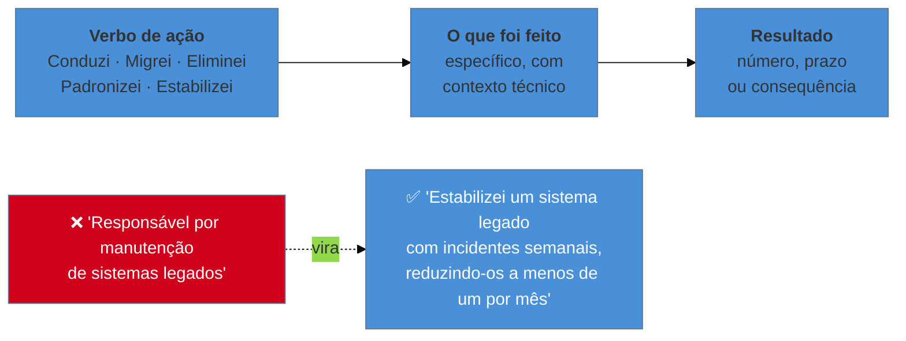

# A linha de bullet

> [!abstract] TL;DR
> Currículo é varrido em linhas, não lido em parágrafos — por isso a **linha de bullet**, não o parágrafo e não a seção, é a unidade de projeto deste galho inteiro. A fórmula que sustenta uma linha forte é simples de enunciar e difícil de aplicar com disciplina: **verbo de ação + o que foi feito + resultado**. A construção mais fraca do gênero, e também a mais comum, é **"responsável por"** — ela descreve o que estava no seu escopo, não o que aconteceu por sua causa, e duas pessoas com a mesma atribuição podem ter produzido resultados opostos. O procedimento mais acionável desta nota é um teste de uma frase só: *outra pessoa no mesmo cargo poderia escrever esta linha?* Se a resposta for sim, a linha descreve o cargo, não você, e precisa ser reescrita. O resto da nota converte essa disciplina em prática — uma matriz de verbos fracos trocados por verbos que declaram propriedade, com a frase inteira reescrita, não só o verbo — e mostra a fórmula operando em bullets públicos e verificáveis do autor deste vault.

## A unidade que o leitor de fato processa

A [[03-Dominios/Carreira/Currículo/04 - Quem lê o seu currículo — e o que a evidência diz|nota 04]] já estabeleceu o mecanismo por trás disso, e esta nota não repete a evidência dela — só reusa a conclusão: o segundo leitor varre em segundos, e o terceiro lê buscando evidência de resultado e progressão, não uma lista de tecnologias. O que essa estrutura de três leitores implica, na prática de quem escreve, é que o parágrafo nunca é a unidade que importa. Ninguém varre um parágrafo em dois segundos e absorve o argumento inteiro dele — um parágrafo pede leitura linear, sentença atrás de sentença, e é exatamente esse tipo de leitura que o segundo leitor, sob pressão de tempo e volume, não tem disponível. O que o olho processa numa varredura é a linha: um bloco curto, com início e fim visíveis num único movimento do olhar, geralmente iniciado por um marcador visual — o próprio símbolo do bullet — que sinaliza "aqui começa uma unidade nova, você pode julgar esta e pular para a próxima sem perder o fio".

Isso muda o que significa "escrever bem" num currículo, de um jeito que boa parte de quem chega a este documento vindo de outros gêneros de escrita profissional não espera. Um relatório técnico, um e-mail bem construído, até uma proposta comercial recompensam transição entre ideias, subordinação de cláusulas, um argumento que se desenvolve ao longo de várias frases. O currículo recompensa o oposto: cada linha precisa se sustentar sozinha, sem depender da linha anterior para fazer sentido, porque o leitor pode ler a terceira linha de uma seção de experiência sem nunca ter lido a primeira — o olho pula, não percorre. Uma linha que começa com "Além disso" ou "Nesse contexto" pressupõe um leitor que acabou de ler a linha anterior com atenção plena, e esse leitor, na prática descrita pela nota 04, quase nunca existe na primeira passada.

Tratar a linha como unidade de projeto tem uma consequência prática que orienta o resto desta nota: cada linha precisa ser escrita, revisada e julgada isoladamente, como se fosse a única coisa que o leitor vai ver daquela experiência inteira — porque, para uma fração real dos leitores, na prática, é exatamente isso que acontece. Se uma linha, sozinha, não convence ninguém de nada, ela não fica salva pelo contexto das linhas ao redor; ela simplesmente falha, e o leitor segue para a próxima experiência do documento sem levar nada daquela seção. É esse padrão de leitura — não uma preferência estética por frases curtas — que torna a fórmula desta nota necessária, e não apenas uma questão de estilo.

## A fórmula: verbo de ação, o que foi feito, resultado

A fórmula que sustenta uma linha forte tem três partes, nesta ordem, e cada parte cumpre um trabalho específico que as outras duas não cumprem sozinhas. O **verbo de ação**, no passado, abre a linha e já comunica, antes de qualquer outra palavra, que o sujeito da frase fez algo — não recebeu, não participou de longe, não esteve presente enquanto acontecia. "O que foi feito" vem em seguida, com contexto técnico suficiente para que um leitor que não estava lá entenda do que se trata, sem exigir que ele já conheça o produto, o time ou a stack por dentro. O **resultado** fecha a linha, e é a parte que a maioria dos currículos fracos simplesmente omite — um número, um prazo, ou, na ausência de qualquer um dos dois, uma consequência concreta do que passou a ser possível depois.

O contraste no diagrama não é decorativo — é o par que organiza esta nota inteira. A versão ruim, "responsável por manutenção de sistemas legados", tem sujeito implícito ("eu era responsável"), tem objeto genérico ("manutenção", sem dizer o quê) e não tem verbo de ação nenhum: "manutenção" é substantivo, não verbo, e a construção inteira descreve uma atribuição de cargo, não um evento que aconteceu. A versão boa, "estabilizei um sistema legado com incidentes semanais, reduzindo-os a menos de um por mês", tem verbo no passado que já denuncia ação concluída ("estabilizei"), tem o que foi feito com contexto suficiente para o leitor visualizar o problema ("um sistema legado com incidentes semanais") e tem resultado mensurável fechando a frase ("reduzindo-os a menos de um por mês"). As duas frases podem descrever, literalmente, o mesmo período de trabalho na mesma empresa — a diferença inteira está em qual delas o autor decidiu escrever.

Vale nomear, com a mesma honestidade que a nota 04 já cobrou de si mesma, que nem toda linha vai ter um número tão limpo quanto o do exemplo. Números vêm de fontes diferentes — tempo de deploy, volume de requisições, quantidade de serviços migrados, frequência de incidentes por mês — e a [[03-Dominios/Carreira/Currículo/14 - Números que você pode defender|nota 14]], mais adiante no galho, trata em profundidade dos três níveis de confiança que um número pode ter e da diferença entre um número medido, um número contado e um número apenas lembrado. Quando nenhum número sobrevive a essa régua, a terceira parte da fórmula ainda tem um lugar para ir: a consequência. "Padronizei o processo de deploy entre quatro times" já é uma linha aceitável mesmo sem porcentagem nenhuma, porque "entre quatro times" é, ele mesmo, um dado de escopo verificável — não é um número inventado para preencher espaço, é uma descrição precisa do que mudou.

## "Responsável por": a construção mais fraca do gênero

Se há uma única frase que esta nota quer que o leitor carregue depois de fechar a aba, é esta: **"responsável por" é a construção mais fraca do gênero porque ela descreve escopo, não causa.** "Responsável por manutenção de sistemas legados" é uma afirmação sobre o que estava dentro da área de atuação da pessoa — o que ela tinha autorização e dever de fazer — e não é, em nenhum sentido, uma afirmação sobre o que de fato aconteceu como resultado do trabalho dela. É a diferença entre descrever um cargo e descrever uma carreira, e o currículo, como a nota 04 já deixou claro, é lido por alguém que já conhece a descrição do cargo de cor — foi ela quem a escreveu na vaga.

Vale tornar esse argumento concreto, porque em abstrato ele soa óbvio demais para ser levado a sério. Imagine dois desenvolvedores plenos, contratados no mesmo mês, para times diferentes da mesma empresa, com a mesma descrição formal de cargo: "responsável pela manutenção e evolução do sistema de faturamento". Um ano depois, o primeiro reduziu os incidentes de faturamento de um por semana para um a cada dois meses, reescreveu a rotina de cálculo de imposto que gerava a maior parte dos chamados, e documentou o processo o suficiente para que o time de suporte passasse a resolver metade dos casos sem escalar para engenharia. O segundo manteve o sistema funcionando, sem regressão grave, sem melhoria visível, sem nenhuma mudança que alguém de fora do time notaria. Os dois, hoje, podem escrever exatamente a mesma linha no currículo — "responsável pela manutenção e evolução do sistema de faturamento" — porque a frase descreve a atribuição que os dois compartilhavam, não o que cada um fez com ela. É essa possibilidade — dois desfechos opostos cabendo, sem contradição nenhuma, na mesma frase — que expõe por que "responsável por" não carrega informação nenhuma sobre desempenho, só sobre escopo formal de cargo.

O leitor do terceiro estágio, descrito na nota 04 como quem lê buscando evidência de resultado e progressão, sabe disso — talvez não de forma articulada, mas por instinto profissional acumulado ao ler currículos suficientes para reconhecer o padrão. "Responsável por" não convence esse leitor de nada; na melhor das hipóteses, é neutro, e na pior, é um sinal de que a pessoa não sabe — ou não quer — distinguir o que estava sob sua alçada do que ela de fato produziu. É por isso que toda linha que começa com "responsável por" pode, e deveria, ser reescrita começando por um verbo no passado: a mudança de estrutura gramatical força a pergunta certa — "o que eu de fato fiz?" — em vez de deixar a resposta escapar dentro de uma descrição de cargo genérica o bastante para caber em qualquer pessoa que já ocupou aquela posição.

> [!warning] "Responsável por" não é proibido em toda frase da língua portuguesa
> **O que acontece:** ao internalizar esta seção, alguém passa a evitar a expressão "responsável por" em qualquer contexto — inclusive fora do currículo, o que não é o ponto desta nota. **Por quê:** é mais fácil memorizar uma proibição de palavra do que segurar o argumento mais fino por trás dela. **Como evitar:** o problema nunca foi a expressão em si — é usá-la como substituto de resultado numa linha de bullet, onde o leitor está justamente procurando evidência de causa. Fora do currículo, "responsável por" continua sendo português perfeitamente correto para descrever um papel formal, um cargo numa estrutura, uma área de decisão — só não carrega, sozinha, prova de desempenho, que é exatamente o que uma linha de currículo precisa entregar.

## O teste linha a linha

O procedimento mais direto que esta nota oferece cabe numa única pergunta, e vale aplicá-la a cada linha do documento, uma de cada vez, sem pular nenhuma por parecer óbvia demais: **outra pessoa no mesmo cargo poderia escrever esta linha?** Se a resposta for sim — se qualquer colega, com a mesma atribuição formal, pudesse assinar embaixo da mesma frase sem alterar uma palavra — a linha descreve o cargo, não a pessoa que a escreveu, e precisa ser reescrita antes de o documento seguir para qualquer outra revisão.

O teste funciona porque ele converte um julgamento vago — "essa linha está boa?" — numa pergunta binária, verificável sem depender de gosto pessoal nem de talento de escrita. Aplicado à frase "responsável por manutenção de sistemas legados", a resposta é sim de forma quase automática: qualquer desenvolvedor que já ocupou uma posição de manutenção de sistema legado, em qualquer empresa, poderia ter escrito essa frase sobre o próprio trabalho, porque ela não contém nenhum dado específico daquela pessoa, daquele sistema, ou daquele resultado. Aplicado à frase "estabilizei um sistema legado com incidentes semanais, reduzindo-os a menos de um por mês", a resposta muda de figura: um colega no mesmo cargo só poderia escrever essa linha exata se tivesse vivido a mesma redução específica de incidentes — e, se tivesse, a linha ainda estaria certa, porque nesse caso ela estaria descrevendo, com precisão, o que aquela pessoa também fez, não um molde genérico de cargo.

O que fazer com o resultado do teste é o segundo passo, e é onde a maioria de quem aplica o teste corretamente ainda trava. Quando a resposta é sim, a correção não é trocar apenas o verbo — "geri" em vez de "fui responsável por" ainda descreve o cargo, só com uma palavra mais forte na frente — a correção é acrescentar o dado específico que só aquela pessoa, com aquela experiência particular, poderia ter escrito: um número, um nome de sistema com contexto suficiente, uma decisão técnica que teve alternativa e foi escolhida deliberadamente. É esse dado específico, e não o vocabulário em volta dele, que faz o teste passar de "sim, qualquer um escreveria isso" para "não, isso só poderia ter vindo de quem viveu exatamente esse resultado".

Vale registrar uma armadilha comum de quem aplica o teste pela primeira vez: tratar qualquer menção a tecnologia como se já bastasse para individualizar a linha. "Responsável pela manutenção de sistemas legados em Java e Spring Boot" continua falhando o teste, porque acrescentar a stack não muda a estrutura da frase — ainda é uma descrição de escopo, só que com mais palavras-chave. Um colega que também trabalhou com Java e Spring Boot no mesmo tipo de sistema legado ainda poderia escrever essa versão sem alterar nada. O que individualiza uma linha nunca é o vocabulário técnico sozinho — é o resultado que só aconteceu porque aquela pessoa específica, e não qualquer outra no mesmo posto, tomou as decisões que tomou.

## A matriz de verbos: substituição cirúrgica, frase por frase

A tentação mais comum, depois de entender o argumento acima, é tratar a solução como uma troca de vocabulário — abrir uma lista de "verbos poderosos" (o tipo de conteúdo que a maioria dos guias comerciais de currículo publica) e substituir cada verbo fraco pelo verbo forte mais próximo na lista, mantendo o resto da frase intacto. Isso não funciona, e vale ser explícito sobre o porquê: trocar só o verbo, sem mudar o resto da frase, produz uma frase falsa. "Ajudei na migração do banco de dados" não vira uma frase verdadeira só porque "ajudei" foi trocado por "conduzi" — se a pessoa de fato ajudou, sem ter conduzido a decisão, "conduzi a migração do banco de dados" é uma afirmação que não corresponde ao que aconteceu, e um entrevistador que pergunta "me conta como você conduziu essa migração" vai descobrir isso em segundos.

A matriz abaixo por isso não lista pares de verbos isolados — lista pares de **frases inteiras**, porque o verbo forte só é honesto quando o resto da frase também muda para carregar a propriedade que o verbo declara: quem decidiu, o que exatamente foi entregue, e que resultado ficou por trás disso.

| Verbo fraco | Frase fraca | Frase forte |
| --- | --- | --- |
| Ajudei | Ajudei na migração do sistema de pagamentos para o novo provedor. | Conduzi a migração do sistema de pagamentos para o novo provedor, reduzindo a taxa de falha de transação de 2,3% para 0,4% em três meses. |
| Participei | Participei da criação do pipeline de CI/CD do time. | Projetei o pipeline de CI/CD do time, reduzindo o tempo de deploy de cerca de uma hora para dois minutos. |
| Atuei | Atuei no time de backend responsável pela autenticação de usuários. | Migrei a autenticação de sessão em servidor para tokens JWT, eliminando um ponto único de falha em produção. |
| Trabalhei em | Trabalhei em otimização de performance do banco de dados. | Eliminei os três principais gargalos de consulta do banco de dados, reduzindo o tempo médio de resposta de 800ms para 120ms. |
| Fui responsável por | Fui responsável por manutenção de sistemas legados. | Estabilizei um sistema legado com incidentes semanais, reduzindo-os a menos de um por mês. |
| Ajudei a padronizar | Ajudei a padronizar os processos de deploy entre os times. | Padronizei o processo de deploy entre quatro times, substituindo scripts manuais por um pipeline único auditável. |

Repare no padrão que atravessa as seis linhas: a frase fraca sempre tem um sujeito passivo em relação ao evento — a pessoa está dentro de um grupo que fez algo ("time responsável"), ou contribuiu para um resultado coletivo ("ajudei na"), ou simplesmente esteve presente ("atuei em") — enquanto a frase forte sempre coloca a pessoa como agente único da decisão e nomeia, na mesma frase, a consequência dessa decisão. Isso não significa reivindicar crédito sozinho por um trabalho que foi, de fato, coletivo — significa escolher, dentro de um trabalho coletivo, a parte específica que aquela pessoa decidiu, liderou ou entregou, e escrever sobre essa parte com precisão, em vez de diluir a própria contribuição na voz do grupo inteiro.

Vale notar também que os verbos fortes da matriz não são intercambiáveis entre si, e essa precisão importa mais do que parece à primeira vista. "Conduzi", "projetei", "migrei", "estabilizei", "eliminei" e "padronizei" descrevem seis tipos diferentes de contribuição — liderança de um processo, decisão de arquitetura, execução de uma mudança técnica específica, resolução de um problema recorrente, remoção de algo que causava dano, e criação de consistência onde antes havia variação. Escolher o verbo certo, entre os seis, não é uma questão de qual soa mais impressionante — é uma questão de qual descreve com exatidão o que de fato aconteceu, porque um verbo escolhido pelo impacto sonoro, sem lastro no que realmente foi feito, quebra sob a primeira pergunta de acompanhamento numa entrevista, exatamente como a nota 04 já registrou sobre números inflados.

Vale registrar, com a mesma cautela declarada que a nota 04 aplicou a outros tipos de fonte, que listas de "power verbs" são um dos formatos de conteúdo mais publicados por sites comerciais de currículo — inclusive por ferramentas como Jobscan, Enhancv e Teal, que a nota 04 já nomeou como fontes com interesse direto em vender otimização de currículo. Essas listas não são falsas — os verbos que elas recomendam de fato tendem a ser mais fortes do que "ajudei" ou "participei" — mas o formato de lista isolada é, ele mesmo, o problema que esta seção tentou corrigir: uma lista de verbos, sem o par de frases inteiras ao redor de cada um, ensina exatamente o hábito de trocar só a primeira palavra e deixar o resto da linha mentindo. Se este galho publicasse a matriz acima como duas colunas de verbos soltos, sem as frases completas ao lado, ela cairia no mesmo defeito que está criticando.

Um teste rápido para saber se uma linha nova, escrita a partir da matriz, está pronta ou ainda precisa de revisão: leia só a segunda metade da frase, depois da vírgula que introduz o resultado, e pergunte se ela sozinha já convenceria alguém de que algo mudou no mundo por causa daquele trabalho. "Reduzindo a taxa de falha de transação de 2,3% para 0,4% em três meses" passa nesse teste isolado; "com responsabilidade e dedicação" ou "trazendo mais eficiência para o time" não passam, porque nenhuma das duas frases diria algo específico se fosse arrancada do resto da linha e colada em qualquer outro currículo do mercado.

> [!example] Caso real
> Os bullets públicos do autor deste vault, disponíveis em [josenaldo.com.br/experiences](https://josenaldo.com.br/experiences), mostram a fórmula operando em currículo real de carreira sênior. Da experiência como Software Architect na Digidados: *"Automated billing generation, reducing processing time from 2 days to 3 minutes"* — verbo de ação ("Automated"), o que foi feito ("billing generation"), resultado numérico e específico ("2 days to 3 minutes") na mesma frase, sem depender de nenhuma linha anterior para fazer sentido. Da experiência atual como Senior Full Stack Developer na MedEspecialista: *"Reduced deployment time from ~1 hour to ~2 minutes through automated CI/CD workflows"* — mesma estrutura, com o `~` sinalizando honestamente que o número é aproximado, não fabricado com falsa precisão. Nenhuma das duas linhas usa "responsible for" em nenhum ponto; as duas nomeiam o evento que aconteceu e o número que ficou como consequência dele. (Página verificada ao vivo em 2026-08-20; a nota completa sobre por que "responsible for" também é a construção mais fraca em inglês está no bloco "Como soa em inglês" logo abaixo.)

## A variação por nível, em uma frase por degrau

A [[03-Dominios/Carreira/Currículo/03 - Os seis níveis e o que muda entre eles|nota 03]] já fixou o vocabulário de nível que o galho inteiro usa, e a fórmula desta nota não muda de estrutura entre os seis degraus — o que muda é a unidade de impacto que preenche o resultado. Um estagiário raramente tem número de negócio para colocar atrás do verbo, e a linha honesta costuma fechar em consequência ("documentando os cenários de teste que passaram a orientar a validação da equipe") em vez de percentual. Um júnior já consegue fechar em volume de tarefa entregue sob orientação. A partir do pleno, o resultado passa a ser número de negócio ou de sistema que a própria pessoa decidiu perseguir — é o ponto em que a [[03-Dominios/Carreira/Currículo/13 - Responsabilidade, realização e alavancagem|nota 13]], mais adiante no galho, nomeia a transição de task-taker para owner. No sênior e no staff, o resultado da linha tende a se tornar coletivo em escala — não "eu reduzi", mas "a decisão que tomei reduziu, para três times" — sem que isso enfraqueça o verbo de propriedade: a pessoa continua sendo quem decidiu, mesmo que o efeito medido pertença a um grupo maior do que ela sozinha. A [[03-Dominios/Carreira/Currículo/07 - O sumário profissional|nota 07]] trata com mais profundidade como esse mesmo eixo aparece no resumo do topo do documento; aqui basta reter que a fórmula — verbo, o que foi feito, resultado — nunca muda de forma entre os seis níveis, só a escala do que entra no terceiro campo dela.

## Casos práticos

> [!example] Caso real
> Duas linhas do mesmo currículo público citado na seção anterior — [josenaldo.com.br/experiences](https://josenaldo.com.br/experiences), verificado ao vivo em 2026-08-20 — passam no teste linha a linha de um jeito que vale destrinchar. Da experiência como Senior Full Stack Developer na Muvz: *"Led the modernization initiative by migrating legacy Java (EJB) services into 5 Spring Boot microservices"*, com o resultado *"Improved system performance by over 40%, with faster response times and lower latency"* registrado na mesma seção. Pergunte: outro desenvolvedor sênior, contratado para o mesmo cargo na mesma empresa, poderia ter escrito exatamente essa linha? Só se tivesse migrado o mesmo sistema legado específico, para o mesmo número de microsserviços, com o mesmo ganho de performance — ou seja, não, a linha não descreve o cargo, descreve uma decisão de migração concreta que aconteceu uma única vez, tomada por uma pessoa específica. Compare com uma versão hipotética que falharia o teste — "responsável pela modernização de serviços legados em Java" — que qualquer sênior alocado no mesmo projeto, inclusive alguém que apenas revisou código sem ter conduzido a decisão, poderia assinar sem alterar uma palavra.

> [!example] Caso fictício
> Bianca, desenvolvedora pleno, revisa o próprio currículo antes de aplicar para uma vaga e encontra a linha "Responsável pelo time de integração com parceiros externos, garantindo o funcionamento dos webhooks". Aplica o teste linha a linha e reconhece, sem hesitar, que qualquer pessoa alocada naquele mesmo time — inclusive alguém que só corrigiu bugs pontuais, sem ter tomado nenhuma decisão de arquitetura — poderia escrever a mesma frase. Ao investigar a própria memória com mais cuidado, em vez de reescrever a linha só trocando o verbo, ela lembra que foi quem decidiu substituir o sistema de retry manual dos webhooks por uma fila com reprocessamento automático, depois de um incidente em que um parceiro perdeu notificações por seis horas. A linha nova fica: "Substituí o retry manual dos webhooks de integração por uma fila com reprocessamento automático, eliminando a perda de notificações registrada no incidente do trimestre anterior." Nenhum número redondo entra na frase — não porque Bianca inventou a ausência dele, mas porque o dado real disponível era o evento concreto que deixou de acontecer, e é exatamente esse tipo de resultado que a nota chama de consequência, quando nenhum número sobrevive à régua da [[03-Dominios/Carreira/Currículo/14 - Números que você pode defender|nota 14]].

## Armadilhas comuns

> [!warning] Trocar o verbo e deixar o resto da frase mentindo
> **O que acontece:** a pessoa lê uma lista de "power verbs", troca "ajudei" por "liderei" em toda a seção de experiência, e não altera mais nada além disso. **Por quê:** parece uma correção rápida e de baixo esforço diante de um documento inteiro para revisar, e o verbo novo soa, à primeira vista, exatamente como a nota pediu. **Como evitar:** aplicar o teste linha a linha depois da troca de verbo, não antes — se um colega no mesmo cargo ainda poderia assinar a frase, o problema não era o verbo, era a ausência de um dado específico que só aquela pessoa tem para colocar ali.

> [!warning] Empilhar verbos fortes sem resultado nenhum atrás deles
> **O que acontece:** a linha abre com um verbo impecável — "Liderei", "Arquitetei", "Transformei" — mas termina sem nenhum número, nenhum prazo, nenhuma consequência concreta, só uma descrição um pouco mais vívida da mesma atribuição de sempre. **Por quê:** o verbo forte já dá, sozinho, uma sensação de progresso em relação à versão anterior, e é fácil parar a revisão aí, satisfeito com a melhora aparente. **Como evitar:** verificar, em toda linha, se o terceiro elemento da fórmula está de fato presente — número, prazo ou consequência nomeada — porque um verbo forte sem resultado é só "responsável por" com um sinônimo mais bonito na frente.

> [!warning] Reivindicar sozinho um resultado que foi de um time inteiro
> **O que acontece:** ao aplicar a matriz desta nota com entusiasmo, a pessoa reescreve uma contribuição real, mas parcial, como se tivesse sido a única responsável por um resultado que, de fato, dependeu de várias pessoas. **Por quê:** a fórmula recompensa frases no singular e com propriedade clara, e é tentador simplificar uma história coletiva complicada numa linha de impacto único. **Como evitar:** escolher, dentro do trabalho coletivo, a fatia específica que a pessoa de fato decidiu ou executou sozinha — "projetei o pipeline de CI/CD" continua verdadeiro mesmo se outras pessoas o implementaram junto, desde que o projeto tenha sido, de fato, decisão dela; a linha existe para nomear a contribuição real, não para inflar um crédito que não existiu.

## Como soa em inglês

> "I treat every bullet as a self-contained unit, because a screener reads in seconds and skips lines rather than reading paragraph by paragraph. The formula I follow is action verb, what was actually done, and a measurable outcome — in that order, every time. 'Responsible for' is the weakest phrase in the genre, because it describes the scope of the role, not what happened as a result of holding it — two people with the exact same job description can produce opposite outcomes, and that's precisely the difference the reader is trying to find. The test I apply to every single line is simple: could someone else in the exact same role have written this sentence? If the answer is yes, the line is describing the job, not me, and it needs a specific result only I could have produced attached to it before it goes back into the document."

| PT | EN |
| --- | --- |
| linha de bullet | bullet line / bullet point |
| verbo de ação | action verb |
| o que foi feito | what was actually done |
| resultado mensurável | measurable outcome |
| responsável por | responsible for |
| propriedade do resultado | ownership of the outcome |
| escopo do cargo | job scope / remit |
| teste linha a linha | line-by-line test |

## O que vem a seguir

Fixada a fórmula que sustenta uma linha forte, o galho segue para as variações formais dessa mesma ideia e, em seguida, para a escada que ajuda a decidir qual grau de propriedade cada linha deveria declarar:

- [[03-Dominios/Carreira/Currículo/12 - XYZ, CAR e PAR — e as críticas|12 - XYZ, CAR e PAR — e as críticas]] — as fórmulas de mercado mais conhecidas para a mesma linha, de onde vêm, e quando engessam em vez de ajudar.
- [[03-Dominios/Carreira/Currículo/13 - Responsabilidade, realização e alavancagem|13 - Responsabilidade, realização e alavancagem]] — a escada task-taker, owner, force multiplier, que dá nome ao que muda entre uma linha de júnior e uma de staff.
- [[03-Dominios/Carreira/Currículo/14 - Números que você pode defender|14 - Números que você pode defender]] — os três níveis de confiança de um número, para preencher com honestidade a terceira parte da fórmula.

## Veja também

- [[03-Dominios/Carreira/Currículo/index|Currículo]] — o índice do galho, com a tese e o mapa das 26 notas.
- [[03-Dominios/Carreira/Currículo/04 - Quem lê o seu currículo — e o que a evidência diz|04 - Quem lê o seu currículo — e o que a evidência diz]] — o gate factual sobre os três leitores e o padrão de varredura que sustenta a tese desta nota.
- [[03-Dominios/Carreira/Currículo/10 - Inventário de evidência|10 - Inventário de evidência]] — de onde vem o material bruto que esta nota ensina a transformar em linha.
- [[03-Dominios/Carreira/Currículo/03 - Os seis níveis e o que muda entre eles|03 - Os seis níveis e o que muda entre eles]] — o vocabulário de nível que orienta a variação de escala do resultado, sem repetir aqui a mesma persona em seis versões.
- [[03-Dominios/Carreira/Entrevistas/index|Entrevistas]] — o galho parceiro: uma linha de bullet bem construída costuma virar, na entrevista, a primeira pergunta de acompanhamento.

## Fontes

- **Josenaldo Matos** — [josenaldo.com.br/experiences](https://josenaldo.com.br/experiences), página pública de experiências profissionais, verificada ao vivo em 2026-08-20. Fonte dos dois bullets citados no caso real; os bullets em inglês são reproduzidos verbatim, sem parafrasear números nem verbos.
- Esta nota não depende de estudo quantitativo próprio sobre eficácia de verbo de ação em currículo; o argumento contra "responsável por" é análise estrutural apoiada no vocabulário de leitor e varredura já sourced pela [[03-Dominios/Carreira/Currículo/04 - Quem lê o seu currículo — e o que a evidência diz|nota 04]], reusado aqui sem repetir as citações originais.
