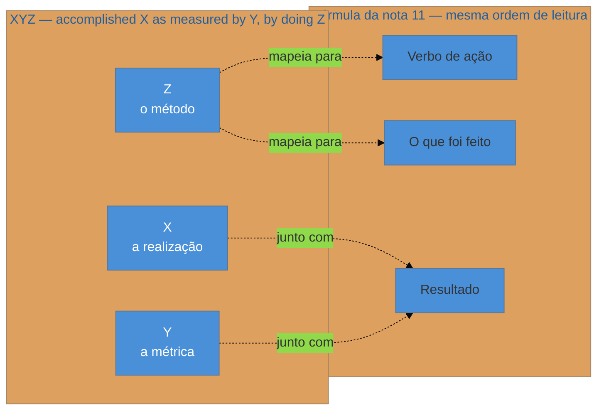
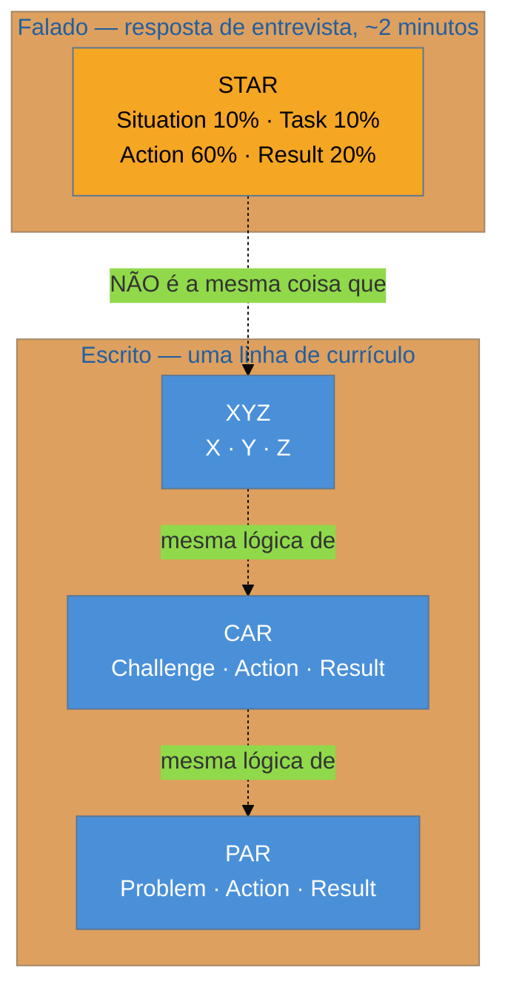

# XYZ, CAR e PAR — e as críticas

> [!abstract] TL;DR
> A [[03-Dominios/Carreira/Currículo/11 - A linha de bullet|nota 11]] já fixou a fórmula geral de uma linha forte — verbo de ação, o que foi feito, resultado. Esta nota trata dos **acrônimos de mercado** que formalizam essa mesma ideia em receita nomeada: **XYZ** (*accomplished [X] as measured by [Y], by doing [Z]*), atribuída a **Laszlo Bock**, ex-vice-presidente sênior de People Operations do Google, em ***Work Rules!*** (2015); e as irmãs **CAR** (*Challenge, Action, Result*) e **PAR** (*Problem, Action, Result*), com a mesma lógica sob rótulos diferentes. O rótulo "fórmula do Google" é de mercado, não institucional — veio depois, por terceiros, não do próprio livro nem de um documento oficial da empresa. A segunda metade da nota é o que a maioria dos guias omite: **quatro críticas sólidas** — a fórmula força métrica onde ela não existe, a repetição mecânica denuncia o gabarito, ela convida ao arredondamento agressivo, e nasceu para uma cultura de contratação específica que não transfere sem atrito. O fecho é o mais útil dos quatro pontos: a fórmula é **andaime**, útil no rascunho para descobrir o que falta numa linha fraca, e deveria sumir da versão final, onde a forma nunca pode pesar mais do que o fato que ela carrega.

## Da fórmula geral ao rótulo que a nomeia

A nota anterior deste galho já fez o trabalho pesado: estabeleceu que uma linha de bullet forte tem três partes — verbo de ação, o que foi feito, resultado — e que a construção mais fraca do gênero, "responsável por", falha justamente por pular a terceira parte. Esta nota não repete esse argumento nem a matriz de verbos que o acompanha; ela parte de um fato diferente, e mais estreito: em algum momento, alguém deu nome a essa mesma lógica de três partes, embalou o nome num acrônimo fácil de lembrar, e o acrônimo se espalhou pelo mercado de carreira como se fosse uma descoberta nova, quando na prática é a mesma fórmula da nota 11 vestida com outra roupa. XYZ, CAR e PAR são três rótulos para o mesmo esqueleto — contexto ou métrica, ação, resultado —, e vale conhecer os três porque cada um aparece com frequência diferente em contextos diferentes: XYZ domina o vocabulário de currículo tech nos Estados Unidos, CAR e PAR aparecem mais em coaching de carreira genérico e em guias de recrutamento fora da bolha de tecnologia, e todos os três, juntos, formam o pano de fundo contra o qual esta nota constrói a segunda metade — a parte que quase nenhum guia de mercado escreve, porque nenhum guia de mercado tem incentivo para dizer que a própria receita que está vendendo tem limite.

## A fórmula XYZ: accomplished X as measured by Y, by doing Z

A formulação mais citada da fórmula XYZ é curta o bastante para caber numa frase: ***accomplished [X] as measured by [Y], by doing [Z]*** — "realizei [X], medido por [Y], fazendo [Z]". Os três colchetes pedem três tipos diferentes de conteúdo: **X** é a realização em si, o que mudou no mundo por causa do trabalho; **Y** é a métrica que prova que a mudança aconteceu, um número ou uma unidade de medida que qualifica o X; e **Z** é o método — o que a pessoa de fato fez, a ação concreta que produziu o resultado. Traduzido para um exemplo simples: "reduzi o tempo de deploy (X) em 95%, de uma hora para três minutos (Y), automatizando o pipeline de CI/CD (Z)" segue a ordem exata da fórmula, com os três colchetes preenchidos por dados específicos em vez de placeholders.

Vale reparar, antes de seguir, que a fórmula XYZ e a fórmula da nota 11 descrevem a mesma linha por ângulos ligeiramente diferentes, sem serem incompatíveis. A nota 11 organiza a frase pela ordem em que ela deve ser lida: verbo primeiro, o que foi feito em seguida, resultado por último. A fórmula XYZ organiza a mesma frase pela função de cada parte, não pela posição — e, na prática, quem escreve uma linha seguindo XYZ costuma reordenar os três elementos na hora de redigir, porque "accomplished X as measured by Y by doing Z" soa correto em inglês formal de gabarito, mas rígido demais se copiado literalmente frase por frase. É comum, e recomendável, inverter Z para o início da linha em português — "automatizei o pipeline de CI/CD, reduzindo o tempo de deploy de uma hora para três minutos" — porque isso alinha a fórmula XYZ com a fórmula da nota 11: o Z vira o verbo de ação que abre a frase, o X e o Y juntos viram o resultado que a fecha. As duas fórmulas não competem; XYZ é uma forma de nomear e lembrar os mesmos três ingredientes que a nota 11 já tinha descrito sem dar nome a cada um.

O diagrama fixa o que a seção anterior descreveu em prosa: o Z da fórmula XYZ carrega o mesmo trabalho que o verbo de ação mais "o que foi feito" carregam na nota 11, e o par X-Y junto carrega o mesmo trabalho que o resultado carrega lá. É a mesma linha, vista de dois ângulos — um que nomeia por função (X, Y, Z), outro que nomeia por posição na frase (verbo, o que foi feito, resultado).

### A origem: Laszlo Bock e Work Rules!

A atribuição mais sólida e mais citada para a fórmula XYZ é **Laszlo Bock**, que foi vice-presidente sênior de People Operations do Google entre 2006 e 2016 — o executivo responsável, nesse período, pela função de recursos humanos da empresa em escala global, incluindo processo de contratação. Bock descreveu a fórmula no livro ***Work Rules! Insights from Inside Google That Will Transform How You Live and Lead***, publicado em 2015, como um conselho prático de como estruturar uma linha de currículo para comunicar realização em vez de atribuição de cargo. É essa a origem que vale registrar com confiança: a fórmula tem autor identificável, tem livro identificável, e tem ano de publicação identificável.

O que já não é tão sólido — e vale nomear com a mesma cautela que este galho aplicou a outras fontes — é o rótulo "a fórmula do Google", que circula amplamente em blogs de carreira, ferramentas comerciais de otimização de currículo e posts virais de LinkedIn, quase sempre sem distinguir duas coisas diferentes: o que Bock escreveu em nome próprio, num livro de negócios de ampla circulação, e o que seria uma política ou um documento institucional do Google ensinando candidatos a escrever currículo dessa forma. **Esta nota não localizou nenhum documento oficial do Google, publicado pela própria empresa como orientação corporativa a candidatos, que use o acrônimo XYZ ou a formulação exata "accomplished X as measured by Y by doing Z"** — o que existe, de forma verificável, é o relato de Bock, ex-executivo da empresa, descrevendo em seu próprio livro (e, de forma consistente, em entrevistas e artigos posteriores assinados por ele) uma prática que ele recomendava a candidatos durante sua gestão de People Operations. A diferença entre "um executivo influente do Google escreveu isso num livro" e "o Google publicou isso como orientação institucional" é real, mesmo que pequena aos olhos de quem só quer saber se a fórmula funciona — e é o tipo de distinção que este galho já se comprometeu, na [[03-Dominios/Carreira/Currículo/04 - Quem lê o seu currículo — e o que a evidência diz|nota 04]], a preservar sempre que uma origem corre risco de ser lida como mais oficial do que de fato é.

Vale reforçar a rastreabilidade dessa origem com um dado que fecha a lacuna de "livro genérico sem citação verificável": o próprio Bock publicou a fórmula, com a mesma formulação, num artigo assinado sob o próprio nome no LinkedIn, em 29 de setembro de 2014 — um ano antes de *Work Rules!* chegar às livrarias — descrevendo-a como o método que ele pessoalmente recomendava a quem lhe pedia ajuda para revisar currículo. Esse artigo, e não um documento institucional do Google, é o registro público mais antigo localizado nesta pesquisa para a formulação exata "accomplished [X] as measured by [Y] by doing [Z]", e ele já aparece assinado em nome próprio, não em nome da empresa — reforçando, mais uma vez, que a fórmula nasceu como conselho pessoal de um executivo, não como política corporativa.

A popularização do rótulo "fórmula do Google", por sua vez, é claramente posterior e claramente de terceiros: sites comerciais de otimização de currículo, newsletters de busca de emprego e conteúdo viral de redes sociais adotaram o nome "Google XYZ formula" nos anos seguintes à publicação do livro, repetindo a atribuição a Bock ao mesmo tempo em que reforçam, no próprio título do artigo, a associação com a marca Google — um padrão de amplificação que aumenta a autoridade percebida da fórmula sem acrescentar evidência nova sobre a eficácia dela. **Não há, nesta pesquisa, nenhum estudo controlado localizado que meça se currículos escritos no formato XYZ convertem mais entrevistas do que currículos escritos de outra forma** — o que existe é o relato de um profissional de recursos humanos sênior, com acesso privilegiado a milhares de decisões reais de contratação ao longo de uma década, recomendando uma prática que ele considerava eficaz. Isso é evidência de peso real — Bock não é uma fonte qualquer, é alguém que via o processo por dentro, em volume, por anos — mas é evidência de experiência relatada, não de estudo medido, e vale tratá-la com a mesma régua de "plausível mas não medido" que a nota 04 já fixou para o galho inteiro.

> [!example] Caso fictício
> Rafael, desenvolvedor pleno, lê um artigo de uma ferramenta comercial de otimização de currículo que abre com a frase "use a fórmula secreta que o Google usa para contratar" e promete revelar "o método XYZ oficial do Google". O artigo nunca cita Laszlo Bock pelo nome, nunca menciona *Work Rules!*, e nunca linka para nenhuma fonte primária — só repete o acrônimo e promete resultado. Rafael, tendo lido esta nota antes, reconhece o padrão: o rótulo "do Google" está fazendo o trabalho de vender autoridade que o conteúdo, sozinho, não sustentaria. Isso não torna a fórmula inútil — Rafael continua usando a lógica de X, Y e Z para revisar as próprias linhas — mas muda como ele trata a alegação de origem: como marketing em cima de uma fonte real, não como política documentada de uma empresa.

## CAR e PAR: as irmãs da mesma lógica

**CAR** — *Challenge, Action, Result* — e **PAR** — *Problem, Action, Result* — são dois acrônimos praticamente intercambiáveis entre si, usados com mais frequência em coaching de carreira generalista e em guias de recrutamento fora da bolha específica de tecnologia do que a fórmula XYZ. A diferença entre os dois nomes é cosmética: "challenge" (desafio) e "problem" (problema) descrevem a mesma coisa — a situação difícil que existia antes da ação — com uma palavra ligeiramente mais otimista de um lado e ligeiramente mais neutra do outro. O miolo dos dois acrônimos é idêntico: nomear o obstáculo, descrever a ação tomada para superá-lo, e fechar com o resultado mensurável dessa ação.

Diferente da fórmula XYZ, esta nota **não localizou um único autor ou uma única obra à qual CAR e PAR possam ser atribuídos com a mesma confiança** que existe para Bock e *Work Rules!*. Os dois acrônimos aparecem, de forma dispersa, em material de coaching de carreira e de recrutamento há décadas, sem que nenhuma fonte encontrada nesta pesquisa reivindique a autoria original de forma verificável — o padrão mais comum é o de uma convenção de mercado que se consolidou por uso repetido, não de uma invenção datada e assinada, como aconteceu com XYZ. Vale declarar essa lacuna com todas as letras, em vez de inventar um nome de autor ou uma data de origem só para preencher a seção: **a origem específica de CAR e PAR não está documentada com a mesma solidez da origem de XYZ**, e é exatamente esse tipo de assimetria de evidência — uma fórmula com autor e livro identificáveis, duas irmãs sem origem clara — que faz sentido nomear abertamente, em vez de tratar as três como se tivessem o mesmo grau de rastreabilidade.

O que importa mais do que a origem, para efeito prático desta nota, é que CAR e PAR resolvem exatamente o mesmo problema que XYZ resolve, com uma diferença estrutural pequena mas real: enquanto XYZ comprime a situação de partida dentro do próprio X (a realização já embute, implicitamente, que havia algo a ser realizado), CAR e PAR abrem um espaço explícito para nomear o obstáculo antes de descrever a ação. Isso torna CAR e PAR ligeiramente mais naturais para situações em que o "antes" precisa aparecer com clareza — um sistema que travava, um processo que gerava retrabalho, uma decisão de negócio mal informada — enquanto XYZ tende a soar mais natural quando o foco cabe inteiro no resultado numérico, sem precisar dramatizar o ponto de partida.

## STAR não é CAR: fala e escrita são gêneros diferentes

É neste ponto que vale marcar, com clareza que quase nenhum guia de mercado se dá ao trabalho de marcar, uma distinção que muda o que cada acrônimo serve para fazer: **STAR** — *Situation, Task, Action, Result* — não é uma quarta irmã de XYZ, CAR e PAR. STAR é estrutura de **resposta falada numa entrevista comportamental**, não de linha escrita num documento, e a diferença entre os dois gêneros não é sutil — é a diferença entre uma frase que precisa caber numa única linha de página e uma resposta oral que ocupa cerca de dois minutos, com proporção de tempo declarada entre as quatro partes. A [[03-Dominios/Carreira/Entrevistas/06 - STAR e suas variantes|nota 06 de Entrevistas]] trata do STAR a fundo — o time-box de 10%/10%/60%/20%, a variante STAR-L para histórias de fracasso, o hábito de dizer "eu" em vez de "a gente" — e esta nota não repete nada disso; ela existe só para fixar a fronteira que impede alguém de confundir os dois gêneros.

O motivo estrutural para a diferença é simples de nomear: uma linha de currículo é lida em segundos por um leitor que já sabe, pelo cargo e pela seção do documento, boa parte do contexto — ele não precisa que a pessoa reconstrua a situação antes de chegar à ação, porque não há tempo de página nem paciência de leitor para isso. Uma resposta comportamental falada, ao contrário, é a única chance que o entrevistador tem de ouvir o contexto da boca de quem viveu a história, e é por isso que STAR reserva 10% do tempo, de propósito, para a *Situation* — algo que uma linha de bullet, no formato XYZ, CAR ou PAR, simplesmente não tem espaço para fazer, e não deveria tentar fazer. Uma linha de currículo que tenta abrir com "situação" da mesma forma que uma resposta falada abre normalmente fica pesada demais para o gênero — é o erro inverso do que a nota 06 já descreveu como o erro mais comum do lado falado, que é gastar tempo demais em contexto e pouco na ação.

Vale nomear a consequência prática dessa distinção, porque ela evita um erro comum: quem prepara a mesma realização para os dois formatos — o currículo e a entrevista comportamental — não deveria escrever a mesma frase nos dois lugares. A linha de currículo, em XYZ ou CAR, comprime a realização inteira numa frase densa, sem contexto explícito. A resposta falada, em STAR, expande a mesma realização numa narrativa de dois minutos, com situação e tarefa abrindo espaço antes da ação. As duas descrevem o mesmo evento real, mas em proporções de tempo e detalhe completamente diferentes — e um candidato que memoriza a linha do currículo e tenta recitá-la, palavra por palavra, como resposta de entrevista, entrega uma resposta seca demais, sem a textura que o entrevistador está, de fato, procurando ouvir.

## As quatro críticas

É aqui que esta nota se separa do resto do que o mercado publica sobre XYZ, CAR e PAR. Quase todo guia de currículo ensina a fórmula como se ela fosse neutra — um molde sem custo, que só precisa ser preenchido corretamente para produzir uma linha forte. Não é assim. A fórmula tem quatro custos reais, e conhecê-los é o que separa quem usa a fórmula como ferramenta de quem é usado por ela.

### Primeira crítica: força métrica onde ela não existe

A fórmula XYZ tem um slot obrigatório para métrica — o Y — e um slot vazio, por construção, convida a ser preenchido, mesmo quando o dado real que sustentaria esse preenchimento não existe. Isso não é uma falha de caráter de quem escreve; é uma propriedade estrutural do próprio formato: uma fórmula com três colchetes visíveis pede, visualmente, que os três sejam preenchidos, e um colchete vazio parece, para quem está revisando o próprio currículo sob pressão de prazo, um sinal de linha incompleta — algo a ser corrigido antes de o documento estar pronto. É exatamente esse mecanismo — colchete vazio lido como defeito a corrigir, não como limite honesto do que existe para contar — que abre a porta para o número inventado entrar num currículo sem que ninguém, em nenhum momento, tenha decidido conscientemente mentir. Ninguém senta para escrever um currículo pensando "vou inventar uma estatística"; a pessoa só sente que a linha "ficaria melhor" com um percentual, procura um número que soe plausível, e o insere sem verificar se consegue defendê-lo numa pergunta de acompanhamento. A [[03-Dominios/Carreira/Currículo/15 - Quando não há número|nota 15]], mais adiante no galho, trata em profundidade do que fazer quando esse colchete de fato não tem nenhum número honesto para preencher — proxies de segunda ordem, consequência nomeada, escopo verificável — e vale reter, aqui, só o mecanismo que torna essa nota necessária: a fórmula, por desenho, não deixa espaço visível para "não sei o número exato", e é justamente essa ausência de espaço que precisa ser corrigida por quem escreve, não pela fórmula em si.

### Segunda crítica: a repetição mecânica denuncia

Um currículo com oito bullets, todos seguindo rigidamente a mesma forma sintática — verbo forte, vírgula, "medido por" implícito, vírgula, "fazendo" implícito — para de comunicar conteúdo e passa a comunicar gabarito. O leitor da nota 04, que varre um currículo em segundos, é treinado, por exposição a centenas de currículos, a reconhecer padrões de formato antes mesmo de processar o conteúdo específico de cada linha — e uma sequência de oito frases estruturalmente idênticas, mesmo com verbos e números diferentes em cada uma, ativa esse reconhecimento de padrão de um jeito que trabalha contra quem escreveu o documento. O que deveria soar como oito realizações distintas passa a soar como um exercício de preenchimento de molde, repetido oito vezes com substantivos trocados — e um documento que soa gerado, em vez de vivido, é precisamente o oposto do que uma linha de bullet deveria produzir num leitor cético. A correção prática não é abandonar a fórmula — é variar a superfície da frase mantendo o conteúdo: às vezes o verbo abre a linha, às vezes o resultado abre a linha e o método fecha, às vezes uma linha é mais curta que as outras porque a realização que ela descreve não pedia o mesmo desenvolvimento das vizinhas. Uma seção de experiência inteira escrita com a disciplina de "toda linha segue XYZ ao pé da letra" tende a produzir exatamente o efeito que essa disciplina deveria evitar.

### Terceira crítica: convida ao arredondamento agressivo

Um slot de métrica obrigatório não força só a invenção de números que não existem — força também o arredondamento agressivo de números que existem, mas de forma menos limpa do que a fórmula parece pedir. "Melhorei a performance em 40%" é fácil de escrever, cabe perfeitamente no Y da fórmula XYZ, e soa impressionante o bastante para chamar atenção numa varredura rápida — o problema aparece depois, na entrevista, quando alguém pergunta "como você mediu esses 40%?" e a resposta honesta é "na verdade não medi com precisão, foi uma impressão geral da equipe de que as coisas ficaram mais rápidas". É nesse ponto exato que a credibilidade do candidato quebra — não porque a melhoria não tenha existido, mas porque o número que a descreve, na hora de ser defendido em voz alta, se revela mais frágil do que o formato escrito sugeria. A [[03-Dominios/Carreira/Currículo/14 - Números que você pode defender|nota 14]], mais adiante no galho, trata em profundidade dos três níveis de confiança que um número pode carregar — medido, contado, lembrado — e da diferença entre um percentual honesto e um percentual de falsa precisão, derivado de uma base que ninguém registrou com cuidado. Vale reter aqui apenas a ligação causal direta: quanto mais rígido o slot de métrica de uma fórmula, maior a pressão para arredondar um número incerto até ele soar como um número redondo e confiável — e é exatamente essa pressão silenciosa que a fórmula, por desenho, não avisa que está exercendo.

### Quarta crítica: nasceu para uma cultura de contratação específica

A quarta crítica é a que exige mais cuidado para não ser mal-entendida, porque não é uma crítica ao mérito da fórmula — é uma crítica ao alcance dela. A fórmula XYZ nasceu no contexto de contratação do Google descrito por Bock em *Work Rules!*: uma cultura de recrutamento fortemente orientada a dado, com processo de seleção estruturado, entrevistadores treinados para calibrar avaliação entre si, e um volume de candidaturas grande o suficiente para que uma linha densa em métrica funcionasse como filtro rápido e comparável entre candidatos. Esse não é o contexto de contratação de toda vaga, todo nível e todo mercado, e tratar a fórmula como universal — como se ela funcionasse do mesmo jeito numa vaga de estágio, numa contratação por indicação pessoal, numa cultura organizacional que valoriza narrativa e relacionamento mais do que métrica isolada, ou num mercado fora da bolha de tecnologia orientada a dado — é generalizar um instrumento afiado para um contexto específico como se ele fosse uma ferramenta neutra e universal.

Isso não significa que a fórmula seja ruim fora desse contexto — significa que ela tem um habitat, e que fora dele ela pode soar deslocada em vez de impressionante. Um currículo de estagiário carregado de percentuais e métricas de negócio no formato XYZ, como a [[03-Dominios/Carreira/Currículo/03 - Os seis níveis e o que muda entre eles|nota 03]] já deixou implícito ao descrever o que cada nível precisa provar, tende a soar artificial — porque o leitor de um currículo de estagiário está avaliando potencial e disciplina de aprendizado, não decisão de arquitetura com trade-off medido, e um bullet XYZ perfeitamente executado, mas aplicado ao contexto errado de senioridade, comunica desalinhamento de expectativa mais do que competência. O mesmo vale por mercado: currículos voltados a culturas que valorizam alto contexto e relação pessoal — um tema que a [[03-Dominios/Carreira/Currículo/24 - Mercados, e o Brazilian Cultural Bug|nota 24]], mais adiante no galho, trata com profundidade — podem receber um currículo denso em métrica seca com menos entusiasmo do que receberiam num mercado que espera exatamente esse formato. A crítica, resumida numa frase, não é "XYZ está errada" — é "XYZ resolve o problema de um leitor específico, num contexto específico de contratação, e vale checar se o leitor do outro lado é, de fato, esse leitor antes de aplicar a fórmula sem ajuste".

## Andaime, não gabarito

As quatro críticas acima não pedem que a fórmula seja descartada — pedem que ela seja usada com o papel certo, que é o de andaime, não o de gabarito final. Um andaime existe para sustentar uma estrutura enquanto ela está sendo construída, e é removido quando a obra já se sustenta sozinha; um gabarito existe para produzir cópias idênticas, e o objetivo dele é justamente que o resultado final ainda carregue, visível, a marca do molde. A fórmula XYZ, CAR ou PAR serve bem ao primeiro papel e mal ao segundo.

No **rascunho**, a fórmula é uma ferramenta de diagnóstico genuinamente útil: forçar cada linha a passar pelos três colchetes — o que foi feito, com que métrica, por qual método — expõe rápido quais linhas do currículo, na versão anterior, estavam descrevendo escopo em vez de resultado, exatamente o defeito que a nota 11 já nomeou como o problema central de "responsável por". Preencher os três colchetes de uma linha fraca é o exercício mais rápido para descobrir o que está faltando nela: se o Y não vem à mente com facilidade, é sinal de que a pessoa nunca mediu aquele resultado, ou de que o resultado real é mais modesto do que a linha original sugeria; se o Z é vago, é sinal de que a linha está descrevendo um efeito sem nomear a causa que a pessoa de fato controlou. Nesse estágio, o andaime está fazendo exatamente o trabalho que um andaime deveria fazer.

Na **versão final**, o critério muda. Uma vez que a linha já passou pelo diagnóstico e o conteúdo real está claro — a ação certa, a métrica honesta, o resultado defensável — a forma sintática exata da fórmula deixa de ser obrigatória, e forçá-la deliberadamente a cada linha é o que produz o sintoma da segunda crítica: oito linhas com a mesma cadência, soando geradas em vez de vividas. É nesse momento que vale reescrever cada linha priorizando a voz natural do fato sobre a forma prescrita do molde — manter o conteúdo (ação, método, resultado), variar a superfície da frase, e deixar que a fórmula, tendo cumprido o papel de andaime durante a construção, desapareça da obra pronta. Um andaime que continua de pé depois que o prédio está terminado não protege nada — atrapalha a vista de quem chega para ver o resultado.

## Casos práticos

> [!example] Caso fictício
> Tiago, desenvolvedor júnior, revisa o próprio currículo antes de aplicar para uma vaga e chega à linha "Otimizei consultas ao banco de dados". Lembrando da fórmula XYZ, ele sente que falta o Y — a métrica — e, sem lembrar de nenhum número exato daquele período de trabalho, escreve "reduzindo o tempo de resposta em 60%" só porque o percentual "soa razoável" para o tipo de mudança que fez. Na revisão seguinte, ele para e se pergunta se conseguiria defender esse número numa pergunta de acompanhamento — e percebe que não consegue, porque nunca mediu o antes e o depois com precisão, só notou "que ficou mais rápido" na prática diária. Em vez de manter o percentual inventado, ele reescreve a linha usando o que de fato lembra com confiança: "Otimizei as três consultas mais lentas do módulo de relatórios, eliminando o timeout que ocorria em horário de pico." Nenhum percentual entra na frase — mas a linha continua específica, verificável e honesta, porque descreve um evento concreto (o timeout que parou de acontecer) em vez de um número que só existia para preencher o slot Y da fórmula.

> [!example] Caso fictício
> Uma recrutadora técnica, revisando o currículo de uma candidata a vaga de pleno, lê os oito bullets da seção de experiência mais recente e nota que todos começam com um verbo forte seguido de vírgula e fecham com um percentual — "Otimizei X, reduzindo Y em Z%" repetido, com pequenas variações, oito vezes seguidas. Nenhuma linha, isoladamente, está errada — os verbos são fortes e os números parecem plausíveis — mas a recrutadora, depois de ler currículos gerados por ferramentas de inteligência artificial com o mesmo padrão sintático repetitivo, passa a desconfiar de que os números foram preenchidos por um gerador de texto, não vividos por uma pessoa. Ela avança a candidata mesmo assim, mas anota, para a entrevista, duas das linhas com números mais genéricos para pedir detalhe de medição — exatamente a checagem que a terceira crítica desta nota descreve, e que a segunda crítica já havia previsto como consequência da repetição mecânica.

## Exemplos: a mesma realização, quatro formas

> [!example] Caso fictício
> Renata Cordeiro, desenvolvedora pleno de uma empresa de logística, liderou a substituição de um sistema de rastreamento de entregas que gerava consultas lentas ao banco de dados, causando atraso visível na atualização de status para o cliente final. A mesma realização, escrita nas três fórmulas e depois numa forma livre que preserva o conteúdo sem seguir nenhum molde:
>
> **XYZ:** "Reduzi o tempo de resposta do rastreamento de entregas em 78%, de 4,2 segundos para 900 milissegundos, reescrevendo as consultas de status para usar índice composto em vez de varredura completa da tabela."
>
> **CAR:** "Desafio: o rastreamento de entregas levava até 4,2 segundos para atualizar o status, gerando reclamações recorrentes de clientes sobre informação desatualizada. Ação: identifiquei que as consultas faziam varredura completa da tabela de eventos e as reescrevi com um índice composto por pedido e data. Resultado: o tempo de resposta caiu para 900 milissegundos, e as reclamações relacionadas a status desatualizado praticamente zeraram no trimestre seguinte."
>
> **PAR:** "Problema: consultas de rastreamento sem índice adequado deixavam o status de entrega desatualizado por segundos, na percepção do cliente final. Ação: reescrevi as consultas de status com índice composto e removi a varredura completa que causava o gargalo. Resultado: tempo de resposta caiu de 4,2 segundos para 900 milissegundos, eliminando o principal motivo de reclamação sobre a funcionalidade de rastreamento."
>
> **Forma livre, sem molde visível:** "O rastreamento de entregas vivia atrasado — clientes reclamavam de ver status de dois dias atrás. Encontrei o gargalo numa consulta sem índice, varrendo a tabela inteira a cada atualização; troquei por um índice composto e o tempo de resposta caiu de mais de quatro segundos para menos de um. As reclamações sobre status atrasado sumiram do time de suporte no trimestre seguinte."
>
> As quatro versões contam exatamente o mesmo fato, com os mesmos números, sem nenhuma inflação nem em nenhuma direção. O que muda entre elas não é a substância — é o quanto a forma da fórmula aparece na superfície da frase. A versão livre é a que Renata Cordeiro deveria manter na versão final do currículo, porque ela carrega todo o conteúdo das três anteriores sem que o leitor precise notar o molde por trás; as três primeiras foram o andaime que ajudou Renata Cordeiro a descobrir, no rascunho, que a linha original — "trabalhei na melhoria de performance do sistema de rastreamento" — estava escondendo um resultado bom demais para ficar tão genérico.

## Armadilhas comuns

> [!warning] Copiar o rótulo da fórmula para dentro da linha
> **O que acontece:** a pessoa escreve literalmente "Desafio:", "Ação:" e "Resultado:" dentro da própria linha do currículo, como se o leitor precisasse ver os rótulos da fórmula para reconhecer as três partes. **Por quê:** depois de praticar a fórmula no rascunho, os próprios nomes das partes (X, Y, Z, ou Challenge, Action, Result) ficam tão presentes na cabeça de quem escreve que parece natural deixá-los visíveis no texto final. **Como evitar:** os rótulos da fórmula são andaime de processo, não conteúdo de produto — a linha final deve conter a ação, o método e o resultado como texto corrido natural, sem nenhum rótulo de framework aparecendo entre parênteses ou dois-pontos.

> [!warning] Tratar XYZ como sinônimo de resposta de entrevista
> **O que acontece:** a pessoa prepara uma linha de currículo em XYZ e, quando perguntada sobre aquela realização numa entrevista comportamental, recita a mesma frase curta e densa, esperando que ela funcione como resposta completa. **Por quê:** os dois gêneros parecem próximos o bastante — os dois descrevem a mesma realização — para que pareça redundante preparar dois textos diferentes para a mesma história. **Como evitar:** lembrar a distinção fixada nesta nota: a linha de currículo é para ser lida em segundos, sem contexto explícito; a resposta de entrevista segue STAR, expandida ao longo de cerca de dois minutos, com situação e tarefa abrindo espaço antes da ação — a [[03-Dominios/Carreira/Entrevistas/06 - STAR e suas variantes|nota 06]] detalha como preparar essa segunda versão.

> [!warning] Aplicar a mesma densidade de métrica em todos os níveis
> **O que acontece:** alguém no início de carreira, sem histórico ainda para produzir números de negócio defensáveis, força o slot Y da fórmula com um percentual pouco sólido só para não deixar a linha "incompleta" segundo o molde. **Por quê:** a fórmula, aplicada sem ajuste, não distingue nível de senioridade — o mesmo slot Y parece obrigatório em qualquer degrau da escada. **Como evitar:** revisitar o que a [[03-Dominios/Carreira/Currículo/03 - Os seis níveis e o que muda entre eles|nota 03]] já estabeleceu sobre o que cada nível precisa provar, e lembrar que a [[03-Dominios/Carreira/Currículo/15 - Quando não há número|nota 15]] existe justamente para os casos em que o Y honesto é uma consequência, não um percentual.

## Como soa em inglês

> "I use the XYZ formula — accomplished X as measured by Y by doing Z — as popularized by Laszlo Bock in Work Rules!, but I treat it as scaffolding, not a template. I fill in the three brackets during the draft to find out what a weak line is actually missing, and then I let the exact sentence structure disappear once the content is solid — eight bullets that all read in the same rigid cadence tip the reader off that they're looking at a formula, not a career. I'm also careful never to confuse XYZ, CAR, or PAR with STAR: the first three are written formats for a single résumé line, and STAR is a spoken format for a two-minute behavioral interview answer — mixing the two produces either a résumé line that's too long or an interview answer that's too thin."

| PT | EN |
| --- | --- |
| fórmula XYZ | XYZ formula |
| a realização, medido por, fazendo | accomplished, as measured by, by doing |
| desafio / problema, ação, resultado | Challenge / Problem, Action, Result |
| resposta falada de entrevista | spoken interview answer |
| andaime, não gabarito | scaffolding, not a template |
| slot de métrica | metric slot |
| arredondamento agressivo | aggressive rounding |
| cultura de contratação | hiring culture |

## O que vem a seguir

Nomeadas as fórmulas de mercado e as críticas que elas raramente admitem sobre si mesmas, o galho segue para a escada que dá nome ao grau de propriedade que cada linha declara, e depois para as duas notas que resolvem, em profundidade, os dois ganchos abertos aqui — o número que sustenta a métrica, e a ausência dele:

- [[03-Dominios/Carreira/Currículo/13 - Responsabilidade, realização e alavancagem|13 - Responsabilidade, realização e alavancagem]] — a escada task-taker, owner, force multiplier, que dá nome ao que muda entre uma linha de júnior e uma de staff.
- [[03-Dominios/Carreira/Currículo/14 - Números que você pode defender|14 - Números que você pode defender]] — os três níveis de confiança de um número, e a falsa precisão do percentual derivado que a terceira crítica desta nota já antecipou.
- [[03-Dominios/Carreira/Currículo/15 - Quando não há número|15 - Quando não há número]] — proxies de segunda ordem, consequência, escopo, para o slot Y quando ele, honestamente, não tem número nenhum para receber.

## Veja também

- [[03-Dominios/Carreira/Currículo/index|Currículo]] — o índice do galho, com a tese e o mapa das 26 notas.
- [[03-Dominios/Carreira/Currículo/11 - A linha de bullet|11 - A linha de bullet]] — a fórmula geral (verbo, o que foi feito, resultado) que XYZ, CAR e PAR formalizam sob acrônimo, e o teste linha a linha que continua valendo depois que o molde some.
- [[03-Dominios/Carreira/Entrevistas/06 - STAR e suas variantes|06 - STAR e suas variantes]] — o galho parceiro: a estrutura irmã, mas falada, com o time-box que XYZ, CAR e PAR nunca precisam declarar.
- [[03-Dominios/Carreira/Currículo/03 - Os seis níveis e o que muda entre eles|03 - Os seis níveis e o que muda entre eles]] — por que a quarta crítica desta nota pesa de forma diferente em cada degrau da escada de senioridade.
- [[03-Dominios/Carreira/Currículo/24 - Mercados, e o Brazilian Cultural Bug|24 - Mercados, e o Brazilian Cultural Bug]] — a quarta crítica desenvolvida por mercado, mais adiante no galho.

## Fontes

- **Laszlo Bock** — *Work Rules! Insights from Inside Google That Will Transform How You Live and Lead* (Twelve, 2015). Fonte primária da fórmula XYZ e da atribuição de autoria; Bock foi vice-presidente sênior de People Operations do Google entre 2006 e 2016. Esta nota não reproduz citação literal do livro — a formulação "accomplished [X] as measured by [Y], by doing [Z]" é reportada de forma indireta, como amplamente repetida em fontes secundárias que remetem ao livro, sem verificação de página ou trecho exato.
- **Laszlo Bock** — [My Personal Formula for a Winning Resume](https://www.linkedin.com/pulse/20140929001534-24454816-my-personal-formula-for-a-better-resume), LinkedIn, 29 de setembro de 2014. Registro público mais antigo localizado nesta pesquisa com a formulação exata da fórmula, assinado por Bock em nome próprio, um ano antes da publicação de *Work Rules!*; verificado ao vivo em 2026-08-20.
- Nenhum documento institucional publicado pelo próprio Google, distinto do relato pessoal de Bock em seu livro, foi localizado usando o acrônimo XYZ ou a formulação exata da fórmula — a lacuna é declarada explicitamente no corpo da nota, na seção sobre a origem.
- A origem específica dos acrônimos **CAR** e **PAR** — autor, obra e data de primeira publicação — não foi localizada nesta pesquisa com a mesma solidez da origem de XYZ; a nota declara essa ausência de forma explícita em vez de atribuir os dois acrônimos a uma fonte não verificada.
- Fontes comerciais de otimização de currículo que popularizam o rótulo "fórmula do Google" para XYZ — do mesmo tipo já nomeado pela [[03-Dominios/Carreira/Currículo/04 - Quem lê o seu currículo — e o que a evidência diz|nota 04]] como fontes com interesse direto em vender otimização de currículo — foram usadas apenas para confirmar que o rótulo circula amplamente no mercado, nunca como fonte de autoridade sobre a origem real da fórmula ou sobre a eficácia dela.
- [[03-Dominios/Carreira/Entrevistas/06 - STAR e suas variantes|Entrevistas/06 - STAR e suas variantes]] — fonte interna do vault para a estrutura e o time-box do STAR, citados aqui apenas para estabelecer a fronteira entre fórmula escrita e resposta falada, sem repetir a pesquisa já feita naquela nota.
