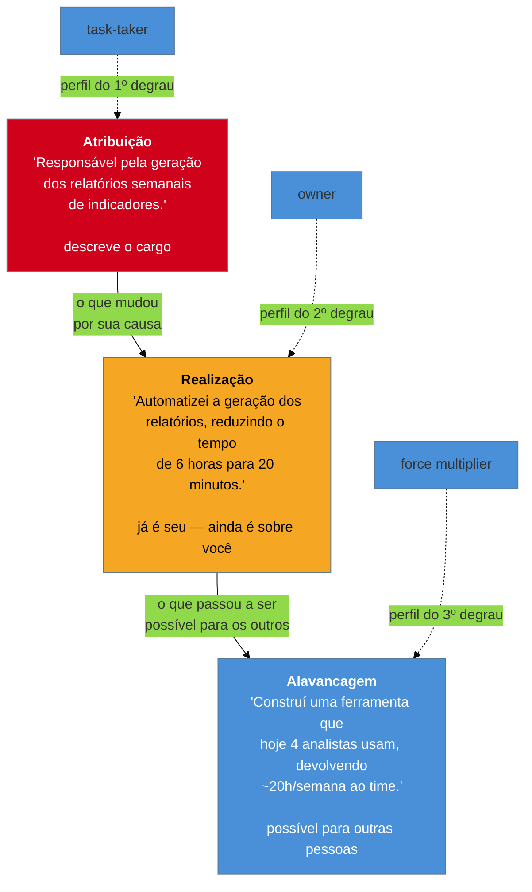

# Responsabilidade, realização e alavancagem

> [!abstract] TL;DR
> A [[03-Dominios/Carreira/Currículo/11 - A linha de bullet|nota 11]] tratou de um problema de **construção da frase**: "responsável por" é fraco porque descreve escopo, não causa. Esta nota trata de um problema diferente, um degrau abaixo da frase — **que tipo de fato você tem para contar**, antes mesmo de escrever a primeira palavra do bullet. Existe uma escada de três degraus por trás de qualquer linha de currículo: **atribuição** (o que estava no seu cargo), **realização** (o que mudou por sua causa) e **alavancagem** (o que passou a ser possível para outras pessoas por causa da sua decisão). Os três degraus correspondem a três perfis que quem contrata reconhece de cor — **task-taker**, **owner** e **force multiplier** — e é o terceiro degrau, quase nunca escrito, que separa um currículo de sênior de um currículo de staff. O ponto mais honesto desta nota é o que a maioria dos guias de mercado prefere não dizer: **nem todo trabalho tem o terceiro degrau**, e forçá-lo onde ele não existe é a mesma mentira, com outra roupa, que a [[03-Dominios/Carreira/Currículo/12 - XYZ, CAR e PAR — e as críticas|nota 12]] já descreveu como arredondamento agressivo. A escada é instrumento de diagnóstico do que aconteceu, não instrução de inflar o que se conta sobre isso.

## Um problema de frase, um problema de fato

Vale abrir marcando a fronteira com a nota anterior, porque as duas notas tratam de coisas fáceis de confundir à primeira leitura. A nota 11 ensinou a testar uma linha já escrita — outra pessoa no mesmo cargo poderia ter escrito esta frase? — e mostrou como consertar uma linha fraca trocando o verbo passivo por um verbo de propriedade, acrescentando o dado específico que só quem viveu aquele resultado teria para contar. Esse é um problema de **construção**: a frase existe, o fato por trás dela existe, e o trabalho é fazer a frase corresponder ao fato com precisão. Esta nota trata de uma pergunta anterior a essa, que nenhuma reescrita de frase resolve sozinha: **antes de escolher o verbo, que tipo de fato você tem nas mãos?** Um evento que só mudou o que aconteceu dentro do seu próprio trabalho é um tipo de fato. Um evento que mudou o que outras pessoas passaram a conseguir fazer, depois de você, é outro tipo de fato — e nenhuma quantidade de verbo forte transforma um no outro, porque a diferença não está na frase, está no mundo.

É essa diferença que a escada desta nota nomeia. Ela não substitui a fórmula da nota 11 nem os acrônimos da nota 12 — continua valendo tudo o que as duas já ensinaram sobre como escrever a linha, uma vez que o fato esteja escolhido. O que a escada faz é anterior a isso: ela pergunta, sobre um pedaço de trabalho real, em qual dos três degraus esse trabalho de fato aconteceu, para que a linha escrita depois não prometa mais — nem menos — do que o fato sustenta.

## A escada em três degraus

### Primeiro degrau: atribuição

A **atribuição** descreve o que estava no seu escopo — a área de responsabilidade formal que o cargo, o time ou o gestor delegaram a você antes de qualquer trabalho ter sido feito. "Responsável pela manutenção do sistema de faturamento" é atribuição pura: descreve uma fronteira de responsabilidade, não um evento. A nota 11 já mostrou, com o exemplo dos dois desenvolvedores plenos contratados no mesmo mês, por que a atribuição sozinha não carrega informação sobre desempenho — dois resultados opostos cabem, sem contradição, na mesma frase de atribuição, porque a frase nunca chegou a descrever o que cada um efetivamente fez. Vale reter aqui só o que a atribuição *é*, sem repetir a crítica inteira: ela descreve o **cargo**, não a **pessoa** que o ocupou. Um organograma poderia escrever a mesma frase sem que ninguém nele tivesse trabalhado um único dia.

### Segundo degrau: realização

A **realização** descreve o que mudou **por sua causa** — o evento concreto que aconteceu porque você, especificamente, tomou uma decisão ou executou uma ação, e que não teria acontecido, ou não teria acontecido daquele jeito, se outra pessoa qualquer estivesse na mesma posição. "Automatizei a geração dos relatórios semanais, reduzindo o tempo de preparação de seis horas para vinte minutos" é realização: já não descreve um cargo, descreve um evento datável, com uma causa nomeada e uma consequência medida. É exatamente o tipo de fato que a fórmula da nota 11 — verbo de ação, o que foi feito, resultado — foi desenhada para carregar, e é o tipo de fato que os acrônimos XYZ, CAR e PAR da nota 12 formalizam sob rótulos diferentes. Mas repare no que a realização ainda não faz: ela continua sendo sobre você. O sujeito da frase muda de vozes — deixa de ser "o cargo exigia" e passa a ser "eu fiz" — mas o escopo do que é descrito permanece dentro do perímetro do próprio trabalho da pessoa. É já **seu**, no sentido de que ninguém mais poderia ter assinado a mesma frase sem ter vivido o mesmo evento — mas ainda é **sobre você**, no sentido de que o efeito descrito não sai do seu próprio raio de ação.

### Terceiro degrau: alavancagem

A **alavancagem** descreve o que passou a ser possível **para outras pessoas** por causa da sua decisão — não mais só o que você fez, mas o que o seu trabalho destravou para alguém além de você. "Construí uma ferramenta de geração automática de relatórios que hoje é usada por quatro analistas de outras áreas, devolvendo cerca de vinte horas por semana ao time como um todo" é alavancagem: o sujeito da frase continua sendo você — foi você quem decidiu, quem construiu — mas o objeto do resultado deixou de ser o seu próprio trabalho e passou a ser o trabalho de outras pessoas. É o degrau que quase ninguém escreve, e a razão é estrutural, não uma questão de modéstia mal colocada: alavancagem exige um tipo de fato que boa parte do trabalho técnico, honestamente, nunca produz — um artefato, uma decisão ou um padrão que sobrevive à sua autoria original e passa a operar sozinho, no trabalho de gente que nunca precisou pedir sua ajuda para usá-lo.

O diagrama fixa o que as três seções acima descreveram em prosa, e uma coisa que ele deixa visível merece ser dita em palavras: as setas apontam numa direção só, mas isso não significa que todo trabalho percorre o caminho inteiro. É perfeitamente possível — e, como a seção mais adiante desta nota vai insistir, é a situação mais comum — que um pedaço de trabalho pare no segundo degrau para sempre, sem nunca chegar ao terceiro. A escada não é uma escada rolante que carrega todo mundo até o topo com o tempo; é uma régua para medir onde um fato específico, hoje, realmente está.

## Os três perfis: task-taker, owner e force multiplier

Cada degrau da escada corresponde a um perfil que quem contrata reconhece — não por adjetivo vago como "proativo" ou "dinâmico", mas pelo que cada perfil de fato produz quando colocado diante de um problema.

O **task-taker** ("aquele que recebe a tarefa", em tradução literal) é o perfil que produz **atribuição**: recebe um problema já fatiado por outra pessoa — a tarefa vem com escopo definido, critério de aceite claro, prazo combinado — e entrega o que foi pedido dentro dessas fronteiras. Não é um perfil inferior nem um insulto; é exatamente o que a [[03-Dominios/Carreira/Currículo/03 - Os seis níveis e o que muda entre eles|nota 03]] já descreveu como o que o currículo de júnior precisa provar — execução confiável sob orientação. Um time inteiro de task-takers sem nenhum owner por perto trava, porque ninguém decide o que fazer quando o problema chega sem fatiamento prévio; mas um time sem nenhum task-taker também trava, porque alguém precisa executar o que foi decidido, e executar bem, sob prazo, é uma competência real, não um degrau a ser superado com pressa.

O **owner** ("dono", no sentido de quem assume a responsabilidade pelo resultado, não pela tarefa) é o perfil que produz **realização**: recebe um problema, não uma tarefa já fatiada, decide sozinho o caminho técnico dentro dele, e entrega um resultado que consegue defender como próprio numa pergunta de acompanhamento. É o perfil que a nota 03 associou ao currículo de pleno — autonomia e um resultado que a pessoa sustenta como próprio, com número atrás. O owner já não precisa que alguém desenhe o caminho; ele mesmo decide o caminho e responde pelas consequências da decisão, boas ou ruins.

O **force multiplier** ("multiplicador de força", termo emprestado de contexto militar e adotado com frequência em gestão de engenharia para descrever quem aumenta a capacidade de um grupo além da própria capacidade individual) é o perfil que produz **alavancagem**: o trabalho dele não termina no próprio resultado — ele constrói algo, decide algo, ou ensina algo que muda o que **outras pessoas** conseguem fazer depois. Não é sinônimo de "trabalha mais" nem de "sabe mais tecnologia" — é sinônimo de "o efeito do meu trabalho ultrapassa o perímetro do meu próprio trabalho". Um force multiplier pode, individualmente, produzir menos linhas de código do que um owner produtivo — e ainda assim valer mais para a organização, porque cada hora dele se multiplica pelo número de pessoas cujo trabalho ele destravou.

Os três termos aparecem em inglês porque são vocabulário técnico consolidado de carreira, não uma escolha estilística: são os nomes que aparecem em avaliação de desempenho, em rubrica de promoção e em critério de contratação de empresas de tecnologia de porte médio a grande, e traduzi-los à força ("tomador de tarefa", "dono", "multiplicador de força") produziria um currículo com um vocabulário que ninguém do outro lado da mesa reconheceria como o termo que o mercado usa.

## O exemplo trabalhado: o mesmo trabalho, três formas de contar

> [!example] Caso fictício
> Felipe Cordeiro, desenvolvedor de uma empresa de médio porte do setor de varejo, é responsável, dentro do time de operações internas, por preparar um relatório semanal de indicadores para a diretoria — vendas por região, margem por categoria de produto, taxa de devolução. Toda sexta-feira à tarde, ele reunia dados de três sistemas diferentes numa planilha, cruzava manualmente as tabelas e formatava o resultado num documento que ia para a reunião de segunda. O processo levava, em média, seis horas de trabalho manual repetitivo por semana. Depois de alguns meses fazendo exatamente essa tarefa, Felipe escreveu um script que automatizava a extração e o cruzamento dos dados, deixando só a revisão final e o envio a cargo dele — o relatório que levava seis horas passou a levar vinte minutos. Meses depois, três analistas de outras áreas — financeiro, marketing e logística — que enfrentavam o mesmo tipo de tarefa repetitiva com dados de sistemas diferentes pediram a Felipe ajuda para adaptar o script aos próprios relatórios. Ele generalizou a ferramenta, documentou o uso e passou a mantê-la como um projeto interno pequeno, hoje usado por quatro pessoas — ele mesmo e os três analistas — que juntas deixaram de gastar, somadas, cerca de vinte horas por semana no trabalho manual que a ferramenta substituiu.
>
> É o mesmo trabalho, contado nos três degraus:
>
> **Atribuição:** "Responsável pela geração dos relatórios semanais de indicadores de vendas, margem e devolução para a diretoria." A frase descreve o cargo de Felipe — o que estava sob a alçada dele antes de qualquer decisão sua ter acontecido. Qualquer pessoa que tivesse ocupado a mesma posição, mesmo sem nunca ter escrito uma linha de automação, poderia assinar essa frase sem alterar uma palavra.
>
> **Realização:** "Automatizei a geração dos relatórios semanais de indicadores, reduzindo o tempo de preparação de seis horas para vinte minutos por semana." A frase já não descreve o cargo — descreve um evento que aconteceu porque Felipe, especificamente, decidiu escrever o script. Passa no teste linha a linha da nota 11 sem esforço: nem todo analista na mesma posição teria automatizado o processo, e o resultado é medido, específico, defensável. Mas o efeito descrito ainda termina dentro do próprio trabalho de Felipe — é o tempo *dele* que caiu de seis horas para vinte minutos.
>
> **Alavancagem:** "Construí uma ferramenta de geração automática de relatórios que hoje é usada por quatro analistas de três áreas diferentes, devolvendo cerca de vinte horas por semana ao conjunto do time." A frase carrega o mesmo evento de origem — a mesma automação, o mesmo script — mas descreve um efeito que já não cabe dentro do perímetro do trabalho de Felipe: outras três pessoas, que nunca precisaram entender o código por trás da ferramenta, ganharam de volta parte da própria semana de trabalho porque Felipe decidiu generalizar e documentar o que, a princípio, tinha construído só para si.

Repare no que muda entre as três versões, porque nenhuma das três é falsa em relação às outras duas — as três descrevem, com precisão, o mesmo período de trabalho de Felipe, e a diferença inteira está em qual fatia desse trabalho cada frase escolhe contar. A primeira versão é verdadeira e ao mesmo tempo a menos útil das três, porque não distingue Felipe de qualquer outra pessoa que já ocupou a mesma posição. A segunda versão já é uma linha forte, no sentido pleno que a nota 11 ensinou — passa no teste, tem verbo de propriedade, tem resultado medido — mas ainda descreve um ganho que fica contido dentro da rotina do próprio Felipe. A terceira versão é a única das três que responde a uma pergunta que as outras duas nunca chegaram a fazer: *quem mais, além de você, ficou em situação melhor por causa da sua decisão?*

## Nem todo trabalho tem o terceiro degrau — e forçá-lo é mentir

Este é o ponto em que a nota precisa ser mais cuidadosa do que qualquer guia de mercado costuma ser, porque é fácil ler o exemplo de Felipe e concluir a lição errada: que toda linha de currículo deveria, com esforço suficiente de redação, subir até o terceiro degrau. Não é assim, e vale dizer isso com todas as letras, porque a alternativa é o mesmo defeito que a [[03-Dominios/Carreira/Currículo/12 - XYZ, CAR e PAR — e as críticas|nota 12]] já descreveu como a primeira crítica ao acrônimo XYZ: um slot vazio, por construção, convida a ser preenchido, mesmo quando o dado real que sustentaria esse preenchimento não existe.

Imagine que Felipe, na mesma trajetória, tivesse passado uma tarde inteira corrigindo um bug específico que travava o cálculo de imposto num único relatório, sem que esse conserto tivesse qualquer efeito fora do próprio relatório que ele mantinha. O fato real, nesse caso, para no segundo degrau: "Corrigi um erro de cálculo de imposto no relatório semanal de vendas, eliminando uma divergência recorrente na conferência de valores com o financeiro" é uma realização honesta, específica e defensável — e não existe nenhuma alavancagem verdadeira para acrescentar a ela, porque ninguém além do próprio Felipe passou a fazer algo diferente por causa daquele conserto. Escrever, mesmo assim, "construí uma correção que beneficiou toda a operação de vendas" seria uma frase tecnicamente bonita e substancialmente falsa — o tipo exato de arredondamento que a nota 12 já nomeou, só que aplicado ao degrau da escada em vez de ao número dentro dela.

É por isso que a escada desta nota é **diagnóstico do fato, não instrução de inflar a frase**. O procedimento correto, diante de qualquer linha de currículo em rascunho, não é perguntar "como eu escrevo isso para soar como alavancagem" — é perguntar, primeiro, com honestidade brutal: *alguém além de mim, de fato, ficou em situação melhor por causa desta decisão específica, de um jeito que eu conseguiria nomear numa entrevista se me perguntassem quem e como?* Se a resposta é sim, e o nome de quem se beneficiou existe de verdade — um time, uma pessoa, um processo que passou a rodar diferente —, a linha sobe ao terceiro degrau com lastro. Se a resposta é não, ou é um "talvez" que não resiste a uma pergunta de acompanhamento, a linha fica honestamente no segundo degrau, e fica bem ali — uma realização sólida vale mais no currículo do que uma alavancagem inventada, pelo mesmo motivo estrutural que a [[03-Dominios/Carreira/Currículo/09 - Habilidades técnicas|nota 09]] já registrou sobre a regra de lastro: a entrevista expõe a lacuna de um jeito muito mais constrangedor do que a omissão jamais custaria. Uma pergunta simples — "me conta mais sobre como o time de marketing usou essa ferramenta" — desmonta em segundos uma alavancagem que nunca aconteceu, e o dano à credibilidade do resto do currículo costuma ser maior do que o ganho que a linha inflada tentou comprar.

Vale nomear também o caminho inverso do mesmo erro, porque ele é menos falado mas igualmente comum: alguém que de fato produziu alavancagem real, mas a escreve como se fosse só realização, por excesso de modéstia ou por não ter parado para reconhecer o próprio efeito no trabalho alheio. Um desenvolvedor que documentou um padrão de código adotado, sem ele saber, por dois outros times, e que continua descrevendo esse trabalho como "documentei um padrão de código para o meu time" está subestimando o próprio fato, não sendo honesto com ele — a honestidade da escada corre nos dois sentidos, e vale investigar a própria memória, como Bianca fez na nota 11 ao lembrar do incidente dos webhooks, antes de assumir que o próprio trabalho parou no segundo degrau só porque ninguém chamou atenção para o efeito maior dele.

## Por que o terceiro degrau separa sênior de staff

A [[03-Dominios/Carreira/Currículo/03 - Os seis níveis e o que muda entre eles|nota 03]] já descreveu o eixo que atravessa os seis níveis de senioridade — o que sobe é impacto organizacional, liderança técnica sem cargo de gestão, decisão de arquitetura e mentoria; o que desce é a stack listada linha a linha, a tarefa de dia a dia, a certificação básica. A escada desta nota é o mecanismo concreto por trás desse eixo, no nível da frase individual, e vale nomear o mecanismo com precisão, porque ele explica algo que costuma ficar implícito demais nos guias de carreira: **sênior e staff não são o mesmo tipo de pergunta respondida com mais confiança — são duas perguntas diferentes**.

Quem contrata para sênior está, na maior parte do tempo, procurando alguém que **resolva**: que receba um problema de arquitetura de peso real, tome a decisão certa entre alternativas, e produza um resultado que o time inteiro sinta. É a pergunta do owner, aplicada num escopo maior do que o de um pleno — decisão de arquitetura, não implementação de arquitetura já decidida por outra pessoa, como a nota 03 já registrou. Uma linha no segundo degrau, bem escrita, com decisão e resultado nomeados, responde a essa pergunta de forma completa. Não falta nada nela para convencer um leitor que está procurando um sênior.

Quem contrata para staff está procurando outra coisa: alguém cujo trabalho **aumenta o que o resto do time consegue fazer**, sem que essa pessoa precise estar fisicamente presente em cada decisão para que o efeito continue existindo. Um staff engineer que só resolve problemas, sozinho, por melhor que resolva, não está fazendo o trabalho que o cargo staff supõe — está fazendo um trabalho de sênior muito bem feito, com um título mais alto no crachá. O que o cargo staff de fato pede — e o que o leitor de um currículo de staff, segundo a nota 03, está tentando confirmar — é influência organizacional que se sustenta sem autoridade formal de gestão: um padrão adotado além do próprio time, uma decisão que outras equipes deixaram de reabrir porque a pessoa já resolveu o problema uma vez, de um jeito que virou referência. É exatamente o terceiro degrau desta nota, só descrito em escala de carreira inteira em vez de num único fato.

É por isso que um currículo cheio de realizações fortíssimas, mas sem uma única alavancagem, tende a soar como um sênior muito competente aplicando para uma vaga de staff — o que costuma travar o processo em algum ponto da entrevista, quando alguém pergunta, direto, "me conta sobre uma decisão sua que mudou o que outro time faz" e a resposta demora demais a vir, ou não vem. O currículo não precisa ter todas as linhas no terceiro degrau para funcionar num nível sênior — a maior parte do trabalho de qualquer carreira, mesmo a mais bem-sucedida, para no segundo degrau, e está certo que pare — mas ele precisa ter pelo menos algumas linhas genuinamente no terceiro degrau para funcionar num nível staff, porque é essa pergunta específica que o leitor daquele nível está fazendo, e nenhuma quantidade de realização, por mais impressionante, responde a ela.

> [!example] Caso real
> A [[03-Dominios/Carreira/Currículo/11 - A linha de bullet|nota 11]] já citou, do currículo público do autor deste vault, a linha da experiência atual como Senior Full Stack Developer na MedEspecialista: *"Reduced deployment time from ~1 hour to ~2 minutes through automated CI/CD workflows"* (fonte: [josenaldo.com.br/experiences](https://josenaldo.com.br/experiences), verificado ao vivo em 2026-08-20). Vale reler essa mesma linha, agora, pela lente da escada desta nota, porque ela ilustra bem uma zona intermediária que costuma passar despercebida: a frase, como está escrita, é uma realização impecável — verbo de propriedade, o que foi feito, resultado numérico específico — mas não declara, explicitamente, **quem** se beneficiou do tempo de deploy reduzido. Se o pipeline automatizado passou a ser usado só pelo próprio autor da mudança, a linha está exatamente no degrau certo, e não deveria fingir mais do que isso. Se, como é comum em automação de CI/CD, o pipeline passou a beneficiar todo o time que faz deploy usando aquele fluxo, a linha tem alavancagem real esperando para ser nomeada — bastaria uma frase adicional como "beneficiando os cerca de N deploys semanais de todo o time" para subir, com lastro, ao terceiro degrau. Esta nota não tem acesso ao dado de quantas pessoas usam esse pipeline especificamente, e por isso não completa a frase por conta própria — mas o exemplo serve exatamente para mostrar como uma linha real e bem escrita pode estar, sem que o autor perceba, a uma frase de distância do terceiro degrau, ou pode estar corretamente parada no segundo, dependendo de um fato que só quem viveu o evento sabe responder.

## Vender esforço anda para trás; vender alavancagem anda para frente

Há uma última distinção que a escada torna visível, e que vale tratar com cuidado, porque é fácil escorregar para o moralismo onde a única coisa que importa é o mecanismo. "Trabalhei o fim de semana inteiro para entregar o projeto no prazo" é uma frase que aparece com frequência em rascunhos de currículo, geralmente escrita por alguém orgulhoso, com razão, do próprio esforço — e vale dizer, antes de qualquer crítica, que o esforço descrito nessa frase quase sempre é real. Ninguém está inventando o fim de semana perdido. O problema não é a veracidade da frase; é o que ela mede.

Quem lê um currículo não está avaliando quanto tempo uma pessoa dedicou a um problema — está avaliando o que aconteceu como resultado desse tempo, e uma frase que descreve esforço sem descrever resultado deixa essa pergunta sem resposta. Pior: "trabalhei o fim de semana inteiro para entregar no prazo" sinaliza, para um leitor treinado a procurar sinal de julgamento técnico, algo que provavelmente não era a intenção de quem escreveu — que o prazo foi mal estimado, que o escopo não foi negociado quando ficou claro que não caberia no tempo disponível, ou que a pessoa não teve — ou não usou — a autonomia de avisar com antecedência que o prazo estava em risco. Nenhuma dessas três leituras é o que a frase pretendia comunicar, mas é o que ela comunica, porque esforço descrito sem resultado é, estruturalmente, uma frase sobre o processo, não sobre o produto do processo — e um currículo que vende processo em vez de produto anda **para trás** na escada desta nota: fica preso no primeiro degrau, ou pior, descreve uma circunstância (o fim de semana perdido) que nem sequer é atribuição, é só contexto.

"Construí uma ferramenta que devolveu vinte horas por semana ao time", em contraste, não menciona uma única hora do próprio esforço de quem escreveu — não diz se levou um fim de semana ou seis meses para construir a ferramenta — e ainda assim comunica, com muito mais força, competência e julgamento técnico, porque descreve **sistema**: algo que continua produzindo valor depois que o esforço original terminou, sem depender de mais esforço contínuo da mesma pessoa para continuar funcionando. É essa a diferença entre vender esforço e vender alavancagem, e ela não é sobre qual das duas pessoas trabalhou mais — pode muito bem ser que quem escreveu a segunda frase tenha trabalhado o mesmo fim de semana inteiro para construir a ferramenta. A diferença é que a segunda frase escolheu descrever o que o esforço produziu, não o esforço em si, e é exatamente essa escolha — o que contar sobre o mesmo período de trabalho — que a escada desta nota inteira treina.

Vale fechar esta seção sem moralismo, porque seria fácil e errado concluir que esforço nunca deveria aparecer num currículo. Existem contextos em que nomear o esforço é honesto e relevante — uma virada de operação num incidente crítico, um período de aprendizado acelerado documentado como tal, uma decisão consciente de investir tempo pessoal num projeto que a empresa não financiava — e nesses casos o esforço é, ele mesmo, parte do fato relevante, não um substituto para ele. O que esta seção pede não é a eliminação da palavra esforço do vocabulário de currículo; é a disciplina de nunca deixar o esforço fazer, sozinho, o trabalho que só um resultado nomeado — realização ou alavancagem — consegue fazer. Esforço é real, e às vezes necessário; só não é a unidade de valor que o leitor do outro lado da mesa está medindo.

## Casos práticos

> [!example] Caso fictício
> Rafael Duarte, já apresentado em notas anteriores deste galho, revisa a própria seção de experiência e encontra três linhas seguidas descrevendo, separadamente, três scripts internos que escreveu ao longo de um ano para resolver problemas pontuais de deploy, monitoramento e geração de relatório de erro. Cada linha, isolada, descreve uma realização honesta e específica. Ao reler as três juntas, Rafael percebe algo que não tinha notado antes: os três scripts, sem que ele tivesse planejado assim, acabaram sendo adotados, um a um, pelos outros dois desenvolvedores do próprio time, que pararam de repetir manualmente as mesmas tarefas que os scripts de Rafael automatizaram. Nenhuma das três linhas originais mencionava esse detalhe — cada uma parecia, sozinha, um conserto pontual de escopo pequeno. Ao perceber o padrão, Rafael reescreve as três linhas como uma só, no terceiro degrau: "Automatizei três processos manuais recorrentes do time — deploy, monitoramento e geração de relatório de erro — hoje usados pelos dois outros desenvolvedores da equipe, reduzindo o tempo coletivo gasto nessas tarefas em cerca de cinco horas por semana." A alavancagem já existia na vida real de Rafael havia meses; só não existia ainda no currículo dele, porque ele nunca tinha parado para perguntar quem mais usava o que ele tinha construído.

> [!example] Caso fictício
> Larissa Andrade, já apresentada na nota 09 deste galho, participa de uma entrevista técnica de nível sênior e é questionada sobre uma linha do próprio currículo que descreve, no terceiro degrau, um padrão de testes automatizados que ela introduziu e que "passou a ser adotado por outros dois times de engenharia". O entrevistador pergunta, sem hostilidade, mas com precisão: "quem, especificamente, adotou isso, e como você sabe que foi por causa do seu trabalho e não de uma decisão independente dos outros times?" Larissa responde com detalhe — nomeia os dois líderes técnicos que pediram acesso ao repositório do padrão depois de uma apresentação interna dela, descreve a métrica de cobertura de teste que subiu nos dois times nos três meses seguintes, e admite, sem constrangimento, que não sabe medir com precisão quanto da subida se deve só ao padrão dela e quanto se deve a outras iniciativas que rodavam ao mesmo tempo. A resposta funciona não porque é perfeita, mas porque é honesta sobre os limites do que Larissa sabe — exatamente o tipo de lastro que a nota 09 já descreveu como a diferença entre reivindicar operação e reivindicar parceria, agora aplicado à alavancagem em vez de à habilidade técnica.

## Armadilhas comuns

> [!warning] Confundir "trabalhei em algo grande" com alavancagem
> **O que acontece:** a pessoa participa de um projeto de grande visibilidade — uma migração de infraestrutura que afeta a empresa inteira, um lançamento de produto acompanhado por toda a diretoria — e escreve a própria contribuição no terceiro degrau só porque o projeto, como um todo, teve impacto amplo. **Por quê:** o tamanho do projeto se confunde, na hora de escrever, com o tamanho da própria contribuição individual dentro dele — participar de algo grande parece, por associação, produzir um resultado grande. **Como evitar:** aplicar a mesma pergunta desta nota, sem exceção para projetos visíveis: *quem, especificamente, ficou em situação melhor por causa da minha decisão, e não só por causa do projeto como um todo?* Se a resposta aponta para o time inteiro ter se beneficiado de uma decisão do projeto que não foi sua, a linha honesta descreve a parte que de fato coube a você — mesmo que essa parte seja menor do que o projeto inteiro, ela é a única parte que resiste a uma pergunta de acompanhamento.

> [!warning] Achar que alavancagem exige cargo de liderança formal
> **O que acontece:** alguém sem título de tech lead ou gestor conclui, ao ler esta nota, que o terceiro degrau está fechado para a própria posição atual, porque associa "outras pessoas se beneficiaram" a uma autoridade formal que ainda não tem. **Por quê:** liderança formal e alavancagem costumam andar juntas na prática, e é fácil confundir correlação com pré-requisito. **Como evitar:** lembrar que o exemplo trabalhado desta nota — Felipe e a ferramenta de relatórios — não envolveu, em nenhum momento, um cargo de liderança; envolveu uma decisão de generalizar e documentar algo que, a princípio, só resolvia o próprio trabalho. Alavancagem nasce de decisão e de escopo de efeito, não de título — é por isso que a nota 03 já descreveu a liderança técnica de um sênior como algo que se exerce "sem cargo de gestão".

> [!warning] Tratar o segundo degrau como fracasso
> **O que acontece:** depois de aprender a escada, a pessoa passa a revisar o próprio currículo procurando forçar alavancagem em toda linha, tratando qualquer bullet que fique no segundo degrau como uma linha incompleta ou fraca demais para ficar no documento. **Por quê:** a nota descreve o terceiro degrau com entusiasmo suficiente para que ele passe, por engano, a parecer o único degrau que vale a pena escrever. **Como evitar:** revisitar a seção sobre honestidade desta mesma nota — a maior parte do trabalho de qualquer carreira, mesmo a mais bem-sucedida, para no segundo degrau, e uma realização honesta e bem escrita vale mais no documento do que uma alavancagem forçada que não resiste à primeira pergunta de acompanhamento numa entrevista.

## Como soa em inglês

> "I think about every accomplishment on my resume in terms of three layers, not one. The first layer is scope — what was assigned to me, what any person in my role would have had on their plate. The second layer is what I call ownership: what actually changed because of a decision I made, measured, specific, something only I could have written. The third layer is leverage: what became possible for other people because of that decision — not just what I did, but what my work unlocked for someone else. Most of my work, honestly, stops at the second layer, and I'm fine writing it that way when that's the truth. I only claim the third layer when I can name, specifically, who benefited and how — because a hiring manager who asks 'tell me more about how that team used it' will find the gap in about ten seconds if the leverage isn't real."

| PT | EN |
| --- | --- |
| escada de escopo | scope ladder |
| atribuição | scope / assigned responsibility |
| realização | accomplishment / ownership |
| alavancagem | leverage |
| task-taker | task-taker |
| owner | owner |
| force multiplier | force multiplier |
| vender esforço | selling effort |
| vender sistema | selling leverage / selling system |

## O que vem a seguir

Fixada a escada que separa escopo, causa e efeito sobre os outros, o galho segue para a nota que dá lastro numérico à segunda e à terceira dessas camadas — o que faz um resultado, medido ou contado, ser defensável numa entrevista em vez de apenas soar bem no papel:

- [[03-Dominios/Carreira/Currículo/14 - Números que você pode defender|14 - Números que você pode defender]] — os três níveis de confiança de um número (medido, contado, lembrado), e a falsa precisão do percentual derivado que uma alavancagem mal medida costuma esconder.
- [[03-Dominios/Carreira/Currículo/15 - Quando não há número|15 - Quando não há número]] — o que fazer quando nem a realização nem a alavancagem vêm acompanhadas de um número honesto para nomear.
- [[03-Dominios/Carreira/Currículo/16 - A seção de experiência profissional|16 - A seção de experiência profissional]] — onde a escada desta nota se traduz em ordem e densidade de bullets ao longo do documento inteiro.

## Veja também

- [[03-Dominios/Carreira/Currículo/index|Currículo]] — o índice do galho, com a tese e o mapa das 26 notas.
- [[03-Dominios/Carreira/Currículo/11 - A linha de bullet|11 - A linha de bullet]] — o problema de construção da frase que esta nota deliberadamente não repete; leia antes desta se ainda não leu.
- [[03-Dominios/Carreira/Currículo/12 - XYZ, CAR e PAR — e as críticas|12 - XYZ, CAR e PAR — e as críticas]] — a crítica ao slot vazio que convida ao dado inventado, reaplicada aqui ao degrau da escada em vez de ao número dentro da frase.
- [[03-Dominios/Carreira/Currículo/09 - Habilidades técnicas|09 - Habilidades técnicas]] — a regra de lastro que sustenta o argumento contra forçar o terceiro degrau sem fato para defendê-lo.
- [[03-Dominios/Carreira/Currículo/03 - Os seis níveis e o que muda entre eles|03 - Os seis níveis e o que muda entre eles]] — o vocabulário de nível que esta nota reusa, e a nota original a nomear task-taker, owner e force multiplier no mapa do galho.
- [[03-Dominios/Carreira/Entrevistas/index|Entrevistas]] — o galho parceiro: uma linha de alavancagem, quando genuína, costuma abrir exatamente o tipo de pergunta de acompanhamento que os casos práticos desta nota descrevem.

## Fontes

- **Josenaldo Matos** — [josenaldo.com.br/experiences](https://josenaldo.com.br/experiences), página pública de experiências profissionais, verificada ao vivo em 2026-08-20. Fonte do caso real citado na seção sobre sênior e staff; a nota é explícita sobre o limite do que pode ser afirmado a partir da linha pública, sem completar com dado que a fonte não declara.
- Os termos *task-taker*, *owner* e *force multiplier* são vocabulário de mercado consolidado em avaliação de desempenho e critério de promoção em engenharia de software; esta nota não localizou uma origem única e datável para os três termos, no mesmo padrão de lacuna que a [[03-Dominios/Carreira/Currículo/12 - XYZ, CAR e PAR — e as críticas|nota 12]] já declarou para os acrônimos CAR e PAR — a ausência de uma fonte primária única é registrada aqui em vez de atribuída a um autor não verificado.
- Esta nota não depende de estudo quantitativo próprio sobre a proporção de currículos que alcançam o terceiro degrau da escada; o argumento é análise estrutural apoiada no vocabulário de nível já sourced pela [[03-Dominios/Carreira/Currículo/03 - Os seis níveis e o que muda entre eles|nota 03]] e no gate factual da [[03-Dominios/Carreira/Currículo/04 - Quem lê o seu currículo — e o que a evidência diz|nota 04]], reusados aqui sem repetir as citações originais.
