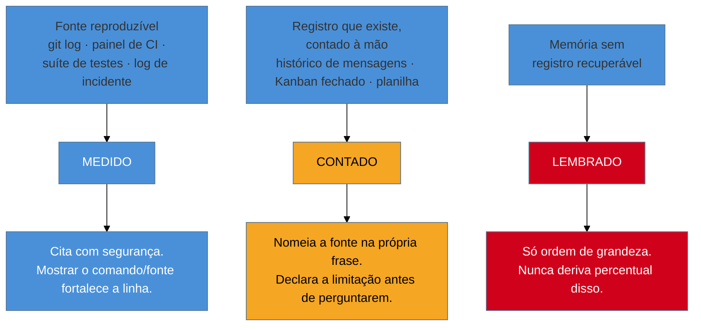

# Números que você pode defender

> [!abstract] TL;DR
> A [[03-Dominios/Carreira/Currículo/12 - XYZ, CAR e PAR — e as críticas|nota 12]] já mostrou o mecanismo: um slot de métrica obrigatório convida ao arredondamento agressivo, e é assim que o número inflado entra num currículo sem que ninguém, em nenhum momento, tenha decidido mentir. Esta nota resolve o que aquela deixou em aberto, dando ao número **um selo de procedência antes de ele virar frase**. Todo número que entra numa linha de currículo carrega um de três níveis de confiança — **medido** (extraído de uma fonte reproduzível, cita-se com segurança), **contado** (contagem manual sobre um registro que existe, precisa nomear a fonte e declarar o limite) ou **lembrado** (memória sem registro recuperável, só ordem de grandeza, nunca percentual) — e cada nível autoriza uma frase diferente. O ponto central, que quase nenhum guia de currículo do mercado ensina: **um par de números brutos é uma medição; um percentual é uma afirmação**, porque embute um cálculo sobre uma baseline — e se essa baseline foi lembrada, o percentual é falsa precisão disfarçada de rigor. A segunda metade da nota trata do que fazer depois que um número já foi publicado e descoberto como frágil: um registro separado de **números aposentados**, porque valor corrigido que não fica escrito em lugar nenhum tende a voltar a circular.

## O colchete vazio, agora com um selo de procedência

A nota 12 chamou o Y da fórmula XYZ de slot de métrica obrigatório, e mostrou por que um colchete vazio, visualmente, parece um defeito a corrigir — mesmo quando o dado real que preencheria aquele colchete nunca existiu com precisão. A nota 13, mais adiante, chamou a mesma lógica pelo nome do degrau: forçar alavancagem onde só existe realização é "a mesma mentira, com outra roupa", do arredondamento agressivo. As duas notas descrevem o sintoma do mesmo jeito, de dois ângulos diferentes, e as duas terminam apontando para esta nota como o lugar onde o problema é resolvido — não com uma regra de "nunca escreva número sem certeza absoluta", que é inaplicável na prática, mas com uma pergunta anterior à própria frase: **de onde veio este número, e o que essa origem me autoriza a escrever sobre ele?**

É essa pergunta — feita antes de qualquer verbo, antes de qualquer colchete preenchido — que separa quem escreve um currículo defensável de quem escreve um currículo que soa bem até a primeira pergunta de acompanhamento numa entrevista. Um número não é uma coisa só; é uma afirmação com uma cadeia de procedência atrás dela, e essa cadeia tem comprimentos muito diferentes dependendo de onde o número veio. Um número extraído de um comando reproduzível tem uma cadeia curta e verificável: qualquer pessoa, no mesmo repositório, rodando o mesmo comando, chega ao mesmo resultado. Um número que a pessoa lembra de "mais ou menos" tem uma cadeia que começa e termina dentro da própria cabeça de quem escreve — e é o comprimento dessa cadeia, não a grandeza do número em si, que decide o que a pessoa está autorizada a escrever.

Esta nota nomeia três comprimentos de cadeia, na ordem do mais curto e mais seguro para o mais longo e mais frágil, e trata cada um com a régua que ele merece — nem tratando todo número lembrado como mentira, nem tratando todo número medido como acima de qualquer dúvida.

## Os três níveis de confiança

### Medido: extraído de uma fonte reproduzível

Um número é **medido** quando existe um comando, um painel ou um registro que qualquer pessoa, com o acesso certo, pode rodar de novo hoje e chegar ao mesmo resultado — o histórico do git de um repositório, o painel de um pipeline de CI, a saída de uma suíte de testes, o log de um sistema de incidentes. O que define este nível não é a grandeza do número nem a confiança subjetiva de quem o escreve; é a **reprodutibilidade**: a diferença entre "eu me lembro que era assim" e "rode este comando e o resultado aparece de novo, do mesmo jeito".

Um número medido pode ser citado com segurança, no sentido específico de que ele resiste à pergunta mais dura que uma entrevista pode fazer — "como você mediu isso?" — porque a resposta a essa pergunta já existe, pronta, antes mesmo de a pergunta ser feita. E há um efeito colateral pouco intuitivo, que vale nomear com destaque porque contraria a intuição de quem acha que detalhar a medição enfraquece a frase: **mostrar como se chegou ao número fortalece a linha, em vez de enfraquecê-la**. Uma pessoa que responde "reduzi o tempo de build de doze para quatro minutos, medido comparando os últimos vinte builds antes e depois da mudança no pipeline de CI" não está se defendendo de uma acusação — está exibindo o mesmo rigor que o número em si já sugeria, e um entrevistador técnico reconhece esse rigor como sinal de julgamento, não como fragilidade que precisa de reforço. O oposto também é verdadeiro, e mais revelador: quando alguém hesita, gagueja ou muda de assunto diante da pergunta "como você mediu isso", o problema quase nunca é falta de talento de comunicação — é que o número nunca foi, de fato, medido, e a pessoa está descobrindo isso em tempo real, na frente de quem pergunta.

Vale um exemplo concreto do que "fonte reproduzível" significa, porque o termo pode soar mais técnico do que é. Um número tirado de `git log --since="..." --author="..." --oneline | wc -l` é medido, porque o comando pode ser rodado de novo. Um número tirado do painel de cobertura de testes de um pipeline de CI, com data e commit anotados, é medido pela mesma razão — assim como um número tirado de um dashboard de observabilidade, comparando latência antes e depois de uma mudança. O denominador comum não é a ferramenta; é que a fonte continua existindo depois que a pessoa parou de olhar para ela, e outra pessoa, com o acesso certo, poderia chegar ao mesmo número de novo.

### Contado: contagem manual sobre um registro que existe

Um número é **contado** quando não existe um comando pronto que produza o resultado sozinho, mas existe um **registro** sobre o qual alguém, com paciência, contou manualmente — um histórico de mensagens revisado linha por linha, uma lista de tarefas fechadas num quadro Kanban, uma planilha mantida à mão ao longo de um projeto, os tickets de um sistema de suporte filtrados e contados um a um. A diferença entre este nível e o medido não é a confiabilidade do número final — uma contagem manual cuidadosa pode ser tão exata quanto uma consulta automatizada — mas o **processo** pelo qual ele chegou até ali: alguém precisou olhar, um por um, e decidir o que entrava e o que não entrava na contagem.

É exatamente esse processo manual que exige um cuidado extra na hora de escrever a frase, e é aqui que a maioria dos currículos falha por omissão, não por má-fé: um número contado precisa **nomear a fonte na própria frase**, e não só na cabeça de quem escreveu. "Revisei manualmente as 47 issues fechadas no repositório entre janeiro e março, filtrando pelo rótulo de bug" já carrega, dentro da frase, a resposta para a pergunta que ainda não foi feita — de onde veio esse número, e que critério decidiu o que contava. Comparado a "corrigi 47 bugs no trimestre", a diferença de comprimento é pequena, mas a diferença de defensabilidade é enorme: a segunda frase soa como um número que caiu do céu, e obriga quem escreveu a improvisar, na hora, uma explicação que deveria ter sido decidida com calma, na frente do próprio teclado, semanas antes da entrevista.

A segunda exigência deste nível é declarar a limitação **antes de perguntarem**, não depois. Toda contagem manual carrega algum grau de imprecisão — um critério de inclusão que mudou de ideia no meio do caminho, uma issue fechada duas vezes por engano e contada como duas, um período que começou num dia arbitrário porque foi quando a pessoa lembrou de começar a contar. Nenhuma dessas imprecisões invalida o número; o que invalida a credibilidade de quem escreveu é deixar essa imprecisão para o entrevistador descobrir sozinho, como se fosse armadilha escondida em vez de limitação honesta. "Contei manualmente as issues com o rótulo de bug fechadas nesse período — é possível que uma ou duas tenham escapado do filtro, mas o número é próximo o suficiente" é uma frase que qualquer entrevistador aceita sem hesitar, porque ela já fez, em voz alta, o trabalho de autocrítica que o entrevistador teria feito de qualquer forma — só que antes, o que muda o tom da conversa que se segue.

### Lembrado: memória sem registro recuperável

Um número é **lembrado** quando não existe registro nenhum a que se possa voltar — nem comando, nem planilha, nem histórico de mensagens — e o que resta é a impressão que ficou na memória de quem viveu o evento. É o nível mais frágil dos três, não porque a memória seja necessariamente errada, mas porque ela é **irrecuperável**: não há como voltar e checar, e uma memória, diferente de um registro, tem o hábito conhecido de se ajustar sozinha com o tempo, ficando mais limpa e mais redonda a cada vez que é recontada.

A regra para este nível é curta e não admite exceção: **um número lembrado só autoriza ordem de grandeza, nunca percentual derivado dele**. "O processo de deploy demorava bastante, algo entre uma hora e uma hora e meia, e hoje leva poucos minutos" é uma frase honesta, porque ela declara, na própria linguagem, que o número é aproximado — "algo entre", "poucos minutos" — sem fingir uma precisão que a memória não sustenta. "Reduzi o tempo de deploy em 93%" é a mesma memória, com a mesma imprecisão por baixo, mas maquiada com um número de duas casas decimais que promete exatamente o oposto do que a fonte real entrega. É essa diferença — entre admitir a aproximação na própria frase e escondê-la atrás de um número redondo — que a próxima seção desta nota trata como o mecanismo central de toda a falsa precisão que entra em currículo sem ninguém decidir mentir.

Vale nomear, aqui, um erro comum e compreensível: tratar "lembrado" como sinônimo de "inútil" ou "não deveria aparecer no currículo". Não é essa a lição. A [[03-Dominios/Carreira/Currículo/15 - Quando não há número|nota 15]], mais adiante no galho, trata em profundidade do que fazer quando nem sequer a ordem de grandeza está disponível — e mesmo um número puramente lembrado, desde que apresentado como o que é, continua sendo informação real e útil para o leitor. O problema nunca foi lembrar; foi disfarçar uma lembrança de medição, emprestando dela uma precisão que ela nunca teve.

O diagrama fixa a regra que as três seções acima descreveram em prosa: o comprimento da cadeia entre o fato e a fonte decide o nível, e o nível decide o que a frase final tem autorização para dizer. Não existe atalho de um nível mais frágil para um mais forte — só existe a decisão honesta de qual dos três, hoje, descreve de verdade a origem do número que está prestes a virar uma linha de currículo.

## Par de números vale mais que percentual

Chega-se agora ao ponto que dá título a esta seção, e que é, provavelmente, o argumento mais original do galho inteiro — nenhum guia de mercado sobre currículo o desenvolve com este grau de detalhe, porque a maioria trata o percentual como o formato de número mais forte que existe, sem parar para examinar o que um percentual, estruturalmente, exige para ser verdadeiro.

Um **par de números brutos** — "de aproximadamente uma hora para aproximadamente três minutos", "de 40 para 4 incidentes por trimestre", "de 12 segundos para 900 milissegundos" — é, por construção, uma **medição**. Ele descreve dois pontos no tempo, cada um com seu próprio valor, e não exige nenhum cálculo adicional para existir: a pessoa observou o estado antes, observou o estado depois, e escreveu os dois números lado a lado. Mesmo quando um dos dois pontos vem de uma memória imprecisa — "demorava cerca de uma hora" —, a imprecisão fica visível na própria frase, porque o par preserva os dois valores originais, sem escondê-los atrás de uma única cifra derivada.

Um **percentual**, em contraste, não é uma medição — é uma **afirmação**, porque ele embute, dentro de si, um cálculo que já aconteceu e que o leitor não vê: (antes − depois) ÷ antes. Esse cálculo não é neutro; ele depende inteiramente da qualidade do número que entrou como "antes", e é exatamente aí que o problema nasce. Se a baseline — o "antes" — foi medida com precisão, o percentual derivado dela também carrega essa precisão, e não há nada de errado em escrevê-lo: "reduzi o tempo de build de 812 para 94 segundos, uma queda de 88%" é tão defensável quanto o par que o originou, porque os dois números de origem são igualmente sólidos. Mas se a baseline foi **lembrada** — "demorava cerca de uma hora" —, o percentual calculado sobre ela herda, por definição, exatamente a mesma imprecisão da memória que a originou, só que agora **disfarçada** atrás de duas casas decimais que parecem ter vindo de um instrumento de medição, não de uma impressão vaga guardada há meses ou anos.

É esse o mecanismo exato da **falsa precisão**: um número com aparência de rigor matemático — 87%, 93%, 41,2% — que na verdade descreve um cálculo feito sobre uma entrada que ninguém mediu. O percentual **parece** mais rigoroso do que o par que o originou, porque uma casa decimal comunica, visualmente, o tipo de exatidão que só um instrumento produziria — e é exatamente por isso que ele é, na prática, **menos** rigoroso: o rigor aparente da forma esconde a fragilidade real do conteúdo. Um par de números lembrados, escrito como par, é honesto sobre os próprios limites; o mesmo par, convertido em percentual, finge um rigor que a fonte nunca teve.

> [!example] Caso fictício
> Rafael Duarte, desenvolvedor pleno já apresentado em notas anteriores deste galho, revisa a própria linha de currículo sobre um processo de deploy que ele ajudou a automatizar há cerca de um ano. Ele não guarda nenhum registro do tempo exato de antes — não tirou print do pipeline antigo, não anotou a duração em nenhuma planilha —, mas lembra, com razoável confiança, que o processo "demorava perto de uma hora, às vezes um pouco mais" e que hoje "sai em uns três, quatro minutos, no máximo". A primeira versão que ele escreve é "reduzi o tempo de deploy em 95%, automatizando o pipeline de CI/CD" — um número que soa forte, específico e impressionante. Ao reler esta nota, Rafael percebe o que fez: pegou duas lembranças aproximadas, calculou uma divisão entre elas e escreveu o resultado como se fosse um dado medido. Ele reescreve a linha preservando o par, não o percentual: "reduzi o tempo de deploy de cerca de uma hora para poucos minutos, automatizando o pipeline de CI/CD." A frase perde a precisão artificial das duas casas decimais, mas ganha uma coisa mais valiosa — ela resiste, sem hesitação, à pergunta "de onde veio esse número?", porque não promete uma exatidão que a memória de Rafael nunca teve.

## Como a falsa precisão nasce sem ninguém decidir mentir

Vale nomear, com todas as letras, o que o exemplo de Rafael Duarte acabou de ilustrar, porque é o ponto mais importante desta nota inteira e o que mais separa o galho do resto do que o mercado publica sobre o assunto: **ninguém, ao escrever "reduzi em 87%", senta e decide mentir**. O caminho até o número inflado é gradual, quase invisível, e cada passo dele parece, isoladamente, razoável.

A pessoa lembra que o processo "demorava umas duas horas" — uma lembrança honesta, sem registro, mas plausível. Lembra também que "agora dá uns quinze minutos" — outra lembrança igualmente honesta. As duas lembranças, sozinhas, já seriam material suficiente para uma linha forte e defensável, escritas como par. Mas a pessoa, revisando o próprio currículo, sente — do mesmo jeito que a nota 12 já descreveu para o colchete vazio da fórmula XYZ — que "ficaria melhor" com um número único e impressionante, e faz a conta: (120 − 15) ÷ 120 = 87,5%, arredondado para 87%. A conta em si está matematicamente correta; o problema nunca foi a aritmética. O problema é que a divisão transformou duas aproximações honestas — "umas duas horas", "uns quinze minutos" — num número com duas casas de precisão, como se aquelas duas casas tivessem vindo de algum lugar que de fato as mediu.

Ninguém, nesse processo inteiro, teve a intenção de enganar. A pessoa lembrava de verdade dos dois números aproximados; a divisão foi feita com honestidade; o resultado até é próximo do que aconteceu na realidade, na maioria dos casos. O que quebra não é a intenção — é a **transferência de precisão**: o percentual herda uma exatidão visual que nenhuma das duas entradas possuía, e quem escreve a frase raramente para para perceber essa transferência, porque ela acontece dentro de uma calculadora, num segundo, sem sinal de alerta. É só na entrevista, meses depois, quando alguém pergunta com curiosidade genuína "como você mediu esses 87%?", que a fragilidade aparece — e aparece, quase sempre, como silêncio. Não porque a pessoa esteja mentindo diante da pergunta, mas porque ela nunca teve, de fato, uma resposta pronta — só a lembrança vaga que gerou o número, esquecida sob duas casas decimais que pareciam falar por si.

É por isso que a regra desta nota não é "nunca use percentual" — percentual calculado sobre uma baseline medida ou contada é tão legítimo quanto o par que o origina, e às vezes até mais legível para quem lê rápido. A regra é mais estreita e mais precisa: **a precisão do resultado nunca pode ser maior do que a precisão da entrada mais fraca que o compõe**. Um percentual só tem o direito de existir quando os dois números que o alimentam já teriam, sozinhos, o direito de aparecer com a mesma confiança no currículo. Quando um dos dois não tem esse direito — porque é lembrado, não medido nem contado —, a solução nunca é calcular em cima dele; é escrever o par, com a aproximação exposta em vez de escondida.

## Números aposentados

Há uma segunda peça deste sistema que quase nenhum currículo mantém, e que se torna necessária no momento em que um número já publicado é descoberto como frágil, corrigido, ou simplesmente superestimado por um erro de conta que ninguém notou a tempo. O problema não é só corrigir o número na versão atual do documento — é impedir que a versão antiga, já corrigida uma vez, **volte a circular** meses depois, porque ela ainda existe em algum rascunho antigo, numa versão de LinkedIn desatualizada, numa cópia enviada a um recrutador há dois anos que a pessoa reabre por comodidade em vez de partir da versão mais recente.

É esse risco específico — o de um valor morto ressuscitar por acidente — que exige um registro de **números aposentados**: uma lista separada, mantida à parte do documento principal, de valores que já foram usados no passado e que, por qualquer motivo, não devem mais aparecer em nenhuma versão futura do currículo. A razão de esse registro precisar existir **separado**, e não só como uma correção silenciosa no documento atual, é estrutural: sem um lugar que declare explicitamente "este número está morto, não use", não existe nenhum mecanismo que impeça a versão antiga de voltar. Um documento corrigido só impede o erro de se repetir enquanto for a única fonte que a pessoa consulta — e ninguém, ao longo de uma carreira de vários anos e várias versões de currículo, consulta só a fonte mais recente o tempo todo.

Vale nomear também por que este registro é, dos poucos elementos deste sistema de evidência, o único que **não deriva de nenhum outro**. O brag document — que a [[03-Dominios/Carreira/Currículo/21 - O brag document|nota 21]], mais adiante no galho, trata em profundidade — deriva da prática contínua de anotar realizações. O inventário de evidência deriva das portas de entrada percorridas. O currículo em si deriva da âncora. O registro de números aposentados não deriva de nada disso: ele nasce, especificamente, do **momento em que um número é descoberto como errado ou frágil demais para continuar circulando**, e sua função inteira é registrar esse momento, para que ele não precise ser redescoberto da próxima vez que a versão antiga aparecer.

> [!example] Caso fictício
> Bianca Torres, desenvolvedora backend pleno já apresentada em notas anteriores deste galho, mantinha havia dois anos a linha "otimizei consultas do módulo de relatórios, reduzindo o tempo de resposta em 70%" — um número que ela tinha calculado, na época, dividindo duas medições reais tiradas do painel de observabilidade da empresa. Meses depois, revisando o pipeline antigo com mais cuidado, ela percebe que o "antes" usado no cálculo original vinha de um dia atípico, com carga de tráfego anormalmente alta, e que a redução real, medida contra um dia comum, era mais perto de 45%. Bianca corrige o currículo atual sem hesitar — mas percebe, ao revisar uma cópia enviada a um recrutador seis meses antes, que a versão antiga com 70% ainda circula fora do controle dela. Sem um registro de números aposentados, ela teria só a memória de "acho que já corrigi isso" para confiar; com o registro, ela escreve, num arquivo separado, "70% de redução no módulo de relatórios — DESCARTADO, baseline de dia atípico; valor correto é ~45%, ver commit de correção", e passa a checar essa lista, de propósito, toda vez que reabre uma cópia antiga do documento antes de reenviá-la.

## Casos práticos

Os dois casos abaixo saem da ficção do galho e vão direto à fonte: são a auditoria e o levantamento que, na prática, obrigaram o autor deste vault a construir o próprio sistema que esta nota descreve.

> [!example] Caso real
> O autor deste vault mantém um pipeline público de geração de currículo, tratado em profundidade na [[03-Dominios/Carreira/Currículo/22 - O currículo como pipeline|nota 22]] mais adiante no galho, no qual uma verificação automatizada **aborta a geração do documento** sempre que um número já aposentado é encontrado no texto que está prestes a virar um PDF ou uma variante enviada a uma vaga. Esse mecanismo nasceu de uma auditoria anterior que encontrou **o mesmo fato profissional descrito em seis redações divergentes, espalhadas por dezessete arquivos diferentes** — versões antigas de currículo, rascunhos de bullets, anotações soltas — cada uma com um número ligeiramente diferente para a mesma realização, sem que nenhuma das seis estivesse marcada como a versão correta ou como a versão morta. O princípio que a correção desse achado deixou fixado é curto e vale mais do que a implementação técnica em si: **uma guarda que falha em silêncio não é uma guarda**. Em algum momento da manutenção desse pipeline, a verificação de números aposentados podia se desligar sozinha, sem aviso nenhum, quando uma dependência externa da qual ela precisava não estava disponível — o script simplesmente deixava de rodar, e o documento era gerado normalmente, como se a checagem tivesse passado. Isso foi tratado, deliberadamente, como um defeito a corrigir com a mesma prioridade de um bug funcional, não como um detalhe de operação sem importância: uma guarda que desiste em silêncio, na ausência de uma dependência, dá exatamente a mesma falsa sensação de segurança que um número de falsa precisão dá a quem lê o currículo — parece que a checagem aconteceu, mas não aconteceu, e ninguém percebe até o momento em que o dano já está feito. (Fonte da trajetória: [josenaldo.com.br/experiences](https://josenaldo.com.br/experiences), verificado ao vivo em 2026-08-20.)

> [!example] Caso real
> O autor deste vault descrevia, por um tempo, o próprio escopo de atuação profissional como "três codebases" — um número que soava razoável, fácil de lembrar, e que nunca tinha sido checado contra nenhuma fonte concreta desde a primeira vez em que foi escrito. Um levantamento direto na fonte, feito antes de essa frase entrar em qualquer variante nova do currículo, mostrou que o número real era **dez repositórios** — mais do que o triplo do número que vinha sendo repetido de memória havia tempo suficiente para parecer verdade só por repetição. O mesmo levantamento revelou uma segunda armadilha, mais sutil do que a primeira: contar diretórios de primeiro nível sob a raiz do espaço de trabalho, do jeito mais óbvio e mais rápido de chegar a um número, inflaria a contagem em cerca de 90%, porque nem todo diretório sob a raiz corresponde a um repositório de código; alguns são configuração, documentação, ou artefatos que não fazem parte da contagem que a frase pretendia descrever. A lição que este caso deixa, e que a seção seguinte desta nota generaliza, é direta: **o dado difícil se confere antes de virar frase, não depois de alguém perguntar**. Se o levantamento tivesse acontecido só depois de uma pergunta de entrevista — "quantos repositórios, exatamente?" —, a resposta teria vindo sob pressão, com o risco real de repetir o número de memória ("acho que eram uns três") ou de errar na direção oposta, contando diretórios demais e inflando um número que já não precisava de ajuda para impressionar. (Fonte da trajetória: [josenaldo.com.br/experiences](https://josenaldo.com.br/experiences), verificado ao vivo em 2026-08-20.)

## A armadilha de citação: a fonte aparente e a fonte real

Vale fechar esta nota com uma generalização que nasceu, de forma bem literal, durante a construção deste mesmo galho — porque ela mostra que o problema descrito aqui não é exclusivo de números de desempenho de sistema; é um problema mais amplo de **procedência**, que vale tanto para o dado que entra numa linha de currículo quanto para a citação que sustenta um argumento acadêmico.

A primeira falha aconteceu na hora de citar um artigo usado como fonte em outra nota deste mesmo galho. O endereço da página tinha, no próprio slug da URL, a palavra "better" — "my-personal-formula-for-a-better-resume" —, enquanto o título de fato exibido na página, o que qualquer leitor vê ao abrir o link, era "My Personal Formula for a Winning Resume". Quem cita a partir do endereço, sem abrir a página, erra o título; quem abre a página antes de escrever a citação, acerta. É um erro pequeno, quase cosmético, mas ele expõe um hábito perigoso: tratar a URL como se fosse, ela mesma, a fonte, quando a URL é só um endereço — a fonte de verdade é o conteúdo que existe atrás dele, e os dois nem sempre concordam.

A segunda falha, mais séria, aconteceu com números de um estudo acadêmico usados como referência de pesquisa neste mesmo galho.

> [!example] Caso real
> Os números do estudo de Kyra Wilson e Aylin Caliskan, *"Gender, Race, and Intersectional Bias in Resume Screening via Language Model Retrieval"* (AAAI/ACM AIES 2024), entraram na spec deste galho transcritos de um **relatório de pesquisa intermediário**, não do documento original. Só apareceu porque um revisor estranhou um número sem lastro e foi checar o abstract — e a checagem encontrou que **três dos quatro números transcritos estavam errados**. "550+ currículos" virou, no abstract, "mais de 500 currículos **e** mais de 500 descrições de vaga" — um cruzamento, não uma contagem simples. "85%" era, no original, **85,1%** de favorecimento a nomes associados a pessoas brancas. "Nomes masculinos em 52%" **não existe em lugar nenhum do paper** — foi uma invenção pura, aceita sem checagem porque veio de um intermediário que parecia confiável; o eixo de gênero que o estudo de fato reporta vai no sentido oposto, "nomes associados a mulheres em apenas **11,1%** dos casos". E "homens negros: a categoria mais penalizada" **amaciou** o achado mais duro do estudo, que é bem mais forte: "homens negros são desfavorecidos em **até 100% dos casos**". Vale notar a direção desse último erro, porque contraria a intuição — a expectativa é que erro de transcrição infle o dado; este desinflou o achado que mais precisava chegar intacto. A correção teve que acontecer primeiro na spec, a fonte única de onde os números se propagam para as notas — corrigir só o texto derivado teria deixado o erro vivo exatamente no lugar de onde ele voltaria a se espalhar, o mesmo princípio de fonte única que a [[03-Dominios/Carreira/Currículo/22 - O currículo como pipeline|nota 22]] trata em profundidade. (Fonte primária: Wilson, K. & Caliskan, A., [arxiv.org/abs/2407.20371](https://arxiv.org/abs/2407.20371), AAAI/ACM AIES 2024.)

As duas falhas, olhadas juntas, generalizam para uma regra única que vale tanto para a citação acadêmica quanto para o número do próprio currículo: **a fonte aparente e a fonte real divergem, e a diferença só aparece se alguém abrir**. O slug de uma URL não é o título da página. Um relatório intermediário não é o documento original. Uma lembrança de "umas duas horas" não é um registro de tempo medido. Em todos os três casos, existe uma versão do dado conveniente de citar — mais à mão, mais rápida de acessar, a primeira que vem à memória — e existe uma versão verdadeira, e as duas só coincidem quando alguém se dá ao trabalho de checar. É essa disciplina — abrir a página, ler o documento original, contar o registro em vez de confiar na lembrança — que atravessa cada seção anterior desta nota: todas são, no fim, formas diferentes da mesma pergunta — *isso que estou prestes a escrever é o que eu acho que é, ou é o que eu checei que é?*

## Variação por nível

A [[03-Dominios/Carreira/Currículo/03 - Os seis níveis e o que muda entre eles|nota 03]] já fixou o vocabulário de nível que esta seção reusa sem repetir a justificativa inteira, e o eixo de confiança de número acompanha, quase ponto a ponto, o eixo de senioridade que aquela nota descreveu para o resto do documento.

No começo da escada — **estagiário** e **trainee** —, o currículo tem poucos números, e quase todos eles são, honestamente, **contados** ou **lembrados**: quantas semanas um projeto de faculdade levou, quantas issues pequenas foram resolvidas num período de contribuição a um repositório aberto, quantas vezes um processo foi repetido durante um curso. Não há vergonha nisso — como a nota 03 já registrou, o leitor desses dois níveis avalia disciplina e potencial, não resultado de negócio medido, e um número contado com honestidade já cumpre esse papel sem fingir o rigor de um painel de CI que ainda não existiu na trajetória da pessoa.

No **júnior** e no **pleno**, os primeiros números medidos começam a aparecer, ao lado de contagens manuais ainda frequentes — e é justamente nesse período de transição que o risco de falsa precisão é mais alto, porque a pessoa já tem números reais o bastante para querer impressionar com eles, mas ainda não desenvolveu o hábito de registrar a origem de cada um no momento em que o vive, e recorre à memória meses depois para reconstituir o que deveria ter sido anotado na hora. É o período em que o hábito descrito pela [[03-Dominios/Carreira/Currículo/21 - O brag document|nota 21]] — anotar perto do momento em que a realização acontece, não na véspera de atualizar o currículo — rende o maior retorno relativo, porque é quando a tentação de arredondar é mais forte.

No **sênior** e, mais ainda, no **staff**, a exigência muda de natureza: não basta que os números sejam majoritariamente medidos — a pessoa precisa **saber a metodologia de cada um**, de cor, sem consultar nada, porque o leitor desse nível — a [[03-Dominios/Carreira/Currículo/03 - Os seis níveis e o que muda entre eles|nota 03]] já o descreveu como alguém que avalia decisão de arquitetura e influência organizacional, não execução — costuma perguntar "como você mediu isso" com mais frequência do que um leitor júnior, esperando que quem decide em escala também justifique, em detalhe, o dado que sustentou a decisão. Um staff engineer que hesita nessa pergunta comunica um desalinhamento maior do que o mesmo tropeço comunicaria vindo de um júnior — o nível staff pressupõe esse rigor como parte do próprio cargo.

## Armadilhas comuns

> [!warning] Confundir "eu me lembro bem" com "eu medi"
> **O que acontece:** a pessoa tem tanta confiança na própria lembrança — porque o evento foi marcante, porque aconteceu recentemente, porque foi repetido várias vezes na cabeça — que trata essa confiança subjetiva como se fosse equivalente a um registro reproduzível, e escreve o número lembrado com a mesma segurança de um número medido. **Por quê:** confiança e precisão são coisas diferentes, mas parecem a mesma coisa por dentro da própria cabeça de quem lembra — uma lembrança vívida não é, por isso, mais exata do que uma lembrança vaga. **Como evitar:** aplicar o teste desta nota antes de escrever qualquer número: existe um comando, um painel ou um registro ao qual eu poderia voltar hoje para confirmar isso? Se a resposta é não, o número é lembrado, por mais nítida que a memória pareça, e a frase precisa admitir isso.

> [!warning] Achar que declarar a limitação enfraquece a frase
> **O que acontece:** ao escrever um número contado, a pessoa evita mencionar a fonte ou o critério da contagem, achando que isso deixaria a linha mais longa, mais hesitante, ou menos impressionante do que um número seco e sem contexto. **Por quê:** o instinto de escrever currículo puxa para a concisão, e nomear a fonte parece, à primeira vista, um desperdício de espaço que poderia ser usado para outra coisa. **Como evitar:** lembrar que a alternativa não é "número seco versus número com contexto" — é "número seco que quebra na entrevista versus número com contexto que resiste a ela". Nomear a fonte na própria frase não é defesa contra uma acusação; é a mesma prática de rigor que um número medido já exibe, aplicada ao nível de confiança que a contagem manual de fato permite.

> [!warning] Corrigir o currículo atual e esquecer as versões antigas
> **O que acontece:** ao descobrir que um número estava errado ou inflado, a pessoa corrige a versão mais recente do documento e considera o problema resolvido, sem registrar em nenhum lugar separado que aquele valor antigo está morto. **Por quê:** a correção do documento principal parece, no momento, suficiente — o erro foi consertado, o currículo atual está certo. **Como evitar:** manter, à parte, o registro de números aposentados descrito nesta nota, porque o risco nunca esteve no documento mais recente — esteve nas cópias antigas, nos rascunhos esquecidos e nas versões enviadas há meses que continuam existindo fora do controle direto de quem escreveu, prontas para voltar a circular na próxima vez que alguém as reabrir por comodidade.

## Como soa em inglês

> "I try to know exactly what kind of confidence sits behind every number on my resume, because not every number deserves the same level of certainty in how I state it. If it comes from something reproducible — a git log, a CI dashboard, a test suite — I'll cite it plainly, and I'm happy to walk through exactly how I measured it, because showing the methodology makes the line stronger, not weaker. If it's a manual count over a record that exists — messages, a closed ticket list, a spreadsheet I kept — I name the source in the same sentence and I state the limitation up front, before anyone has to ask. And if it's just memory, with no record to go back to, I only give an order of magnitude — I never turn a remembered baseline into a precise percentage, because a percentage calculated from a guess is not more rigorous than the guess itself, it just looks that way."

| PT | EN |
| --- | --- |
| medido | measured |
| contado | counted |
| lembrado | remembered |
| fonte reproduzível | reproducible source |
| ordem de grandeza | order of magnitude |
| falsa precisão | false precision |
| baseline lembrada | remembered baseline |
| par de números | raw pair of numbers |
| percentual derivado | derived percentage |
| números aposentados | retired numbers |
| guarda automatizada | automated guard |

## O que vem a seguir

Fixado o selo de procedência que decide o que um número autoriza escrever, o galho segue para a nota que trata do caso em que nem sequer a lembrança está disponível — e para a nota, mais adiante em Magus, onde este mesmo registro de números aposentados vira parte formal de um sistema maior:

- [[03-Dominios/Carreira/Currículo/15 - Quando não há número|15 - Quando não há número]] — proxies de segunda ordem, consequência, escopo e frequência, para quando nem a ordem de grandeza está disponível.
- [[03-Dominios/Carreira/Currículo/21 - O brag document|21 - O brag document]] — o hábito de registrar a realização perto do momento em que ela acontece, que evita boa parte do problema desta nota antes mesmo de ele nascer.
- [[03-Dominios/Carreira/Currículo/22 - O currículo como pipeline|22 - O currículo como pipeline]] — a guarda automatizada que aborta a geração do documento quando um número aposentado tenta voltar a circular.

## Veja também

- [[03-Dominios/Carreira/Currículo/index|Currículo]] — o índice do galho, com a tese e o mapa das 26 notas.
- [[03-Dominios/Carreira/Currículo/12 - XYZ, CAR e PAR — e as críticas|12 - XYZ, CAR e PAR — e as críticas]] — o slot de métrica que convida ao arredondamento agressivo, cujo mecanismo esta nota nomeia em detalhe.
- [[03-Dominios/Carreira/Currículo/13 - Responsabilidade, realização e alavancagem|13 - Responsabilidade, realização e alavancagem]] — a escada de escopo, e a ressalva de que nem todo fato tem o terceiro degrau, que aqui reaparece como "nem todo número tem o nível medido".
- [[03-Dominios/Carreira/Currículo/04 - Quem lê o seu currículo — e o que a evidência diz|04 - Quem lê o seu currículo — e o que a evidência diz]] — o gate factual do galho, cuja disciplina de "medido / plausível não medido / caixa-preta" inspira os três níveis desta nota.
- [[03-Dominios/Carreira/Currículo/09 - Habilidades técnicas|09 - Habilidades técnicas]] — a regra de lastro, aplicada ali a competência declarada e aqui a número declarado.
- [[03-Dominios/Carreira/Entrevistas/06 - STAR e suas variantes|Entrevistas/06 - STAR e suas variantes]] — o galho parceiro: é no *Result* da resposta falada, mais do que na linha escrita, que a pergunta "como você mediu isso?" costuma aparecer, e é para essa pergunta que os três níveis de confiança desta nota preparam quem responde.

## Fontes

- **Josenaldo Matos** — [josenaldo.com.br/experiences](https://josenaldo.com.br/experiences), página pública de experiências profissionais, verificada ao vivo em 2026-08-20. Fonte da trajetória citada nos dois casos reais desta nota — a guarda automatizada contra números aposentados e o levantamento que corrigiu "três codebases" para dez repositórios.
- **Kyra Wilson e Aylin Caliskan** — *"Gender, Race, and Intersectional Bias in Resume Screening via Language Model Retrieval"*, AAAI/ACM AIES 2024, [arxiv.org/abs/2407.20371](https://arxiv.org/abs/2407.20371). Fonte primária do caso real sobre os números transcritos errado a partir de um relatório intermediário, na seção sobre a armadilha de citação; os quatro valores citados (mais de 500 currículos e mais de 500 descrições de vaga, 85,1%, 11,1%, até 100%) vêm diretamente do abstract do paper.
- Esta nota não localizou, nem buscou, nenhum estudo quantitativo externo sobre a taxa de números inflados em currículos de tecnologia; o argumento é análise estrutural do mecanismo de cálculo de percentual sobre baseline incerta, apoiado no gate factual já sourced pela [[03-Dominios/Carreira/Currículo/04 - Quem lê o seu currículo — e o que a evidência diz|nota 04]] e reusado aqui sem repetir a pesquisa original.
- **Laszlo Bock** — [My Personal Formula for a Winning Resume](https://www.linkedin.com/pulse/20140929001534-24454816-my-personal-formula-for-a-better-resume), LinkedIn, 29 de setembro de 2014, já citado na [[03-Dominios/Carreira/Currículo/12 - XYZ, CAR e PAR — e as críticas|nota 12]]. Reusado aqui apenas como exemplo verificável de divergência entre o slug da URL ("better") e o título real da página ("Winning"), na seção sobre a armadilha de citação.
