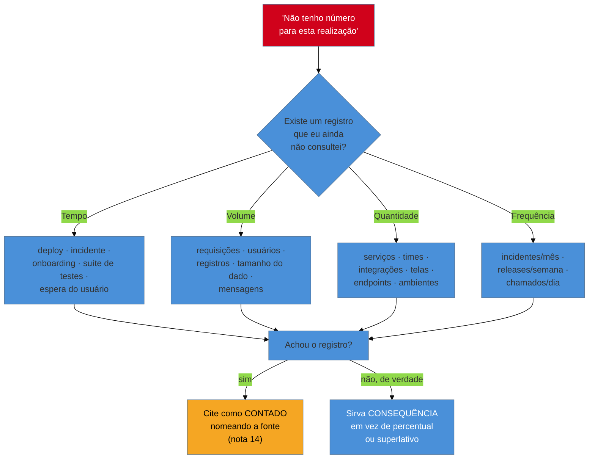

# Quando não há número

> [!abstract] TL;DR
> A [[03-Dominios/Carreira/Currículo/14 - Números que você pode defender|nota 14]] já ensinou a defender o número que existe — medido, contado ou lembrado, cada um com a frase que autoriza. Esta nota trata do caso oposto, mais comum do que parece e quase nunca ensinado com honestidade: **o que fazer quando o número, de fato, não existe**. A primeira metade responde a uma pergunta anterior a qualquer decisão de escrita — a maioria de quem conclui "não tenho número" desistiu cedo demais, porque não olhou para quatro famílias de grandeza que quase sempre deixam rastro em algum registro que já existe: **tempo**, **volume**, **quantidade** e **frequência**. Um número achado assim costuma nascer **contado**, não medido, e precisa ser citado como tal, na régua que a nota 14 já fixou. A segunda metade trata do que fazer quando a busca genuinamente não encontra nada: servir **consequência** — o que passou a ser possível depois, ou o que deixou de acontecer — em vez de inflar um percentual ou recorrer a um superlativo vago, que esta nota trata como pior do que dizer nada. O fio que atravessa a nota inteira é uma assimetria que quase nenhum guia de currículo nomeia: todo outro defeito de currículo custa, no pior caso, a entrevista; inventar um número é o único erro capaz de custar o emprego **depois** de ele já ter sido conquistado.

## O erro que custa o emprego, não a entrevista

Vale abrir com a peça que dá título a esta nota e que justifica o cuidado dela, porque sem essa peça o resto do texto soa como perfeccionismo estilístico em vez do que de fato é: uma questão de risco, com uma assimetria de consequência que nenhum outro erro deste galho carrega. Um verbo fraco, um formato ilegível para máquina, um sumário genérico, uma lacuna de carreira mal declarada — cada um desses defeitos, tratados em notas anteriores deste galho, tem um teto de dano bem definido: no pior caso, o currículo não gera a conversa, o leitor passa para o próximo candidato, e a pessoa nunca fica sabendo, com certeza, se foi aquele defeito específico que fechou a porta. O dano acontece antes da entrevista, é silencioso, e — por mais frustrante que seja — se esgota ali. Ninguém perde um emprego já conquistado por causa de um sumário raso.

Um número inventado não segue essa mesma curva de risco. Ele pode passar pela triagem automatizada sem levantar bandeira nenhuma, pode soar bem numa primeira leitura humana, pode até sobreviver a uma entrevista inteira sem que ninguém pergunte "como você mediu isso" — a [[03-Dominios/Carreira/Currículo/14 - Números que você pode defender|nota 14]] já mostrou que esse tipo de pergunta de acompanhamento não é garantido, é só provável o suficiente para valer a pena se preparar para ela. O que muda tudo é o que acontece depois de a pessoa já ter sido contratada: um colega puxa o histórico real de um projeto que a pessoa citou no currículo e nota a divergência; um gestor revisa dados antigos de uma equipe e encontra o número original, bem menor do que o que constava na entrevista; a própria pessoa é perguntada com curiosidade genuína sobre "aquele resultado incrível" do currículo, e descobre, ao vivo, que nunca teve uma resposta pronta para dar. Nesse ponto, o dano já não é "não fui chamado para conversar" — é uma pergunta sobre confiança, feita a alguém que já está dentro da organização, com um histórico que passa a ser lido com um filtro de dúvida que não existia antes.

É essa diferença de momento — antes da porta se abrir, ou depois de já ter atravessado ela — que torna o número inventado qualitativamente diferente de qualquer outro defeito deste galho, e é por isso que esta nota existe como um capítulo à parte, e não como uma seção a mais dentro da nota 14. A nota 14 tratou da procedência do número que já existe; esta nota trata da tentação de fabricar um número que nunca existiu, e o argumento central dela não é "seja honesto por princípio" — é mais estreito e mais prático: **a matemática de risco de inventar um número é diferente da matemática de risco de qualquer outra fraqueza de currículo**, porque o preço, quando cobrado, não é pago na fila de candidatos — é pago dentro do próprio emprego que a mentira ajudou a conseguir.

Dito isso, o resto desta nota nomeia dois caminhos legítimos para quem, diante de uma realização real sem número à mão, sente exatamente a mesma pressão que a [[03-Dominios/Carreira/Currículo/12 - XYZ, CAR e PAR — e as críticas|nota 12]] já descreveu como o colchete vazio de uma fórmula pedindo para ser preenchido a qualquer custo. O primeiro caminho — a maior parte desta nota — é procurar melhor, porque a maioria de quem conclui "não tenho número" está errada sobre isso. O segundo caminho, para quando a busca genuinamente não encontra nada, é escrever a consequência com a mesma honestidade e a mesma especificidade que um número exigiria, sem fingir a precisão que ele teria.

## Onde procurar antes de desistir

Esta é a parte mais útil da nota, e também a mais negligenciada por quem escreve currículo sob pressão de prazo. A conclusão "essa realização não tem número" costuma chegar rápido demais — depois de um segundo, talvez dois, de reflexão sobre um percentual óbvio que não vem à mente — e raramente é seguida de uma busca de verdade em algum lugar que já guarda o dado. Existem quatro famílias de grandeza que, na prática, quase sempre têm algum rastro disponível em registros que já existem, mesmo quando ninguém, no momento em que o trabalho aconteceu, estava pensando em currículo. Vale percorrer as quatro com calma, porque cada uma pede um lugar diferente para procurar, e a disciplina de perguntar "onde isso ficaria registrado, mesmo que por acidente?" é, sozinha, o hábito que separa quem escreve "não tenho número" de quem escreve uma linha defensável.

### Tempo

A primeira família é o tempo que algo levava, e depois passou a levar. É a grandeza mais citada nos exemplos deste galho — a nota 14 já tratou, em profundidade, do tempo de deploy e do tempo de resposta a incidente como os dois casos mais comuns — mas a família é maior do que esses dois exemplos: o tempo de onboarding de alguém novo no time, o tempo de execução de uma suíte de testes, o tempo de espera de um usuário até uma página carregar, o tempo entre abrir um chamado de suporte e recebê-lo resolvido. Cada um desses tempos costuma deixar rastro em algum lugar que ninguém pensou em consultar na hora de escrever o currículo: um histórico de tickets de onboarding, com data de abertura e data de fechamento de cada dúvida registrada por quem acabou de entrar no time; o log de execução de um pipeline de integração contínua, que guarda a duração de cada rodada da suíte de testes ao longo de meses; um painel de observabilidade que mede o tempo até o primeiro byte de uma página, comparado antes e depois de uma mudança de infraestrutura; a data de abertura e a data de fechamento de um chamado de suporte, ambas já registradas pelo próprio sistema de tickets, sem que ninguém precise lembrar de nada de cabeça.

### Volume

A segunda família é a quantidade de coisas processadas — requisições atendidas por um serviço, usuários que passaram a usar algo, registros movidos de um sistema para outro, o tamanho de um conjunto de dados, mensagens trocadas entre partes de um sistema. É a família mais rica em registros automáticos, porque a maior parte da infraestrutura de software moderna já mede volume por padrão, mesmo quando ninguém pediu explicitamente: um painel de métricas de aplicação guarda a contagem de requisições por segundo há meses antes de alguém precisar dela para um currículo; uma tabela de banco de dados responde a uma contagem simples de quantos usuários distintos passaram a acessar uma funcionalidade nova depois do lançamento dela; o log de um processo em lote guarda, linha a linha, quantos registros entraram e quantos saíram em cada execução; o comando que mede o tamanho em disco de um diretório ou de um bucket de armazenamento devolve, em segundos, um número que ninguém precisou anotar durante o próprio trabalho. A pergunta que vale fazer, diante de qualquer realização que envolveu processar, mover ou atender algo em escala, é simples: existe um sistema por trás disso que já guarda contagem, mesmo que eu nunca tenha olhado para ela antes de hoje?

### Quantidade

A terceira família não descreve um fluxo ao longo do tempo — descreve quantas unidades discretas existem: quantos serviços um sistema tem, quantos times dependem de um componente, quantas integrações um produto sustenta, quantas telas uma aplicação possui, quantos endpoints uma API expõe, em quantos ambientes um software roda. É a família mais fácil de subestimar de cabeça e mais fácil de confirmar com um comando simples: contar arquivos de configuração de implantação para saber quantos serviços realmente existem, em vez de confiar na lembrança de "uns cinco ou seis"; contar as rotas declaradas num arquivo de roteamento para saber quantas telas uma aplicação de fato tem. Esta é, também, a família em que o segundo caso real da [[03-Dominios/Carreira/Currículo/14 - Números que você pode defender|nota 14]] já ilustrou o risco do caminho oposto — confiar de memória num número pequeno e descobrir, ao contar de verdade, que o valor real era mais do que o triplo do que vinha sendo repetido havia tempo suficiente para soar verdade só por repetição.

### Frequência

A quarta família mede quantas vezes algo acontece num intervalo — incidentes por mês, releases por semana, chamados por dia, execuções por hora. É a família mais próxima de um segundo derivado das duas anteriores: uma vez que se sabe **quantos** eventos aconteceram e **em que período**, a frequência é uma divisão simples entre os dois, não uma medição nova. Um sistema de rastreamento de incidentes guarda, por padrão, a data de abertura de cada um, o que permite calcular quantos aconteceram por mês antes e depois de uma mudança de arquitetura. O histórico de tags de um repositório guarda a data de cada versão publicada, permitindo contar releases por semana com um comando, não com memória. Um sistema de chamados de suporte guarda, da mesma forma, a data de abertura de cada chamado, o que permite calcular a média diária antes e depois de uma mudança que reduziu o volume de dúvidas.

O diagrama fixa a sequência que as quatro subseções anteriores descreveram em prosa: a pergunta "não tenho número" nunca deveria ser a última pergunta feita — deveria ser a primeira de uma busca curta e específica pelas quatro famílias, antes de se render à consequência que a próxima seção desta nota trata em profundidade. E vale nomear, com a mesma precisão que a nota 14 já aplicou aos três níveis de confiança, o que esse tipo de busca produz quando dá certo: um número achado revisando um histórico de tickets, contando linhas de um arquivo de rotas ou somando entradas de um log de incidentes é, quase sempre, **contado** — não **medido**, porque raramente existe um comando pronto que produza o resultado sozinho sem que alguém precise olhar, filtrar e decidir o que entra na contagem. Isso não diminui o valor do número; só decide a frase que ele autoriza, exatamente como a nota 14 já ensinou: nomear a fonte na própria linha, e declarar a limitação antes de alguém perguntar. "Revisei os tickets de onboarding dos últimos dois trimestres e contei uma queda de catorze para cinco dúvidas por novo contratado, depois de reescrever o guia de onboarding" é uma linha contada, com fonte nomeada, e vale mais do que qualquer percentual que a mesma busca, feita com pressa, poderia ter transformado num número redondo demais para ser verdade.

Vale nomear um limite honesto desta seção, para não prometer mais do que ela entrega: nem toda realização deixa rastro em nenhuma das quatro famílias, mesmo depois de uma busca séria. Um conselho dado a um colega numa conversa de corredor, uma decisão de arquitetura nunca formalizada em documento, uma mudança de cultura de time que ninguém pensou em medir — esses fatos existem de verdade e simplesmente não deixaram o tipo de registro que as quatro famílias desta seção sabem explorar. É exatamente para esses casos, e só para eles, que a próxima seção desta nota existe.

## Quando não houver mesmo: a consequência que fala mais que o percentual

Há um segundo caminho, para quando a busca da seção anterior de fato não encontra nada — nem um registro de tempo, nem um contador de volume, nem uma lista para contar quantidade, nem um histórico que permita calcular frequência. Nesses casos, a alternativa honesta não é inventar um número nem recorrer ao superlativo vago que a próxima seção desta nota trata como pior do que o silêncio — é servir **consequência**: descrever o que passou a ser possível depois de a mudança acontecer, ou o que deixou de acontecer por causa dela, sem embrulhar essa descrição num número que ela nunca teve.

Uma frase de consequência bem escrita não é uma versão mais fraca de uma frase com número — é um tipo diferente de evidência, com o próprio peso. "Depois dessa mudança, o time parou de precisar de intervenção manual no fim de cada mês para fechar o relatório financeiro" não carrega nenhum percentual, nenhum par de números antes-e-depois, e ainda assim comunica, com clareza total, que algo mudou de forma concreta e verificável: antes, havia uma rotina de intervenção manual mensal; depois, ela deixou de existir. Um leitor treinado — a [[03-Dominios/Carreira/Currículo/04 - Quem lê o seu currículo — e o que a evidência diz|nota 04]] já descreveu esse leitor em profundidade — reconhece, nessa frase, o mesmo tipo de julgamento técnico que reconheceria num número honesto, porque a frase descreve uma diferença de estado, não uma opinião sobre o quanto essa diferença impressiona.

O mecanismo por trás de uma boa frase de consequência é simples de nomear, e vale destacar porque é o oposto do mecanismo de falsa precisão que a nota 14 já descreveu para o percentual derivado de uma baseline lembrada: em vez de comprimir dois estados — antes e depois — numa única cifra calculada, a frase de consequência descreve os dois estados por extenso, sem calcular nada entre eles. "Antes, alguém precisava revisar manualmente cada relatório antes de enviar; depois da automação, o relatório sai pronto, sem revisão manual" é uma frase de dois estados, igual em estrutura ao par de números que a nota 14 já defendeu como mais forte do que o percentual — só que, em vez de dois pontos numéricos, ela descreve dois pontos de possibilidade. O que muda, o que passou a existir, ou o que deixou de precisar existir, é o dado real, mesmo sem grandeza numérica atrás dele.

> [!example] Caso fictício
> Patrícia Nunes Ferreira, já apresentada em nota anterior deste galho, participou da reescrita do processo de integração de uma nova fornecedora ao sistema de logística da empresa onde trabalhava. Antes da mudança, cada fornecedora nova exigia que alguém do time técnico se sentasse, por dias, ao lado de um analista de operações para configurar manualmente as regras de roteamento — um processo nunca cronometrado, que Patrícia só lembra, em ordem de grandeza, como "levava a semana inteira, às vezes um pouco mais". Depois da mudança que ela liderou, o processo passou a ser conduzido pelo próprio time de operações, sem apoio técnico, preenchendo um formulário estruturado. Patrícia não tem, e nunca terá, um número medido ou contado para o "antes" — reconstituir isso de memória produziria o tipo de percentual de falsa precisão que a nota 14 já ensinou a evitar. Em vez de inventar um número ou escrever "otimizei drasticamente o processo", ela escreve a consequência com precisão: "Reformulei o processo de integração de novas fornecedoras, que antes exigia acompanhamento técnico presencial por vários dias; hoje o time de operações integra uma fornecedora nova sozinho, preenchendo um formulário, sem depender de suporte técnico." A frase não promete uma exatidão que Patrícia não tem — mas deixa claro o que mudou e para quem.

Vale nomear, por fim, o que uma frase de consequência tem em comum com o número contado da seção anterior: as duas exigem especificidade, não generalidade. "O processo ficou melhor" é tão vazio quanto um percentual inventado, só que sem o verniz de precisão numérica que o percentual carregaria — a frase de consequência que de fato funciona nomeia quem deixou de fazer o quê, ou o que passou a ser possível para quem, com o mesmo cuidado de detalhe que um número medido exigiria de si mesmo. É essa especificidade, não a presença ou ausência de um algarismo, que decide se uma linha de currículo soa como fato vivido ou como preenchimento de espaço.

## Quem está começando também tem número: o projeto pessoal

Há um grupo específico de leitores desta nota para quem a seção anterior chega tarde demais — quem ainda não teve nenhuma experiência profissional, e por isso conclui, com uma lógica aparentemente razoável, que nenhuma das quatro famílias de grandeza da primeira seção se aplica, porque não existe deploy de empresa, não existe incidente de produção, não existe fornecedora a integrar. Essa conclusão está errada, e vale corrigi-la com o mesmo cuidado que as outras seções desta nota dedicaram ao caso profissional, porque é exatamente aqui, no início da escada de senioridade, que o erro de inventar número ou recorrer ao superlativo vago costuma nascer com mais frequência — não por má-fé, mas por convicção genuína de que não há nada real para contar.

Um projeto pessoal — o de faculdade, o de portfólio, o construído num fim de semana só para aprender uma tecnologia nova — quase sempre tem métrica real, e a maior parte de quem escreve currículo de estagiário ou júnior nunca olha para ela. **Usuários reais** é a primeira: se o projeto foi publicado em algum lugar acessível, uma plataforma de distribuição quase sempre guarda uma contagem de instalações, visitas ou downloads, mesmo modesta; um projeto usado por doze pessoas reais prova que alguém, além de quem escreveu o código, achou o resultado útil. **Tempo de execução antes e depois de uma otimização** é a segunda: quem já mexeu em performance — trocou uma estrutura de dados, adicionou um índice — quase sempre consegue medir de novo, hoje, comparando a versão antiga com a nova, porque o código antigo costuma continuar disponível no próprio histórico de controle de versão. **Tamanho do dado processado** é a terceira: quantas linhas um arquivo tinha, quantos registros um banco local armazenava, quantos megabytes um processo movia. **Cobertura de teste** é a quarta, e a mais subestimada: uma ferramenta de cobertura, rodada uma única vez, produz em segundos um percentual honesto — medido, no sentido pleno da nota 14 — que muitos currículos de nível inicial simplesmente nunca mencionam. **Número de execuções** é a quinta: se o projeto é uma automação, o próprio histórico de uso — logs locais, ou o histórico do terminal — costuma responder "quantas vezes isso rodou" sem que ninguém precise ter anotado nada.

> [!example] Caso fictício
> Gustavo Peixoto, estudante do último ano de um curso técnico, construiu, num projeto pessoal fora da faculdade, uma ferramenta de linha de comando que organiza automaticamente arquivos de download por tipo e data, porque estava cansado de procurar arquivos numa pasta bagunçada. Ao montar o próprio currículo, ele escreve, inicialmente, "desenvolvi uma ferramenta de organização de arquivos" — uma linha honesta, mas tão genérica quanto a atribuição de cargo que a [[03-Dominios/Carreira/Currículo/13 - Responsabilidade, realização e alavancagem|nota 13]] já descreveu como o primeiro degrau da escada. Antes de aceitar essa versão, Gustavo faz a busca que a primeira seção descreveu: abre o histórico de commits e conta trinta e uma versões ao longo de quatro meses; roda a suíte de testes que escreveu por conta própria e descobre 68% de cobertura; e, revisando o histórico de terminal, percebe que rodou a ferramenta pelo menos uma vez por dia, durante mais de três meses seguidos. Nenhum dos três números é grandioso, mas os três são reais, e a linha reescrita — "desenvolvi uma ferramenta de organização de arquivos em Python, com 68% de cobertura de testes automatizados e uso diário na própria rotina por mais de três meses, ao longo de trinta e uma versões incrementais" — diz muito mais sobre a disciplina de Gustavo do que a primeira versão, sem inventar um único número que ele não tivesse checado.

O que o caso de Gustavo generaliza é o mesmo princípio da primeira seção desta nota, aplicado a um contexto em que o registro não é um painel corporativo — é o próprio histórico de controle de versão, o próprio terminal, a própria ferramenta de cobertura de teste, ao alcance de quem está começando sem precisar de acesso a nenhum sistema de empresa. A ausência de experiência profissional não é ausência de registro; é, na maioria dos casos, apenas a ausência do hábito de olhar para o registro que já existe.

## A armadilha do superlativo vago

Há um terceiro caminho, além do número honesto e da consequência bem escrita, que muita gente toma sem perceber que está tomando um caminho pior do que os outros dois: o superlativo vago. "Melhorei significativamente a performance do sistema", "reduzi drasticamente os erros de produção", "aumentei muito a produtividade do time" são frases que aparecem com frequência em currículos escritos sob pressão, e que merecem um tratamento mais duro do que costumam receber, porque elas não são um meio-termo seguro entre inventar um número e admitir que não há um — são, estruturalmente, **piores do que não dizer nada**.

O motivo é simples de nomear, e ainda assim raramente é dito com todas as letras em guias de currículo: um advérbio como "significativamente", "drasticamente" ou "muito" ocupa o espaço visual de uma afirmação — está ali, na frase, cumprindo a função gramatical de qualificar o verbo — mas não carrega nenhuma informação verificável. Ele não diz quanto, não diz como se sabe que foi "significativo", não diz em relação a quê. Um leitor treinado — o mesmo leitor que a nota 04 já descreveu como alguém que varre um currículo em segundos, procurando sinal de rigor em vez de sinal de esforço retórico — reconhece esse padrão rapidamente: um superlativo sem número sinaliza, de forma quase tão clara quanto se estivesse escrito por extenso, que a pessoa **sabia** que devia ter um número naquela frase e **não tinha um**. É essa leitura — não a ausência do número em si, mas o gesto de disfarçar essa ausência com intensidade adjetiva — que torna o superlativo vago pior do que o silêncio: uma consequência bem escrita não levanta suspeita nenhuma; o superlativo vago levanta, porque tenta parecer uma afirmação forte sem pagar o preço de ser uma.

Vale notar, também, que o superlativo vago compartilha o mesmo defeito estrutural que a nota 11 deste galho já apontou para "responsável por" — os dois são construções que uma pessoa qualquer, no mesmo cargo, poderia escrever sem ter feito absolutamente nada de diferente. Qualquer pessoa que tenha tocado um sistema de qualquer jeito pode escrever "melhorei significativamente a performance"; a frase não distingue quem de fato mudou algo mensurável de quem só mexeu em alguma configuração sem saber o efeito real disso. É esse o motivo pelo qual um superlativo vago, ao contrário do que a intuição sugere, **enfraquece** a linha em vez de reforçá-la: ele tenta comunicar magnitude sem pagar o custo de ser específico, e um leitor experiente sente essa tentativa como o oposto de rigor.

O próprio LinkedIn, numa análise anual que publicou entre 2010 e 2017 sobre os termos mais repetidos em perfis profissionais, chegou a uma lista dominada por adjetivos genéricos — "especializado", "liderança", "apaixonado", "estratégico", "experiente" — e resumiu o defeito deles com uma frase que vale citar aqui: esses termos exigem menos esforço do que descrever uma conquista real, e por isso são usados por confiança emprestada, não por precisão. A lógica é a mesma que esta nota aplica aos superlativos de resultado — "significativamente", "drasticamente" — mesmo que a lista do LinkedIn trate de adjetivos de identidade profissional, não de advérbios de resultado: nos dois casos, a palavra genérica ocupa o lugar de uma frase específica que o autor não escreveu.

A correção prática é direta, e reusa o que as duas seções anteriores já ensinaram: trocar o advérbio por um fato específico, mesmo sem grandeza numérica atrás dele. "Melhorei significativamente a performance do sistema" vira, depois da busca da primeira seção, "reduzi o tempo de carregamento da página principal de 4 segundos para menos de 1, otimizando as consultas mais lentas" — se o número existir — ou, quando a busca genuinamente não encontra nada, vira "depois da otimização, a página principal parou de aparecer entre as reclamações recorrentes de lentidão registradas pelo suporte". "Reduzi drasticamente os erros de produção" vira "revisei os alertas de monitoramento dos últimos dois meses e contei uma queda de 38 para 6 ocorrências por semana" — um número contado, com fonte nomeada — ou, na ausência de registro, "o time parou de receber alertas noturnos relacionados a esse módulo". Em nenhum dos dois casos o advérbio desaparece por regra estilística; desaparece porque a busca séria sempre deixa algo mais concreto para colocar no lugar dele.

## O mesmo fato, quatro formas

Vale fechar a parte central desta nota com um exemplo trabalhado que reúne, lado a lado, as quatro formas que a mesma realização pode assumir — para que a diferença entre elas fique visível de uma vez, em vez de espalhada pelas seções anteriores.

> [!example] Caso fictício
> Rafael Duarte, desenvolvedor pleno já apresentado em notas anteriores deste galho, reestruturou o processo de integração de novos desenvolvedores ao time, criando um guia de onboarding estruturado para substituir o acompanhamento informal e improvisado que existia antes. Ele não cronometrou o processo antigo nem o novo enquanto os vivia — só sentiu, de forma qualitativa, que o processo ficou mais rápido e mais previsível depois da mudança. A mesma realização, em quatro versões:
>
> **Número inventado:** "Reduzi o tempo de onboarding de novos desenvolvedores em 65%, criando um guia estruturado de integração." Rafael nunca mediu nem contou esse percentual — ele soa plausível, cabe bem na frase, e é exatamente o tipo de número que, numa entrevista, ele não teria como defender além de admitir que "chutou" um valor que soasse impressionante.
>
> **Superlativo vago:** "Melhorei significativamente o processo de onboarding de novos desenvolvedores." A frase evita a mentira explícita do número inventado, mas não diz nada que um leitor consiga verificar ou que distinga Rafael de qualquer outra pessoa que tenha mexido de qualquer jeito no processo de integração da equipe.
>
> **Consequência:** "Depois da mudança, um novo desenvolvedor entrou no time e fez o primeiro deploy sozinho, sem acompanhamento constante, ainda na segunda semana — algo que, antes do guia estruturado, só acontecia perto do fim do primeiro mês." A frase não tem nenhum número, mas descreve dois estados concretos e comparáveis, e comunica, com clareza, o tamanho real da mudança sem fingir uma precisão que Rafael nunca teve.
>
> **Número contado, declarado como contado:** antes de aceitar que "não tinha número", Rafael revisa o histórico de tickets de dúvida abertos pelos últimos seis desenvolvedores contratados, três antes da mudança e três depois, e conta uma queda de catorze para cinco tickets por pessoa, em média. A linha final: "Revisei manualmente os tickets de dúvida abertos pelos últimos seis desenvolvedores contratados — três antes e três depois da criação do guia de onboarding — e contei uma queda de catorze para cinco tickets por pessoa, em média." A frase nomeia a fonte e o critério da contagem, e não promete mais precisão do que uma amostra pequena de fato sustenta.
>
> As quatro versões partem do mesmo fato real. A primeira arrisca o emprego de Rafael, meses depois de contratado. A segunda não arrisca nada, mas também não convence ninguém. A terceira é honesta e específica, sem precisar de número. A quarta é a mais forte, porque nasceu da busca que a maioria nunca faz — mas só existe porque Rafael, em vez de aceitar a primeira resposta que veio à cabeça, seguiu o caminho que esta nota inteira ensina.

## Casos práticos

> [!example] Caso fictício
> Bianca Torres, desenvolvedora backend pleno já apresentada em notas anteriores deste galho, revisa a própria linha sobre uma refatoração do módulo de autenticação e está prestes a escrever "melhorei muito a manutenibilidade do código" quando lembra desta nota e para. Em vez de aceitar o superlativo, ela abre o histórico de pull requests do repositório e conta: antes da refatoração, o módulo recebia em média nove revisões de código por mudança, por causa da complexidade acumulada; nos três meses seguintes à refatoração, a média caiu para duas revisões por mudança. A linha final — "Refatorei o módulo de autenticação; revisando o histórico de pull requests, a média de rodadas de revisão por mudança caiu de nove para duas nos três meses seguintes" — troca um adjetivo vazio por um número contado, com fonte nomeada, sem exigir nenhuma medição automatizada que não existia.

> [!example] Caso fictício
> Um gestor de engenharia, seis meses depois de contratar um desenvolvedor pleno, revisa com o time os resultados do trimestre anterior e pede que cada pessoa apresente, com dados, o impacto de uma decisão recente. O desenvolvedor recém-contratado, que havia escrito no próprio currículo "reduzi o tempo de build em 80%" sem nunca ter medido isso, percebe, ao vivo, que não tem nenhum registro nem lembrança precisa o bastante para sustentar aquele número diante da equipe — só uma impressão vaga de que o processo "ficou mais rápido". O desconforto daquele momento não custa uma vaga não conseguida; custa a credibilidade dentro de um time que já confiava nele, meses depois de a contratação ter sido decidida com base, em parte, naquela linha.

## Armadilhas comuns

> [!warning] Desistir da busca antes de olhar para um registro concreto
> **O que acontece:** a pessoa conclui "não tenho número para isso" depois de poucos segundos de reflexão, sem abrir nenhum sistema, log, histórico de tickets ou repositório que poderia responder à pergunta com um pouco mais de trabalho. **Por quê:** o número que não vem à mente de imediato parece, erroneamente, um número que não existe em lugar nenhum — a memória e o registro são tratados como a mesma fonte, quando são fontes muito diferentes. **Como evitar:** percorrer as quatro famílias desta nota — tempo, volume, quantidade, frequência — e perguntar, para cada uma, onde esse dado específico ficaria registrado, mesmo que por acidente, antes de aceitar que a busca não tem para onde ir.

> [!warning] Tratar consequência como prêmio de consolação
> **O que acontece:** a pessoa escreve uma frase de consequência com um tom de desculpa implícita, como se estivesse admitindo uma fraqueza por não ter um número para mostrar, em vez de apresentar a consequência como o que ela é — um tipo diferente de evidência, tão concreto quanto um par de números. **Por quê:** o galho inteiro, até aqui, deu tanto peso a números que é fácil concluir que qualquer linha sem número é, por definição, uma linha mais fraca. **Como evitar:** revisar a especificidade da frase de consequência com o mesmo rigor que se revisaria um número — nomear quem, o quê, e o que mudou de estado — em vez de revisar o tom de humildade com que ela foi escrita; uma consequência específica não pede desculpas, ela apresenta um fato.

> [!warning] Confundir "não encontrei o número hoje" com "o número não existe"
> **O que acontece:** a busca das quatro famílias é feita, mas de forma apressada — um olhar rápido num painel sem aplicar o filtro certo, uma tentativa de contar algo sem achar o histórico completo — e a pessoa desiste depois da primeira tentativa sem sucesso, concluindo que a consequência é o único caminho que resta. **Por quê:** a busca por um número contado costuma exigir mais paciência do que a busca por um número medido, porque não existe um comando único que devolva o resultado pronto; é fácil confundir "isso vai dar trabalho para contar" com "isso não pode ser contado". **Como evitar:** dar à busca de número contado o mesmo tempo que se daria a uma tarefa de trabalho real, não a dois minutos de curiosidade — e, se depois desse esforço genuíno o registro de fato não existir, seguir para a consequência sem culpa, porque a segunda seção desta nota já mostrou que ela é um caminho honesto, não um caminho de segunda categoria.

## Como soa em inglês

> "Before I accept that I don't have a number for something, I actually go look — how long did onboarding take before and after we changed the process, how many requests does this service handle, how many tickets came in before and after a fix. Most of the time there's a record somewhere I hadn't thought to check, even if it means counting manually instead of running a query, and I say so explicitly when that's the case. When there really is no number, I don't reach for a vague adjective like 'significantly' or 'drastically' — those phrases tell the reader nothing except that I know I should have a number and don't. Instead I describe the consequence directly: what became possible afterward, or what stopped happening, with the same specificity a number would carry, just without pretending to a precision I don't actually have."

| PT | EN |
| --- | --- |
| onde procurar antes de desistir | where to look before giving up |
| tempo, volume, quantidade, frequência | time, volume, count, frequency |
| consequência | consequence / outcome |
| o que passou a ser possível | what became possible |
| superlativo vago | vague superlative |
| projeto pessoal | personal project |
| cobertura de teste | test coverage |
| custa o emprego, não a entrevista | costs the job, not the interview |

## O que vem a seguir

Fechado o par número/ausência de número, o galho segue para a seção do documento onde essas linhas — números defendidos e consequências bem escritas — ganham ordem e densidade ao longo de toda a experiência profissional:

- [[03-Dominios/Carreira/Currículo/16 - A seção de experiência profissional|16 - A seção de experiência profissional]] — ordem, densidade decrescente com a idade da experiência, lacunas, passagens curtas, PJ e freelance.
- [[03-Dominios/Carreira/Currículo/21 - O brag document|21 - O brag document]] — o hábito de registrar a realização perto do momento em que ela acontece, que evita boa parte do trabalho de garimpo que esta nota ensinou a fazer depois do fato.
- [[03-Dominios/Carreira/Currículo/22 - O currículo como pipeline|22 - O currículo como pipeline]] — a guarda automatizada que, mais adiante no galho, formaliza parte da disciplina desta nota como verificação de máquina, não só como hábito.

## Veja também

- [[03-Dominios/Carreira/Currículo/index|Currículo]] — o índice do galho, com a tese e o mapa das 26 notas.
- [[03-Dominios/Carreira/Currículo/14 - Números que você pode defender|14 - Números que você pode defender]] — a nota irmã: os três níveis de confiança (medido, contado, lembrado) e a falsa precisão do percentual derivado, que esta nota reusa sem repetir.
- [[03-Dominios/Carreira/Currículo/12 - XYZ, CAR e PAR — e as críticas|12 - XYZ, CAR e PAR — e as críticas]] — o slot de métrica que convida a preencher um colchete vazio a qualquer custo, mecanismo que esta nota resolve com uma busca disciplinada em vez de uma invenção.
- [[03-Dominios/Carreira/Currículo/13 - Responsabilidade, realização e alavancagem|13 - Responsabilidade, realização e alavancagem]] — a ressalva de que nem todo fato tem o terceiro degrau da escada, prima direta da tese desta nota de que nem toda realização tem número honesto.
- [[03-Dominios/Carreira/Currículo/03 - Os seis níveis e o que muda entre eles|03 - Os seis níveis e o que muda entre eles]] — o vocabulário de nível reusado na seção sobre projeto pessoal, para quem ainda não teve experiência profissional.
- [[03-Dominios/Carreira/Currículo/09 - Habilidades técnicas|09 - Habilidades técnicas]] — a regra de lastro, aplicada ali a competência declarada e aqui a consequência declarada em vez de número.
- [[03-Dominios/Carreira/Entrevistas/06 - STAR e suas variantes|Entrevistas/06 - STAR e suas variantes]] — o galho parceiro: é ali, na pergunta de acompanhamento oral, que a diferença entre um número contado e um número inventado costuma ser testada de verdade.

## Fontes

- **LinkedIn** — Blair Heitmann, [You're Better Than Buzzwords — Start Showing It](https://www.linkedin.com/blog/member/career/better-than-buzzwords-2017-is-the-year-to-start-showing-it-linkedin), LinkedIn, 25 de janeiro de 2017, sexta edição anual da lista de termos mais repetidos em perfis profissionais, verificado ao vivo em 2026-08-20. Fonte da lista de adjetivos genéricos citada na seção sobre o superlativo vago; é conteúdo publicado pela própria plataforma sobre o próprio produto (perfis do LinkedIn), não um estudo independente, e é tratado aqui como tal — a nota não estende a lista, nem os números que a acompanham, a currículo em formato de documento.
- Esta nota não localizou, nem buscou, nenhum estudo quantitativo externo sobre a taxa de superlativos vagos ou de números ausentes em currículos de tecnologia; o argumento central é análise estrutural do mesmo tipo já aplicado pela [[03-Dominios/Carreira/Currículo/14 - Números que você pode defender|nota 14]] à falsa precisão, apoiado no gate factual já sourced pela [[03-Dominios/Carreira/Currículo/04 - Quem lê o seu currículo — e o que a evidência diz|nota 04]] e reusado aqui sem repetir a pesquisa original.
- As quatro famílias de grandeza (tempo, volume, quantidade, frequência) e os exemplos de registro associados a cada uma são conhecimento de prática de engenharia de software — painéis de observabilidade, sistemas de tickets, histórico de controle de versão, ferramentas de cobertura de teste — descritos aqui de forma genérica, sem vínculo com nenhuma ferramenta comercial específica nem com nenhum dado privado de terceiros.
