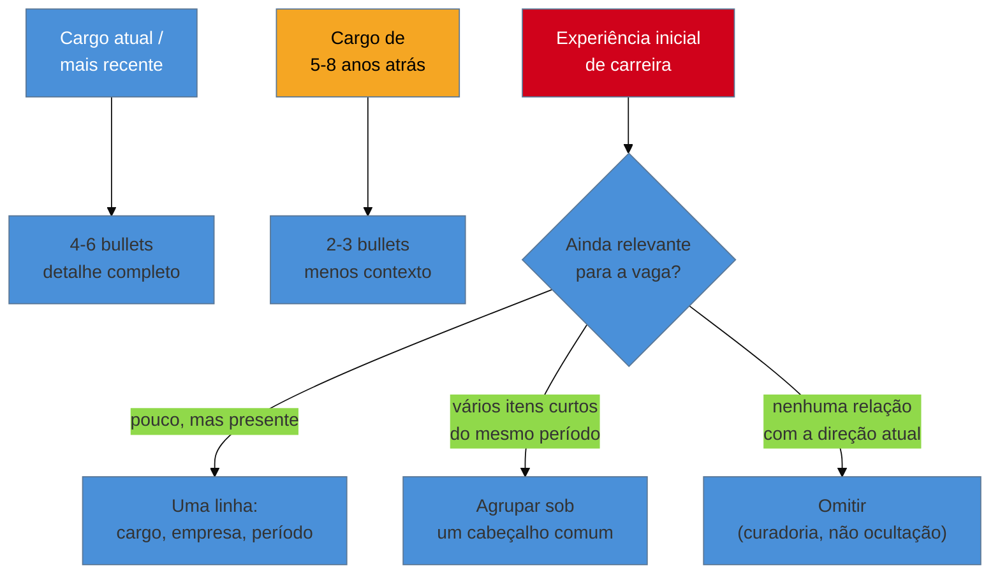

# A seção de experiência profissional

> [!abstract] TL;DR
> É aqui que o currículo passa ou falha — e é aqui que quase todo guia escreve como se a carreira de todo mundo fosse uma linha reta de datas contíguas, sem lacuna, sem passagem curta, sem sobreposição, sem contrato de terceiro entre o cargo e o trabalho de fato. Três coisas organizam esta nota. A primeira é a **linha de contexto**: uma frase dizendo o que a empresa faz e qual era o escopo — o item mais barato do currículo, e o mais esquecido, sem o qual **nenhum número dos seus bullets tem tamanho**. A segunda é a **densidade decrescente**: cada ano de carreira não merece o mesmo espaço, e dar o mesmo a todos faz a experiência antiga competir pelo segundo de atenção que a atual precisava ganhar sozinha. A terceira são as **seis situações que os guias evitam** — lacuna, passagem curta, PJ e freelance, alocação por agência, vários cargos no mesmo empregador, e sobreposição de vínculos —, cada uma com o que escrever, não com uma palavra de consolo. O princípio que atravessa as seis é um só: **a versão editada da linha do tempo, feita para parecer limpa, é sempre mais frágil que a versão real, feita para ser verificável.** Nenhuma das seis correções exige inventar nada — exige uma frase a mais do que o instinto de simplificação pediria. E fecha com quem ainda não tem vínculo formal, onde a regra da [[03-Dominios/Carreira/Currículo/15 - Quando não há número|nota 15]] vale inteira: um currículo sem experiência formal, mas honesto, funciona; um com experiência fabricada explode — e explode depois da contratação.

## A mesma frase, dois pesos

Leia esta entrada de currículo:

```
Desenvolvedor Backend — Empresa Y — Jan/2022 a Ago/2023
• Reduzi o tempo de resposta da API principal de 800ms para 150ms
```

Agora leia esta:

```
Desenvolvedor Backend — Empresa Y — Jan/2022 a Ago/2023
Fintech de crédito consignado, ~15 mil solicitações de empréstimo por dia.
A API era o ponto de entrada de todo o fluxo de originação.
• Reduzi o tempo de resposta da API principal de 800ms para 150ms
```

O bullet é **idêntico** nas duas. Mesma tecnologia, mesmo número, mesma pessoa, mesmo trabalho.

E as duas entradas não valem a mesma coisa, porque na primeira o leitor não tem como saber se aquela API atendia quinze mil solicitações por dia ou seis pessoas do time interno. Ele não vai supor o cenário generoso — ele não vai supor nada. Vai passar o olho, registrar "otimizou uma API", e seguir.

Rafael Duarte escreveu a primeira versão durante um ano e meio. Sabia de cor que a Empresa Y era uma fintech de consignado e que aquela API era o gargalo do fluxo inteiro — sabia tão bem que nunca lhe ocorreu escrever. O dado estava óbvio demais para quem o conhecia por dentro, e completamente invisível para quem via aquele nome pela primeira vez.

Foram duas linhas. Nenhum bullet mudou.

## A entrada como unidade

A [[03-Dominios/Carreira/Currículo/11 - A linha de bullet|nota 11]] trata do bullet, que é a unidade que o leitor processa numa varredura. Aqui o assunto é um nível acima: a **entrada** — o bloco que agrupa bullets sob um cabeçalho comum.

Toda entrada carrega três dados que praticamente nenhum guia discute, porque parecem óbvios demais: **cargo**, **empresa**, **período**. O que a pessoa fazia, onde, e por quanto tempo. Quase todo mundo os trata como preenchimento burocrático — um cabeçalho que existe para satisfazer o formato.

O erro fica visível quando se pergunta o que **falta** entre os três. *"Desenvolvedor Backend Sênior — Empresa X — Março de 2021 a Presente"* é uma linha completa no sentido formal e incompleta no sentido que importa: não diz o que a Empresa X faz, nem qual era o tamanho do trabalho dentro dela. É essa ausência que rouba peso de tudo que vem depois.

Daí a **linha de contexto**: uma ou duas frases, logo abaixo do cabeçalho, dizendo o que a empresa faz e qual era o escopo — quantas pessoas o produto atendia, que tipo de sistema era, em que setor, quantas pessoas no time. Não é currículo institucional nem propaganda. É a peça mais barata que existe para dar tamanho ao resto.

O teste é uma pergunta só: **sem essa frase, um leitor que nunca ouviu falar desta empresa consegue avaliar o tamanho do resultado descrito abaixo?** Se não, a linha está fazendo falta.

E note o que ela **não** é: não é lugar para descrever o próprio trabalho — isso continua sendo função do bullet. Ela descreve a empresa e o escopo, não a pessoa.

Para empresas conhecidas do setor — um banco grande, uma big tech, uma varejista nacional — ela encolhe para uma cláusula ou some, porque o nome já carrega a escala. Para empresas pequenas, ou clientes de consultoria sem nome reconhecível, ela deixa de ser opcional. É exatamente onde o leitor tem menos chance de preencher a lacuna sozinho que a ausência custa mais caro.

## Nem todo ano merece o mesmo espaço

A **ordem cronológica inversa** — mais recente no topo — é uma das poucas convenções deste galho com justificativa quase unânime: o leitor da [[03-Dominios/Carreira/Currículo/04 - Quem lê o seu currículo — e o que a evidência diz|nota 04]] quer saber, antes de tudo, o que você faz **agora**, porque é isso que melhor prevê o que você faria na vaga. O currículo funcional, que agrupa por habilidade em vez de por cronologia, existe — e carrega reputação ruim, porque recrutadores tendem a lê-lo como tentativa de esconder uma lacuna ou uma sequência de passagens curtas.

O que a maioria erra não é a ordem. É a **densidade**.

A tentação, numa carreira de dez ou vinte anos, é dar a cada entrada o mesmo número de bullets, do primeiro emprego ao mais recente — como se cada ano merecesse o mesmo espaço físico. Isso produz dois estragos ao mesmo tempo: a seção fica longa demais, estourando a régua de páginas da [[03-Dominios/Carreira/Currículo/03 - Os seis níveis e o que muda entre eles|nota 03]]; e a experiência antiga passa a competir pelo mesmo segundo de atenção que a atual precisava vencer sozinha.

A **densidade decrescente** resolve os dois. O cargo mais recente recebe mais bullets e mais detalhe; cada anterior recebe menos que o seguinte, numa progressão visível a olho nu ao rolar a página. Um cargo atual de dois ou três anos sustenta quatro a seis bullets substanciais. Um de cinco ou seis anos atrás cabe em dois ou três, com o mesmo padrão de verbo-ação-resultado e menos contexto — a essa altura o leitor já sabe que você domina a fórmula.

O critério não é só idade: é o cruzamento de **idade** e **relevância para a vaga**. Uma experiência de sete anos atrás numa tecnologia que a vaga exige hoje pode merecer mais espaço que uma de três anos sem relação nenhuma com o cargo. A densidade decrescente é tendência guiada pelo tempo, não régua rígida — e a [[03-Dominios/Carreira/Currículo/18 - Adaptar por vaga sem reescrever|nota 18]] trata dessa adaptação em profundidade.

Para as experiências mais antigas de uma carreira longa, há três destinos. **Reduzir a uma linha** — cargo, empresa, período, sem bullets — quando ainda é relevante o bastante para aparecer, mas não para ser detalhada. **Agrupar** várias entradas curtas do mesmo período inicial sob um cabeçalho comum: *"Experiência inicial (2003–2006)"*, com duas ou três linhas, preserva a trajetória sem inflar o documento. E **omitir**, para o que não tem relação com a direção atual da carreira.

Vale ser explícito sobre o terceiro: omitir uma entrada muito antiga, sem criar lacuna relevante, é **curadoria normal** — não ocultação de fato desconfortável. A diferença entre as duas coisas é exatamente o que a próxima seção existe para nomear.



## As seis situações que os guias evitam

Aqui é onde a maioria dos guias de currículo — os gratuitos e os vendidos por assinatura — fica vaga de propósito. *"Não se preocupe com a lacuna, foque no que você aprendeu"* soa reconfortante e não ensina nada: diz **como se sentir**, não **o que escrever**.

As seis abaixo recebem o tratamento oposto. O que fazer, com exemplo.

### Lacuna de emprego

O primeiro passo é admitir o que o leitor de fato pensa, porque a maioria dos guias pula direto para a solução sem nomear o problema. Um recrutador diante de um intervalo de seis meses ou um ano não pensa "essa pessoa cometeu um crime". Ele carrega uma pergunta específica: **o que aconteceu nesse período, e por que não está aqui?**

Sem resposta, a pergunta fica aberta — e pergunta aberta na cabeça de quem lê rápido é preenchida com a hipótese mais simples, que nem sempre é a mais favorável, porque falta tempo para considerar as mais prováveis (uma doença na família, um período de estudo, uma pausa consciente).

O que preenche isso não é mentira sobre datas nem cargo inventado. É uma linha curta, no mesmo lugar onde uma entrada normal apareceria. *"Pausa para cuidado familiar (jan-jul/2023)"* nomeia a razão sem entrar em detalhe pessoal. *"Estudo intensivo em arquitetura de sistemas distribuídos, com dois projetos publicados (fev-set/2023)"* transforma o período em evidência — a mesma lógica que a [[03-Dominios/Carreira/Currículo/10 - Inventário de evidência|nota 10]] aplica a projeto pessoal.

E a omissão silenciosa sai pior por aritmética de risco, no mesmo padrão que a [[03-Dominios/Carreira/Currículo/15 - Quando não há número|nota 15]] descreve para o número inventado. Uma lacuna sem explicação não desaparece: vira pergunta que o leitor fará na primeira entrevista, e você responde sob pressão a algo que uma linha calma teria resolvido semanas antes. Pior: quando o documento tenta **esconder** o intervalo — comprimindo datas, deixando só o ano —, o dano deixa de ser "existe pergunta em aberto" e passa a ser "existe inconsistência", que levanta dúvida sobre a honestidade do resto.

> [!example] Caso fictício
> Bianca Torres, desenvolvedora backend pleno já apresentada em notas anteriores deste galho, ficou onze meses sem vínculo formal depois de um desligamento, cuidando da própria saúde mental antes de voltar a procurar emprego. Na primeira versão do currículo, escreveu apenas os anos de cada cargo, sem os meses — "2021" seguido de "2023" — tentando deixar o intervalo menos visível.
>
> Um amigo que revisou o documento reconheceu o padrão de "anos sem meses" como sinal clássico de lacuna escondida, e apontou que a tentativa de disfarce era mais visível do que a lacuna seria se declarada. Bianca reescreveu com meses explícitos e acrescentou uma linha entre as duas entradas: *"Pausa para cuidado de saúde (mar/2022–jan/2023)."* A entrevista seguinte incluiu uma pergunta sobre o período — mas ela já tinha a resposta pronta, preparada com calma, em vez de improvisada sob pressão.

> [!info] Quando o vão é de anos, e não de meses
> Tudo nesta subseção foi calibrado para a escala em que a lacuna costuma aparecer — seis meses, um ano. Acima disso a prescrição não escala, porque a pergunta do leitor migra de "o que aconteceu" para "você ainda opera?", e a linha curta deixa de responder a metade que decide. O broto [[03-Dominios/Carreira/Currículo/16a - Lacuna longa e reentrada|16a - Lacuna longa e reentrada]] trata dessa escala: o que a evidência de campo diz sobre duração, como partir um vão de anos com trabalho real que nunca entrou no documento, a escolha entre declarar e curar, e por que um motivo de saúde se declara por categoria e não por diagnóstico.

### Passagens curtas

Três meses aqui, cinco ali. O mecanismo é parecido com o da lacuna, mas a dúvida é outra: o leitor não pergunta "o que aconteceu nesse intervalo", pergunta **"essa pessoa não fica"**. E duas ou três passagens curtas em sequência, sem contexto, são lidas como padrão de comportamento, não como coincidência.

A primeira decisão é **quando incluir como entrada própria e quando agrupar**. Uma passagem curta isolada, cercada de passagens normais, raramente precisa de tratamento especial. O problema nasce quando duas ou mais se sucedem, porque é aí que o padrão fica visível. Nesse caso vale agrupar as relacionadas — mesma área, mesmo tipo de contrato, mesmo período de instabilidade do mercado — sob um cabeçalho que já nomeia o padrão: *"Consultoria de curto prazo (2019–2020)"*, seguida das empresas e períodos, apresenta o mesmo material de um jeito que já explica, na estrutura, o que aconteceu.

A segunda decisão, para contratos com data de término conhecida desde o início, é **sinalizar a natureza temporária do vínculo**. A leitura de "essa pessoa não fica" muda de figura quando o leitor sabe que a saída foi o fim natural de um acordo combinado no primeiro dia. *"Contrato por prazo determinado (6 meses), cobertura de licença maternidade"* desloca a pergunta de "por que saiu tão rápido" para "esse vínculo sempre teve prazo, e terminou como combinado".

> [!example] Caso real
> Entre maio e julho de 2007, o autor deste vault atuou como instrutor de Java no SENAI, em Ilhéus, ministrando dois cursos de 40 horas — um sobre a linguagem, outro sobre lógica de programação aplicada — para dezoito alunos ao todo. São três meses de vínculo, curtos o bastante para levantar a dúvida "não fica" se apresentados sem contexto.
>
> Mas o próprio conteúdo da entrada resolve a dúvida sozinho: um cargo de instrutor, com dois cursos nomeados e carga horária declarada, sinaliza por construção um contrato de duração limitada — ninguém espera que uma turma de formação técnica dure anos. (Fonte: [josenaldo.com.br/experiences](https://josenaldo.com.br/experiences), verificado ao vivo em 2026-08-20.)

### PJ e freelance

O desconforto aqui tem duas faces. A primeira é o medo de **parecer inflar** a experiência ao listar múltiplos clientes como se fossem empregos — receio legítimo, porque dez linhas de "cliente" de três meses cada, sem contexto, passam exatamente a impressão de instabilidade da seção anterior. A segunda, menos falada, é a **diferença entre cliente e empregador** na leitura de quem tria: vínculo empregatício implica subordinação e dedicação a um projeto por vez; vínculo de cliente implica prestação de serviço delimitada, às vezes simultânea a mais de um contrato. Um leitor treinado reconhece a diferença — desde que o documento a torne visível em vez de escondê-la atrás do formato de CLT.

A forma de registrar sem parecer inflação é **agrupar o período inteiro sob um cabeçalho**, não cada cliente como entrada separada, listando os clientes relevantes como sub-itens. *"Consultor PJ em desenvolvimento backend (2020–2022)"*, seguido de dois ou três clientes nomeados com o tipo de trabalho entregue, comunica o que de fato aconteceu — um período contínuo de prestação de serviço — sem fingir que cada cliente foi um emprego novo.

> [!example] Caso fictício
> Rafael atuou como PJ por catorze meses entre dois empregos CLT, atendendo três clientes — dois deles em paralelo por alguns meses. A primeira versão do currículo listava os três como entradas separadas, no formato dos empregos formais, e o resultado parecia mais instável que a realidade: cinco meses aqui, sete ali, quatro num terceiro.
>
> Ele reescreveu agrupando tudo sob *"Consultor PJ, desenvolvimento backend (mar/2021–mai/2022)"*, com os três clientes como projetos dentro da entrada única. O tempo total não mudou. Mudou a estrutura — e o período passou a ser legível como serviço contínuo, não como três empregos curtos e desconectados.

### Trabalho por agência, consultoria ou body shop

Esta é a que mais confunde quem lê, porque há um desalinhamento estrutural entre o que o cabeçalho diz e o que aconteceu: o cargo é numa empresa — a consultoria, a agência — mas o trabalho acontece dentro de outra, o cliente. *"Desenvolvedor Sênior — Consultoria X — 2019 a 2021"* apaga a informação mais relevante: em qual empresa, com qual produto, o trabalho técnico de fato aconteceu. "Consultoria X" sozinha só diz quem assinava o contracheque.

A solução é nomear as duas, com o papel de cada uma explícito: o vínculo formal e a alocação real. *"Desenvolvedor Sênior — Consultoria X, alocado no cliente Y"*, ou, na linha de contexto, *"Contratado pela Consultoria X; atuação de tempo integral no time de engenharia do cliente Y"*.

O erro comum é escrever só uma. Citar apenas a consultoria esconde onde o trabalho aconteceu; citar apenas o cliente cria uma linha que parece um vínculo direto que nunca existiu — e que pode não resistir a uma checagem de referência.

> [!example] Caso real
> Entre outubro de 2011 e outubro de 2012, o autor deste vault foi Senior Backend Developer na TQI, em Uberlândia. O vínculo formal era com a TQI; o trabalho acontecia alocado no cliente **Buscapé** — uma grande plataforma brasileira de comparação de preços —, projetando arquitetura backend de alto tráfego junto ao time do cliente.
>
> A descrição pública nomeia as duas empresas lado a lado: o cargo e a contratação são da TQI, e a linha de ação registra explicitamente *"worked directly at Buscapé client site, collaborating closely with their teams"*. Um leitor que só visse "TQI" perderia o dado mais relevante para avaliar o peso técnico: que se tratava de arquitetura para uma grande plataforma de e-commerce, não de um projeto interno de porte desconhecido. (Fonte: [josenaldo.com.br/experiences](https://josenaldo.com.br/experiences), verificado ao vivo em 2026-08-20.)

### Mesmo empregador, vários cargos

Esta não nasce de um problema — nasce de um instinto de simplificação que desperdiça um dos sinais mais valiosos que um currículo pode carregar.

Quem ficou no mesmo empregador por vários cargos costuma fazer uma de duas coisas: repetir o nome da empresa em entradas separadas, uma por cargo; ou colapsar tudo numa entrada só, com o cargo mais recente no cabeçalho e uma lista de responsabilidades por baixo. A primeira é repetitiva; a segunda esconde exatamente a escada de escopo da [[03-Dominios/Carreira/Currículo/13 - Responsabilidade, realização e alavancagem|nota 13]], comprimindo vários degraus numa lista sem hierarquia.

O formato correto é híbrido: **um cabeçalho com a empresa e o período total**, seguido de **subentradas por cargo**, cada uma com título, datas e bullets próprios. Isso mostra, num bloco visual, que a pessoa não só permaneceu — **subiu**.

E a progressão é um dado tão forte quanto qualquer bullet, por um motivo que vale nomear: uma promoção carrega um selo de validação que nenhum outro item do currículo tem. Não é a pessoa afirmando o próprio valor — é a empresa, com acesso direto ao desempenho real, decidindo investir mais responsabilidade nela. *"Desenvolvedor Sênior — Empresa Z — 2018 a 2023"* e nada mais está escondendo, sem perceber, que a pessoa entrou pleno e foi promovida duas vezes.

> [!example] Caso real
> A trajetória pública do autor deste vault registra essa progressão com um intervalo no meio, em vez de sequência contínua. Em novembro de 2003 ele ingressou no CEPEDI, em Ilhéus, como Junior Java Programmer, desenvolvendo um sistema automatizado de testes para a linha de montagem da Novadata, num contrato até fevereiro de 2004. Quase três anos depois, em setembro de 2006, retornou como Java Coordinator and Java Developer, coordenando programas de formação — um curso com 40 participantes e 77,5% de aprovação, treinamento avançado para cinco alunos selecionados com 100% de empregabilidade, 44 desenvolvedores certificados ao todo —, até abril de 2008.
>
> Registradas como entradas distintas, as duas passagens tornam visível algo que uma entrada genérica jamais capturaria: a mesma organização que contratou um programador júnior em 2003 confiou a ele, poucos anos depois, a coordenação técnica de uma frente inteira de formação — o salto entre task-taker e owner que a nota 13 descreve. (Fonte: [josenaldo.com.br/experiences](https://josenaldo.com.br/experiences), verificado ao vivo em 2026-08-20.)

### Sobreposição de vínculos

A sexta produz um instinto de esconder ainda mais forte que a lacuna: **dois vínculos que, na linha do tempo real, se cruzam**.

A reação comum é editar um deles — encurtar o fim de um, adiar o início do outro — para a linha do tempo parecer limpa. Essa reação cria um problema pior do que o que tentava resolver: uma divergência entre o currículo e qualquer outro registro público da mesma trajetória (o LinkedIn, uma carta de recomendação antiga). E é exatamente esse tipo de divergência que um entrevistador atento confere, porque abrir duas fontes lado a lado e comparar datas é a checagem mais barata que existe.

Sobreposição real não precisa de disfarce. Precisa de uma frase que a explique. *"Bolsista de Iniciação Científica na Universidade X (2003–2004), com atuação simultânea como programador júnior na Empresa Y por quatro meses (nov/2003–fev/2004)"* é mais longa que duas entradas ajustadas para não colidir — e é a única versão que sobrevive a uma checagem cruzada.

> [!example] Caso real
> A trajetória pública do autor deste vault registra essa sobreposição no início da carreira. A bolsa de Iniciação Científica na Universidade Estadual de Santa Cruz (UESC), em Ilhéus, foi de abril de 2003 a agosto de 2004, no laboratório de bioinformática, desenvolvendo uma plataforma web de integração de sistemas de laboratório e automação de processamento de dados de sequenciamento genético. Dentro desse mesmo intervalo, entre novembro de 2003 e fevereiro de 2004, ele também atuou como Junior Java Programmer no CEPEDI.
>
> Os dois vínculos se sobrepõem por quatro meses inteiros — a bolsa seguiu rodando enquanto o contrato começava e terminava dentro dela. Não há, nas duas entradas públicas, nenhuma tentativa de ajustar uma data para não colidir com a outra. E a explicação mais simples também é a verdadeira: uma bolsa acadêmica de dedicação parcial e um contrato júnior de curta duração, acumulados num começo de carreira em que isso era perfeitamente possível. (Fonte: [josenaldo.com.br/experiences](https://josenaldo.com.br/experiences), verificado ao vivo em 2026-08-20.)

### O princípio que vale para as seis

De ângulos diferentes, as seis situações dizem a mesma coisa:

> **A versão editada da linha do tempo, feita para parecer mais limpa, é sempre mais frágil que a versão real, feita para ser verificável.**

Nenhuma das seis correções — lacuna declarada, passagem curta contextualizada, PJ agrupado, agência nomeada dos dois lados, progressão exibida, sobreposição explicada — exige inventar nada. Exige apenas escrever o que aconteceu, com uma frase a mais do que o instinto de simplificação pediria.

## Quando ainda não há vínculo formal

Tudo acima pressupõe que existe pelo menos uma entrada formal para organizar. Para quem está começando — sem estágio concluído, sem CLT, sem contrato PJ em lugar nenhum — a seção não deveria ficar vazia. E a resposta certa não é inventar um vínculo.

A [[03-Dominios/Carreira/Currículo/10 - Inventário de evidência|nota 10]] já trata em profundidade do que conta como material sem vínculo formal; aqui vale só a conclusão aplicada ao espaço da seção de experiência.

**Estágio, mesmo curto, conta** — no mesmo formato de qualquer emprego; a duração muda a densidade, não o formato. **Bolsa de iniciação científica conta** com o mesmo tratamento: a nota 10 registra a mudança legal de 2024 que equipara IC a estágio em certas condições, e mesmo fora dela, o trabalho metodológico de uma IC é trabalho técnico real, sob avaliação de terceiro — merece entrada própria, não rodapé na formação. **Trabalho voluntário técnico conta**, desde que descrito com a mesma precisão: manter a infraestrutura de uma ONG é entrega real, sob restrição real, e a ausência de remuneração não apaga a natureza técnica. **Freelance informal conta**, mesmo sem contrato ou nota fiscal — um projeto entregue a um cliente real passou pelo ciclo completo de levantar requisito, entregar e receber feedback.

O que não conta, e não deveria aparecer de jeito nenhum, é qualquer coisa que não aconteceu. Um cargo que nunca existiu. Uma equipe que nunca foi liderada.

A matemática de risco é a mesma da nota 15, aplicada a um item inteiro em vez de a uma cifra: **experiência fabricada não custa a entrevista, custa o emprego** — porque é o tipo de afirmação mais fácil de verificar que existe. Um telefonema, uma pergunta técnica sobre o dia a dia daquele cargo, e a fabricação desmorona, geralmente depois de a contratação já ter avançado o bastante para o dano ser maior que qualquer entrevista perdida.

> [!example] Caso fictício
> Um candidato júnior, sem nenhum vínculo formal, decide não deixar a seção vazia e inventa *"Desenvolvedor Júnior — Startup — seis meses"*. O currículo passa pela triagem e chega à entrevista técnica, onde o entrevistador, seguindo um roteiro comum, pergunta o nome do gestor direto e um detalhe específico do dia a dia da equipe.
>
> Ele hesita, improvisa algo genérico, e a inconsistência fica visível em segundos — não porque houvesse suspeita prévia, mas porque uma pergunta de rotina não encontrou nada real para responder. E o dano não fica restrito àquela entrada: o resto do currículo, que era honesto e tinha projetos pessoais sólidos o bastante para justificar a entrevista, passa a ser lido sob suspeita a partir dali.

Um currículo com projetos sólidos e sem experiência formal é, ao contrário do que a ansiedade sugere, um documento honesto que funciona. Descreve com precisão o que a pessoa fez, e deixa o leitor avaliar aquilo pelo que é.

## Armadilhas comuns

> [!warning] Tratar a linha de contexto como opcional para empresas "óbvias"
> **O que acontece:** a pessoa pula a linha de contexto porque, na própria cabeça, o tamanho e o tipo da empresa parecem evidentes demais — mesmo quando ela não é conhecida fora do setor.
> **Por quê:** quem escreve conhece a empresa por dentro há anos e esquece que o leitor está vendo aquele nome pela primeira vez. É o erro do Rafael na abertura deste capítulo.
> **Como evitar:** aplique o teste a toda entrada. Sem a linha de contexto, um leitor que nunca ouviu falar desta empresa consegue avaliar o tamanho dos resultados abaixo?

> [!warning] Ajustar datas para a linha do tempo parecer mais limpa
> **O que acontece:** diante de lacuna, passagem curta ou sobreposição real, a pessoa move um mês de início ou fim para que duas entradas emendem sem intervalo nem colisão.
> **Por quê:** uma linha do tempo sem falha parece mais profissional que uma com algo a explicar.
> **Como evitar:** a versão editada é sempre mais frágil que a real, porque cria uma divergência checável contra qualquer outro registro público. O risco de uma data errada descoberta numa checagem cruzada é maior que o de uma lacuna declarada com honestidade.

> [!warning] Repetir o nome da empresa três vezes sem mostrar a progressão
> **O que acontece:** quem ficou numa empresa por vários cargos escreve entradas idênticas em formato, sem deixar clara a promoção — ou colapsa tudo numa entrada só, escondendo a evolução atrás de uma lista de responsabilidades.
> **Por quê:** o formato de entrada única por emprego é o padrão mais familiar, e adaptá-lo exige um passo que nenhum modelo sugere sozinho.
> **Como evitar:** o formato híbrido — cabeçalho com empresa e período total, subentradas por cargo. É a estrutura, não o texto de nenhum bullet, que deixa a progressão visível no primeiro segundo.

## Como soa em inglês

> *"Every entry in my experience section carries a short context line right under the title — what the company does, roughly how big the product or the team was — because a number like 'cut deploy time from an hour to two minutes' means something different at a three-person startup than it does at a platform with hundreds of thousands of users, and the reader can't tell the difference unless I give them that context myself. I order everything in reverse chronological order and give my most recent role the most space, tapering off for older positions instead of giving every job the same word count. And when my own timeline has something uncomfortable in it — a gap, a short stint, an agency placement, an overlap between two roles — I write a short, specific line explaining it instead of hoping the reader won't notice, because the edited-to-look-clean version of a timeline is always easier to catch as inconsistent than the real one is to explain."*

| PT | EN |
| --- | --- |
| linha de contexto | context line |
| densidade decrescente | decreasing density |
| lacuna de emprego | employment gap |
| passagem curta | short tenure / short stint |
| contrato por prazo determinado | fixed-term contract |
| PJ / freelance | independent contractor / freelance |
| agência / body shop | staffing agency / consultancy |
| alocado no cliente | placed at the client site |
| sobreposição de vínculos | overlapping employment |
| progressão interna | internal promotion / career progression |

## O que vem a seguir

As duas linhas que faltavam no currículo do Rafael custaram trinta segundos para escrever, e mudaram o peso de um bullet que já estava lá havia um ano e meio. É o padrão desta nota inteira: quase nada aqui exige fato novo — exige tornar visível o que já era verdade.

- [[03-Dominios/Carreira/Currículo/16a - Lacuna longa e reentrada|16a - Lacuna longa e reentrada]] *(broto)* — a mesma seção quando a lacuna é de anos: partir o vão, declarar por categoria ou curar a seleção, e realocar o espaço para prova de atualidade.
- [[03-Dominios/Carreira/Currículo/17 - Projetos, portfólio e GitHub depois da IA|17 - Projetos, portfólio e GitHub depois da IA]] — o que conta como evidência técnica fora do vínculo, e como a IA mudou o valor sinal de um projeto genérico.
- [[03-Dominios/Carreira/Currículo/18 - Adaptar por vaga sem reescrever|18 - Adaptar por vaga sem reescrever]] — como a densidade e a ordem desta nota se ajustam a cada vaga, sem reescrever nada.
- [[03-Dominios/Carreira/Currículo/19 - Declarar lacuna|19 - Declarar lacuna]] — o par oral desta nota: a lacuna **técnica**, declarada na conversa e não no documento.

## Veja também

- [[03-Dominios/Carreira/Currículo/index|Currículo]] — o índice do galho.
- [[03-Dominios/Carreira/Currículo/11 - A linha de bullet|11 - A linha de bullet]] — a unidade dentro de cada entrada, que esta nota pressupõe sem repetir.
- [[03-Dominios/Carreira/Currículo/13 - Responsabilidade, realização e alavancagem|13 - Responsabilidade, realização e alavancagem]] — a escada de escopo que explica por que a progressão interna, exibida com estrutura, é um ativo.
- [[03-Dominios/Carreira/Currículo/14 - Números que você pode defender|14 - Números que você pode defender]] — a régua de confiança que os números dentro de cada entrada respeitam.
- [[03-Dominios/Carreira/Currículo/15 - Quando não há número|15 - Quando não há número]] — a assimetria de risco reusada aqui para o caso da experiência fabricada.
- [[03-Dominios/Carreira/Currículo/03 - Os seis níveis e o que muda entre eles|03 - Os seis níveis e o que muda entre eles]] — a régua de páginas por nível, que orienta o quanto esta seção pode se expandir.
- [[03-Dominios/Carreira/Currículo/10 - Inventário de evidência|10 - Inventário de evidência]] — o material aproveitável para quem ainda não tem vínculo formal.
- [[03-Dominios/Carreira/Entrevistas/index|Entrevistas]] — o galho parceiro: toda situação declarada aqui tende a reaparecer como pergunta de entrevista.

## Fontes

- **Josenaldo Matos** — [josenaldo.com.br/experiences](https://josenaldo.com.br/experiences), página pública de experiências profissionais, verificada ao vivo em 2026-08-20. Fonte dos quatro casos reais: a sobreposição entre a bolsa de IC na UESC (abr/2003–ago/2004) e o cargo de Junior Java Programmer no CEPEDI (nov/2003–fev/2004); a passagem de instrutor no SENAI (mai–jul/2007, dois cursos, dezoito alunos); o retorno ao CEPEDI como Java Coordinator (set/2006–abr/2008); e a alocação como Senior Backend Developer pela TQI no cliente Buscapé (out/2011–out/2012). Datas, cargos e números foram conferidos nas entradas correspondentes antes de entrarem aqui.
- Esta nota não depende de estudo quantitativo próprio sobre taxa de leitura negativa de lacuna, passagem curta ou vínculo por agência em processos seletivos de tecnologia; o argumento é análise estrutural apoiada no gate factual já sourced pela [[03-Dominios/Carreira/Currículo/04 - Quem lê o seu currículo — e o que a evidência diz|nota 04]], reusado sem repetir a pesquisa original.
- **Rafael Duarte** e **Bianca Torres** são personas fictícias já estabelecidas neste galho — ambos desenvolvedores de nível pleno.
