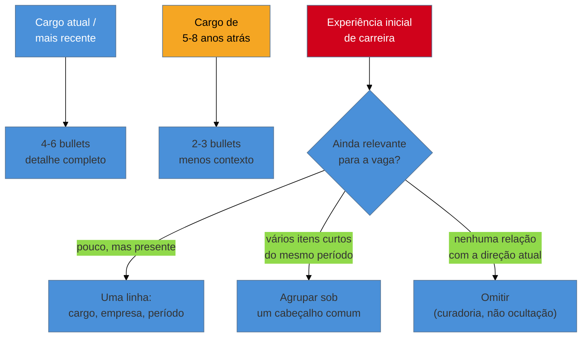

# A seção de experiência profissional

> [!abstract] TL;DR
> A seção de experiência é onde o currículo passa ou falha, e é também a seção em que quase todo guia de mercado escreve como se a carreira de todo mundo fosse uma linha reta de datas contíguas, sem lacuna, sem passagem curta, sem sobreposição, sem contrato de terceiro entre o cargo e o trabalho de fato. Esta nota trata da **estrutura de cada entrada** — cargo, empresa, período e, o item mais barato e mais frequentemente esquecido, a **linha de contexto** que diz o que a empresa faz e qual era o escopo, sem a qual nenhum bullet da nota 11 tem tamanho. Trata da **ordem cronológica inversa** e da **densidade decrescente**, o critério de quanto espaço cada entrada merece conforme envelhece. E trata, com o mesmo cuidado que as notas 14 e 15 já dedicaram a número frágil, das **cinco situações que os guias evitam**: lacuna de emprego, passagem curta, PJ e freelance, trabalho por agência ou consultoria, e o mesmo empregador com vários cargos — cada uma com o que fazer, não com "não se preocupe". Fecha com o caso de quem ainda não tem experiência formal, e com a regra que atravessa o galho inteiro desde a nota 15: um currículo sem experiência formal, mas honesto, funciona; um com experiência fabricada explode na primeira pergunta.

## A entrada como unidade: cargo, empresa, período — e o que falta

A [[03-Dominios/Carreira/Currículo/11 - A linha de bullet|nota 11]] já tratou da linha de bullet como a unidade que o leitor de fato processa, e esta nota não repete essa fórmula — trata de uma unidade um nível acima dela: a **entrada**, o bloco que agrupa um conjunto de bullets sob um cabeçalho comum. Toda entrada de experiência carrega três dados que praticamente nenhum guia de currículo discute, porque parecem óbvios demais para merecer atenção: o **cargo**, a **empresa** e o **período**. O cargo diz o que a pessoa fazia; a empresa diz onde; o período diz quando e por quanto tempo. Três dados, três linhas de informação, e a maior parte de quem escreve currículo os trata como preenchimento burocrático — um cabeçalho que existe para satisfazer o formato, não para carregar sentido.

Esse tratamento é um erro, e o motivo fica claro assim que se pergunta o que falta entre os três dados. "Desenvolvedor Backend Sênior — Empresa X — Março de 2021 a Presente" é uma linha completa no sentido formal, e ainda assim está incompleta no sentido que importa: ela não diz **o que a Empresa X faz**, nem **qual era o tamanho ou o escopo do trabalho** dentro dela. E é exatamente essa ausência que rouba tamanho de todo bullet que vem depois. Um bullet como "reduzi o tempo de deploy de uma hora para dois minutos" — o mesmo tipo de linha que a nota 11 já citou do currículo público do autor deste vault — significa uma coisa numa startup de três pessoas, e outra completamente diferente numa plataforma usada por centenas de milhares de pessoas. O número é o mesmo nas duas frases. O peso dele não é.

É esse o papel da **linha de contexto**: uma ou duas frases, logo abaixo do cabeçalho de cargo-empresa-período, dizendo o que a empresa faz e qual era o escopo do trabalho dentro dela — quantas pessoas o produto atendia, que tipo de sistema era, em que setor a empresa operava, quantas pessoas compunham o time. Não é currículo institucional nem propaganda da empresa; é a peça de contexto mais barata que existe para dar tamanho ao resto da entrada, e é, ao mesmo tempo, a peça que quase todo currículo pula — porque parece óbvia para quem escreve (que já sabe o tamanho da empresa de cor) e completamente invisível para o leitor (que nunca ouviu falar dela).

> [!example] Caso fictício
> Rafael Duarte, desenvolvedor pleno já apresentado em notas anteriores deste galho, revisa a própria seção de experiência e encontra a entrada "Desenvolvedor Backend — Empresa Y — Jan/2022 a Ago/2023", seguida de três bullets técnicos sólidos, entre eles "reduzi o tempo de resposta da API principal de 800ms para 150ms". Ele nunca escreveu que a Empresa Y era uma fintech de crédito consignado processando, na época, cerca de quinze mil solicitações por dia, e que a API era o ponto de entrada de todo o fluxo de originação. Sem essa frase, um leitor que nunca ouviu falar da Empresa Y não distingue a redução de Rafael de uma equivalente num sistema interno usado por seis pessoas. Ele acrescenta a linha de contexto — "Fintech de crédito consignado, ~15 mil solicitações de empréstimo processadas por dia" — e, sem alterar o bullet, a mesma frase passa a carregar um peso que antes dependia de o leitor já conhecer a empresa.

Vale notar o que essa frase de contexto não é: não é o lugar para reintroduzir a fórmula da nota 11 nem para descrever o próprio trabalho — isso continua sendo trabalho do bullet. A linha de contexto descreve a empresa e o escopo, não a pessoa, e o teste mais simples para saber se ela está fazendo esse trabalho é perguntar: **sem essa frase, um leitor que nunca ouviu falar desta empresa consegue avaliar corretamente o tamanho do resultado descrito nos bullets abaixo?** Se a resposta é não, a linha está fazendo falta — e é, na maioria dos currículos, a ausência mais barata de corrigir de toda a seção de experiência.

Para empresas conhecidas do setor — um banco grande, uma big tech, uma varejista nacional —, a linha de contexto pode encolher para uma cláusula curta ou desaparecer, porque o próprio nome já carrega o dado de escala. Para empresas pequenas ou clientes de consultoria sem nome reconhecível fora do próprio setor, ela deixa de ser opcional — é exatamente aí que sua ausência custa mais caro, porque é exatamente aí que o leitor tem menos chance de preencher a lacuna sozinho.

## Ordem cronológica inversa e densidade decrescente

A convenção de ordenar a seção de experiência em **ordem cronológica inversa** — a posição mais recente no topo, a mais antiga no fim — é uma das poucas deste galho com justificativa quase unânime: o leitor descrito pela [[03-Dominios/Carreira/Currículo/04 - Quem lê o seu currículo — e o que a evidência diz|nota 04]] quer saber, antes de qualquer outra coisa, o que a pessoa está fazendo **agora**, porque é isso que prevê melhor o que ela faria na vaga aberta. O currículo funcional, que agrupa por habilidade em vez de por cronologia, existe, mas carrega reputação ruim: recrutadores tendem a lê-lo como sinal de que a pessoa está escondendo uma lacuna ou uma sequência de passagens curtas — as situações desconfortáveis mais adiante nesta nota mostram por que esconder quase sempre sai pior do que declarar.

O que a maioria dos currículos erra não é a ordem — é a **densidade**. A tentação mais comum, numa carreira de dez ou vinte anos, é escrever cada entrada com o mesmo número de bullets, do primeiro emprego ao mais recente, como se cada ano de carreira merecesse o mesmo espaço físico. Isso produz dois problemas: a seção fica longa demais, violando a régua de páginas que a [[03-Dominios/Carreira/Currículo/03 - Os seis níveis e o que muda entre eles|nota 03]] já tratou por nível; e o espaço da experiência antiga compete pelo mesmo segundo de atenção que a experiência atual — a mais relevante para a vaga — precisa vencer sozinha.

A regra que resolve os dois problemas é a **densidade decrescente**: o cargo mais recente recebe o maior número de bullets e o maior nível de detalhe; cada cargo anterior recebe, em geral, menos do que o seguinte, numa progressão visível a olho nu ao rolar o documento. Um cargo atual de dois ou três anos pode sustentar quatro a seis bullets substanciais, cada um seguindo a fórmula da nota 11. Um cargo de cinco ou seis anos atrás costuma caber em dois ou três, com o mesmo padrão de verbo, ação e resultado, mas sem a mesma extensão de contexto — o leitor já sabe, a essa altura, que a pessoa domina a fórmula.

O critério de espaço não é só a idade da entrada — é o cruzamento entre **idade** e **relevância para a vaga em questão**. Uma experiência de sete anos atrás numa tecnologia que a vaga exige hoje pode merecer mais espaço do que uma de três anos atrás sem nenhuma relação com o cargo pretendido; a densidade decrescente é uma tendência geral guiada pelo tempo, não uma régua rígida. A [[03-Dominios/Carreira/Currículo/18 - Adaptar por vaga sem reescrever|nota 18]], mais adiante, trata em profundidade dessa adaptação cirúrgica; aqui vale reter só o princípio: quanto mais antiga e menos relevante, menos espaço — e a exceção só existe quando a vaga específica muda essa conta.

Para as experiências mais antigas de uma carreira longa, existem três destinos, e a escolha depende de quanto valor real cada uma ainda carrega. O primeiro é **reduzir a uma única linha** — cargo, empresa, período, sem bullets ou com no máximo um — quando a experiência ainda é relevante o suficiente para aparecer, mas não para ser detalhada. O segundo é **agrupar** várias entradas antigas e curtas sob um cabeçalho comum, quando pertencem ao mesmo período inicial de carreira e nenhuma sustenta uma entrada própria — "Experiência inicial (2003–2006)", seguida de duas ou três linhas sem o aparato completo de bullets, preserva a trajetória sem inflar o documento. O terceiro, para experiências antigas sem relação com a direção atual da carreira, é a **omissão** — e vale ser explícito: omitir uma entrada muito antiga, sem criar lacuna relevante com isso, é curadoria normal, não ocultação de fato desconfortável. Essa diferença — omissão de curadoria versus ocultação de fato desconfortável — é exatamente o que a próxima seção existe para nomear.

## As situações desconfortáveis

Esta é a seção em que a maioria dos guias de currículo do mercado — os gratuitos e os vendidos por assinatura — se torna vaga de propósito. "Não se preocupe com a lacuna, foque no que você aprendeu" é um conselho que soa reconfortante e não ensina nada, porque não diz **o que escrever**, só diz **como se sentir** em relação ao problema. As cinco situações abaixo recebem, cada uma, o tratamento oposto: o que fazer, com exemplo, não uma palavra de consolo.

### Lacuna de emprego

O primeiro passo para tratar uma lacuna de emprego com honestidade é admitir o que o leitor de fato pensa diante dela, porque a maioria dos guias pula direto para a solução sem nomear o problema real. Um recrutador que vê um intervalo de seis meses ou um ano entre duas entradas não pensa "essa pessoa cometeu um crime" — mas carrega, quase sempre, uma pergunta específica: **o que aconteceu nesse período, e por que não está aqui?** Sem resposta, essa pergunta fica aberta, e uma pergunta aberta na cabeça de quem lê rápido tende a ser respondida com a hipótese mais simples e nem sempre a mais favorável à pessoa, porque falta tempo para considerar as hipóteses mais prováveis (uma doença na família, um período de estudo intensivo, uma pausa consciente).

O que preenche essa lacuna de forma honesta não é uma mentira sobre datas, nem um cargo inventado — é uma linha curta e direta, no mesmo lugar em que uma entrada normal apareceria. "Pausa para cuidado familiar (jan-jul/2023)" ou "Estudo intensivo em arquitetura de sistemas distribuídos, incluindo dois projetos pessoais publicados (fev-set/2023)" são as duas frentes mais comuns: a primeira nomeia a razão sem entrar em detalhe pessoal desnecessário; a segunda transforma o período em algo que, mesmo sem vínculo formal, ainda produziu evidência — a mesma lógica que a [[03-Dominios/Carreira/Currículo/10 - Inventário de evidência|nota 10]] já aplicou a projeto pessoal e contribuição informal.

A razão pela qual a omissão silenciosa costuma sair pior do que a menção breve é aritmética de risco, no mesmo padrão que a [[03-Dominios/Carreira/Currículo/15 - Quando não há número|nota 15]] já descreveu para o número inventado. Uma lacuna sem explicação não desaparece — vira uma pergunta que o leitor fará, quase com certeza, na primeira entrevista, e a pessoa responde sob pressão a algo que poderia ter sido resolvido com uma linha calma, semanas antes. Pior: quando o documento tenta esconder o intervalo — comprimindo datas, ou deixando só o ano — o dano deixa de ser "existe uma pergunta em aberto" e passa a ser "existe uma inconsistência", que é estruturalmente pior, porque levanta dúvida sobre a honestidade do resto do documento, não só sobre a lacuna.

> [!example] Caso fictício
> Bianca Torres, desenvolvedora backend pleno já apresentada em notas anteriores deste galho, ficou onze meses sem vínculo formal depois de um desligamento, cuidando da própria saúde mental antes de voltar a procurar emprego. Na primeira versão do currículo, escreveu apenas os anos de cada cargo, sem os meses — "2021" seguido de "2023" — tentando deixar o intervalo menos visível. Um amigo que revisou o documento reconheceu o padrão de "anos sem meses" como sinal clássico de lacuna escondida, e apontou que a tentativa de disfarce era mais visível do que a lacuna seria se declarada. Bianca reescreveu com meses explícitos e acrescentou uma linha entre as duas entradas: "Pausa para cuidado de saúde (mar/2022–jan/2023)." A entrevista seguinte incluiu uma pergunta sobre o período — mas ela já tinha uma resposta pronta, preparada com calma, em vez de improvisada sob pressão.

### Passagens curtas

Três meses aqui, cinco meses ali: passagens curtas são o segundo tipo de desconforto que a maioria dos currículos tenta esconder, e o mecanismo é parecido com o da lacuna, mas com dúvida diferente — o leitor não pergunta "o que aconteceu nesse intervalo", pergunta **"essa pessoa não fica"**. Uma sequência de duas ou três passagens curtas seguidas, sem contexto, é lida como padrão de comportamento, não como coincidência.

A primeira decisão é **quando incluir uma passagem curta como entrada própria e quando agrupá-la**. Uma passagem curta isolada, cercada de passagens normais antes e depois, raramente precisa de tratamento especial. O problema nasce quando duas ou mais se sucedem, porque é aí que o padrão vira visível. Nesse caso, vale agrupar as passagens relacionadas — mesma área, mesmo tipo de contrato, mesmo período de instabilidade do mercado — sob um cabeçalho que já nomeia o padrão: "Consultoria de curto prazo (2019–2020)", seguida das empresas e períodos, apresenta o mesmo material de um jeito que já explica, na estrutura, o que aconteceu.

A segunda decisão, específica de contratos com data de término conhecida desde o início, é **sinalizar a natureza temporária do vínculo** — porque a leitura de "essa pessoa não fica" muda de figura quando o leitor sabe que a saída foi o fim natural de um acordo combinado desde o primeiro dia. "Contrato por prazo determinado (6 meses), cobertura de licença maternidade" ou "Contrato temporário para pico de demanda de fim de ano" deslocam a pergunta de "por que saiu tão rápido" para "esse vínculo sempre teve prazo definido, e terminou exatamente como combinado".

> [!example] Caso real
> Um item da trajetória pública do autor deste vault ilustra bem o segundo caminho desta seção. Entre maio e julho de 2007, ele atuou como instrutor de Java no SENAI, em Ilhéus, ministrando dois cursos de 40 horas — um sobre a linguagem Java e outro sobre lógica de programação aplicada — para dezoito alunos ao todo. São três meses de vínculo, curtos o suficiente para levantar a dúvida "não fica" se apresentados sem contexto. Mas o próprio conteúdo da entrada já resolve a dúvida: um cargo de instrutor, com dois cursos nomeados e carga horária declarada, sinaliza por construção um contrato de duração limitada por natureza — ninguém espera que uma turma de formação técnica dure anos. (Fonte: [josenaldo.com.br/experiences](https://josenaldo.com.br/experiences), verificado ao vivo em 2026-08-20.)

### PJ e freelance

O trabalho como pessoa jurídica ou freelancer carrega um desconforto próprio, com duas faces. A primeira é o medo de **parecer estar inflando** a própria experiência ao listar múltiplos clientes de um período PJ como se fossem empregos formais — um receio legítimo, porque dez linhas de "cliente" de três meses cada, sem contexto, de fato passam a impressão de instabilidade que a seção anterior já tratou. A segunda, menos falada, é a **diferença entre cliente e empregador** na leitura de quem tria: um vínculo empregatício implica subordinação e dedicação a um único projeto por vez; um vínculo de cliente implica prestação de serviço delimitada, às vezes simultânea a mais de um contrato — e um leitor treinado reconhece essa diferença, desde que o documento a torne visível em vez de escondê-la atrás do formato usado para vínculo CLT.

A forma de registrar um período PJ sem parecer inflação é agrupar, sob um único cabeçalho, o período inteiro de atuação — não cada cliente como entrada separada — listando os clientes relevantes como sub-itens. "Consultor PJ em desenvolvimento backend (2020–2022)", seguido de dois ou três clientes nomeados com o tipo de trabalho entregue a cada um, comunica exatamente o que aconteceu — um período contínuo de prestação de serviço — sem fingir que cada cliente foi um emprego novo.

> [!example] Caso fictício
> Rafael Duarte, já apresentado em seções anteriores desta nota, atuou como PJ por catorze meses entre dois empregos CLT, atendendo três clientes — dois deles em paralelo por alguns meses. A primeira versão do currículo listava os três como entradas separadas, no mesmo formato dos empregos formais, e o resultado parecia mais instável do que a realidade: cinco meses aqui, sete ali, quatro num terceiro. Rafael reescreveu agrupando o período todo sob um único cabeçalho — "Consultor PJ, desenvolvimento backend (mar/2021–mai/2022)" — com os três clientes listados como projetos dentro dessa entrada única. O tempo total de trabalho continuou o mesmo; o que mudou foi a estrutura, que passou a deixá-lo legível como um período contínuo de serviço, não como três empregos curtos e desconectados.

### Trabalho por agência, consultoria ou body shop

Esta é, entre as seis situações desta seção, a que mais confunde quem lê, porque envolve um desalinhamento estrutural entre o que o cabeçalho diz e o que de fato aconteceu: o cargo é numa empresa — a consultoria, a agência, o body shop — mas o trabalho acontece dentro de outra, o cliente para onde a pessoa foi alocada. "Desenvolvedor Sênior — Consultoria X — 2019 a 2021" some com a informação mais relevante: em qual empresa, com qual produto, o trabalho de fato aconteceu, porque "Consultoria X" sozinha não diz nada sobre a natureza técnica dele, só sobre quem assinava o contracheque.

A formulação que resolve esse desalinhamento é nomear as duas empresas, com o papel de cada uma explícito: o vínculo formal (quem contratou, quem pagou) e a alocação real (onde o trabalho de fato aconteceu). "Desenvolvedor Sênior — Consultoria X, alocado no cliente Y" ou, na linha de contexto, "Contratado pela Consultoria X; atuação de tempo integral no time de engenharia do cliente Y" deixam as duas visíveis sem que uma apague a outra. O erro mais comum é escrever só uma delas: citar apenas a consultoria esconde onde o trabalho técnico aconteceu; citar apenas o cliente cria uma linha que parece um vínculo direto que nunca existiu, e que pode não resistir a uma checagem de referência.

> [!example] Caso real
> A trajetória pública do autor deste vault registra exatamente esse padrão, entre outubro de 2011 e outubro de 2012, como Senior Backend Developer na TQI, em Uberlândia. O vínculo formal era com a TQI; o trabalho acontecia alocado no cliente Buscapé — a plataforma de comparação de preços de e-commerce, na época uma das maiores do país —, projetando arquitetura backend de alto tráfego junto ao time do cliente. A descrição pública nomeia as duas empresas lado a lado: o cargo e a contratação formal são da TQI, e a linha de ação registra explicitamente "worked directly at Buscapé client site, collaborating closely with their teams" — o trabalho técnico real pertence ao contexto de Buscapé, não ao nome que consta no cabeçalho. Um leitor que só visse "TQI", sem essa segunda camada, perderia o dado mais relevante para avaliar o peso técnico: que se tratava de arquitetura para uma das maiores plataformas de e-commerce do Brasil da época, não de um projeto interno de porte desconhecido. (Fonte: [josenaldo.com.br/experiences](https://josenaldo.com.br/experiences), verificado ao vivo em 2026-08-20.)

### Mesmo empregador com vários cargos

Esta situação não nasce de um problema real — nasce de um instinto de simplificação que desperdiça um dos sinais mais valiosos que um currículo pode carregar. Quem permanece no mesmo empregador por vários cargos tem duas formas comuns de registrar isso: repetir o nome da empresa em entradas separadas, uma por cargo; ou colapsar tudo numa única entrada, com o cargo mais recente no cabeçalho e uma lista solta de responsabilidades por baixo, sem deixar clara a progressão. A primeira é repetitiva quando os cargos são próximos no tempo; a segunda esconde exatamente o que a nota 13 chamou de escada de escopo — atribuição, realização, alavancagem — comprimindo vários degraus numa única lista sem hierarquia visível.

A forma correta é um formato híbrido: **um único cabeçalho com a empresa e o período total**, seguido de **subentradas para cada cargo**, cada uma com título, datas e bullets próprios. Isso mostra, num único bloco visual, que a pessoa não só permaneceu, mas **subiu** — e a progressão em si é um dado tão forte quanto qualquer bullet individual, porque nenhuma empresa promove alguém em quem não confia o suficiente para dar mais responsabilidade.

Uma promoção interna carrega um selo de validação que nenhum outro item do currículo tem: não é a pessoa afirmando o próprio valor, é a empresa, com acesso direto ao desempenho real, decidindo investir mais responsabilidade nela — o mesmo tipo de validação de terceiro que a [[03-Dominios/Carreira/Currículo/10 - Inventário de evidência|nota 10]] já tratou como diferencial, agora aplicada à trajetória inteira dentro de uma mesma empresa. "Desenvolvedor Sênior — Empresa Z — 2018 a 2023" e nada mais está escondendo, sem perceber, que a pessoa entrou pleno e foi promovida duas vezes — um fato que, exibido, comunica um reconhecimento contínuo que nenhum bullet isolado replica sozinho.

> [!example] Caso real
> A trajetória pública do autor deste vault registra um caso claro dessa progressão, com um intervalo no meio em vez de uma sequência contínua: em novembro de 2003, ele ingressou no CEPEDI, em Ilhéus, como Junior Java Programmer, desenvolvendo um sistema automatizado de testes para a linha de montagem da Novadata, num contrato até fevereiro de 2004. Quase três anos depois, em setembro de 2006, retornou ao CEPEDI como Java Coordinator and Java Developer, agora coordenando programas de formação em Java — um curso com 40 participantes e 77,5% de taxa de aprovação, treinamento avançado para cinco alunos selecionados com 100% de empregabilidade entre eles, 44 desenvolvedores certificados ao todo —, permanecendo até abril de 2008. As duas passagens, registradas como entradas distintas, tornam visível algo que uma única entrada genérica jamais capturaria: a mesma organização que contratou um programador júnior em 2003 confiou a ele, poucos anos depois, a coordenação técnica de toda uma frente de formação — o mesmo tipo de salto que a nota 13 descreveu entre task-taker e owner. (Fonte: [josenaldo.com.br/experiences](https://josenaldo.com.br/experiences), verificado ao vivo em 2026-08-20.)

### Um sexto desconforto: sobreposição de vínculos

Há uma sexta situação, adjacente às cinco anteriores, que vale nomear porque produz um instinto de esconder ainda mais forte do que a lacuna: **dois vínculos que, na linha do tempo real, se sobrepõem**. A reação mais comum, diante de duas entradas cujos períodos se cruzam, é editar uma delas — encurtar o fim de uma, adiar o início da outra — para que a linha do tempo pareça mais limpa. Essa reação cria um problema mais sério do que aquele que tentava resolver: uma divergência entre o currículo e qualquer outro registro público da mesma trajetória — o LinkedIn, uma carta de recomendação antiga —, e é exatamente esse tipo de divergência que um entrevistador atento confere, porque abrir duas fontes lado a lado e comparar datas é a checagem mais barata e mais reveladora que existe.

A sobreposição de vínculos, quando é real, não precisa de disfarce — precisa de uma frase que a explique. "Bolsista de Iniciação Científica na Universidade X (2003–2004), com atuação simultânea como programador júnior na Empresa Y por quatro meses (nov/2003–fev/2004)" é mais longa do que duas entradas ajustadas para não se cruzar, mas é a única versão que sobrevive a uma checagem cruzada — porque descreve, com precisão, um período real em que duas atividades legítimas coexistiram.

> [!example] Caso real
> A trajetória pública do autor deste vault registra exatamente essa sobreposição, no início da carreira. A bolsa de Iniciação Científica na Universidade Estadual de Santa Cruz (UESC), em Ilhéus, foi de abril de 2003 a agosto de 2004, no laboratório de bioinformática da universidade, desenvolvendo uma plataforma web de integração de sistemas de laboratório e automação de processamento de dados de sequenciamento genético. Dentro desse mesmo intervalo, entre novembro de 2003 e fevereiro de 2004, ele também atuou como Junior Java Programmer no CEPEDI, desenvolvendo um sistema de testes automatizados para a linha de montagem da Novadata. Os dois vínculos se sobrepõem por quatro meses inteiros — a bolsa de IC seguiu rodando enquanto o contrato no CEPEDI começava e terminava dentro dela. Não há, nas duas entradas públicas, nenhuma tentativa de ajustar uma data para não colidir com a outra: as duas aparecem com os períodos reais. A explicação mais simples também é a verdadeira: uma bolsa acadêmica de dedicação parcial e um contrato de trabalho júnior de curta duração, acumulados num começo de carreira em que isso era perfeitamente possível. (Fonte: [josenaldo.com.br/experiences](https://josenaldo.com.br/experiences), verificado ao vivo em 2026-08-20.)

O que o caso acima generaliza para as seis situações desta seção é o mesmo princípio, de ângulos diferentes: **a versão editada da linha do tempo, feita para parecer mais limpa, é sempre mais frágil do que a versão real, feita para ser verificável.** Nenhuma das seis correções — lacuna declarada, passagem curta contextualizada, PJ agrupado, agência nomeada nos dois lados, progressão exibida, sobreposição explicada — exige inventar nada. Exige apenas escrever o que de fato aconteceu, com uma frase a mais do que o instinto de simplificação pediria.

## Para quem tem pouca ou nenhuma experiência formal

A seção de experiência profissional, tal como descrita até aqui, pressupõe que existe pelo menos uma entrada de vínculo formal para organizar. Para quem está no começo da carreira — sem estágio ainda concluído, sem CLT, sem contrato PJ registrado em lugar nenhum —, essa seção do documento não deveria ficar vazia, e a resposta certa não é inventar um vínculo que não existiu.

A [[03-Dominios/Carreira/Currículo/10 - Inventário de evidência|nota 10]] já tratou, em profundidade, do que conta como material aproveitável mesmo sem vínculo formal — esta nota não repete aquele inventário porta a porta, só reusa a conclusão aplicada ao espaço físico da seção de experiência. **Estágio, mesmo curto, conta**, no mesmo formato de qualquer outro emprego — a duração curta muda a densidade, não o formato, na mesma régua da seção sobre passagens curtas. **Bolsa de iniciação científica conta** com o mesmo tratamento — a nota 10 já registrou a mudança legal de 2024 que equipara IC a estágio em certas condições, e mesmo fora dela, o trabalho metodológico de uma IC é trabalho técnico real, sob avaliação de terceiro, e merece entrada própria, não rodapé na seção de formação. **Trabalho voluntário técnico conta**, desde que descrito com a mesma precisão de qualquer entrada — manter a infraestrutura de uma ONG ou dar suporte a uma escola são entregas reais, sob restrição real, e a ausência de remuneração não apaga a natureza técnica do trabalho. **Freelance informal conta**, mesmo sem contrato ou nota fiscal, desde que apresentado com a mesma honestidade que a seção sobre PJ e freelance já tratou — um projeto entregue a um cliente real, por menor que seja, passou pelo ciclo completo de levantar requisito, entregar e receber feedback.

O que não conta, e não deveria aparecer de jeito nenhum, é qualquer coisa que a pessoa não fez de fato — um cargo que nunca existiu, uma equipe que nunca foi liderada. Aqui a nota chega à regra que atravessa o galho inteiro desde que a [[03-Dominios/Carreira/Currículo/15 - Quando não há número|nota 15]] tratou do risco assimétrico de inventar um número: **não invente.** A tentação de preencher uma seção vazia com um vínculo fabricado é compreensível — a ansiedade de competir contra currículos com histórico formal é real. Mas a matemática de risco é a mesma da nota 15, só aplicada a um item inteiro em vez de a uma cifra: uma experiência fabricada não custa a entrevista, custa o emprego, porque é o tipo de afirmação mais fácil de verificar que existe — um telefonema, uma pergunta técnica sobre o dia a dia daquele cargo, e a fabricação desmorona, geralmente depois de a contratação já ter avançado o suficiente para que o dano seja maior do que qualquer entrevista perdida.

Um currículo com projetos sólidos e sem experiência formal é, ao contrário do que a ansiedade sugere, um documento honesto que funciona — descreve com precisão o que a pessoa já fez, e permite que o leitor avalie esse material pelo que ele é. Um currículo com experiência fabricada, mesmo que sobreviva à triagem e a uma primeira entrevista, carrega um risco que nenhuma outra fraqueza carrega na mesma escala: explode, cedo ou tarde, na primeira pergunta técnica que exige detalhe real de um dia a dia que nunca aconteceu — e a essa altura o dano não é mais sobre uma vaga não conquistada, é sobre a credibilidade de todo o resto do documento.

## Casos práticos

> [!example] Caso fictício
> Bianca Torres, já apresentada em seções anteriores desta nota, revisa a própria seção de experiência antes de se candidatar a uma vaga de sênior e percorre, uma a uma, as situações desconfortáveis descritas aqui. Encontra uma lacuna de quatro meses causada por estudo intensivo sem vínculo formal e escreve uma linha curta para preenchê-la, em vez de deixar os anos das entradas vizinhas emendarem silenciosamente. Encontra uma passagem de cinco meses num contrato temporário e acrescenta "temporário" ao cabeçalho, com o motivo do prazo definido. Reorganiza um período de nove meses como PJ, atendendo dois clientes, sob um único cabeçalho de consultoria, em vez de duas entradas que soariam mais instáveis do que o período de fato foi. E, na entrada mais antiga — um estágio de dois anos em que foi promovida uma vez, no meio do caminho —, percebe que vinha escrevendo só o cargo final e reestrutura em duas subentradas dentro do mesmo cabeçalho. Nenhuma correção mudou um único fato da trajetória de Bianca; todas mudaram o que o documento deixava visível sobre fatos que já eram verdadeiros.

> [!example] Caso fictício
> Um candidato júnior, sem nenhum vínculo formal ainda, decide preencher a seção de experiência com um cargo inventado — "Desenvolvedor Júnior — Startup fictícia — seis meses" — para não deixar a seção vazia diante de currículos concorrentes com histórico formal. O currículo passa pela triagem inicial e chega a uma entrevista técnica, na qual o entrevistador, seguindo um roteiro comum de checagem, pergunta pelo nome do gestor direto daquele período e por um detalhe específico do dia a dia da equipe. O candidato hesita, tenta improvisar uma resposta genérica, e a inconsistência fica visível em segundos — não porque o entrevistador tivesse alguma suspeita prévia, mas porque a pergunta de rotina não encontrou nada real para responder. O dano não fica restrito àquela entrada: o restante do currículo, que já era honesto e continha projetos pessoais sólidos o bastante para justificar a entrevista, passa a ser lido sob suspeita a partir daquele momento.

## Armadilhas comuns

> [!warning] Tratar a linha de contexto como opcional para empresas "óbvias"
> **O que acontece:** quem escreve currículo pula a linha de contexto porque, na própria cabeça, o tamanho e o tipo da empresa parecem evidentes demais para merecer uma frase — mesmo quando ela não é conhecida fora do próprio setor. **Por quê:** quem escreve já conhece a empresa por dentro havia anos, e esquece que o leitor está vendo aquele nome pela primeira vez. **Como evitar:** aplicar o teste desta nota a toda entrada: sem a linha de contexto, um leitor que nunca ouviu falar desta empresa consegue avaliar o tamanho dos resultados abaixo? Se não, a frase falta, mesmo que pareça desnecessária para quem já sabe a resposta de cor.

> [!warning] Ajustar datas para que a linha do tempo pareça mais limpa
> **O que acontece:** diante de uma lacuna, uma passagem curta ou uma sobreposição real, a pessoa move um mês de início ou de fim para que duas entradas pareçam emendar sem intervalo nem colisão. **Por quê:** uma linha do tempo sem falha parece mais profissional do que uma com algo para explicar. **Como evitar:** lembrar que a versão editada é sempre mais frágil do que a real, porque cria uma divergência checável contra qualquer outro registro público da mesma trajetória — o risco de uma data errada, descoberta numa checagem cruzada, é maior do que o de uma lacuna declarada com uma frase honesta.

> [!warning] Repetir o nome da empresa três vezes sem mostrar a progressão
> **O que acontece:** quem permaneceu numa mesma empresa por vários cargos escreve entradas praticamente idênticas em formato, sem deixar clara a promoção real entre elas, ou colapsa tudo numa entrada só, escondendo a evolução atrás de uma lista solta de responsabilidades. **Por quê:** o formato de entrada única por emprego é o padrão mais familiar, e adaptá-lo exige um passo extra que a maioria dos modelos não sugere por conta própria. **Como evitar:** usar o formato híbrido desta seção — cabeçalho com a empresa e o período total, subentradas com cada cargo — porque é essa estrutura, não o texto de nenhum bullet, que deixa a progressão visível no primeiro segundo de leitura.

## Como soa em inglês

> "Every entry in my experience section carries a short context line right under the title — what the company does, roughly how big the product or the team was — because a number like 'cut deploy time from an hour to two minutes' means something different at a three-person startup than it does at a platform with hundreds of thousands of users, and the reader can't tell the difference unless I give them that context myself. I order everything in reverse chronological order and give my most recent role the most space, tapering off for older positions instead of giving every job the same word count. And when my own timeline has something uncomfortable in it — a gap, a short stint, an agency placement, an overlap between two roles — I write a short, specific line explaining it instead of hoping the reader won't notice, because the edited-to-look-clean version of a timeline is always easier to catch as inconsistent than the real one is to explain."

| PT | EN |
| --- | --- |
| linha de contexto | context line |
| densidade decrescente | decreasing density |
| lacuna de emprego | employment gap |
| passagem curta | short tenure / short stint |
| contrato por prazo determinado | fixed-term contract |
| PJ / freelance | independent contractor / freelance |
| agência / body shop | staffing agency / consultancy |
| alocado no cliente | placed at the client site |
| sobreposição de vínculos | overlapping employment |
| progressão interna | internal promotion / career progression |

## O que vem a seguir

Fechada a seção de experiência profissional e as seis situações que mais geram desconforto ao escrevê-la, o galho segue para as duas peças que costumam viver ao lado dela, disputando espaço com o mesmo leitor:

- [[03-Dominios/Carreira/Currículo/17 - Projetos, portfólio e GitHub depois da IA|17 - Projetos, portfólio e GitHub depois da IA]] — o que conta como evidência técnica fora do vínculo empregatício, e como a IA generativa mudou o valor sinal de um projeto genérico.
- [[03-Dominios/Carreira/Currículo/18 - Adaptar por vaga sem reescrever|18 - Adaptar por vaga sem reescrever]] — como a densidade e a ordem desta nota se ajustam, cirurgicamente, a cada vaga específica, sem reescrever o documento do zero.
- [[03-Dominios/Carreira/Currículo/19 - Declarar lacuna|19 - Declarar lacuna]] — o par oral desta nota: como e onde declarar a mesma lacuna na conversa, não só no documento.

## Veja também

- [[03-Dominios/Carreira/Currículo/index|Currículo]] — o índice do galho, com a tese e o mapa das 26 notas.
- [[03-Dominios/Carreira/Currículo/11 - A linha de bullet|11 - A linha de bullet]] — a unidade de projeto dentro de cada entrada, que esta nota pressupõe sem repetir.
- [[03-Dominios/Carreira/Currículo/13 - Responsabilidade, realização e alavancagem|13 - Responsabilidade, realização e alavancagem]] — a escada de escopo que explica por que a progressão interna, exibida com estrutura, é um ativo e não um detalhe.
- [[03-Dominios/Carreira/Currículo/14 - Números que você pode defender|14 - Números que você pode defender]] — a régua de confiança que os números dentro de cada entrada precisam respeitar.
- [[03-Dominios/Carreira/Currículo/15 - Quando não há número|15 - Quando não há número]] — a assimetria de risco entre um defeito comum de currículo e um dado inventado, reusada aqui para o caso da experiência fabricada.
- [[03-Dominios/Carreira/Currículo/03 - Os seis níveis e o que muda entre eles|03 - Os seis níveis e o que muda entre eles]] — a régua de páginas por nível, que orienta o quanto a densidade desta nota pode se expandir sem violar o espaço total do documento.
- [[03-Dominios/Carreira/Currículo/10 - Inventário de evidência|10 - Inventário de evidência]] — o que conta como material aproveitável para quem ainda não tem vínculo formal, reusado aqui sem repetir o inventário porta a porta.
- [[03-Dominios/Carreira/Entrevistas/index|Entrevistas]] — o galho parceiro: toda situação desconfortável declarada de forma breve nesta nota tende a reaparecer, com mais profundidade, como pergunta de entrevista.

## Fontes

- **Josenaldo Matos** — [josenaldo.com.br/experiences](https://josenaldo.com.br/experiences), página pública de experiências profissionais, verificada ao vivo em 2026-08-20. Fonte dos quatro casos reais desta nota: a sobreposição entre a bolsa de IC na UESC (abr/2003–ago/2004) e o cargo de Junior Java Programmer no CEPEDI (nov/2003–fev/2004); a passagem de instrutor no SENAI (mai–jul/2007, dois cursos, dezoito alunos); o retorno ao CEPEDI como Java Coordinator (set/2006–abr/2008), depois da primeira passagem como programador júnior; e a alocação como Senior Backend Developer pela TQI no cliente Buscapé (out/2011–out/2012). Datas, cargos e números foram conferidos diretamente nas entradas correspondentes antes de entrarem nesta nota.
- Esta nota não depende de estudo quantitativo próprio sobre taxa de leitura negativa de lacuna, passagem curta ou vínculo por agência em processos seletivos de tecnologia; o argumento é análise estrutural apoiada no gate factual já sourced pela [[03-Dominios/Carreira/Currículo/04 - Quem lê o seu currículo — e o que a evidência diz|nota 04]] e reusado aqui sem repetir a pesquisa original.
