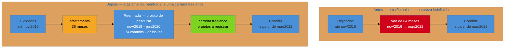

# Lacuna longa e reentrada

> [!abstract] TL;DR
> A [[03-Dominios/Carreira/Currículo/16 - A seção de experiência profissional|nota 16]] resolveu a lacuna de emprego na escala em que quase todo guia a trata — seis meses, um ano — com uma linha curta entre duas entradas. Este broto trata do que acontece quando a escala é de **anos**, e o primeiro achado é contraintuitivo: a evidência de campo mostra que o custo de callback se concentra nos **primeiros oito meses** de afastamento e depois praticamente estabiliza, o que significa que, passado o primeiro ano, gastar espaço do documento explicando a **duração** é gastar espaço no problema errado. A pergunta do leitor migrou: deixou de ser "o que aconteceu" e passou a ser "**você ainda opera?**". Disso saem quatro movimentos concretos, nesta ordem: **partir o vão** registrando o trabalho real que aconteceu dentro dele e nunca entrou no documento — o que é a [[03-Dominios/Carreira/Currículo/10 - Inventário de evidência|nota 10]] aplicada retroativamente, não maquiagem de datas; **separar o afastamento do que veio depois dele**, porque a data da reentrada encerra uma categoria e abre outra, e tratar intervalo entre contratos de freelance como continuação de um afastamento é um erro de categoria que o próprio candidato comete contra si; **nomear o tipo da pausa sem publicar o diagnóstico**, porque dado de saúde é dado sensível e o currículo é o artefato do seu sistema com menos controle sobre quem lê; e **deslocar o peso do documento para a prova de atualidade**, que é o que a pergunta real cobra. O que não cabe no papel migra para a conversa, e essa metade tem casa própria em [[03-Dominios/Carreira/Entrevistas/12a - Defender um hiato longo|Entrevistas/12a]].

## Quando a régua da nota 16 quebra

A nota 16 descreve o leitor diante de um intervalo de "seis meses ou um ano" carregando uma pergunta específica — *o que aconteceu nesse período, e por que não está aqui?* — e prescreve o remédio proporcional: uma linha curta, no mesmo lugar em que uma entrada normal apareceria, nomeando a razão sem detalhe pessoal desnecessário. Esse remédio é correto na escala em que foi prescrito, e é por isso que este broto existe em vez de uma correção na nota mãe: a prescrição não escala, e o motivo dela não escalar é interessante o bastante para virar capítulo.

Imagine um documento em que a última entrada de experiência termina em novembro de 2016 e a seguinte começa em março de 2022. São sessenta e quatro meses. A linha curta que a nota 16 recomenda — *"Pausa para cuidado de saúde (nov/2016–mar/2022)"* — continua sendo honesta, continua sendo melhor do que esconder, e ainda assim resolve muito menos do que resolvia no caso de onze meses. Ela responde "o que aconteceu" e deixa intacta uma segunda pergunta que, na escala de anos, passa a ser a que de fato decide: **a pessoa que voltou é a mesma profissional que saiu?** Cinco anos são tempo suficiente para uma stack inteira envelhecer, para o mercado mudar de formato de contratação, para as ferramentas de trabalho diário serem substituídas. O leitor não precisa ser hostil para fazer essa pergunta; ela é razoável.

> [!question]- Se a linha curta resolve menos, a saída é escrever mais sobre a lacuna?
> Não — e este é o erro que este broto existe para prevenir. A tentação natural é compensar a duração com explicação: mais texto, mais contexto, um parágrafo justificando os cinco anos. O efeito é o oposto do pretendido, porque cada palavra gasta explicando o vazio é uma palavra não gasta provando a competência atual, e o leitor está contando as duas coisas ao mesmo tempo. A saída certa é quase o inverso: **manter a declaração da lacuna curta como na nota 16, e realocar o espaço economizado para evidência de atualidade.**

## O que a evidência diz sobre duração

Vale ancorar essa intuição num dado de campo, porque ela contraria o que quase todo mundo assume. O estudo de Kory Kroft, Fabian Lange e Matthew Notowidigdo, publicado no *Quarterly Journal of Economics* em 2013, enviou currículos fictícios a vagas reais em cem cidades americanas e mediu a taxa de retorno em função do tempo de afastamento. A conclusão, na formulação do próprio resumo do trabalho, é que a probabilidade de receber um retorno cai significativamente com a duração do afastamento, **"com a maior parte dessa queda ocorrendo durante os primeiros oito meses"**.

A leitura apressada desse achado é pessimista: afastamento custa retorno, e custa muito. A leitura útil é outra, e está na segunda metade da frase. Se a maior parte do dano se acumula nos primeiros oito meses, então a curva **achata** depois disso — o vigésimo mês de afastamento não custa proporcionalmente mais do que o décimo, e o sexagésimo não custa proporcionalmente mais do que o vigésimo. Em termos práticos, para quem está escrevendo um currículo hoje com anos de vão no meio: **a duração já cobrou o que tinha para cobrar, e não há nada a fazer sobre ela.** O que ainda está em disputa, e o que o documento ainda pode mover, é a outra pergunta.

O mesmo estudo registra que a dependência de duração é **mais forte quando o mercado está aquecido** — o que faz sentido no mecanismo: quando há muitos candidatos empregados disponíveis, o tempo de afastamento vira um sinal barato de triagem; quando o mercado está frouxo, o mesmo sinal informa pouco, porque estar afastado deixa de distinguir uma pessoa das outras. Isso é útil como calibragem de expectativa, não como estratégia: ninguém escolhe o momento do ciclo em que precisa voltar a trabalhar.

> **Em uma frase:** acima de aproximadamente um ano, a duração da lacuna é um custo já pago e imóvel — o que o documento ainda controla é a prova de que a competência é atual.

## O primeiro movimento: partir o vão

Aqui está a operação mais concreta deste broto, e ela quase sempre é possível, porque quase ninguém passa anos inteiros sem produzir nada. O que costuma acontecer é diferente: a pessoa produziu, mas o que produziu não tinha o formato que ela reconhecia como "experiência" — não era CLT, não tinha crachá, não tinha empresa — e por isso nunca entrou no documento. A [[03-Dominios/Carreira/Currículo/10 - Inventário de evidência|nota 10]] já montou o inventário do que conta como evidência fora do vínculo formal; o que este broto acrescenta é que esse inventário deve ser passado **retroativamente sobre o período da lacuna**, e não só sobre o presente.

O efeito é estrutural, não cosmético. Um vão único de sessenta e quatro meses e uma trajetória com afastamento de trinta e seis meses seguida de uma retomada datada descrevem a mesma vida — mas produzem leituras diferentes, porque o vão único sugere ausência contínua e a segunda versão mostra uma carreira interrompida que retomou por conta própria antes de retomar com contrato.

> [!example] Caso real
> O currículo do autor deste vault tinha exatamente esse desenho: última entrada encerrando em **nov/2016** (Software Architect na Digidados) e a seguinte abrindo em **mar/2022** (Senior Full Stack na Conddiz) — um vão único de cinco anos e quatro meses, o maior da trajetória e o único grande o bastante para virar pergunta obrigatória em triagem.
>
> Dentro desse vão, porém, havia trabalho real que nunca tinha sido registrado: entre **nov/2019 e jun/2020**, um projeto de engenharia de dados para a pesquisa clínica de um pesquisador — migração de um banco Access e planilhas Excel para um schema MySQL de dezesseis tabelas containerizado, e a construção de um motor de relatórios configurável que passou a gerar vinte relatórios estatísticos por um comando, sobre um conjunto de 390 pacientes e 565 admissões. O trabalho está documentado em três repositórios privados com **74 commits** e **27 issues abertas e fechadas** — todas fechadas no encerramento —, coordenado de forma assíncrona com um cliente não técnico e remoto, em 2020.
>
> Registrar esse período faz duas coisas ao mesmo tempo, e a segunda é mais importante que a primeira. Encurta o afastamento de **64 para 36 meses** (nov/2016 → nov/2019), porque é ali que ele de fato termina. E, sobretudo, **marca a data da reentrada**: o trabalho que vem depois — outros projetos freelance, ainda não registrados no documento — pertence a outra categoria, e é a nota inteira que muda de assunto a partir daí. Nenhuma data foi alterada, nenhuma entrada foi inventada. Os repositórios são privados e não têm link público — o mesmo padrão de fonte já usado pelas notas [[03-Dominios/Carreira/Currículo/05 - Formato e legibilidade de máquina|05]] e [[03-Dominios/Carreira/Currículo/18 - Adaptar por vaga sem reescrever|18]] para ferramental do autor.

O diagrama torna visível o que a prosa custa a transmitir: o material é o mesmo, a honestidade é a mesma, e a leitura muda porque a estrutura mudou. É a mesma lógica que a nota 16 já aplicou às passagens curtas — agrupá-las sob um cabeçalho que nomeia o padrão apresenta o mesmo material de um jeito que já explica, na estrutura, o que aconteceu.

## Dois vãos parecidos, de naturezas opostas

Repare no que o caso acima faz com a metade final do período. Antes do registro do projeto, o documento tinha um bloco contínuo de sessenta e quatro meses, e a leitura natural de um bloco contínuo é que ele todo tem a mesma natureza — sessenta e quatro meses de ausência. Depois do registro, ficam visíveis **duas coisas diferentes que estavam empilhadas sob o mesmo silêncio**: trinta e seis meses de afastamento, e um período posterior que não é afastamento nenhum — é uma carreira freelance com os intervalos que uma carreira freelance tem.

Essa distinção é o achado mais fácil de perder deste broto, e o mais caro de perder, porque o erro que ela previne é cometido **pelo próprio candidato**, não pelo recrutador. Quem carrega um afastamento longo tende a estender o vocabulário do afastamento para tudo o que veio depois, e passa a tratar cada mês sem contrato como mais um pedaço da mesma ausência. Não é. Um intervalo entre dois clientes é o **ritmo normal** de quem trabalha por projeto: prospecção, proposta, negociação, entrega, e o vão até o próximo. Chamar isso de desemprego é defensável; chamar de afastamento é um erro de categoria que transforma o funcionamento normal de um modelo de trabalho em sintoma de um problema de saúde.

A consequência prática no documento é direta, e a nota 16 já tem a ferramenta pronta: a seção que trata de **PJ e freelance** existe justamente para exibir uma sequência de clientes sem que ela seja lida como instabilidade, e a de passagens curtas ensina a agrupar sob um cabeçalho que nomeia o padrão. Um período freelance bem registrado — *"Desenvolvedor independente (2020–2023)"*, seguido dos projetos e clientes — **não tem vão nenhum**: os intervalos entre contratos desaparecem por dentro da entrada, porque ninguém espera continuidade de contrato dentro de um período declaradamente autônomo. O vão só existe enquanto o período não foi nomeado.

> [!question]- Por que isso não é só uma questão de vocabulário?
> Porque muda o que o documento precisa provar. Um afastamento cobra prova de **atualidade** — a pergunta é se a competência sobreviveu ao tempo parado. Um período freelance cobra prova de **substância**: quem foram os clientes, que problema foi resolvido, e por que a sequência não é um amontoado de bicos. São duas seções diferentes do currículo, com dois tipos de bullet diferentes. Tratar as duas como o mesmo problema faz o candidato gastar o esforço no lugar errado — defendendo-se de uma suspeita de defasagem que só se aplica ao primeiro período, enquanto o segundo continua parecendo um buraco por falta de um cabeçalho que custaria uma linha.

> **Em uma frase:** um afastamento tem data de fim, e a data de fim é a reentrada — o que vem depois dela precisa de outro nome, outro cabeçalho e outro tipo de prova.

> [!warning] O limite que separa isto de fraude
> Partir o vão só é legítimo quando o trabalho **de fato existiu** e a entrada o descreve com o rótulo correto. Um projeto de pesquisa por conta própria entra como projeto de pesquisa — não como emprego, não com nome de empresa que não existiu, não com título inflado. A nota 16 já tem a seção que ensina a exibir vínculo não-CLT com precisão (PJ, freelance, agência), e a [[03-Dominios/Carreira/Currículo/15 - Quando não há número|nota 15]] já cravou a assimetria: um defeito de currículo custa a entrevista, um dado inventado custa o emprego depois de conquistado. Inventar entrada para tapar buraco é o caso mais caro dessa regra, não uma exceção a ela.

## O segundo movimento: nomear o tipo, não o diagnóstico

Quando o motivo do hiato é saúde, a decisão de escrita muda de natureza — deixa de ser uma escolha de espaço e passa a ser uma escolha sobre **que informação sobre você passa a circular sem o seu controle**. Vale desmontar isso pelo mecanismo, porque o argumento habitual ("não conte, pega mal") é fraco e trata a pessoa como quem tem algo a esconder.

O currículo é, de todos os artefatos do sistema descrito por este galho, o que tem **menos controle sobre a audiência**. Ele é anexado a formulários, ingerido por ATS, encaminhado por recrutadores a gestores que você nunca vai conhecer, salvo em pastas compartilhadas e mantido por tempo indeterminado em bases às quais você não tem acesso. Um diagnóstico escrito ali não é uma frase dita a uma pessoa específica num momento específico — é um dado clínico depositado num arquivo que você não consegue mais recolher.

Não é acaso que a legislação trate essa categoria à parte. A **LGPD** (Lei 13.709/2018, Art. 5º, II) classifica dado referente à saúde como **dado pessoal sensível**, na mesma categoria de origem racial, convicção religiosa e dado biométrico — uma espécie com regime de proteção mais estrito justamente porque revela aspecto íntimo e cria risco de discriminação. Colocar o próprio diagnóstico no currículo não é ilegal: é o titular abrindo mão voluntariamente da proteção que a lei construiu para aquele dado, num documento cuja circulação ele não controla.

A saída prática é a mesma da nota 16, com a régua deslocada um grau: **nomeie a categoria, não a condição**. "Afastamento por motivo de saúde" informa ao leitor tudo o que ele precisa para fechar a pergunta "o que aconteceu" — é uma razão legítima, socialmente inteligível, que não pede nenhum detalhe adicional para ser compreendida. "Afastamento para tratamento de [diagnóstico]" informa exatamente a mesma coisa para a decisão de contratação e acrescenta um dado sensível permanente ao arquivo. A diferença de valor informativo é zero; a diferença de exposição é total.

> [!question]- Isso não é esconder — exatamente o que a nota 16 diz para não fazer?
> Não, e a distinção é precisa. A nota 16 condena esconder o **intervalo** — comprimir datas, escrever ano sem mês, fazer o vão desaparecer —, porque isso troca uma pergunta em aberto por uma inconsistência, que é estruturalmente pior. Aqui o intervalo está declarado, com mês e ano, e a razão está nomeada. O que fica de fora é o **detalhe clínico**, que não é parte da informação que o leitor precisa e não muda nenhuma decisão que ele vai tomar. Reter detalhe irrelevante não é ocultação: é edição, e o galho inteiro é sobre edição.

Vale marcar o que este broto **não** está dizendo. Não está dizendo que a condição seja vergonhosa, nem que deva ser negada se perguntada, nem que a pessoa deva construir uma explicação vaga para desviar. A escolha de falar abertamente sobre a própria condição é legítima e, para muita gente, é parte de como ela quer aparecer no mundo — o ponto deste broto é apenas que **o currículo é o pior canal disponível para essa escolha**, porque é o único em que ela é irreversível e sem destinatário definido. A conversa é o canal certo, e é lá que a [[03-Dominios/Carreira/Entrevistas/12a - Defender um hiato longo|nota 12a de Entrevistas]] retoma o assunto.

## O terceiro movimento: provar atualidade

Fechada a declaração e partido o vão, sobra a pergunta que a evidência de duração deixou em pé — *você ainda opera?* — e é nela que o espaço economizado deve ser gasto. Três alavancas, em ordem de força:

**A entrada mais recente carrega o documento.** A [[03-Dominios/Carreira/Currículo/16 - A seção de experiência profissional|nota 16]] já estabeleceu a densidade decrescente: entradas recentes merecem mais espaço, antigas encolhem. Num currículo com hiato longo, essa regra deixa de ser estética e vira estratégica — a entrada pós-retorno é a prova principal, e deve ser a mais densa e a mais numérica do documento. Um bullet forte ali resolve mais do que qualquer parágrafo sobre o hiato resolveria.

**A seção de habilidades técnicas tem que ser do presente.** É onde a suspeita de defasagem se confirma ou se dissolve mais rápido, e é onde a [[03-Dominios/Carreira/Currículo/09 - Habilidades técnicas|nota 09]] já mandou aplicar a regra de lastro sem misericórdia. Numa trajetória com hiato, uma tecnologia listada que a pessoa só operou antes do afastamento é duplamente cara: falha no teste de lastro e ainda confirma a hipótese de defasagem que o leitor estava testando.

**Projeto próprio e contribuição pública valem mais aqui do que valeriam sem hiato.** A [[03-Dominios/Carreira/Currículo/17 - Projetos, portfólio e GitHub depois da IA|nota 17]] tratou do valor sinal de um projeto pessoal e do quanto a IA generativa o corroeu. Essa desvalorização é real, mas ela atinge o projeto genérico usado como substituto de experiência. Um projeto datado **dentro ou logo após** o hiato tem outra função e não sofre a mesma erosão: ele não está provando que a pessoa sabe programar, está provando **quando** ela estava programando. É evidência temporal, e evidência temporal com registro verificável — histórico de commits, issues, publicação — é exatamente o que a pergunta de atualidade pede.

## Armadilhas comuns

> [!warning] Explicar demais a lacuna
> **O que acontece:** a pessoa dedica um parágrafo, às vezes uma seção inteira, a justificar o período afastado, e o documento fica com mais texto sobre o que não aconteceu do que sobre o que aconteceu.
> **Por quê:** ansiedade de antecipação — quem carrega o hiato o vê como o fato central da própria trajetória, e superestima o quanto ele ocupa a cabeça de quem lê. O leitor gasta segundos ali; o candidato gastou anos.
> **Como evitar:** a declaração da lacuna longa não deve ser maior que a da lacuna curta da nota 16. Uma linha. O espaço extra vai para a prova de atualidade.

> [!warning] Ano sem mês para encurtar o vão visualmente
> **O que acontece:** o documento passa a listar só anos ("2016" … "2022"), na esperança de que o intervalo pareça menor.
> **Por quê:** é o mesmo reflexo que a nota 16 descreve no caso de onze meses, e falha pelo mesmo motivo — recrutadores reconhecem "ano sem mês" como sinal clássico de lacuna escondida. Num hiato de anos o disfarce é ainda mais inútil, porque o vão continua visível mesmo em granularidade anual, e agora acompanhado de um sinal de má-fé.
> **Como evitar:** meses explícitos em todas as entradas, sempre. A consistência do formato é o que dá credibilidade à declaração.

> [!warning] Registrar o trabalho do vão com rótulo inflado
> **O que acontece:** o projeto de reentrada entra no documento como se fosse vínculo formal — nome de empresa que não existiu, título de cargo que ninguém concedeu, período esticado para colar nas entradas vizinhas.
> **Por quê:** a operação de partir o vão funciona tão bem que gera a tentação de forçá-la além do que o material sustenta.
> **Como evitar:** o rótulo descreve o que foi — projeto de pesquisa, freelance, consultoria pontual, contribuição open source. A [[03-Dominios/Carreira/Currículo/15 - Quando não há número|nota 15]] vale integralmente aqui: este é o erro que explode depois da contratação, não antes.

> [!warning] Tratar o LinkedIn e o currículo com a mesma régua
> **O que acontece:** a pessoa replica no currículo a mesma seção de pausa que preencheu no LinkedIn, ou o contrário — deixa o LinkedIn com o vão cru porque decidiu ser breve no currículo.
> **Por quê:** os dois artefatos têm economias de espaço opostas, como a [[03-Dominios/Carreira/Currículo/23 - LinkedIn — o par que responde a busca|nota 23]] já estabeleceu. O LinkedIn é ilimitado e tem, desde 2022, um campo formal de *Career Break* com razão declarável; o currículo tem uma ou duas páginas disputadas.
> **Como evitar:** a pausa cabe com folga no LinkedIn e vai comprimida no currículo. Não é incoerência — é a mesma informação calibrada para dois canais com custos diferentes.

## O que o mercado mudou desde 2022

Um contrapeso honesto para fechar, porque este broto seria desonesto se pintasse o hiato como problema puramente resolvível por redação. Em março de 2022 o LinkedIn lançou um campo dedicado de **Career Break** no perfil, com razões declaráveis — parentalidade em tempo integral, luto, demissão, saúde e bem-estar, entre treze opções. A existência do campo importa menos pelo recurso em si e mais pelo que ela sinaliza: uma plataforma com centenas de milhões de perfis decidiu que a pausa merece um lugar nomeado na estrutura, em vez de um buraco entre dois cargos.

Os números que acompanharam o lançamento sustentam o gesto dos dois lados. Numa pesquisa do LinkedIn com 23 mil trabalhadores, **62% já tinham feito alguma pausa na carreira** — o que basta para dissolver a ideia de que se trata de uma anomalia individual. Ao mesmo tempo, **60% acreditam que o estigma ainda existe**, e, do lado de quem contrata, **46% dos gestores enxergam candidatos com pausa como um reservatório de talento subaproveitado**, enquanto **20% dizem que rejeitariam um candidato que tirou uma pausa**.

Esse último par de números é o retrato honesto da situação, e é por isso que ele fecha o broto em vez de abri-lo. Um em cada cinco gestores rejeita — o custo é real, não é paranoia de quem carrega o hiato. E quase metade enxerga oportunidade — o que significa que a triagem funciona nos dois sentidos, e que o mesmo documento que perde uma vaga por causa do vão ganha outra apesar dele. Escrever para agradar aos 20% que rejeitariam de qualquer forma custa exatamente o espaço que convenceria os 46%.

## Como soa em inglês

The one-line declaration belongs in the document; the reasoning belongs in the conversation. In writing, keep it to a labelled period — *"Career break — health (Nov 2016 – Mar 2022)"* — and let the entries around it carry the weight. If work happened inside the break, give it its own entry with an honest label: *"Independent research engineering project (Nov 2019 – Jun 2020)"* splits a single five-year gap into two shorter ones without moving a single date.

| PT | EN |
| --- | --- |
| lacuna / vão de emprego | employment gap |
| pausa na carreira | career break |
| hiato | hiatus |
| reentrada no mercado | return to work / re-entry |
| programa de reinserção | returnship |
| afastamento por motivo de saúde | health-related leave |
| dado pessoal sensível | sensitive personal data |
| taxa de retorno (do recrutador) | callback rate |
| defasagem técnica | skills gap / skills atrophy |
| prova de atualidade | proof of currency / recency signal |

## O que vem a seguir

Este broto tratou do que o **documento** faz com um hiato de anos: declara curto, parte o vão com trabalho real, nomeia o tipo sem publicar o diagnóstico e realoca o espaço para prova de atualidade. Nada disso responde à pergunta que o documento existe para gerar — e que, no caso do hiato longo, chega quase sempre, quase sempre cedo.

- [[03-Dominios/Carreira/Entrevistas/12a - Defender um hiato longo|Entrevistas/12a - Defender um hiato longo]] — **a outra metade deste tema**: o hiato declarado no papel vira pergunta na conversa, e lá a resposta tem estrutura própria, vocabulário próprio e um limite legal sobre o que pode ser perguntado.
- [[03-Dominios/Carreira/Currículo/19 - Declarar lacuna|19 - Declarar lacuna]] — a lacuna **técnica**, que é outro objeto: lá a ausência é de competência, aqui é de tempo. O mecanismo compartilhado é o de sempre — o documento sinaliza, a conversa explica.
- [[03-Dominios/Carreira/Currículo/17 - Projetos, portfólio e GitHub depois da IA|17 - Projetos, portfólio e GitHub depois da IA]] — a régua de valor sinal do projeto próprio, que este broto usa com função deslocada: aqui o projeto prova **quando**, não só **se**.

## Veja também

- [[03-Dominios/Carreira/Currículo/16 - A seção de experiência profissional|16 - A seção de experiência profissional]] — a nota mãe, com a lacuna curta, as passagens curtas, o vínculo PJ e a estrutura de cada entrada que este broto pressupõe sem repetir.
- [[03-Dominios/Carreira/Currículo/10 - Inventário de evidência|10 - Inventário de evidência]] — o inventário que este broto manda passar retroativamente sobre o período da lacuna.
- [[03-Dominios/Carreira/Currículo/09 - Habilidades técnicas|09 - Habilidades técnicas]] — a regra de lastro, que fica mais cara de violar quando há hiato no meio.
- [[03-Dominios/Carreira/Currículo/15 - Quando não há número|15 - Quando não há número]] — a assimetria de risco que impede a operação de partir o vão de escorregar para invenção.
- [[03-Dominios/Carreira/Currículo/23 - LinkedIn — o par que responde a busca|23 - LinkedIn — o par que responde a busca]] — o artefato onde a pausa cabe com folga, e onde existe campo formal para ela desde 2022.
- [[03-Dominios/Carreira/Currículo/index|Currículo]] — o índice do galho.

## Fontes

- **Kory Kroft, Fabian Lange e Matthew J. Notowidigdo** — [*Duration Dependence and Labor Market Conditions: Theory and Evidence from a Field Experiment*](https://www.nber.org/papers/w18387), *The Quarterly Journal of Economics* (2013); NBER Working Paper 18387. Experimento de campo com currículos fictícios enviados a vagas reais em cem cidades americanas. Fonte do achado central deste broto: a queda de retorno se concentra nos primeiros oito meses de afastamento, e a dependência de duração é mais forte em mercado aquecido. Resumo verificado na página do NBER em 2026-08-31.
- **LinkedIn** — [*LinkedIn Members Can Now Spotlight Career Breaks on Their Profiles*](https://www.linkedin.com/business/talent/blog/product-tips/linkedin-members-spotlight-career-breaks-on-profiles), março de 2022. Lançamento do campo de *Career Break* com treze razões declaráveis, e a pesquisa com 23 mil trabalhadores citada nesta nota (62% já fizeram pausa; 60% percebem estigma; 46% dos gestores veem talento subaproveitado; 20% rejeitariam).
- **Brasil** — [Lei 13.709/2018 (LGPD), Art. 5º, II](https://www.planalto.gov.br/ccivil_03/_ato2015-2018/2018/lei/l13709.htm). Define dado referente à saúde como **dado pessoal sensível**, base do argumento sobre por que o diagnóstico não pertence ao currículo.
- **Josenaldo Matos** — trajetória profissional própria, conferida contra a fonte canônica de períodos do autor: encerramento na Digidados em nov/2016, o projeto de pesquisa de nov/2019 a jun/2020, e o início na Conddiz em mar/2022. As métricas do projeto (74 commits, 27 issues fechadas, 20 relatórios, 16 tabelas, 390 pacientes e 565 admissões) foram medidas nos três repositórios privados em 2026-08-30, com comandos reproduzíveis; os repositórios são ferramental privado, sem link público. O recorte de **afastamento** vai de nov/2016 a nov/2019 e termina no projeto de pesquisa, que marca a reentrada; o período posterior é de trabalho freelance por projeto, com outros contratos ainda não registrados no documento — a distinção entre as duas naturezas foi confirmada pelo próprio autor em 2026-08-31 e é o que sustenta a seção "Dois vãos parecidos, de naturezas opostas".
