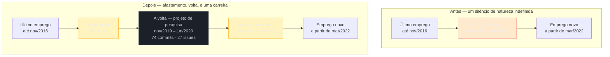

# Lacuna longa e reentrada

> [!abstract] TL;DR
> Quem passou anos fora não trava no currículo por falta de redação. Trava porque não sabe mais o que dizer que é — e um documento é sempre a resposta a três perguntas (**quem eu sou, o que eu fiz, para onde eu vou**) que ficaram sem resposta enquanto a vida acontecia. A boa notícia vem de um experimento de campo que mede o custo real do afastamento: a queda de retorno se concentra nos **primeiros oito meses** e depois praticamente para de piorar. Cinco anos fora não custam cinco vezes um ano fora. A duração é uma dívida congelada, e brigar com ela no papel é gastar espaço no problema errado. O que ainda está em jogo é outra coisa — e as três perguntas dão as três respostas. *O que eu fiz*: quase ninguém passa anos produzindo nada, mas quase todo mundo desqualifica o que produziu por não ter tido crachá — recuperar isso encurta o afastamento de verdade, sem mexer numa data sequer. *Quem eu sou*: o afastamento tem data de fim, e confundir o ritmo normal de uma carreira freelance com continuação de uma ausência é um erro que o próprio candidato comete contra si. *Para onde eu vou*: é aí que vai o espaço economizado, porque atualidade é o que o leitor realmente quer comprar. E existe uma bifurcação que quase nenhum guia apresenta: **declarar, curar ou preencher**. Um currículo que promete cronologia completa transforma qualquer período vazio em buraco; um que assume ser uma **seleção** não tem buraco nenhum, porque não prometeu completude — o vão é propriedade do documento, não da sua vida. O direito de curar, porém, é proporcional ao volume que você tem para omitir, e por isso a estratégia certa muda conforme o caso: quem voltou de uma pausa, quem se formou e nunca entrou, quem trabalhou fora da área, quem sumiu por uma década. Quando o motivo é saúde, uma regra extra: nomeie a categoria, nunca o diagnóstico. A metade falada deste tema mora em [[03-Dominios/Carreira/Entrevistas/12a - Defender um hiato longo|Entrevistas/12a]].

## Voltar não é a parte mais difícil

Existe um momento na volta que ninguém avisa que vai existir. Não é a entrevista. Não é o teste técnico às onze da noite. É mais cedo, e é mais banal do que qualquer um imagina: é a hora de abrir o documento e escrever a data.

Helena Braga passou três anos e meio fora. Voltou a programar sozinha, num projeto que ninguém pediu, antes de voltar a ser contratada por alguém. Quando finalmente sentou para refazer o currículo, tinha material de sobra — quinze anos de trabalho antes, um projeto próprio no meio, um emprego novo depois. O que ela não tinha era o que escrever entre **novembro de 2016** e **março de 2022**. O cursor pisca ali, entre a última linha de uma empresa e a primeira linha de outra, e cinco anos e quatro meses não cabem em nenhuma das duas.

A primeira coisa que ela fez foi o que quase todo mundo faz: escreveu um parágrafo explicando. Ficou defensivo. Apagou e escreveu um menor. Ficou evasivo. Apagou de novo e tentou uma frase só, que ficou seca a ponto de parecer que estava escondendo alguma coisa. Na quarta tentativa apagou tudo, deixou o vazio, e foi dormir mal.

O instinto de Helena estava certo: as quatro versões eram ruins mesmo. Mas ela errava o motivo. Achava que o problema era encontrar as palavras certas para explicar cinco anos, e passou a noite procurando uma redação melhor para uma pergunta que o leitor dela **já tinha parado de fazer**.

O que realmente a travava era outra coisa, e ela não conseguia nomear porque a coisa não tem cara de problema de currículo. Helena não sabia mais o que dizer que era. Arquiteta de software, como em 2016? Fazia seis anos que ela não desenhava um sistema para um time. Desenvolvedora sênior? Sênior em quê, se a stack que ela dominava tinha envelhecido? Freelancer? Ela nunca tinha se chamado assim, embora fosse exatamente o que vinha fazendo havia dois anos. O documento não saía porque a resposta não existia ainda — e nenhum guia de currículo do mundo ensina a escrever uma linha sobre uma identidade que a pessoa ainda não reconheceu como sua.

É por aí que este capítulo vai. Não pela redação da linha da lacuna, que é a parte fácil e cabe em oito palavras. Pela ordem inversa: descobrir o que aqueles anos fizeram de você, e só então escrever.

## A pergunta que o leitor já parou de fazer

Comece pela boa notícia, porque ela é contra-intuitiva e muda o tamanho do problema.

Em 2013, três economistas — Kory Kroft, Fabian Lange e Matthew Notowidigdo — publicaram no *Quarterly Journal of Economics* um experimento que quase todo mundo interpreta pela metade. Eles enviaram currículos fictícios a vagas reais em cem cidades americanas, variando uma coisa só: há quanto tempo o candidato estava fora. Depois contaram quantos retornos cada versão recebia.

O resultado que costuma ser citado é o pessimista: quanto mais tempo fora, menos retorno. Verdade. Mas a frase do trabalho tem uma segunda metade, e é nela que mora a informação útil — a queda acontece **"com a maior parte dessa queda ocorrendo durante os primeiros oito meses"**.

Leia de novo devagar, porque isso reescreve o problema de quem está há anos parado. A curva não desce para sempre. Ela despenca cedo e depois achata. O vigésimo mês não custa o dobro do décimo. O sexagésimo não custa três vezes o vigésimo. Quem está fora há cinco anos **não está cinco vezes pior** do que quem está fora há um — está aproximadamente igual, porque os dois já passaram do ponto em que o mercado parou de contar.

> Minha avó provavelmente me explicaria assim:
> 
> Meu fi, depois do oitavo mês, tanto faz, todo mundo é rejeitado do mesmo jeito.

Helena tinha passado anos tratando o próprio afastamento como uma dívida que crescia todo mês, e a cada mês sem trabalho sentia o buraco ficar mais fundo. Não estava. A dívida tinha congelado no primeiro ano e ficado ali, imóvel, enquanto ela sofria pelos quatro seguintes.

O alívio vem com uma consequência prática dura, e é ela que organiza o resto do capítulo: **se a duração já cobrou tudo o que tinha para cobrar, brigar com ela no papel é desperdício puro.** Cada palavra que Helena escrevesse explicando os cinco anos seria uma palavra a menos provando o que ela sabe fazer hoje — e o leitor está contando as duas coisas ao mesmo tempo, no mesmo punhado de segundos.

> [!question]- Então a lacuna não importa mais? Isso não é bom demais para ser verdade?
> Importa, mas não como as pessoas acham. O custo de triagem é real e já está pago — não dá para devolvê-lo com redação nenhuma. O que continua em aberto é uma pergunta diferente, que o estudo não mede porque ela não é sobre tempo: **a pessoa que voltou é a mesma profissional que saiu?** Seis anos bastam para uma stack envelhecer, para o mercado mudar de formato de contratação, para as ferramentas do dia a dia serem trocadas. Quem lê não precisa ser hostil para se perguntar isso. É uma pergunta razoável, e é a única sobre a qual o documento ainda tem poder.

O mesmo trabalho registra um detalhe que serve como calibragem de expectativa: o efeito é **mais forte quando o mercado está aquecido**. Faz sentido no mecanismo — quando há candidatos empregados de sobra, o tempo fora vira um filtro barato; quando o mercado aperta, o mesmo sinal informa pouco, porque deixa de distinguir uma pessoa das outras. Útil para entender o que está acontecendo. Inútil como estratégia, porque ninguém escolhe o ponto do ciclo econômico em que precisa voltar a trabalhar.

Fica então uma pergunta viva, e ela se desdobra nas três de sempre — as mesmas que travam qualquer currículo, só que aqui elas chegam com força total, porque anos fora apagam justamente as respostas: **o que eu fiz** nesse tempo, **quem eu sou** agora, e **para onde eu vou** daqui. As três próximas seções são essas três perguntas, nessa ordem — que não é a ordem em que elas angustiam, mas é a ordem em que elas se resolvem.

## O que eu fiz — e o que você não estava contando como trabalho

Helena tinha uma resposta pronta para o período: *não fiz nada*. Levou uma tarde inteira, e uma pergunta chata de uma amiga, para descobrir que era falso.

A amiga perguntou o que ela tinha feito em 2019. Nada, disse Helena. Nada mesmo? Bom, teve o sistema do consultório da irmã dela — mas aquilo não contava, era favor de família. E o site que ela fez para uma amiga fotógrafa, que também não contava, porque foi de graça. E os quatro meses ajudando um pesquisador a organizar dados de uma pesquisa, que não contavam porque não era emprego, não tinha contrato, não tinha crachá, não tinha nada que Helena reconhecesse como trabalho de verdade.

Eram quase dois anos de trabalho técnico, e ela os tinha classificado como "nada" — não por modéstia, mas porque o único formato que ela reconhecia como experiência era aquele com carteira assinada, nome de empresa e cargo concedido por alguém. A [[03-Dominios/Carreira/Currículo/10 - Inventário de evidência|nota 10]] já montou o inventário do que conta como evidência fora do vínculo formal. O que muda aqui é para onde você aponta esse inventário: não para o presente, e sim **para trás, sobre o próprio período que você chamou de vazio**.

Repare no que essa operação é de verdade. Não é maquiagem de datas, não é truque de formatação, e nem sequer é sobre o documento — é um **ato de reconhecimento**. A pessoa olha para um pedaço da própria vida que tinha etiquetado como ausência e descobre que havia trabalho ali. O currículo muda depois, como consequência. Primeiro muda o que ela sabe sobre si.

> [!example] Caso real
> O currículo do autor deste vault tinha exatamente o desenho que Helena viu na tela: última entrada encerrando em **nov/2016**, e a seguinte abrindo em **mar/2022**. Cinco anos e quatro meses de silêncio — o maior vão da trajetória, e o único grande o bastante para virar pergunta obrigatória em qualquer triagem.
>
> Só que dentro daquele silêncio havia um projeto inteiro que nunca tinha sido registrado. Entre **nov/2019 e jun/2020**, um trabalho de engenharia de dados para a pesquisa clínica de um pesquisador: migração de um banco Access e planilhas Excel para um schema MySQL de dezesseis tabelas containerizado, e um motor de relatórios configurável que passou a gerar vinte relatórios estatísticos por um comando, sobre 390 pacientes e 565 admissões. Três repositórios, **74 commits**, **27 issues abertas e fechadas** — todas fechadas no encerramento —, coordenado à distância com um cliente não técnico, em 2020.
>
> Registrar isso fez duas coisas, e a segunda é a que importa. Encurtou o afastamento de **64 para 36 meses**, porque é em nov/2019 que ele de fato termina. E, sobretudo, **datou a volta**: o trabalho que veio depois — outros projetos, ainda não registrados — pertence a outra categoria da vida, e o documento passa a dizer isso sozinho. Nenhuma data foi alterada. Nenhuma entrada foi inventada. Só parou de existir um trabalho invisível. Os repositórios são privados e não têm link público, no mesmo padrão de fonte já usado pelas notas [[03-Dominios/Carreira/Currículo/05 - Formato e legibilidade de máquina|05]] e [[03-Dominios/Carreira/Currículo/18 - Adaptar por vaga sem reescrever|18]] para ferramental do autor.



A mesma vida, os mesmos meses, nenhuma mentira — e duas leituras completamente diferentes. É a lógica que a [[03-Dominios/Carreira/Currículo/16 - A seção de experiência profissional|nota 16]] já usa para passagens curtas: apresentar o mesmo material sob uma estrutura que já explica, sozinha, o que aconteceu.

> [!warning] Onde isto vira fraude
> A operação só funciona quando o trabalho **existiu** e a entrada o descreve pelo nome certo. Projeto de pesquisa entra como projeto de pesquisa. Favor para a família entra como projeto pessoal, com o escopo real. Nada de empresa que não existiu, cargo que ninguém concedeu, período esticado para colar nas entradas vizinhas. A [[03-Dominios/Carreira/Currículo/15 - Quando não há número|nota 15]] já cravou a assimetria: um defeito de currículo custa a entrevista, um dado inventado custa o emprego **depois** de conquistado — e inventar entrada para tapar buraco é o caso mais caro dessa regra, não a exceção dela.

E vale dizer o óbvio, porque a angústia de quem lê costuma ser específica: isso não é privilégio de gente sênior. Um desenvolvedor júnior que passou o afastamento fazendo um bootcamp e publicando três projetos tem, proporcionalmente, **mais** a recuperar do que um arquiteto com quinze anos de estrada, porque a base de comparação dele é menor e cada evidência pesa mais. O inventário retroativo é a mesma operação em qualquer nível. O que muda é o tamanho do que se encontra.

## Quem eu sou — o vão que some quando ganha nome

Aqui está a parte que Helena levou mais tempo para enxergar, e é a que mais gente erra.

Depois de recuperar o projeto de 2019, o documento dela ficou com um afastamento de três anos e meio, uma volta datada — e ainda um pedaço de tempo depois disso, até o emprego novo, que continuava em branco. Helena olhou aquele segundo branco e sentiu a mesma vergonha do primeiro. Mais um buraco. Mais uma coisa a explicar.

Só que aquele segundo branco não era um buraco. Era a vida profissional dela.

Nos dois anos entre a volta e o emprego novo, Helena trabalhou. Pegou um cliente, entregou, ficou três meses sem nada, pegou outro, entregou, ficou dois meses procurando o seguinte. Isso não é ausência — é **o ritmo normal de quem trabalha por projeto**. Prospecção, proposta, negociação, entrega, e o vão até o próximo. Ninguém que trabalha assim fica ocupado cem por cento do tempo, e ninguém no mercado espera que fique.

Chamar aquele período de desemprego é defensável. Chamar de afastamento é um erro de categoria — e é um erro que **o próprio candidato comete contra si mesmo**, ninguém mais. O recrutador não fez isso. Helena fez, ao estender o vocabulário do afastamento para tudo que veio depois dele, como se a vida inteira a partir de 2016 fosse um único bloco de coisa faltando.

A correção não é de redação. É de identidade: **o afastamento tem data de fim, e essa data é a volta.** O que vem depois precisa de outro nome — e é justamente o nome que faz o problema desaparecer.

Porque olhe o que acontece quando o período ganha um cabeçalho. A nota 16 já ensina a exibir vínculo não-CLT sem que ele seja lido como instabilidade, e a mesma ferramenta resolve isto: uma entrada única, *"Desenvolvedora independente (2020–2023)"*, seguida dos clientes e do que foi entregue em cada um, **não tem vão nenhum dentro dela**. Os meses entre um contrato e outro somem, porque ninguém procura continuidade de contrato dentro de um período declaradamente autônomo. O silêncio de dois anos vira uma linha de trabalho de dois anos.

Nada mudou nos fatos. O vão só existia enquanto o período não tinha nome.

> [!question]- Por que isso não é só uma questão de vocabulário?
> Porque muda o que o documento tem que provar, e portanto onde você gasta o esforço. Um afastamento cobra prova de **atualidade** — a dúvida é se a competência sobreviveu ao tempo parado. Um período por projeto cobra prova de **substância** — quem foram os clientes, que problema foi resolvido, por que aquilo não é um amontoado de bicos. São dois tipos de bullet, em duas seções diferentes. Quem trata os dois como o mesmo problema passa meses se defendendo de uma suspeita de defasagem que só valia para o primeiro período, enquanto o segundo continua parecendo um buraco por falta de um cabeçalho que custaria uma linha.

## Declarar ou não declarar — a escolha que ninguém te apresenta

Até aqui este capítulo assumiu uma coisa que a maioria dos guias também assume sem discutir: que a pausa vai aparecer no documento, e que a única pergunta é como escrevê-la. Vale parar e desmontar essa premissa, porque ela é falsa — e o caminho alternativo é, para muita gente, o melhor dos dois.

Pense no que o seu currículo promete. Se ele é uma **cronologia completa** — todo emprego que você teve, em ordem, sem furos —, então um período sem entrada é um buraco, e buraco pede explicação. O leitor conta as datas porque o documento o convidou a contar. Mas se ele é uma **seleção declarada** — os projetos ou empregos que importam para esta vaga, e só eles —, não há buraco nenhum a explicar, porque não havia promessa de completude para quebrar. A ausência de 2017 tem exatamente o mesmo peso da ausência de todos os outros trabalhos que você deixou de fora: nenhum.

O vão, então, não é uma propriedade da sua vida. É uma propriedade do tipo de documento que você escreveu.

> [!example] Caso real
> O autor deste vault decidiu **não colocar a pausa no currículo**, e o raciocínio dele é o argumento inteiro desta seção em três frases. A carreira tem mais de vinte anos e dezenas de projetos; colocar tudo seria um erro de documento antes de ser um erro de estratégia, então já era obrigatório selecionar. Se apenas três projetos entram e dezenas ficam de fora, gastar uma linha explicando um período em que não houve projeto nenhum é gastar espaço com o que ele **não** quer mostrar, num documento onde nem tudo o que ele quer mostrar coube.
>
> O documento passou a ter cara do que é: uma seleção curada dos trabalhos mais importantes e mais recentes. E a informação que ficou de fora não foi destruída — foi **empurrada para outra camada**. Quem quiser o histórico completo encontra no site pessoal, com detalhamento por experiência. E quem for além disso encontra, no blog, textos em que o autor fala abertamente sobre a doença. A lógica é a de quem se abre na proporção do interesse do outro: se um leitor se aprofundou a ponto de ler o blog, ele já quis saber — e aí, sim, se fala da pausa.

O mecanismo por trás dessa decisão tem nome, e é generalizável: **divulgação em camadas**. Cada camada é escolhida pelo leitor, não empurrada por você.

| Camada | O que ela entrega | Quem chega até ela |
| --- | --- | --- |
| Currículo | a seleção — o que você quer que decidam por | todo mundo, em segundos |
| LinkedIn | a trajetória, com espaço para contexto e um campo próprio para a pausa | quem foi conferir |
| Site ou portfólio *(opcional)* | o histórico completo, com detalhe por experiência | quem se interessou de verdade |
| Blog, texto pessoal, conversa | a história — incluindo, se você quiser, o motivo real | quem já decidiu que quer te conhecer |

A elegância disso é que a transparência não diminui: ela é **reordenada**. Ninguém está escondendo nada de ninguém — o material está publicado, acessível, assinado. O que muda é que a pausa deixa de disputar espaço com a competência no único artefato onde o espaço é escasso, e passa a estar disponível exatamente para quem foi procurá-la.

E vale desarmar de imediato a objeção mais provável, porque ela quase sempre vem: *"mas eu não tenho site"*. A maioria dos desenvolvedores não tem, e isso não invalida nada. Site pessoal é um **amplificador**, não um requisito — quem tem ganha uma camada rica e sob controle próprio, quem não tem já possui a camada seguinte de graça, porque o LinkedIn é ilimitado em espaço, praticamente universal, e tem desde 2022 um campo formal para a pausa. A cadeia funciona com currículo e LinkedIn apenas.

> [!important] Para carreira longa, selecionar não é estratégia — é obrigação
> Aqui está o ponto que reorganiza esta seção inteira, e que quase todo guia inverte. Um currículo tem uma ou duas páginas. Quem tem vinte anos de estrada e trinta projetos **não pode** listar tudo, sob nenhuma hipótese, com pausa ou sem pausa. A seleção já está acontecendo — ela é imposta pelo tamanho do documento, não escolhida por conveniência.
>
> Isso muda o enquadramento da decisão. O veterano não está decidindo *se* vai curar; ele já está curando dezenas de trabalhos para fora. A única pergunta que resta é se a pausa merece uma das poucas linhas que sobraram — e, colocada assim, ela quase se responde: se um projeto de dois anos que deu certo ficou de fora por falta de espaço, é difícil justificar que um período sem projeto nenhum entre no lugar dele.

> [!warning] Quando a estratégia de seleção **não** funciona
> Duas condições sustentam a curadoria, e ela falha sem qualquer uma das duas.
>
> **Primeira: você precisa ter o que omitir.** O direito de curar é proporcional ao volume. Vinte anos de carreira com trinta projetos tornam a seleção natural — ninguém espera completude de quem tem tanto, e a omissão passa despercebida porque é obviamente necessária. Três anos de carreira com dois empregos não escondem nada: ali, a seleção *é* o histórico, e o vão aparece do mesmo jeito. É por isso que esta estratégia serve a Helena e ao autor deste vault, e **não** serve ao Éverton da próxima seção.
>
> **Segunda: o documento precisa declarar que é seleção.** É esta condição que faz o trabalho pesado, e ela custa uma palavra. Um cabeçalho `Projetos selecionados` ou `Experiência relevante` avisa ao leitor que ele está diante de um recorte, e ninguém procura buraco num recorte. Uma seção chamada `Experiência profissional`, em ordem cronológica reversa, promete completude mesmo que você não tenha querido prometer — e é a promessa, não a omissão, que cria o buraco.
>
> E há contextos em que a curadoria não se aplica, independentemente das duas condições: formulários que pedem histórico completo, concursos e processos públicos, empresas que reconstroem a cronologia dentro do próprio ATS, e mercados onde a cronologia integral é expectativa cultural — a [[03-Dominios/Carreira/Currículo/24 - Mercados, e o Brazilian Cultural Bug|nota 24]] trata dessas diferenças.

Com isso na mesa, a decisão deixa de ser um dilema moral e vira uma escolha de projeto, com três opções e critérios claros:

| Estratégia | Como fica no papel | Quando escolher |
| --- | --- | --- |
| **Declarar** | uma linha rotulada entre as entradas: *"Pausa na carreira — saúde (nov/2016 – nov/2019)"* | carreira curta, documento cronológico, ou pausa entre dois empregos formais que o leitor vai notar de qualquer jeito |
| **Curar** | nenhuma linha sobre a pausa; cabeçalho de seleção, e um link para onde há mais (site, se houver; LinkedIn, sempre) | carreira longa — onde a seleção já é obrigatória por falta de espaço — e vaga que não exige histórico completo |
| **Preencher** | uma entrada real para o trabalho do período, com o rótulo honesto dele | houve trabalho no meio da pausa — e aí esta é sempre a melhor das três, e pode ser combinada com as outras duas |

Note que a terceira não compete com as outras: se existe trabalho para registrar, registre, independentemente de declarar ou curar. É a operação da seção *"O que eu fiz"*, e ela é sempre ganho.

### Como redigir, literalmente

Quatro linhas prontas, para copiar e adaptar. A primeira é a declaração seca, a segunda transforma o período em evidência, a terceira é o cabeçalho que autoriza a curadoria, a quarta é a ponte para a camada seguinte.

```
Pausa na carreira — saúde (nov/2016 – nov/2019)

Estudo intensivo e projetos próprios (fev/2018 – set/2019)
Três projetos publicados, com foco em sistemas distribuídos — github.com/usuario

PROJETOS SELECIONADOS
(em vez de "Experiência profissional")

Histórico completo: seudominio.com.br/experiencias
   (sem site, use o LinkedIn — linkedin.com/in/seu-usuario)
```

Duas regras de redação valem para todas elas. **Rotule o período, não a si mesmo** — *"Pausa na carreira"* descreve um intervalo, *"Fiquei desempregado"* descreve uma pessoa, e a segunda versão gruda. E **não peça desculpa em lugar nenhum**: nada de "infelizmente", "tive que", "por motivos pessoais infelizmente precisei". A linha honesta e neutra é sempre mais forte que a linha honesta e humilde.

## A parte que não vai no papel

Quando o motivo do afastamento é saúde, aparece uma decisão que não é sobre espaço e nem sobre vergonha. É sobre **quem vai poder ler aquilo, e por quanto tempo**.

O currículo é, de tudo o que este galho descreve, o artefato com **menos controle sobre a audiência**. Ele é anexado a formulários, ingerido por ATS, encaminhado por recrutadores a gestores que você nunca vai conhecer, salvo em pastas compartilhadas, mantido por prazo indeterminado em bases às quais você não tem acesso. Um diagnóstico escrito ali não é uma frase dita a uma pessoa num momento — é um dado clínico depositado num arquivo que você não consegue mais recolher.

Não é acaso que a lei trate essa categoria à parte. A **LGPD** (Lei 13.709/2018, Art. 5º, II) classifica dado referente à saúde como **dado pessoal sensível**, junto com origem racial, convicção religiosa e dado biométrico — proteção mais estrita justamente porque revela aspecto íntimo e cria risco de discriminação. Escrever o próprio diagnóstico no currículo não é ilegal. É abrir mão, voluntariamente e para sempre, da proteção que a lei construiu em torno daquele dado.

A regra prática cabe em cinco palavras: **nomeie a categoria, não a condição.**

*"Afastamento por motivo de saúde"* entrega ao leitor tudo o que ele precisa para fechar a pergunta. É uma razão legítima, socialmente inteligível, que não pede nenhum detalhe para ser compreendida. *"Afastamento para tratamento de [diagnóstico]"* entrega exatamente a mesma informação para a decisão de contratar, e acrescenta um dado sensível permanente ao arquivo. O ganho informativo é zero. O custo de exposição é integral.

E fique claro o que **não** está sendo dito aqui. Ninguém está sugerindo que a condição seja vergonhosa, que deva ser negada se perguntada, ou que a pessoa construa uma vaguidão para desviar. Falar abertamente sobre a própria saúde é uma escolha legítima e, para muita gente, é parte de como ela quer existir no mundo. O ponto é mais estreito e mais técnico: **o currículo é o pior canal disponível para essa escolha**, porque é o único em que ela é irreversível e sem destinatário definido. A conversa é o canal certo, e é lá que [[03-Dominios/Carreira/Entrevistas/12a - Defender um hiato longo|Entrevistas/12a]] pega o assunto de volta.

> [!question]- Isso não é esconder — justamente o que a nota 16 manda não fazer?
> Não, e a diferença é precisa. A nota 16 condena esconder o **intervalo**: comprimir datas, escrever ano sem mês, fazer o vão sumir. Isso troca uma pergunta em aberto por uma inconsistência, que é bem pior. Aqui o intervalo está declarado, com mês e ano, e a razão está dita. Fica de fora o **detalhe clínico**, que não é parte da informação de que o leitor precisa e não muda nenhuma decisão que ele vá tomar. Reter detalhe irrelevante não é ocultação. É edição — e o galho inteiro trata de edição.

## Para onde eu vou — e por que é aqui que o espaço economizado vai

Sobrou a pergunta que o estudo dos oito meses deixou de pé: *você ainda opera?* Ela é sobre o futuro, não sobre o passado, e é a única sobre a qual o documento ainda tem poder real. Três alavancas, em ordem de força.

**A entrada mais recente carrega o documento inteiro.** A nota 16 já estabeleceu a densidade decrescente — o recente ganha espaço, o antigo encolhe. Num currículo com anos de vão, isso deixa de ser regra de diagramação e vira estratégia: a entrada pós-volta é a prova principal, e deve ser a mais densa e a mais numérica de todas. Um bullet forte ali vale mais do que qualquer parágrafo sobre o afastamento valeria.

**A seção de habilidades técnicas precisa ser do presente.** É onde a suspeita de defasagem se confirma ou se dissolve em três segundos, e onde a [[03-Dominios/Carreira/Currículo/09 - Habilidades técnicas|nota 09]] já mandou aplicar a regra de lastro sem piedade. Numa trajetória com hiato, listar uma tecnologia que você só operou antes de sair sai duplamente caro: falha no teste de lastro **e** confirma exatamente a hipótese que o leitor estava testando.

**Projeto próprio vale mais aqui do que valeria sem hiato.** A [[03-Dominios/Carreira/Currículo/17 - Projetos, portfólio e GitHub depois da IA|nota 17]] mostrou como a IA generativa corroeu o valor sinal do projeto pessoal. Essa desvalorização é real — mas atinge o projeto genérico usado como substituto de experiência. Um projeto **datado dentro ou logo depois** do afastamento faz outra coisa: ele não está provando que você sabe programar, está provando **quando** você estava programando. É evidência temporal. E evidência temporal com registro verificável — commits, issues, publicação — é literalmente a resposta à pergunta que ficou de pé.

> **Em uma frase:** a duração é dívida congelada e não se paga com redação; o que o documento ainda compra é a prova de que a competência é de agora.

## Nem todo vão é o vão da Helena

Helena tinha uma carreira inteira antes da pausa, trabalho recuperável dentro dela e um emprego novo depois. É um caso confortável — e é por isso que ele não pode ser o único. Três pessoas com vãos parecidos no papel e problemas completamente diferentes por baixo.

### Éverton — formou-se e nunca entrou

Éverton Sales terminou Análise e Desenvolvimento de Sistemas há quatro anos. Desde então, nada na área. O currículo dele tem a formatura no topo, com a data de 2022 gritando, e abaixo dela um espaço em branco de quatro anos.

O primeiro erro é de diagnóstico, e é dele mesmo: Éverton acha que tem uma lacuna. Não tem. Lacuna é interrupção de uma coisa que existia — ele nunca começou. E isso importa porque a pergunta do leitor é outra, e é mais dura: não é *o que aconteceu nesse período*, é **por que ninguém te contratou ainda?** Essa pergunta é venenosa porque não é sobre tempo, é sobre reputação — o leitor supõe que outros já avaliaram Éverton e disseram não.

A estratégia inverte o eixo do documento. Enquanto o currículo for cronológico, ele grita a data da formatura e a distância desde então. **Pare de datar a identidade e comece a datar o trabalho.** Um currículo orientado a projeto abre com `PROJETOS`, não com formação: dois ou três trabalhos com data dos últimos doze meses, cada um com o que foi construído, com que tecnologia, e o link. A formação desce para uma linha no rodapé, onde ninguém faz conta. O leitor que abre esse documento vê alguém que programou no mês passado — e a pergunta sobre 2022 nem chega a se formar.

Repare também que a estratégia de curadoria da seção anterior **não está disponível** para Éverton. Ele não tem trinta projetos para omitir três. O direito de curar é proporcional ao volume, e o volume dele é pequeno: qualquer seleção que ele faça é o histórico inteiro.

E aqui a parte que um capítulo honesto tem obrigação de dizer: **para Éverton, o currículo é o menor dos problemas.** Nenhuma redação resolve a falta de trabalho recente e verificável. O que resolve é produzir esse trabalho — um projeto real com usuário de verdade, uma contribuição a um projeto aberto, um freelance pequeno, um sistema para o comércio da esquina. Três meses gerando evidência valem mais que quatro anos aperfeiçoando a explicação. Se ele trabalhou em outra coisa nesses quatro anos, isso também entra — e é o próximo caso.

### Sandro — trabalhou, mas não com software

Sandro Meireles passou dois anos no quiosque do pai, na praia. Atendeu, cuidou do caixa, controlou estoque, brigou com fornecedor. Quando sentou para refazer o currículo de desenvolvedor, deixou os dois anos em branco, porque "não tinha nada a ver".

Sandro está deletando a melhor coisa que tem para aquele período.

Isso não é lacuna. É **emprego em outro setor** — e a única dúvida que o período levanta na cabeça de quem lê é se ele ficou parado. A resposta é não, e ela cabe em uma linha. Uma linha que custa quase nada de espaço e fecha a cronologia inteira:

```
Negócio familiar — quiosque, Praia do Francês (jan/2021 – dez/2022)
Atendimento, caixa e controle de estoque.
```

Curta, no fim da seção, sem bullets, sem competir com as entradas técnicas. Ela não está vendendo nada — está encerrando uma pergunta.

> [!warning] A tentação de traduzir para "competência transferível"
> O impulso seguinte é inflar: *"Gestão de operações de varejo com foco em experiência do cliente e otimização de cadeia de suprimentos"*. Não faça. Qualquer entrevistador fura isso na primeira pergunta de acompanhamento, e o que sobra não é um bullet fraco — é a suspeita de que o resto do documento também está inflado, exatamente a assimetria que a [[03-Dominios/Carreira/Currículo/15 - Quando não há número|nota 15]] descreve. Se houver algo concreto e defensável naqueles dois anos, ele cabe em meia linha factual e sem adjetivo. O valor principal daquela entrada não é competência transferida. É continuidade.

### Wilson — dez anos longe, e quer voltar

Wilson Prates programou até 2014. Depois foi fazer outra coisa, por mais de dez anos, e agora quer voltar. O currículo dele começa pelos onze anos de experiência técnica que ele acumulou até 2014 — e é aí que ele perde o leitor.

O problema não é a duração. É que, passada uma década, a experiência antiga **deixou de ser prova de capacidade atual**. Ela ainda prova algo valioso, e Wilson não deve descartá-la: prova que ele já foi capaz de aprender coisas difíceis e sustentar sistemas de verdade. Mas não prova que ele opera hoje, e um documento que lidera com ela soa como alguém vendendo o próprio passado.

A estratégia é inverter o documento. O recente vem primeiro, mesmo que seja pequeno e recém-feito; o histórico desce e comprime, num bloco curto que mostra profundidade sem fingir atualidade:

```
EXPERIÊNCIA ANTERIOR
Desenvolvedor e analista de sistemas (2003–2014) — Empresa A, Empresa B, Empresa C.
Sistemas corporativos em Java e Delphi, bancos relacionais, equipes de 5 a 12 pessoas.
```

Três linhas para onze anos. Parece pouco e é exatamente certo: o bloco existe para dizer "há profundidade aqui", não para disputar atenção com o que Wilson fez neste semestre.

E, como no caso de Éverton, a verdade desconfortável: **para Wilson, o currículo é o último problema, não o primeiro.** A atualidade precisa ser fabricada antes de ser escrita, e isso leva meses. Os caminhos que funcionam são conhecidos — um programa de reinserção (o mercado internacional os chama de *returnship*, e eles existem justamente para este caso), uma certificação recente que obrigue prática e não só leitura, um projeto próprio publicado, um freelance de escopo pequeno, contribuição a projeto aberto. Vale ainda estreitar o alvo: voltar "para TI" é uma meta grande demais, enquanto voltar para um nicho onde o conhecimento antigo ainda paga — um domínio de negócio que ele conhece por dentro, um sistema legado na tecnologia que ele dominava — encurta a distância pela metade.

### O quadro, lado a lado

| Situação | O que o leitor realmente pergunta | Movimento principal |
| --- | --- | --- |
| **Helena** — carreira longa, pausa, volta | você ainda opera? | recuperar o trabalho do período e datar a volta |
| **Éverton** — formou-se, nunca entrou | por que ninguém te contratou ainda? | datar o trabalho, não a formatura; e produzir trabalho recente |
| **Sandro** — trabalhou fora da área | você ficou parado? | uma linha factual que fecha a cronologia, sem inflar |
| **Wilson** — dez anos longe | isso que você sabia ainda existe? | inverter o documento e fabricar atualidade antes de escrever |
| **Carreira longa por projeto** | *(não pergunta nada)* | curar a seleção e empurrar o histórico para a camada seguinte |

A última linha é a do autor deste vault, e ela fecha o argumento das duas seções: quando o documento assume abertamente que é uma seleção, o leitor para de contar datas — e a pergunta que este capítulo inteiro tenta responder simplesmente não é feita.

## Quatro maneiras de estragar isso

> [!warning] Explicar demais
> Helena escreveu quatro versões daquele parágrafo antes de entender que nenhuma serviria. O reflexo é universal: quem carrega o afastamento o vê como o fato central da própria vida e superestima brutalmente o quanto ele ocupa a cabeça de quem lê. O leitor gasta segundos ali. O candidato gastou anos. **A declaração de um afastamento de cinco anos não deve ser maior que a de um de onze meses.** Uma linha. O espaço sobrando vai para a prova de atualidade.

> [!warning] Ano sem mês, para o vão parecer menor
> O documento passa a listar só anos — "2016" … "2022" — na esperança de que o intervalo encolha visualmente. Não encolhe: recrutadores reconhecem "ano sem mês" como sinal clássico de lacuna escondida, e num afastamento de anos o vão continua visível mesmo assim, agora acompanhado de um sinal de má-fé. **Meses explícitos em todas as entradas, sempre.** É a consistência do formato que dá credibilidade à declaração.

> [!warning] Estender o afastamento até hoje
> O erro que Helena quase cometeu, e o mais invisível dos quatro: aplicar o vocabulário e o tom do afastamento a **todo** intervalo posterior, inclusive aos meses entre contratos de uma carreira por projeto. O efeito é o oposto do pretendido — transforma o funcionamento normal de um modelo de trabalho em sintoma, e sugere um problema onde ninguém tinha visto nenhum. **Saiba onde o afastamento termina, e pare ali.**

> [!warning] Copiar o currículo no LinkedIn (ou o contrário)
> Os dois artefatos têm economias de espaço opostas, como a [[03-Dominios/Carreira/Currículo/23 - LinkedIn — o par que responde a busca|nota 23]] já estabeleceu. O LinkedIn é ilimitado e tem, desde 2022, um campo formal de *Career Break* com razão declarável; o currículo tem uma ou duas páginas disputadas linha a linha. **A pausa cabe com folga num e vai comprimida no outro.** Não é incoerência — é a mesma informação calibrada para dois canais com custos diferentes.

## Você não é uma anomalia

Vale fechar com o retrato honesto do mercado, porque este capítulo seria desonesto se sugerisse que tudo se resolve com redação e reconhecimento.

Em março de 2022 o LinkedIn criou um campo dedicado de **Career Break** no perfil, com treze razões declaráveis — parentalidade em tempo integral, luto, demissão, saúde e bem-estar, entre outras. O recurso em si importa menos do que o gesto: uma plataforma com centenas de milhões de perfis decidiu que a pausa merece um lugar com nome, em vez de um buraco entre dois cargos.

Os números que acompanharam o lançamento sustentam a decisão dos dois lados. Numa pesquisa do LinkedIn com 23 mil trabalhadores, **62% já tinham feito alguma pausa na carreira**. Sessenta e dois por cento. O que Helena vivia como defeito pessoal é a experiência da maioria — e é bom que isso seja dito com número, porque quem está do lado de dentro do afastamento jura que é o único.

Ao mesmo tempo, **60% acham que o estigma continua existindo**. E, do lado de quem contrata, **46% dos gestores enxergam candidatos com pausa como um reservatório de talento subaproveitado**, enquanto **20% dizem que rejeitariam alguém que tirou uma pausa**.

Esse último par é o retrato exato da situação. Um em cada cinco rejeita — o custo é real, não é paranoia de quem carrega o vão. E quase metade enxerga oportunidade — o que significa que a triagem corta nos dois sentidos, e que o mesmo documento que perde uma vaga por causa do afastamento ganha outra apesar dele. Escrever para agradar aos 20% que rejeitariam de qualquer jeito custa precisamente o espaço que convenceria os 46%.

Helena reescreveu o currículo em uma tarde, depois de três anos evitando o assunto. A parte difícil nunca tinha sido a redação. Foi descobrir que ela tinha trabalhado em 2019, que era freelancer desde 2020, e que a única coisa que faltava no documento era alguém disposto a dizer isso em voz alta.

## Como soa em inglês

A declaração cabe no documento; o raciocínio pertence à conversa. No papel, um período rotulado e nada mais — *"Career break — health (Nov 2016 – Mar 2022)"* — e as entradas em volta carregando o peso. Se houve trabalho dentro do período, ele ganha entrada própria com rótulo honesto: *"Independent research engineering project (Nov 2019 – Jun 2020)"* encurta um afastamento de cinco anos sem mover uma única data.

| PT | EN |
| --- | --- |
| lacuna / vão de emprego | employment gap |
| pausa na carreira | career break |
| hiato | hiatus |
| reentrada no mercado | return to work / re-entry |
| programa de reinserção | returnship |
| afastamento por motivo de saúde | health-related leave |
| dado pessoal sensível | sensitive personal data |
| taxa de retorno (do recrutador) | callback rate |
| defasagem técnica | skills gap / skills atrophy |
| prova de atualidade | proof of currency / recency signal |

## O que vem a seguir

O documento de Helena ficou pronto num fim de tarde. O que não ficou pronto foi a conversa — porque um afastamento declarado no papel vira pergunta na boca de alguém, quase sempre, e quase sempre cedo.

- [[03-Dominios/Carreira/Entrevistas/12a - Defender um hiato longo|Entrevistas/12a - Defender um hiato longo]] — **a outra metade**: a pergunta chega na triagem, e a resposta tem estrutura própria, vocabulário próprio e um limite legal sobre o que a empresa pode perguntar.
- [[03-Dominios/Carreira/Currículo/19 - Declarar lacuna|19 - Declarar lacuna]] — a lacuna **técnica**, que é outro bicho: lá falta competência, aqui faltou tempo. O mecanismo comum é o de sempre — o documento sinaliza, a conversa explica.
- [[03-Dominios/Carreira/Currículo/17 - Projetos, portfólio e GitHub depois da IA|17 - Projetos, portfólio e GitHub depois da IA]] — o valor sinal do projeto próprio, com a função deslocada que este capítulo usa: provar **quando**, não só **se**.

## Veja também

- [[03-Dominios/Carreira/Currículo/16 - A seção de experiência profissional|16 - A seção de experiência profissional]] — a nota mãe, com a lacuna curta, as passagens curtas, o vínculo PJ e a estrutura de entrada que este capítulo pressupõe.
- [[03-Dominios/Carreira/Currículo/10 - Inventário de evidência|10 - Inventário de evidência]] — o inventário que aqui se aplica para trás, sobre o período que você chamou de vazio.
- [[03-Dominios/Carreira/Currículo/09 - Habilidades técnicas|09 - Habilidades técnicas]] — a regra de lastro, mais cara de violar quando há hiato no meio.
- [[03-Dominios/Carreira/Currículo/15 - Quando não há número|15 - Quando não há número]] — a assimetria de risco que impede o reconhecimento de escorregar para invenção.
- [[03-Dominios/Carreira/Currículo/23 - LinkedIn — o par que responde a busca|23 - LinkedIn — o par que responde a busca]] — onde a pausa cabe com folga, e onde existe campo formal para ela desde 2022.
- [[03-Dominios/Carreira/Currículo/index|Currículo]] — o índice do galho.

## Fontes

- **Kory Kroft, Fabian Lange e Matthew J. Notowidigdo** — [*Duration Dependence and Labor Market Conditions: Theory and Evidence from a Field Experiment*](https://www.nber.org/papers/w18387), *The Quarterly Journal of Economics* (2013); NBER Working Paper 18387. Experimento de campo com currículos fictícios enviados a vagas reais em cem cidades americanas. Fonte do achado central deste capítulo — a queda de retorno se concentra nos primeiros oito meses, e o efeito é mais forte em mercado aquecido. Resumo verificado na página do NBER em 2026-08-31.
- **LinkedIn** — [*LinkedIn Members Can Now Spotlight Career Breaks on Their Profiles*](https://www.linkedin.com/business/talent/blog/product-tips/linkedin-members-spotlight-career-breaks-on-profiles), março de 2022. Lançamento do campo de *Career Break* com treze razões declaráveis, e a pesquisa com 23 mil trabalhadores citada aqui (62% já fizeram pausa; 60% percebem estigma; 46% dos gestores veem talento subaproveitado; 20% rejeitariam).
- **Brasil** — [Lei 13.709/2018 (LGPD), Art. 5º, II](https://www.planalto.gov.br/ccivil_03/_ato2015-2018/2018/lei/l13709.htm). Define dado referente à saúde como **dado pessoal sensível** — base do argumento sobre por que o diagnóstico não pertence ao currículo.
- **Josenaldo Matos** — trajetória própria, conferida contra a fonte canônica de períodos do autor: encerramento em nov/2016, projeto de pesquisa de nov/2019 a jun/2020, emprego novo em mar/2022. As métricas do projeto (74 commits, 27 issues fechadas, 20 relatórios, 16 tabelas, 390 pacientes, 565 admissões) foram medidas nos três repositórios privados em 2026-08-30, com comandos reproduzíveis; os repositórios são ferramental privado, sem link público. O **afastamento** vai de nov/2016 a nov/2019 e termina no projeto, que marca a reentrada; o período seguinte é de trabalho por projeto, com outros contratos ainda não registrados — distinção confirmada pelo autor em 2026-08-31, e origem da seção "Quem eu sou".
- **Helena Braga, Éverton Sales, Sandro Meireles e Wilson Prates** são personagens fictícios, criados para este capítulo — respectivamente: quem voltou depois de um afastamento longo, quem se formou e não entrou no mercado, quem trabalhou fora da área, e quem passou mais de uma década longe. As situações são reais e recorrentes, e três delas foram sugeridas ao autor deste vault a partir de pessoas conhecidas; **os nomes, as datas e os detalhes foram trocados**, e nenhuma pessoa real está descrita aqui.
