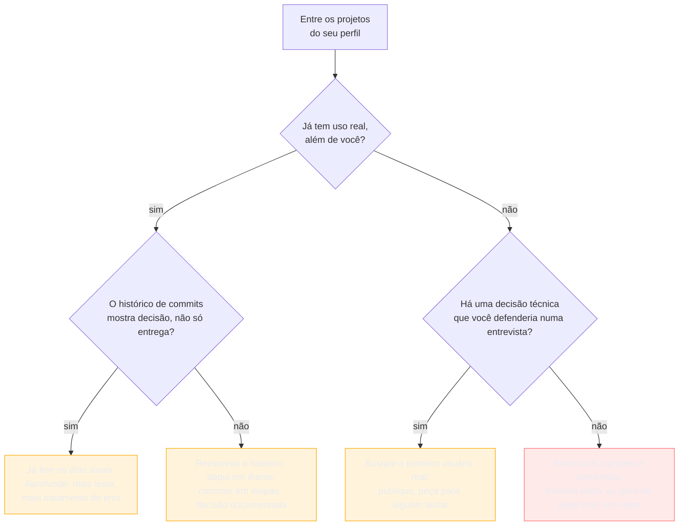

# Projetos, portfólio e GitHub depois da IA

> [!abstract] TL;DR
> Um projeto de portfólio não é um item de currículo — é um **documento à parte**, que o leitor abre por conta própria e decide sozinho, em vinte segundos, se entende ou se fecha a aba. E, ao contrário de um emprego, ele não tem ninguém por trás para confirmá-lo: nenhum empregador, nenhuma referência, nenhum telefone que alguém possa ligar. A única prova é o artefato. Daí a regra mais dura desta nota: **sem um README que diga o que é, para que serve e como rodar, o projeto não existe** para quem avalia — não importa o quanto o código por baixo seja bom, porque ninguém vai lê-lo para descobrir. Sobre a IA, o que se defende aqui é **leitura de mercado, não medição**, e a nota diz isso em voz alta: quando qualquer pessoa gera um clone funcional numa tarde, ter um clone funcional deixou de distinguir. O que ainda distingue são **decisão de engenharia visível** — histórico de commits que mostra o problema sendo resolvido em etapas, escolha documentada, teste, tratamento de erro — e **uso real, ainda que pequeno**: alguém além de você decidiu que valia a pena usar aquilo. A conclusão prática é incômoda para quem já construiu uma prateleira: **um projeto fundo vale mais que seis rasos**, e há um critério para escolher qual aprofundar.

## Doze candidaturas na fila, e a sua não tem README

O recrutador técnico tinha doze candidaturas para revisar antes do fim da tarde. A de Rafael Duarte era a quarta.

O currículo estava bom. Uma das linhas dizia: *"Desenvolvi um sistema de gestão de tarefas com autenticação JWT e testes automatizados — github.com/rafaelduarte/task-manager"*. Frase honesta, na fórmula que a [[03-Dominios/Carreira/Currículo/11 - A linha de bullet|nota 11]] ensina. O recrutador clicou no link, que era exatamente o que a linha pedia que ele fizesse.

A página abriu na listagem de arquivos. Um `.gitignore`, uma pasta `src`, alguns arquivos de configuração. Abaixo da listagem, onde o GitHub renderiza o README, não havia nada — porque não havia README.

Nenhuma frase dizendo o que o sistema faz. Nenhuma dizendo para quem. Nenhuma dizendo como rodar.

O recrutador não abriu os arquivos de código para descobrir sozinho. Ele tinha mais oito candidaturas e voltou ao currículo do Rafael sem levar aquela linha como confirmada — não como mentira, apenas como não verificada, que na prática é a mesma coisa.

Rafael tinha escrito o sistema inteiro. Autenticação funcionando, testes passando, uma decisão de arquitetura que ele defenderia com prazer se alguém perguntasse. Nada disso chegou até a pessoa que precisava ver.

## Ninguém vai defender o projeto por você

A [[03-Dominios/Carreira/Currículo/16 - A seção de experiência profissional|nota 16]] trata da seção de experiência, onde cargo, empresa e período vêm com um contrato implícito de terceiro por trás: alguém contratou, alguém pagou, alguém confirmaria por telefone se perguntado. Mesmo que ninguém ligue — e quase nunca ligam —, a possibilidade sustenta a linha.

O projeto de portfólio não tem nada disso.

Ninguém contratou. Ninguém supervisionou. Ninguém vai confirmar que o trabalho aconteceu do jeito que o currículo descreve. A única prova disponível é o próprio artefato, aberto e examinado por quem lê, sem nenhuma camada institucional entre os dois.

É essa ausência que muda a lente desta nota em relação a todas as anteriores do galho. Aqui, o documento que precisa convencer **não é o currículo** — é o repositório. O currículo só aponta para ele.

E vale marcar a diferença em relação à [[03-Dominios/Carreira/Currículo/10 - Inventário de evidência|nota 10]], que já converteu projeto próprio e contribuição a open source em material de currículo. Lá, o projeto é **fonte de bullet** — uma frase entre outras. Aqui ele é **o documento em si**, com a própria primeira impressão, o próprio teste de vinte segundos, e a própria capacidade de decepcionar tudo o que o currículo prometeu.

## A regra do README

Sem suavização: **sem um README que responda o que é, para que serve e como rodar, o projeto não existe para quem avalia.**

Isso não é uma recomendação no mesmo nível de "escolha um bom nome de repositório". É uma condição de existência. O código pode estar impecável, a arquitetura pode ser exemplar, os testes podem cobrir noventa por cento das linhas — nada disso é visível para quem não vai ler o código. E a esmagadora maioria de quem avalia um portfólio não vai.

O mecanismo é o que faz a regra parar de soar arbitrária: **o avaliador não vai ler seu código para descobrir o que ele faz.** Ele abre a página, rola até onde o README deveria estar, e se não encontra ali uma resposta rápida, não investiga arquivo por arquivo até formar a resposta sozinho. Ele fecha a aba.

Não é preguiça. É a mesma restrição de tempo que a [[03-Dominios/Carreira/Currículo/04 - Quem lê o seu currículo — e o que a evidência diz|nota 04]] já descreveu para a varredura do currículo, agora aplicada a um artefato que o leitor nem era obrigado a abrir. Um README ausente não é neutro — é um projeto que perdeu, em silêncio, a única chance que tinha de se explicar.

O README mínimo tem três perguntas, nesta ordem, e nenhuma é opcional.

**O que é.** Uma ou duas frases, no topo, sem preâmbulo. Não *"este é um projeto que iniciei para praticar tal tecnologia"* — isso é sobre você, não sobre o sistema. *"Um planejador de chicotes de injeção eletrônica, com regras de negócio por nível de assinatura"* é sobre o sistema, e qualquer leitor processa em três segundos.

**Para que serve.** Que problema resolve, para quem, e por que alguém precisaria disso.

**Como rodar.** Os comandos reais, testados, que levam de "acabei de clonar" a "está rodando na minha máquina" — dependências, variável de ambiente, comando de start, porta padrão. Não precisa ser extenso. Precisa ser **correto**: um README com instruções que não funcionam é pior que nenhum, porque promete algo que quebra na primeira tentativa e leva junto a confiança no resto.

Screenshot, GIF do sistema em uso, link do deploy — tudo isso ajuda, e nada disso substitui as três perguntas. Um README bonito sem instrução de instalação continua reprovado, porque "como rodar" ficou sem resposta.

> [!example] Caso fictício
> Bianca Torres, desenvolvedora backend pleno já apresentada em notas anteriores deste galho, mantém havia dois anos uma API de gestão de biblioteca que usava como referência de arquitetura limpa em entrevistas técnicas. Revisando o próprio GitHub antes de uma busca nova, ela abriu o repositório fingindo ser uma recrutadora desconhecida — e encontrou um README de três linhas: *"Projeto de estudo de Clean Architecture. Java 21. Em construção."* Nenhuma instrução de execução.
>
> Bianca sabe rodar aquele projeto de cor, porque escreveu cada linha. Um leitor externo não sabe, e é exatamente essa distância que a regra existe para cobrir. Ela reescreveu o README com as três perguntas — o que é (uma API de empréstimo com regras de reserva e multa), para que serve (referência de separação de camadas), como rodar (`./gradlew bootRun`, variável `DB_URL` apontando para um Postgres local, porta 8080) — sem tocar numa linha de código. O projeto não melhorou. Ele passou a existir.

## Os sete elementos de uma entrada de projeto

Assim como a entrada de experiência tem uma unidade estrutural, o projeto tem a dele — e é mais rica do que a maioria dos currículos usa. Sete elementos, cada um respondendo a uma pergunta que o leitor carrega:

| Elemento | O que responde |
| --- | --- |
| Nome do projeto | Como referenciá-lo numa conversa ou numa busca rápida |
| Link do repositório | Onde o código pode ser examinado |
| Link do que está no ar | Se existe, onde usar sem clonar nada — o teste mais rápido de todos |
| O problema que resolve, em uma linha | Por que o projeto existe, antes de qualquer detalhe técnico |
| Tecnologias | Com que ferramentas, sem virar lista de ingredientes solta |
| O desafio técnico enfrentado | Qual decisão real, não trivial, o projeto exigiu |
| Status honesto | Em produção, em desenvolvimento, concluído ou arquivado — e por quê |

Nem todo projeto preenche os sete, e isso não é defeito — é informação. Um projeto sem link de produção não é mais fraco por isso; uma biblioteca, uma ferramenta de linha de comando ou um experimento de arquitetura nunca precisaram de implantação pública para provar o que provam.

Os dois que **nenhum** projeto deveria deixar em branco são **o problema em uma linha** e **o desafio técnico**. Sem eles, a entrada inteira soa como *"fiz isso porque precisava de algo para o portfólio"* — que é justamente a leitura que o resto desta nota explica por que hoje pesa menos.

O **status honesto** merece parágrafo próprio, porque é o que mais gente omite por instinto, como se admitir "em desenvolvimento" fosse confissão de fraqueza. É o oposto. Um projeto listado como "concluído" quando está pela metade quebra na primeira pergunta de acompanhamento — a fabricação não precisa ser grande para custar caro, precisa só ser checável. As quatro categorias não competem por qual soa melhor: **em produção** (rodando, com usuário além do autor), **em desenvolvimento** (ativo e incompleto, e tudo bem dizer), **concluído** (terminou o escopo proposto, mesmo sem manutenção) e **arquivado** (parado, por escolha ou prioridade). Competem por qual é verdadeira — e a verdadeira é sempre a que resiste a uma pergunta.

> [!example] Caso real
> O `injection-harness` do autor deste vault — aplicação full-stack de planejamento de chicotes de injeção eletrônica, com backend em NestJS, frontend em React/TypeScript, autenticação JWT e regras de negócio por nível de assinatura — é um repositório **privado**. Nenhum leitor externo consegue abri-lo, com ou sem o link. (Verificado via API do GitHub em 2026-08-20: `visibility: private`.)
>
> Vale nomear esse caso porque o status honesto não cobre só produção-ou-não; cobre **visibilidade**. Um projeto público sem deploy ainda deixa examinar código, commits e README. Um projeto privado não deixa nada — o código não fala por si, por melhor que esteja atrás do portão fechado.
>
> Isso não desqualifica o projeto como assunto de currículo. Muda **quem carrega o peso da prova**: como o link não sustenta mais nada sozinho, a linha do currículo e a conversa de entrevista precisam descrever o desafio técnico com detalhe suficiente para o leitor avaliar a decisão sem ver uma linha de código — as regras de domínio por camada de assinatura, o desacoplamento entre backend e frontend, o motivo de cada escolha. É o mesmo material que um bom README teria. Só que aqui ele precisa morar inteiro no currículo e na cabeça de quem o escreveu.

## O que conta e o que não conta

Nem tudo que aparece num perfil de GitHub sustenta a leitura de "isto prova algo". A separação abaixo não proíbe nada de existir no perfil — ela diz o que, listado no currículo como evidência, produz o efeito contrário do pretendido.

**Não conta.** Repositório com um único *initial commit*, que é evidência de que um repositório foi criado, não de que houve trabalho. Projeto de tutorial copiado sem modificação, que produz aprendizado real para quem fez e nenhuma evidência de decisão própria. Repositório sem README, pelo motivo da seção anterior. Fork sem nenhum commit próprio depois, que não é trabalho — é espelho.

**Conta.** Projeto de disciplina levado além do enunciado: o trabalho de faculdade que cumpriu o mínimo e parou é evidência fraca; o mesmo trabalho com uma funcionalidade que ninguém pediu, ou uma refatoração posterior à entrega, mostra iniciativa fora do escopo imposto — que é exatamente a dúvida sobre autonomia que a nota 10 nomeia para quem vem de contexto supervisionado. Ferramenta que resolve um problema real seu: o `injection-harness` nasceu de um problema de domínio, não de necessidade de ter algo para mostrar, e é essa origem que faz o desafio técnico ser genuíno em vez de inventado para caber num README. Contribuição pequena mas real a open source: um único pull request revisado por um mantenedor e mergeado num projeto usado por terceiros é código que passou por revisão pública e verificável — o tamanho importa menos que a existência do processo de revisão. E clone com funcionalidade que você acrescentou **e sabe defender**: o que decide não é a originalidade da ideia, é se você consegue explicar uma decisão que tomou e que o tutorial não tomou por você.

Guarde essa última, porque a próxima seção transforma exatamente esse critério no eixo da nota.

## O que a IA mudou — e o que eu não consigo provar

A afirmação central é esta: **o projeto genérico saturou como sinal.**

Ferramentas de geração de código tornaram trivial produzir, numa tarde, um clone funcional de um produto conhecido — uma rede social simplificada, um e-commerce, uma API CRUD com autenticação — sem que a pessoa tenha enfrentado sozinha a maior parte das decisões que antes distinguiam quem sabia construir aquilo de quem não sabia.

Quando ter um clone funcional deixa de ser raro, ter um clone funcional deixa de distinguir. O sinal não sumiu. Migrou de *"o sistema roda"* para outro lugar.

Esse outro lugar tem dois componentes. O primeiro é **decisão de engenharia visível**: um histórico de commits que mostra o problema sendo resolvido em etapas — não um commit gigante despejando o projeto pronto, mas uma sequência legível de tentativas e correções de rumo; escolhas documentadas, num README, num pull request ou numa issue explicando por que uma abordagem venceu outra; testes, que são ao mesmo tempo evidência técnica e evidência de disciplina; e tratamento de erro, que é onde a diferença entre "o caminho feliz funciona" e "alguém pensou no que acontece quando dá errado" fica mais visível do que em qualquer outra parte do código.

O segundo é **uso real, ainda que pequeno**. Não é preciso ter mil usuários. Um projeto usado pelo próprio autor todo dia, por um punhado de colegas, ou por uma comunidade pequena e nomeável já comunica algo que nenhum clone gerado numa tarde simula: **alguém, além de quem escreveu, decidiu que valia a pena usar aquilo.**

> [!warning] Isto é leitura de mercado, não medição
> Tudo o que a seção acima afirma é uma leitura estrutural do autor deste vault, construída sobre a lógica de como a triagem de portfólio funciona — não sobre um estudo controlado. **A pesquisa para este galho não encontrou estudo quantitativo que meça quanto peso um projeto de portfólio carrega na decisão de avançar um candidato, nem quanto desse peso mudou desde a popularização das ferramentas de geração de código.** No vocabulário que a [[03-Dominios/Carreira/Currículo/04 - Quem lê o seu currículo — e o que a evidência diz|nota 04]] fixou para o galho, esta tese é **plausível mas não medida**: consistente com a lógica de como qualquer leitor avalia evidência, sem amostra, metodologia ou publicação revisada por pares sustentando um número. Use como orientação para decidir onde investir tempo. Não cite como fato medido.

Vale explicar por que a lacuna existe, porque ela não é falha de pesquisa — é a natureza do fenômeno. Medir quanto um portfólio pesa numa contratação já era difícil antes da IA existir: a decisão combina dezenas de sinais simultâneos — entrevista, referência, teste técnico, adequação cultural — e nenhum estudo sério consegue variar só o portfólio num processo seletivo real. Medir a mudança **causada pela IA** é mais difícil ainda, porque exigiria comparar candidatos equivalentes antes e depois, controlando por tudo o mais que mudou no mesmo intervalo — mercado, exigência das vagas, composição de quem procura emprego. Nenhuma fonte com esse desenho foi localizada. E nenhuma fonte comercial de currículo ou recrutamento, do tipo que a nota 04 já nomeia com o interesse declarado, publicou algo que se aproxime disso com metodologia transparente.

O que sobrevive não depende de acertar o tamanho da mudança, porque é um princípio estrutural: **evidência abundante distingue menos do que evidência escassa**, independentemente de quanto a abundância cresceu. Um recrutador que já viu o décimo clone funcional da semana não precisa de estudo publicado para o décimo primeiro não mover a agulha. Isso é inferência razoável sobre como qualquer leitor reage a repetição — não uma medição sobre este mercado. Leve a conclusão sem vesti-la de mais certeza do que ela tem.

A IA do outro lado da mesa — modelo triando currículo, com o viés medido em estudo revisado por pares que a nota 04 registra — é assunto da [[03-Dominios/Carreira/Currículo/25 - IA nos dois lados|nota 25]], junto com o uso de IA na própria escrita.

## Um projeto fundo vale mais que seis rasos

Se o projeto genérico não distingue mais como distinguia, a conclusão é direta e incômoda para quem já montou uma prateleira: **o esforço rende mais em profundidade do que em quantidade.**

Um único projeto com histórico legível, testes reais e um usuário além do autor comunica mais, hoje, que seis clones abandonados no primeiro commit. Não significa que ter vários projetos seja erro — significa que o volume, sozinho, parou de ser argumento, e que as próximas dez horas rendem mais aprofundando algo que já existe do que começando o sétimo do zero.

Sobra a pergunta prática: **qual aprofundar?**

O projeto certo não é o mais recente nem o mais ambicioso na ideia original. É o que já tem, ainda que embrionariamente, pelo menos um dos dois componentes da seção anterior. E a direção do trabalho depende de qual dos dois já existe: se há uso real mas o histórico é raso, torne as decisões visíveis — commits em etapas daqui em diante, escolhas documentadas, os testes que faltavam. Se há decisão técnica interessante mas nenhum uso além do seu, busque o primeiro usuário real — publique, peça a um colega para experimentar, resolva o problema de alguém que não seja você.

Repare no único caminho vermelho. Um projeto sem nenhum dos dois sinais não é candidato a aprofundamento — é candidato a ser abandonado com honestidade, no espírito com que a nota 10 trata o abandono nomeado como evidência válida, ou substituído por um que já nasça resolvendo um problema real em vez de preencher espaço.

> [!example] Caso fictício
> Gustavo Peixoto, estudante do último ano de curso técnico já apresentado na [[03-Dominios/Carreira/Currículo/15 - Quando não há número|nota 15]], tinha quatro repositórios: um clone de rede social feito seguindo um tutorial em vídeo, sem modificação; uma calculadora de notas com um único commit chamado "primeiro commit"; e a ferramenta de organização de arquivos que a nota 15 já trata, com trinta e uma versões ao longo de quatro meses e 68% de cobertura de testes.
>
> Montando o currículo para a primeira candidatura de estágio, ele hesitou: listar os quatro parecia mais impressionante. Aplicou o critério e descartou dois — o clone de tutorial e a calculadora sem README. Ficou com um projeto listado, não quatro. E investiu o tempo que gastaria escrevendo três entradas em escrever, para essa única, um README completo com as três perguntas e um exemplo de uso com print do terminal.
>
> O currículo final listava um projeto. Mas era um que resistia a qualquer pergunta sobre decisão técnica, cobertura de teste e uso contínuo.

> [!example] Caso real
> O `aprendendo-git-e-github`, do autor deste vault, ilustra o segundo componente — uso real, ainda que modesto. É um roteiro de aprendizagem curado (guias, cursos em vídeo, folhas de referência e material de troubleshooting sobre Git e GitHub, organizado por nível de progressão), publicado como repositório e como página estática, com URL pública.
>
> E o README **não** segue a regra desta nota à risca: abre com uma saudação de tom pessoal — *"Saudações, armengados e armengadas!"* — e só nomeia o propósito no terceiro parágrafo, de forma indireta. O título já entrega o assunto e o resto do documento organiza bem o conteúdo, mas as primeiras linhas gastam a atenção do leitor em tom, não em resposta. A correção seria simples: uma frase direta sobre o que é e para quem serve, e a saudação logo depois, sem perder o tom.
>
> O desafio técnico dele não é sofisticação de infraestrutura — é curadoria e organização pedagógica de material disperso numa progressão coerente, mantida ao longo do tempo com atualização iterativa em vez de um despejo único. É um projeto que nenhuma ferramenta de geração produziria numa tarde, porque o valor não está no código: está na decisão humana sobre o que incluir. (Fonte: [github.com/josenaldo/aprendendo-git-e-github](https://github.com/josenaldo/aprendendo-git-e-github) e [josenaldo.com.br/aprendendo-git-e-github](https://josenaldo.com.br/aprendendo-git-e-github/), README conferido ao vivo em 2026-08-20.)

## O que muda por nível

O peso do portfólio não é constante ao longo da escada da [[03-Dominios/Carreira/Currículo/03 - Os seis níveis e o que muda entre eles|nota 03]].

Para **estagiário e júnior**, o portfólio costuma ser a evidência principal — muitas vezes a única evidência de código real, porque sem vínculo formal a seção de experiência fica curta ou vazia. É o nível em que a régua desta nota pesa mais: um júnior sem nenhum README legível desperdiça a única prova forte que talvez tenha.

Para **pleno e acima**, o portfólio vira complemento — a experiência, com resultado defensável e decisão de arquitetura, carrega o peso maior. E aí a leitura fica assimétrica de um jeito que quase ninguém percebe. Um **GitHub vazio não subtrai** tanto quanto subtrairia no início, porque a seção de experiência já provou que a pessoa sabe fazer o trabalho. Mas um **GitHub com abandonos visíveis pode subtrair**: uma dúzia de repositórios com um commit cada, todos parados, sugere silenciosamente o contrário do que a nota 03 descreve como prova esperada nesses níveis — decisão sustentada, não entusiasmo que não persiste.

A saída não é apagar o histórico. É a mesma curadoria que a nota 08 aplica à formação: manter visível o que sustenta o argumento, arquivar o resto sem destaque, sem fingir que nunca existiu.

## Armadilhas comuns

> [!warning] Confundir volume de repositórios com evidência
> **O que acontece:** uma dúzia de repositórios no perfil, a maioria com um ou dois commits, na crença de que um GitHub cheio impressiona mais que um enxuto e bem cuidado.
> **Por quê:** "mais é melhor" é intuitivo e barato de seguir — cada repositório novo parece somar, nunca subtrair.
> **Como evitar:** aplique o critério de "o que conta" antes de listar qualquer projeto. O que não passa pertence ao perfil, mas não ao currículo — e, num nível sênior, vale considerar arquivar em vez de deixar visível sem explicação.

> [!warning] Escrever o README depois, como formalidade final
> **O que acontece:** o projeto termina e o README sai num apuro de dez minutos, tratado como burocracia de encerramento.
> **Por quê:** README não é código, e quem programa tende a valorizar o que é código acima do que não é — mesmo quando o que não é código é a única coisa que o leitor vai ler.
> **Como evitar:** trate-o como entrega. Escreva, **teste as instruções do zero** numa máquina limpa ou pedindo a outra pessoa, e revise como se fosse a primeira vez que alguém vê o projeto. Porque, para quem avalia, é.

> [!warning] Gerar um clone e não conseguir defendê-lo
> **O que acontece:** a pessoa gera rapidamente um clone funcional, lista no currículo como evidência equivalente a um projeto autoral, e na entrevista técnica não consegue explicar por que uma decisão específica foi tomada daquele jeito.
> **Por quê:** o resultado visual — um sistema que roda, com telas bonitas — parece prova de competência. A prova real está em explicar, não em gerar.
> **Como evitar:** o teste é simples. Se a resposta a *"por que você fez assim, e não de outro jeito?"* é *"foi assim que a ferramenta gerou"*, o projeto não sustenta a linha do currículo que aponta para ele.

## Como soa em inglês

> *"I try to hold my own GitHub to the same bar I'd apply to anyone else's — if a repo doesn't have a README that says what it is, what it's for, and how to run it, I treat it as if it doesn't exist for whoever's evaluating it, because they're not going to read the code to find out. My honest read of the market, and it's a read, not a measured fact, is that generic AI-generated projects stopped being a strong signal once anyone could produce a working clone in an afternoon — what still stands out is a commit history that shows real decisions being made, tests, error handling, and any evidence that someone besides me actually used the thing. So I'd rather have one project I can defend in depth than six shallow ones I can't."*

| PT | EN |
| --- | --- |
| regra do README | README rule |
| decisão de engenharia visível | visible engineering decisions |
| projeto genérico | generic project |
| sistema com uso real | system with real usage |
| histórico de commits legível | readable commit history |
| clone funcional | functional clone |
| contribuição a open source | open-source contribution |
| status honesto | honest status |
| plausível mas não medido | plausible but not measured |
| profundidade vs. quantidade | depth vs. breadth |

## O que vem a seguir

Rafael escreveu o README naquela mesma noite — o que é, para que serve, como rodar — e testou as instruções numa pasta limpa, onde descobriu que faltava documentar uma variável de ambiente. Levou quarenta minutos. O sistema não mudou nada; passou a existir para quem clicasse.

- [[03-Dominios/Carreira/Currículo/18 - Adaptar por vaga sem reescrever|18 - Adaptar por vaga sem reescrever]] — a adaptação cirúrgica, incluindo qual projeto sobe ou desce de posição conforme a vaga.
- [[03-Dominios/Carreira/Currículo/25 - IA nos dois lados|25 - IA nos dois lados]] — o viés medido na triagem por IA, e o uso de IA do lado de quem escreve o currículo e o código.

## Veja também

- [[03-Dominios/Carreira/Currículo/index|Currículo]] — o índice do galho.
- [[03-Dominios/Carreira/Currículo/04 - Quem lê o seu currículo — e o que a evidência diz|04 - Quem lê o seu currículo — e o que a evidência diz]] — o gate factual e o vocabulário de evidência sólida / plausível mas não medido, reusado integralmente aqui.
- [[03-Dominios/Carreira/Currículo/10 - Inventário de evidência|10 - Inventário de evidência]] — projeto próprio e open source como material bruto, antes de virarem entrada de portfólio.
- [[03-Dominios/Carreira/Currículo/16 - A seção de experiência profissional|16 - A seção de experiência profissional]] — a fronteira: lá é emprego, com terceiro institucional por trás; aqui é projeto, sem esse terceiro.
- [[03-Dominios/Carreira/Currículo/03 - Os seis níveis e o que muda entre eles|03 - Os seis níveis e o que muda entre eles]] — o vocabulário de nível reusado na seção por nível.
- [[03-Dominios/Carreira/Entrevistas/index|Entrevistas]] — o galho parceiro: todo desafio técnico nomeado aqui tende a reaparecer como pergunta de entrevista.

## Fontes

- **Josenaldo Matos** — `injection-harness`, repositório privado do autor (visibilidade confirmada via API do GitHub em 2026-08-20: `visibility: private`; sem link verificável pelo leitor, por construção), fonte do caso real sobre repositório fechado como status honesto. [github.com/josenaldo/aprendendo-git-e-github](https://github.com/josenaldo/aprendendo-git-e-github) e [josenaldo.com.br/aprendendo-git-e-github](https://josenaldo.com.br/aprendendo-git-e-github/), repositório público, README conferido ao vivo em 2026-08-20 — fonte do caso real sobre README com propósito claro, mas não na primeira frase.
- Esta nota não depende de estudo quantitativo próprio sobre o peso do portfólio na decisão de contratação, nem sobre o efeito específico da IA generativa nesse peso; nenhum estudo desse tipo, controlado ou com metodologia pública, foi localizado nesta pesquisa. O argumento central da seção sobre IA é leitura estrutural do autor, classificada explicitamente como **plausível mas não medida**, seguindo o vocabulário fixado pela [[03-Dominios/Carreira/Currículo/04 - Quem lê o seu currículo — e o que a evidência diz|nota 04]]. Nenhuma fonte comercial de currículo ou recrutamento (Jobscan, Enhancv, Teal e afins, já nomeadas e declaradas pela nota 04) foi encontrada tratando este tema com metodologia transparente, e nenhuma é citada aqui.
- **Rafael Duarte**, **Bianca Torres** e **Gustavo Peixoto** são personas fictícias já estabelecidas neste galho, reutilizadas com os fatos canônicos já fixados sobre cada uma.
