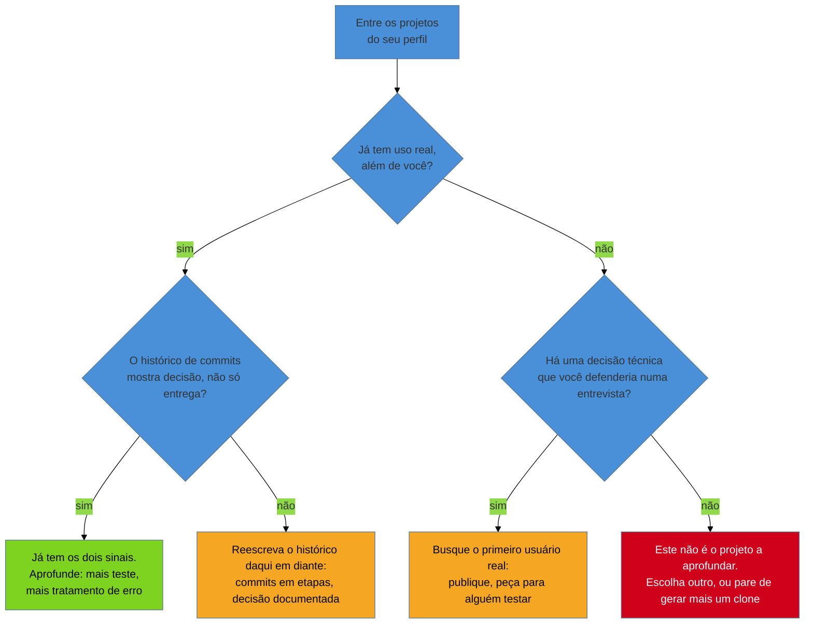

# Projetos, portfólio e GitHub depois da IA

> [!abstract] TL;DR
> Um projeto de portfólio não é um item de currículo — é um **documento à parte, com evidência própria**, que o leitor abre por conta e decide sozinho se entende em vinte segundos ou fecha a aba. A regra dura desta nota é a do README: sem um README que responda o que é, para que serve e como rodar, o projeto **não existe** para quem avalia, por melhor que seja o código por trás dele. A leitura de mercado — e é leitura, não medição, esta nota deixa isso explícito o tempo todo — é que a IA generativa saturou o **projeto genérico** como sinal: quando qualquer pessoa gera um clone funcional numa tarde, ter um clone funcional deixou de distinguir quem tem de quem não tem. O que resta valendo é **decisão de engenharia visível** — histórico de commits que mostra o problema sendo resolvido em etapas, escolha documentada, teste, tratamento de erro — e **sistema com uso real**, ainda que pequeno. A implicação prática é simples de enunciar e difícil de seguir: **um projeto aprofundado vale mais que seis clones**, e esta nota ensina como escolher qual.

## O projeto não tem quem o defenda por baixo dos panos

A [[03-Dominios/Carreira/Currículo/16 - A seção de experiência profissional|nota 16]] tratou da seção de experiência como o lugar em que cargo, empresa e período já vêm com um contrato implícito de terceiro atrás deles: alguém contratou a pessoa, alguém pagou, alguém confirmaria por telefone se perguntado. Um projeto de portfólio não carrega esse contrato. Ninguém contratou, ninguém supervisionou, ninguém vai confirmar por telefone que o trabalho aconteceu do jeito que o currículo descreve — a única prova disponível é o próprio artefato, aberto e examinado por quem lê, sem nenhuma camada institucional entre os dois. É essa ausência de terceiro que torna a lente desta nota diferente de todas as anteriores do galho: aqui, o documento que precisa convencer não é o currículo — é o repositório em si, e o currículo só aponta para ele.

Essa diferença explica também por que esta nota é a peça que fecha o par com a 16, e não uma extensão dela. A [[03-Dominios/Carreira/Currículo/10 - Inventário de evidência|nota 10]] já converteu projeto próprio e contribuição a open source em material de currículo, dentro do inventário das dez portas de entrada — mas tratou o projeto como **fonte de bullet**, uma frase entre outras na seção de experiência ou numa seção de projetos separada. Esta nota entra num nível abaixo: trata o projeto como **o documento em si**, examinável por quem lê independentemente de qualquer linha que o currículo diga sobre ele. Um recrutador ou um par técnico que clica no link do GitHub não está lendo uma frase — está abrindo uma página inteira, com sua própria primeira impressão, seu próprio teste de vinte segundos, e sua própria capacidade de decepcionar tudo o que o currículo prometeu.

> [!example] Caso fictício
> Rafael Duarte, desenvolvedor pleno já apresentado em notas anteriores deste galho, lista no currículo a linha "Desenvolvi um sistema de gestão de tarefas com autenticação JWT e testes automatizados — github.com/rafaelduarte/task-manager". A frase é honesta e segue a fórmula da [[03-Dominios/Carreira/Currículo/11 - A linha de bullet|nota 11]]. Um recrutador técnico, revisando a candidatura antes de marcar a entrevista, clica no link. A página do GitHub abre direto na listagem de arquivos, sem nenhum README visível abaixo dela — só um `.gitignore` e uma pasta `src`. Não há frase nenhuma dizendo o que o sistema faz, para quem, ou como executá-lo. O recrutador não abre os arquivos de código para descobrir sozinho; ele já tem doze candidaturas na fila e volta ao currículo, sem levar a linha de bullet como confirmada. A frase no currículo não mentiu — mas o documento que deveria confirmá-la não fez o trabalho mínimo de existir para quem chegou até ele.

## A estrutura da entrada de projeto

Assim como a nota 16 tratou a entrada de experiência como unidade — cargo, empresa, período, mais a linha de contexto que dá tamanho ao resto —, um projeto de portfólio tem sua própria unidade estrutural, e ela é mais rica do que a maioria dos currículos usa. Sete elementos compõem uma entrada de projeto completa, e cada um responde a uma pergunta específica que o leitor carrega:

| Elemento | O que responde |
| --- | --- |
| Nome do projeto | Como referenciá-lo numa conversa ou numa busca rápida |
| Link do repositório | Onde o código pode ser examinado, se o leitor quiser ir além do currículo |
| Link do que está no ar | Se existe, onde o sistema pode ser usado sem clonar nada — o teste mais rápido de todos |
| O problema que resolve, em uma linha | Por que o projeto existe, antes de qualquer detalhe técnico |
| Tecnologias | Com que ferramentas o problema foi resolvido, sem virar lista de ingredientes solta |
| O desafio técnico enfrentado | Qual decisão real, não trivial, o projeto exigiu — a peça que distingue projeto de exercício |
| Status honesto | Em produção, em desenvolvimento, concluído ou arquivado — e por quê |

Vale notar que nem todo projeto tem os sete elementos preenchidos, e isso não é defeito — é informação. Um projeto sem link do que está no ar não é, por si, mais fraco do que um com; muitos projetos legítimos nunca precisaram de implantação pública para provar o que precisavam provar (uma biblioteca, uma ferramenta de linha de comando, um experimento de arquitetura). O que enfraquece a entrada não é a ausência de um campo — é a ausência do **problema em uma linha** ou do **desafio técnico**, porque esses dois são os únicos que nenhum projeto deveria deixar de ter uma resposta para, sob pena de a entrada inteira soar como "fiz isso porque precisava de algo para o portfólio", que é exatamente a leitura que o restante desta nota explica por que hoje pesa menos do que pesava antes.

O status honesto merece destaque à parte, porque é o elemento que mais gente omite por instinto — como se admitir "em desenvolvimento" fosse uma confissão de fraqueza. É o oposto: um projeto listado como "concluído" quando na verdade está pela metade quebra na primeira pergunta de acompanhamento, do mesmo jeito que a nota 16 já descreveu para a experiência fabricada — a fabricação não precisa ser uma mentira grande para custar caro, precisa só ser checável. As quatro categorias — **em produção** (rodando, com usuário real além do próprio autor), **em desenvolvimento** (ativo, incompleto, e tudo bem dizer isso), **concluído** (terminou o escopo que se propôs, mesmo sem manutenção contínua) e **arquivado** (parado, por escolha ou por prioridade, e a nota 10 já tratou de como um projeto abandonado, com o motivo nomeado com honestidade, ainda comunica algo real) — não competem entre si por qual soa melhor; competem por qual é verdadeira, e a verdadeira é sempre a que resiste a uma pergunta de acompanhamento.

> [!example] Caso real
> O repositório `injection-harness` do autor deste vault — uma aplicação full-stack de planejamento de chicotes de injeção eletrônica, com backend em NestJS, frontend em React/TypeScript, autenticação JWT e regras de negócio por nível de assinatura — está listado, na própria página do projeto, sem URL pública de produção declarada. Não há tentativa de disfarçar isso: o campo de link de produção simplesmente registra a ausência. O que sustenta a entrada, na falta desse link, é o resto da estrutura — o problema em uma linha (planejamento manual de chicote é propenso a erro e difícil de padronizar), a stack completa, e o desafio técnico nomeado com precisão (regras de domínio por camada de assinatura, arquitetura desacoplada entre backend e frontend). Um projeto sem deploy público não é, nesta estrutura, um projeto incompleto — é um projeto cujo status honesto é outro, e que ainda assim tem os outros seis elementos fazendo o trabalho que o link de produção faria. (Fonte: [github.com/josenaldo/injection-harness](https://github.com/josenaldo/injection-harness), verificado ao vivo em 2026-08-20.)

## A regra do README

Esta é a regra mais dura desta nota, e vale enunciá-la sem suavização: **sem um README que responda o que é, para que serve e como rodar, o projeto não existe para quem avalia.** Não é uma recomendação entre várias, no mesmo nível de "escolha um bom nome de repositório" — é uma condição de existência. O código pode estar impecável, a arquitetura pode ser exemplar, os testes podem cobrir noventa por cento das linhas — nada disso é visível para quem não vai ler o código, e a esmagadora maioria de quem avalia um portfólio não vai. A pessoa do outro lado tem, na melhor das hipóteses, os mesmos poucos minutos que a [[03-Dominios/Carreira/Currículo/04 - Quem lê o seu currículo — e o que a evidência diz|nota 04]] já descreveu para a varredura inicial do currículo — e essa mesma economia de atenção se repete, com o mesmo rigor, em cada link que o currículo pede para o leitor abrir.

O mecanismo por trás da regra é simples e vale nomear com todas as letras, porque entendê-lo é o que faz a regra parar de soar arbitrária: **o avaliador não vai ler seu código para descobrir o que ele faz.** Ele abre a página do repositório, rola até onde o README deveria estar, e se não encontra ali uma resposta rápida para "o que é isto", ele não vai investigar arquivo por arquivo até formar essa resposta sozinho — ele fecha a aba e segue para o próximo item da lista. Isso não é preguiça do avaliador; é a mesma restrição de tempo que rege as outras duas leituras que a nota 04 já descreveu, aplicada a um artefato novo que o leitor nem sequer era obrigado a abrir. Um README ausente não é neutro — é um projeto que perdeu, silenciosamente, a única chance que tinha de se explicar.

O README mínimo viável que sustenta essa função tem três perguntas, nesta ordem, e nenhuma delas é opcional:

- **O que é.** Uma ou duas frases, no topo do arquivo, sem preâmbulo. Não "este é um projeto que iniciei para praticar tal tecnologia" — isso é sobre a pessoa, não sobre o sistema. "Um planejador de chicotes de injeção eletrônica, com regras de negócio por nível de assinatura" é sobre o sistema, e é a frase que qualquer leitor consegue processar em três segundos.
- **Para que serve.** Que problema ele resolve, para quem, e por que alguém precisaria dele — o mesmo problema em uma linha que já entra na tabela da entrada de currículo, só que expandido para o parágrafo que a tabela não tem espaço para carregar.
- **Como rodar.** Os comandos reais, testados, que levam de "acabei de clonar o repositório" a "o sistema está rodando na minha máquina" — instalação de dependência, variável de ambiente necessária, comando de start, porta padrão. Não é preciso ser extenso; precisa ser **correto**, porque um README com instruções de instalação que não funcionam é pior do que nenhum README, já que promete algo que quebra na primeira tentativa e destrói a confiança que o resto do documento tentava construir.

Além dessas três perguntas obrigatórias, um README mais completo pode acrescentar tecnologias usadas, um print de tela ou um GIF curto do sistema em uso, e um link direto para a versão implantada, quando existir — mas nenhum desses extras substitui as três perguntas centrais. Um README com screenshots bonitos e sem instrução de instalação ainda falha na regra desta seção, porque a pergunta "como rodar" ficou sem resposta.

> [!example] Caso fictício
> Bianca Torres, desenvolvedora backend pleno já apresentada em notas anteriores deste galho, mantém um repositório pessoal com uma API de gestão de biblioteca que usa havia dois anos como referência de arquitetura limpa em entrevistas técnicas. Ao revisar o próprio GitHub antes de uma nova busca de emprego, ela clica no repositório pela primeira vez em meses, como se fosse um recrutador desconhecido, e encontra um README de três linhas — "Projeto de estudo de Clean Architecture. Java 21. Em construção." — sem instrução de execução nenhuma. Ela sabe rodar o projeto de cor, porque escreveu cada linha dele; um leitor externo não sabe, e a diferença entre as duas situações é exatamente o que a regra desta seção existe para cobrir. Ela reescreve o README com as três perguntas: o que é (uma API de empréstimo de livros com regras de reserva e multa), para que serve (referência de separação de camadas em domínio bancário-símile de baixo risco), e como rodar (`./gradlew bootRun`, variável `DB_URL` apontando para um Postgres local, porta 8080 por padrão) — sem mudar uma linha do código.

## O que conta e o que não conta

Nem todo item que aparece num perfil de GitHub sustenta a leitura de "isto prova algo" que o restante desta nota discute. Vale separar, com a mesma disciplina que a nota 10 já aplicou às dez portas de entrada, o que soma do que não soma — não porque o item "não soma" seja proibido de existir no perfil, mas porque incluí-lo na seção de projetos do currículo, como se fosse evidência, produz o efeito oposto do pretendido.

**Não conta:**

- **Repositório com um único commit de "initial commit".** Isso não é evidência de trabalho — é evidência de que um repositório foi criado. A diferença entre os dois é justamente o que este item nomeia.
- **Projeto de tutorial copiado sem modificação.** Seguir um curso e reproduzir, linha por linha, o mesmo código que o instrutor escreveu na tela produz aprendizado real para quem fez — mas não produz evidência de decisão própria, que é o que o restante desta nota trata como o que passou a valer.
- **Repositório sem README.** A seção anterior já tratou disso como regra dura; aqui vale só reafirmar que a ausência não é neutra — transforma qualquer conteúdo do repositório em algo que não existe para quem avalia.
- **Fork sem contribuição própria.** Um fork que existe só porque, em algum momento, foi mais fácil clonar um projeto de terceiro do que começar do zero, sem nenhum commit próprio depois disso, não é trabalho — é um espelho.

**Conta:**

- **Projeto de disciplina levado além do enunciado.** Um trabalho de faculdade que cumpriu o requisito mínimo pedido pelo professor e parou ali é evidência fraca; o mesmo trabalho, com uma funcionalidade extra que ninguém pediu, uma refatoração posterior, ou uma decisão de arquitetura tomada por conta própria depois da entrega, é evidência real — porque mostra iniciativa além do escopo imposto, que é exatamente a dúvida sobre autonomia que a nota 10 já nomeou para quem vem de contextos supervisionados.
- **Ferramenta que resolve um problema real seu.** O `injection-harness` citado acima nasceu de um problema de domínio específico (planejamento de chicote de injeção eletrônica), não de um exercício de portfólio — e é justamente essa origem, motivada por necessidade própria e não por necessidade de ter algo para mostrar, que faz o projeto carregar um desafio técnico genuíno em vez de um desafio inventado para caber num README.
- **Contribuição pequena mas real a open source.** A nota 10 já tratou disso na porta 10: mesmo um único pull request aceito, revisado por um mantenedor experiente e mergeado num projeto usado por terceiros, é uma peça de código que passou por revisão real, pública, com histórico verificável — o tamanho da contribuição importa menos do que a existência de um processo de revisão de terceiro por trás dela.
- **Clone com funcionalidade que você acrescentou e sabe defender.** Um clone de produto conhecido não é, por si, descartável — o que decide se ele conta é se a pessoa consegue, numa conversa técnica, explicar uma decisão que tomou dentro dele e que o tutorial original (se houve um) não tomou por ela. É exatamente essa capacidade de defesa, e não a originalidade da ideia, que separa um clone que conta de um clone que não conta — e é o critério que a próxima seção transforma no eixo inteiro da nota.

## O que a IA mudou — e o que é leitura, não medição

Chega-se, então, ao eixo desta nota, e ao ponto em que o rigor precisa ser mais explícito do que em qualquer seção anterior. A afirmação central é a seguinte: **o projeto genérico saturou como sinal.** Ferramentas de geração de código assistida por IA tornaram trivial produzir, numa única tarde, um clone funcional de um produto conhecido — uma rede social simplificada, um clone de e-commerce, uma API CRUD com autenticação — sem que a pessoa precise ter enfrentado, sozinha, a maior parte das decisões que antes distinguiam quem sabia construir aquilo de quem não sabia. Quando ter um clone funcional deixa de ser raro, ter um clone funcional deixa de distinguir. O sinal não desapareceu — ele só migrou de "o sistema roda" para outra coisa.

Essa outra coisa, na leitura defendida aqui, tem dois componentes. O primeiro é **evidência de decisão de engenharia visível**: um histórico de commits que mostra o problema sendo resolvido em etapas — não um único commit gigante despejando o projeto inteiro pronto, mas uma sequência legível de decisões, tentativas, correções de rumo; escolhas documentadas, seja num README, seja num comentário de pull request, seja numa issue explicando por que uma abordagem foi preferida a outra; testes automatizados, que são, ao mesmo tempo, evidência técnica e evidência de disciplina; e tratamento de erro, que é onde a diferença entre "o feliz caminho funciona" e "alguém pensou no que acontece quando algo dá errado" fica mais visível do que em qualquer outro lugar do código. O segundo componente é **sistema com uso real**, ainda que pequeno — não é preciso ter mil usuários; um projeto usado pelo próprio autor todos os dias, por um punhado de colegas, ou por uma comunidade pequena e nomeável já comunica algo que nenhum clone gerado numa tarde consegue simular: que alguém, além de quem escreveu o código, decidiu que valia a pena usar aquilo.

> [!warning] Esta é leitura de mercado, não medição
> **O que é.** A afirmação acima — de que o projeto genérico saturou como sinal e de que decisão visível e uso real passaram a pesar mais — é uma leitura estrutural do próprio autor deste vault, construída sobre a lógica de como a triagem de portfólio funciona, e não sobre um estudo controlado. **A pesquisa para este galho não encontrou estudo quantitativo controlado que meça, hoje, quanto peso um projeto de portfólio carrega na decisão de avançar um candidato, nem quanto desse peso mudou desde a popularização de ferramentas de geração de código por IA.** Nos termos que a [[03-Dominios/Carreira/Currículo/04 - Quem lê o seu currículo — e o que a evidência diz|nota 04]] já fixou para o galho inteiro, esta tese inteira é classificada como **plausível mas não medido**: ela é consistente com a lógica de como um leitor humano ou automatizado avalia evidência (algo abundante deixa de distinguir; algo raro passa a distinguir), mas não há amostra, metodologia ou publicação revisada por pares sustentando um número específico de quanto esse peso mudou. Trate a tese como orientação razoável para decidir onde investir tempo — não como fato medido para citar como se fosse.

Vale explicar por que essa lacuna existe, e não é falha de pesquisa — é a natureza do fenômeno. Medir "quanto um projeto de portfólio pesa na decisão de contratar" já era um problema difícil de isolar antes da IA generativa existir, porque a decisão de contratação combina dezenas de sinais ao mesmo tempo — entrevista, referência, teste técnico, adequação cultural — e nenhum estudo sério consegue variar apenas o portfólio, mantendo tudo o mais constante, num processo seletivo real. Medir a mudança **causada pela IA** especificamente é ainda mais difícil, porque exigiria comparar candidatos equivalentes antes e depois da popularização das ferramentas, controlando por todas as outras variáveis que também mudaram nesse mesmo intervalo de tempo — mercado de trabalho, nível de exigência das vagas, composição de quem está buscando emprego. Nenhuma fonte com esse desenho foi localizada nesta pesquisa, e nenhuma fonte comercial de currículo ou de recrutamento — do mesmo tipo já nomeado e declarado pela nota 04 (Jobscan, Enhancv, Teal e afins) — publicou algo que se aproxime disso com metodologia transparente. Onde este galho encontra esse tipo de fonte comercial falando do tema, ela é nomeada como tal, com o interesse comercial declarado, exatamente como a nota 04 já ensinou a fazer — e nenhuma entra nesta nota como se fosse evidência sólida.

O que sobrevive, então, não depende de acertar o tamanho exato da mudança — sobrevive porque é um princípio estrutural, do mesmo tipo que a nota 04 já identificou como robusto mesmo sob incerteza sobre os números: **evidência abundante distingue menos do que evidência escassa**, independentemente de quanto exatamente a abundância cresceu. Um sistema de recomendação, um recrutador ou um par técnico que já viu o décimo clone funcional da mesma semana não precisa de um estudo publicado para notar que o décimo primeiro não move a agulha do jeito que o primeiro moveria — essa é uma inferência razoável sobre como qualquer leitor, humano ou automatizado, reage a repetição, não uma medição sobre este mercado específico. É esse tipo de raciocínio — plausível porque consistente com mecanismos conhecidos, não medido porque ninguém isolou a variável — que esta nota pede para o leitor levar consigo, sem vestir a conclusão com mais certeza do que ela tem.

A discussão de como a IA entra do outro lado da mesa — modelo triando currículo, e o viés medido em estudo com revisão por pares que a nota 04 já registrou como a evidência mais sólida da nota inteira — é assunto da [[03-Dominios/Carreira/Currículo/25 - IA nos dois lados|nota 25]], que também trata de como um candidato usa IA generativa na própria escrita de currículo e projeto. Esta nota não repete aquela discussão; fica com o recorte específico do portfólio como artefato técnico, e com a pergunta de o que, dentro dele, ainda distingue.

## A implicação prática: profundidade rende mais que quantidade

Se o projeto genérico não distingue mais do jeito que distinguia, a conclusão prática é direta, ainda que incômoda para quem já investiu tempo construindo uma prateleira de projetos rasos: **o esforço rende mais em profundidade do que em quantidade.** Um único projeto com histórico de commits legível, testes reais e um usuário além do próprio autor comunica mais, hoje, do que seis clones funcionais e abandonados no primeiro commit gigante. Isso não significa que ter vários projetos seja um erro — significa que o volume, sozinho, deixou de ser o argumento, e que investir as próximas dez horas disponíveis em aprofundar um projeto já existente tende a valer mais do que investir as mesmas dez horas começando um sétimo do zero.

A pergunta prática que segue dessa conclusão é como escolher qual projeto aprofundar, entre os que já existem no próprio perfil — e essa escolha tem um critério mais claro do que parece à primeira vista. O projeto certo para aprofundar não é necessariamente o mais recente, nem o mais ambicioso na ideia original; é o que já tem, mesmo que embrionariamente, pelo menos um dos dois componentes que a seção anterior nomeou — um começo de histórico de decisão visível, ou um começo de uso real, mesmo que pequeno. Aprofundar significa, então, uma direção específica dependendo de qual dos dois já existe: se o projeto já tem uso real, mas o histórico de commits é raso, o trabalho é tornar as decisões visíveis — reescrever commits futuros em etapas legíveis, documentar por que uma escolha técnica foi feita, adicionar testes que faltavam; se o projeto já tem decisão técnica interessante, mas nenhum uso além do próprio autor, o trabalho é buscar o primeiro usuário real — publicar, pedir para um colega experimentar, resolver um problema de alguém que não seja a própria pessoa.

O diagrama fecha o critério de escolha desta seção com um único traço: entre todos os projetos parados num perfil, só vale investir mais tempo naquele que já tem, ao menos, um dos dois sinais que sustentam o argumento da seção anterior — uso real ou decisão técnica defensável. Um projeto sem nenhum dos dois não é candidato a aprofundamento; é candidato a ser abandonado com honestidade, no mesmo espírito que a nota 10 já tratou o abandono nomeado como evidência válida, ou substituído por um projeto novo que já nasça resolvendo um problema real, em vez de nascer só para preencher espaço no portfólio.

## Variação por nível

O peso do portfólio dentro do documento inteiro não é constante ao longo da escada que a [[03-Dominios/Carreira/Currículo/03 - Os seis níveis e o que muda entre eles|nota 03]] já descreveu, e vale nomear essa variação com a mesma disciplina que a nota 03 aplicou a cada uma das outras seções do currículo.

Para **estagiário e júnior**, o portfólio pode ser a evidência principal — muitas vezes a única evidência de código real que a pessoa tem, porque a nota 16 já tratou de como, sem vínculo formal, a seção de experiência fica curta ou vazia. Nesse ponto da escada, o leitor procura o que a nota 03 já nomeou como **potencial e disciplina de aprendizado** e, no caso do júnior, **fundamentos técnicos demonstráveis** — e um projeto bem documentado, mesmo pequeno, é exatamente o tipo de prova concreta que o resto do documento, nesse nível, mais precisa. É também o nível em que a régua desta nota pesa mais: um estagiário ou júnior sem nenhum README legível num único repositório desperdiça a única evidência forte que talvez tenha.

Para **pleno e acima**, o portfólio deixa de ser a evidência principal e passa a ser **complemento** — a seção de experiência, com resultado defensável e decisão de arquitetura real, carrega o peso maior, na mesma lógica que a nota 03 já descreveu para o eixo do que sobe e do que desce com a senioridade. Isso muda a leitura de dois jeitos assimétricos, e vale nomear os dois: um **GitHub vazio não subtrai tanto quanto subtraía no início** da carreira, porque o leitor já tem, na seção de experiência, evidência suficiente de que a pessoa sabe fazer o trabalho — o portfólio deixou de ser a única fonte de prova. Mas um **GitHub com abandonos visíveis pode subtrair**, e esse é o ponto que a maioria ignora: uma dúzia de repositórios com um commit cada, todos parados, não é neutra para um sênior ou staff do jeito que seria irrelevante para quem nunca teve tempo de mantê-los — ela sugere, silenciosamente, o oposto do que a nota 03 já descreveu como prova esperada nesses níveis: decisão sustentada, não entusiasmo que não persiste. A saída, para quem está nessa faixa e tem um perfil assim, não é apagar o histórico — é a mesma curadoria que a nota 08 já aplicou à seção de formação: manter visível o que sustenta o argumento, e deixar o resto arquivado sem destaque, sem fingir que nunca existiu.

## Casos práticos

> [!example] Caso fictício
> Gustavo Peixoto, estudante do último ano de um curso técnico já apresentado na [[03-Dominios/Carreira/Currículo/15 - Quando não há número|nota 15]] deste galho, tinha, além da ferramenta de organização de arquivos que aquela nota já tratou em detalhe, três outros repositórios no GitHub: um clone de uma rede social simplificada, feito seguindo um tutorial em vídeo sem nenhuma modificação; um projeto de calculadora de notas escolares, com um único commit chamado "primeiro commit"; e a própria ferramenta de organização de arquivos, com trinta e uma versões ao longo de quatro meses e 68% de cobertura de testes. Ao montar o currículo para a primeira candidatura de estágio, ele hesitou entre listar os quatro projetos — mais volume parecia, à primeira vista, mais impressionante — e aplicar o critério desta nota. Aplicando o critério de "o que conta e o que não conta", descartou o clone de rede social (tutorial sem modificação) e a calculadora (um único commit, sem README); manteve só a ferramenta de organização, e investiu o tempo que gastaria escrevendo entradas para os outros três em escrever, para essa única, um README completo com as três perguntas — o que é, para que serve, como rodar — e um exemplo de uso com print de tela do terminal. O currículo final listava um projeto, não quatro, mas o único que listava resistia a qualquer pergunta de acompanhamento sobre decisão técnica, cobertura de teste e uso próprio contínuo.

> [!example] Caso real
> O repositório `aprendendo-git-e-github`, do autor deste vault, ilustra o segundo componente do que a IA não saturou: uso real, ainda que modesto. É um roteiro de aprendizagem curado — guias, cursos em vídeo, folhas de referência e material de troubleshooting sobre Git e GitHub, organizado por nível de progressão, publicado tanto como repositório no GitHub quanto como página estática, com URL de produção pública. O README do projeto explica, na primeira frase, exatamente o que ele é e para quem serve, sem exigir que o leitor abra um único arquivo de conteúdo para entender o propósito. O desafio técnico ali não é sofisticação de infraestrutura — é curadoria e organização pedagógica de material disperso numa progressão coerente, mantida ao longo do tempo, com atualização iterativa em vez de um único despejo inicial. É um projeto que nenhuma ferramenta de geração de código produziria numa tarde, porque o valor dele não está no código — está na curadoria humana por trás da escolha do que incluir, o mesmo tipo de decisão visível que esta nota descreve como o que passou a distinguir. (Fonte: [github.com/josenaldo/aprendendo-git-e-github](https://github.com/josenaldo/aprendendo-git-e-github) e [josenaldo.com.br/aprendendo-git-e-github](https://josenaldo.com.br/aprendendo-git-e-github/), verificado ao vivo em 2026-08-20.)

## Armadilhas comuns

> [!warning] Confundir volume de repositórios com evidência
> **O que acontece:** a pessoa mantém uma dúzia ou mais de repositórios no perfil, a maioria com um ou dois commits, na crença de que um GitHub cheio impressiona mais do que um GitHub com poucos itens bem cuidados. **Por quê:** o instinto de "mais é melhor" é intuitivo e barato de seguir — cada repositório novo parece somar, nunca subtrair. **Como evitar:** aplicar o critério desta nota antes de listar qualquer projeto no currículo: se não sobrevive ao teste de "o que conta e o que não conta", ele pertence ao perfil, mas não precisa de destaque nenhum — e, se for velho o suficiente para sinalizar abandono num nível sênior, vale considerar arquivá-lo com honestidade em vez de deixá-lo visível sem explicação.

> [!warning] Escrever o README depois, como formalidade final
> **O que acontece:** a pessoa termina o projeto inteiro e só então escreve o README, num apuro final de dez minutos, tratando-o como burocracia de encerramento em vez de parte do produto entregue. **Por quê:** o README não é código, e quem programa tende a valorizar o que é código acima do que não é — mesmo quando o que não é código é a única coisa que o leitor de fato vai ler. **Como evitar:** tratar o README com a mesma disciplina de qualquer entrega: escrever, testar as instruções de instalação do zero (idealmente numa máquina limpa, ou pedindo para outra pessoa tentar), e revisar como se fosse a primeira vez que alguém vê o projeto — porque, para quem avalia, é.

> [!warning] Gerar um clone e apresentá-lo sem conseguir defendê-lo
> **O que acontece:** a pessoa usa uma ferramenta de geração de código por IA para produzir rapidamente um clone funcional de um produto conhecido, lista-o no currículo como se fosse evidência equivalente a um projeto autoral, e não consegue, numa entrevista técnica, explicar por que uma decisão específica dentro dele foi tomada daquele jeito. **Por quê:** o resultado visual — um sistema que roda, com telas bonitas — parece prova de competência, mas a prova real está na capacidade de explicar, não na capacidade de gerar. **Como evitar:** aplicar o teste que a seção "o que conta e o que não conta" já nomeou: um clone conta quando a pessoa acrescentou algo próprio e sabe defender essa escolha; se a resposta a "por que você fez assim, e não de outro jeito" é "foi assim que a ferramenta gerou", o projeto não sustenta a linha do currículo que aponta para ele.

## Como soa em inglês

> "I try to hold my own GitHub to the same bar I'd apply to anyone else's — if a repo doesn't have a README that says what it is, what it's for, and how to run it, I treat it as if it doesn't exist for whoever's evaluating it, because they're not going to read the code to find out. My honest read of the market, and it's a read, not a measured fact, is that generic AI-generated projects stopped being a strong signal once anyone could produce a working clone in an afternoon — what still stands out is a commit history that shows real decisions being made, tests, error handling, and any evidence that someone besides me actually used the thing. So I'd rather have one project I can defend in depth than six shallow ones I can't."

| PT | EN |
| --- | --- |
| regra do README | README rule |
| decisão de engenharia visível | visible engineering decisions |
| projeto genérico | generic project |
| sistema com uso real | system with real usage |
| histórico de commits legível | readable commit history |
| clone funcional | functional clone |
| contribuição a open source | open-source contribution |
| status honesto | honest status |
| plausível mas não medido | plausible but not measured |
| profundidade vs. quantidade | depth vs. breadth |

## O que vem a seguir

Fechado o que conta como evidência técnica fora do vínculo empregatício, e como a IA generativa mudou o valor sinal do projeto genérico, o galho segue para como esse material inteiro — experiência e projeto — se adapta a cada candidatura específica, sem reescrever o documento do zero:

- [[03-Dominios/Carreira/Currículo/18 - Adaptar por vaga sem reescrever|18 - Adaptar por vaga sem reescrever]] — a adaptação cirúrgica: sumário, ordem e ênfase dos bullets, os termos da descrição — incluindo qual projeto subir ou descer de posição conforme a vaga.
- [[03-Dominios/Carreira/Currículo/25 - IA nos dois lados|25 - IA nos dois lados]] — o viés medido em triagem por IA e o uso de IA generativa do lado de quem escreve o currículo e o próprio código do projeto.

## Veja também

- [[03-Dominios/Carreira/Currículo/index|Currículo]] — o índice do galho, com a tese e o mapa das 26 notas.
- [[03-Dominios/Carreira/Currículo/04 - Quem lê o seu currículo — e o que a evidência diz|04 - Quem lê o seu currículo — e o que a evidência diz]] — o gate factual e o vocabulário de evidência sólida, plausível mas não medido e caixa-preta declarada, reusado integralmente por esta nota.
- [[03-Dominios/Carreira/Currículo/10 - Inventário de evidência|10 - Inventário de evidência]] — projeto próprio e contribuição a open source como material bruto, antes de virarem entrada de portfólio.
- [[03-Dominios/Carreira/Currículo/16 - A seção de experiência profissional|16 - A seção de experiência profissional]] — a fronteira desta nota: lá é emprego, com terceiro institucional por trás; aqui é projeto, sem esse terceiro.
- [[03-Dominios/Carreira/Currículo/03 - Os seis níveis e o que muda entre eles|03 - Os seis níveis e o que muda entre eles]] — o vocabulário de nível que a seção de variação por nível desta nota reusa.
- [[03-Dominios/Carreira/Entrevistas/index|Entrevistas]] — o galho parceiro: todo desafio técnico nomeado nesta nota tende a reaparecer, em profundidade maior, como pergunta de entrevista técnica.

## Fontes

- **Josenaldo Matos** — [github.com/josenaldo/injection-harness](https://github.com/josenaldo/injection-harness) e [github.com/josenaldo/aprendendo-git-e-github](https://github.com/josenaldo/aprendendo-git-e-github) / [josenaldo.com.br/aprendendo-git-e-github](https://josenaldo.com.br/aprendendo-git-e-github/), repositórios públicos, verificados ao vivo em 2026-08-20. Fonte dos dois casos reais desta nota: a estrutura de entrada de projeto sem link de produção declarado, e o projeto com uso real e README completo.
- Esta nota não depende de estudo quantitativo próprio sobre o peso do portfólio técnico na decisão de contratação, nem sobre o efeito específico da IA generativa nesse peso; nenhum estudo desse tipo, controlado ou com metodologia pública, foi localizado nesta pesquisa. O argumento central da seção "O que a IA mudou" é leitura estrutural do próprio autor, classificada explicitamente como plausível mas não medida, seguindo o vocabulário já fixado pela [[03-Dominios/Carreira/Currículo/04 - Quem lê o seu currículo — e o que a evidência diz|nota 04]]. Nenhuma fonte comercial de currículo ou recrutamento (Jobscan, Enhancv, Teal e afins, já nomeadas e declaradas pela nota 04) foi encontrada tratando este tema específico com metodologia transparente, e nenhuma entra citada nesta nota.
