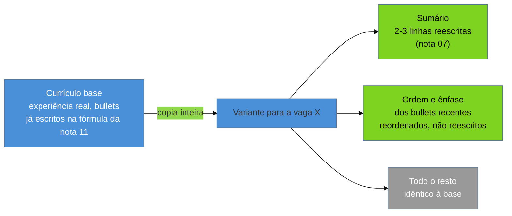

# Adaptar por vaga sem reescrever

> [!abstract] TL;DR
> Adaptar o currículo para uma vaga não é reescrever — é **cirurgia** sobre uma base já pronta, e mexe em duas coisas apenas: as duas ou três linhas do [[03-Dominios/Carreira/Currículo/07 - O sumário profissional|sumário]], e a **ordem e a ênfase** dos bullets nas experiências recentes. Minutos, não horas. E a diferença entre as duas escalas não é de esforço: é o que separa parecer um candidato genérico de parecer *o* candidato daquela vaga. O motivo é que, de uma vaga para outra, o que muda quase nunca é você — é qual parte de você aquela vaga precisa ver primeiro. A carreira é a mesma; varia o enquadramento. O repositório de currículos do autor deste vault, versionado como código, guarda a lição mais cara desta nota: uma variante foi reescrita inteira para uma vaga, revertida depois, e o que sobreviveu foi **um único bullet** — todo o resto era trabalho jogado fora que uma base bem mantida já resolvia. Guarda também as outras três: o ajuste que se prova geral sobe para a base; reordenar por analogia vale mais que reescrever; e negrito é recurso escasso, que num único passe caiu de **106 para 26** trechos. Fecha com o critério de parada, porque adaptação sem limite vira outra coisa — um documento que você não consegue defender em voz alta.

## Onze da noite, reescrevendo tudo de novo

Rafael Duarte encontrou a vaga às nove e meia da noite e achou que era a dele. A descrição parecia escrita para o que ele fazia todo dia, o produto era interessante, e o prazo fechava na sexta.

Às dez ele abriu o currículo e começou a "adaptar".

Reordenou as seções. Reescreveu o sumário três vezes. Achou que a primeira experiência estava mal contada e refez os quatro bullets dela. Percebeu que o segundo emprego usava um vocabulário diferente do anúncio e reformulou aquilo também. Trocou "desenvolvi" por "implementei" em seis lugares, e depois voltou atrás em quatro. À uma da manhã, salvou um arquivo novo, mandou, e foi dormir com a sensação boa de quem trabalhou duro por algo que queria.

Três semanas depois ele fez o mesmo processo por outra vaga. E de novo na seguinte.

O que Rafael não percebeu — e ninguém percebe sozinho, porque o esforço parece cuidado — é que ele passou três horas por candidatura produzindo um documento que, comparado lado a lado com o anterior, era **quase idêntico**. As mesmas experiências, os mesmos fatos, os mesmos números, ditos com sinônimos diferentes. Três horas de trabalho para mudar a embalagem de um conteúdo que já estava certo.

E há um custo pior que o tempo. A cada reescrita completa, Rafael estava mexendo em partes do documento que **já funcionavam**, sem nenhum jeito de saber se a versão nova era melhor ou pior que a antiga. Ele não estava adaptando. Estava rolando um dado, toda vez, com um documento que já tinha passado da fase de sorte.

## O que muda de uma vaga para outra não é você

Aqui está a premissa errada que sustentava as noites do Rafael: ele achava que vagas diferentes pedem currículos diferentes.

Pedem, mas muito menos do que parece. Entre duas vagas parecidas, dentro da mesma carreira, o que muda não é a pessoa nem a experiência dela — é **qual parte dessa experiência a vaga precisa ver primeiro**. A trajetória é a mesma. Varia o enquadramento.

Essa distinção é tudo, porque ela troca a pergunta que organiza o trabalho. A pergunta do Rafael era *"como eu reescrevo meu currículo para esta vaga?"* — uma pergunta de composição, que exige gerar texto, e por isso custa horas. A pergunta certa é outra: *"o que, do que já está escrito e é verdade, esta vaga mais precisa ver primeiro?"* — uma pergunta de **seleção**, que só exige escolher e mover, e por isso custa minutos.

E ela só funciona se a base estiver pronta de verdade. Cabeçalho estável, sumário honesto, bullets na fórmula da [[03-Dominios/Carreira/Currículo/11 - A linha de bullet|nota 11]], habilidades sustentadas pela regra de lastro da [[03-Dominios/Carreira/Currículo/09 - Habilidades técnicas|nota 09]]. Com isso no lugar, a experiência já está documentada e defensável — não falta fato nenhum a criar. Falta só decidir o que sobe.

> **Em uma frase:** adaptar é selecionar e reordenar o que já é verdade, nunca compor o que ainda não existe.

## As duas peças que se movem

De todo o documento, duas peças concentram praticamente o trabalho inteiro. Cada uma pelo próprio motivo.

**O sumário** é a peça mais barata de editar e a de maior retorno visível. Ele é curto, resume em vez de desenvolver, e não carrega prova detalhada de nada — trocar duas ou três palavras ali muda a primeira impressão do documento inteiro sem exigir mexer em mais nada abaixo. Qual tecnologia aparece primeiro, qual tipo de impacto é nomeado na frase de abertura, qual domínio de problema é citado. A [[03-Dominios/Carreira/Currículo/07 - O sumário profissional|nota 07]] já ensina a escrevê-lo; o que interessa aqui é que ele é a peça que mais muda de variante para variante.

Veja o que isso significa na prática, com o currículo do Rafael e duas vagas diferentes. A base dele diz:

```
Desenvolvedor backend pleno, 6 anos em Java e Kotlin, com foco em APIs
de alto volume e integração entre sistemas.
```

Para uma vaga cujo anúncio inteiro fala de escala e latência:

```
Desenvolvedor backend pleno, 6 anos em Java e Kotlin. Reduzi a latência
p95 de uma API de checkout de 800ms para 120ms sob 4k req/s.
```

Para uma vaga cujo desafio central é integrar sistemas legados:

```
Desenvolvedor backend pleno, 6 anos em Java e Kotlin, com foco em
integração entre sistemas legados e serviços novos sem parar a operação.
```

Nenhum fato novo. Nenhuma invenção. As duas frases descrevem a mesma pessoa, o mesmo trabalho, o mesmo ano. Custaram noventa segundos cada.

**A ordem e a ênfase dos bullets** são a segunda peça, e a decisão aqui é um nível acima da que a nota 11 trata. Não é *como escrever* o bullet — é, dado um conjunto de bullets já escritos e válidos, qual aparece primeiro dentro da entrada, e qual palavra dentro dele carrega o negrito. Um bullet sobre otimização de performance e um sobre liderança técnica podem ser igualmente verdadeiros e igualmente fortes. Se a vaga enfatiza escala, o primeiro sobe. Se enfatiza coordenação entre times, o segundo sobe. O conteúdo de nenhum dos dois muda — só a posição relativa.



Repare na proporção que o diagrama fixa: duas peças pequenas se movem, e o resto do documento — a maior parte dele, em volume — fica exatamente como estava. Uma variante que se afasta muito dessa proporção parou de ser adaptação e virou outra coisa. É disso que trata o critério de parada, mais adiante.

## A palavra exata da vaga — e onde essa regra para

A [[03-Dominios/Carreira/Currículo/09 - Habilidades técnicas|nota 09]] já fixou a regra: **use os mesmos termos que a vaga usa, não sinônimos**. Se a vaga escreve "React", escreva "React" — não "ReactJS", não "React.js". Uma busca booleana por "React" não encontra "ReactJS" a menos que alguém tenha configurado uma lista de sinônimos, e a maioria dos sistemas de triagem não faz isso por padrão.

O momento de aplicar essa regra é exatamente este: com a descrição da vaga aberta ao lado, termo a termo. É quando a chance de encontrar divergência de grafia entre o seu vocabulário e o do anúncio é maior.

E é também quando a regra é mais perigosa, porque ela tem um limite que é fácil atropelar com pressa. A regra vale **só quando a competência já existe** e a diferença é puramente de grafia. Trocar "ReactJS" por "React" quando a pessoa trabalha com React é comunicação eficaz, sem custo de honestidade nenhum. Acrescentar um termo à lista porque a vaga o menciona, sem história real por trás, é o que a nota 09 chama de violação da regra de lastro — e proíbe.

As duas orientações parecem estar em tensão. Não estão: são a mesma régua em dois momentos da mesma decisão.

Primeiro vem sempre a pergunta de lastro — *esta competência existe de verdade, com uma história concreta por trás?* Se a resposta é não, a discussão sobre grafia nem começa, porque o termo não entra no documento sob nenhuma forma. Se a resposta é sim, aí entra a regra desta seção: escreva esse termo real do jeito que a vaga escreve, não do jeito que soa natural para você.

A adaptação por vaga nunca decide **o que** aparece no currículo. Isso já foi decidido, com honestidade, quando você montou a base. Ela decide só **como** aquilo que já é verdade é nomeado e ordenado diante de um leitor específico.

## Quatro lições de um repositório versionado

O autor deste vault mantém os próprios currículos num repositório versionado: cada troca de frase, cada reordenação, cada variante nova para uma vaga fica registrada como commit, com data e diferença explícita. Com o tempo, isso deixa de ser só ferramenta de produção e vira um registro honesto de decisões — inclusive as erradas, porque nada ali precisa ser lembrado de memória. O histórico está lá, consultável, sem espaço para embelezar o que aconteceu.

Quatro lições saíram desse histórico. A primeira é a mais cara.

### A reescrita completa que foi revertida

> [!example] Caso real
> Numa candidatura específica, o autor reescreveu a variante inteira para aquela vaga — não ajustou o sumário e reordenou bullets, como esta nota defende; reformulou o documento seção por seção, tentando fazê-lo soar mais alinhado ao anúncio. Passado algum tempo, a reescrita foi revertida, e a variante voltou a ser **idêntica à base**, exceto por **um único bullet**, que absorveu o detalhe específico que a vaga pedia e a base genérica não cobria. O histórico de commits registra as duas pontas: o commit da reescrita completa, e o commit posterior que a desfez quase inteira.

É a história do Rafael, com o registro em git para provar. **Quase toda a reescrita foi trabalho jogado fora.** O tempo gasto reformulando seções que já estavam corretas não produziu nenhum ganho que sobrevivesse à revisão — o que sobreviveu foi exatamente a fração que uma adaptação cirúrgica teria produzido de qualquer jeito, num décimo do tempo.

A reescrita completa não é só ineficiente. É desperdício quase total, porque a base bem construída já continha o que a vaga precisava, e reescrever do zero gastou horas redescobrindo isso frase por frase.

### O que se prova geral sobe para a base

A segunda metade dessa mesma história é um princípio, e ele muda a direção em que o trabalho flui: quando um ajuste feito para uma vaga se mostra bom **em geral** — não só para aquele leitor —, ele deixa de ser adaptação e **sobe para a base**, virando o padrão de todas as variantes futuras.

O bullet que sobreviveu à reversão é esse mecanismo em miniatura. Nasceu como resposta a uma vaga específica e se provou útil o bastante para continuar ali depois que tudo em volta foi descartado.

Segundo o histórico do repositório, isso já aconteceu em peças maiores que um bullet: o cabeçalho, a ordem das tecnologias na seção de habilidades e a própria formulação do sumário passaram, em algum momento, por uma versão que nasceu como ajuste pontual e foi promovida a padrão.

E vale para quem não versiona nada. De tempos em tempos, olhe para trás e pergunte se algum ajuste feito para uma vaga não deveria estar na base o tempo inteiro. Se ele funcionou bem para aquele leitor, provavelmente funciona para os próximos — e deixá-lo preso numa variante é perder o ganho em todas as outras candidaturas.

### Reordenar por analogia

> [!example] Caso real
> Para uma vaga cujo desafio central, descrito no próprio anúncio, era conduzir a migração de uma linguagem de programação para outra dentro de um sistema existente, o autor promoveu, naquela variante, a experiência de migração de linguagem que já constava na base — movendo-a para o topo da seção de experiência, **à frente de entradas mais recentes no calendário**, porque era o caso mais análogo ao problema descrito. Nenhum texto novo foi escrito. Os bullets já estavam prontos. Mudou a posição.

Este é o exemplo mais limpo do que esta nota defende. A operação mais barata e mais eficaz sobre uma seção de experiência bem escrita não é reescrever nenhuma entrada — é **reordenar** quais aparecem primeiro.

A ordem cronológica inversa que a [[03-Dominios/Carreira/Currículo/16 - A seção de experiência profissional|nota 16]] estabelece continua sendo o padrão certo na maioria das candidaturas. Mas diante de uma vaga cujo desafio central tem análogo direto na sua trajetória, promover esse análogo ao topo comunica, num único movimento, o que aquele leitor mais precisa ver: *eu já fiz o tipo de coisa que vocês estão descrevendo, e é a primeira coisa que vou mostrar*.

Trocar a ordem custa segundos. Teria custado horas tentar reescrever uma experiência mais recente para fazê-la soar parecida com um desafio que ela nunca endereçou.

### Negrito é recurso escasso

> [!example] Caso real
> Num único passe de revisão sobre a base, o autor reduziu os trechos em negrito de **106 para 26** — uma queda de cerca de três quartos. O documento não perdeu informação nenhuma: os mesmos fatos, os mesmos números, os mesmos bullets continuaram lá. Mudou só quais palavras carregavam destaque.

O raciocínio é fácil de enunciar e fácil de esquecer, porque negrito, item a item, sempre parece boa ideia. *Esse número é importante, vale destacar.* *Esse verbo mostra propriedade, vale destacar.* *Essa tecnologia é o que a vaga pede, vale destacar.*

Nenhuma dessas decisões é errada sozinha. O problema é o efeito de tomá-la cento e seis vezes no mesmo documento.

**Negrito demais é negrito nenhum.** Quando quase toda linha carrega algum destaque, o olho do segundo leitor — aquele que a [[03-Dominios/Carreira/Currículo/04 - Quem lê o seu currículo — e o que a evidência diz|nota 04]] descreve varrendo a página em F — deixa de ter para onde ir. O destaque só funciona como "olhe aqui primeiro" enquanto é raro o bastante para se distinguir do texto ao redor.

E há um ganho de adaptação escondido nisso. O negrito dentro de um bullet pode se deslocar de uma palavra para outra sem o texto mudar uma sílaba: um bullet sobre redução de tempo de resposta destaca **o número** numa vaga de performance, e destaca **o nome da tecnologia** numa vaga em que aquele stack é o requisito central. Mesmo bullet, mesmo fato, dois leitores servidos com uma edição de segundos. Mas isso só funciona enquanto o negrito é escasso — num documento com cento e seis destaques não sobra contraste nenhum para deslocar.

## Até onde adaptar

As quatro lições acima descrevem adaptação que funcionou. Nenhuma delas ensina onde parar — e sem esse limite, a tese desta nota vira, por acidente, uma licença para inflar.

O raciocínio escorregadio é este: se ajustar o sumário e reordenar bullets é legítimo, ajustar *um pouco mais* também seria — trocar a formulação de um resultado, arredondar um número para cima, sugerir uma responsabilidade um degrau acima da real. Afinal, a intenção continua sendo "adaptar para a vaga".

Não é a mesma coisa, e a diferença não é de grau. É de natureza.

Adaptação é **seleção e reordenação** sobre fatos que já são verdadeiros na base. Ela nunca introduz fato novo, nunca muda o que aconteceu, nunca desloca uma responsabilidade de "participei" para "conduzi" só porque a segunda palavra vale mais naquele anúncio. No instante em que uma variante passa a descrever algo que a base não descrevia, ela deixou de ser a mesma carreira contada com outra ênfase e virou um documento diferente — que a pessoa por trás dele não vai reconhecer inteiramente como a própria história quando tiver que defendê-la ao vivo.

O teste cabe numa frase, e se aplica antes de qualquer edição entrar na variante:

> **Se você não conseguiria contar a mesma história em voz alta, numa entrevista, exatamente como o currículo a descreve, a adaptação passou do ponto.**

Não é um teste sobre a frase soar bem no papel. É sobre você, sentado diante de quem vai dizer "me conta mais sobre isso", conseguir sustentar cada palavra daquela linha sem reformular o que ela significa.

Um bullet promovido ao topo por ser o caso mais análogo passa no teste sem esforço — a história não mudou, só a posição dela. Um bullet cuja palavra-chave foi trocada para parecer com o requisito da vaga, sem experiência que sustente a palavra nova, falha na primeira pergunta de acompanhamento.

É a mesma disciplina da regra de lastro, aplicada em outra escala. A regra de lastro pergunta se existe história real por trás de **um termo**. O critério de parada pergunta se **o documento inteiro**, depois de adaptado, ainda é uma história que você reconhece como sua quando contada em voz alta.

> [!warning] O custo que só aparece depois
> Cada variante enviada passa a existir no mundo, fora do seu controle: alguém guardou uma cópia, algum sistema indexou o conteúdo, e aquela versão específica — com aquele sumário, aquela ordem, aquele negrito — não pode mais ser silenciosamente substituída se a base mudar. A [[03-Dominios/Carreira/Currículo/22 - O currículo como pipeline|nota 22]] trata cada variante enviada como **registro histórico imutável** e desenvolve o problema; aqui fica só o aviso, porque ele muda o quanto você deveria querer que suas variantes divirjam entre si.

## O que muda por nível

A natureza da adaptação é a mesma nos seis níveis da [[03-Dominios/Carreira/Currículo/03 - Os seis níveis e o que muda entre eles|nota 03]]. O que muda é onde ela rende.

Nos primeiros degraus — **estagiário, trainee, júnior** — a seção de habilidades ainda carrega boa parte do peso do documento, e é ali que a adaptação rende mais: garantir que a categorização e os termos espelham o vocabulário do anúncio, sem inflar nada além do que a regra de lastro permite. A seção de experiência, quando existe, costuma ser curta demais para que reordenar produza efeito — há poucas entradas para trocar de lugar.

No meio — **pleno, sênior** — o centro de gravidade se desloca para as duas peças desta nota. Já existe material suficiente para que a reordenação por analogia funcione, e o sumário já carrega mais peso. É também aqui que o critério de parada pesa mais, porque a pressão para inflar um resultado cresce junto com a expectativa depositada no cargo.

No topo — **staff** — o documento se apoia menos em lista e mais em decisão de arquitetura e mentoria em escala. A adaptação se concentra quase inteira no sumário e na escolha de **qual decisão arquitetural**, dentre várias, é a mais análoga ao problema da vaga. É a reordenação por analogia outra vez, aplicada a decisões em vez de bullets de execução.

## Armadilhas comuns

> [!warning] Reescrever quando bastaria reordenar
> **O que acontece:** a noite do Rafael. Diante de uma vaga que parece diferente, a pessoa reabre o documento inteiro e reescreve seções que já estavam corretas.
> **Por quê:** o esforço visível parece uma medida de cuidado — como se um documento reescrito do zero comunicasse mais dedicação do que duas linhas de sumário trocadas e três bullets reordenados. Comunica menos, e ainda por cima mexe no que já funcionava.
> **Como evitar:** antes de qualquer edição, pergunte se a mudança é seleção sobre fato existente ou composição de texto novo. Se for composição, pare — e verifique se aquilo não deveria estar na base primeiro.

> [!warning] Confundir grafia com invenção
> **O que acontece:** ao aplicar a regra dos termos da vaga, a pessoa deixa de distinguir entre trocar "ReactJS" por "React" (competência que existe) e acrescentar uma competência inteira porque o anúncio a pede.
> **Por quê:** as duas parecem a mesma operação — "usar a palavra que a vaga usa" — e a pressão de bater com o vocabulário do anúncio empurra a tratá-las como equivalentes.
> **Como evitar:** a pergunta da nota 09 antes de qualquer troca: *eu tenho uma história real para contar sobre isso, se perguntarem?* Só depois decida se a operação é de grafia (permitida) ou de invenção (proibida).

> [!warning] Deixar o negrito acumular variante após variante
> **O que acontece:** cada adaptação acrescenta destaque a mais um trecho relevante para aquela vaga, sem revisar o negrito herdado das anteriores. Depois de dezenas de variantes, o documento está pontilhado, sem que nenhuma edição isolada pareça culpada.
> **Por quê:** cada decisão é local e razoável no momento; o efeito só é visível olhando o documento inteiro de uma vez, o que ninguém faz sob prazo.
> **Como evitar:** de tempos em tempos, conte os trechos em negrito na base e corte deliberadamente até o destaque voltar a ser raro. Foi o exercício que levou 106 a 26.

> [!warning] Adaptar para uma vaga que você não deveria disputar
> **O que acontece:** a variante fica cada vez mais distante da base porque a vaga, na verdade, pede outra pessoa — e a adaptação vira uma tentativa de fechar por escrito uma distância que é real.
> **Por quê:** o esforço de adaptar cria compromisso; quanto mais tempo investido na variante, mais difícil admitir que a vaga não é para você agora.
> **Como evitar:** trate a dificuldade de adaptar como **sinal**, não como obstáculo. Se o sumário não fecha sem inventar, a distância é de competência, não de redação — e aí o assunto é a [[03-Dominios/Carreira/Currículo/19 - Declarar lacuna|nota 19]], que trata de declarar lacuna na conversa em vez de tapá-la no documento.

## Como soa em inglês

A pergunta *"how do you tailor your résumé for different roles?"* aparece com frequência em processo internacional, e uma resposta que demonstra disciplina — poucas edições, deliberadas, com limite explícito — soa mais madura do que descrever uma reescrita a cada candidatura.

> *"I keep one strong base résumé and adapt it per role in minutes, not hours — I only touch two things: the summary at the top, and the order and emphasis of the bullets in my recent experience. I use the exact terms from the job description instead of synonyms, but only for skills I can actually back up in an interview — I never add a keyword just because the posting asks for it. Early on, I once rewrote an entire variant from scratch for a specific role, and later reverted almost all of it — the only thing that survived was a single bullet. Everything else was wasted effort a base résumé already covered. My rule of thumb: if I couldn't tell the same story out loud, word for word, the way the résumé describes it, I've adapted too far."*

| PT | EN |
| --- | --- |
| adaptação cirúrgica | surgical tailoring |
| reescrita completa | full rewrite |
| base sólida | strong base résumé |
| ordem e ênfase | order and emphasis |
| reordenar por analogia | reorder by analogy |
| termos da vaga | job description keywords |
| regra de lastro | backing rule |
| critério de parada | stopping criterion |

## O que vem a seguir

Rafael parou de perder as noites de quinta. A base leva horas para ficar boa — uma vez. Cada variante depois disso leva minutos, e é justamente por levar minutos que ele passou a se candidatar a mais vagas, com mais cuidado em cada uma.

O que a adaptação não resolve é quando a base, por melhor que seja, simplesmente não cobre o que a vaga pede:

- [[03-Dominios/Carreira/Currículo/19 - Declarar lacuna|19 - Declarar lacuna]] — a distância que nenhuma reordenação fecha, e onde ela deve ser declarada: na conversa, não no documento.
- [[03-Dominios/Carreira/Currículo/22 - O currículo como pipeline|22 - O currículo como pipeline]] — o custo que esta nota só nomeou: cada variante enviada como registro imutável, e o que isso exige de quem mantém várias ao mesmo tempo.

## Veja também

- [[03-Dominios/Carreira/Currículo/index|Currículo]] — o índice do galho, com a tese e o mapa das notas.
- [[03-Dominios/Carreira/Currículo/07 - O sumário profissional|07 - O sumário profissional]] — a peça que mais muda entre variantes; o BLUF e a variação por nível estão lá, não aqui.
- [[03-Dominios/Carreira/Currículo/09 - Habilidades técnicas|09 - Habilidades técnicas]] — origem da regra de lastro e da regra dos termos da vaga.
- [[03-Dominios/Carreira/Currículo/11 - A linha de bullet|11 - A linha de bullet]] — a fórmula do bullet, que a adaptação reordena e reenfatiza, mas não reescreve.
- [[03-Dominios/Carreira/Currículo/16 - A seção de experiência profissional|16 - A seção de experiência profissional]] — a entrada como unidade, cuja ordem a reordenação por analogia altera.
- [[03-Dominios/Carreira/Currículo/03 - Os seis níveis e o que muda entre eles|03 - Os seis níveis e o que muda entre eles]] — o vocabulário de nível usado aqui.
- [[03-Dominios/Carreira/Entrevistas/05 - Currículo e LinkedIn como artefatos de triagem|Entrevistas/05 - Currículo e LinkedIn como artefatos de triagem]] — o que a triagem faz com o documento depois que a adaptação aconteceu.

## Fontes

- Esta nota não introduz dado quantitativo novo além do já verificado por outras notas do galho — a regra de busca por termo e o mecanismo de extração citados vêm das notas [[03-Dominios/Carreira/Currículo/04 - Quem lê o seu currículo — e o que a evidência diz|04]] e [[03-Dominios/Carreira/Currículo/09 - Habilidades técnicas|09]], cujas fontes primárias sustentam essas afirmações.
- **Josenaldo Matos** — os quatro casos reais (a reescrita revertida, a promoção de ajuste pontual à base, a reordenação por analogia da experiência de migração de linguagem, e a redução de negrito de 106 para 26 trechos) são relato de primeira mão sobre o próprio repositório de currículos versionado, ferramental privado sem link público, no mesmo padrão de fonte estabelecido pela [[03-Dominios/Carreira/Currículo/05 - Formato e legibilidade de máquina|nota 05]] para o mesmo pipeline.
- **Rafael Duarte** é persona fictícia recorrente deste galho — desenvolvedor de nível pleno. O sumário e os números usados nos exemplos de antes/depois são ilustrativos e não descrevem nenhuma pessoa real.
