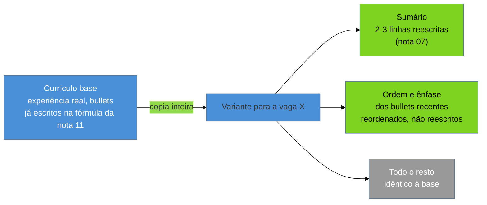

# Adaptar por vaga sem reescrever

> [!abstract] TL;DR
> Adaptar um currículo para uma vaga específica não é um exercício de reescrita — é uma operação **cirúrgica** sobre uma **base sólida** já pronta, que mexe em duas coisas e só duas: o [[03-Dominios/Carreira/Currículo/07 - O sumário profissional|sumário]] no topo do documento, duas ou três linhas ajustadas para espelhar o que aquela vaga específica pede, e a **ordem e ênfase** dos bullets nas experiências mais recentes, tratadas em profundidade nas notas [[03-Dominios/Carreira/Currículo/11 - A linha de bullet|11]] e [[03-Dominios/Carreira/Currículo/16 - A seção de experiência profissional|16]]. É trabalho de minutos, não de horas, e essa diferença de escala é o que separa parecer um candidato genérico de parecer o candidato daquela vaga específica. O histórico do repositório de currículos do autor deste vault, versionado como qualquer outro código, guarda a lição mais cara desta nota: uma variante inteira foi reescrita do zero para uma vaga, a mudança foi revertida depois, e o que sobreviveu da reescrita foi **um único bullet** — o resto era trabalho jogado fora que uma base bem mantida já resolvia sozinha. Esta nota também fixa um critério de parada, porque adaptação sem limite vira outra coisa: currículo diferente demais para você sustentar na conversa que ele existe para gerar.

## A tese: cirúrgica, não reescrita

Uma reação comum, diante de uma vaga que parece diferente das outras a que a pessoa já se candidatou, é sentir o impulso de reescrever o currículo do zero para aquela vaga em particular — reorganizar seções, trocar frases inteiras, reformular a apresentação de cada experiência para soar mais alinhada ao anúncio que acabou de ser lido. O impulso é compreensível — a vaga é nova, o texto dela é diferente, parece razoável que o documento que responde a ela também precise ser diferente — mas ele parte de uma premissa errada sobre o que, de fato, muda de uma vaga para outra dentro da mesma carreira. O que muda entre vagas parecidas, na maioria dos casos, não é a pessoa nem a experiência dela — é qual parte dessa experiência a vaga específica precisa ver primeiro. A carreira é a mesma; o que varia é o **enquadramento**.

Essa distinção é o que torna a adaptação cirúrgica possível, e é também o motivo pelo qual ela é suficiente na maioria dos casos: se a base do currículo já foi construída com cuidado — cabeçalho estável, sumário honesto, seção de experiência com bullets fortes na fórmula que a nota 11 descreve, habilidades técnicas sustentadas pela regra de lastro que a nota 09 fixa — então a experiência de fundo já está lá, documentada e defensável. O que falta, para uma vaga específica, não é gerar experiência nova nem reescrever a que já existe; é decidir qual fatia dessa experiência a vaga precisa ver com mais destaque, e mexer só nisso. A pergunta que organiza a adaptação inteira não é "como eu reescrevo meu currículo para esta vaga", e sim "o que, do que já está escrito e é verdade, esta vaga específica mais precisa ver primeiro".

Duas peças concentram praticamente todo o trabalho de resposta a essa pergunta, e vale nomear as duas com precisão, porque cada uma tem seu próprio mecanismo. A primeira é o **sumário**, tratado em profundidade na nota 07 — o trailer de três a cinco linhas no topo do documento, cuja função inteira é convencer o leitor a continuar lendo. Como o sumário é curto, resume e não desenvolve, e não carrega prova detalhada de nada, ele é a peça do currículo com o menor custo de edição por vaga e o maior retorno visível: trocar duas ou três palavras nele — qual tecnologia aparece primeiro, qual tipo de impacto é nomeado na primeira frase, qual domínio de problema é citado — muda a primeira impressão do documento inteiro sem exigir reescrever mais nada abaixo dele. É, por isso, a peça que mais muda de variante para variante — o suficiente para que esta nota não repita aqui o que a nota 07 já ensina sobre BLUF e sobre a variação do sumário nos seis níveis, e apenas remeta a ela.

A segunda peça é a **ordem e a ênfase dos bullets** dentro das experiências mais recentes — não o conteúdo deles, que continua sendo o mesmo fato verdadeiro descrito na base, mas qual bullet aparece primeiro dentro de cada entrada, e qual palavra dentro de cada bullet carrega o negrito. A nota 16 já tratou da entrada de experiência como unidade — cargo, empresa, período, linha de contexto — e a nota 11 já tratou do bullet individual como a unidade que o leitor de fato processa numa varredura; esta nota não repete nenhuma das duas fórmulas, e trata de uma decisão um nível acima: dado um conjunto de bullets já escritos e válidos, qual ordem entre eles, e qual ênfase dentro de cada um, serve melhor a esta vaga específica. Um bullet sobre otimização de performance e um bullet sobre liderança técnica de um projeto podem, os dois, ser igualmente verdadeiros e igualmente fortes — mas se a vaga enfatiza escala e velocidade, o primeiro sobe; se a vaga enfatiza coordenação entre times, o segundo sobe. Nada no conteúdo de nenhum dos dois muda; só a posição relativa entre eles muda.

O que essas duas peças têm em comum, e o que faz da adaptação um trabalho de minutos em vez de horas, é que nenhuma das duas exige gerar fato novo. A base já contém tudo o que a adaptação precisa — a experiência real, os números defensáveis das notas 14 e 15, os bullets na fórmula da nota 11 — e o trabalho de adaptação é puramente um trabalho de **seleção e reordenação** sobre esse material já pronto, não um trabalho de composição. É essa diferença de natureza, entre selecionar e compor, que separa minutos de horas, e é ela que a próxima seção desta nota vai mostrar sendo violada, com um custo real, no repositório do autor deste vault.

O diagrama fixa a proporção que esta nota inteira defende: duas peças pequenas se movem, e o resto do documento — a maior parte dele, em volume — permanece exatamente como estava na base. Uma variante que se afasta muito dessa proporção deixou de ser adaptação e virou outra coisa, ponto que a seção sobre o critério de parada, mais adiante, trata com cuidado.

## Os termos da vaga, não os sinônimos — e o limite que já foi fixado

A nota 09 já ensinou uma regra prática que pertence tanto à seção de habilidades técnicas quanto, de um jeito mais amplo, a qualquer parte do currículo que possa ecoar o vocabulário exato de uma descrição de vaga: **usar os mesmos termos que a vaga usa, não sinônimos equivalentes**. Se a vaga escreve "React", o currículo escreve "React" — não "ReactJS", não "React.js" — porque, como a nota 09 já explicou a partir do mecanismo de busca por termo descrito na nota 04, uma busca booleana por "React" não encontra "ReactJS" a menos que alguém tenha configurado explicitamente uma lista de sinônimos, o que a maioria dos sistemas de triagem automatizada não faz por padrão. Esta nota não repete essa explicação — ela reaparece aqui só para ser aplicada ao contexto específico da adaptação por vaga, que é exatamente o momento em que essa regra tem mais peso prático: é ao abrir a descrição de uma vaga nova, termo a termo, que a chance de encontrar uma divergência de grafia entre o vocabulário do candidato e o vocabulário do anúncio é maior.

O ponto que esta nota precisa marcar com clareza, porque as duas regras lado a lado são fáceis de confundir se lidas depressa, é o **limite** que a própria nota 09 já fixou para essa orientação, e que vale repetir aqui, no ponto exato em que a confusão é mais provável de acontecer. A regra dos termos da vaga vale **só quando a competência já existe** e a diferença entre o que está escrito e o que a vaga pede é puramente de grafia ou de sinônimo — trocar "ReactJS" por "React" quando a pessoa de fato trabalha com React é comunicação eficaz, sem custo nenhum de honestidade. Adicionar um termo à lista de habilidades, ou destacá-lo num bullet, porque a vaga o menciona, sem que exista lastro real por trás — sem uma história concreta para contar se a pergunta vier numa entrevista — é o anti-padrão que a nota 09 nomeia como **regra de lastro** e proíbe explicitamente, com o mesmo peso de qualquer outra afirmação inflada no documento.

As duas orientações, lidas juntas e fora de contexto, poderiam soar como uma única mensagem contraditória — "use os termos da vaga" ao lado de "não invente competência que a vaga pede" — mas elas não são duas regras em tensão; são a mesma régua aplicada em dois momentos diferentes da decisão. Primeiro vem a pergunta de lastro, sempre: esta competência existe de verdade, com uma história real por trás dela? Se a resposta é não, a discussão sobre qual grafia usar nem chega a começar, porque o termo não entra no documento de jeito nenhum, disfarçado sob nenhuma forma. Se a resposta é sim, aí sim entra a regra desta seção: escrever esse termo real do jeito que a vaga escreve, não do jeito que soa mais natural para quem escreve. A adaptação por vaga nunca decide **o que** aparece no currículo — isso já foi decidido, com honestidade, na hora de montar a base; ela decide só **como** aquilo que já é verdade é nomeado e ordenado diante de um leitor específico.

## Casos práticos — as lições do repositório

O autor deste vault mantém um repositório de currículos versionado, no qual cada alteração — trocar uma frase, reordenar uma seção, gerar uma variante nova para uma vaga — fica registrada como um commit, com data e diferença explícita entre a versão anterior e a nova. Um repositório assim não é só ferramenta de produção; com o tempo, ele também vira um registro honesto de decisões, incluindo as decisões erradas, porque nada nele precisa ser lembrado de memória — o histórico está lá, consultável, sem espaço para embelezar o que de fato aconteceu. As quatro lições que seguem vêm direto desse histórico.

### A reescrita completa que foi revertida

> [!example] Caso real
> Numa candidatura específica, o autor deste vault reescreveu a variante de currículo inteira para aquela vaga — não ajustou o sumário e reordenou bullets, como esta nota defende; reformulou o documento inteiro, seção por seção, tentando fazê-lo soar mais alinhado ao anúncio. Passado algum tempo, essa reescrita foi revertida, e a variante voltou a ser **idêntica à base**, exceto por um único bullet, que absorveu o detalhe específico que aquela vaga pedia e que a base genérica não cobria. O histórico de commits do próprio repositório registra as duas pontas dessa história: o commit da reescrita completa, e o commit posterior que a desfez quase inteira, preservando só o que se provou de fato necessário.

A lição que esse caso deixa não é sutil, e é o motivo pelo qual esta nota abre com ele: **quase toda a reescrita foi trabalho jogado fora**. O tempo gasto reformulando seções que já estavam corretas, frases que já comunicavam o que precisavam comunicar, ordens que já faziam sentido, não produziu nenhum ganho que sobrevivesse à revisão posterior — o que sobreviveu foi exatamente a fração do trabalho que uma adaptação cirúrgica teria produzido de qualquer forma, num décimo do tempo. A reescrita completa não é apenas ineficiente; ela é, na maioria dos casos, um desperdício quase total, porque a base bem construída já continha o que a vaga precisava, e o trabalho de reescrever do zero gastou tempo redescobrindo isso, frase por frase, em vez de simplesmente confiar na base e mexer só no que de fato precisava mudar.

### O que se prova geral sobe para a base

A segunda metade dessa mesma história é um princípio, não um evento isolado, e vale nomeá-lo à parte porque ele muda a direção em que o trabalho de adaptação flui: quando um ajuste feito para uma vaga específica se mostra bom em geral — não só para aquela vaga, mas para qualquer leitor —, ele deixa de ser adaptação e sobe para a base, virando o novo padrão para todas as variantes futuras. O bullet que sobreviveu à reversão do caso acima é um exemplo desse mecanismo em miniatura: um detalhe que nasceu como resposta a uma vaga específica, mas que se mostrou útil o bastante para continuar ali mesmo depois de a reescrita ao redor dele ter sido descartada.

Esse mesmo princípio, segundo o histórico do repositório do autor deste vault, já operou em pontos maiores do documento do que um único bullet — o cabeçalho, a ordem em que as tecnologias aparecem na seção de habilidades, a formulação do próprio sumário já passaram, em algum momento, por uma versão que nasceu como ajuste pontual para uma vaga e que, provando-se boa fora daquele contexto específico, foi promovida a padrão da base. A implicação prática para quem não mantém um repositório versionado, mas ainda assim adapta o próprio currículo vaga a vaga, é a mesma: vale a pena, de tempos em tempos, olhar para trás e perguntar se algum ajuste feito para uma vaga específica não deveria, na verdade, estar na base o tempo todo — porque se ele funciona bem para aquele leitor, é bem provável que funcione bem para os próximos também, e manter esse ajuste isolado numa única variante é perder o ganho em todas as outras candidaturas.

### Reordenar por analogia

> [!example] Caso real
> Para uma vaga cujo desafio central, descrito no próprio anúncio, era conduzir uma migração de uma linguagem de programação para outra dentro de um sistema existente, o autor deste vault promoveu, na variante daquela candidatura, a experiência profissional de migração de linguagem que já constava na base — movendo-a para o topo da seção de experiência, à frente de entradas mais recentes no calendário, porque ela era o caso mais análogo ao problema que a vaga descrevia. Nenhum texto novo foi escrito; a experiência já estava documentada na base, com os bullets já prontos. O que mudou foi só a posição dela dentro da seção.

Esse caso é o exemplo mais limpo, dentre as lições do repositório, do que esta nota chama de adaptação cirúrgica na prática: a operação mais barata e, ao mesmo tempo, mais eficaz que existe sobre uma seção de experiência já bem escrita não é reescrever nenhuma entrada — é **reordenar** quais entradas aparecem primeiro. A ordem cronológica inversa, que a nota 16 estabelece como padrão geral do documento, continua sendo o padrão correto na maioria das candidaturas; mas diante de uma vaga cujo desafio central tem um análogo direto e reconhecível na trajetória do candidato, promover esse análogo ao topo — mesmo que ele não seja a experiência mais recente no calendário — comunica, num único movimento, exatamente o que aquele leitor específico mais precisa ver primeiro: "eu já fiz o tipo de coisa que vocês estão descrevendo, e é a primeira coisa que vou mostrar a vocês". Trocar a ordem custa segundos; teria custado muito mais tempo tentar reescrever uma experiência mais recente para tentar fazê-la soar parecida com um desafio que ela nunca de fato endereçou.

### Negrito é recurso escasso

> [!example] Caso real
> Num único passe de revisão sobre a base do currículo, o autor deste vault reduziu a quantidade de trechos em negrito de **106 para 26** — uma queda de aproximadamente três quartos do total. O documento, depois do corte, não perdeu nenhuma informação: os mesmos fatos, os mesmos números, os mesmos bullets continuaram lá. O que mudou foi só quais palavras dentro deles carregavam destaque visual.

O raciocínio por trás desse corte é simples de enunciar e fácil de esquecer na prática, porque negrito, tomado item a item, sempre parece uma boa ideia isolada — "esse número é importante, vale destacar"; "esse verbo mostra propriedade, vale destacar"; "esse nome de tecnologia é o que a vaga pede, vale destacar". O problema não é nenhuma dessas decisões individuais; é o efeito acumulado de tomar essa decisão cento e seis vezes no mesmo documento. **Negrito demais é negrito nenhum**: quando quase toda linha da página carrega algum trecho destacado, o olho do segundo leitor, que a nota 04 já descreveu varrendo o documento num padrão em F, deixa de ter para onde ir — o destaque só funciona como sinal de "olhe aqui primeiro" quando ele é raro o suficiente para se distinguir do texto ao redor, e um documento em que um terço das palavras está em negrito não distingue mais nada.

Isso é adaptação de ênfase — do que esta nota trata desde a primeira seção — aplicada dentro de um único bullet, e não só entre bullets. Assim como a ordem entre entradas de experiência pode subir ou descer conforme o que a vaga mais precisa ver, o negrito dentro de uma linha específica pode se deslocar de uma palavra para outra sem que o texto mude uma sílaba: um bullet sobre redução de tempo de resposta pode destacar o número numa candidatura voltada a performance, e destacar o nome da tecnologia numa candidatura em que aquele stack específico é o requisito central — o mesmo bullet, o mesmo fato, servindo dois leitores diferentes com um deslocamento de ênfase que custa segundos para editar. Mas essa flexibilidade só funciona enquanto o negrito continua escasso; um documento que já chega em cento e seis trechos destacados não tem mais margem para essa manobra, porque não sobra contraste nenhum para deslocar.

### Uma nota fora do escopo desta

Uma dúvida que costuma surgir junto com a adaptação por vaga — o que fazer quando a experiência real do candidato tem menos sobreposição com o requisito da vaga do que a variante gostaria de mostrar — não é assunto desta nota. Declarar lacuna de forma honesta, e onde isso deve acontecer dentro do processo, é o tema específico da [[03-Dominios/Carreira/Currículo/19 - Declarar lacuna|nota 19]], que trata o problema em profundidade própria; esta nota apenas registra que a pergunta existe e remete adiante, sem desenvolvê-la aqui.

## O critério de parada

As quatro lições da seção anterior descrevem adaptação que funcionou, mas nenhuma delas, isolada, ensina onde a adaptação **deveria** ter parado se tivesse ido longe demais — e é esse limite que esta seção existe para fixar, porque sem ele a tese inteira desta nota vira, por acidente, uma licença para inflar o documento. Se ajustar o sumário e reordenar bullets é legítimo, alguém lendo rápido pode concluir que ajustar um pouco mais — trocar a formulação de um resultado, generalizar um número, sugerir uma responsabilidade um degrau acima da real — também é, desde que a intenção continue sendo "adaptar para a vaga". Não é. A diferença entre as duas coisas não é de grau, é de natureza, e vale nomeá-la com precisão.

Adaptação, na definição que esta nota defende desde a primeira seção, é **seleção e reordenação** sobre um conjunto de fatos que já são verdadeiros na base — o que aparece primeiro, o que fica em destaque, quais duas ou três linhas do sumário abrem o documento. Ela nunca introduz um fato novo, nunca muda o que de fato aconteceu, nunca desloca uma responsabilidade de "participei" para "conduzi" só porque a vaga valorizaria mais a segunda palavra. No momento em que uma variante passa a descrever algo que a base não descrevia — um resultado maior do que o real, uma tecnologia operada sozinha quando na verdade foi parceria, um escopo mais amplo do que o de fato ocupado —, ela deixou de ser a mesma carreira contada com ênfase diferente e passou a ser um documento diferente, que a pessoa por trás dele não vai reconhecer inteiramente como a própria história quando precisar defendê-la ao vivo.

O teste operacional que esta nota propõe para essa fronteira é simples de aplicar antes de qualquer edição entrar na variante final: **se você não conseguiria contar a mesma história em voz alta, numa entrevista, exatamente como o currículo a descreve, a adaptação passou do ponto.** Não é um teste sobre o quanto a frase soa bem no papel — é um teste sobre se a pessoa, sentada diante de quem vai perguntar "me conta mais sobre isso", consegue sustentar cada palavra daquela linha sem precisar reformular o que ela de fato significa. Um bullet reordenado para o topo porque é o caso mais análogo à vaga passa nesse teste sem esforço — a história por trás dele não mudou, só a posição dela no documento mudou. Um bullet cuja palavra-chave foi trocada para soar mais parecida com o requisito da vaga, sem que a experiência por trás sustente essa palavra, falha no mesmo teste na primeira pergunta de acompanhamento.

Esse teste conecta diretamente com a regra de lastro que a nota 09 já fixou para a seção de habilidades técnicas, e vale marcar essa conexão explicitamente, porque as duas regras protegem o mesmo tipo de coisa em dois lugares diferentes do documento. A regra de lastro pergunta se existe uma história real por trás de um termo antes de ele entrar na lista de habilidades; o critério de parada desta nota pergunta se a variante inteira, depois de adaptada, ainda é uma história que a pessoa reconhece como a própria quando contada em voz alta. As duas são a mesma disciplina — nunca deixar o documento afirmar mais do que a pessoa consegue sustentar numa conversa — aplicada em escalas diferentes: uma palavra numa lista, ou um currículo inteiro depois de adaptado.

## O custo escondido da adaptação por vaga

Existe um custo na adaptação por vaga que não aparece em nenhuma das seções anteriores, porque ele não é sobre o que entra ou sai do documento — é sobre o que acontece depois que o documento sai das mãos de quem o escreveu. Cada variante enviada para uma candidatura é um documento que passa a existir no mundo, fora do controle de quem o gerou: alguém guardou uma cópia, algum sistema de triagem indexou o conteúdo, e essa cópia específica — com aquele sumário, aquela ordem de bullets, aquele negrito — não pode mais ser silenciosamente substituída se a base mudar depois. A [[03-Dominios/Carreira/Currículo/22 - O currículo como pipeline|nota 22]] trata esse problema em profundidade, tratando cada variante enviada como um **registro histórico imutável**; esta nota só registra o gancho, sem desenvolvê-lo aqui, porque o assunto pertence inteiro àquela nota mais adiante no galho.

## Variação por nível

A escala da adaptação, mais do que a natureza dela, muda ao longo dos seis níveis que a [[03-Dominios/Carreira/Currículo/03 - Os seis níveis e o que muda entre eles|nota 03]] descreve, porque o que cada vaga precisa ver primeiro varia de acordo com o que o documento, naquele nível, já precisa provar de qualquer forma.

Nos primeiros degraus da escada — **estagiário, trainee, júnior** —, a seção de habilidades ainda carrega grande parte do peso do documento, como a nota 09 já registrou, e é ali, mais do que na seção de experiência, que a adaptação por vaga costuma render mais: garantir que a categorização e os termos usados espelham exatamente o vocabulário da descrição, sem inflar nenhum item além do que a regra de lastro permite. A seção de experiência, quando existe nesses níveis, costuma ser curta o suficiente para que reordenar entradas produza pouco efeito prático — há poucas entradas para reordenar entre si.

No meio da escada — **pleno, sênior** —, o centro de gravidade da adaptação se desloca exatamente para as duas peças que esta nota descreve como o núcleo do trabalho: o sumário, que já carrega proporcionalmente mais peso nesses níveis segundo a nota 07, e a ordem e ênfase dos bullets nas experiências recentes, onde já existe material suficiente — várias entradas, cada uma com vários bullets — para que a reordenação por analogia, como no caso da migração de linguagem descrito nesta nota, tenha efeito visível. É também nesses níveis que o critério de parada pesa mais, porque a pressão para inflar um resultado ou generalizar uma responsabilidade tende a crescer junto com a expectativa que o mercado deposita sobre o cargo.

No topo da escada — **staff** —, a nota 03 já registrou que o documento inteiro se apoia menos em lista e mais em decisão de arquitetura e mentoria em escala; a adaptação, nesse nível, tende a se concentrar quase inteiramente no sumário e na escolha de qual decisão arquitetural, dentre várias possíveis na trajetória da pessoa, é a mais análoga ao problema que a vaga descreve — o mesmo mecanismo de reordenação por analogia desta nota, só que aplicado a decisões, não a bullets de execução.

## Armadilhas comuns

> [!warning] Reescrever quando bastaria reordenar
> **O que acontece:** diante de uma vaga que parece diferente das outras, a pessoa reabre o documento inteiro e começa a reescrever seções que já estavam corretas — não porque algo nelas estivesse errado, mas porque parece que "adaptar de verdade" exige mais esforço visível do que só mudar a ordem de algumas linhas. **Por quê:** o esforço visível parece, incorretamente, uma medida de cuidado — como se um documento reescrito do zero comunicasse mais dedicação à vaga do que um documento com duas linhas de sumário trocadas e três bullets reordenados, mesmo quando o segundo é objetivamente mais forte. **Como evitar:** perguntar, antes de qualquer edição, se a mudança pretendida é seleção e reordenação sobre fato já existente na base, ou se é composição de texto novo — e, se for a segunda, parar e verificar se o que falta não deveria, na verdade, ser incorporado à base primeiro.

> [!warning] Confundir termo real trocado de grafia com termo inflado sem lastro
> **O que acontece:** ao aplicar a regra de usar os termos exatos da vaga, a pessoa deixa de distinguir entre trocar a grafia de uma competência que já existe — "ReactJS" por "React" — e adicionar uma competência inteira que a vaga pede mas que não tem lastro real por trás. **Por quê:** as duas operações parecem, à primeira vista, a mesma coisa — "usar a palavra que a vaga usa" —, e a pressão de bater com o vocabulário exato do anúncio empurra na direção de tratar as duas como equivalentes. **Como evitar:** aplicar sempre a pergunta da nota 09 antes de qualquer troca de termo — "eu tenho uma história real para contar sobre isso, se perguntado?" — e só então decidir se a operação é de grafia (permitida) ou de invenção de competência (proibida pela regra de lastro).

> [!warning] Deixar negrito acumular variante após variante
> **O que acontece:** cada nova adaptação por vaga acrescenta destaque a mais um trecho que parece relevante para aquela vaga específica, sem revisar o restante do negrito já acumulado de adaptações anteriores — e, depois de dezenas de variantes, o documento inteiro está pontilhado de negrito sem que nenhuma edição isolada pareça, sozinha, ter causado o problema. **Por quê:** cada decisão de destacar um trecho é local e parece razoável no momento em que é tomada; o efeito cumulativo só fica visível quando alguém olha o documento inteiro de uma vez, o que raramente acontece no meio de uma candidatura sob prazo. **Como evitar:** de tempos em tempos, revisar a base inteira contando quantos trechos estão em negrito, e cortar deliberadamente até que o destaque volte a ser raro o suficiente para funcionar — o mesmo exercício que reduziu o negrito de 106 para 26 trechos no caso descrito nesta nota.

## Como soa em inglês

> "I keep one strong base résumé and adapt it per role in minutes, not hours — I only touch two things: the summary at the top, and the order and emphasis of the bullets in my recent experience. I use the exact terms from the job description instead of synonyms, but only for skills I can actually back up in an interview — I never add a keyword just because the posting asks for it. Early on, I once rewrote an entire variant from scratch for a specific role, and later reverted almost all of it — the only thing that survived was a single bullet. Everything else was wasted effort a base résumé already covered. My rule of thumb: if I couldn't tell the same story out loud, word for word, the way the résumé describes it, I've adapted too far."

Essa formulação vale a pena treinar em voz alta antes de uma entrevista em inglês, porque a pergunta "how do you tailor your résumé for different roles?" aparece com frequência em processos internacionais, e uma resposta que demonstra disciplina — poucas edições, deliberadas, com limite explícito — costuma soar mais madura para um entrevistador experiente do que uma resposta que descreve reescrever o documento inteiro a cada candidatura.

| PT | EN |
| --- | --- |
| adaptação cirúrgica | surgical tailoring |
| reescrita completa | full rewrite |
| base sólida | strong base résumé |
| ordem e ênfase | order and emphasis |
| reordenar por analogia | reorder by analogy |
| termos da vaga | job description keywords |
| regra de lastro | backing rule |
| critério de parada | stopping criterion |

## O que vem a seguir

Fechado o bloco Adepto sobre como transformar uma base bem construída numa variante específica sem reescrever nada, o próximo passo natural do galho trata do que fazer quando a base, por mais bem construída que seja, não cobre tudo o que uma vaga específica pede:

- [[03-Dominios/Carreira/Currículo/19 - Declarar lacuna|19 - Declarar lacuna]] — como e onde declarar a lacuna que a adaptação por vaga, sozinha, não consegue fechar: na conversa, não no documento.
- [[03-Dominios/Carreira/Currículo/22 - O currículo como pipeline|22 - O currículo como pipeline]] — o custo escondido que esta nota apenas nomeou: cada variante enviada como registro histórico imutável, e o que isso implica para quem mantém várias variantes ao mesmo tempo.

## Veja também

- [[03-Dominios/Carreira/Currículo/index|Currículo]] — o índice do galho, com a tese e o mapa das 26 notas.
- [[03-Dominios/Carreira/Currículo/07 - O sumário profissional|07 - O sumário profissional]] — a peça que mais muda entre variantes; esta nota remete a ela sem repetir o BLUF nem a variação por nível já ensinados lá.
- [[03-Dominios/Carreira/Currículo/09 - Habilidades técnicas|09 - Habilidades técnicas]] — origem da regra de lastro e da regra dos termos da vaga, aplicadas aqui ao contexto específico da adaptação.
- [[03-Dominios/Carreira/Currículo/11 - A linha de bullet|11 - A linha de bullet]] — a fórmula de cada bullet individual, que a adaptação por vaga reordena e reenfatiza, mas não reescreve.
- [[03-Dominios/Carreira/Currículo/16 - A seção de experiência profissional|16 - A seção de experiência profissional]] — a entrada como unidade, cuja ordem entre experiências a reordenação por analogia desta nota altera.
- [[03-Dominios/Carreira/Currículo/03 - Os seis níveis e o que muda entre eles|03 - Os seis níveis e o que muda entre eles]] — o vocabulário de nível usado na seção de variação por nível desta nota.
- [[03-Dominios/Carreira/Entrevistas/05 - Currículo e LinkedIn como artefatos de triagem|Entrevistas/05 - Currículo e LinkedIn como artefatos de triagem]] — o galho parceiro: o que a etapa de triagem faz com o documento depois que a adaptação por vaga já aconteceu.

## Fontes

- Esta nota não introduz dado quantitativo novo além do que já foi verificado por outras notas do galho — a regra de busca por termo e o mecanismo de extração citados na seção sobre termos da vaga vêm das notas [[03-Dominios/Carreira/Currículo/04 - Quem lê o seu currículo — e o que a evidência diz|04]] e [[03-Dominios/Carreira/Currículo/09 - Habilidades técnicas|09]], cujas fontes primárias sustentam essas afirmações.
- Os quatro casos reais desta nota — a reescrita revertida, a promoção de ajuste pontual à base, a reordenação por analogia da experiência de migração, e a redução de negrito de 106 para 26 trechos — são relato de primeira mão do autor deste vault sobre o próprio repositório de currículos versionado, ferramental privado sem link público, no mesmo padrão de fonte já estabelecido pela [[03-Dominios/Carreira/Currículo/05 - Formato e legibilidade de máquina|nota 05]] para o mesmo pipeline.
