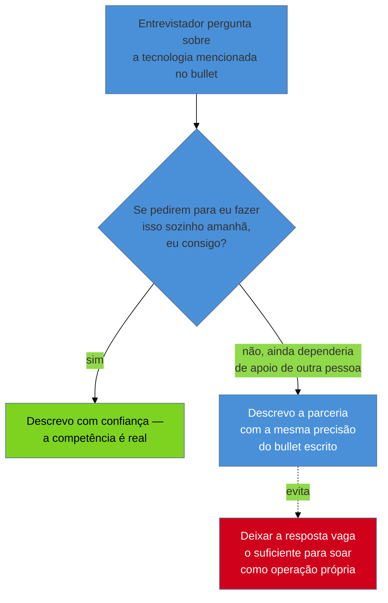
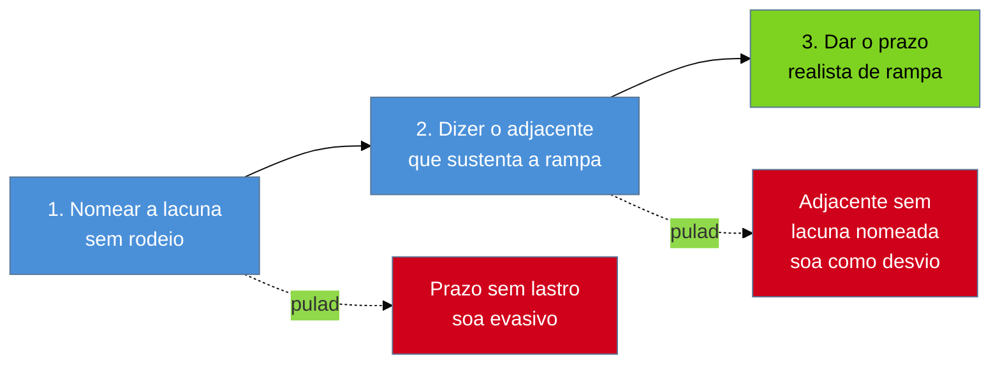

# Declarar lacuna

> [!abstract] TL;DR
> Toda vaga tem alguma distância entre o que ela pede e o que o candidato de fato sustenta — e a tentação de fechar essa distância inflando a própria competência é, das decisões que este galho trata, a que carrega a assimetria de risco mais grave: a [[03-Dominios/Carreira/Currículo/15 - Quando não há número|nota 15]] já mostrou que um número inventado é o único erro de currículo capaz de custar o emprego, não a entrevista, e a mesma lógica vale, com o mesmo peso, para competência inflada. O primeiro ponto que esta nota fixa é **onde** a lacuna deve ser declarada — quase nunca no documento, quase sempre na conversa —, porque o currículo é caro por linha e a conversa é barata e tem contexto para absorver a nuance que uma seção de lacunas jamais teria espaço para carregar. O segundo ponto, e o mais fino, retoma a regra de lastro que a [[03-Dominios/Carreira/Currículo/09 - Habilidades técnicas|nota 09]] já cravou para a seção de habilidades técnicas, pelo lado oposto: lá, a regra decidia o que **sai** da lista; aqui, ela decide como se **fala** do que ficou de fora, e a distinção decisiva é que descrever **parceria** com uma tecnologia não é o mesmo que reivindicar **operação** dela. O terceiro ponto é um procedimento de três movimentos, nesta ordem — nomear a lacuna, dizer o adjacente que você domina, dar o prazo realista de rampa — e o quarto é o limite simétrico: nem toda lacuna merece declaração, e declarar o que ninguém perguntou é tão custoso quanto escondê-la.

## O erro que custa a vaga depois de conquistada

A [[03-Dominios/Carreira/Currículo/15 - Quando não há número|nota 15]] já nomeou uma assimetria que atravessa o galho inteiro e que vale reabrir aqui, porque ela é o alicerce de tudo o que esta nota vai defender: quase todo defeito de currículo tem um teto de dano bem definido, que se esgota antes de a entrevista terminar. Um sumário genérico, um bullet fraco, uma seção de habilidades bagunçada — cada um desses erros, na pior hipótese, faz o leitor descartar o documento sem gerar a conversa que ele existia para gerar. É uma perda real, mas silenciosa, e o candidato segue para a próxima candidatura sem carregar dívida nenhuma daquele erro específico.

Inflar competência não segue essa mesma curva, e é por isso que esta nota trata o tema como um capítulo à parte, não como uma seção a mais dentro de qualquer nota sobre habilidades ou experiência. Uma competência exagerada pode passar pela triagem sem levantar bandeira nenhuma. Pode soar convincente na primeira leitura humana. Pode até sobreviver a uma entrevista técnica inteira, se a pergunta certa não vier naquele dia específico — a nota 09 já registrou que um entrevistador competente costuma perguntar por uma história concreta antes de aceitar um item da lista de habilidades, mas "costuma" não é "sempre", e um processo seletivo apressado, com entrevistadores diferentes em cada etapa, deixa buracos reais por onde uma lacuna inflada consegue passar sem ser testada. O que muda tudo, e o que separa este erro de qualquer outro deste galho, é o que acontece **depois** de a vaga já ter sido conquistada: a pessoa senta na cadeira, o trabalho real começa, e a distância entre o que o currículo prometeu e o que a pessoa de fato sabe deixa de ser uma hipótese não testada para virar um problema operacional, na frente de um time inteiro que já reorganizou expectativas — de escopo, de prazo, de quem cobre o quê — em cima da premissa de que aquela competência existia.

O momento em que a lacuna aparece, nesse cenário, é sempre pior do que qualquer pergunta de entrevista poderia ter sido. Numa entrevista, a lacuna exposta custa, no limite, aquela vaga específica — dolorido, mas contido. Depois da contratação, a mesma lacuna exposta custa a confiança de pessoas que já dependem da pessoa para algo concreto: um deploy que precisa acontecer, uma decisão de arquitetura que precisa de alguém que já operou aquilo antes, um incidente em produção que ninguém mais no time sabe resolver porque foi justamente por essa competência que a contratação aconteceu. A pergunta que a entrevista teria feito em segundos — "me conta uma vez que você fez isso sozinho" — o trabalho real faz em semanas, com um custo em produção, tempo de outras pessoas e credibilidade que nenhuma pergunta de entrevista jamais cobraria. É essa diferença de momento, entre a porta ainda fechada e a porta já atravessada, que a nota 15 nomeou para números e que esta nota nomeia, com o mesmo peso, para competência: o erro mais caro deste galho não é o que faz o telefone não tocar — é o que faz o telefone tocar cedo demais, para a pergunta errada, meses depois de todo mundo já ter combinado que aquela competência estava garantida.

## Onde declarar: na conversa, não no documento

Estabelecida a gravidade do erro, a pergunta prática que esta nota precisa responder primeiro não é "devo declarar a lacuna" — a resposta a essa pergunta, quando a lacuna é relevante, é quase sempre sim, e a seção sobre quando não declarar, mais adiante, trata da exceção. A pergunta mais útil, e a que a maioria dos guias de currículo nunca chega a fazer com clareza, é **onde** essa declaração deveria acontecer. E a resposta, que organiza esta nota inteira, é que o lugar certo quase nunca é o documento — é a conversa que o documento existe para gerar.

O motivo é uma questão de economia, não de pudor. O currículo é, como a [[03-Dominios/Carreira/Currículo/01 - Para que serve um currículo|nota 01]] já estabeleceu, um documento com um objetivo único e um espaço radicalmente limitado para cumpri-lo — cada linha compete por segundos de atenção de um leitor que já decidiu, antes de terminar a primeira página, se vale a pena continuar. Uma seção dedicada a listar lacunas, por mais bem-intencionada que seja, consome esse espaço escasso para comunicar algo que a conversa consegue comunicar de graça, com muito mais nuance e muito menos risco de má leitura. A conversa, ao contrário do documento, tem contexto: quem pergunta pode fazer a pergunta de acompanhamento, pode explicar por que aquele requisito específico importa tanto para aquela vaga, pode ouvir o adjacente que sustenta a rampa antes de decidir o quanto aquela lacuna pesa. O documento não tem nada disso — ele só tem a linha, isolada, para um leitor que talvez nunca converse com quem a escreveu.

> [!example] Caso real
> Numa candidatura específica, o autor deste vault havia incluído no próprio currículo uma seção declarando lacunas de Go, GCP e Terraform — três tecnologias que apareciam com frequência nas descrições de vaga da época, mas que ele não dominava com profundidade suficiente para reivindicar operação própria. Essa seção foi removida do documento. O motivo não foi desconforto em admitir a lacuna — o motivo foi que a transparência já tinha sido feita por outro canal: um e-mail trocado diretamente com a recrutadora responsável pela vaga, explicando, em contexto, onde estava a lacuna e o que sustentava a confiança de que ela poderia ser fechada. A recrutadora respondeu bem a esse e-mail. Repetir a mesma informação dentro do documento, depois disso, era redundância pura — e essa redundância tinha um custo mensurável: a seção ocupava uma página inteira do currículo, espaço que nenhuma outra parte do documento podia mais usar. O repositório de currículos versionado do autor, onde essa decisão está registrada como qualquer outra mudança de conteúdo, é ferramental privado, sem link público — no mesmo padrão de fonte já estabelecido pelas notas [[03-Dominios/Carreira/Currículo/05 - Formato e legibilidade de máquina|05]] e [[03-Dominios/Carreira/Currículo/18 - Adaptar por vaga sem reescrever|18]] para o mesmo pipeline.

O caso acima ilustra o mecanismo com mais clareza do que qualquer regra abstrata conseguiria: a transparência não desapareceu quando a seção saiu do documento — ela só migrou para o canal mais barato de manter. Um e-mail para uma recrutadora específica, sobre uma vaga específica, custa alguns minutos de escrita e chega no momento em que o contexto já existe para recebê-lo — a pessoa que lê já sabe qual vaga está em jogo, já formou uma primeira impressão do candidato, e consegue processar "aqui estão três lacunas, e aqui está por que elas não deveriam preocupar vocês" como parte de uma conversa em andamento, não como uma confissão isolada no meio de um documento que precisa, ao mesmo tempo, vender competência. Uma seção de lacunas dentro do currículo, ao contrário, chega antes de qualquer contexto ter sido construído — o leitor ainda está decidindo se vale a pena continuar, e uma lista de coisas que o candidato não sabe, por mais bem-intencionada e honesta que seja, compete diretamente contra o resto do documento pelo pouco tempo de atenção que esse leitor está disposto a gastar.

Vale marcar o limite dessa regra antes de seguir, porque "na conversa, não no documento" não significa que o documento nunca carregue nenhum sinal de lacuna. A [[03-Dominios/Carreira/Currículo/09 - Habilidades técnicas|nota 09]] já mostrou o mecanismo mais comum pelo qual o documento sinaliza uma lacuna sem precisar de uma seção dedicada a ela: simplesmente **não listando** a tecnologia na seção de habilidades. A ausência de um termo já é, ela mesma, uma forma honesta de comunicação — quem lê a seção de habilidades técnicas e não encontra "Kubernetes" nela recebe, implicitamente, a informação de que aquela competência não está sendo reivindicada, sem que nenhuma linha extra precise dizer isso em voz alta. É essa mesma lógica, aplicada com mais precisão ainda, que a próxima seção desta nota retoma — porque a ausência sozinha, às vezes, não basta, e é aí que a distinção entre parceria e operação entra em jogo.

## A distinção fina: parceria não é operação

A [[03-Dominios/Carreira/Currículo/09 - Habilidades técnicas|nota 09]] fixou, para a seção de habilidades técnicas, a regra de lastro: não listar o que não se sustenta numa pergunta de entrevista. Dentro dessa regra, ela isolou a distinção mais fina do galho inteiro sobre esse tema — **descrever parceria com uma tecnologia não é o mesmo que reivindicar operação dela** — e ilustrou essa distinção com um caso real do próprio autor: Kubernetes saiu da seção de habilidades técnicas porque não havia experiência própria de operação — nunca configurou sozinho um cluster, nunca depurou sozinho um problema de scheduling ou de rede dentro dele —, mas **permaneceu** na seção de experiência profissional, num bullet que descreve, com precisão factual, ter trabalhado ao lado da equipe de DevOps para rodar um cluster Kafka em Kubernetes.

Esta nota retoma exatamente esse caso, mas pelo lado oposto ao da nota 09. Lá, a pergunta era o que **sai** da lista de habilidades quando o lastro não existe. Aqui, a pergunta é como se **fala** — na conversa que o currículo gera, não no documento — sobre a tecnologia que saiu de um lugar e permaneceu no outro. E a resposta é a mesma distinção, só que aplicada em voz alta, diante de um entrevistador, em vez de aplicada silenciosamente na hora de decidir o conteúdo de uma seção.

Imagine o entrevistador lendo o bullet de experiência que menciona Kafka rodando sobre Kubernetes, e perguntando, com curiosidade genuína, algo como "me conta mais sobre esse trabalho com Kubernetes". É exatamente o tipo de pergunta que o galho inteiro já tratou como provável — a [[03-Dominios/Carreira/Currículo/09 - Habilidades técnicas|nota 09]] descreveu esse mecanismo para a seção de habilidades, e ele se repete, com a mesma força, para qualquer linha de experiência que mencione uma tecnologia por nome. A resposta que a distinção parceria-versus-operação autoriza não é fingir que a pergunta não foi feita, nem inflar o próprio papel para soar mais central do que foi de fato — é descrever com precisão o que aconteceu: "eu trabalhei ao lado do time de DevOps, que operava o cluster; minha parte era garantir que a aplicação que consumia e produzia mensagens no Kafka funcionasse corretamente dentro daquele ambiente, mas quem configurava e mantinha o cluster propriamente dito era outra equipe". Essa resposta não é uma confissão de fraqueza — é a mesma frase que já estava, honestamente, escrita no bullet do currículo, só que falada em voz alta, com o detalhe que o espaço do documento não tinha onde caber.

O erro que a distinção existe para prevenir é o oposto: alguém que, diante da mesma pergunta, sente a tentação de deixar a resposta vaga o suficiente para soar como se tivesse operado o cluster sozinho — "sim, trabalhei bastante com Kubernetes naquele projeto" — sem mencionar que a operação real ficava com outra equipe. É uma mentira pequena, quase de omissão, e é exatamente o tipo de mentira pequena que a assimetria de risco descrita na primeira seção desta nota pune com mais força do que qualquer entrevistador percebe na hora: se a resposta convence, e a vaga é conquistada com base, em parte, nessa impressão, o dia em que alguém pedir para essa pessoa configurar um cluster sozinha — porque o currículo e a entrevista, juntos, deram a entender que ela sabia fazer isso — é o dia em que a lacuna aparece, agora dentro do trabalho real, na frente de gente que já reorganizou expectativas em cima dela.

O critério que separa as duas respostas não é sobre Kubernetes especificamente — é generalizável a qualquer tecnologia que passou perto da trajetória de alguém através de trabalho colaborativo, sem que essa pessoa tenha sido quem a operou de fato. A pergunta que decide qual das duas respostas é a correta, para qualquer tecnologia nessa situação, é a mesma que a nota 09 já formulou para a seção de habilidades, agora aplicada à fala em voz alta: **se pedirem para você fazer isso sozinho, amanhã, você consegue?** Se a resposta honesta é sim — mesmo que a experiência tenha vindo por observação atenta e participação real ao lado de quem operava —, então descrever a competência com mais confiança é legítimo. Se a resposta honesta é não — se fazer isso sozinho, amanhã, exigiria aprender de novo, com apoio, o que a outra equipe já sabia fazer —, então a resposta em voz alta precisa preservar essa distinção com a mesma clareza que o bullet do currículo já preservava por escrito.

Vale marcar, generalizando ainda mais o que o caso de Kubernetes ensina, que essa distinção não se aplica só a tecnologias de infraestrutura. Ela vale igualmente para uma metodologia ("participei de um processo de definição de OKRs conduzido por outra pessoa" não é "eu conduzo definição de OKRs"), para uma linguagem de programação usada num projeto onde outra pessoa escrevia a maior parte do código crítico, ou para um domínio de negócio inteiro onde o candidato apoiou uma decisão sem ser quem a tomou. O mecanismo é sempre o mesmo: parceria é real, é valiosa, e merece ser contada com todo o detalhe que ela sustenta — o erro nunca é falar sobre a parceria, é deixar a fala escorregar, sem perceber, para o vocabulário que só a operação própria autorizaria.

O diagrama fixa o teste que esta seção inteira defende: a pergunta que decide a resposta não é sobre o quanto a tecnologia impressiona o entrevistador — é sobre se a pessoa, amanhã, sozinha, consegue fazer o que a resposta está prestes a dar a entender que ela sabe fazer.

## Como declarar sem se desqualificar: três movimentos, nesta ordem

Fixado o onde e a distinção fina, falta a pergunta mais prática de todas: quando a lacuna é real — não uma parceria mal descrita, mas uma ausência de fato — como declará-la sem que a declaração, por si só, tire a pessoa da corrida? A resposta desta nota é um procedimento de três movimentos, e a ordem entre eles não é estética: cada movimento prepara o terreno para o seguinte, e invertê-los produz uma impressão pior do que a lacuna em si produziria sozinha.

**O primeiro movimento é nomear a lacuna sem rodeio.** Não existe formulação que disfarce uma ausência real sem, ao mesmo tempo, soar evasiva para um entrevistador que já ouviu centenas de respostas evasivas antes. "Eu tenho alguma familiaridade com Go, mas..." é uma frase que já começa perdendo credibilidade, porque o entrevistador sabe reconhecer o padrão de quem está tentando amaciar uma resposta que, no fundo, é "não, eu não uso Go em produção". A versão que funciona é direta: "eu não tenho experiência de produção com Go — minha experiência é toda em [linguagem que a pessoa de fato domina]". Nomear primeiro, sem qualificar a ausência com meios-termos, cumpre uma função que nenhum dos outros dois movimentos consegue cumprir sozinho: estabelece, logo de saída, que a pessoa não está tentando esconder nada, o que dá crédito automático a tudo o que ela disser em seguida.

**O segundo movimento é dizer o adjacente que a pessoa de fato domina**, e é este o movimento que transforma a declaração de fraqueza confessada em evidência de capacidade real. Uma lacuna nomeada sozinha, sem nada em seguida, deixa o entrevistador com uma pergunta implícita não respondida: "e então, essa pessoa vai levar quanto tempo para aprender isso, e com que base?" O adjacente responde exatamente essa pergunta antes de ela precisar ser feita em voz alta. "Eu não tenho experiência de produção com Go, mas trabalho há cinco anos com sistemas concorrentes em Java, incluindo tuning de garbage collector e depuração de deadlock em produção" não é uma desculpa — é a evidência concreta de que a lacuna nomeada no primeiro movimento não é uma lacuna de fundamento, é uma lacuna de sintaxe e ferramental específico, apoiada em cima de um conhecimento estrutural que já existe e que Go, especificamente, reaproveita em boa parte. É esse adjacente que torna a rampa crível — sem ele, o prazo do terceiro movimento soa como um número chutado no ar; com ele, o mesmo prazo soa como uma estimativa apoiada em experiência real de já ter atravessado uma curva de aprendizado parecida antes.

**O terceiro movimento é dar o prazo realista de rampa.** Depois de nomear a lacuna e mostrar o adjacente que sustenta a ponte, dizer quanto tempo levaria para fechar a distância deixa de ser uma promessa vaga e passa a ser uma estimativa fundamentada: "com a base que tenho em concorrência e sistemas distribuídos, eu estimaria de quatro a seis semanas de imersão guiada para chegar a um nível produtivo em Go, e provavelmente mais alguns meses até me sentir confortável tomando decisões de arquitetura na linguagem sem apoio". O número não precisa ser exato — ninguém espera exatidão de uma estimativa de aprendizado —, mas precisa ser específico o suficiente para soar como algo pensado, não improvisado ali na hora só para preencher o silêncio que a pergunta deixou.

A ordem entre os três movimentos importa porque cada inversão produz um defeito de leitura diferente. Quem começa pelo prazo — "eu aprenderia isso em um mês" — antes de nomear a lacuna com clareza ou mostrar o adjacente que sustenta esse número, soa evasivo: o entrevistador percebe que a conversa está pulando direto para tranquilizá-lo, sem primeiro estabelecer o que exatamente precisa ser tranquilizado, e a pressa em resolver o desconforto antes de nomeá-lo soa como quem está tentando fechar a pergunta rápido demais para que ela não seja aprofundada. Quem começa pelo adjacente, sem antes nomear a lacuna com todas as letras — "eu tenho uma base muito forte em sistemas concorrentes" — soa como quem está desviando da pergunta original, respondendo a uma pergunta mais confortável no lugar da que foi de fato feita; o entrevistador, nesse caso, frequentemente precisa repetir a pergunta original, e essa repetição já comunica que a primeira resposta não convenceu. A sequência nomear → adjacente → prazo é a única que corresponde à ordem em que o próprio entrevistador processa a informação: primeiro ele precisa saber, com clareza, o que está em jogo; depois ele precisa de uma razão para acreditar que a lacuna é fechável; só então o prazo específico faz sentido como conclusão, não como fuga.

O diagrama fixa o motivo pelo qual esta nota trata a ordem como parte do conteúdo, não como detalhe de estilo: cada movimento depende do anterior para não ser mal lido, e pular um deles não economiza tempo — troca uma resposta convincente por uma que soa, para o ouvido treinado do outro lado da mesa, exatamente como o que ela é: uma tentativa de gerenciar a impressão em vez de responder a pergunta.

> [!example] Caso fictício
> Rafael Duarte, desenvolvedor pleno já apresentado em notas anteriores deste galho, chega a uma etapa de entrevista técnica para uma vaga que lista, entre os requisitos desejáveis, experiência com um sistema de filas distribuído que ele nunca usou em produção. Anos antes, ao aprender a regra de lastro pela primeira vez, Rafael havia se sentido tentado, numa outra entrevista, a inflar uma barra de proficiência que ninguém tinha pedido; desta vez, quando o entrevistador pergunta diretamente sobre o sistema de filas, ele aplica os três movimentos sem hesitar: nomeia — "eu nunca operei esse sistema específico em produção"; mostra o adjacente — "mas trabalhei bastante com outro sistema de mensageria, entendo os conceitos de particionamento, consumidor e garantia de entrega que a maioria dessas ferramentas compartilha"; e dá o prazo — "eu diria que levaria umas duas ou três semanas para me sentir produtivo na API específica dessa ferramenta, considerando que os conceitos de fundo já são familiares". A resposta não elimina a lacuna, mas também não deixa o entrevistador com a sensação de que Rafael estava tentando escondê-la ou inflá-la — as duas armadilhas que, anos antes, ele já tinha aprendido a evitar na seção de habilidades do próprio currículo, agora aplicadas em voz alta.

## Quando não declarar

Tudo o que esta nota defendeu até aqui poderia, lido depressa, soar como um convite a declarar toda lacuna que existe — afinal, se declarar bem é seguro e declarar mal é caro, por que não declarar tudo, por precaução? Essa leitura está errada, e vale corrigi-la com o mesmo cuidado dedicado ao resto da nota, porque o excesso de declaração tem um custo próprio, simétrico ao custo de inflar competência, ainda que de natureza diferente.

Uma lacuna que não é requisito da vaga não precisa de menção nenhuma. Declarar, sem que ninguém tenha perguntado, que não se domina uma tecnologia periférica ao escopo do cargo consome tempo de conversa que poderia estar sendo usado para reforçar o que de fato importa, e — pior do que o desperdício de tempo — planta, na cabeça de quem ouve, uma dúvida que não existia antes. Um candidato que se voluntaria a dizer "não tenho experiência com GraphQL" numa entrevista para uma vaga cuja stack inteira é REST está introduzindo, sem necessidade, um elemento de incerteza sobre a própria adequação ao cargo que o entrevistador nem tinha cogitado avaliar. A régua que decide o que declarar não é "existe alguma lacuna aqui" — quase sempre existe, em qualquer carreira, alguma tecnologia adjacente que a pessoa não domina —, é se essa lacuna específica **importa para esta vaga específica**.

O critério que esta nota propõe para decidir quando declarar tem duas condições, e basta uma delas ser verdadeira para que a declaração valha o custo: a lacuna é **requisito explícito** da vaga — apareceu na descrição, foi mencionada por um recrutador, ou é claramente central ao que o cargo pede —, ou a lacuna seria **descoberta cedo** de qualquer forma, e a surpresa de descobri-la sem aviso custaria mais do que a antecipação. A primeira condição é a mais simples de reconhecer: se a vaga pede Go explicitamente e a pessoa não tem experiência de produção nele, a lacuna vai ser sondada em algum momento do processo, e chegar a ela primeiro — nomeando-a antes de ser pega de surpresa — é sempre melhor do que deixar o entrevistador descobri-la sozinho, no meio de uma pergunta técnica que a pessoa não consegue responder. A segunda condição exige mais julgamento: existem lacunas que não aparecem explicitamente na descrição da vaga, mas que qualquer pessoa razoável, dado o contexto do cargo, esperaria que existissem — alguém entrando como líder técnico de uma equipe que já usa um processo específico de revisão de código, por exemplo, provavelmente vai encontrar esse processo já na primeira semana, e chegar antes dessa descoberta, na entrevista, com uma frase curta reconhecendo a lacuna e mostrando disposição para se adaptar rápido, custa muito menos do que deixar essa mesma descoberta acontecer sem aviso, já dentro do trabalho.

> [!example] Caso fictício
> Bianca Torres, desenvolvedora backend pleno já apresentada em notas anteriores deste galho, se prepara para uma entrevista de uma vaga cuja descrição não menciona nenhuma ferramenta de observabilidade específica — só fala, de forma genérica, em "boas práticas de monitoramento". Revisando a própria trajetória antes da conversa, ela nota que nunca usou a ferramenta de tracing distribuído mais popular do mercado, apenas uma alternativa menos conhecida usada no time anterior. Por um instante, ela considera mencionar essa lacuna espontaneamente, seguindo o instinto de "quanto mais transparência, melhor" — mas se contém, porque a vaga não pediu nenhuma ferramenta por nome, e a alternativa que ela de fato usou cumpre a mesma função conceitual. Bianca decide não declarar nada a respeito, e guarda a explicação para o caso de a pergunta específica aparecer — o que, na entrevista, não acontece. A decisão de não antecipar uma lacuna que ninguém tinha perguntado poupa tempo de conversa para os pontos em que sua experiência de fato tem mais peso, sem criar uma dúvida que a vaga, pela própria descrição, nunca exigiu resolver.

Vale marcar, fechando esta seção, que o critério das duas condições não é uma licença para omitir uma lacuna real quando ela é perguntada diretamente — essa continua sendo a situação em que os três movimentos da seção anterior se aplicam, sem exceção. O que este critério decide é só se a pessoa deve **antecipar** a declaração antes de qualquer pergunta ter sido feita, não se ela deve responder com honestidade quando a pergunta chega. As duas decisões são independentes: uma trata de gerenciar o tempo escasso da conversa, apontando-o para o que de fato importa para aquela vaga; a outra trata de nunca mentir quando confrontado diretamente, o que continua valendo em qualquer circunstância, requisito explícito ou não.

## Variação por nível

A distância entre o que uma vaga pede e o que a pessoa de fato sustenta muda de tamanho e de peso conforme a carreira sobe a escada que a [[03-Dominios/Carreira/Currículo/03 - Os seis níveis e o que muda entre eles|nota 03]] descreve, e vale aplicar esse eixo especificamente ao ato de declarar lacuna, porque o mesmo procedimento de três movimentos pesa de formas diferentes em cada ponto da escada.

No **início da escada** — estagiário, trainee, júnior —, lacunas são, por definição do próprio nível, esperadas — a nota 03 já registrou que o leitor de um currículo de júnior está avaliando **fundamento**, não domínio consolidado de uma stack inteira, e não espera que alguém nesse ponto da carreira já tenha atravessado todas as tecnologias que a vaga cita. Um júnior não precisa, na maioria das vagas, declarar proativamente as lacunas que qualquer pessoa razoável já esperaria dele — declarar seria, nesse contexto, redundante com o que o próprio nível já comunica. A exceção é a mesma primeira condição da seção anterior: se a vaga nomeia, explicitamente, um requisito específico como essencial mesmo para um nível júnior, aí a lacuna passa a valer declaração, porque deixou de ser genérica e virou algo que a vaga marcou como central.

No **meio da escada** — pleno, sênior —, a lógica muda de eixo. A nota 03 já descreveu que, nesses níveis, o leitor procura autonomia e decisão dentro de um escopo já definido pelo cargo — e é exatamente esse escopo que decide o peso de uma lacuna. Uma lacuna fora do escopo esperado do cargo — a mesma segunda condição da seção anterior, sobre o que seria descoberto cedo de qualquer forma — importa pouco; uma lacuna dentro do escopo que a vaga define como núcleo do trabalho importa muito, porque é justamente aí que o leitor espera que a autonomia já exista, sem precisar de rampa. É nesses dois níveis que o procedimento de três movimentos — nomear, adjacente, prazo — carrega mais peso prático, porque é onde a diferença entre uma lacuna periférica e uma lacuna de núcleo é mais fácil de confundir sob a pressão de uma entrevista.

No **topo da escada** — staff —, a relação entre lacuna e contratação se inverte de um jeito que vale nomear com clareza, porque contraria a intuição das duas faixas anteriores. A nota 03 já registrou que um staff é contratado por influência organizacional e decisão de arquitetura, não por dominar uma lista específica de tecnologias — e, seguindo essa mesma lógica, um staff costuma ser contratado justamente **para o que ainda não existe**: uma prática que a organização ainda não tem, uma decisão de arquitetura que ninguém internamente sabe tomar sozinho, um padrão que precisa ser criado do zero porque a empresa cresceu além do que a arquitetura atual sustenta. Nesse contexto, uma lacuna técnica pontual — não ter usado uma ferramenta específica que a vaga menciona — pesa muito menos do que pesaria num nível mais baixo, porque o que está sendo avaliado não é se a pessoa já operou aquela ferramenta, e sim se ela já demonstrou, em outros contextos, a capacidade de criar e liderar algo que ainda não existia. Isso não significa que o procedimento de três movimentos deixe de valer nesse nível — significa que a lacuna mais provável de precisar de declaração, num currículo de staff, raramente é sobre uma tecnologia específica, e quase sempre é sobre um tipo de decisão ou um domínio de negócio inteiro que a pessoa ainda não liderou, e o mesmo procedimento — nomear, mostrar o adjacente, dar o prazo — se aplica a esse tipo de lacuna maior com a mesma disciplina.

## Armadilhas comuns

> [!warning] Confessar a lacuna e parar por aí
> **O que acontece:** o candidato nomeia a lacuna com honestidade — "eu não tenho experiência com Go" — e encerra a resposta ali, sem oferecer o adjacente nem o prazo, deixando o silêncio do entrevistador preencher o resto da conversa. **Por quê:** parece que a honestidade sozinha já cumpriu o dever moral de não mentir, e completar a resposta com o adjacente e o prazo soa, para quem está nervoso, como se estivesse se justificando demais ou minimizando algo que devesse pesar mais. **Como evitar:** tratar os três movimentos como um pacote único, não como três respostas opcionais a três perguntas diferentes — nomear sem completar deixa o entrevistador com a mesma pergunta implícita não respondida que abriu esta nota: e então, quanto tempo, com que base?

> [!warning] Transformar a rampa numa promessa vaga
> **O que acontece:** o terceiro movimento vira uma frase genérica como "eu aprendo rápido" ou "eu me adapto bem a tecnologias novas", sem número nem contexto que a sustente. **Por quê:** dar um número específico parece um compromisso arriscado — se a pessoa disser "quatro semanas" e demorar seis, teme que isso pareça uma promessa quebrada, então prefere ficar no vago para não se comprometer com nada verificável. **Como evitar:** lembrar que o prazo não precisa ser uma garantia contratual — é uma estimativa fundamentada no adjacente que o segundo movimento já mostrou, e uma estimativa específica, mesmo que aproximada, comunica mais preparo do que qualquer superlativo genérico sobre a própria capacidade de aprender, no mesmo sentido em que a [[03-Dominios/Carreira/Currículo/15 - Quando não há número|nota 15]] já mostrou que um superlativo vago é pior do que nada.

> [!warning] Declarar lacuna que ninguém perguntou, achando que é sempre um sinal de maturidade
> **O que acontece:** o candidato, tentando parecer excepcionalmente transparente, se voluntaria a listar lacunas que não têm nenhuma relação com o que a vaga pede, achando que quanto mais transparência espontânea, melhor a impressão deixada. **Por quê:** a nota inteira, até aqui, defendeu tanto a honestidade sobre lacuna que é fácil concluir, por generalização apressada, que mais declaração é sempre mais honestidade e sempre mais bem recebida. **Como evitar:** aplicar o critério das duas condições antes de declarar qualquer coisa espontaneamente — a lacuna é requisito explícito da vaga, ou seria descoberta cedo com um custo de surpresa maior que o de antecipar? Se nenhuma das duas for verdadeira, o silêncio é a resposta certa, e não uma omissão.

## Como soa em inglês

> "If there's a real gap between what a role asks for and what I actually have, I'd rather name it directly than let an interviewer stumble onto it — but I do it in conversation, not by listing every gap on the résumé itself; the résumé is expensive per line, and the conversation has room for context a document never will. When I name a gap, I follow it with the adjacent thing I do know, because that's what makes the ramp-up believable, and only then do I put a realistic timeline on it — starting with the timeline sounds evasive, and starting with the adjacent skill without naming the gap first sounds like I'm dodging the question. And I don't volunteer gaps nobody asked about — if it's not something the role actually requires, bringing it up just plants doubt that wasn't there before."

| PT | EN |
| --- | --- |
| declarar lacuna | disclose a gap |
| na conversa, não no documento | in conversation, not on paper |
| parceria vs. operação | partnered with vs. operated |
| nomear, adjacente, prazo | name it, show the adjacent skill, give a timeline |
| prazo realista de rampa | realistic ramp-up timeline |
| requisito explícito | explicit requirement |
| descoberta cedo | discovered early |
| custa a vaga depois de conquistada | costs the job after it's already won |

## O que vem a seguir

Fechado o bloco Adepto — as onze peças que convertem a matéria-prima da carreira em conteúdo defensável do documento, terminando com o cuidado de nunca deixar essa defensabilidade ultrapassar o que de fato existe —, o galho segue para o bloco Magus, onde o currículo deixa de ser tratado como um documento isolado e passa a ser tratado como a saída de um sistema maior:

- [[03-Dominios/Carreira/Currículo/20 - A âncora|20 - A âncora]] — o drill-down de quatro camadas por trás de qualquer variante de currículo, incluindo a que declara lacuna com precisão porque a base de onde ela nasce já foi construída com cuidado.
- [[03-Dominios/Carreira/Currículo/22 - O currículo como pipeline|22 - O currículo como pipeline]] — o mesmo repositório versionado que sustentou o caso real desta nota, tratado em profundidade como sistema de guarda automatizada.

## Veja também

- [[03-Dominios/Carreira/Currículo/index|Currículo]] — o índice do galho, com a tese e o mapa das 26 notas.
- [[03-Dominios/Carreira/Currículo/09 - Habilidades técnicas|09 - Habilidades técnicas]] — a regra de lastro e o caso do Kubernetes, retomados aqui pelo lado da fala em voz alta em vez do lado da lista escrita.
- [[03-Dominios/Carreira/Currículo/15 - Quando não há número|15 - Quando não há número]] — a assimetria de risco entre custar a entrevista e custar o emprego, aplicada ali a número e aqui a competência.
- [[03-Dominios/Carreira/Currículo/18 - Adaptar por vaga sem reescrever|18 - Adaptar por vaga sem reescrever]] — a nota-mãe imediata, que remete a esta sobre onde declarar o que a base do currículo não cobre.
- [[03-Dominios/Carreira/Currículo/03 - Os seis níveis e o que muda entre eles|03 - Os seis níveis e o que muda entre eles]] — o vocabulário de nível usado na seção de variação por nível desta nota.
- [[03-Dominios/Carreira/Entrevistas/index|Entrevistas]] — o galho parceiro: é na entrevista técnica ou comportamental que a lacuna declarada nesta nota é, de fato, testada.

## Fontes

- Esta nota não introduz dado quantitativo novo — ela converte em prática a assimetria de risco já verificada pela [[03-Dominios/Carreira/Currículo/15 - Quando não há número|nota 15]] e a regra de lastro já verificada pela [[03-Dominios/Carreira/Currículo/09 - Habilidades técnicas|nota 09]], cujas fontes primárias sustentam as afirmações reusadas aqui.
- O caso real da seção de lacunas de Go, GCP e Terraform, removida do currículo do autor deste vault depois de a transparência já ter sido feita por e-mail com a recrutadora, é relato de primeira mão sobre o próprio repositório de currículos versionado — ferramental privado, sem link público, no mesmo padrão de fonte já estabelecido pelas notas [[03-Dominios/Carreira/Currículo/05 - Formato e legibilidade de máquina|05]] e [[03-Dominios/Carreira/Currículo/18 - Adaptar por vaga sem reescrever|18]] para o mesmo pipeline.
- O caso real do Kubernetes retomado nesta nota é o mesmo já citado e verificado pela nota 09, com fonte em <https://josenaldo.com.br/experiences>; esta nota não reintroduz a verificação de link, só reusa o fato já sourced.
