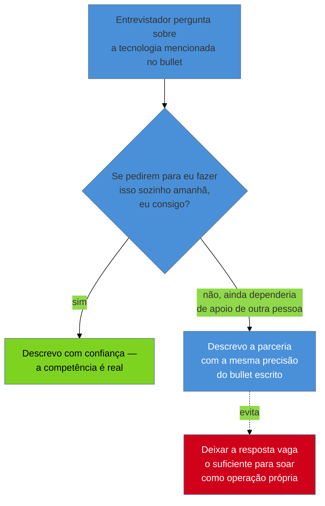
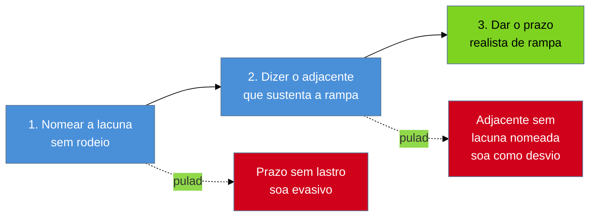

# Declarar lacuna

> [!abstract] TL;DR
> Quase todo defeito de currículo tem teto de dano: custa a entrevista e se esgota ali. Competência inflada não segue essa curva — ela pode passar pela triagem, convencer na leitura humana, sobreviver a uma entrevista inteira, e **cobrar a conta semanas depois da contratação**, na frente de um time que já reorganizou expectativas em cima dela. É o mesmo risco assimétrico que a [[03-Dominios/Carreira/Currículo/15 - Quando não há número|nota 15]] fixou para número inventado. Daí três decisões. **Onde declarar**: quase nunca no documento, quase sempre na conversa — o currículo é caro por linha, a conversa é barata e tem contexto para a nuance. **Como falar**: descrever **parceria** com uma tecnologia não é reivindicar **operação** dela, e o teste que separa as duas é uma pergunta só — *se pedirem para você fazer isso sozinho amanhã, você consegue?* **Como declarar sem se desqualificar**: três movimentos, nesta ordem — **nomear** a lacuna sem rodeio, dizer o **adjacente** que você domina, dar o **prazo** realista de rampa. Inverter a ordem produz defeitos previsíveis: prazo sem lacuna nomeada soa evasivo, adjacente sem lacuna nomeada soa como desvio. E o limite simétrico: nem toda lacuna merece declaração — declarar o que ninguém perguntou planta uma dúvida que não existia.

## Semana três

O momento em que uma competência inflada cobra a conta quase nunca é a entrevista.

É uma terça-feira comum, três semanas depois da contratação. O cluster está com um problema de rede que ninguém do time consegue diagnosticar, e alguém olha para você — porque foi por isso que você foi contratado, ou pelo menos foi o que o currículo e a entrevista deram a entender. Não é uma pergunta hostil. É só o trabalho chegando ao lugar onde ele deveria estar.

E você não sabe fazer aquilo sozinho. Nunca soube.

Compare com o custo de qualquer outro defeito de currículo. Um sumário genérico, um bullet fraco, uma seção de habilidades bagunçada — cada um, na pior hipótese, faz o leitor descartar o documento antes de gerar a conversa que ele existia para gerar. É uma perda real, e é silenciosa: você segue para a próxima candidatura sem carregar dívida nenhuma daquele erro.

Competência inflada não tem esse teto.

Ela pode passar pela triagem sem levantar bandeira. Pode soar convincente na primeira leitura humana. Pode sobreviver a uma entrevista técnica inteira, se a pergunta certa não vier naquele dia — a [[03-Dominios/Carreira/Currículo/09 - Habilidades técnicas|nota 09]] registra que um entrevistador competente costuma pedir uma história concreta antes de aceitar um item da lista, mas "costuma" não é "sempre", e um processo apressado, com entrevistadores diferentes a cada etapa, deixa buracos reais por onde uma competência inflada passa sem ser testada.

O que muda tudo é o **momento** em que a lacuna aparece.

Numa entrevista, ela custa aquela vaga. Dolorido, e contido. Depois da contratação, custa a confiança de pessoas que já dependem de você para algo concreto — um deploy que precisa acontecer, uma decisão de arquitetura que precisa de alguém que já operou aquilo antes, um incidente que ninguém mais sabe resolver porque foi justamente por essa competência que você foi contratado.

A pergunta que a entrevista teria feito em segundos — *"me conta uma vez que você fez isso sozinho"* — o trabalho real faz em semanas, com um custo em produção, tempo alheio e credibilidade que nenhuma entrevista jamais cobraria.

É essa diferença de momento que organiza o resto deste capítulo: **o erro mais caro aqui não é o que faz o telefone não tocar. É o que faz o telefone tocar cedo demais, para a pergunta errada, meses depois de todo mundo já ter combinado que aquela competência estava garantida.**

## Onde declarar: na conversa, não no documento

Estabelecida a gravidade, a pergunta prática vem antes do "como". Não é *devo declarar* — quando a lacuna é relevante, a resposta é quase sempre sim, e a exceção tem seção própria mais adiante. É **onde**.

E a resposta, que organiza tudo o que vem depois, é que o lugar certo quase nunca é o documento. É a conversa que o documento existe para gerar.

O motivo é economia, não pudor. O currículo é, como a [[03-Dominios/Carreira/Currículo/01 - Para que serve um currículo|nota 01]] estabeleceu, um documento com objetivo único e espaço radicalmente limitado — cada linha compete por segundos de um leitor que já decidiu, antes do fim da primeira página, se continua. Uma seção dedicada a listar lacunas consome esse espaço escasso para comunicar algo que a conversa comunica de graça, com muito mais nuance.

A conversa tem contexto. Quem pergunta pode fazer a pergunta de acompanhamento, pode explicar por que aquele requisito importa tanto para aquela vaga, pode ouvir o adjacente que sustenta a rampa antes de decidir o quanto a lacuna pesa. O documento não tem nada disso. Só tem a linha, isolada, para um leitor que talvez nunca converse com quem a escreveu.

> [!example] Caso real
> Numa candidatura específica, o autor deste vault havia incluído no próprio currículo uma seção declarando lacunas de Go, GCP e Terraform — três tecnologias que ele não dominava com profundidade suficiente para reivindicar operação própria. Essa seção foi removida.
>
> O motivo não foi desconforto em admitir a lacuna. Foi que a transparência **já tinha sido feita por outro canal**: um e-mail direto com a recrutadora, comunicando exatamente a mesma coisa, ao qual ela respondeu bem. Repetir aquilo dentro do documento era redundância pura — e essa redundância tinha um custo mensurável: a seção ocupava **uma página inteira** do currículo, espaço que nenhuma outra parte do documento podia mais usar.
>
> O repositório de currículos versionado do autor, onde essa decisão está registrada como qualquer outra mudança de conteúdo, é ferramental privado, sem link público — no mesmo padrão de fonte das notas [[03-Dominios/Carreira/Currículo/05 - Formato e legibilidade de máquina|05]] e [[03-Dominios/Carreira/Currículo/18 - Adaptar por vaga sem reescrever|18]].

O caso mostra o mecanismo melhor que qualquer regra abstrata: a transparência não desapareceu quando a seção saiu. Ela migrou para o canal mais barato de mantê-la.

Um e-mail para uma recrutadora específica, sobre uma vaga específica, custa minutos e chega quando o contexto já existe para recebê-lo — a pessoa já sabe qual vaga está em jogo, já formou uma impressão, e processa "aqui estão três lacunas, e aqui está por que elas não deveriam preocupar vocês" como parte de uma conversa em andamento. Uma seção de lacunas no currículo chega **antes** de qualquer contexto ter sido construído: o leitor ainda está decidindo se vale a pena continuar, e uma lista do que você não sabe compete diretamente contra o resto do documento pelo pouco tempo que ele está disposto a gastar.

Vale marcar o limite antes de seguir, porque "na conversa, não no documento" não significa que o documento nunca sinalize lacuna. A nota 09 já mostrou o mecanismo mais comum: simplesmente **não listar** a tecnologia. A ausência de um termo já é, por si, comunicação honesta — quem lê a seção de habilidades e não encontra "Kubernetes" recebe, implicitamente, a informação de que aquilo não está sendo reivindicado, sem que nenhuma linha extra precise dizê-lo.

## Parceria não é operação

Às vezes a ausência sozinha não basta — e aí entra a distinção mais fina deste capítulo.

A nota 09 fixou, para a seção de habilidades, a regra de lastro: não liste o que não sustenta uma pergunta de entrevista. Dentro dela, isolou o caso: **descrever parceria com uma tecnologia não é reivindicar operação dela**. E ilustrou com um caso real do autor — Kubernetes saiu da seção de habilidades, porque não havia experiência própria de operação (nunca configurou sozinho um cluster, nunca depurou sozinho scheduling ou rede), mas **permaneceu** na seção de experiência, num bullet que descreve, com precisão factual, ter trabalhado ao lado da equipe de DevOps para rodar um cluster Kafka em Kubernetes.

Aqui o mesmo caso é retomado pelo lado oposto. Lá, a pergunta era o que **sai** da lista quando falta lastro. Aqui, é como se **fala** sobre a tecnologia que saiu de um lugar e ficou no outro.

Imagine o entrevistador lendo aquele bullet e perguntando, com curiosidade genuína: *"me conta mais sobre esse trabalho com Kubernetes."* É o tipo de pergunta que qualquer linha de experiência com nome de tecnologia provoca.

A resposta que a distinção autoriza não é fingir que a pergunta não veio, nem inflar o próprio papel. É descrever o que aconteceu:

> *"Eu trabalhei ao lado do time de DevOps, que operava o cluster. Minha parte era garantir que a aplicação que consumia e produzia mensagens no Kafka funcionasse corretamente dentro daquele ambiente — mas quem configurava e mantinha o cluster propriamente dito era outra equipe."*

Isso não é confissão de fraqueza. É a mesma frase que já estava, honestamente, escrita no bullet — só que falada em voz alta, com o detalhe que o espaço do documento não tinha onde caber.

O erro que a distinção previne é o oposto: deixar a resposta vaga o bastante para soar como operação própria. *"Sim, trabalhei bastante com Kubernetes naquele projeto"* — sem mencionar que a operação ficava com outra equipe. É uma mentira pequena, quase de omissão. E é exatamente o tipo que a assimetria da abertura pune com mais força do que qualquer entrevistador percebe na hora: se a resposta convence, e a vaga é conquistada em parte por causa dessa impressão, o dia em que alguém pedir para você configurar um cluster sozinho é a terça-feira da semana três.

O critério que separa as duas respostas é generalizável, e é uma pergunta só:

> **Se pedirem para você fazer isso sozinho, amanhã, você consegue?**

Se a resposta honesta é sim — mesmo que a experiência tenha vindo por observação atenta e participação real ao lado de quem operava —, descrever com mais confiança é legítimo. Se é não — se fazer aquilo sozinho amanhã exigiria aprender de novo, com apoio, o que a outra equipe já sabia —, a fala precisa preservar a distinção com a mesma clareza que o bullet preservava por escrito.

E isso não vale só para infraestrutura. Vale para metodologia (*"participei de um processo de definição de OKRs conduzido por outra pessoa"* não é *"eu conduzo definição de OKRs"*), para uma linguagem usada num projeto onde outra pessoa escrevia a maior parte do código crítico, para um domínio de negócio inteiro onde você apoiou uma decisão sem ser quem a tomou. O mecanismo é sempre o mesmo: **parceria é real, é valiosa, e merece ser contada com todo o detalhe que sustenta.** O erro nunca é falar sobre a parceria — é deixar a fala escorregar, sem perceber, para o vocabulário que só a operação própria autorizaria.

## Três movimentos, nesta ordem

Quando a lacuna é real — não uma parceria mal descrita, mas ausência de fato — como declará-la sem que a declaração, sozinha, tire você da corrida?

Três movimentos. E a ordem não é estética: cada um prepara o terreno do seguinte, e invertê-los produz uma impressão pior do que a lacuna produziria sozinha.

**Primeiro, nomeie sem rodeio.** Não existe formulação que disfarce uma ausência real sem soar evasiva para quem já ouviu centenas de respostas evasivas. *"Eu tenho alguma familiaridade com Go, mas..."* já começa perdendo credibilidade, porque o entrevistador reconhece o padrão de quem amacia um "não" que virá de qualquer jeito. A versão que funciona é direta: *"eu não tenho experiência de produção com Go — minha experiência é toda em [linguagem que você domina]."* Nomear primeiro, sem meios-termos, cumpre uma função que nenhum dos outros dois cumpre: estabelece que você não está escondendo nada, o que dá crédito automático a tudo o que vier depois.

**Segundo, mostre o adjacente.** É o movimento que transforma fraqueza confessada em evidência de capacidade. Uma lacuna nomeada sozinha deixa uma pergunta implícita em aberto: *e então, quanto tempo, e com que base?* O adjacente responde antes de ela ser feita em voz alta. *"Eu não tenho experiência de produção com Go, mas trabalho há cinco anos com sistemas concorrentes em Java, incluindo tuning de garbage collector e depuração de deadlock em produção"* não é desculpa — é evidência de que a lacuna nomeada não é de fundamento, é de sintaxe e ferramental específico, apoiada num conhecimento estrutural que já existe e que Go, especificamente, reaproveita em boa parte. É o adjacente que torna a rampa crível: sem ele, o prazo do terceiro movimento soa chutado.

**Terceiro, dê o prazo.** Depois de nomear e mostrar a ponte, dizer quanto tempo levaria deixa de ser promessa vaga e vira estimativa fundamentada: *"com a base que tenho em concorrência e sistemas distribuídos, eu estimaria de quatro a seis semanas de imersão guiada para chegar a um nível produtivo em Go, e mais alguns meses até me sentir confortável tomando decisões de arquitetura na linguagem sem apoio."* O número não precisa ser exato — ninguém espera exatidão de estimativa de aprendizado —, mas precisa ser específico o bastante para soar pensado, não improvisado para preencher o silêncio.

A ordem importa porque cada inversão tem um defeito próprio.

Quem **começa pelo prazo** — *"eu aprenderia isso em um mês"* — antes de nomear a lacuna ou mostrar a base soa evasivo: o entrevistador percebe que a conversa pulou direto para tranquilizá-lo, sem estabelecer o que exatamente precisa ser tranquilizado, e a pressa em resolver o desconforto antes de nomeá-lo parece tentativa de fechar a pergunta rápido demais.

Quem **começa pelo adjacente**, sem nomear a lacuna — *"eu tenho uma base muito forte em sistemas concorrentes"* — soa como quem desvia, respondendo a uma pergunta mais confortável no lugar da que foi feita. O entrevistador, nesse caso, costuma repetir a pergunta original — e a repetição já comunica que a primeira resposta não convenceu.

A sequência nomear → adjacente → prazo é a única que corresponde à ordem em que o próprio entrevistador processa a informação: primeiro ele precisa saber o que está em jogo; depois, uma razão para acreditar que a lacuna é fechável; só então o prazo faz sentido como conclusão, e não como fuga.

> [!example] Caso fictício
> Rafael Duarte chega a uma etapa técnica de uma vaga que lista, entre os requisitos desejáveis, experiência com um sistema de filas distribuído que ele nunca usou em produção. Anos antes, numa outra entrevista, ele tinha sentido a tentação de inflar uma barra de proficiência que ninguém tinha pedido.
>
> Desta vez, quando a pergunta vem, ele aplica os três movimentos sem hesitar. Nomeia: *"eu nunca operei esse sistema específico em produção."* Mostra o adjacente: *"mas trabalhei bastante com outro sistema de mensageria, e entendo os conceitos de particionamento, consumidor e garantia de entrega que a maioria dessas ferramentas compartilha."* Dá o prazo: *"eu diria duas ou três semanas para me sentir produtivo na API específica, considerando que os conceitos de fundo já são familiares."*
>
> A resposta não elimina a lacuna. Mas também não deixa o entrevistador com a sensação de que Rafael tentava escondê-la ou inflá-la — as duas armadilhas que ele já tinha aprendido a evitar na seção de habilidades do próprio currículo.

## Quando não declarar

Lido depressa, tudo até aqui soa como convite a declarar toda lacuna existente. Se declarar bem é seguro, por que não declarar tudo por precaução?

Porque o excesso tem custo próprio, simétrico ao de inflar.

Uma lacuna que não é requisito da vaga não precisa de menção nenhuma. Declarar, sem que ninguém tenha perguntado, que você não domina uma tecnologia periférica ao cargo consome tempo de conversa que reforçaria o que de fato importa — e, pior que o desperdício, **planta na cabeça de quem ouve uma dúvida que não existia antes**. Um candidato que se voluntaria a dizer *"não tenho experiência com GraphQL"* numa entrevista cuja stack inteira é REST está introduzindo incerteza sobre a própria adequação que o entrevistador nem tinha cogitado avaliar.

A régua não é "existe alguma lacuna aqui" — quase sempre existe, em qualquer carreira. É se **esta lacuna importa para esta vaga**.

Duas condições, e basta uma para a declaração valer o custo.

**A lacuna é requisito explícito** — apareceu na descrição, foi mencionada por um recrutador, ou é claramente central ao cargo. Se a vaga pede Go e você não tem experiência de produção nele, aquilo vai ser sondado em algum momento, e chegar primeiro é sempre melhor do que ser pego no meio de uma pergunta técnica sem resposta.

**Ou a lacuna seria descoberta cedo de qualquer forma**, e a surpresa custaria mais que a antecipação. Esta exige mais julgamento: existem lacunas que não aparecem na descrição, mas que qualquer pessoa razoável esperaria dado o contexto. Alguém entrando como líder técnico de um time que já usa um processo específico de revisão vai encontrar aquilo na primeira semana — e chegar antes, com uma frase curta reconhecendo a lacuna e mostrando disposição para se adaptar, custa muito menos do que deixar a descoberta acontecer sem aviso, já dentro do trabalho.

> [!example] Caso fictício
> Bianca Torres se prepara para uma entrevista cuja descrição não menciona nenhuma ferramenta de observabilidade específica — fala genericamente em "boas práticas de monitoramento". Revisando a própria trajetória, ela nota que nunca usou a ferramenta de tracing distribuído mais popular do mercado, só uma alternativa menos conhecida do time anterior.
>
> Por um instante considera mencionar isso espontaneamente, seguindo o instinto de "quanto mais transparência, melhor". E se contém — a vaga não pediu ferramenta nenhuma por nome, e a alternativa que ela usou cumpre a mesma função conceitual. Bianca não declara nada, e guarda a explicação para o caso de a pergunta aparecer. Não apareceu.
>
> A decisão de não antecipar uma lacuna que ninguém perguntou poupou tempo de conversa para os pontos em que a experiência dela tinha mais peso — sem criar uma dúvida que a vaga nunca exigiu resolver.

E fica a distinção que fecha a seção: este critério decide se você deve **antecipar** a declaração antes de qualquer pergunta. Não decide se deve responder com honestidade quando a pergunta chega. São decisões independentes — uma gerencia o tempo escasso da conversa; a outra é nunca mentir quando confrontado diretamente, e vale em qualquer circunstância.

## O que muda por nível

A distância entre o que a vaga pede e o que você sustenta muda de peso ao longo da escada da [[03-Dominios/Carreira/Currículo/03 - Os seis níveis e o que muda entre eles|nota 03]].

No **início** — estagiário, trainee, júnior — lacunas são esperadas por definição do nível. O leitor está avaliando **fundamento**, não domínio consolidado de uma stack inteira, e não espera que alguém ali já tenha atravessado todas as tecnologias citadas. Declarar proativamente o que qualquer pessoa razoável já esperaria é redundante com o que o próprio nível comunica. A exceção é a primeira condição: se a vaga nomeia explicitamente um requisito como essencial mesmo para júnior, a lacuna deixou de ser genérica e passa a valer declaração.

No **meio** — pleno, sênior — o eixo muda. Aqui o leitor procura autonomia dentro de um escopo já definido pelo cargo, e é o escopo que decide o peso. Lacuna **fora** do escopo esperado importa pouco; lacuna **dentro** do núcleo que a vaga define importa muito, porque é justamente ali que se espera autonomia sem rampa. É nesses dois níveis que os três movimentos carregam mais peso prático — e onde a diferença entre lacuna periférica e lacuna de núcleo é mais fácil de confundir sob pressão.

No **topo** — staff — a relação se inverte de um jeito que contraria a intuição das faixas anteriores. Um staff é contratado por influência organizacional e decisão de arquitetura, não por dominar uma lista de tecnologias — e, mais que isso, costuma ser contratado justamente **para o que ainda não existe**: uma prática que a organização não tem, uma decisão que ninguém internamente sabe tomar sozinho, um padrão que precisa ser criado porque a empresa cresceu além do que a arquitetura atual sustenta. Nesse contexto, não ter usado uma ferramenta específica pesa muito menos, porque o que está sendo avaliado é a capacidade demonstrada de criar e liderar algo que ainda não existia. Os três movimentos continuam valendo — só que a lacuna que precisa de declaração num currículo de staff raramente é uma tecnologia, e quase sempre é um tipo de decisão ou um domínio de negócio inteiro que a pessoa ainda não liderou.

## Armadilhas comuns

> [!warning] Confessar a lacuna e parar por aí
> **O que acontece:** o candidato nomeia com honestidade — *"eu não tenho experiência com Go"* — e encerra ali, deixando o silêncio do entrevistador preencher o resto.
> **Por quê:** parece que a honestidade sozinha já cumpriu o dever de não mentir, e completar com adjacente e prazo soa, para quem está nervoso, como justificar-se demais.
> **Como evitar:** trate os três movimentos como pacote único, não como três respostas opcionais. Nomear sem completar deixa o entrevistador com a mesma pergunta implícita que abriu esta seção: e então, quanto tempo, com que base?

> [!warning] Transformar a rampa numa promessa vaga
> **O que acontece:** o terceiro movimento vira *"eu aprendo rápido"* ou *"me adapto bem a tecnologias novas"*, sem número nem contexto.
> **Por quê:** dar um número específico parece compromisso arriscado — se disser "quatro semanas" e levar seis, teme parecer promessa quebrada, então fica no vago.
> **Como evitar:** o prazo não é garantia contratual — é estimativa fundamentada no adjacente que o movimento anterior já mostrou. Uma estimativa específica, mesmo aproximada, comunica mais preparo que qualquer superlativo genérico, no mesmo sentido em que a nota 15 mostra que um superlativo vago é pior que nada.

> [!warning] Declarar lacuna que ninguém perguntou, achando que é sinal de maturidade
> **O que acontece:** tentando parecer excepcionalmente transparente, o candidato lista lacunas sem relação com o que a vaga pede.
> **Por quê:** este capítulo defendeu tanto a honestidade que é fácil concluir, por generalização apressada, que mais declaração é sempre mais bem recebida.
> **Como evitar:** as duas condições, antes de qualquer declaração espontânea. É requisito explícito? Seria descoberta cedo com custo de surpresa maior que o de antecipar? Se nenhuma for verdadeira, o silêncio é a resposta certa — e não uma omissão.

## Como soa em inglês

> *"If there's a real gap between what a role asks for and what I actually have, I'd rather name it directly than let an interviewer stumble onto it — but I do it in conversation, not by listing every gap on the résumé itself; the résumé is expensive per line, and the conversation has room for context a document never will. When I name a gap, I follow it with the adjacent thing I do know, because that's what makes the ramp-up believable, and only then do I put a realistic timeline on it — starting with the timeline sounds evasive, and starting with the adjacent skill without naming the gap first sounds like I'm dodging the question. And I don't volunteer gaps nobody asked about — if it's not something the role actually requires, bringing it up just plants doubt that wasn't there before."*

| PT | EN |
| --- | --- |
| declarar lacuna | disclose a gap |
| na conversa, não no documento | in conversation, not on paper |
| parceria vs. operação | partnered with vs. operated |
| nomear, adjacente, prazo | name it, show the adjacent skill, give a timeline |
| prazo realista de rampa | realistic ramp-up timeline |
| requisito explícito | explicit requirement |
| descoberta cedo | discovered early |
| custa a vaga depois de conquistada | costs the job after it's already won |

## O que vem a seguir

A terça-feira da semana três não chega para quem declarou a lacuna na conversa certa. Chega para quem deixou o documento e a entrevista, juntos, darem a entender algo que a competência não sustentava.

Fechado o bloco Adepto, o galho segue para onde o currículo deixa de ser tratado como documento isolado e passa a ser a saída de um sistema:

- [[03-Dominios/Carreira/Currículo/20 - A âncora|20 - A âncora]] — o drill-down de quatro camadas por trás de qualquer variante, incluindo a que declara lacuna com precisão porque a base foi construída com cuidado.
- [[03-Dominios/Carreira/Currículo/22 - O currículo como pipeline|22 - O currículo como pipeline]] — o mesmo repositório versionado do caso real deste capítulo, tratado em profundidade como sistema com guarda automatizada.

## Veja também

- [[03-Dominios/Carreira/Currículo/index|Currículo]] — o índice do galho.
- [[03-Dominios/Carreira/Currículo/09 - Habilidades técnicas|09 - Habilidades técnicas]] — a regra de lastro e o caso do Kubernetes, retomados aqui pelo lado da fala em vez do lado da lista.
- [[03-Dominios/Carreira/Currículo/15 - Quando não há número|15 - Quando não há número]] — a assimetria de risco entre custar a entrevista e custar o emprego, aplicada ali a número e aqui a competência.
- [[03-Dominios/Carreira/Currículo/16a - Lacuna longa e reentrada|16a - Lacuna longa e reentrada]] *(broto)* — a lacuna **de tempo**, que é outro objeto: aqui falta competência, lá faltou período trabalhado.
- [[03-Dominios/Carreira/Currículo/18 - Adaptar por vaga sem reescrever|18 - Adaptar por vaga sem reescrever]] — a nota que remete a esta sobre onde declarar o que a base do currículo não cobre.
- [[03-Dominios/Carreira/Currículo/03 - Os seis níveis e o que muda entre eles|03 - Os seis níveis e o que muda entre eles]] — o vocabulário de nível usado aqui.
- [[03-Dominios/Carreira/Entrevistas/index|Entrevistas]] — o galho parceiro: é na entrevista que a lacuna declarada aqui é, de fato, testada.

## Fontes

- Esta nota não introduz dado quantitativo novo — converte em prática a assimetria de risco já verificada pela [[03-Dominios/Carreira/Currículo/15 - Quando não há número|nota 15]] e a regra de lastro já verificada pela [[03-Dominios/Carreira/Currículo/09 - Habilidades técnicas|nota 09]], cujas fontes primárias sustentam as afirmações reusadas.
- **Josenaldo Matos** — o caso da seção de lacunas de Go, GCP e Terraform, removida do currículo depois de a transparência já ter sido feita por e-mail com a recrutadora, é relato de primeira mão sobre o próprio repositório de currículos versionado — ferramental privado, sem link público, no mesmo padrão de fonte das notas [[03-Dominios/Carreira/Currículo/05 - Formato e legibilidade de máquina|05]] e [[03-Dominios/Carreira/Currículo/18 - Adaptar por vaga sem reescrever|18]]. O caso do Kubernetes é o mesmo já citado e verificado pela nota 09, com fonte em [josenaldo.com.br/experiences](https://josenaldo.com.br/experiences).
- **Rafael Duarte** e **Bianca Torres** são personas fictícias já estabelecidas neste galho — ambos desenvolvedores de nível pleno.
