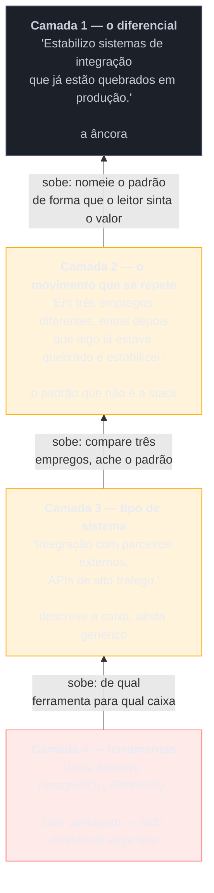

# A âncora

> [!abstract] TL;DR
> O currículo, o pitch falado de abertura de entrevista, a resposta a uma pergunta comportamental e a negociação salarial são **quatro saídas diferentes da mesma âncora** — não quatro documentos independentes que cada um precisa reinventar do zero sob pressão de prazo. A âncora é a posição da qual as quatro derivam: uma frase curta que nomeia o tipo de problema que você resolve de um jeito que o leitor entende o valor sem precisar do currículo inteiro para chegar lá. Ela não se descobre por introspecção nem se inventa por aspiração — se acha subindo um **drill-down de quatro camadas**, de baixo para cima: ferramentas (o que você usa, zero vantagem competitiva), tipo de sistema (a caixa em que você trabalha, ainda genérico), o movimento que se repete nos seus últimos trabalhos (o padrão que não é a stack) e, no topo, o diferencial nomeado — a âncora em si. Sem ela, cada saída improvisa uma versão diferente de quem você é, e quem lê o currículo, ouve o pitch e testemunha a negociação sente a inconsistência entre as três versões, mesmo sem conseguir nomear exatamente o que estranhou. A âncora não é slogan, não é adjetivo, não é aspiração — é o resumo de um padrão que já aconteceu, repetidamente, e que só existe depois de ter acontecido pelo menos três vezes.

## Quatro saídas, uma origem

Até esta nota, o galho tratou o currículo como se ele fosse a única peça em jogo — a [[03-Dominios/Carreira/Currículo/07 - O sumário profissional|nota 07]] ensinou a escrever cinco linhas de sumário em BLUF, a [[03-Dominios/Carreira/Currículo/11 - A linha de bullet|nota 11]] ensinou a testar uma linha de experiência, a [[03-Dominios/Carreira/Currículo/13 - Responsabilidade, realização e alavancagem|nota 13]] ensinou a distinguir atribuição de realização de alavancagem. Cada uma dessas notas resolveu um problema real, dentro do perímetro de um documento só. Mas quem passa por um processo seletivo não produz um documento — produz quatro peças diferentes, em momentos diferentes, para leitores em contextos diferentes: o currículo, lido em segundos por alguém que nunca vai conhecer o candidato pessoalmente antes de decidir se vale ligar; o pitch falado, os primeiros noventa segundos de resposta à pergunta "fale sobre você"; a resposta comportamental, contada em detalhe, a uma pergunta do tipo "me conta sobre uma vez que você teve que tomar uma decisão difícil sob pressão"; e a negociação salarial, em que a mesma pessoa precisa argumentar por que o próprio trabalho vale o número que está pedindo.

A tentação natural, diante de quatro peças distintas, é tratá-las como quatro problemas de escrita separados — um problema de currículo, um problema de fala, um problema de storytelling, um problema de negociação — e resolver cada um isoladamente, com a técnica certa para cada formato. Cada peça, isoladamente, costuma estar tecnicamente correta. E, ainda assim, o candidato que segue quatro guias diferentes, um de cada vez, sem nenhum fio que amarre os quatro, produz algo que soa **quase certo, mas não convence** — porque o currículo descreve uma pessoa cuidadosa e metódica, o pitch soa como alguém movido a desafio e velocidade, a resposta comportamental enfatiza trabalho em equipe acima de tudo, e a negociação argumenta por tempo de casa em vez de por resultado. Nenhuma das quatro peças, isoladamente, tem um erro apontável. O problema está no espaço entre elas: quatro versões plausíveis e levemente diferentes da mesma pessoa, sem nenhuma decisão central sobre qual delas é a verdadeira.

É esse o fenômeno que esta nota nomeia com precisão: **a inconsistência entre as quatro saídas é sentida antes de ser nomeada.** Um recrutador que lê o currículo de manhã e conduz a entrevista à tarde raramente consegue apontar, com uma frase exata, o que soou estranho — mas sai da sala com uma sensação vaga de que o currículo prometia uma coisa e a pessoa entregou outra, mesmo que as duas versões, lidas separadamente, parecessem perfeitamente razoáveis. Um leitor que compara duas fontes de informação sobre a mesma pessoa e encontra uma leve divergência de ênfase não processa isso como "duas versões legítimas de uma pessoa complexa"; processa como um pequeno sinal de alarme. O candidato raramente é reprovado por essa divergência sozinha — mas ela soma, silenciosamente, contra uma decisão que já é apertada o bastante sem esse peso extra.

A saída para esse problema não é escrever as quatro peças com mais cuidado, cada uma isoladamente — é parar de tratá-las como quatro problemas e reconhecer que são **quatro saídas de um sistema único**, cuja entrada é uma coisa só: a âncora. A âncora é a posição da qual as quatro peças derivam, cada uma adaptada ao formato e ao tempo que tem disponível, mas todas apontando, sem contradição, para a mesma resposta à mesma pergunta implícita que todo processo seletivo faz, de formas diferentes, o tempo inteiro: **que tipo de problema essa pessoa resolve, de um jeito que ninguém mais no mesmo cargo resolveria exatamente igual?** O currículo responde essa pergunta em cinco linhas de sumário e numa dúzia de bullets. O pitch responde em noventa segundos falados. A resposta comportamental responde através de um evento específico, contado com detalhe. A negociação responde através do argumento de por que aquele valor é justo. Quatro respostas de comprimento e formato diferentes — para a mesma pergunta.

Vale marcar, antes de seguir, uma fronteira que precisa ficar limpa: a [[03-Dominios/Carreira/Currículo/07 - O sumário profissional|nota 07]] descreveu o sumário profissional como o trailer do documento, a peça que decide se o resto vai ser lido, e citou, no próprio caso real daquela nota, a frase-âncora do site pessoal do autor deste vault como exemplo de BLUF aplicado fora do currículo. A âncora **não é** o sumário — ela é o que o **governa**. O sumário é uma das quatro saídas, escrita para o formato específico do currículo, com as restrições de três a cinco linhas que a nota 07 já detalhou; a âncora é anterior a essa escolha de formato, e continua a mesma independentemente de qual das quatro peças está sendo escrita naquele momento. Confundir as duas leva a um erro comum: tratar a âncora como "a frase que abre o currículo" e, ao mudar de vaga, reescrever a âncora inteira junto com o sumário — quando só o sumário deveria mudar, adaptado à vaga como a [[03-Dominios/Carreira/Currículo/18 - Adaptar por vaga sem reescrever|nota 18]] já ensinou, enquanto a âncora, por baixo dele, permanece estável.

## O drill-down de quatro camadas

Se a âncora não é o sumário, nem o pitch, nem nenhuma das quatro peças que ela alimenta, a pergunta prática que sobra é: de onde ela vem? A resposta desta nota é um método de quatro camadas, organizado de baixo para cima — da coisa mais fácil de nomear e menos valiosa para diferenciar um candidato, até a coisa mais difícil de nomear e mais valiosa quando encontrada. O método funciona como um funil de abstração: cada camada descreve o mesmo trabalho, a mesma carreira, num nível diferente de generalidade, e a âncora só aparece quando o funil chega ao topo.

### Camada 4 — ferramentas

A camada mais baixa do drill-down é a mais fácil de escrever e a que a maioria dos currículos nunca sai dela: **as ferramentas**. "Java, React, Postgres." "Python, Django, AWS." "Node.js, RabbitMQ, Docker." É a linguagem, o framework, o banco de dados, a nuvem — o vocabulário que preenche a seção de habilidades técnicas que a [[03-Dominios/Carreira/Currículo/09 - Habilidades técnicas|nota 09]] já tratou em detalhe, incluindo os dois anti-padrões, a lista de ingredientes e a sopa de letrinhas, que nascem de tentar comunicar identidade profissional através dessa camada e só dessa camada. Ela é indispensável — sem ela, o candidato nem sequer passa pela busca por termo que a nota 04 descreveu. Mas carrega **zero vantagem competitiva** sobre qualquer outro candidato da mesma vaga: se a vaga pede React, todo candidato que chegou à entrevista sabe React — é requisito de entrada, não diferencial. Dizer "eu sei React" para uma vaga de React equivale a um cirurgião dizer "eu sei usar bisturi" — verdadeiro, necessário, e incapaz de explicar por que contratar esse cirurgião em vez de qualquer outro que também sabe usar o mesmo instrumento.

### Camada 3 — tipo de sistema

Subindo um degrau, a camada seguinte descreve não a ferramenta, mas **o tipo de sistema** em que o trabalho acontece: "APIs de alto tráfego", "plataformas de e-commerce", "sistemas de pagamento", "pipelines de dados em escala". É progresso real em relação à camada de ferramentas, porque já nomeia um contexto, não só um instrumento. Ainda assim, essa camada continua genérica o bastante para não diferenciar ninguém dentro do próprio nicho: há milhares de desenvolvedores que também trabalharam com sistemas de pagamento de alto volume, cada um fazendo um tipo de trabalho radicalmente diferente dentro dele — um construiu o sistema do zero, outro manteve um sistema legado em produção, um terceiro só integrou um novo provedor a um sistema que já funcionava havia anos. Mas ela ainda não distingue, sozinha, o que o candidato de fato fez dentro desse terreno: dizer "trabalho com sistemas de pagamento de alto volume" cabe tanto em quem só executou uma tarefa fatiada por outra pessoa quanto em quem decidiu sozinho o caminho técnico, quanto em quem mudou o que outras pessoas passaram a conseguir fazer. A camada 3 nomeia o terreno; ela ainda não diz o que você fez dentro dele.

### Camada 2 — o movimento que se repete

A terceira camada, e a que separa quem já achou a própria âncora de quem ainda não achou, exige olhar para trás em vez de olhar para dentro de um único trabalho: **o movimento que se repete** ao longo de mais de um emprego, e que não é a tecnologia usada em nenhum deles. É a pergunta que a camada de ferramentas e a camada de tipo de sistema, sozinhas, nunca respondem, porque as duas descrevem um único contexto de cada vez — a camada 2 exige comparar contextos diferentes entre si e achar o que sobrevive à troca de empresa, de stack, de time. Alguém que, no primeiro emprego, foi chamado para destravar um sistema de busca que devolvia resultados errados havia meses, que no segundo emprego foi realocado, sem pedir, para resolver uma fila de processamento que travava toda sexta-feira à noite, e que no terceiro emprego assumiu, sem cargo formal para isso, a responsabilidade por uma integração que caía toda vez que o volume de pedidos subia — essa pessoa não tem três histórias desconexas sobre três tecnologias diferentes. Tem uma história só, contada três vezes: **é a pessoa que entra quando o sistema já está quebrado e o estabiliza**, independentemente de qual sistema específico, em qual stack específica, era a vez daquela empresa. É esse padrão — não a stack, não o tipo de sistema isoladamente, mas o comportamento que se repete atravessando os dois — que a camada 2 pede ao leitor que ache.

Vale nomear alguns exemplos do tipo de movimento que costuma aparecer nessa camada, sem pretender que a lista seja exaustiva: há quem sempre acabe sendo a pessoa que transforma um processo manual e propenso a erro em algo automático, em domínios completamente diferentes entre si; há quem sempre acabe sendo a pessoa que entra num time desmotivado, com entregas atrasadas havia meses, e sai dele entregando de novo, sem cargo formal de liderança; há quem sempre acabe sendo a pessoa que outros times procuram antes de uma decisão de arquitetura que envolve dado, mesmo sem título de arquiteto. O nome exato do movimento importa menos do que o fato de ele se repetir — três vezes, em contextos sem motivo estrutural para produzir o mesmo padrão, a não ser o fato de que a mesma pessoa estava lá as três vezes, fazendo de novo a mesma coisa.

### Camada 1 — o diferencial

No topo do drill-down está a **âncora** propriamente dita: o movimento da camada 2, nomeado de um jeito que o leitor entende o valor sem precisar do currículo inteiro, do histórico de empregos ou de uma conversa de trinta minutos para chegar lá. É a tradução do padrão comportamental repetido numa frase curta, memorável, que funciona como resumo executivo de uma carreira inteira — não porque simplifica a carreira a ponto de mentir sobre ela, mas porque escolhe, deliberadamente, a única coisa que precisa aparecer primeiro para o leitor entender, em segundos, que tipo de problema aquela pessoa resolve. "Estabilizo sistemas de integração que já estão quebrados em produção" é uma âncora possível para o exemplo da camada anterior — não é a única frase correta para descrever aquele padrão, mas é o tipo de frase que a camada 1 pede: curta, específica o suficiente para não servir a qualquer candidato do mercado, e ligada a um valor que o leitor reconhece sem esforço, porque todo negócio que roda em produção teme, com razão concreta, o sistema que quebra sem aviso.

O diagrama mostra o mesmo exemplo subindo as quatro camadas, e a direção das setas é o ponto central desta nota: o drill-down não desce de um conceito abstrato para um exemplo concreto, como boa parte do conteúdo de posicionamento profissional sugere — ele **sobe**, de fatos concretos e verificáveis (as ferramentas usadas, o tipo de sistema) para uma generalização que só é honesta se os fatos concretos, comparados entre si, de fato sustentam o padrão nomeado no topo. É essa direção — de baixo para cima, de evidência para síntese — que separa uma âncora genuína de um slogan inventado, tema que a seção mais adiante desta nota trata com mais detalhe.

## Subindo as camadas: o exercício

A teoria das quatro camadas só vira ferramenta útil quando alguém a aplica à própria carreira, e o exercício que faz isso é mais simples de enunciar do que de executar com honestidade: **pegue os três últimos trabalhos — empregos, projetos de peso, freelances longos, o que a carreira de fato tiver — e ache o que se repete entre eles que não seja a tecnologia.** Não é um exercício de brainstorming livre; é um exercício de comparação estruturada, camada por camada, e vale ver como ele funciona através de um caso trabalhado.

> [!example] Caso fictício
> Bianca Torres, desenvolvedora backend pleno já apresentada em notas anteriores deste galho, senta para revisar a própria trajetória depois de perceber, ao reler três currículos que já enviou para vagas diferentes, que cada um deles abria com uma frase de sumário genuinamente diferente das outras duas — numa, "desenvolvedora backend com experiência em integrações"; noutra, "desenvolvedora backend orientada a resultado, com foco em qualidade de código"; na terceira, "desenvolvedora backend versátil, capaz de atuar em diferentes contextos". As três frases são verdadeiras. Nenhuma delas é a mesma pessoa contada duas vezes — cada uma parece ter sido escrita, sob pressão de prazo, tentando adivinhar o que aquela vaga específica queria ouvir. Bianca decide aplicar o exercício desta nota antes de escrever a quarta variante.

> Na camada 4, ela lista as ferramentas dos três últimos empregos: no primeiro, Java e uma fila de mensageria proprietária; no segundo, Node.js e RabbitMQ; no terceiro, atual, Python e Kafka. Três stacks diferentes — nenhuma repetição óbvia ali, e é exatamente por isso que parar nessa camada, como boa parte dos currículos faz, não produz nenhuma âncora: a stack muda a cada emprego, e uma âncora amarrada a uma tecnologia específica vira obsoleta na próxima migração.

> Na camada 3, ela nomeia o tipo de sistema de cada emprego: no primeiro, integração com parceiros externos de uma fintech, incluindo o incidente dos webhooks que a [[03-Dominios/Carreira/Currículo/11 - A linha de bullet|nota 11]] já registrou sobre ela; no segundo, o motor de processamento de pedidos de um e-commerce de porte médio; no terceiro, a camada de mensageria entre serviços de uma plataforma de logística. Três tipos de sistema diferentes, também — mas já com uma pista visível, se ela souber olhar: os três são sistemas de **comunicação entre partes que não confiam totalmente umas nas outras** — um serviço externo que pode falhar, um pedido que pode chegar fora de ordem, uma mensagem que pode se perder entre dois serviços internos.

> Na camada 2, ela para de olhar para as ferramentas e para os sistemas isoladamente, e olha para o **que aconteceu** nos três, na ordem em que aconteceu. No primeiro emprego, só assumiu o conserto dos webhooks depois de um incidente em que um parceiro perdeu notificações por seis horas, sem que ninguém mais no time tivesse resolvido o problema apesar de ele já existir havia meses. No segundo, foi movida, sem pedir, para o time de processamento de pedidos, porque a fila que travava toda sexta-feira causava atraso de entrega e ninguém achava a causa raiz. No terceiro, atual, insistiu, numa retrospectiva, em investigar por que mensagens se perdiam silenciosamente entre dois serviços — um problema que ninguém tinha formalmente atribuído a ela. O padrão aparece sem esforço: **em nenhum dos três empregos ela foi contratada, originalmente, para resolver o problema que acabou resolvendo — nos três, entrou depois que algo já estava quebrado e foi quem o destravou, sem que isso estivesse no escopo formal do cargo no dia em que começou.**

> Na camada 1, Bianca traduz esse padrão numa frase, revisada até ficar curta: "Estabilizo integrações quebradas em produção, antes que alguém precise me pedir." É essa frase — não uma das três variantes de sumário que tinha escrito antes do exercício — que passa a governar as quatro saídas: o sumário do currículo, adaptado por vaga como a nota 18 já ensinou; o pitch falado, que abre citando o incidente dos webhooks como prova; a resposta comportamental, que usa a mesma história com mais detalhe; e o argumento de negociação, que deixa de soar como "eu mereço mais porque trabalho muito" e passa a soar como "o tipo de problema que eu resolvo é caro quando ninguém o resolve, e eu tenho três exemplos concretos disso".

O exercício de Bianca revela algo importante sobre o próprio método: **a âncora não aparece pedindo para a pessoa se descrever — aparece pedindo para a pessoa comparar fatos.** Ninguém encontra a própria âncora sentado, olhando para o teto, tentando decidir "qual é o meu diferencial" em abstrato — essa pergunta, feita direto, tende a produzir exatamente os adjetivos vazios que a seção mais adiante desta nota vai descartar. A âncora aparece quando alguém junta três eventos concretos, de três contextos diferentes, e nota, olhando os três lado a lado, que o mesmo tipo de coisa aconteceu nas três vezes — não porque a pessoa planejou que acontecesse, mas porque é o tipo de trabalho que ela naturalmente atrai, ou o tipo de decisão que ela naturalmente toma, quando colocada diante de um problema sem instrução explícita de como resolvê-lo.

## Caso real — a mesma âncora, duas renderizações

> [!example] Caso real
> O autor deste vault mantém a mesma âncora publicada em dois lugares diferentes, escrita de dois jeitos diferentes, e o contraste entre as duas versões é o exemplo mais direto disponível do que esta nota descreve. No currículo-base do autor — o documento privado, versionado, já citado sem link pela [[03-Dominios/Carreira/Currículo/18 - Adaptar por vaga sem reescrever|nota 18]], sem repositório público disponível para linkar aqui — a âncora aparece como uma **declaração sobre si**: *"I build delivery machines."* No site pessoal do autor, [josenaldo.com.br](https://josenaldo.com.br), verificado ao vivo em 2026-08-20, a mesma ideia aparece sob o cargo "Fractional Software Engineer & Architect. 20+ years.", reescrita como uma **promessa ao leitor, em segunda pessoa**: *"I build the machine that ships your software."*

O que vale examinar nesse par de frases não é qual das duas é "melhor escrita" — as duas funcionam, em contextos diferentes. O que vale examinar é o que muda e o que **não** muda entre as duas. O que muda é a pessoa gramatical e o alvo da frase: a versão do currículo fala sobre o autor, na primeira pessoa, para um leitor que está avaliando um candidato entre vários — um recrutador, um gestor de contratação, alguém comparando currículos numa fila. A versão do site fala para quem está lendo, na segunda pessoa implícita ("the machine that ships **your** software"), porque o leitor de um site pessoal de um profissional que vende serviço fracionado, como o próprio cargo "Fractional Software Engineer & Architect" já sinaliza, não está comparando candidatos numa fila de recrutamento — está avaliando se contrata aquela pessoa especificamente, e o que importa para esse leitor é o que aquele trabalho faz **por ele**, não uma descrição neutra do que o autor faz em geral.

O que **não** muda entre as duas frases é a substância: "delivery machines" e "the machine that ships your software" descrevem o mesmo tipo de trabalho — construir o sistema, o processo, a engrenagem que faz software sair de código para produção de forma confiável e repetível, não uma entrega pontual e sim uma máquina que continua entregando. É o mesmo diferencial da camada 1 do drill-down, só reescrito duas vezes para dois públicos diferentes. Nenhuma das duas versões inventa uma pessoa diferente da outra — a segunda não promete algo que a primeira não sustenta, nem vice-versa. É a **mesma posição**, vista de dois ângulos, e é exatamente essa consistência sob reformulação — não a repetição literal da mesma frase em todo lugar — que esta nota chama de âncora funcionando como deveria.

A lição que esse par de frases deixa é precisa: **a âncora não é slogan a repetir literalmente em toda saída.** Repetir "I build delivery machines" palavra por palavra no pitch falado, na resposta comportamental e na negociação salarial produziria o efeito oposto ao pretendido — soaria decorado, ensaiado, exatamente o tipo de artificialidade que um entrevistador experiente reconhece na hora. A âncora é uma **posição que se reescreve** conforme o público e o formato — primeira pessoa ou segunda, curta ou expandida com um exemplo atrás — sem nunca virar outra posição. O currículo fala **de** você, para um leitor decidindo entre candidatos; o site fala **com** o cliente, para um leitor decidindo se contrata. A posição, por baixo das quatro formas, é a mesma. É essa estabilidade sob reformulação — não a repetição de uma frase fixa — que faz o leitor sentir consistência entre as quatro saídas.

## A âncora também existe no início da carreira

Um mal-entendido comum, ao ler pela primeira vez sobre drill-down de quatro camadas e frase-âncora de posicionamento, é concluir que o conceito inteiro é reservado a quem já tem uma carreira longa o bastante para ter acumulado um padrão visível — que a âncora é ferramenta de sênior e de staff, e que quem está começando simplesmente não tem, ainda, matéria-prima para o exercício. Essa leitura está errada, e vale corrigi-la com o mesmo cuidado que a [[03-Dominios/Carreira/Currículo/03 - Os seis níveis e o que muda entre eles|nota 03]] já dedicou a mostrar que o vocabulário de nível não é uma régua de "quem tem mais" versus "quem tem menos", e sim uma descrição do que **cada** nível precisa provar, com prova genuína disponível em cada degrau da escada.

> [!example] Caso fictício
> Camila Nogueira, já apresentada nas notas 03 e 07 deste galho na trajetória fictícia de uma engenheira de sistemas de busca e catálogo no setor de e-commerce, tem uma âncora em cada extremo da própria carreira — e as duas são genuinamente diferentes, não a mesma frase com o vocabulário trocado. Como estagiária, o histórico dela é curto: um módulo de busca textual simples entregue num projeto de extensão universitária, e um repositório pessoal de exercícios mantido por oito meses seguidos, como a nota 07 já registrou sobre o sumário dela naquele nível. Não há três empregos para comparar — há dois pontos de evidência, no máximo, e o padrão que se repete entre eles, olhado com honestidade, é estreito: nas duas vezes em que enfrentou um problema de busca que parecia grande demais para o próprio conhecimento, ela o quebrou em pedaços pequenos o suficiente para testar um de cada vez, em vez de travar diante do problema inteiro de uma só vez. A âncora dela nesse momento, se ela a nomeasse, seria algo como "decomponho um problema de busca que parece impossível em passos que consigo testar um a um" — uma frase apoiada em pouca evidência, aplicável a um escopo pequeno, mas genuína, porque de fato descreve algo que já aconteceu duas vezes, não uma aspiração sobre o que ela gostaria de um dia ser capaz de fazer.

> No outro extremo da mesma trajetória fictícia, quando Camila chega a staff engineer, a nota 03 já registrou o sumário que descreve o padrão dela naquele momento: ela estabeleceu o padrão de indexação e busca hoje adotado por toda a plataforma de e-commerce, evitando que cada novo time de domínio reabra a mesma decisão de arquitetura isoladamente — um padrão em vigor há três anos sem revisão estrutural necessária. A âncora dela nesse ponto da carreira já não é sobre decompor um problema pessoal — é sobre eliminar a necessidade de outras pessoas, que ela nunca chegou a conhecer diretamente, tomarem de novo uma decisão que ela já resolveu uma vez, bem, para a organização inteira. "Elimino a necessidade de cada novo time reabrir a mesma decisão de busca e indexação" é uma âncora apoiada em anos de evidência, aplicável a uma organização inteira, e tão genuína quanto a da estagiária — só que construída sobre uma base de fatos muito maior.

O que o par de âncoras de Camila deixa visível é o eixo que esta seção precisa marcar com todas as letras: a âncora do estagiário não é uma versão fraca ou incompleta da âncora do staff — é uma âncora **diferente**, mais estreita, apoiada em menos evidência, sobre um escopo menor de efeito, mas tão real quanto a do topo da escada, desde que também descreva algo que de fato já aconteceu mais de uma vez. Assim como o que o currículo precisa **provar** muda de degrau para degrau, segundo a nota 03 — potencial e disciplina no início, decisão de arquitetura e mentoria no topo —, o que a âncora **descreve** também muda de escopo, sem deixar de existir em nenhum ponto da escada. E há um argumento prático para insistir nisso: **quem descobre a própria âncora cedo escreve melhor por mais tempo** — em vez de chegar ao sênior, como Diego na abertura da nota 03, tendo passado uma década reescrevendo o mesmo currículo genérico porque nunca parou para perguntar o que, de fato, se repetia na própria carreira.

## O que a âncora não é

Depois de um método que pede para nomear um diferencial numa frase curta, o risco mais previsível — e o mais importante de descartar antes de fechar esta nota — é o leitor concluir que a âncora é um convite para inventar posicionamento, escrever algo que soe bem e torcer para que a carreira, algum dia, cresça até merecer a frase. Não é. Vale ser explícito sobre três coisas que a âncora **não é**, porque cada uma delas é um erro fácil de cometer justamente por parecer, à primeira vista, uma versão legítima do método desta nota.

A âncora não é **slogan de marketing**. Um slogan é escrito de fora para dentro — alguém decide que impressão quer causar, e depois procura as palavras que produzem essa impressão, sem obrigação de que os fatos sustentem a frase. A âncora desta nota é escrita ao contrário: de dentro para fora, subindo do fato concreto até a generalização, que só é válida se resiste a ser confrontada com os fatos que a originaram. Uma âncora que soa bem, mas que ninguém consegue sustentar com exemplo concreto numa entrevista, não é uma âncora fraca — é um slogan disfarçado, e o teste é simples: peça para a pessoa contar, com detalhe, os três eventos que sustentam a frase. Se eles existem, é âncora. Se a pessoa hesita ou conta um evento só, é slogan.

A âncora não é **adjetivo**. "Sou movido a desafios", "sou apaixonado por tecnologia", "sou uma pessoa que entrega resultado" são frases que a [[03-Dominios/Carreira/Currículo/07 - O sumário profissional|nota 07]] já descartou, na seção sobre o teste do oposto absurdo, pelo motivo exato que se aplica aqui também: nenhum candidato escreveria o oposto dessas frases, o que prova que elas não carregam informação nenhuma sobre a pessoa específica que as escreveu. A âncora, ao contrário, precisa passar no mesmo teste que qualquer linha de currículo bem escrita passa — precisa ser específica o bastante para que o oposto dela seja uma frase que alguém, plausivelmente, poderia escrever sobre outra pessoa. "Estabilizo integrações quebradas em produção" tem um oposto plausível — "constrói sistemas novos do zero, mas não é a pessoa que as empresas chamam quando algo já está quebrado" —, o que prova que a frase distingue, de fato, um tipo de profissional de outro.

E a âncora não é **aspiração**. "Quero me tornar referência em arquitetura de sistemas distribuídos" descreve um destino desejado, não um padrão observado — e é esse tempo verbal, o desejo em vez do fato, que denuncia a diferença. A âncora descreve **o que já aconteceu, repetidamente**, não o que a pessoa gostaria que tivesse acontecido, e essa distinção é o próprio mecanismo que faz a âncora funcionar como prova, em vez de promessa vazia. Se o leitor desta nota, ao tentar o exercício da seção anterior, olhar para os próprios três últimos trabalhos e não encontrar nenhum padrão que se repita entre eles — se cada emprego foi genuinamente diferente do anterior, sem nenhum fio comum além da tecnologia usada —, a resposta honesta não é forçar uma frase de qualquer jeito. É reconhecer que, **por enquanto, existe hipótese, não âncora** — o estágio em que a evidência ainda não se acumulou o suficiente para sustentar uma generalização, e forçar a frase antes da hora produz o mesmo slogan vazio que esta seção acabou de descartar.

## Armadilhas comuns

> [!warning] Descer para a camada de ferramentas achando que subiu
> **O que acontece:** o candidato escreve uma frase que soa como âncora — "sou um desenvolvedor full stack versátil e adaptável" — mas, ao examinar de perto, ela descreve o mesmo nível de generalidade vazia que a camada de ferramentas, só sem citar tecnologias específicas. **Por quê:** trocar "Java, React, Postgres" por "versátil e adaptável" parece um passo de abstração, porque a frase nova não menciona nenhuma tecnologia — mas abstrair não é o mesmo que subir o drill-down; é preciso subir **através** das camadas 3 e 2, comparando tipos de sistema e movimentos repetidos entre empregos, não simplesmente trocar substantivos concretos por adjetivos vagos. **Como evitar:** aplicar o teste desta nota a qualquer candidata a âncora — ela descreve um padrão comparado entre pelo menos três eventos concretos, ou é só um adjetivo que qualquer candidato do mercado poderia assinar sem alterar uma palavra?

> [!warning] Escolher a âncora que soa mais impressionante em vez da que é verdadeira
> **O que acontece:** ao comparar os últimos três empregos, a pessoa encontra dois padrões possíveis — um genuíno e recorrente, mas que soa modesto ("sempre acabo sendo quem documenta o que ninguém documentou"), e outro mais raro, que aconteceu de forma clara uma única vez, mas que soa mais impressionante ("liderei a migração para microsserviços") — e escolhe o segundo como âncora, mesmo sabendo, no fundo, que ele não se repetiu. **Por quê:** a pressão para soar impressionante é real, e uma âncora "modesta" parece, à primeira vista, um desperdício de oportunidade de causar boa impressão. **Como evitar:** lembrar que a âncora existe para ser sustentada em detalhe, sob pergunta de acompanhamento, nas quatro saídas que ela alimenta — e uma âncora escolhida por impressão, em vez de por recorrência real, desmorona exatamente no momento em que mais precisaria segurar, que é quando um entrevistador pede o segundo ou o terceiro exemplo do mesmo padrão e a pessoa só tem um para oferecer.

> [!warning] Reescrever a âncora inteira a cada vaga, achando que é adaptação
> **O que acontece:** seguindo o espírito certo de adaptar o currículo por vaga, como a [[03-Dominios/Carreira/Currículo/18 - Adaptar por vaga sem reescrever|nota 18]] já ensinou para o documento, a pessoa aplica a mesma lógica à própria âncora — reescrevendo o diferencial inteiro, não só o sumário que deriva dele, para soar mais alinhado a cada anúncio de vaga específico. **Por quê:** a linha entre "adaptar a saída" e "trocar a posição" é sutil, e o impulso de agradar cada leitor específico é o mesmo em ambos os casos. **Como evitar:** lembrar a fronteira que esta nota já traçou entre a âncora e o sumário — o sumário, o pitch, a resposta comportamental e o argumento de negociação podem, e devem, mudar de ênfase e de exemplo conforme o contexto; a âncora, por baixo de todos eles, é a peça que permanece estável, porque ela descreve um padrão que já aconteceu, e um padrão que já aconteceu não muda de vaga para vaga — só a forma de contá-lo muda.

## Como soa em inglês

> "I don't write my résumé summary, my elevator pitch, my behavioral answers, and my salary negotiation as four separate writing problems. They're four outputs of the same anchor — one position, expressed four different ways for four different formats. I find the anchor by climbing four layers, not by brainstorming adjectives about myself: tools first, which give me zero edge because everyone in the room has them; then the type of system I've worked in, still generic; then the pattern that repeats across my last three jobs, which is never the stack; and only at the top, the differentiator itself — the sentence that names what I do in a way the reader gets the value of without needing my whole résumé to explain it. And I never repeat that sentence word for word across every context — I rewrite it for each audience while making sure it's the same underlying claim every time, because a claim that shifts substance from one room to the next is exactly what makes an interviewer feel something's off, even when they can't point to the specific line that gave it away."

| PT | EN |
| --- | --- |
| âncora / frase-âncora | anchor / anchor statement |
| drill-down de quatro camadas | four-layer drill-down |
| o movimento que se repete | the pattern that repeats |
| o diferencial | the differentiator |
| slogan de marketing | marketing slogan |
| posição (de carreira) | positioning |
| hipótese, não âncora | hypothesis, not an anchor |

## O que vem a seguir

Fixada a âncora — a peça central do bloco Magus, da qual as outras cinco notas deste bloco derivam —, o galho segue tratando o sistema que a sustenta ao longo do tempo, não só a frase em si:

- [[03-Dominios/Carreira/Currículo/21 - O brag document|21 - O brag document]] — o hábito que registra os eventos concretos que sustentam a âncora no momento em que acontecem, em vez de exigir que a memória os reconstrua meses depois.
- [[03-Dominios/Carreira/Currículo/22 - O currículo como pipeline|22 - O currículo como pipeline]] — como a âncora, uma vez encontrada, vira a fonte única de onde toda variante do currículo deriva.
- [[03-Dominios/Carreira/Entrevistas/03 - Fale sobre você — o pitch de abertura|Fale sobre você — o pitch de abertura]] — o galho parceiro Entrevistas: a saída falada da mesma âncora, nos primeiros noventa segundos de uma entrevista.

## Veja também

- [[03-Dominios/Carreira/Currículo/index|Currículo]] — o índice do galho, com a tese e o mapa das 26 notas.
- [[03-Dominios/Carreira/Currículo/07 - O sumário profissional|07 - O sumário profissional]] — a saída mais próxima da âncora dentro do documento; a fronteira entre as duas, tratada nesta nota, é essencial para não confundi-las.
- [[03-Dominios/Carreira/Currículo/03 - Os seis níveis e o que muda entre eles|03 - Os seis níveis e o que muda entre eles]] — o vocabulário de nível que sustenta a seção sobre a âncora existir em qualquer degrau da escada.
- [[03-Dominios/Carreira/Currículo/13 - Responsabilidade, realização e alavancagem|13 - Responsabilidade, realização e alavancagem]] — a escada de escopo, eixo lateral e distinto do drill-down desta nota: mede profundidade de impacto dentro de um trabalho, não o domínio do sistema em que ele acontece.
- [[03-Dominios/Carreira/Currículo/18 - Adaptar por vaga sem reescrever|18 - Adaptar por vaga sem reescrever]] — a disciplina de mudar a saída sem mudar a posição, aplicada ao documento e, nesta nota, à âncora que o governa.
- [[03-Dominios/Carreira/Entrevistas/index|Entrevistas]] — o galho parceiro: o pitch falado e a resposta comportamental, duas das quatro saídas descritas nesta nota.

## Fontes

- **Josenaldo Matos** — [josenaldo.com.br](https://josenaldo.com.br), página pessoal, verificada ao vivo em 2026-08-20; fonte da frase-âncora "I build the machine that ships your software." e do cargo "Fractional Software Engineer & Architect. 20+ years." citados no caso real desta nota.
- A frase-âncora do currículo-base do autor, "I build delivery machines.", vem do documento privado já citado sem link pela [[03-Dominios/Carreira/Currículo/18 - Adaptar por vaga sem reescrever|nota 18]] deste galho; não há repositório público disponível para verificação externa, e esta nota não afirma nem infere nada sobre esse documento além da frase citada.
- O drill-down de quatro camadas e o vocabulário "âncora" são síntese estrutural desta nota, apoiada no raciocínio de escada de escopo já sourced pela [[03-Dominios/Carreira/Currículo/13 - Responsabilidade, realização e alavancagem|nota 13]] e no vocabulário de nível já sourced pela [[03-Dominios/Carreira/Currículo/03 - Os seis níveis e o que muda entre eles|nota 03]]; esta nota não localizou uma origem única e datável para um método equivalente de quatro camadas em nenhuma fonte de mercado consultada, e trata o método como elaboração própria, não como citação de terceiros.
- Bianca Torres e Camila Nogueira são personas fictícias já estabelecidas em notas anteriores deste galho — respectivamente nas notas 09 e 11, e nas notas 03 e 07 —, reutilizadas aqui com os mesmos fatos canônicos já fixados sobre cada uma.
