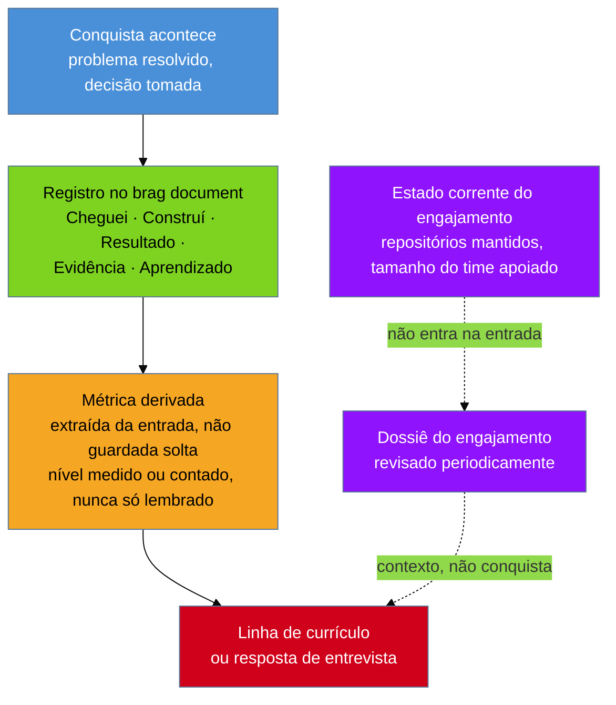

# O brag document

> [!abstract] TL;DR
> A memória guarda o número e joga fora o caminho. Você lembra que reduziu o tempo de deploy; não lembra o que estava quebrado antes, o que tentou primeiro, o que rejeitou e por quê — e é exatamente o caminho, não o número, que uma entrevista quer ouvir quando pergunta *"me conte sobre um projeto difícil"*. O hábito que resolve isso antes de o problema nascer é um registro contínuo, escrito perto do momento em que a conquista acontece, com cinco partes: **Cheguei**, **Construí**, **Resultado**, **Evidência**, **Aprendizado**. Ele separa deliberadamente a **métrica de conquista** — que tem início, fim, antes e depois, e congela para sempre — da **métrica de escopo**, que descreve o presente e muda sozinha com o tempo; misturar as duas faz a entrada mentir no mês seguinte. O efeito mais importante é uma inversão: o número deixa de ser **autorado** numa lista solta que a memória sustenta e passa a ser **derivado** de uma história já registrada, herdando a procedência dela. É o hábito mais valioso deste galho para quem está começando, porque **a diferença entre um currículo forte e um fraco costuma ter sido decidida anos antes de alguém sentar para escrevê-lo**. E a objeção é justa — dá trabalho, e a maioria abandona. Por isso a versão que conta é a mínima: uma linha por conquista, no dia em que acontece. **A versão pobre sustentada vale mais que a versão completa abandonada.**
>
> **Nota de terminologia:** *brag document* é termo consagrado em carreira de tecnologia — usado assim, em inglês, mesmo em fala em português — e este galho o mantém sem tradução forçada, pela mesma convenção que preserva *task-taker*, *owner* e *force multiplier* na [[03-Dominios/Carreira/Currículo/13 - Responsabilidade, realização e alavancagem|nota 13]].

## "Me conte sobre um projeto difícil"

Rafael Duarte estava indo bem na entrevista até aquela pergunta.

Ele sabia qual projeto contar: a automação do pipeline de deploy, o trabalho de que mais se orgulhava nos últimos dois anos. Começou pelo resultado, que era a única parte que ele tinha na ponta da língua — o deploy tinha ficado muito mais rápido, alguma coisa em torno de noventa e cinco por cento.

Aí veio a pergunta de acompanhamento, e ela foi simples: *"E como estava antes?"*

Rafael hesitou. Era manual, ele disse. Levava... bastante tempo. Uma hora, mais ou menos. Talvez mais.

*"E o que você considerou antes de escolher essa abordagem?"*

Aqui ele travou de verdade. Tinha considerado outras coisas, com certeza — lembrava vagamente de ter descartado uma solução mais agressiva. Mas por quê? Qual era o risco que tinha pesado na decisão? Ele começou a montar a resposta ali, ao vivo, e ouviu a própria voz soando como quem estava inventando um motivo plausível em vez de lembrar de um motivo real.

Não era desonestidade. Rafael tinha, sim, tomado aquela decisão, com bons argumentos, um ano e meio antes. O que aconteceu foi mais banal e mais cruel: **a memória tinha guardado o número e jogado fora o caminho**.

## O que a memória descarta primeiro

Passados seis meses, um ano, três anos, quase todo mundo ainda lembra o **número**. Um número redondo é fácil de reter, e costuma ser repetido algumas vezes — em conversa de corredor, em avaliação de desempenho — o que reforça a lembrança dele.

O que se apaga primeiro é o **caminho**: o estado exato em que o sistema estava antes, os dois ou três rumos considerados e descartados, o motivo pelo qual um venceu os outros, o obstáculo que quase inviabilizou a solução e como foi contornado.

E é justamente o caminho que uma entrevista técnica está avaliando. Ninguém pergunta *"me conte sobre um projeto difícil"* para ouvir de novo o resultado — o resultado já está escrito na linha do currículo. Pergunta-se para ouvir **o raciocínio que produziu o resultado**. A memória descarta primeiro exatamente aquilo que a pergunta veio buscar.

A [[03-Dominios/Carreira/Currículo/14 - Números que você pode defender|nota 14]] já tratou do lado da escrita: um número sem registro que o sustente vira **lembrado**, o mais frágil dos três níveis de confiança, e autoriza ordem de grandeza, nunca um percentual calculado sobre uma baseline que a memória reinventou um pouco mais redonda a cada vez. O ângulo aqui é anterior a esse. Não é como escrever um número frágil com honestidade — é **como fazer para que o número, no dia em que for preciso, nunca tenha dependido da memória para existir.**

A resposta não é força de vontade nem truque de memorização. É um hábito: registrar cada conquista relevante perto do momento em que ela acontece. Não na véspera de atualizar o currículo, não na noite anterior à entrevista — na semana em que o deploy ficou mais rápido, em que o bug foi resolvido, em que a decisão difícil foi tomada.

Esse registro tem nome consolidado: **brag document**. A tradução literal — "documento de gabar-se" — perde o que o termo descreve. Não é vaidade documentada. É um sistema de evidência mantido em tempo real, para que a hora de escrever encontre material pronto em vez de uma memória sendo reconstruída sob pressão.

E há uma inversão embutida aí que vale antecipar, porque organiza o resto: o brag document não trata o número como o dado a preservar. Trata o número como **subproduto de uma história completa** — e é a história, registrada no momento certo, que carrega tudo o que uma entrevista, uma adaptação por vaga ou uma negociação podem exigir depois.

## Cinco partes, e o motivo de cada uma

Cada entrada segue a mesma anatomia. Vale entender por que cada parte existe antes de aplicar o formato — uma anatomia seguida sem entender o motivo vira formulário preenchido por obrigação, e formulário preenchido por obrigação é abandonado em dois meses.

**Cheguei** descreve o estado em que a coisa estava — **o problema, não a tarefa**. Não *"recebi a tarefa de otimizar o deploy"*, mas *"o deploy levava perto de uma hora, era manual em três etapas, e falhava sem aviso claro sobre qual delas quebrou"*.

Esta é a parte que **dá tamanho ao resultado**, e é a mais fácil de perder. *"Reduzi o tempo de deploy para dois minutos"* não diz nada sozinho — o leitor não sabe se é melhoria de dez por cento ou de noventa e cinco. *"O deploy levava perto de uma hora, manual, com falha silenciosa; hoje leva dois minutos"* carrega o tamanho dentro de si, sem ninguém precisar calcular percentual nenhum. E ela se perde porque **ninguém tira print do problema ainda não resolvido**: se o Cheguei não for escrito no começo, ele não existe depois.

**Construí** descreve o que foi feito — não como lista de tarefas, mas como decisão tomada sob restrição, com os trade-offs explícitos. É aqui que entra o que foi **rejeitado e por quê**, o detalhe que quase todo mundo omite por achar que só o caminho escolhido importa.

É o contrário. Um bug tem, quase sempre, mais de uma correção possível: a rápida, que resolve o sintoma; a correta, que custa mais tempo e talvez quebre outra coisa; a intermediária, que resolve a causa e deixa uma dívida documentada. Registrar qual foi escolhida e **por que as outras não** — prazo, risco em produção, dependência não pronta — é o que dá a esta seção o peso da pergunta que travou o Rafael. Sem esse registro, a resposta é reconstruída ao vivo, e soa como justificativa improvisada mesmo quando a decisão foi deliberada.

**Resultado** descreve o que mudou, com o número **embutido na frase**. *"Consegui melhorar o tempo de deploy. O novo tempo é de dois minutos"* separa a mudança do número; *"o deploy, que levava cerca de uma hora, passa a levar dois minutos"* entrega os dois no mesmo movimento de leitura — a mesma disciplina da [[03-Dominios/Carreira/Currículo/11 - A linha de bullet|nota 11]], só que sem a restrição de espaço, porque isto aqui não é o documento final. É o material bruto de onde a linha comprimida vai sair depois.

**Evidência** responde a uma pergunta prática: **como provar este número quando alguém perguntar?** Um comando que produz o dado de novo, o link do pull request, um print do painel com data visível, o número do incidente no sistema de tickets. Qualquer coisa que eleve o número de **lembrado** para **medido** ou **contado**.

Ela precisa ser capturada perto do evento por um motivo específico: o link de um pull request de dois anos atrás continua funcionando, mas a lembrança de **qual** pull request era aquele, sem o link salvo na hora, se apaga muito antes do que se espera. E nem sempre é técnica — pode ser um e-mail de agradecimento, uma mensagem de um gestor, uma métrica que outra pessoa publicou. O que importa é existir fora da sua cabeça.

**Aprendizado** é a única parte opcional, e entra só quando houve um trade-off que vale declarar — algo que você faria diferente hoje, ou uma lição que só ficou clara depois. Não é autocrítica obrigatória: forçá-la em conquistas que não têm nenhuma produz o mesmo defeito que a nota 12 descreve para o colchete vazio da fórmula XYZ — um espaço que convence a pessoa a inventar porque o formato pediu. Quando existe de verdade, é o que mais aproxima o registro de material de entrevista sênior, porque nomear o que faria diferente é o que separa quem executou de quem refletiu sobre a própria execução.

> [!example] Caso fictício
> Depois daquela entrevista, Rafael passou a manter um brag document. A primeira entrada não foi sobre o deploy antigo — aquele já não dava para registrar com precisão. Foi sobre a conquista seguinte, escrita no mesmo dia em que a mudança foi implantada:
>
> **Cheguei:** "o rollback, quando um deploy dava problema em produção, exigia acesso manual ao servidor e um script que só eu e mais uma pessoa sabíamos rodar sem errar; a última vez que alguém errou, levou quarenta minutos em vez dos dois que deveria."
> **Construí:** "criei um comando único de rollback, acionável por qualquer pessoa do time via pipeline, sem acesso ao servidor. Considerei automatizar por completo, sem intervenção humana, e descartei: um rollback automático poderia mascarar um problema mais sério que precisava de atenção antes de reverter."
> **Resultado:** "o rollback, que exigia duas pessoas específicas e levava até quarenta minutos em caso de erro, agora é acionável por qualquer um em menos de três minutos."
> **Evidência:** "PR #341, mergeado em 12 de março; incidente que motivou a mudança em INC-2298."
> **Aprendizado:** "achei que automação total seria o objetivo certo; manter um passo humano se provou correto na primeira vez em que o comando foi acionado por engano, e a pessoa percebeu, antes de confirmar, que o problema era outro."
>
> Seis meses depois, adaptando o currículo para uma vaga, Rafael não precisou lembrar de nada. Abriu a entrada — e a linha *"Reduzi o tempo de rollback de até 40 para menos de 3 minutos, descentralizando o processo do acesso restrito a dois desenvolvedores"* já estava, essencialmente, escrita ali dentro. E se a pergunta de acompanhamento viesse, a resposta sobre o que ele rejeitou também estava.

## Duas métricas que não podem morar juntas

Há uma decisão de desenho aqui que não é óbvia e que, ignorada, produz um erro específico: aquele que só aparece meses depois, quando a entrada já parece certa e na verdade está desatualizada.

Uma **métrica de conquista** tem início, fim, antes e depois. Pertence a uma iniciativa datável, com um estado anterior e um posterior que não mudam mais depois que ela termina — a frequência de deploy que subiu de uma vez por trimestre para quatro por mês; o rollback que caiu de quarenta minutos para três. Uma vez registrada, o número **congela**. Daqui a um ano, o fato de que o rollback passou a levar três minutos *naquele momento* continua verdadeiro, mesmo que o processo tenha mudado de novo.

Uma **métrica de escopo** descreve o engajamento inteiro, não uma iniciativa dentro dele — e o traço que a distingue é estrutural: ela **muda sozinha com o tempo**, sem que nenhuma conquista precise acontecer. Quantos repositórios você mantém, quantos serviços estão sob sua responsabilidade, quantas pessoas tem o time que você apoia. Nenhum desses tem um antes-e-depois amarrado a um evento. Eles são o que são hoje, e amanhã podem ser outra coisa só porque o escopo cresceu, encolheu ou foi reorganizado.

> [!example] Caso real
> A nota 14 já registrou o caso do autor deste vault, que descrevia o próprio escopo como "três codebases" — número lembrado, nunca checado — até um levantamento direto mostrar que o real era **dez repositórios**. E note que isso não é uma conquista: não há um "antes eram três, depois passaram a ser dez" com uma decisão no meio explicando a mudança. O número reflete o estado corrente do escopo, e vai mudar de novo sozinho, à medida que projetos entram e saem. (Fonte da trajetória: [josenaldo.com.br/experiences](https://josenaldo.com.br/experiences), verificado ao vivo em 2026-08-20.)

Aqui está a consequência prática, e ela é afiada: **numa nota de conquista, a métrica de escopo mente no mês seguinte.**

Se a entrada do Rafael sobre o rollback tivesse incluído *"hoje mantenho dez repositórios, incluindo o pipeline"*, a frase estaria correta no dia em que foi escrita e possivelmente errada seis meses depois. Não por descuido — pela natureza do número escolhido. Uma entrada de brag document é escrita uma vez e não deveria precisar de manutenção. Uma métrica de escopo precisa de manutenção para continuar verdadeira, porque descreve um presente que se move.

A solução é de desenho, não de disciplina extra: a métrica de escopo vive no **dossiê do engajamento** — um documento por vínculo profissional, revisado periodicamente —, nunca dentro da entrada de conquista. É lá que moram "hoje mantenho dez repositórios", "apoio um time de seis pessoas", "sou responsável por três serviços em produção". A entrada de conquista permanece intocada desde o dia em que foi escrita, porque nunca prometeu descrever o presente.



A distância visual entre as duas rotas não é acidente. A de conquista sobe, evento por evento, até o currículo, sem que ninguém precise voltar e corrigir nada depois. A de escopo entra por outro caminho e **precisa** de manutenção que a primeira nunca precisa — porque descreve um presente que se move, em vez de um passado que já parou.

## Os números saem das histórias, não de uma lista

Aqui está a inversão que dá sentido a tudo o que veio antes.

A prática comum, para quem tenta manter algum controle sobre as próprias conquistas, é uma lista solta de números — uma nota rápida, um documento de "conquistas do ano". Nessa prática, o número é **autorado**: alguém senta, tempos depois do evento, e decide o que escrever, reconstruindo da memória. É exatamente o processo frágil que a nota 14 descreve — a lembrança que se ajusta a cada recontagem, o percentual calculado sobre uma baseline que ninguém mediu.

O brag document inverte a ordem. Em vez de guardar números e tentar lembrar de onde cada um veio, guardam-se as **histórias** — e os números **saem delas** no momento em que são necessários. O número deixa de ser o dado primário e vira subproduto **derivado** de uma história já registrada, com a mesma confiabilidade dela. Se a história foi capturada perto do evento, com Evidência anexada, o número herda automaticamente o nível de confiança mais forte da nota 14 — medido ou contado, quase nunca lembrado.

E há um detalhe que só aparece com o tempo. Uma lista de números autorados **degrada em silêncio**: cada número parece confiável no dia em que foi escrito, mas a lista inteira, revisitada um ano depois, não carrega nenhuma indicação de qual era medido, qual era contado e qual sempre foi só uma lembrança arredondada — porque a lista, por desenho, só guarda o resultado, não o processo. Uma coleção de histórias carrega essa informação em cada entrada: a seção Evidência **é** a resposta à pergunta "de onde veio este número?", guardada junto da história, não numa lista que ninguém consegue reconciliar depois.

## Comece hoje, mesmo que seja uma linha

Este é o conselho mais valioso deste galho para quem lê no começo da carreira, e ele merece ser dito com peso em vez de ficar escondido no meio de outra coisa.

Manter um brag document não é hábito de sênior, reservado a quem já tem conquistas complexas o bastante para valer o registro. É o oposto: rende **mais** quando adotado cedo, porque o custo de não tê-lo cresce a cada ano, em silêncio, sem que ninguém sinta a perda até ela já ter acontecido.

A [[03-Dominios/Carreira/Currículo/10 - Inventário de evidência|nota 10]] descreve o exercício **retroativo** — varrer e-mails antigos, históricos de commits, planilhas esquecidas, para reconstruir material a partir de uma trajetória que aconteceu sem registro. Aquilo funciona, e vale fazer. Mas é, por construção, **arqueologia**: recuperação sempre parcial, sujeita a perder o detalhe mais valioso, porque memória e registros dispersos nunca reconstituem o que uma anotação feita no dia teria capturado sem esforço.

Quem registra desde o começo chega ao primeiro currículo real com material pronto. Quem não registra chega com memória — e memória, pela régua da nota 14, autoriza ordem de grandeza, nunca a precisão que uma pergunta de acompanhamento exige.

É por isso que este conselho precisa alcançar quem ainda está no início: o estagiário no primeiro mês, o autodidata que acabou de terminar o primeiro projeto sozinho, a pessoa em transição que resolveu o primeiro problema técnico real. Não porque essas conquistas iniciais sejam impressionantes sozinhas — **o hábito de registrar é ele mesmo o ativo**, independente do tamanho de cada uma. Quem começa no primeiro mês chega ao quinto ano com cinco anos de histórias e evidência anexada no momento certo. Quem só se preocupa na próxima troca de emprego chega ao mesmo ponto com cinco anos de memória progressivamente mais vaga.

> **A diferença entre um currículo forte e um fraco costuma ter sido decidida anos antes de alguém sentar para escrevê-lo.** Não no dia em que a vaga apareceu — no dia, muito antes, em que uma conquista aconteceu e ou foi registrada, ou foi deixada para a memória decidir sozinha o que sobreviveria.

### E agora a objeção, que é justa

Nada disso seria honesto sem encarar a objeção mais óbvia: **manter isso dá trabalho**, e a maioria das pessoas que começa, com a melhor das intenções, para dentro de poucos meses.

Não é falha de caráter. É o resultado previsível de pedir que um hábito novo compita, toda semana, com o trabalho de verdade que precisa ser entregue. O trabalho de verdade quase sempre ganha.

E insistir que o sistema completo é obrigatório produz o pior dos dois mundos: a pessoa tenta a versão exaustiva, cinco seções por entrada, abandona em um trimestre, e fica exatamente onde estaria se nunca tivesse começado. **Uma prática que ninguém sustenta não serve, por melhor que seja o desenho no papel.**

A saída é uma versão mínima, deliberadamente menor: **uma linha por conquista, num arquivo só, escrita no dia em que aconteceu.** Não cinco seções — uma frase corrida com o essencial: o que estava quebrado, o que foi feito, o que mudou, e um link ou comando que prove o número, se houver algum à mão.

```
Rollback manual de até 40min virou comando de 3min acionável por
qualquer um do time — PR #341, INC-2298
```

Uma linha. Falta o detalhe fino do que foi rejeitado e por quê, mas o essencial sobrevive: o estado anterior, o que mudou, e uma evidência ancorada no momento certo.

E isso já resolve a maior parte do problema, pelo motivo mais simples possível — transforma o número de **lembrado** para, no mínimo, **contado**, porque existe um registro datado ao qual voltar. A distância entre uma linha escrita no dia e nenhuma linha é muito maior que a distância entre uma linha e cinco parágrafos.

**A versão pobre sustentada vale mais que a versão completa abandonada.** E quem começa pela linha única sempre pode expandir depois, entrada por entrada, quando o hábito já estiver de pé.

> [!example] Caso fictício
> Bianca Torres mantém, há dois anos, um arquivo de texto simples aberto na própria máquina, onde escreve uma linha sempre que termina algo digno de nota. Na maioria das semanas, uma ou duas linhas curtas. Em algumas, nenhuma.
>
> Ao revisar o currículo antes de aplicar para uma vaga, ela não parte de uma folha em branco tentando lembrar o que fez no último ano: abre o arquivo, lê as linhas dos últimos meses, e escolhe as três ou quatro que melhor respondem ao que aquela vaga pede — o mesmo movimento de adaptação sem reescrita da [[03-Dominios/Carreira/Currículo/18 - Adaptar por vaga sem reescrever|nota 18]]. Nenhuma entrada dela segue a anatomia completa. Quase todas são uma linha só. E cada uma já resolveu, no dia em que foi escrita, o problema que travou o Rafael naquela entrevista.

> [!example] Caso fictício
> Rafael tentou a anatomia completa em toda entrada durante dois meses. No terceiro, sentiu a tentação real de largar tudo — o dia a dia deixava pouco espaço para cinco parágrafos, e duas semanas passaram sem nenhuma entrada nova.
>
> Em vez de desistir, ele baixou o próprio padrão: passou a escrever só **Cheguei** e **Resultado**, uma frase cada, no dia da conquista, deixando Construí, Evidência e Aprendizado para um momento mais tranquilo — ou, quando esse momento não aparecia, deixando a entrada incompleta mesmo, com o essencial salvo. Um ano depois, o arquivo dele tem entradas de qualidade desigual. E ainda assim cumpre o papel que a memória nunca cumpriria.

## Armadilhas comuns

> [!warning] Tratar a anatomia completa como pré-requisito
> **O que acontece:** a pessoa lê as cinco seções, decide que só vai começar quando tiver tempo e disciplina para preencher todas, e adia indefinidamente o início do hábito.
> **Por quê:** o formato completo, descrito primeiro por clareza pedagógica, parece o único jeito "certo", e qualquer versão menor parece concessão.
> **Como evitar:** comece pela linha única. A anatomia completa é onde você chega quando o tempo permite, não o bilhete de entrada.

> [!warning] Misturar métrica de escopo dentro de uma conquista
> **O que acontece:** ao escrever o Resultado, a pessoa acrescenta de passagem um dado sobre o estado corrente do trabalho — quantos sistemas mantém hoje, quantas pessoas o time tem agora.
> **Por quê:** os dois tipos de número parecem igualmente relevantes e igualmente prontos para a mesma frase.
> **Como evitar:** o teste antes de anotar qualquer número — ele descreve um **evento datável**, com início e fim, ou um **estado corrente** que muda sozinho? No primeiro caso, pertence à entrada. No segundo, ao dossiê do engajamento.

> [!warning] Escrever a entrada só quando o resultado final aparece
> **O que acontece:** a pessoa espera a iniciativa terminar, com o número definitivo em mãos, para só então escrever — e perde o Cheguei, porque o estado inicial já não está nítido.
> **Por quê:** parece mais eficiente escrever uma entrada completa no fim do que capturar fragmentos ao longo do caminho.
> **Como evitar:** capture o Cheguei **no primeiro dia**, antes de saber qual será o resultado. É esse registro do estado inicial, feito antes de a solução existir, que dá tamanho ao resultado quando ele chegar.

> [!example] Caso real
> O autor deste vault mantém um sistema de brag documents estruturados, organizados por engajamento profissional, seguindo a mesma anatomia Cheguei/Construí/Resultado. É desse sistema, e não de uma lista solta de números, que as métricas usadas nas variantes de currículo são **derivadas** — o mecanismo de inversão descrito acima. O sistema inclui também um registro separado de **números aposentados**, já tratado pela [[03-Dominios/Carreira/Currículo/14 - Números que você pode defender|nota 14]]: valores publicados no passado, depois descobertos como frágeis, que não devem mais circular. Esse sistema vive num repositório privado; não há link público, e nada é afirmado aqui além do que está descrito.

## De onde vem o termo

*Brag document* não nasce neste galho — é vocabulário consolidado na cultura de carreira em tecnologia, popularizado sobretudo por Julia Evans, engenheira e escritora técnica, num artigo de 2019 chamado *"Get your work recognized: write a brag document"*. Ela descreve exatamente a tática central deste capítulo: manter um documento do que foi feito, em vez de confiar na própria memória ou na do gestor, para que o material esteja pronto na época da avaliação.

Uma frase dela resume, com economia, o espírito que este capítulo tenta traduzir para o contexto do currículo:

> **"You don't have to try to make your work sound better than it is. Just make it sound exactly as good as it is!"**

Em tradução livre: *você não precisa tentar fazer seu trabalho soar melhor do que é. Só precisa fazê-lo soar exatamente tão bom quanto ele realmente é.* É essa economia — nem inflar, nem esconder — que a anatomia de cinco partes garante estruturalmente, e não apenas como intenção.

## Como soa em inglês

> *"I keep a brag document — one entry per accomplishment, written close to when it happened, not reconstructed from memory months later. Each entry follows the same shape: what the situation looked like before I touched it, what I actually built and what I decided not to do instead, what changed as a result with the number baked into the sentence, and how I'd prove it if someone asked — a command, a link, a screenshot. I don't keep a separate list of numbers I'm trying to remember the origin of. The numbers come out of the stories, not the other way around, and that's the whole point: by the time I need a metric for a resume line or an interview answer, it's already sitting there, derived from something I wrote down when it was still fresh, instead of something I'm trying to reconstruct under pressure."*

| PT | EN |
| --- | --- |
| brag document | brag document (termo consagrado) |
| Cheguei / Construí / Resultado / Evidência / Aprendizado | Starting point / What I built / Result / Evidence / Learning |
| métrica de conquista | accomplishment metric |
| métrica de escopo | scope metric |
| dossiê do engajamento | engagement dossier |
| métrica autorada | authored metric |
| métrica derivada | derived metric |
| versão mínima viável | minimum viable version |

## O que vem a seguir

Rafael não conseguiu recuperar o Cheguei daquele deploy. Aquele número específico continua sendo, para sempre, uma lembrança arredondada — e é por isso que ele começou a registrar no dia seguinte à entrevista, e não no dia seguinte à próxima vaga.

Com material fresco entrando de forma contínua, sobra a mecânica que transforma esse material em documento pronto para enviar:

- [[03-Dominios/Carreira/Currículo/22 - O currículo como pipeline|22 - O currículo como pipeline]] — fonte única, base e variante, imutabilidade do que já foi enviado, e a guarda que impede um número aposentado de voltar a circular.

## Veja também

- [[03-Dominios/Carreira/Currículo/index|Currículo]] — o índice do galho.
- [[03-Dominios/Carreira/Currículo/14 - Números que você pode defender|14 - Números que você pode defender]] — os três níveis de confiança que este capítulo inverte: a origem do número deixa de ser reconstruída e passa a ser derivada.
- [[03-Dominios/Carreira/Currículo/10 - Inventário de evidência|10 - Inventário de evidência]] — a versão retroativa deste hábito; a fronteira entre as duas é a diferença entre arqueologia e registro em tempo real.
- [[03-Dominios/Carreira/Currículo/13 - Responsabilidade, realização e alavancagem|13 - Responsabilidade, realização e alavancagem]] — a escada de escopo que a seção Construí ajuda a documentar sem forçar o terceiro degrau.
- [[03-Dominios/Carreira/Currículo/20 - A âncora|20 - A âncora]] — o padrão que se repete entre empregos, visível só para quem tem três ou mais eventos concretos registrados.
- [[03-Dominios/Carreira/Entrevistas/index|Entrevistas]] — o galho parceiro: é este material, sem comprimir numa linha, que sustenta a resposta a "me conte sobre um projeto difícil".

## Fontes

- **Julia Evans** — [Get your work recognized: write a brag document](https://jvns.ca/blog/brag-documents/), publicado em 28 de junho de 2019, verificado ao vivo em 2026-08-20. Fonte da origem e popularização do termo, e da citação sobre não precisar fazer o trabalho soar melhor do que é.
- **Josenaldo Matos** — [josenaldo.com.br/experiences](https://josenaldo.com.br/experiences), página pública de experiências profissionais, verificada ao vivo em 2026-08-20. Fonte do caso real sobre "dez repositórios", já registrado com detalhe pela [[03-Dominios/Carreira/Currículo/14 - Números que você pode defender|nota 14]] e reusado aqui como exemplo de métrica de escopo.
- O sistema privado de brag documents e o registro de números aposentados do autor, citados no caso real, não têm repositório público disponível para verificação externa; nada é afirmado ou inferido sobre esse sistema além do descrito aqui.
- **Rafael Duarte** e **Bianca Torres** são personas fictícias já estabelecidas neste galho, reutilizadas com os mesmos fatos canônicos — ambos desenvolvedores de nível pleno.
