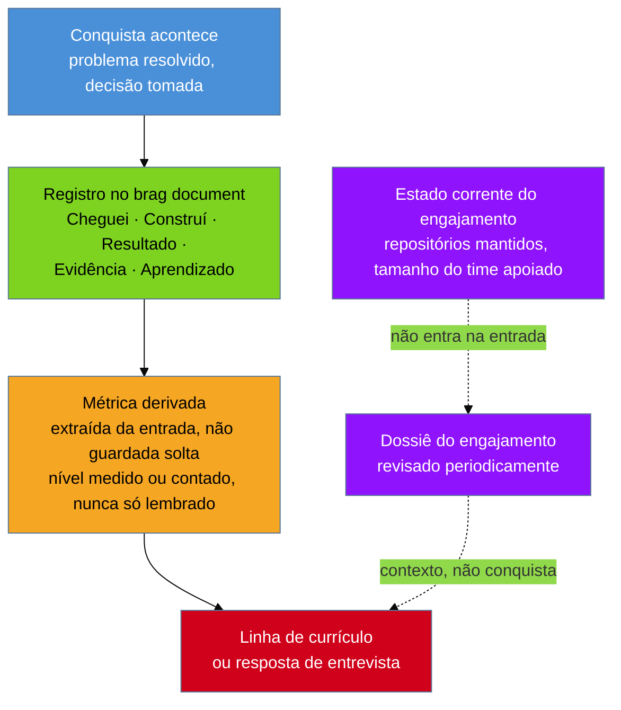

# O brag document

> [!abstract] TL;DR
> **A nota registra o número, não o trabalho** — e é exatamente por isso que ela existe. Quando chega a hora de escrever o currículo, adaptar uma linha para uma vaga específica, ou responder "me conte sobre um projeto difícil", o número está lá e a história não: você lembra que reduziu o tempo de deploy, não lembra o que estava quebrado antes, o que tentou primeiro, o que rejeitou e por quê. Esta nota descreve o hábito que resolve esse problema antes de ele nascer — um registro contínuo, feito perto do momento em que a conquista acontece, com uma anatomia de cinco partes (**Cheguei**, **Construí**, **Resultado**, **Evidência**, **Aprendizado**) que separa, deliberadamente, a **métrica de conquista** — que tem início, fim, antes e depois — da **métrica de escopo**, que descreve o engajamento inteiro e muda sozinha com o tempo. O efeito mais importante do hábito é uma inversão: a métrica deixa de ser **autorada**, mantida numa lista solta que a memória tenta sustentar, e passa a ser **derivada** — extraída de uma história já registrada, no momento em que ela aconteceu. É o hábito mais valioso deste galho inteiro para quem está no começo da carreira, porque a diferença entre um currículo forte e um fraco costuma ter sido decidida anos antes de alguém sentar para escrevê-lo — e uma versão mínima, sustentada com disciplina, já resolve a maior parte do problema.
>
> **Nota de terminologia:** a expressão *brag document* é termo técnico consagrado em carreira de tecnologia — usado assim, em inglês, mesmo em contexto de fala em português — e este galho a mantém sem tradução forçada, pela mesma convenção que preserva *task-taker*, *owner* e *force multiplier* na [[03-Dominios/Carreira/Currículo/13 - Responsabilidade, realização e alavancagem|nota 13]].

## O que a memória perde, e o número sozinho não recupera

A [[03-Dominios/Carreira/Currículo/14 - Números que você pode defender|nota 14]] já descreveu, com detalhe, o que acontece quando um número chega ao currículo sem um registro que o sustente: ele vira **lembrado**, o mais frágil dos três níveis de confiança, e autoriza só ordem de grandeza, nunca um percentual calculado sobre uma baseline que a memória inventou de novo, um pouco mais redonda a cada vez que foi recontada. Esta nota parte do mesmo problema, mas olha para ele de um ângulo anterior: não **como escrever** um número frágil com honestidade — isso já foi resolvido —, e sim **o que fazer para que o número, no dia em que for preciso, nunca precise ser lembrado.**

A resposta não é um truque de memorização nem um esforço de vontade maior na hora de escrever o currículo. É um hábito, praticado ao longo do tempo, de registrar cada conquista relevante perto do momento em que ela acontece — não na véspera de atualizar o documento, não na noite antes de uma entrevista, mas na semana em que o deploy ficou mais rápido, em que o bug foi resolvido, em que a decisão difícil foi tomada. Esse registro tem um nome consolidado no vocabulário de carreira de tecnologia: **brag document** — literalmente, "documento de gabar-se", ainda que a tradução literal perca o que o termo realmente descreve. Não é vaidade documentada. É um sistema de evidência mantido em tempo real, para que o momento de escrever o currículo — ou de responder, numa entrevista, "me conte sobre um projeto difícil" — encontre material pronto, em vez de uma memória que precisa ser reconstruída sob pressão.

Vale nomear, com precisão, o que se perde quando esse hábito não existe, porque é fácil subestimar a perda até ela aparecer na prática. Passados seis meses, um ano, três anos, a maioria das pessoas ainda lembra o **número** — "reduzi o tempo de deploy", "corrigi aquele bug crítico" — porque um número redondo é fácil de reter e costuma ser repetido algumas vezes, em conversa de corredor ou em avaliação de desempenho, o que reforça a memória dele. O que a memória perde primeiro é o **caminho** até esse número: o estado exato em que o sistema estava antes, os dois ou três caminhos considerados e descartados, o motivo pelo qual um deles foi escolhido em vez dos outros, o obstáculo que quase inviabilizou a solução escolhida e como foi contornado. É esse caminho — não o número em si — que uma entrevista técnica de verdade está tentando avaliar quando pergunta "me conte sobre um projeto difícil": ninguém pergunta isso para ouvir de novo o resultado, que já está escrito na linha do currículo; pergunta para ouvir o raciocínio que produziu o resultado, e é esse raciocínio, especificamente, que a memória descarta primeiro, por ser mais complexo de reter do que o número final.

O brag document existe para inverter essa ordem de perda. Ele não trata o número como o dado central a preservar — trata o número como um **subproduto** de uma história completa, e é a história completa, registrada perto do momento em que aconteceu, que carrega tudo o que uma entrevista, uma adaptação de currículo por vaga ou uma negociação salarial podem vir a exigir. Um número guardado sozinho, numa lista, é frágil da mesma forma que qualquer fato desacompanhado de contexto é frágil: fácil de esquecer de onde veio, fácil de inflar sem querer, fácil de repetir de memória meses depois com uma casa decimal que nunca existiu de verdade. Uma história registrada por inteiro, com o número embutido nela, carrega a própria procedência — e é exatamente esse deslocamento, de número solto para história completa, que o resto desta nota detalha.

## A anatomia: Cheguei, Construí, Resultado, Evidência, Aprendizado

O brag document não é uma lista de frases soltas — é uma coleção de entradas, uma por conquista, cada uma seguindo a mesma anatomia de cinco partes. Cada parte existe por um motivo específico, e vale entender o motivo antes de aplicar o formato, porque uma anatomia seguida sem entender por que cada seção existe vira, rapidamente, um formulário preenchido por obrigação, esvaziado do próprio propósito.

**Cheguei** descreve o estado em que a coisa estava — **o problema, não a tarefa**. Não é "recebi a tarefa de otimizar o deploy"; é "o deploy levava perto de uma hora, era manual em três etapas, e falhava sem aviso claro sobre qual das três tinha quebrado". A diferença não é estilística — é a diferença entre uma frase que descreve uma atribuição, no sentido que a [[03-Dominios/Carreira/Currículo/13 - Responsabilidade, realização e alavancagem|nota 13]] já nomeou, e uma frase que descreve um **estado do mundo antes de qualquer decisão ter sido tomada**. É esta seção, mais do que qualquer outra das cinco, que **dá tamanho ao resultado**. "Reduzi o tempo de deploy para dois minutos" não impressiona ninguém sozinho, porque o leitor não tem como saber se isso é uma melhoria de dez por cento ou de noventa e cinco. "O deploy levava perto de uma hora, manual, com falha silenciosa; hoje leva dois minutos" já carrega esse tamanho dentro de si, sem que ninguém precise calcular percentual nenhum para sentir a diferença. Escrever Cheguei no momento em que o trabalho começa, e não meses depois quando só o resultado é lembrado, é o que garante que esse estado inicial — o dado mais fácil de esquecer, porque ninguém tira print do problema ainda não resolvido — sobreviva ao tempo.

**Construí** descreve o que foi feito — não como lista de tarefas concluídas, mas como decisão tomada sob restrição real, com os trade-offs explícitos. É aqui que entra o que foi **rejeitado e por quê** — o detalhe que a maioria das pessoas omite por instinto, achando que só o caminho escolhido importa, quando é justamente o caminho descartado que transforma o registro em material de entrevista de verdade. Um bug corrigido tem, quase sempre, mais de uma correção possível: a mais rápida, que resolve o sintoma sem tocar na causa; a mais correta, que exige mais tempo e talvez quebre outra coisa; a intermediária, que resolve a causa mas deixa uma dívida técnica documentada para depois. Registrar qual dessas opções foi escolhida e por que as outras não foram — prazo apertado, risco alto num sistema em produção, uma dependência ainda não pronta — é o que dá à seção Construí o mesmo peso que um entrevistador técnico está testando ao perguntar "por que você fez assim, e não de outro jeito". Sem esse registro, a resposta, meses depois, tende a ser reconstruída na hora, com o risco real de soar como justificativa improvisada em vez de decisão deliberada.

**Resultado** descreve o que mudou, com o número **embutido na frase**, não anexado como um apêndice separado. "Consegui melhorar o tempo de deploy. O novo tempo é de dois minutos" separa a mudança do número, como se fossem duas informações distintas; "o deploy, que levava cerca de uma hora, passa a levar dois minutos" embute os dois no mesmo movimento de leitura, exatamente a mesma disciplina de frase que a [[03-Dominios/Carreira/Currículo/11 - A linha de bullet|nota 11]] já ensinou para a linha de bullet do currículo. A diferença é que, aqui, a frase não precisa caber numa linha de currículo com todas as restrições de espaço que aquela nota impôs — pode ser mais longa, mais detalhada, porque o brag document não é o documento final, é o material bruto do qual o documento final, mais adiante, vai extrair a linha comprimida.

**Evidência** responde a uma pergunta prática: **como provar este número quando alguém perguntar**? Um comando que produz o dado de novo, um link para o pull request, um print do painel de observabilidade com data visível, o número do incidente no sistema de tickets — qualquer coisa que eleve o número desta entrada de **lembrado** para **medido** ou **contado**, no vocabulário já fixado pela nota 14. A Evidência precisa ser capturada **perto do evento**, porque um link para um pull request de dois anos atrás ainda funciona, mas a lembrança de qual pull request era esse, sem o link salvo na hora, se apaga muito antes do que a maioria espera. Nem sempre é um dado técnico — pode ser um e-mail de agradecimento, uma mensagem de um gestor, uma métrica que outra pessoa publicou sobre o efeito do trabalho. O que importa é que exista fora da própria memória de quem escreveu a entrada.

**Aprendizado**, a única das cinco partes que é opcional, entra apenas quando houve um trade-off que vale a pena declarar — uma decisão que, olhando para trás, a pessoa faria diferente hoje, ou uma lição que só ficou clara depois que o resultado apareceu. Não é uma seção de autocrítica obrigatória em toda entrada; forçá-la em conquistas que não têm nenhum aprendizado genuíno para declarar produziria o mesmo problema que a nota 12 já descreveu para o colchete vazio da fórmula XYZ — um espaço que convence a pessoa a inventar algo só porque o formato pede. Quando existe de verdade, porém, o Aprendizado é o que mais aproxima o brag document de material de entrevista sênior, porque é justamente a capacidade de nomear o que faria diferente que separa quem apenas executou de quem refletiu sobre a própria execução — o mesmo tipo de honestidade que a nota 13 já exigiu ao tratar de alavancagem forçada onde só existe realização.

> [!example] Caso fictício
> Rafael Duarte, desenvolvedor pleno já apresentado em notas anteriores deste galho, é o mesmo Rafael que a [[03-Dominios/Carreira/Currículo/14 - Números que você pode defender|nota 14]] descreveu tentando lembrar, um ano depois, o tempo exato que o deploy levava antes de ele automatizar o pipeline de CI/CD — e chegando a um "reduzi em 95%" que ele mesmo, ao reler aquela nota, reconheceu como falsa precisão em cima de duas lembranças aproximadas. O que a nota 14 não contou, porque não era o assunto dela, é o que Rafael fez depois de perceber o problema: passou a manter um brag document, e a primeira entrada que escreveu — não sobre o deploy antigo, que já não podia mais registrar com precisão, mas sobre a próxima conquista que teve — seguiu a anatomia inteira, no mesmo dia em que a mudança foi implantada. **Cheguei:** "o processo de rollback, quando um deploy dava problema em produção, exigia acesso manual ao servidor e um script que só eu e mais uma pessoa do time sabíamos rodar sem cometer erro; a última vez que alguém errou, o rollback levou quarenta minutos em vez dos dois que deveria levar." **Construí:** "criei um comando único de rollback, acionável por qualquer pessoa do time via pipeline, sem acesso direto ao servidor; considerei automatizar o rollback por completo, sem intervenção humana nenhuma, mas descartei essa opção porque um rollback automático, sem revisão de uma pessoa, poderia mascarar um problema mais sério que precisava de atenção antes de reverter — prefiro um comando rápido acionado por decisão humana a uma reversão silenciosa." **Resultado:** "o rollback, que antes exigia duas pessoas específicas e levava até quarenta minutos em caso de erro, agora é acionável por qualquer pessoa do time em menos de três minutos." **Evidência:** "commit da automação: link do pull request #341, mergeado em 12 de março; o incidente que motivou a mudança está registrado no sistema de tickets sob o número INC-2298." **Aprendizado:** "achei, no início, que automação total do rollback seria o objetivo certo; a decisão de manter um passo humano no meio, mesmo custando alguns segundos a mais, se provou correta na primeira vez em que o comando foi acionado por engano, e a pessoa que o acionou percebeu, antes de confirmar, que o problema era outro." Seis meses depois, ao adaptar o currículo para uma vaga, Rafael não precisou lembrar de nada disso — abriu a entrada, e a linha de bullet "Reduzi o tempo de rollback de até 40 para menos de 3 minutos, descentralizando o processo do acesso restrito a dois desenvolvedores" já estava, essencialmente, escrita dentro do próprio registro.

## A separação em duas camadas: métrica de conquista e métrica de escopo

Há uma decisão de desenho, dentro do brag document, que não é óbvia à primeira vista e que vale explicar com cuidado, porque ignorá-la produz um tipo específico de erro que só aparece meses depois de a entrada ter sido escrita — quando ela já parece certa e, na verdade, está desatualizada. Existem dois tipos de métrica, e eles não podem morar no mesmo lugar.

Uma **métrica de conquista** tem início, fim, antes e depois. Ela pertence a uma iniciativa específica, datável, com um estado anterior e um estado posterior que não mudam mais depois que a iniciativa termina — a frequência de deploy que subiu de uma vez por trimestre para quatro vezes por mês, o tempo de rollback que caiu de quarenta minutos para três. Uma vez registrada, o número **congela**: daqui a um ano, o fato de que o rollback passou a levar três minutos, naquele momento específico, continua verdadeiro, mesmo que o processo tenha mudado de novo depois. É esse congelamento que faz dela pertencer, com segurança, à entrada individual, dentro da seção Resultado.

Uma **métrica de escopo**, em contraste, descreve o engajamento inteiro, não uma iniciativa dentro dele — e o traço que a distingue de uma métrica de conquista é estrutural: ela **muda sozinha com o tempo**, sem que nenhuma conquista específica precise acontecer para essa mudança se dar. Quantos repositórios uma pessoa mantém, quantos serviços estão sob sua responsabilidade, quantas pessoas fazem parte do time que ela apoia — nenhum desses números tem um "antes e depois" amarrado a um evento datável; eles simplesmente **são o que são, hoje**, e amanhã podem ser outra coisa sem que ninguém tenha feito nada de especial, só porque o escopo do trabalho cresceu, encolheu ou foi reorganizado.

> [!example] Caso real
> A [[03-Dominios/Carreira/Currículo/14 - Números que você pode defender|nota 14]] já registrou o caso do autor deste vault, que descrevia o próprio escopo de atuação como "três codebases" — um número lembrado, nunca checado — até um levantamento direto mostrar que o número real era **dez repositórios**. Esse número, note-se, não é uma conquista: não há um "antes eram três, depois passaram a ser dez" com uma decisão específica no meio explicando a mudança — o número simplesmente reflete o estado corrente do escopo de atuação num determinado momento, e tende a mudar de novo, sozinho, à medida que projetos entram e saem da responsabilidade do autor. (Fonte da trajetória: [josenaldo.com.br/experiences](https://josenaldo.com.br/experiences), verificado ao vivo em 2026-08-20.)

É aqui que a separação se torna prática, não só conceitual: **numa nota de conquista, a métrica de escopo mente no mês seguinte.** Se a entrada sobre o comando de rollback de Rafael tivesse incluído "hoje mantenho dez repositórios, incluindo o pipeline de deploy", essa frase estaria correta no dia em que foi escrita e poderia estar errada seis meses depois, quando o escopo dele mudou — não por descuido, mas porque a natureza do número escolhido é ser corrente, não histórico. Uma entrada de brag document é escrita uma vez e não deveria precisar de manutenção depois; uma métrica de escopo, ao contrário, precisa dela para continuar verdadeira, porque descreve um presente que se move.

A solução é de desenho, não de disciplina extra: a métrica de escopo **vive no dossiê do engajamento** — um documento separado, um por vínculo profissional, atualizado periodicamente à medida que o escopo muda —, não dentro da entrada de conquista específica. O dossiê do engajamento é o lugar certo para "hoje mantenho dez repositórios", "atualmente apoio um time de seis pessoas", "sou responsável por três serviços em produção" — números que descrevem o presente e que, justamente por isso, precisam ser revisados de tempos em tempos, não escritos uma vez e esquecidos. A entrada de conquista, dentro desse mesmo dossiê ou associada a ele, permanece intocada desde o dia em que foi escrita, porque ela nunca prometeu descrever o presente — prometeu descrever um evento específico, já ocorrido, que não muda de significado com a passagem do tempo.

O diagrama fixa as duas rotas em separado, e a distância visual entre elas não é acidente: a rota de conquista sobe, evento por evento, até o currículo — cada passo derivado do anterior, sem que ninguém precise voltar e corrigir nada no meio do caminho depois que a entrada foi escrita. A rota de escopo entra no currículo por um caminho diferente, e precisa de manutenção que a rota de conquista nunca precisa, exatamente porque descreve um presente que se move em vez de um passado que já parou de se mover.

## A inversão que fecha o galho: de autorada a derivada

Chega-se, com as duas seções anteriores no lugar, ao ponto que dá título a este bloco de notas — a peça que fecha, no plano do hábito contínuo, o mesmo problema que a [[03-Dominios/Carreira/Currículo/14 - Números que você pode defender|nota 14]] já resolveu no plano da frase individual. Aquela nota ensinou a **defender** um número depois que ele já existe, dando a cada nível de confiança — medido, contado, lembrado — a régua certa de o que a frase pode prometer. Esta nota ensina algo anterior a isso, e é aqui que as duas se encaixam: **como fazer com que o número, na maioria dos casos, nunca precise ser defendido a partir da memória, porque ele nunca dependeu da memória para existir.**

A prática mais comum, para quem tenta manter algum controle sobre as próprias conquistas sem um sistema desenhado para isso, é manter uma lista solta de números — uma nota rápida, um documento de "conquistas do ano". Nessa prática, o número é **autorado**: alguém senta, tempos depois do evento, e decide o que escrever, geralmente reconstruindo a partir da memória, exatamente o processo frágil que a nota 14 descreveu em detalhe — a lembrança que se ajusta sozinha a cada vez que é recontada, o percentual calculado sobre uma baseline que ninguém mediu de fato.

O brag document inverte essa ordem. Em vez de manter uma lista de números e tentar, quando chega a hora, lembrar de onde cada um veio, mantém-se as **histórias** — as entradas completas, na anatomia de cinco partes —, e os números **saem delas**, no momento em que são necessários, em vez de serem escritos de antemão numa lista separada. O número não é mais o dado primário que alguém decide anotar; é um subproduto que se **deriva** de uma história já registrada, com a mesma confiabilidade da própria história. Se a história foi capturada perto do evento, com Evidência anexada, o número derivado dela herda automaticamente o nível de confiança mais forte que a nota 14 descreveu — medido ou contado, quase nunca lembrado —, porque a origem do número deixou de ser a memória de uma pessoa e passou a ser um registro escrito no dia em que o fato aconteceu.

Vale nomear por que essa inversão importa mais do que parece à primeira vista. Uma lista de números autorados degrada com o tempo de um jeito silencioso: cada número, isoladamente, parece confiável no dia em que foi escrito, mas a lista inteira, revisitada um ano depois, já não carrega nenhuma indicação de qual número era medido, qual era contado e qual já tinha sido, desde o início, só uma lembrança arredondada — porque a lista, por desenho, só guarda o resultado final, não o processo que levou até ele. Uma coleção de histórias, na anatomia Cheguei/Construí/Resultado/Evidência/Aprendizado, carrega essa informação embutida em cada entrada: a seção Evidência é, ela mesma, a resposta à pergunta "de onde veio este número?", disponível junto da história, não separada dela numa lista que ninguém mais consegue reconciliar meses depois.

## O hábito que quem está começando deveria adotar hoje

Chega-se, agora, ao conselho mais valioso deste galho inteiro para quem lê no começo da carreira — e vale dizer isso com o peso que merece, em vez de deixá-lo escondido no meio de uma seção sobre outra coisa. Manter um brag document não é um hábito de sênior, reservado a quem já tem uma carreira longa o bastante para ter conquistas complexas o suficiente para valer a pena registrar. É, precisamente, o oposto: é o hábito que rende **mais** quando adotado cedo, porque o custo de não tê-lo cresce a cada ano que passa sem ele, silenciosamente, sem que ninguém sinta a perda até o momento em que ela já aconteceu.

A [[03-Dominios/Carreira/Currículo/10 - Inventário de evidência|nota 10]] já descreveu, em detalhe, o exercício **retroativo** — varrer e-mails antigos, históricos de commits, planilhas esquecidas, para reconstruir material de currículo a partir de uma trajetória que já aconteceu sem ter sido registrada no momento certo. Aquele exercício funciona, e vale a pena fazê-lo quando o hábito ainda não existe. Mas é, por construção, uma **arqueologia** — recuperação sempre parcial, sujeita a esquecer o detalhe mais valioso, porque memória e registros dispersos nunca reconstituem, com a mesma fidelidade, o que uma anotação feita no dia do evento teria capturado sem esforço. A própria nota 10 nomeia essa fronteira: o inventário é a versão retroativa de um hábito que, praticado continuamente, elimina a arqueologia inteira. O brag document é esse hábito contínuo. **Quem registra desde o começo chega ao primeiro currículo real com material pronto; quem não registra chega com memória — e memória, pela régua já fixada na nota 14, só autoriza ordem de grandeza, nunca a precisão que uma entrevista de acompanhamento costuma exigir.**

É por isso que este conselho deveria alcançar quem ainda está no início — o estagiário no primeiro mês de trabalho, o autodidata que acabou de terminar o primeiro projeto sozinho, a pessoa em transição de carreira que acabou de resolver o primeiro problema técnico real. Não porque essas conquistas iniciais sejam, sozinhas, suficientes para um currículo impressionante — a [[03-Dominios/Carreira/Currículo/03 - Os seis níveis e o que muda entre eles|nota 03]] já deixou claro que cada nível prova coisas diferentes. A razão é outra, e mais estrutural: **o hábito de registrar é ele mesmo o ativo**, independente do tamanho de cada conquista individual. Quem começa a manter um brag document no primeiro mês de carreira chega ao quinto ano com cinco anos de histórias completas, com Evidência anexada no momento certo; quem só se preocupa com isso na próxima troca de emprego chega ao mesmo ponto com cinco anos de memória progressivamente mais vaga.

**A diferença entre um currículo forte e um fraco costuma ter sido decidida anos antes de alguém sentar para escrevê-lo.** Não no dia em que a vaga apareceu — no dia, muito antes disso, em que uma conquista aconteceu e ou foi registrada, com evidência anexada, ou foi deixada para a memória decidir, sozinha, o que sobreviveria. Quem entende essa mecânica cedo — mesmo sem dominar ainda a técnica de escrita das notas anteriores deste galho — já está, silenciosamente, à frente de quem só vai descobrir esse hábito quando a próxima busca de emprego forçar a arqueologia da nota 10 a acontecer de novo, do zero, com material cada vez mais desbotado.

## A objeção honesta: manter isso dá trabalho

Nenhuma nota deste galho seria honesta se ignorasse a objeção mais óbvia e, ao mesmo tempo, mais correta que se pode fazer a tudo o que foi descrito até aqui: manter um brag document com a anatomia completa, entrada por entrada, dá trabalho — e a maioria das pessoas que decide começar, com a melhor das intenções, para de manter dentro de poucos meses. Não é falha de caráter; é o resultado previsível de pedir que um hábito novo compita, toda semana, com o trabalho de verdade que precisa ser entregue — e o trabalho de verdade, quase sempre, ganha essa disputa por prioridade.

Vale reconhecer isso sem meio-termo, porque a alternativa — insistir que o sistema completo é obrigatório — produz o pior dos dois mundos: a pessoa tenta a versão exaustiva, cinco seções por entrada, e abandona tudo dentro de um trimestre, ficando exatamente onde estaria se nunca tivesse começado. **Uma prática que ninguém sustenta não serve, por melhor que seja o desenho dela no papel.**

A saída é uma versão mínima viável, deliberadamente menor do que a anatomia completa: **uma linha por conquista, num arquivo só, escrita no dia em que aconteceu.** Não cinco seções — uma frase corrida capturando o essencial: o que estava quebrado, o que foi feito, o que mudou, e um link ou comando que prove o número, se houver um à mão. "Rollback manual de até 40min virou comando de 3min acionável por qualquer um do time — PR #341, INC-2298" já carrega, comprimida numa linha, a maior parte do que a anatomia completa capturaria em cinco parágrafos — falta o detalhe fino do que foi rejeitado e por quê, mas o essencial sobrevive: o estado anterior, o que mudou, e uma evidência ancorada no momento certo, não reconstruída meses depois.

Essa versão mínima resolve, sozinha, a maior parte do problema desta nota, pelo motivo mais simples possível: transforma o número de **lembrado** para, no mínimo, **contado**, porque existe um registro datado ao qual voltar, mesmo que seja uma única linha num arquivo de texto sem formatação. A diferença entre uma linha escrita no dia do evento e nenhuma linha é, de longe, maior do que a diferença entre uma linha e uma entrada completa de cinco seções. **A versão pobre sustentada vale mais do que a versão completa abandonada** — e quem começa pela linha única sempre pode expandir a anatomia depois, entrada por entrada, quando o hábito já estiver consolidado.

## Casos práticos

> [!example] Caso fictício
> Bianca Torres, desenvolvedora backend pleno já apresentada em notas anteriores deste galho, mantém, havia dois anos, um arquivo de texto simples aberto na própria máquina, onde escreve uma linha sempre que termina algo que considera digno de nota — sem esperar chegar a cinco parágrafos. Na maioria das semanas, o arquivo recebe uma ou duas linhas curtas; em semanas mais movimentadas, às vezes nenhuma. Ao revisar a própria linha de currículo antes de aplicar para uma vaga — o mesmo hábito de revisão que a [[03-Dominios/Carreira/Currículo/index|índice do galho]] já registrou como traço canônico dela —, Bianca não parte de uma folha em branco tentando lembrar o que fez no último ano: abre o arquivo, lê as linhas dos últimos meses, e escolhe as três ou quatro que melhor respondem ao que a vaga específica está pedindo, o mesmo movimento de adaptação sem reescrita que a [[03-Dominios/Carreira/Currículo/18 - Adaptar por vaga sem reescrever|nota 18]] já ensinou. Nenhuma das entradas segue a anatomia completa — a maioria é uma linha só, no formato mínimo desta nota —, mas cada uma já resolveu, no dia em que foi escrita, o problema da nota 14: o número, quando existe, está ancorado num momento específico, não numa memória a reconstruir meses depois.

> [!example] Caso fictício
> Rafael Duarte, na mesma trajetória já descrita nesta nota, tenta manter a anatomia completa em toda entrada durante os primeiros dois meses, e sente, no terceiro mês, a tentação real de abandonar o hábito inteiro — o trabalho normal do dia a dia deixa pouco espaço para escrever cinco parágrafos cada vez, e duas semanas passam sem uma única entrada nova. Em vez de desistir, Rafael reduz o próprio padrão: passa a escrever só Cheguei e Resultado, numa frase cada, no dia em que a conquista acontece, e deixa Construí, Evidência e Aprendizado para um momento de revisão mais tranquilo — ou, quando esse momento não aparece, simplesmente deixa a entrada incompleta, mas já com o essencial salvo. O arquivo dele, um ano depois, tem entradas de qualidade desigual, e ainda assim cumpre o papel que a memória sozinha nunca cumpriria: ancorar cada número num registro escrito perto do dia em que o fato aconteceu, em vez de deixar a memória arredondar sozinha, meses depois, o mesmo erro que a nota 14 já documentou sobre ele.

## Armadilhas comuns

> [!warning] Tratar a anatomia completa como pré-requisito para começar
> **O que acontece:** a pessoa lê a anatomia de cinco seções desta nota, decide que só vai começar a manter um brag document quando tiver tempo e disciplina suficientes para preencher todas elas em cada entrada, e adia o início do hábito indefinidamente, esperando o momento ideal que raramente chega. **Por quê:** o formato completo, descrito primeiro nesta nota por clareza pedagógica, parece o único jeito "certo" de fazer, e qualquer versão menor parece uma concessão a evitar. **Como evitar:** começar pela versão mínima viável descrita na seção sobre a objeção honesta — uma linha por conquista, no dia em que ela acontece — e deixar a anatomia completa como algo a que se recorre quando o tempo permite, não como bilhete de entrada obrigatório para o hábito inteiro.

> [!warning] Misturar métrica de escopo dentro de uma entrada de conquista
> **O que acontece:** ao escrever a seção Resultado de uma entrada, a pessoa acrescenta, de passagem, um dado sobre o estado corrente do próprio trabalho — quantos sistemas mantém hoje, quantas pessoas o time tem agora — tratando esse dado como parte natural da mesma frase que descreve a conquista específica. **Por quê:** os dois tipos de número parecem, à primeira vista, igualmente relevantes e igualmente prontos para escrever na mesma frase, sem que a diferença estrutural entre eles fique óbvia no momento da escrita. **Como evitar:** aplicar o teste desta nota antes de anotar qualquer número numa entrada — ele descreve um evento datável, com início e fim, ou descreve um estado corrente que muda sozinho com o tempo? No primeiro caso, ele pertence à entrada; no segundo, pertence ao dossiê do engajamento, revisado à parte.

> [!warning] Escrever a entrada só depois de o resultado final aparecer
> **O que acontece:** a pessoa espera até que uma iniciativa esteja completamente concluída, com o número final definitivo em mãos, para só então escrever a entrada correspondente — e, ao fazer isso, perde o detalhe da seção Cheguei, porque o estado inicial do problema já não está tão nítido quanto estava no primeiro dia, antes de qualquer trabalho ter começado. **Por quê:** parece mais eficiente escrever uma entrada só, completa, no final, do que capturar fragmentos ao longo do caminho — mas a eficiência aparente esconde a mesma perda de detalhe que esta nota inteira existe para evitar. **Como evitar:** capturar o Cheguei no primeiro dia, mesmo antes de saber qual vai ser o Resultado final — é precisamente esse registro do estado inicial, feito antes de a solução existir, que dá tamanho ao resultado quando ele finalmente chegar, semanas ou meses depois.

## Caso real

> [!example] Caso real
> O autor deste vault mantém um sistema de brag documents estruturados, organizados por engajamento profissional, seguindo a mesma anatomia Cheguei/Construí/Resultado descrita nesta nota. É a partir desse sistema, e não de uma lista solta de números mantida à parte, que as métricas usadas em variantes de currículo são **derivadas** — o próprio mecanismo de inversão que esta nota descreve em detalhe. O sistema inclui também um registro separado de **números aposentados**, já tratado pela [[03-Dominios/Carreira/Currículo/14 - Números que você pode defender|nota 14]] — valores publicados no passado, depois descobertos como frágeis ou corrigidos, que não devem mais circular em nenhuma versão futura do currículo. Esse sistema vive num repositório privado; não há link público para consultá-lo, e esta nota não promete ao leitor nenhuma verificação externa dele além do que já foi descrito aqui.

## Origem do termo

O termo *brag document* não nasce dentro deste galho — é vocabulário consolidado na cultura de carreira em tecnologia, popularizado sobretudo por um texto de referência amplamente citado no meio: Julia Evans, engenheira e escritora técnica, publicou em 2019 o artigo *"Get your work recognized: write a brag document"*, no qual descreve exatamente a tática central desta nota — manter um documento que lista o que foi feito, em vez de confiar na própria memória ou na memória do gestor, para que o material esteja pronto na época de avaliação de desempenho. Uma frase da própria Evans resume, com economia, o espírito que esta nota tenta traduzir para o contexto específico do currículo: **"You don't have to try to make your work sound better than it is. Just make it sound exactly as good as it is!"** — em tradução livre, "você não precisa tentar fazer seu trabalho soar melhor do que é. Só precisa fazê-lo soar exatamente tão bom quanto ele realmente é." É essa mesma economia — nem inflar, nem esconder — que a anatomia de cinco seções desta nota tenta garantir estruturalmente, e não só como intenção.

## Como soa em inglês

> "I keep a brag document — one entry per accomplishment, written close to when it happened, not reconstructed from memory months later. Each entry follows the same shape: what the situation looked like before I touched it, what I actually built and what I decided not to do instead, what changed as a result with the number baked into the sentence, and how I'd prove it if someone asked — a command, a link, a screenshot. I don't keep a separate list of numbers I'm trying to remember the origin of. The numbers come out of the stories, not the other way around, and that's the whole point: by the time I need a metric for a resume line or an interview answer, it's already sitting there, derived from something I wrote down when it was still fresh, instead of something I'm trying to reconstruct under pressure."

| PT | EN |
| --- | --- |
| brag document | brag document (termo consagrado) |
| Cheguei / Construí / Resultado / Evidência / Aprendizado | Starting point / What I built / Result / Evidence / Learning |
| métrica de conquista | accomplishment metric |
| métrica de escopo | scope metric |
| dossiê do engajamento | engagement dossier |
| métrica autorada | authored metric |
| métrica derivada | derived metric |
| versão mínima viável | minimum viable version |

## O que vem a seguir

Fixado o hábito que alimenta o sistema de evidência com material fresco, capturado perto do momento em que acontece, o galho segue para a mecânica que transforma esse material em documento pronto para enviar:

- [[03-Dominios/Carreira/Currículo/22 - O currículo como pipeline|22 - O currículo como pipeline]] — fonte única, base e variante, imutabilidade do que já foi enviado, e a guarda automatizada que impede um número aposentado de voltar a circular.

## Veja também

- [[03-Dominios/Carreira/Currículo/index|Currículo]] — o índice do galho, com a tese e o mapa das 26 notas.
- [[03-Dominios/Carreira/Currículo/14 - Números que você pode defender|14 - Números que você pode defender]] — os três níveis de confiança que esta nota inverte: a origem do número deixa de ser reconstruída da memória e passa a ser derivada de um registro contínuo.
- [[03-Dominios/Carreira/Currículo/10 - Inventário de evidência|10 - Inventário de evidência]] — a versão retroativa do hábito que esta nota descreve como prática contínua; a fronteira entre as duas é a diferença entre arqueologia e registro em tempo real.
- [[03-Dominios/Carreira/Currículo/13 - Responsabilidade, realização e alavancagem|13 - Responsabilidade, realização e alavancagem]] — a escada de escopo que a seção Construí desta nota ajuda a documentar com o detalhe necessário para não forçar o terceiro degrau sem lastro.
- [[03-Dominios/Carreira/Currículo/20 - A âncora|20 - A âncora]] — o padrão que se repete entre empregos, que só é visível para quem tem, em mãos, três ou mais eventos concretos registrados — exatamente o que o brag document produz.
- [[03-Dominios/Carreira/Entrevistas/index|Entrevistas]] — o galho parceiro: é o mesmo material desta nota, sem comprimir numa linha de bullet, que sustenta uma resposta comportamental completa quando alguém pede "me conte sobre um projeto difícil".

## Fontes

- **Julia Evans** — [Get your work recognized: write a brag document](https://jvns.ca/blog/brag-documents/), publicado em 28 de junho de 2019, verificado ao vivo em 2026-08-20. Fonte da origem e popularização do termo *brag document*, e da citação sobre não precisar fazer o trabalho soar melhor do que é, na seção sobre a origem do termo.
- **Josenaldo Matos** — [josenaldo.com.br/experiences](https://josenaldo.com.br/experiences), página pública de experiências profissionais, verificada ao vivo em 2026-08-20. Fonte do caso real sobre "dez repositórios" já registrado com detalhe pela [[03-Dominios/Carreira/Currículo/14 - Números que você pode defender|nota 14]], reusado aqui como exemplo de métrica de escopo.
- O sistema privado de brag documents e o registro de números aposentados do autor deste vault, citados no caso real desta nota, não têm repositório público disponível para verificação externa; esta nota não afirma nem infere nada sobre esse sistema além do que está descrito aqui.
- Rafael Duarte e Bianca Torres são personas fictícias já estabelecidas em notas anteriores deste galho, reutilizadas aqui com os mesmos fatos canônicos já fixados sobre cada uma — ambos desenvolvedores de nível pleno.
