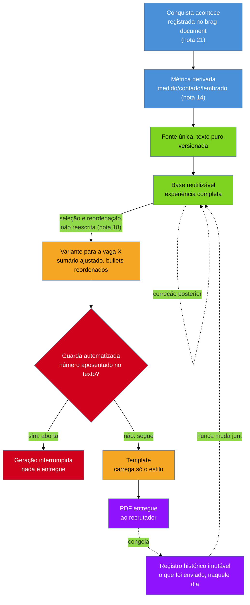

# O currículo como pipeline

> [!abstract] TL;DR
> A [[03-Dominios/Carreira/Currículo/14 - Números que você pode defender|nota 14]] já registrou o sintoma: o mesmo fato profissional, descrito em **seis redações divergentes**, espalhado por dezessete arquivos diferentes, sem que nenhuma das seis estivesse marcada como a versão correta. Esta nota trata da causa e da cura. A causa é tratar o currículo como **arquivo solto** — um documento que existe uma vez, é editado no lugar a cada vaga nova, e cuja história inteira vive só na memória de quem o edita. A cura não é mais disciplina; é um **sistema** que resolve por construção o que a disciplina individual só resolve por esforço — e esforço não escala, nem sobrevive ao cansaço de uma busca de emprego longa. O sistema tem quatro peças: uma **fonte única em texto puro e versionada**, de onde tudo deriva; a separação entre **base reutilizável** e **variante por vaga**, gerada a partir da base, não editada paralelamente a ela; um **template que carrega só o estilo**, nunca o conteúdo; e **guardas automatizadas**, que impedem por construção o erro que a disciplina, sozinha, deixaria passar mais cedo ou mais tarde. A peça mais contraintuitiva do sistema, e a que mais rende quando entendida, é que a **variante enviada é registro histórico e imutável** — corrigir um dado depois exige tocar vários arquivos, e os currículos já enviados continuam com os números antigos, por desenho, não por descuido. A nota fecha com a versão honesta do princípio para quem não tem interesse nenhum em ferramenta de linha de comando: um arquivo, um lugar só onde os números vivem, e um registro do que mudou — e quem para nessa versão não está fazendo currículo de segunda categoria, está resolvendo o mesmo problema central com o ferramental que já tem.

## A tese: arquivo solto produz redação divergente

A nota 14 descreveu, no meio de uma seção sobre números aposentados, um achado que merece ser reaberto aqui com mais tempo, porque ele é o ponto de partida desta nota inteira: uma auditoria sobre o próprio material de currículo do autor deste vault encontrou "o mesmo fato profissional descrito em seis redações divergentes, espalhadas por dezessete arquivos diferentes", cada uma com um número ligeiramente diferente para a mesma realização, sem que nenhuma das seis estivesse marcada como a versão correta ou como a versão morta. Vale parar um segundo nesse número antes de seguir: não são seis erros de digitação isolados, cada um explicável por um lapso de atenção num dia ruim. São seis versões de um mesmo fato, coexistindo, sem hierarquia entre elas — o tipo de bagunça que só se acumula quando o processo que produz cada versão nova não sabe da existência das cinco anteriores.

É tentador ler esse achado como descuido pessoal, corrigível com mais atenção da próxima vez. A leitura mais honesta é outra: seis redações divergentes não são o que acontece quando alguém é descuidado — são o que acontece, de forma quase garantida, quando o **processo** de produzir currículo é "abrir o arquivo mais recente, editar no lugar, salvar com um nome novo, repetir", sem visibilidade sobre as outras cópias já espalhadas por pastas de candidaturas antigas. Ninguém decide, num único momento, escrever a mesma conquista de seis jeitos diferentes — cada edição, isoladamente, parecia razoável no dia em que foi feita. O que produz a divergência não é a decisão de nenhuma edição individual; é a ausência de algo que amarre as edições entre si.

Essa é a tese central desta nota, e vale enunciá-la sem rodeio antes de entrar nos componentes: **tratar o currículo como arquivo solto é o que produz as seis redações divergentes da nota 14** — não uma falha de caráter de quem escreve, mas uma propriedade estrutural de qualquer processo em que cada variante nasce de uma cópia isolada da anterior, sem memória compartilhada entre elas. Um sistema resolve, por construção, o que a disciplina individual só resolveria por esforço repetido — lembrar de atualizar todas as cópias, lembrar qual número é o correto, lembrar qual arquivo é o mais recente. E esforço repetido não escala com o tempo nem sobrevive ao cansaço: numa busca de emprego que se estende por semanas, com dezenas de variantes geradas sob pressão de prazo, é exatamente quando a disciplina mais precisaria segurar que ela mais falha, porque a energia para checar manualmente cada número contra as outras variantes já foi consumida pelo próprio processo de candidatura.

O paralelo com o resto do galho vale nomear, porque ele não é acidental. A [[03-Dominios/Carreira/Currículo/21 - O brag document|nota 21]] já resolveu, no plano do hábito individual, um problema estruturalmente parecido: o número deixa de ser **autorado** — reconstruído da memória cada vez que alguém precisa dele — e passa a ser **derivado** de um registro contínuo, escrito perto do momento em que o fato aconteceu. Esta nota aplica a mesma inversão numa escala maior, a do documento inteiro, não só da métrica isolada: o currículo deixa de ser **autorado** de novo a cada vaga — reescrito, ou pelo menos re-decidido, parcialmente do zero, editando uma cópia solta sem visibilidade sobre as outras — e passa a ser **derivado** de uma fonte única, através de um processo repetível. O que a nota 21 fez para a conquista individual, esta nota faz para o documento inteiro: tira a confiabilidade da memória e da disciplina, e coloca num sistema.

## Os quatro componentes, e a razão de cada um existir

Um sistema que resolve o problema da nota 14 não precisa ser complexo — precisa ter as peças certas, cada uma respondendo a uma pergunta específica que o arquivo solto deixa sem resposta. São quatro peças, e vale examinar cada uma pela pergunta que ela responde, não só pelo nome que carrega, porque é a pergunta, não o nome, que decide se uma peça equivalente, construída de outro jeito, ainda cumpre a mesma função.

### Fonte única, em texto puro e versionada

A primeira pergunta que o arquivo solto deixa sem resposta é: **qual cópia é a verdadeira?** Quando o mesmo fato existe em dezessete arquivos, a resposta é "nenhuma delas, com certeza" — cada cópia é uma tentativa isolada de descrever a mesma realidade, e nada no sistema de arquivos comum indica qual delas herda de qual, ou qual foi a última a incorporar uma correção. A resposta estrutural para essa pergunta é ter **uma única fonte** — um único lugar onde o conteúdo do currículo, o texto puro dos fatos, existe — e derivar todo o resto dela, em vez de manter cópias paralelas que precisam ser sincronizadas manualmente.

A [[03-Dominios/Carreira/Currículo/05 - Formato e legibilidade de máquina|nota 05]] já descreveu, no caso real sobre o próprio pipeline do autor deste vault, que o conteúdo vive "como texto em Markdown, um formato de texto puro sem nenhuma das ambiguidades de layout" que aquela nota trata inteira. Vale explicar aqui por que o texto puro é a escolha certa para essa fonte, e não só preferência de quem gosta de linha de comando. Um arquivo de texto puro é **legível em qualquer editor**, de qualquer época, sem depender de uma versão específica de um programa proprietário que pode deixar de existir — o mesmo arquivo aberto hoje abre igual daqui a dez anos. E, mais importante para o problema desta nota, é **comparável linha a linha**: uma ferramenta de controle de versão, do tipo já mencionado pela [[03-Dominios/Carreira/Currículo/18 - Adaptar por vaga sem reescrever|nota 18]] a respeito do repositório de currículos do autor, mostra exatamente o que mudou entre duas versões do mesmo arquivo — qual linha foi adicionada, qual foi removida, qual número foi trocado por outro — porque o formato é texto simples, sem a camada de formatação binária que um processador de texto embute por baixo.

O efeito prático dessa escolha é duplo. O primeiro é que **o histórico fica legível**: reabrir a fonte única mostra, em ordem cronológica, cada mudança de conteúdo já feita — quando um número foi corrigido, quando uma experiência foi adicionada — sem comparar arquivos manualmente, tentando lembrar qual versão veio antes. O segundo é que **a apresentação se separa do conteúdo**: como a fonte é texto puro, sem fonte, cor ou espaçamento embutido, a decisão visual mora inteiramente na próxima peça deste sistema, o template, e as duas evoluem de forma independente. Trocar a tipografia do currículo inteiro não exige tocar em uma palavra do conteúdo; corrigir um número não arrisca bagunçar o layout.

### Base reutilizável × variante por vaga

A segunda pergunta que o arquivo solto deixa sem resposta é: **quando eu edito esta cópia, estou mudando a verdade sobre minha carreira, ou só ajustando como ela aparece para esta vaga específica?** Sem uma distinção estrutural entre as duas coisas, cada edição mistura os dois tipos de mudança no mesmo lugar — corrigir um número (que deveria valer para toda variante futura) e reordenar um bullet para uma vaga específica (que não deveria) acontecem no mesmo arquivo, pela mesma ação de editar e salvar, sem nenhuma marca que separe uma da outra.

A [[03-Dominios/Carreira/Currículo/18 - Adaptar por vaga sem reescrever|nota 18]] já tratou, em profundidade, o que muda de uma variante para outra dentro do mesmo currículo — o sumário, e a ordem e ênfase dos bullets — e essa nota não repete aqui a fórmula que a 18 já fixou. O que esta nota acrescenta é a peça de desenho que torna essa disciplina sustentável em escala: a **base** é o documento reutilizável, com a experiência completa, os bullets na fórmula que a [[03-Dominios/Carreira/Currículo/11 - A linha de bullet|nota 11]] já descreveu, os números com o nível de confiança que a nota 14 exige — e cada **variante** nasce dela, por um processo repetível, não por uma cópia manual que passa a viver a própria vida em paralelo. A nota 18 já registrou o princípio inverso, que vale relembrar aqui porque as duas metades formam o mesmo mecanismo: "quando um ajuste feito para uma vaga específica se mostra bom em geral (...), ele deixa de ser adaptação e sobe para a base, virando o novo padrão para todas as variantes futuras." A base absorve o que se prova geral; a variante herda o que a base já sabe, sem reconstruir do zero.

Essa separação resolve, sozinha, boa parte do problema da nota 14. Se um número está errado, ele está errado **num lugar só** — na base, ou na peça a seguir — e a correção se propaga, por desenho, para toda variante futura gerada dela, em vez de exigir que alguém se lembre de caçar cada uma das dezessete cópias onde a versão antiga pode ainda estar espalhada. A base é onde a verdade sobre a carreira mora; a variante é uma renderização específica dela, feita para um leitor específico, num momento específico — e a diferença entre as duas categorias de mudança, confusa quando tudo vive no mesmo arquivo solto, fica nítida quando cada uma tem seu próprio lugar.

### Template que carrega só o estilo

A terceira pergunta é: **quando eu quero mudar como o currículo se parece, preciso tocar no que ele diz?** Num documento comum, editado diretamente numa ferramenta de formatação, a resposta costuma ser sim — mudar a fonte, o espaçamento, a cor de um destaque exige abrir o mesmo arquivo onde o conteúdo vive, e o risco de uma mudança visual acidentalmente arrastar uma mudança de conteúdo junto — ou vice-versa — é real, porque as duas coisas coexistem no mesmo objeto.

A resposta estrutural, já citada de passagem pela nota 05 no caso real sobre o pipeline do autor deste vault, é um **template que carrega só o estilo** — um arquivo-modelo com os nomes de estilo (título, subtítulo, corpo, ênfase) já definidos, sem nenhum conteúdo próprio dentro dele, para o qual o conteúdo da fonte única é encaminhado na hora de gerar o documento final. A nota 05 já descreveu a ferramenta usada nesse encaminhamento — `pandoc`, com a opção `--reference-doc` apontando para esse arquivo-modelo — e esta nota não repete o detalhe técnico daquela descrição; o que importa aqui é o princípio, não a implementação: **o estilo é uma propriedade do template, nunca do conteúdo**, e trocar um pelo outro nunca deveria exigir tocar no outro.

O efeito prático é que os dois eixos de variação do sistema inteiro — o que o currículo diz, e como ele se parece — passam a evoluir de forma independente. Uma correção de conteúdo, feita na fonte única, nunca corre o risco de arrastar junto uma mudança visual não intencional. E uma mudança de estilo — ajustar espaçamento, trocar uma fonte, adotar uma paleta diferente — nunca corre o risco de alterar, por acidente, uma palavra do que está escrito, porque o template, por desenho, não tem onde guardar palavra nenhuma. É a mesma separação entre conteúdo e apresentação que a nota 05 já defendeu como princípio central daquela nota — "formato é problema resolvível por ferramenta, não um talento estético" — aplicada aqui, de novo, num nível acima: não só o layout de uma única página, mas a arquitetura inteira do sistema que produz cada página.

### Guardas automatizadas

A quarta pergunta, e a que a seção seguinte desta nota trata com mais espaço, é a mais desconfortável das quatro: **o que impede um erro já corrigido de voltar a acontecer?** As três peças anteriores resolvem onde a verdade mora e como ela se transforma em documento — mas nenhuma delas, sozinha, impede que um número já sabido como errado, por descuido ou por uma cópia antiga reaberta, entre de novo no texto que está prestes a virar um PDF. Essa é a função da guarda automatizada: uma verificação que roda antes do documento existir, e que **interrompe** o processo quando encontra algo que não deveria estar ali — não um lembrete gentil que a pessoa pode ignorar sob pressão de prazo, mas um bloqueio de fato.

## Variante enviada é registro histórico e imutável

Chega-se, agora, à decisão de desenho mais contraintuitiva deste sistema inteiro, e a que mais rende quando entendida com o peso que merece — o suficiente para justificar uma seção própria, separada da lista de componentes, porque ela não é uma peça a mais; é uma regra que governa como as peças anteriores se comportam depois que uma variante já saiu das mãos de quem a gerou.

A regra é curta de enunciar: **uma variante, uma vez gerada e enviada para uma vaga, nunca é editada de novo.** Ela vira um registro fixo daquele momento específico — o sumário que estava naquela versão, a ordem de bullets daquela versão, os números daquela versão, exatamente como um recrutador ou um sistema de triagem os recebeu. Se a base muda depois — um número é corrigido, um bullet é reformulado, uma experiência nova é adicionada —, a variante já enviada **não muda junto**. Ela continua exatamente como estava no dia em que saiu, congelada, mesmo que a fonte da qual ela nasceu já tenha seguido em frente.

Por que essa regra importa: reabrir a pasta de uma vaga específica, um ano depois — porque o processo reabriu, porque um recrutador voltou a entrar em contato — precisa mostrar **exatamente o que o recrutador recebeu naquele momento**, não uma reconstrução que mudou junto com a base ao longo do ano seguinte. Um sistema que regenerasse silenciosamente a variante antiga a cada mudança da base produziria algo pior do que a bagunça original das seis redações divergentes: a **ilusão** de um histórico confiável, enquanto nenhuma versão passada sobrevive intacta — toda reconstrução do passado estaria, sem avisar ninguém, contaminada pelo presente.

> [!example] Caso fictício
> Rafael Duarte, desenvolvedor pleno já apresentado em notas anteriores deste galho, reabre a pasta de uma candidatura de quase um ano atrás, depois de um recrutador daquela mesma empresa entrar em contato de novo para uma vaga diferente, perguntando se o material que ele havia enviado continuava atualizado. Rafael abre o PDF que enviou naquela época — não a base atual do seu currículo, que já incorporou, desde então, a correção de um número que ele havia descrito, na época, como uma redução de "cerca de 95%" no tempo de deploy, e que ele mesmo, seguindo o mesmo processo de checagem que a [[03-Dominios/Carreira/Currículo/14 - Números que você pode defender|nota 14]] descreve, corrigiu depois para o par de números bruto, sem o percentual inflado. O PDF antigo, que ele abre para relembrar o que disse, ainda mostra o percentual de 95% — porque é exatamente o que o recrutador recebeu naquele dia, e é exatamente o que Rafael precisa ver de volta para saber com que versão de si mesmo ele está prestes a falar de novo. Se ele encontrasse, em vez disso, uma variante já silenciosamente corrigida para bater com a base atual, teria a falsa impressão de que nunca escreveu o percentual inflado — e responderia à conversa seguinte sem saber que precisa, possivelmente, explicar por que o número mudou entre uma candidatura e outra.

O custo dessa regra é real, e vale nomeá-lo sem meio-termo, porque uma nota que só apontasse o benefício e escondesse o preço estaria sendo desonesta sobre o próprio desenho que defende. **Corrigir um dado factual exige tocar N arquivos** — a base, mais cada variante ativa que já incorporou aquele dado antes da correção — e os currículos **já enviados permanecem com os números antigos**, mesmo depois de a correção acontecer em todo o resto do sistema. Não existe um botão que propague a correção retroativamente para o passado; o passado, por desenho, está fechado.

É esse ponto que vale marcar com mais força ainda: **isso é desenho, não descuido.** A tentação de tratar a imutabilidade como uma limitação a corrigir — "por que não simplesmente atualizar tudo automaticamente?" — ignora a razão pela qual a regra existe. Um documento já em mãos de terceiros — um recrutador, um sistema de triagem, um gestor que salvou uma cópia — não pode ser reescrito retroativamente sem que a pessoa que o gerou perca a capacidade de saber, com certeza, o que disse. Se a variante fosse regenerada silenciosamente a cada correção da base, o histórico deixaria de ser um registro do que aconteceu e passaria a ser uma projeção contínua do presente sobre o passado — e reabrir uma pasta de vaga antiga não distinguiria mais o que foi de fato enviado do que a base, hoje, diria se fosse gerada de novo. A imutabilidade não é falta de engenharia melhor; é a única forma de o sistema continuar respondendo, com confiança, à pergunta "o que eu disse para esta empresa, naquele momento?" — pergunta que só fica mais importante à medida que o número de variantes ativas cresce, tema que a seção sobre variação por nível, mais adiante, retoma.

Vale conectar esse ponto ao registro de números aposentados que a nota 14 já introduziu, porque as duas peças resolvem problemas vizinhos, mas distintos. O registro de números aposentados existe para impedir que um valor já corrigido **volte a circular numa variante nova** — olha para a frente. A imutabilidade da variante enviada olha para trás — não impede nada de ser gerado; impede que o que **já foi entregue** seja silenciosamente reescrito depois do fato. Juntas, cobrem o ciclo inteiro: a guarda, tratada na próxima seção, impede o número morto de entrar numa variante nova; a imutabilidade garante que, uma vez que uma variante saiu, ela permanece um retrato fiel daquele momento, para sempre.

## Guarda que falha em silêncio não é guarda

A quarta peça do sistema — a guarda automatizada — só cumpre sua função se ela de fato **bloqueia**, e não apenas sinaliza, o problema que existe para prevenir. E há uma armadilha específica, descoberta na prática pelo próprio autor deste vault, que vale examinar com todo o cuidado que ela merece, porque ela generaliza para além do caso específico que a originou.

> [!example] Caso real
> O autor deste vault mantém uma verificação automatizada que **aborta a geração do currículo** quando um número já aposentado — um valor descoberto como frágil ou corrigido, do tipo que a [[03-Dominios/Carreira/Currículo/14 - Números que você pode defender|nota 14]] já descreveu em detalhe — aparece no texto que está prestes a virar documento final. Em algum momento da manutenção desse sistema, essa mesma verificação **podia se desligar sozinha, sem aviso nenhum**, quando uma dependência externa da qual ela precisava para rodar não estava disponível: o script simplesmente deixava de executar, e o documento era gerado normalmente, como se a checagem tivesse passado. Isso foi tratado, deliberadamente, como um **defeito a corrigir**, com a mesma prioridade de um bug funcional — não como um detalhe de operação sem importância.

Vale nomear por que esse defeito merece o peso que o caso real lhe dá, e não a leitura mais confortável de "foi só um problema de infraestrutura". Uma guarda cujo único trabalho é impedir que um número errado chegue a um recrutador não pode desistir em silêncio na ausência de uma dependência — o custo de uma guarda que falha aberta não é "o mesmo de não ter guarda nenhuma"; é **pior**. Quem sabe que não tem guarda checa manualmente, com atenção redobrada, porque sabe que está sozinho. Quem acredita ter uma guarda funcionando, sem saber que ela parou de rodar em silêncio, não checa nada — delegou a checagem ao sistema, e o sistema deu a impressão de tê-la feito. É a mesma dinâmica que a nota 14 já descreveu para o percentual de falsa precisão: uma aparência de rigor que, por dentro, esconde exatamente a fragilidade que prometia ter eliminado.

Esse é o princípio que vale generalizar para além do exemplo, porque não é exclusivo de currículo: **uma guarda que falha em silêncio não é uma guarda — é um placebo de guarda**, que produz o pior dos dois mundos. Nenhuma verificação existir pelo menos deixa quem depende do processo ciente do próprio risco. Uma verificação que existe, mas pode se desligar sem avisar, retira essa consciência, sem retirar o risco junto. A correção certa nunca é "rodar quando possível, seguir sem ela quando não for" — é fazer da **ausência** da verificação, ela mesma, motivo suficiente para bloquear tudo o que dependeria dela. Uma guarda séria falha **fechada**, não aberta: na dúvida sobre se a checagem rodou de verdade, o processo para, em vez de seguir adiante assumindo que passou.

## A escala honesta — a versão sem ferramental nenhum

Tudo o que esta nota descreveu até aqui — fonte em texto puro, template separado do conteúdo, ferramenta de conversão, guarda automatizada que aborta a geração — descreve um sistema com peças móveis reais, do tipo que só compensa construir depois que o problema que ele resolve já apareceu de verdade. E seria desonesto fechar esta nota sem dizer, com toda clareza, que **nada disso é pré-requisito** para resolver o problema central que a tese abriu esta nota descrevendo.

O leitor iniciante — quem está escrevendo o segundo ou o terceiro currículo da vida, sem nenhum interesse em aprender uma ferramenta de linha de comando, sem repositório versionado de código nenhum, sem script de checagem nenhum — **não precisa de nada disso** para deixar de produzir seis redações divergentes do mesmo fato. O que resolve o problema central não é o ferramental; é o princípio por trás dele, e o princípio cabe numa versão bem menor do sistema.

A versão mínima do mesmo princípio tem três peças, cada uma o correspondente em miniatura de uma peça descrita acima. A primeira é **um arquivo-fonte só**: um único documento — texto simples ou processador de texto comum — que contém a versão mais completa e atual de tudo o que a pessoa quer que o currículo diga, e do qual toda variante é derivada — copiada e ajustada, não editada em paralelo desde o início. A segunda é **um lugar só onde os números vivem**: dentro desse mesmo arquivo, ou num segundo arquivo pequeno dedicado a isso, uma lista dos números que aparecem no currículo, com a origem de cada um — o selo de procedência que a nota 14 já ensinou, medido, contado ou lembrado — de forma que, quando um número precisar ser corrigido, exista um único lugar para procurar. A terceira é **um registro do que mudou e quando**: algumas linhas, no topo ou no fim do arquivo, anotando data e mudança — "12/03: corrigido o tempo de deploy, de 95% de redução (impreciso) para o par de números bruto" — o suficiente para reconstruir, meses depois, por que uma versão diverge de outra, sem depender da memória.

Vale dizer isso de forma explícita, porque é fácil, depois de ler uma nota sobre pipeline com template e guarda automatizada, concluir por engano que a versão sem ferramental é inferior, uma concessão a quem "ainda não chegou lá": **quem para nessa versão não está fazendo currículo de segunda categoria.** Ela já resolve o problema central desta nota — ter uma fonte da verdade, em vez de cópias soltas competindo entre si. O que o ferramental descrito nas seções anteriores acrescenta não é o princípio — é **escala**: a capacidade de manter o mesmo princípio funcionando sem esforço extra quando o número de variantes ativas cresce de duas ou três para uma dezena, e checar manualmente cada correção volta a ser o tipo de esforço que não sobrevive ao cansaço de uma busca de emprego longa. O ferramental é **otimização, não requisito** — distinção que a próxima seção desenvolve com mais detalhe.

O diagrama fixa o que a prosa acima descreveu em partes: a conquista entra no sistema pelo brag document da nota 21, já derivada e não autorada; sobe até a fonte única; passa pela base, que absorve o que se prova geral; vira variante por seleção e reordenação, nunca por reescrita; e só chega ao PDF depois de passar por uma guarda que pode interromper tudo, não só avisar. A seta pontilhada de volta da base para ela mesma marca a correção contínua que o sistema espera e absorve sem esforço; a seta pontilhada entre o registro e a base marca exatamente o oposto — a correção **não** volta a alcançar o que já foi entregue, porque o registro, uma vez congelado, parou de escutar o que acontece com a fonte dali em diante.

## Casos práticos

> [!example] Caso real
> A [[03-Dominios/Carreira/Currículo/14 - Números que você pode defender|nota 14]] já registrou o tamanho concreto do problema que esta nota resolve: uma auditoria sobre o próprio material de currículo do autor deste vault encontrou o mesmo fato profissional descrito em **seis redações divergentes**, espalhadas por **dezessete arquivos diferentes**, sem que nenhuma delas estivesse marcada como a versão correta. Dezessete arquivos para um fato só é a medida concreta do custo do arquivo solto: dezessete lugares onde uma correção precisaria ser lembrada e aplicada à mão, sem nenhum deles sabendo da existência dos outros dezesseis. Foi esse achado, não uma preferência abstrata por engenharia, que motivou o sistema descrito nesta nota.

> [!example] Caso fictício
> Bianca Torres, desenvolvedora backend pleno já apresentada em notas anteriores deste galho, é a mesma Bianca que a [[03-Dominios/Carreira/Currículo/21 - O brag document|nota 21]] descreveu mantendo, havia dois anos, um arquivo de texto onde registra uma linha por conquista no dia em que ela acontece. Ao perceber que mantinha três variantes de currículo como cópias soltas, sem nenhuma delas sabendo da existência das outras, Bianca não constrói nenhum pipeline com ferramenta de linha de comando — aplica a versão mínima desta nota dentro do mesmo hábito que já sustenta há dois anos. No mesmo arquivo, abre duas seções novas: "Números atuais", com cada métrica e sua origem no vocabulário da nota 14; e "Histórico de correções", com data e o que mudou. As três variantes continuam sendo três arquivos separados, mas agora todas apontam para a mesma seção de números, em vez de cada uma carregar sua própria cópia.

## Variação por nível

A necessidade de um sistema como este não nasce no primeiro currículo que alguém escreve — ela cresce junto com o volume de variantes ativas e com o tempo que separa uma vaga da próxima, e vale nomear com honestidade em que ponto da escada que a [[03-Dominios/Carreira/Currículo/03 - Os seis níveis e o que muda entre eles|nota 03]] já descreveu essa necessidade de fato aparece.

Quem tem **duas experiências profissionais** — um estagiário, um trainee, um júnior recém-formado — não precisa de pipeline nenhum. A base inteira do currículo cabe, sem esforço, na cabeça de quem a escreve: são poucos fatos, poucos números, e a distância entre a primeira versão e a mais recente costuma ser pequena o bastante para que revisar manualmente, antes de cada envio, seja um trabalho de minutos, não de risco real de divergência. Construir uma fonte única versionada, um template e uma guarda automatizada nesse momento é esforço desproporcional ao problema que existe — o tipo de engenharia que resolve um risco que ainda não apareceu, às custas de tempo que poderia ir para escrever bullets melhores, no espírito das notas 11 a 13.

Quem tem **quinze anos de carreira e cinco variantes ativas ao mesmo tempo** — cada uma adaptada a um tipo diferente de vaga que está sendo perseguida em paralelo, cada uma com seu próprio histórico de correções e ajustes — já não consegue mais confiar na própria memória para saber o que cada versão diz, e é exatamente nesse ponto que o sistema completo, ou pelo menos a versão honesta dele descrita na seção anterior, deixa de ser luxo e passa a ser necessidade. O ponto de virada não é uma contagem exata de anos nem um número mágico de variantes — é **o momento em que você deixa de conseguir lembrar o que cada versão diz**, sem abrir o arquivo para conferir. Enquanto a memória ainda dá conta — enquanto é possível responder, sem checar, "a variante para vagas de backend enfatiza o projeto de migração, a variante para vagas de liderança técnica enfatiza o mentoring" —, o sistema completo continua sendo opcional. No instante em que essa pergunta exige abrir três arquivos diferentes para responder com segurança, o custo de não ter uma fonte única já superou, de longe, o custo de construí-la.

## Armadilhas comuns

> [!warning] Editar a variante diretamente, em vez de regenerá-la a partir da base
> **O que acontece:** depois de gerar uma variante para uma vaga específica, a pessoa percebe um pequeno ajuste que gostaria de fazer — trocar uma palavra, corrigir um espaçamento — e edita o arquivo da variante diretamente, sem levar essa mudança de volta para a base ou para a fonte única. **Por quê:** editar o arquivo que já está aberto na tela parece mais rápido do que voltar à fonte, fazer o ajuste lá, e regenerar a variante — e para um ajuste pequeno o atalho parece inofensivo. **Como evitar:** tratar toda variante como saída de um processo, nunca como um documento editável por si só — se o ajuste vale a pena, ele vale a pena na fonte, de onde se propaga para toda variante futura; se não vale a pena na fonte, provavelmente também não vale editar só naquela variante isolada, escondido de qualquer registro.

> [!warning] Achar que a base pode "corrigir" retroativamente uma variante já enviada
> **O que acontece:** ao corrigir um número na base, a pessoa sente o impulso de também atualizar as cópias já enviadas em candidaturas anteriores — reabrindo o PDF de uma vaga de meses atrás e trocando o número antigo pelo novo, para que "tudo fique consistente". **Por quê:** a inconsistência entre uma variante antiga e a base atual parece um erro a corrigir, no mesmo espírito que corrigir qualquer outro dado errado. **Como evitar:** lembrar a seção sobre imutabilidade desta nota — a variante enviada é um registro do que foi dito, não um espelho contínuo da base; reescrevê-la depois do fato destrói exatamente a propriedade que a torna útil como registro, e o lugar certo para a correção é o registro de números aposentados já descrito pela [[03-Dominios/Carreira/Currículo/14 - Números que você pode defender|nota 14]], não o documento já entregue.

> [!warning] Construir o sistema completo antes de precisar dele
> **O que acontece:** motivado pela descrição do pipeline com fonte versionada, template e guarda automatizada, alguém no início da carreira, com poucas variantes ativas, investe tempo significativo montando o ferramental completo antes de ter o volume de currículos que o justificaria. **Por quê:** o sistema descrito nesta nota soa mais rigoroso, mais "profissional", do que a versão mínima com um arquivo e um changelog — e a tentação de construir a versão completa direto, pulando a versão honesta, é real. **Como evitar:** aplicar o critério da seção sobre variação por nível — o sistema completo compensa quando a memória já não dá conta de saber o que cada variante diz; antes disso, a versão mínima resolve o mesmo problema central com uma fração do esforço, e o tempo economizado serve melhor ao conteúdo do currículo do que ao ferramental que o produz.

## Como soa em inglês

> "I don't keep my résumé as a single file I edit in place every time I apply somewhere. The content lives in one plain-text source, versioned, so every change is a diff I can actually read later. From that source, I keep one reusable base and generate per-role variants from it — I only touch the summary and the order of recent bullets, never rewrite the underlying facts. A template handles the visual styling separately, so changing how the document looks never risks touching what it says. And before any variant is generated, an automated check aborts the whole process if a retired number — one I've already found to be wrong or overstated — shows up in the text. The part people find counterintuitive: once a variant has actually gone out to an employer, it's frozen. I don't rewrite it when the base changes later, because a document already sitting in someone else's hands can't be silently rewritten without me losing track of what I actually told them."

| PT | EN |
| --- | --- |
| currículo como pipeline | résumé as a pipeline |
| fonte única | single source of truth |
| base reutilizável | reusable base |
| variante por vaga | per-role variant |
| template de estilo | style template |
| guarda automatizada | automated guard |
| registro histórico imutável | immutable historical record |
| falhar em silêncio | fail silently |
| falhar fechado | fail closed |
| versão mínima viável | minimum viable version |

## O que vem a seguir

Fixado o sistema que transforma o material bruto do brag document em documento pronto para enviar, respeitando o registro imutável do que já foi entregue, o galho segue para o par de artefatos que vive fora do PDF — mas que precisa da mesma disciplina de fonte única para não repetir, num lugar diferente, a mesma bagunça das seis redações divergentes:

- [[03-Dominios/Carreira/Currículo/23 - LinkedIn — o par que responde a busca|23 - LinkedIn — o par que responde a busca]] — o perfil que precisa da mesma verdade do currículo, escrita para um leitor e um mecanismo de busca diferentes.

## Veja também

- [[03-Dominios/Carreira/Currículo/index|Currículo]] — o índice do galho, com a tese e o mapa das 26 notas.
- [[03-Dominios/Carreira/Currículo/14 - Números que você pode defender|14 - Números que você pode defender]] — a origem do achado das seis redações divergentes que esta nota resolve, e o registro de números aposentados que a guarda automatizada desta nota impede de voltar a circular.
- [[03-Dominios/Carreira/Currículo/21 - O brag document|21 - O brag document]] — o registro contínuo que alimenta a fonte única deste pipeline com métrica já derivada, não autorada.
- [[03-Dominios/Carreira/Currículo/18 - Adaptar por vaga sem reescrever|18 - Adaptar por vaga sem reescrever]] — a adaptação cirúrgica entre base e variante que esta nota formaliza como componente de sistema, e o gancho já feito ali sobre a variante como registro histórico.
- [[03-Dominios/Carreira/Currículo/05 - Formato e legibilidade de máquina|05 - Formato e legibilidade de máquina]] — o pipeline de geração citado ali de passagem, tratado aqui em profundidade: fonte única, base e variante, template e guarda.
- [[03-Dominios/Carreira/Currículo/20 - A âncora|20 - A âncora]] — a posição estável da qual a base deste pipeline deriva, e que a variante nunca deveria reescrever, só reordenar.
- [[03-Dominios/Carreira/Entrevistas/index|Entrevistas]] — o galho parceiro: a mesma disciplina de fonte única e número com procedência conhecida é o que sustenta, sem hesitação, a resposta a "como você mediu isso?" numa entrevista de acompanhamento.

## Fontes

- O sistema privado de geração de currículo do autor deste vault — fonte em Markdown, conversão via `pandoc` com `--reference-doc`, e a guarda automatizada contra números aposentados — é ferramental privado, sem repositório público disponível para verificação externa, no mesmo padrão de fonte já estabelecido pelas notas [[03-Dominios/Carreira/Currículo/05 - Formato e legibilidade de máquina|05]], [[03-Dominios/Carreira/Currículo/18 - Adaptar por vaga sem reescrever|18]] e [[03-Dominios/Carreira/Currículo/20 - A âncora|20]]. Esta nota não afirma nem infere nenhum detalhe de implementação além do que essas notas já descreveram.
- O achado das seis redações divergentes em dezessete arquivos, e o defeito da guarda que podia se desligar sozinha na ausência de uma dependência, são o mesmo caso real já registrado pela [[03-Dominios/Carreira/Currículo/14 - Números que você pode defender|nota 14]]; esta nota reusa os mesmos fatos, sem acrescentar detalhe novo não verificado ali.
- **Julia Evans** — [Get your work recognized: write a brag document](https://jvns.ca/blog/brag-documents/), publicado em 28 de junho de 2019, já citada pela [[03-Dominios/Carreira/Currículo/21 - O brag document|nota 21]]. Reusada aqui como fonte da inversão "autorado → derivado" que a nota 21 aplica ao registro individual e que esta nota estende ao documento inteiro.
- Bianca Torres é persona fictícia já estabelecida em notas anteriores deste galho, reutilizada aqui com os mesmos fatos canônicos já fixados sobre ela — desenvolvedora backend de nível pleno.
- Rafael Duarte é persona fictícia já estabelecida em notas anteriores deste galho, reutilizada aqui com os mesmos fatos canônicos já fixados sobre ele — desenvolvedor de nível pleno.
