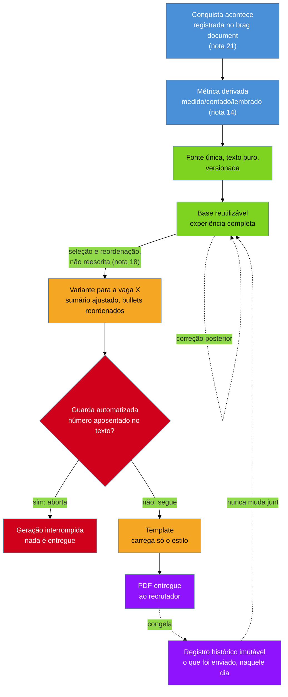

# O currículo como pipeline

> [!abstract] TL;DR
> Uma auditoria no material de currículo do autor deste vault encontrou o mesmo fato profissional escrito de **seis maneiras divergentes**, espalhado por **dezessete arquivos**, sem que nenhuma das seis estivesse marcada como a correta. Isso não é descuido — é o resultado garantido de um processo: abrir o arquivo mais recente, editar no lugar, salvar com nome novo, repetir. Ninguém decide escrever a mesma conquista de seis jeitos; cada edição parecia razoável no dia em que foi feita. Falta algo que amarre as edições entre si, e esse algo é um **sistema**, não mais disciplina — porque disciplina não escala nem sobrevive ao cansaço de uma busca de emprego longa. Quatro peças, cada uma respondendo a uma pergunta que o arquivo solto deixa em aberto: **fonte única** em texto puro e versionada (*qual cópia é a verdadeira?*), separação entre **base e variante** (*estou mudando a verdade ou só o enquadramento?*), **template só com estilo** (*mudar a aparência exige tocar no conteúdo?*) e **guardas automatizadas** (*o que impede um erro já corrigido de voltar?*). Duas regras carregam o resto. A variante enviada é **registro imutável**: o que saiu não é editado depois, e os currículos já entregues continuam com os números antigos, **por desenho** — corrigir o passado destruiria a única coisa que permite saber o que você disse a cada empresa. E uma **guarda que falha em silêncio é pior que guarda nenhuma**, porque quem sabe que não tem proteção confere manualmente; quem acha que tem, não confere nada. Fecha com a versão honesta para quem não quer ferramental algum — um arquivo, um lugar só onde os números vivem, um registro do que mudou —, que resolve o mesmo problema central e não é currículo de segunda categoria.

## Seis versões do mesmo dia de trabalho

A auditoria começou por um motivo banal: conferir se um número estava certo antes de mandar um currículo.

O número era sobre automação de deploy — algo que tinha, de fato, acontecido, e que o autor deste vault lembrava bem. O que ele não lembrava era qual das versões daquele fato era a verdadeira. Porque, ao procurar, apareceram seis.

Seis redações diferentes da mesma conquista. Números ligeiramente diferentes em cada uma. Espalhadas por **dezessete arquivos** — variantes de currículo, rascunhos, pastas de candidaturas antigas, anotações. Nenhuma delas marcada como a versão correta. Nenhuma marcada como morta.

Pare um segundo nesse número antes de seguir, porque ele é o argumento inteiro desta nota. Não são seis erros de digitação, cada um explicável por um dia ruim. São seis versões de um mesmo fato coexistindo, sem hierarquia entre si, cada uma tão plausível quanto as outras cinco.

E o pior não foi descobrir a divergência. Foi a pergunta seguinte, que a divergência tornou impossível de responder: **qual dessas eu mandei para cada empresa?**

## Não foi descuido — foi o processo

A leitura confortável desse achado é que alguém foi descuidado e precisa de mais atenção da próxima vez. É a leitura errada, e insistir nela garante que o problema volte.

Seis redações divergentes não são o que acontece quando alguém é desleixado. São o que acontece, de forma quase garantida, quando o **processo** de produzir currículo é *abrir o arquivo mais recente, editar no lugar, salvar com um nome novo, repetir* — sem nenhuma visibilidade sobre as outras cópias já espalhadas por pastas de candidaturas antigas.

Ninguém decide, num único momento, escrever a mesma conquista de seis jeitos. Cada edição, isolada, parecia razoável no dia em que foi feita. O que produz a divergência não é nenhuma decisão individual — é a **ausência de qualquer coisa que amarre as edições entre si**.

Daí a tese, sem rodeio: **arquivo solto produz redação divergente.** Não é falha de caráter de quem escreve. É propriedade estrutural de qualquer processo em que cada variante nasce de uma cópia isolada da anterior, sem memória compartilhada.

E é por isso que a cura não é "ter mais disciplina". Um sistema resolve por construção o que a disciplina só resolve por esforço repetido — lembrar de atualizar todas as cópias, lembrar qual número é o certo, lembrar qual arquivo é o mais recente. Esforço repetido não escala com o tempo e não sobrevive ao cansaço. Numa busca de emprego que se arrasta por semanas, com dezenas de variantes geradas sob prazo, é exatamente quando a disciplina mais precisaria segurar que ela mais falha — porque a energia para conferir cada número já foi consumida pelo próprio processo de se candidatar.

> [!question]- Isso não é engenharia demais para um documento de duas páginas?
> Seria, se o problema fosse o documento. Não é: o problema é o **conjunto** de documentos que uma carreira produz ao longo dos anos, e a impossibilidade de responder, depois, o que cada um deles dizia. Repare que a [[03-Dominios/Carreira/Currículo/21 - O brag document|nota 21]] já resolveu um problema estruturalmente idêntico numa escala menor: o número deixa de ser **autorado** — reconstruído de memória cada vez que alguém precisa dele — e passa a ser **derivado** de um registro contínuo, escrito perto do momento em que o fato aconteceu. Esta é a mesma inversão, aplicada ao documento inteiro em vez de à métrica isolada. O currículo para de ser reautorado a cada vaga e passa a ser derivado de uma fonte única.

## Quatro perguntas que o arquivo solto não responde

O sistema não precisa ser complexo. Precisa ter as peças certas — e o jeito de saber se uma peça é necessária é olhar para a pergunta que ela responde, não para o nome que ela carrega. É a pergunta, não o nome, que decide se um equivalente construído de outro jeito ainda cumpre a função.

### *Qual cópia é a verdadeira?* → fonte única, em texto puro e versionada

Quando o mesmo fato existe em dezessete arquivos, a resposta honesta é "nenhuma, com certeza". Cada cópia é uma tentativa isolada de descrever a mesma realidade, e nada no sistema de arquivos comum diz qual herda de qual, ou qual foi a última a receber uma correção.

A resposta estrutural é ter **um único lugar** onde o conteúdo existe, e derivar todo o resto dele — em vez de manter cópias paralelas que alguém precisa sincronizar de cabeça.

O texto puro não é preferência de quem gosta de terminal; ele resolve duas coisas específicas. Primeiro, é **legível em qualquer editor, de qualquer época** — o arquivo que abre hoje abre igual daqui a dez anos, sem depender de um programa proprietário continuar existindo. Segundo, e mais importante aqui, é **comparável linha a linha**: uma ferramenta de controle de versão mostra exatamente o que mudou entre duas versões — qual linha entrou, qual saiu, qual número virou outro — porque não há camada de formatação binária escondendo a diferença.

O efeito é duplo. O histórico fica legível: dá para ver, em ordem, quando um número foi corrigido e quando uma experiência entrou, sem comparar arquivos de memória. E a apresentação se separa do conteúdo — como a fonte não carrega fonte tipográfica, cor nem espaçamento, a decisão visual mora inteiramente na terceira peça. Trocar a tipografia do documento inteiro não exige tocar numa palavra; corrigir um número não arrisca bagunçar o layout.

### *Estou mudando a verdade ou só o enquadramento?* → base × variante

Sem uma distinção estrutural entre as duas coisas, cada edição mistura os dois tipos de mudança no mesmo lugar. Corrigir um número — que deveria valer para toda variante futura — e reordenar um bullet para uma vaga específica — que não deveria — acontecem no mesmo arquivo, pela mesma ação de salvar, sem nenhuma marca separando um do outro.

A [[03-Dominios/Carreira/Currículo/18 - Adaptar por vaga sem reescrever|nota 18]] já tratou o que muda entre variantes: o sumário, e a ordem e ênfase dos bullets. O que entra aqui é o desenho que torna aquela disciplina sustentável em escala. A **base** é o documento reutilizável, com a experiência completa e os números com procedência conhecida. Cada **variante** nasce dela por um processo repetível — não por uma cópia manual que passa a viver a própria vida em paralelo.

E o fluxo é de mão dupla, como a nota 18 já registrou pelo outro lado: quando um ajuste feito para uma vaga se prova bom em geral, ele **sobe para a base** e vira o padrão das próximas. A base absorve o que se generaliza; a variante herda o que a base já sabe.

Isso sozinho resolve boa parte do problema da auditoria. Se um número está errado, ele está errado **num lugar só**, e a correção se propaga por desenho para toda variante futura — em vez de exigir que alguém se lembre de caçar dezessete cópias.

### *Mudar a aparência exige tocar no conteúdo?* → template só com estilo

Num documento editado direto num processador de texto, a resposta costuma ser sim. Mudar fonte, espaçamento ou cor exige abrir o mesmo arquivo onde o conteúdo mora, e o risco de uma mudança visual arrastar junto uma mudança de texto — ou o contrário — é real, porque as duas coisas vivem no mesmo objeto.

A resposta estrutural é um **arquivo-modelo que carrega só os nomes de estilo** — título, subtítulo, corpo, ênfase — sem conteúdo próprio nenhum, para o qual o texto da fonte única é encaminhado na hora de gerar o documento final. A [[03-Dominios/Carreira/Currículo/05 - Formato e legibilidade de máquina|nota 05]] descreve a ferramenta concreta desse encaminhamento; o que importa aqui é o princípio: **o estilo é propriedade do template, nunca do conteúdo.**

O efeito é que os dois eixos passam a evoluir sozinhos. Uma correção de conteúdo nunca arrasta uma mudança visual. E uma mudança de estilo nunca altera uma palavra por acidente — porque o template, por desenho, não tem onde guardar palavra nenhuma.

### *O que impede um erro já corrigido de voltar?* → guardas automatizadas

As três peças anteriores dizem onde a verdade mora e como ela vira documento. Nenhuma delas impede que um número já sabidamente errado — por descuido, por uma cópia antiga reaberta — entre de novo no texto que está prestes a virar PDF.

Essa é a função da guarda: uma verificação que roda **antes** de o documento existir e que **interrompe** o processo quando encontra o que não deveria estar ali. Não um aviso gentil que dá para ignorar sob prazo. Um bloqueio.

É a peça mais fácil de fazer errado, e ela tem uma seção só para ela mais adiante.

## A regra que parece errada: o que saiu, saiu

Chegamos à decisão de desenho mais contraintuitiva do sistema — e à que mais rende quando entendida.

A regra é curta: **uma variante, depois de gerada e enviada, nunca é editada de novo.**

Ela vira um registro fixo daquele momento. O sumário daquela versão, a ordem de bullets daquela versão, os números daquela versão, exatamente como o recrutador recebeu. Se a base mudar depois — um número corrigido, um bullet reformulado, uma experiência nova —, a variante já enviada **não muda junto**. Fica congelada, mesmo que a fonte de onde ela nasceu tenha seguido em frente.

Parece um defeito. É a peça que torna o sistema confiável.

Reabrir a pasta de uma vaga um ano depois — porque o processo reabriu, porque o recrutador voltou — precisa mostrar **exatamente o que aquela empresa recebeu**, não uma reconstrução que foi mudando junto com a base ao longo do ano. Um sistema que regenerasse a variante antiga a cada mudança produziria algo pior que a bagunça original: a **ilusão** de um histórico confiável, em que nenhuma versão passada sobrevive intacta e toda reconstrução do passado está silenciosamente contaminada pelo presente.

> [!example] Caso fictício
> Rafael Duarte, desenvolvedor pleno já apresentado em notas anteriores deste galho, recebe o contato de um recrutador de uma empresa em que se candidatou quase um ano antes, agora para outra vaga, perguntando se o material continua atualizado. Rafael abre o PDF que enviou na época — e lá está, escrito, uma redução de "cerca de 95%" no tempo de deploy. Ele sabe que aquele número não sobreviveu: meses depois, aplicando a checagem que a [[03-Dominios/Carreira/Currículo/14 - Números que você pode defender|nota 14]] descreve, ele mesmo o substituiu pelo par de números bruto, sem o percentual inflado.
>
> Ver o número antigo ali é desconfortável — e é exatamente o que salva a conversa seguinte. Rafael entra na chamada sabendo com que versão de si mesmo aquele recrutador vai falar, e preparado para explicar por que o número mudou, se a pergunta vier. Se, em vez disso, ele tivesse encontrado uma variante já silenciosamente corrigida para bater com a base atual, teria a impressão falsa de nunca ter escrito o percentual inflado — e entraria na conversa cego para a única divergência que importava.

O custo dessa regra é real, e esconder isso seria desonesto sobre o desenho que a nota defende. **Corrigir um dado exige tocar vários arquivos** — a base, mais cada variante ativa que já o incorporou —, e os currículos **já enviados permanecem com os números antigos** para sempre. Não existe botão que propague a correção para o passado. O passado, por desenho, está fechado.

E vale marcar com força: **isso é desenho, não descuido.** A tentação de tratar a imutabilidade como limitação — *"por que não atualizar tudo automaticamente?"* — ignora a razão de ela existir. Um documento já nas mãos de terceiros não pode ser reescrito retroativamente sem que você perca a capacidade de saber o que disse. Se cada correção regenerasse as variantes antigas, o histórico deixaria de ser registro do que aconteceu e viraria uma projeção contínua do presente sobre o passado.

Isso conversa com o registro de números aposentados da nota 14, e as duas peças resolvem problemas vizinhos em direções opostas. O registro de aposentados olha **para a frente**: impede um valor já corrigido de voltar a circular numa variante nova. A imutabilidade olha **para trás**: impede que o que já foi entregue seja reescrito depois do fato. Juntas, fecham o ciclo.

## Uma guarda que falha em silêncio é pior que guarda nenhuma

Este é o achado mais transferível desta nota, e ele nasceu de um defeito no sistema do próprio autor.

> [!example] Caso real
> O autor deste vault mantém uma verificação automatizada que **aborta a geração do currículo** quando um número já aposentado aparece no texto prestes a virar documento final. Em algum momento da manutenção, descobriu-se que essa verificação **podia se desligar sozinha, sem aviso nenhum**: quando uma dependência externa de que ela precisava não estava disponível, o script simplesmente não rodava — e o documento era gerado normalmente, como se a checagem tivesse passado. Isso foi tratado, deliberadamente, como **defeito a corrigir**, com a mesma prioridade de um bug funcional.

A leitura confortável seria "foi só um problema de infraestrutura". É a leitura errada, e entender por quê vale mais que o caso em si.

Uma guarda cujo único trabalho é impedir que um número errado chegue a um recrutador não pode desistir em silêncio. O custo de uma guarda que falha **aberta** não é o mesmo de não ter guarda nenhuma. É **pior**.

Quem sabe que não tem guarda confere manualmente, com atenção redobrada, porque sabe que está sozinho. Quem acredita ter uma guarda funcionando, sem saber que ela parou de rodar, **não confere nada** — delegou a checagem ao sistema, e o sistema deu a impressão de tê-la feito. A proteção sumiu; a sensação de proteção ficou.

Daí o princípio, que vale muito além de currículo: **uma guarda que falha em silêncio não é guarda — é placebo de guarda.** Nenhuma verificação existir pelo menos preserva a consciência do risco. Uma verificação que existe mas pode se desligar sem avisar retira a consciência sem retirar o risco.

A correção nunca é "rodar quando der, seguir sem ela quando não der". É fazer da **ausência** da verificação, ela mesma, motivo para bloquear tudo o que dependeria dela. Uma guarda séria falha **fechada**: na dúvida sobre se a checagem rodou, o processo para.

## A versão sem ferramental nenhum

Tudo até aqui descreve um sistema com peças móveis reais — do tipo que só compensa construir depois que o problema apareceu de verdade. E seria desonesto fechar sem dizer, com clareza, que **nada disso é pré-requisito**.

Quem está escrevendo o segundo ou o terceiro currículo da vida, sem interesse nenhum em ferramenta de linha de comando, **não precisa de nada disso** para parar de produzir seis redações divergentes. O que resolve o problema central não é o ferramental — é o princípio, e o princípio cabe numa versão bem menor.

Três peças, cada uma o correspondente em miniatura de uma das quatro acima:

**Um arquivo-fonte só.** Um único documento — texto simples ou processador comum — com a versão mais completa e atual de tudo o que o currículo pode dizer, e do qual toda variante é derivada: copiada e ajustada, não editada em paralelo desde o início.

**Um lugar só onde os números vivem.** Dentro do mesmo arquivo, ou num segundo arquivo pequeno: a lista dos números que aparecem no currículo, cada um com a origem — medido, contado ou lembrado, no vocabulário da [[03-Dominios/Carreira/Currículo/14 - Números que você pode defender|nota 14]]. Quando um número precisar de correção, existe **um** lugar para procurar.

**Um registro do que mudou e quando.** Algumas linhas, no topo ou no fim do arquivo, com data e mudança: *"12/03: corrigido o tempo de deploy, de 95% de redução (impreciso) para o par de números bruto."* O suficiente para reconstruir, meses depois, por que uma versão diverge de outra, sem depender da memória.

> [!example] Caso fictício
> Bianca Torres — a mesma que a [[03-Dominios/Carreira/Currículo/21 - O brag document|nota 21]] descreve mantendo, há dois anos, um arquivo com uma linha por conquista no dia em que ela acontece — percebe que carrega três variantes de currículo como cópias soltas, nenhuma sabendo da existência das outras. Ela não constrói pipeline nenhum. Abre duas seções novas no arquivo que já mantém: "Números atuais", com cada métrica e sua procedência, e "Histórico de correções", com data e mudança. As três variantes continuam sendo três arquivos separados — mas agora todas apontam para a mesma seção de números, em vez de cada uma carregar a própria cópia.

E vale dizer isto explicitamente, porque depois de ler sobre template e guarda automatizada é fácil concluir o contrário: **quem para nessa versão não está fazendo currículo de segunda categoria.** Ela já resolve o problema central — ter uma fonte da verdade em vez de cópias competindo entre si. O que o ferramental acrescenta não é o princípio; é **escala**. Ele mantém o mesmo princípio funcionando sem esforço extra quando o número de variantes ativas passa de duas ou três para uma dezena. Ferramental é otimização, nunca requisito.

Duas setas pontilhadas carregam o argumento inteiro. A que volta da base para ela mesma é a correção contínua, que o sistema espera e absorve sem esforço. A que liga o registro à base marca o oposto: a correção **não** alcança o que já foi entregue, porque o registro, uma vez congelado, parou de escutar o que acontece com a fonte dali em diante.

## Quando isso passa a valer a pena

A necessidade não nasce no primeiro currículo. Ela cresce com o número de variantes ativas e com o tempo entre uma vaga e a próxima — e vale nomear com honestidade onde ela de fato aparece na escada da [[03-Dominios/Carreira/Currículo/03 - Os seis níveis e o que muda entre eles|nota 03]].

Quem tem **duas experiências profissionais** não precisa de pipeline nenhum. A base inteira cabe na cabeça: poucos fatos, poucos números, e revisar manualmente antes de cada envio é trabalho de minutos, não risco real de divergência. Construir fonte versionada, template e guarda nesse momento é resolver um risco que ainda não existe, com tempo que serviria melhor para escrever bullets melhores.

Quem tem **quinze anos de carreira e cinco variantes ativas ao mesmo tempo** já não confia na própria memória para saber o que cada versão diz — e é aí que o sistema, ou pelo menos a versão mínima, deixa de ser luxo.

O ponto de virada não é uma contagem de anos nem um número mágico de variantes. É este:

> **O momento em que você deixa de conseguir lembrar o que cada versão diz, sem abrir o arquivo para conferir.**

Enquanto for possível responder de cabeça — *"a variante para backend enfatiza a migração; a de liderança técnica enfatiza o mentoring"* —, o sistema completo continua opcional. No instante em que essa pergunta exige abrir três arquivos, o custo de não ter uma fonte única já superou de longe o custo de construí-la.

## Armadilhas comuns

> [!warning] Editar a variante em vez de regenerá-la
> **O que acontece:** depois de gerar a variante, a pessoa vê um ajuste pequeno — uma palavra, um espaçamento — e edita direto no arquivo da variante, sem levar a mudança de volta à fonte.
> **Por quê:** editar o arquivo já aberto na tela parece mais rápido que voltar à fonte e regenerar, e para um ajuste pequeno o atalho parece inofensivo.
> **Como evitar:** trate toda variante como **saída de um processo**, nunca como documento editável. Se o ajuste vale a pena, vale na fonte, de onde se propaga; se não vale na fonte, provavelmente também não vale escondido numa variante isolada.

> [!warning] Tentar corrigir retroativamente o que já foi enviado
> **O que acontece:** ao corrigir um número na base, vem o impulso de atualizar também as cópias já enviadas — reabrir o PDF de meses atrás e trocar o número, "para tudo ficar consistente".
> **Por quê:** a divergência entre a variante antiga e a base atual parece um erro a corrigir, como qualquer outro dado errado.
> **Como evitar:** a variante enviada é registro do que foi dito, não espelho da base. Reescrevê-la destrói exatamente a propriedade que a torna útil. O lugar da correção é o registro de números aposentados da nota 14 — nunca o documento já entregue.

> [!warning] Construir o sistema completo antes de precisar
> **O que acontece:** alguém no início da carreira, com duas variantes, investe dias montando fonte versionada, template e guarda automatizada.
> **Por quê:** o sistema completo soa mais rigoroso e mais profissional do que um arquivo com changelog, e a tentação de pular a versão honesta é real.
> **Como evitar:** o critério da seção anterior. Enquanto a memória der conta, a versão mínima resolve o mesmo problema central por uma fração do esforço — e o tempo economizado rende mais no conteúdo do currículo do que no ferramental que o produz.

> [!warning] Confiar numa guarda que você nunca viu falhar
> **O que acontece:** a verificação está lá, nunca acusou nada, e por isso ninguém desconfia dela — quando na verdade ela pode ter parado de rodar meses atrás.
> **Por quê:** uma guarda silenciosa e uma guarda que passa produzem exatamente o mesmo sinal na tela: nada.
> **Como evitar:** teste a guarda contra um caso que **deveria** falhar, de tempos em tempos. Se ela não bloquear o que deveria bloquear, você não tem guarda — tem placebo.

## Como soa em inglês

> *"I don't keep my résumé as a single file I edit in place every time I apply somewhere. The content lives in one plain-text source, versioned, so every change is a diff I can actually read later. From that source, I keep one reusable base and generate per-role variants from it — I only touch the summary and the order of recent bullets, never rewrite the underlying facts. A template handles the visual styling separately, so changing how the document looks never risks touching what it says. And before any variant is generated, an automated check aborts the whole process if a retired number — one I've already found to be wrong or overstated — shows up in the text. The part people find counterintuitive: once a variant has actually gone out to an employer, it's frozen. I don't rewrite it when the base changes later, because a document already sitting in someone else's hands can't be silently rewritten without me losing track of what I actually told them."*

| PT | EN |
| --- | --- |
| currículo como pipeline | résumé as a pipeline |
| fonte única | single source of truth |
| base reutilizável | reusable base |
| variante por vaga | per-role variant |
| template de estilo | style template |
| guarda automatizada | automated guard |
| registro histórico imutável | immutable historical record |
| falhar em silêncio | fail silently |
| falhar fechado | fail closed |
| versão mínima viável | minimum viable version |

## O que vem a seguir

A auditoria que abriu este capítulo terminou com um número corrigido e um sistema construído. Mas ela deixou uma pergunta em aberto que o currículo, sozinho, não resolve: **o mesmo fato também está escrito em outro lugar** — num perfil público, com outra audiência e outro mecanismo de busca, e sujeito exatamente à mesma divergência.

- [[03-Dominios/Carreira/Currículo/23 - LinkedIn — o par que responde a busca|23 - LinkedIn — o par que responde a busca]] — o perfil que precisa da mesma verdade do currículo, escrita para um leitor e um mecanismo de busca diferentes.

## Veja também

- [[03-Dominios/Carreira/Currículo/index|Currículo]] — o índice do galho.
- [[03-Dominios/Carreira/Currículo/14 - Números que você pode defender|14 - Números que você pode defender]] — a origem do achado das seis redações divergentes, e o registro de números aposentados que a guarda impede de voltar a circular.
- [[03-Dominios/Carreira/Currículo/21 - O brag document|21 - O brag document]] — o registro contínuo que alimenta a fonte única com métrica derivada, não autorada.
- [[03-Dominios/Carreira/Currículo/18 - Adaptar por vaga sem reescrever|18 - Adaptar por vaga sem reescrever]] — a adaptação cirúrgica entre base e variante, que aqui vira componente de sistema.
- [[03-Dominios/Carreira/Currículo/05 - Formato e legibilidade de máquina|05 - Formato e legibilidade de máquina]] — o pipeline de geração citado ali de passagem, tratado aqui em profundidade.
- [[03-Dominios/Carreira/Currículo/20 - A âncora|20 - A âncora]] — a posição estável da qual a base deriva, e que a variante nunca reescreve.
- [[03-Dominios/Carreira/Entrevistas/index|Entrevistas]] — o galho parceiro: a mesma disciplina de número com procedência é o que sustenta, sem hesitação, a resposta a "como você mediu isso?".

## Fontes

- O sistema privado de geração de currículo do autor deste vault — fonte em Markdown, conversão via `pandoc` com `--reference-doc`, e a guarda automatizada contra números aposentados — é ferramental privado, sem repositório público disponível para verificação externa, no mesmo padrão de fonte já estabelecido pelas notas [[03-Dominios/Carreira/Currículo/05 - Formato e legibilidade de máquina|05]], [[03-Dominios/Carreira/Currículo/18 - Adaptar por vaga sem reescrever|18]] e [[03-Dominios/Carreira/Currículo/20 - A âncora|20]]. Nenhum detalhe de implementação além do que essas notas já descreveram é afirmado aqui.
- O achado das seis redações divergentes em dezessete arquivos, e o defeito da guarda que podia se desligar sozinha na ausência de uma dependência, são o mesmo caso real já registrado pela [[03-Dominios/Carreira/Currículo/14 - Números que você pode defender|nota 14]]; esta nota reusa os mesmos fatos, sem acrescentar detalhe novo não verificado ali.
- **Julia Evans** — [Get your work recognized: write a brag document](https://jvns.ca/blog/brag-documents/), publicado em 28 de junho de 2019, já citada pela [[03-Dominios/Carreira/Currículo/21 - O brag document|nota 21]]. Reusada aqui como fonte da inversão "autorado → derivado", que a nota 21 aplica ao registro individual e esta estende ao documento inteiro.
- **Bianca Torres** e **Rafael Duarte** são personas fictícias já estabelecidas neste galho, reutilizadas com os mesmos fatos canônicos — ambos de nível pleno.
