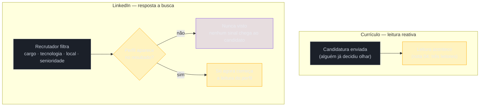

# LinkedIn — o par que responde a busca

> [!abstract] TL;DR
> O LinkedIn não é o currículo publicado em outra plataforma — é um documento que responde a uma pergunta diferente, feita por um leitor diferente, num momento diferente do processo. O currículo responde a **leitura**: alguém já decidiu olhar para ele, geralmente porque uma candidatura foi enviada. O LinkedIn responde a **busca**: um recrutador entra no Recruiter Search com um filtro de cargo, tecnologia, localização e senioridade, e só os perfis que aparecem naquele filtro chegam a ser lidos. Isso torna aparecer uma **pré-condição** de ser lido, não uma etapa opcional depois da leitura — um perfil impecável, bem escrito, com todo o cuidado que este galho ensinou para o currículo, pode estar simplesmente invisível para quem procura, e a pessoa nunca fica sabendo, porque o único sintoma de invisibilidade é silêncio. A segunda metade desta nota é uma declaração explícita: **não existe documentação oficial de engenharia do LinkedIn sobre como o Recruiter Search de fato pondera título, palavras-chave e atividade** — tudo que circula sobre "como aparecer no topo da busca" é inferência de empresas que vendem otimização de perfil, e esta nota separa, com o vocabulário já fixado pela [[03-Dominios/Carreira/Currículo/04 - Quem lê o seu currículo — e o que a evidência diz|nota 04]], o que é observável por qualquer pessoa do que é palpite vestido de fato. Fecha tratando o LinkedIn e o currículo como **uma fonte com duas apresentações** — uma divergência de data ou de cargo entre os dois é lida de forma desproporcional ao tamanho do erro, mas nem toda divergência é descuido: às vezes ela é o resíduo honesto de uma trajetória real, e saber diferenciar as duas é o que esta nota ensina por último.

## Duas perguntas diferentes, feitas por leitores diferentes

A [[03-Dominios/Carreira/Currículo/04 - Quem lê o seu currículo — e o que a evidência diz|nota 04]] descreveu três leitores do currículo — a máquina que extrai texto, o humano que varre em segundos, o humano que lê de verdade — e um detalhe implícito naquela descrição vale trazer à tona aqui, porque ele é o ponto de partida desta nota inteira: nos três casos, **alguém já decidiu olhar** para o documento antes de qualquer um dos três leitores agir. O ATS só processa um currículo que chegou por uma candidatura. O recrutador que varre em segundos só varre o que já está na fila. A leitura técnica só acontece depois que as duas etapas anteriores deixaram passar. Currículo é, do início ao fim da sua vida útil num processo seletivo, um documento de **leitura reativa** — ele espera ser encontrado por alguém que já tomou a decisão de procurar naquele lugar específico.

O LinkedIn opera do lado oposto dessa equação, e é essa inversão — não o formato, não o design da página, não o número de conexões — que faz dele um documento estruturalmente diferente, e não uma cópia do currículo hospedada num site diferente. Um recrutador de tecnologia com uma vaga de desenvolvedor backend pleno, remoto, com experiência em Python e AWS, não espera que o candidato certo apareça sozinho na caixa de entrada — ele abre o **LinkedIn Recruiter Search**, o produto de busca dedicado a recrutadores que compõem uma licença paga separada do LinkedIn comum, e digita um filtro: cargo (ou termo equivalente a cargo), tecnologia, localização, e uma faixa de senioridade, geralmente expressa em anos de experiência. O sistema devolve uma lista de perfis que, segundo algum critério interno, correspondem a esse filtro — e é só dentro dessa lista, entre os perfis que **apareceram**, que a leitura de fato começa a acontecer.

Essa é a distinção que dá nome a esta nota, e vale enunciá-la sem rodeio antes de qualquer detalhe: **o LinkedIn responde a busca antes de responder a leitura.** Um currículo mal escrito, mas que chegou às mãos certas por indicação ou candidatura direta, ainda tem chance de ser lido — a leitura, nesse caso, já estava garantida antes de o texto em si entrar em jogo. Um perfil de LinkedIn que nunca aparece numa busca de recrutador não tem essa segunda chance, porque a leitura, no LinkedIn, é uma consequência da busca, não um evento independente dela. Não existe alguém abrindo o LinkedIn de um estranho por acaso, na imensa maioria dos processos de recrutamento técnico — existe um filtro, aplicado antes, decidindo quem sequer chega a ser um nome numa tela.

> [!example] Caso fictício
> Bianca Torres, desenvolvedora backend de nível pleno já apresentada em notas anteriores deste galho, revisa o próprio LinkedIn no mesmo fim de semana em que ajusta o currículo para um ciclo novo de candidaturas. O currículo está em ordem — a nota 18 já descreveu como ela revisa a própria linha antes de aplicar, adaptando sumário e ênfase de bullets por vaga. O headline do LinkedIn, porém, ainda diz "Apaixonada por resolver problemas e por código limpo" — uma frase que ela escreveu há três anos, satisfeita com o tom, sem pensar que aquela linha específica é o texto que decide se ela aparece quando um recrutador busca "backend developer" ou "Python developer" no Recruiter Search. Nenhuma das palavras que compõem o filtro típico de uma vaga de backend pleno — a tecnologia, o cargo, a stack — está naquele headline. O perfil de Bianca continua existindo, continua bem escrito, continua com um resumo detalhado logo abaixo do headline — mas está, para efeito prático de quem busca ativamente candidatos com aquele filtro, fora do radar.

## O que isso muda na prática: o título decide se você existe para a busca

A consequência da distinção da seção anterior é direta, mas contraintuitiva o suficiente para merecer ser dita em voz alta, porque a maioria de quem escreve o próprio LinkedIn nunca chega a formulá-la dessa forma: **o título e os termos do perfil determinam se você aparece, e aparecer é pré-condição de ser lido.** Um perfil pode estar objetivamente bem escrito — prosa clara, resumo convincente, experiência bem descrita, exatamente como este galho ensinou para o currículo desde a [[03-Dominios/Carreira/Currículo/01 - Para que serve um currículo|nota 01]] — e ainda assim ser **invisível** para a busca que deveria encontrá-lo, se o headline e as seções indexáveis do perfil não contiverem o vocabulário que um recrutador digitaria ao procurar por alguém com aquele perfil técnico.

Vale marcar por que essa consequência é mais séria do que parece à primeira leitura. Um currículo mal escrito que chega a ser lido pelo menos gera um sinal — uma rejeição, um silêncio depois de uma entrevista, algo que o candidato pode, com esforço, tentar interpretar e corrigir. Um perfil de LinkedIn invisível numa busca não gera sinal nenhum, porque a pessoa nunca sabe que a busca aconteceu. Não há um número de "buscas em que você não apareceu" acessível ao usuário comum, não há uma notificação, não há absolutamente nada que diferencie, do ponto de vista de quem está do lado de dentro do próprio perfil, "ninguém está buscando esse tipo de perfil agora" de "estão buscando, e eu simplesmente não apareço". A ausência de contato — o mesmo sintoma final que já descreve o currículo que morre silenciosamente na triagem, sem que o candidato saiba se o problema foi o ATS, a varredura humana ou a vaga já preenchida — se repete aqui, só que numa etapa anterior, mais opaca ainda, porque nem existe um documento entregue que se possa revisar depois. O candidato de LinkedIn invisível não tem, nem retrospectivamente, nada concreto para examinar.

Essa é a razão estrutural pela qual o resto desta nota trata o headline — a linha logo abaixo do nome, a primeira que qualquer visitante ou qualquer resultado de busca exibe — com mais peso do que qualquer outra parte do perfil. Não é estética; é o campo mais provável de carregar o vocabulário que um filtro de busca compara contra a intenção de quem procura. Um headline como "Desenvolvedor Backend Pleno | Python, Django, AWS | Remoto" carrega, nas próprias palavras, exatamente os quatro eixos que a introdução desta nota já nomeou — cargo, tecnologia, localização, senioridade — de um jeito que um headline poético, por mais verdadeiro que seja sobre a pessoa por trás dele, simplesmente não carrega.

Vale nomear o limite honesto dessa recomendação antes de seguir, porque ela não é absoluta: escrever um headline cheio de termos técnicos empilhados, sem nenhuma frase que faça sentido como leitura humana, resolve o problema de aparecer às custas de piorar a segunda etapa — a leitura que acontece depois que o perfil já foi encontrado. Um headline como "Python | Django | AWS | Docker | Kubernetes | Kafka | Backend | Pleno | Remoto" pode, em teoria, cobrir mais termos de busca, mas lido por um humano — o recrutador que abriu o perfil depois de encontrá-lo — soa como uma lista de palavras-chave empilhadas sem critério, não como uma pessoa. O equilíbrio certo, tratado com mais detalhe na seção sobre o que é observável mais adiante, é um headline que **lê como frase e busca como filtro** ao mesmo tempo — o que é perfeitamente possível, porque cargo, tecnologia, localização e senioridade cabem, quase sempre, numa única linha construída com cuidado, sem precisar virar uma lista.

## A caixa-preta declarada: o Recruiter Search não tem documentação pública

Chega-se, agora, ao ponto mais importante desta nota, e vale dizê-lo sem qualquer rodeio, porque é fácil, depois de duas seções descrevendo o mecanismo de busca com confiança, escorregar para o tom que este galho já rejeitou explicitamente na nota 04: **a pesquisa que sustenta este galho não encontrou nenhuma documentação oficial de engenharia do LinkedIn sobre como o Recruiter Search de fato funciona.** Não há um artigo técnico publicado pelo próprio LinkedIn descrevendo como o sistema pondera título contra palavras-chave contra atividade contra completude de perfil contra qualquer outro sinal. Não há um número de peso relativo divulgado pela empresa. O que existe, em quantidade, é conteúdo produzido por terceiros comerciais — empresas e consultores que vendem otimização de perfil de LinkedIn, cursos sobre "como bombar no algoritmo", e serviços de coaching de carreira — descrevendo, com confiança que a fonte não sustenta, exatamente como o sistema pesa cada sinal.

Vale ligar esse ponto de volta ao que a nota 04 já estabeleceu como caixa-preta gêmea desta: aquela nota, ao fechar a discussão sobre os três leitores do currículo, já nomeou "o funcionamento interno do LinkedIn Recruiter Search" como uma das duas áreas do galho inteiro sem fonte confiável o suficiente para afirmar nada específico — a outra sendo o market share de sistemas de ATS. Esta nota não reabre aquela discussão do zero; ela a **cumpre**, aplicando o mesmo padrão de honestidade ao tema que a nota 04 só pôde declarar de passagem, sem espaço para desenvolver.

> [!warning] O que é proibido nesta nota, e por quê
> Nenhuma cifra sobre "peso do headline no ranking", "quantos por cento do algoritmo é X" ou qualquer percentual sobre o funcionamento interno da busca aparece nesta nota como fato. Se um número desse tipo circulasse aqui, ele estaria vestindo um palpite comercial com a autoridade de um dado medido — exatamente o erro que a nota 04 já descreveu, com outro exemplo, na seção sobre a cifra dos "6 segundos" de leitura de currículo. A diferença entre os dois casos é só de origem: ali, a cifra vinha de um estudo real, fraco mas real, mal generalizado; aqui, na melhor das hipóteses, a cifra vem de observação empírica não publicada de uma consultoria comercial, e na pior, de um número inventado para soar específico o suficiente para parecer medido.

O mecanismo comercial por trás dessa contaminação é o mesmo que a nota 04 já descreveu para o folclore de ATS, só que aplicado a um produto diferente: uma empresa de "otimização de LinkedIn" precisa de conteúdo que ranqueie bem em buscador e pareça autoritativo o suficiente para justificar um serviço pago, e "descobrimos o segredo do algoritmo do headline" é uma frase que circula muito melhor do que "não sabemos, e ninguém de fora sabe". Cada blog que repete uma cifra desse tipo, sem citar a fonte primária porque a fonte primária não existe, empresta credibilidade emprestada a um número que nunca teve credibilidade própria — a mesma lavagem de citação que a nota 04 já nomeou. Vale nomear, sem meio-termo, quem participa dessa contaminação especificamente em torno do LinkedIn: consultores de "personal branding" e agências de recrutamento que vendem curso ou revisão de perfil como produto. Isso não torna tudo que essas fontes publicam falso — significa que qualquer afirmação numérica específica delas sobre o funcionamento interno do sistema merece a mesma cautela que a nota 04 já aplicou a Jobscan e Enhancv: útil como observação de mercado, inútil como fato técnico.

Uma forma simples de testar se uma afirmação sobre o LinkedIn Recruiter Search é caixa-preta disfarçada de fato — a mesma pergunta que a nota 04 já ensinou para o ATS — é perguntar quem, exatamente, teria acesso à informação para confirmá-la. Se a resposta é "só a equipe de engenharia do LinkedIn", e a fonte que está afirmando o número não é essa equipe, a afirmação é inferência, por mais confiante que o tom do texto seja.

### O que é observável, e o que é especulação

Declarar a caixa-preta não significa que nada sobre o LinkedIn pode ser dito com confiança — significa separar, com cuidado, duas categorias de afirmação que o folclore de mercado costuma misturar sem aviso. Há coisas que **qualquer pessoa pode verificar por conta própria**, abrindo o próprio LinkedIn ou o de um colega e olhando com atenção, sem precisar de acesso nenhum ao código do sistema. E há coisas que são **inferência não confirmada** — plausíveis, às vezes até prováveis, mas sem forma de checar de fora.

A tabela abaixo separa as duas categorias para os pontos mais repetidos sobre o LinkedIn, porque essa distinção é a ferramenta que sobrevive além desta nota específica — vale para qualquer sistema de busca fechado, não só para este.

| O que é dito | Categoria | Como se sabe |
| --- | --- | --- |
| Existe um campo de "competências" (skills) separado do resto do perfil, e recrutadores podem filtrar por ele | Observável | Qualquer usuário vê o campo e o preenche; a existência do filtro é visível na própria interface do Recruiter Search em demonstrações públicas do produto |
| O Recruiter Search tem filtros estruturados por localização, cargo atual, empresa, anos de experiência e palavra-chave livre | Observável | A interface do produto expõe esses filtros a quem tem a licença, e capturas de tela e demonstrações comerciais mostram a mesma estrutura de forma consistente |
| O perfil tem seções distintas — headline, resumo, experiência, competências, recomendações — cada uma editável separadamente | Observável | Visível na própria edição do perfil, sem inferência nenhuma |
| O headline pesa mais do que o resumo na indexação da busca | Especulação | Nenhuma fonte com acesso ao ranking interno confirma o peso relativo entre campos |
| Atividade recente (postar, comentar, reagir) aumenta a posição do perfil nos resultados de busca | Especulação | Plausível por analogia com outros sistemas de busca e recomendação, mas não confirmado publicamente para o Recruiter Search especificamente |
| Perfis com "Open to Work" sinalizado internamente aparecem em posição diferente na busca de recrutador do que perfis sem o sinalizador | Especulação | O próprio LinkedIn documenta que o sinalizador existe e que recrutadores com licença veem quem o ativou — mas não documenta se isso altera a ordenação dos resultados de busca, só a visibilidade do sinal |
| Ordem exata dos fatores de ranqueamento (o que pesa mais entre título, competências e localização) | Especulação | Não há fonte com acesso ao algoritmo disposta a publicar isso, comercial ou não |

A régua que separa as duas colunas é sempre a mesma, e vale nomeá-la de forma explícita porque ela ensina algo que vai além do LinkedIn: **um fato é observável quando você pode verificá-lo abrindo a própria interface do sistema, sem depender de ninguém que afirme ter acesso privilegiado ao que está por trás dela.** Um fato é especulação quando a única forma de confirmá-lo seria ver o código, o peso interno, a lógica de ranqueamento — e nenhuma fonte disponível tem, de fato, esse acesso. A primeira coluna da tabela nunca precisa de citação de terceiro comercial nenhum; a segunda nunca deveria ser citada sem a ressalva de que é palpite, por mais consistente e razoável que pareça.

O diagrama fixa a diferença que dá título a esta nota: no currículo, a leitura é uma consequência quase direta de alguém ter decidido olhar — a candidatura já filtrou o interesse antes de o texto entrar em jogo. No LinkedIn, entre a intenção do recrutador e a leitura existe uma etapa a mais, o filtro de busca, e é nessa etapa extra — invisível para quem está do outro lado do perfil — que um perfil bem escrito ainda pode nunca chegar a ser lido.

## Consistência com o currículo: uma fonte, duas apresentações

A última peça desta nota muda de registro — sai da mecânica de busca e entra numa consequência prática direta, do tipo que qualquer pessoa pode corrigir hoje mesmo, sem depender de entender nada sobre o algoritmo. A [[03-Dominios/Carreira/Currículo/22 - O currículo como pipeline|nota 22]] já tratou, em profundidade, o problema de tratar o currículo como arquivo solto — o mesmo fato profissional, descrito em redações divergentes, espalhado por cópias que não sabem da existência umas das outras. O LinkedIn é, estruturalmente, mais uma dessas cópias, só que pública, permanente e comparável lado a lado com o currículo por qualquer pessoa que tenha os dois abertos ao mesmo tempo — o que nenhuma das outras variantes de currículo, entregues em processos diferentes, geralmente permite.

Essa comparabilidade é o que torna a divergência entre os dois documentos mais arriscada do que uma divergência qualquer entre duas variantes de currículo. Ninguém compara, lado a lado, o currículo que você enviou para a Empresa A com o que você enviou para a Empresa B seis meses depois — cada um vive isolado na própria candidatura. O LinkedIn e o currículo, ao contrário, costumam ser abertos **juntos**, na mesma sessão de avaliação: um recrutador que já tem o currículo em mãos abre o LinkedIn do candidato como segunda fonte, quase por reflexo, antes de decidir avançar — o mesmo instinto de checagem cruzada que qualquer pessoa aplicaria antes de confiar num documento importante.

É aqui que entra o ponto mais contraintuitivo desta seção, e o motivo de ela merecer peso desproporcional ao espaço que ocuparia numa lista de boas práticas: **uma divergência de data ou de cargo entre os dois documentos tem uma leitura desproporcional ao tamanho do erro.** Um mês trocado numa data de início de emprego não é lido, pelo leitor do outro lado, como o que provavelmente é — um descuido de digitação, um esquecimento de atualizar um dos dois documentos depois de uma mudança recente. É lido como algo mais grave: uma possível **omissão deliberada**, o tipo de inconsistência que um recrutador treinado a checar referências e histórico é, por ofício, condicionado a notar e desconfiar. A assimetria é o cerne do problema — o erro é pequeno, mas o custo de reputação que ele gera, na cabeça de quem lê, não é pequeno na mesma proporção.

O motivo dessa assimetria não é acaso nem exagero de quem lê — é estrutural, e vale nomeá-lo com a mesma honestidade que o resto do galho aplica a qualquer afirmação sobre o que o leitor pensa: dois documentos que deveriam descrever o mesmo fato e não descrevem, na cabeça de alguém treinado a caçar inconsistência, sinalizam duas hipóteses possíveis, e nenhuma das duas é neutra. A primeira hipótese é descuido — os dois documentos nunca foram revisados juntos, e um ficou desatualizado enquanto o outro mudou. A segunda hipótese, mais grave, é que a divergência **esconde algo** — um período que a pessoa preferiu apagar de um dos dois lugares, um cargo inflado numa das duas versões, uma passagem curta que ficou de fora de um documento e não do outro. O leitor, sem forma de saber qual das duas hipóteses é verdadeira, tende a aplicar a mais cara das duas por segurança — e é essa aplicação assimétrica, não a gravidade real do erro, que produz o custo desproporcional.

A solução que esta nota propõe não é mais atenção individual a cada revisão — a mesma lição que a nota 22 já ensinou para o problema das seis redações divergentes vale aqui, aplicada a um par de documentos em vez de dezessete arquivos: **tratar o currículo e o LinkedIn como uma fonte com duas apresentações**, não como dois documentos independentes que por acaso descrevem a mesma pessoa. Datas, cargos e nomes de empresa deveriam vir do mesmo lugar — a mesma base que a nota 22 descreveu, ou, na versão honesta sem ferramental daquela mesma nota, o mesmo arquivo-fonte de onde ambos são derivados — e não de duas memórias separadas, uma para cada plataforma, cada uma editada num momento diferente sem visibilidade sobre a outra. A consequência prática mais simples de tudo isso é também a mais barata: **revisar os dois no mesmo dia**, sempre que um dos dois for atualizado — não porque revisar os dois ao mesmo tempo seja mais fácil, mas porque é exatamente o hábito que impede a divergência de nascer no primeiro lugar, em vez de precisar ser caçada depois que já existe e já foi notada por alguém do outro lado.

> [!example] Caso fictício
> Rafael Duarte, desenvolvedor pleno já apresentado em notas anteriores deste galho, atualiza o currículo depois de uma promoção informal de responsabilidades — passou a liderar tecnicamente um projeto de migração, sem mudança de cargo formal — e ajusta a data de início daquele projeto no currículo para refletir quando a liderança de fato começou. Ele esquece de fazer o mesmo ajuste no LinkedIn, onde a experiência daquele emprego ainda mostra uma única entrada, sem a data específica do início do projeto. Um recrutador que avalia os dois documentos lado a lado, numa etapa de checagem antes de agendar a entrevista final, nota a diferença de datas entre um bullet do currículo e a entrada correspondente do LinkedIn — três meses de diferença — e leva a dúvida para o gestor que está prestes a entrevistar Rafael, não porque três meses mudem a avaliação técnica dele, mas porque a inconsistência, por si só, já introduziu uma pergunta que não precisava existir. A entrevista acontece normalmente, Rafael explica a diferença em segundos quando perguntado, mas a pergunta consumiu um espaço que poderia ter sido usado para outra coisa — e ele só descobre, semanas depois, através de um comentário informal do próprio recrutador, que aquilo quase pesou contra ele.

### Nem toda divergência é erro: o caso de Cassiana

O ponto mais importante desta seção, e o que a torna mais do que um lembrete de revisão, é a ressalva que seria fácil deixar de fora: **nem toda divergência entre LinkedIn e currículo é descuido.** Algumas têm causa legítima e explicável, e o que este galho ensina não é "faça os dois baterem cegamente, palavra por palavra" — é **saber distinguir qual divergência precisa de conserto e qual precisa de explicação**, porque tratar as duas do mesmo jeito produz o erro oposto ao da seção anterior: apagar informação real por medo de parecer inconsistente.

> [!example] Caso real
> Cassiana Gabriela Lima Barreto, que autorizou a citação deste caso nesta nota, tem hoje, no LinkedIn (`linkedin.com/in/cassianalima`), o headline "*Data Scientist | Researcher | Biomedical Engineer*" — três termos, no original em inglês, que não incluem a palavra "engenheira de dados". O cargo atual dela, segundo a própria página de carreiras da Dadosfera, onde seu depoimento aparece associado à trajetória dela na Dadosfera, é justamente esse: engenheira de dados. À primeira vista, é exatamente o tipo de divergência que a seção anterior descreveu como arriscada — um headline que não corresponde ao cargo real. Mas a causa, aqui, não é descuido, e muito menos omissão: Cassiana foi contratada, em 2024, como trainee de **ciência** de dados na Dadosfera, e logo depois **alocada em engenharia** de dados, área onde a carreira dela evoluiu até a promoção ao nível júnior. O headline não mente sobre nada — é resíduo de um momento anterior da trajetória, o instante em que a mira profissional dela ainda era ciência de dados, e a alocação em engenharia ainda não tinha acontecido.

A lição que este caso carrega, e que é o motivo de ele estar aqui em vez de num exemplo qualquer de divergência genérica, é a que fecha esta nota: um headline desatualizado em relação ao cargo atual **não é, por si só, prova de descuido ou de omissão** — pode ser, com a mesma facilidade, o retrato honesto de uma trajetória que mudou de direção depois que o texto foi escrito, e que ninguém, ainda, teve motivo forte o suficiente para voltar e reescrever. A diferença entre o caso de Cassiana e o de Rafael, na seção anterior, não está no tamanho da divergência — está em que a de Rafael era **evitável com revisão simples e conjunta**, enquanto a de Cassiana é **plausivelmente rastreável a uma mudança real de trajetória**, que um recrutador atento, ao perguntar sobre ela numa conversa, receberia como resposta clara e verdadeira, não como algo a esconder. Isso não significa que Cassiana deveria deixar o headline como está para sempre — atualizá-lo para refletir o presente continua sendo a prática mais segura, pela mesma lógica da seção anterior sobre revisão conjunta —, mas significa que, enquanto o headline não é atualizado, a divergência que ele produz tem uma explicação honesta pronta, o que muda completamente como ela deveria ser tratada se alguém perguntar.

O teste prático que separa as duas categorias, generalizável para além deste caso específico, é simples de aplicar: **se, ao ser perguntado sobre a divergência, você consegue responder em uma frase clara e verdadeira sobre por que ela existe — como Cassiana poderia responder sobre a trainee de ciência de dados que virou engenheira de dados —, a divergência pede explicação, não conserto urgente.** Se a resposta exigiria inventar algo, ou admitir um erro de fato — uma data trocada para esconder uma lacuna, um cargo inflado num dos dois documentos —, a divergência pede conserto, e quanto antes, melhor.

## Variação por nível

O peso relativo do headline e da consistência entre documentos muda pouco com a senioridade — a exposição à busca e ao recrutador que compara os dois documentos existe em qualquer um dos seis níveis que a [[03-Dominios/Carreira/Currículo/03 - Os seis níveis e o que muda entre eles|nota 03]] já descreveu. O que muda é o vocabulário que o headline precisa carregar para responder ao filtro certo.

Para um **estagiário ou trainee**, o filtro de busca típico raramente é cargo específico — é curso, área de formação e disponibilidade, porque o leitor desse nível, segundo a nota 03, avalia potencial mais do que competência consolidada. Um headline como "Estudante de Ciência da Computação | Buscando estágio em desenvolvimento backend" responde a esse filtro de forma direta, mesmo sem nenhuma tecnologia específica listada — porque a busca, nesse nível, raramente filtra por tecnologia isolada.

Para **júnior e pleno**, o filtro se aproxima do exemplo já usado nesta nota — cargo, tecnologia central, e às vezes localização ou modalidade —, porque é nesse ponto da escada que a nota 03 já descreveu o leitor perguntando por fundamentos técnicos demonstráveis e depois por autonomia. O headline precisa nomear o que a vaga provavelmente nomeia também, sem tentar comprimir toda a stack numa única linha.

Para **sênior e staff**, o filtro de busca de um recrutador especializado costuma incluir termos de escopo — "tech lead", "arquitetura", "staff engineer" — que aparecem menos em vagas de nível inicial, e o headline precisa refletir esse vocabulário de decisão e impacto que a nota 03 já descreveu como o eixo central da transição para o topo da escada, no mesmo espírito com que o sumário do currículo, tratado na [[03-Dominios/Carreira/Currículo/07 - O sumário profissional|nota 07]], também muda de registro nesses dois níveis.

## Casos práticos

> [!example] Caso real
> O caso de Cassiana Gabriela Lima Barreto, já contado em detalhe acima, é também o exemplo mais concreto desta nota de uma divergência que sobrevive ao escrutínio: um headline em inglês, "*Data Scientist | Researcher | Biomedical Engineer*", que não menciona engenharia de dados, o cargo atual dela na Dadosfera. A trajetória real — trainee de ciência de dados em 2024, alocada em engenharia de dados pouco depois, promovida a júnior na nova área — explica a divergência sem exigir nenhum conserto de emergência. O caso importa aqui porque mostra, com nome e link verificável, que a régua desta nota não é "zero divergência tolerada" — é "toda divergência precisa de uma explicação verdadeira, pronta para ser dada".

> [!example] Caso fictício
> Bianca Torres, semanas depois de perceber que o próprio headline não continha nenhum termo buscável — o caso descrito no início desta nota —, reescreve a linha para "Desenvolvedora Backend Pleno | Python, Django, AWS | Remoto (Brasil)". Ela não muda mais nada no perfil: o resumo continua o mesmo, a lista de experiências continua a mesma, nenhuma linha do currículo precisou ser tocada. Nas semanas seguintes, ela passa a receber mensagens de recrutadores no LinkedIn com uma frequência que não tinha antes — algo que, por não haver forma de medir quantas buscas a alcançavam ou deixavam de alcançar antes da mudança, ela não consegue atribuir com certeza a nenhum mecanismo específico do Recruiter Search, e não tenta fingir que consegue. O que ela sabe, com segurança, é o que esta nota já separou como observável: o headline mudou, os termos que um filtro de busca provavelmente reconhece agora estão lá, e o contato, que não existia antes, passou a existir depois — o resto continua sendo, para ela como para qualquer pessoa de fora do LinkedIn, caixa-preta.

## Armadilhas comuns

> [!warning] Escrever um headline poético em vez de um headline buscável
> **O que acontece:** o candidato escreve um headline sobre como se sente em relação ao próprio trabalho — "apaixonado por resolver problemas", "sempre em busca de aprender mais" — sem nenhum termo que um filtro de busca de recrutador reconheceria como cargo, tecnologia ou senioridade. **Por quê:** esse tipo de frase soa genuína e humana, e é fácil confundir "soar humano" com "funcionar bem", esquecendo que o headline tem uma segunda função — ser encontrado — antes de qualquer função de comunicar personalidade. **Como evitar:** garantir que os quatro eixos — cargo, tecnologia central, localização ou modalidade, senioridade — apareçam em algum lugar do headline, mesmo que a frase mantenha um tom pessoal; as duas coisas não são mutuamente exclusivas, como a seção sobre o headline empilhado já mostrou.

> [!warning] Tratar uma cifra de "otimização de LinkedIn" como fato técnico
> **O que acontece:** o candidato lê um artigo ou assiste a um vídeo afirmando um percentual específico sobre o peso do headline, das competências ou da atividade recente no ranqueamento da busca, e passa a otimizar o perfil como se aquele número fosse confirmado. **Por quê:** um número específico soa mais confiável do que "ninguém sabe ao certo", mesmo quando a especificidade, aqui como no caso do ATS que a nota 04 já tratou, é o que denuncia a fabricação. **Como evitar:** aplicar o teste desta nota — quem, exatamente, teria acesso para confirmar esse número? Se a resposta é só a equipe de engenharia do LinkedIn, e a fonte não é essa equipe, tratar a afirmação como especulação, por mais confiante que o tom pareça.

> [!warning] Corrigir uma divergência apagando a explicação em vez de dando-a
> **O que acontece:** ao notar uma divergência entre currículo e LinkedIn que tem causa legítima — como no caso de Cassiana —, o candidato entra em pânico e apaga informação real do perfil, ou reescreve a trajetória de um jeito que simplifica demais e acaba soando menos verdadeiro do que a versão original. **Por quê:** a reação instintiva diante de uma inconsistência é escondê-la, não explicá-la, mesmo quando a explicação real é mais forte do que qualquer tentativa de disfarce. **Como evitar:** aplicar o teste desta nota — se a divergência tem uma explicação clara e verdadeira em uma frase, ela merece ser contada, não apagada; atualizar o headline para refletir o presente é sempre uma opção melhor do que deixá-lo desatualizado, mas isso é diferente de tratar a divergência como algo vergonhoso a esconder.

## Como soa em inglês

> "I treat LinkedIn and my résumé as one source with two different jobs. The résumé gets read once someone has already decided to look at it — through an application, a referral, something that already filtered for interest. LinkedIn has to survive an earlier step: a recruiter searching by title, tech stack, location, and seniority in Recruiter Search, and if my profile doesn't come up in that filter, it's never read at all — no rejection, no signal, just silence. So I write my headline to be findable first and polished second: role, core stack, and seniority, in a sentence that still reads like a person wrote it. And I don't pretend to know how LinkedIn's search actually ranks profiles internally — there's no published engineering documentation on that, only vendor claims, so I treat any specific percentage I read about 'algorithm weight' as marketing, not fact. What I do control is consistency: dates and titles should match between my résumé and my profile, because a one-month gap doesn't read as a typo to a recruiter checking both side by side — it reads as something being hidden, even when it isn't."

| PT | EN |
| --- | --- |
| responder a busca | respond to search |
| Recruiter Search | Recruiter Search |
| headline | headline |
| filtro de cargo, tecnologia, localização e senioridade | title, tech, location, and seniority filter |
| caixa-preta declarada | declared black box |
| resíduo da mira original | residue of the original aim |
| fonte com duas apresentações | one source, two presentations |
| leitura desproporcional | disproportionate reading |

## O que vem a seguir

Fixada a distinção entre busca e leitura, e a consistência que amarra LinkedIn e currículo como uma fonte só, o galho segue para o par de temas que também dependem de sistema fechado e vocabulário de mercado — a comparação entre geografias e a presença crescente de modelos de linguagem nos dois lados do processo:

- [[03-Dominios/Carreira/Currículo/24 - Mercados, e o Brazilian Cultural Bug|24 - Mercados, e o Brazilian Cultural Bug]] — como o mesmo headline e o mesmo currículo precisam variar entre Brasil, Estados Unidos e Europa.
- [[03-Dominios/Carreira/Currículo/25 - IA nos dois lados|25 - IA nos dois lados]] — o viés medido em triagem por IA, tratado com o mesmo rigor de fonte que esta nota aplicou ao LinkedIn.

## Veja também

- [[03-Dominios/Carreira/Currículo/index|Currículo]] — o índice do galho, com a tese e o mapa das 26 notas.
- [[03-Dominios/Carreira/Currículo/04 - Quem lê o seu currículo — e o que a evidência diz|04 - Quem lê o seu currículo — e o que a evidência diz]] — o vocabulário de três categorias (evidência sólida, plausível mas não medido, caixa-preta declarada) que esta nota aplica ao LinkedIn, e a primeira menção do Recruiter Search como caixa-preta.
- [[03-Dominios/Carreira/Currículo/06 - Cabeçalho e identidade|06 - Cabeçalho e identidade]] — por que um LinkedIn desatualizado subtrai em vez de simplesmente não somar, e a URL personalizada que deveria ir no cabeçalho do currículo.
- [[03-Dominios/Carreira/Currículo/22 - O currículo como pipeline|22 - O currículo como pipeline]] — a fonte única que esta nota estende ao par currículo/LinkedIn, e o problema das redações divergentes que a consistência entre os dois documentos também resolve.
- [[03-Dominios/Carreira/Currículo/17 - Projetos, portfólio e GitHub depois da IA|17 - Projetos, portfólio e GitHub depois da IA]] — o outro link de "avaliação antes do contato" do cabeçalho, tratado com a mesma lógica de subtrai-quando-descuidado.
- [[03-Dominios/Carreira/Entrevistas/05 - Currículo e LinkedIn como artefatos de triagem|Currículo e LinkedIn como artefatos de triagem]] — o galho parceiro Entrevistas, com a etapa de sourcing vista do lado de quem conduz o funil, não de quem escreve o perfil.

## Fontes

- Não existe documentação oficial de engenharia do LinkedIn sobre o funcionamento do Recruiter Search publicamente disponível — esta pesquisa não localizou nenhuma, e a ausência, não uma fonte específica, é o que sustenta a declaração de caixa-preta desta nota, no mesmo padrão já estabelecido pela [[03-Dominios/Carreira/Currículo/04 - Quem lê o seu currículo — e o que a evidência diz|nota 04]] para o mesmo tema.
- O headline de Cassiana Gabriela Lima Barreto ("Data Scientist | Researcher | Biomedical Engineer") foi verificado diretamente em `linkedin.com/in/cassianalima` em 2026-08-20; o cargo atual (engenheira de dados) e o depoimento associado à trajetória de trainee de ciência de dados alocada em engenharia de dados foram verificados na página de carreiras da Dadosfera. Cassiana autorizou a citação deste caso nesta nota.
- Bianca Torres e Rafael Duarte são personas fictícias já estabelecidas em notas anteriores deste galho, reutilizadas aqui com os mesmos fatos canônicos já fixados sobre eles — ambos de nível pleno.
- A distinção entre "leitura reativa" (currículo) e "resposta a busca" (LinkedIn) é análise estrutural do próprio autor deste vault, apoiada na existência documentada e verificável do produto LinkedIn Recruiter Search como sistema de busca por filtro — não numa fonte específica sobre como esse sistema pondera resultados internamente, que é exatamente o ponto que esta nota declara como caixa-preta.
