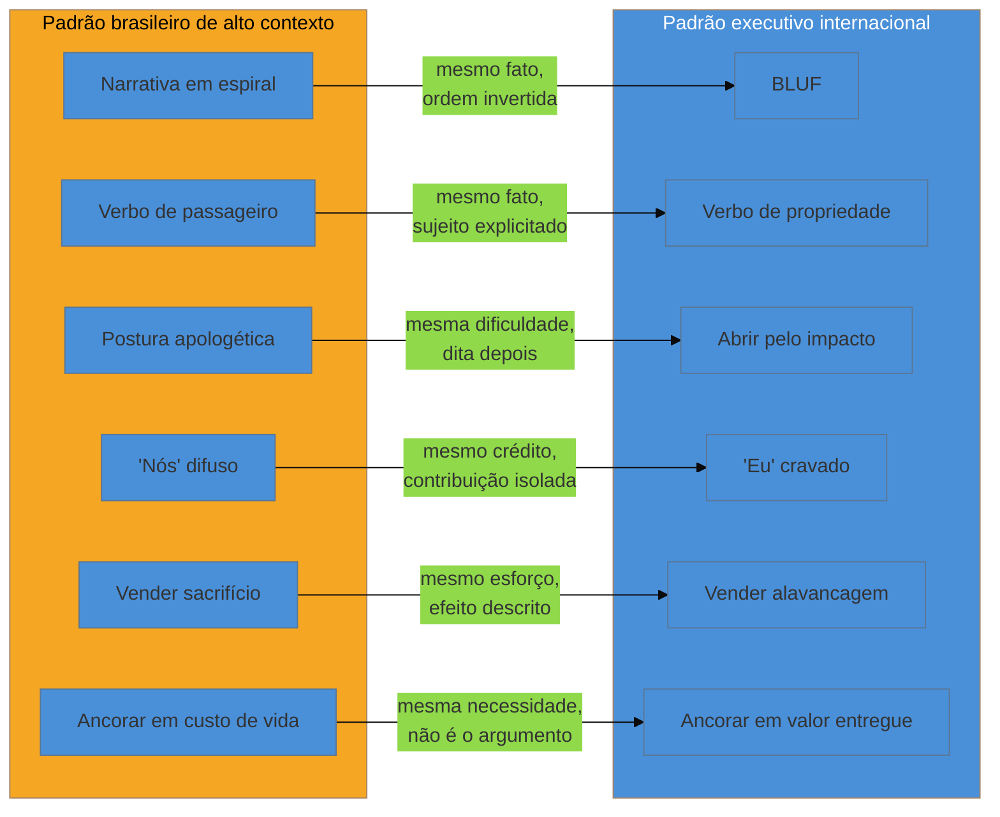

# Mercados, e o Brazilian Cultural Bug

> [!abstract] TL;DR
> Um currículo brasileiro bem escrito, aplicado sem ajuste a uma vaga internacional, costuma falhar por um motivo que ninguém nomeia: ele não está errado, está **falando o dialeto certo para a plateia errada**. O termo *Brazilian Cultural Bug*, cunhado nesta nota, descreve o conjunto de hábitos de escrita que o mercado brasileiro ensina como educação e o mercado executivo internacional lê como diluição — narrativa em espiral em vez de conclusão primeiro, verbo de passageiro em vez de verbo de dono, "nós" onde só "eu" está sendo avaliado, esforço vendido em vez de alavancagem. **Nenhum desses hábitos é erro de caráter — é código cultural**, e código cultural se aprende. A nota abre com uma advertência que atravessa tudo o que vem depois: a pesquisa que a sustenta não encontrou nenhuma fonte oficial europeia sobre convenção de currículo — nem comissão, nem associação de recrutadores, nem órgão nacional —, só agregadores de blog de carreira repetindo os mesmos números uns dos outros. Por isso, toda diferença por país aqui é tratada como **prática relatada, não norma verificada**, na mesma disciplina que a [[03-Dominios/Carreira/Currículo/04 - Quem lê o seu currículo — e o que a evidência diz|nota 04]] já aplicou ao ATS. O que tem lastro mais sólido é o pareado cultural — porque ele descreve um mecanismo de leitura, não um costume local — e é aí que esta nota se detém com mais cuidado.

## Um currículo que ninguém responde

> [!example] Caso fictício
> Rafael Duarte, desenvolvedor pleno, decide se candidatar a vagas remotas em empresas americanas depois de dois anos estagnado no mesmo cargo numa consultoria em Fortaleza. Ele pega o currículo em português, que já funciona bem no mercado local, e o traduz frase por frase para o inglês — sem reescrever a estrutura, só trocando as palavras. O sumário abre assim: "Desenvolvedor com sólida experiência em desenvolvimento de sistemas, tendo participado de diversos projetos ao longo dos últimos seis anos, sempre buscando contribuir da melhor forma possível com as equipes em que atuou." A seção de experiência descreve o trabalho mais recente com a linha "Responsável pelo desenvolvimento e manutenção de sistemas backend, trabalhando em conjunto com a equipe de produto." Rafael aplica para vinte e duas vagas ao longo de dois meses e recebe três respostas automáticas de rejeição, nenhuma ligação. Frustrado, começa a ler guias de currículo internacional — com o ceticismo que já aprendeu a aplicar a material comercial depois de descobrir, meses antes, que a maioria dos "scores de ATS" não mede nada de real — e percebe que o problema nunca foi a gramática. A estrutura da frase, em português ou em inglês, nunca dizia o que ele, especificamente, tinha decidido ou entregue.

O que travou a candidatura de Rafael não é nenhum dos mitos que a nota 04 já derrubou — não foi um ATS descartando por palavra-chave ausente, não foi formatação quebrando o parsing. Foi um leitor humano, o terceiro leitor daquela nota, lendo um documento tecnicamente correto e não encontrando nele nenhuma evidência de que a pessoa por trás dele decide, entrega e é dona do próprio resultado. Essa é a lacuna que o resto desta nota examina — não como falha pessoal de Rafael, mas como um padrão sistemático o suficiente para merecer nome próprio.

## A fragilidade da evidência, declarada de saída

Antes de qualquer comparação entre países, vale ser tão explícito quanto a nota 04 foi sobre o ATS: **esta pesquisa não localizou nenhuma fonte oficial europeia** sobre convenção de currículo — nenhuma página da Comissão Europeia, nenhuma associação nacional de recrutamento, nenhum órgão de padronização de emprego que documentasse, com metodologia pública, o que é esperado num currículo em cada país. O que circula sobre "na Alemanha se espera foto, na Holanda não" vem, sem exceção nesta pesquisa, de **agregadores de blog de carreira** — sites que vendem otimização de currículo, templates ou serviço de coaching, e que publicam listas de "regras por país" citando uns aos outros na mesma dinâmica de lavagem de citação que a nota 04 já nomeou: um artigo cita outro artigo, que cita um terceiro artigo mais antigo, e nenhum dos três chega a uma fonte primária rastreável.

Isso não significa que as diferenças por país sejam inventadas — elas provavelmente refletem, com alguma imprecisão, práticas reais que recrutadores relatam. Significa que **o grau de confiança que qualquer afirmação específica merece é baixo**, no vocabulário de três categorias que a nota 04 fixou: o que segue nesta seção é, na melhor das hipóteses, **plausível mas não medido** — nunca **evidência sólida**, porque não existe, nesta pesquisa, nenhum estudo com amostra e metodologia públicas sobre convenção de currículo por país, do jeito que existe, por exemplo, para o viés de triagem por IA que a nota 04 já documentou com Wilson & Caliskan. Vale marcar explicitamente as fontes comerciais nomeadas nesta pesquisa, seguindo a mesma disciplina que a nota 04 já aplicou a Jobscan, Enhancv e Teal: sites como Novoresume, Zety, TopCV, Indeed Career Guide e a própria Enhancv publicam a maior parte do conteúdo sobre "convenção de currículo por país" que qualquer busca rápida encontra hoje, e todos vendem, direta ou indiretamente, algum produto de currículo.

> [!warning] Tratar prática relatada como norma verificada
> **O que acontece:** um candidato lê que "na Suíça, currículos sem foto são automaticamente descartados" e passa a tratar isso como fato equivalente a uma lei — algo que, se ignorado, custa a vaga com certeza. **Por quê:** a afirmação vem escrita com o mesmo tom confiante de um dado medido, e nenhum guia de carreira comercial costuma admitir, no próprio texto, que a origem da afirmação é só repetição entre sites parecidos. **Como evitar:** tratar toda regra por país como um sinal de prática comum, não como norma obrigatória — e, quando a decisão importa de verdade (uma candidatura específica, um mercado específico), procurar confirmação direta na descrição da vaga, no site da empresa ou perguntando a alguém que já trabalha naquele mercado, em vez de confiar cegamente num artigo de blog sem fonte primária.

## Diferenças por mercado — prática relatada, não norma verificada

Com a ressalva anterior valendo para tudo o que segue, os quatro pontos abaixo são os que aparecem com mais consistência entre as fontes comerciais consultadas nesta pesquisa — consistência que sobe a confiança de "boato isolado" para "prática amplamente relatada", sem chegar a "norma verificada".

### Foto

A prática mais citada, e a mais contraintuitiva para quem aprendeu o padrão brasileiro de tecnologia, é a foto. No Reino Unido, na Holanda e nos Estados Unidos, incluir foto num currículo é **desencorajado** — a razão relatada é a mesma que já apareceu na [[03-Dominios/Carreira/Currículo/06 - Cabeçalho e identidade|nota 06]]: abrir espaço para viés inconsciente baseado em aparência, idade ou raça é visto como risco a evitar, não como neutro. Em parte da Europa continental — Alemanha e França aparecem com mais frequência nas fontes consultadas —, a foto é relatada como **esperada** em parcela relevante das candidaturas, ainda que a prática pareça estar em declínio, sem que nenhuma fonte quantifique essa mudança com metodologia que resista a escrutínio. O ponto mais defensável de toda esta seção: **a mesma escolha que sinaliza profissionalismo num mercado sinaliza desconhecimento das normas locais no mercado vizinho** — e é essa inversão de sinal, não a foto em si, que impede uma regra única, memorizada uma vez e aplicada sempre.

### Dados pessoais e GDPR

O Regulamento Geral de Proteção de Dados da União Europeia (GDPR, vigente desde 2018) rege como qualquer empresa dentro do bloco pode coletar e processar dado pessoal, e recrutamento não é exceção — mas vale ser preciso sobre o que esta nota pode afirmar com segurança e onde a segurança acaba. O GDPR não proíbe, por si só, que um candidato inclua foto ou data de nascimento no próprio currículo — o candidato consente ao fornecer o dado voluntariamente. O que o regulamento estabelece, em termos gerais que esta nota pode sustentar sem entrar em detalhe operacional que não verificou linha a linha, é que o **empregador** precisa de uma base legal para processar e guardar qualquer dado pessoal recebido, e o princípio de minimização de dados — coletar só o necessário para a finalidade declarada — é um dos pilares centrais do regulamento. Isso cria um efeito indireto plausível: empresas maiores, com times jurídicos atentos a compliance, tendem a preferir formulários de candidatura padronizados que já limitam o que é coletado. Esta nota não afirma qual proporção de empresas segue essa prática, nem cita artigo específico do regulamento — a lacuna fica declarada em vez de preenchida.

### Europass

Diferente da foto e do GDPR, o Europass tem uma fonte primária real e verificável: é um instrumento oficial da União Europeia, mantido pela Comissão Europeia através do Cedefop (o centro europeu para o desenvolvimento da formação profissional), disponível em europass.eu, que padroniza o formato de currículo e outros documentos de carreira entre os países-membros do bloco. Isso o torna diferente de tudo o mais citado nesta seção — não é prática relatada por blog comercial, é um formato com origem institucional rastreável. O que esta nota **não** pode afirmar com a mesma segurança é o quanto o formato é, na prática, usado ou exigido por empregadores privados de tecnologia — as fontes comerciais consultadas divergem, algumas tratando-o como amplamente aceito, outras como relevante principalmente para órgãos públicos e programas de mobilidade educacional. A lacuna fica declarada, não estimada.

### Referências

A prática relatada com mais consistência entre as fontes consultadas é que, nos Estados Unidos, incluir a linha "referências disponíveis mediante solicitação" no currículo é considerada desnecessária e, por alguns guias, levemente datada — o argumento é o mesmo que a [[03-Dominios/Carreira/Currículo/07 - O sumário profissional|nota 07]] já aplicou à linha de objetivo profissional: se a informação é presumida, escrevê-la explicitamente não comunica nada além de ocupar espaço. O padrão relatado é fornecer referências separadamente, só quando pedidas numa etapa avançada do processo. Não há, nas fontes consultadas, indicação de que a prática varie de forma marcante entre Estados Unidos, Reino Unido e Europa continental nesse ponto — é onde a convergência entre mercados parece maior, ainda que continue sendo prática relatada, não medida.

## O Brazilian Cultural Bug: o pareado, mecanismo por mecanismo

Chegado a este ponto, a nota muda de registro. As diferenças de país da seção anterior são de **convenção** — coisas que mudam porque um mercado decidiu, por hábito ou por lei, tratar um dado de um jeito e outro mercado de outro. O que vem agora é diferente, e é o motivo pelo qual esta nota existe dentro do galho: não é convenção de formato, é **um padrão de comunicação inteiro**, aprendido antes de qualquer currículo ser escrito, que produz sistematicamente o mesmo tipo de silêncio que travou a candidatura de Rafael. Cada um dos seis pares abaixo já apareceu, isolado, em alguma nota anterior deste galho — esta seção não repete o argumento de nenhuma delas, ela nomeia o eixo que as seis têm em comum: **o padrão brasileiro tende a organizar a frase em torno do processo e do grupo; o padrão executivo internacional espera a frase organizada em torno do resultado e do indivíduo que decidiu.**

### Alto contexto e narrativa em espiral × BLUF

O antropólogo Edward T. Hall descreveu, ainda no século passado, a distinção entre culturas de **alto contexto**, onde boa parte do significado de uma mensagem depende de contexto compartilhado e forma indireta de chegar ao ponto, e culturas de **baixo contexto**, onde a mensagem é esperada explícita e direta, com o significado no próprio texto, sem depender de inferência do leitor. O Brasil aparece consistentemente, nas fontes de comunicação intercultural consultadas, como exemplo de cultura de alto contexto; os Estados Unidos, de baixo contexto — essa distinção tem lastro acadêmico mais sólido do que qualquer regra de país da seção anterior, mas aplicá-la a "como currículo deveria ser escrito" já é extrapolação desta nota, não resultado medido diretamente sobre currículos.

Na prática de escrita, isso vira uma forma de contar história que a [[03-Dominios/Carreira/Currículo/07 - O sumário profissional|nota 07]] já nomeou como o padrão natural de quem escreve: **narrativa em espiral**, que apresenta contexto, depois mais contexto, aproximando-se do ponto central aos poucos, confiando que o leitor vai acompanhar o raciocínio até a conclusão. É um padrão genuinamente eficaz dentro de uma cultura de alto contexto, onde o interlocutor tem tempo e o mesmo pano de fundo cultural para reconstruir o significado a partir das pistas. O problema é aplicá-lo a um leitor que, como a nota 04 já documentou, tem **segundos** para decidir se continua lendo. A nota 07 já chamou o padrão contrário de **BLUF** — *Bottom Line Up Front*: a conclusão na primeira frase, o contexto depois, e só se sobrar espaço. Um sumário brasileiro típico costuma abrir com tempo de carreira e área de atuação — contexto — e deixar o resultado, quando existe, para a última frase. Um leitor de baixo contexto, sob a pressão de tempo que a nota 04 já mediu como estrutural, muitas vezes nunca chega lá.

### Verbo passivo e de passageiro × verbo que declara propriedade

A [[03-Dominios/Carreira/Currículo/11 - A linha de bullet|nota 11]] já tratou este mecanismo no nível da frase — "responsável por" descreve escopo, não causa, e o teste decisivo é perguntar se outra pessoa no mesmo cargo poderia ter escrito a mesma linha. O que esta nota acrescenta é a origem cultural do hábito: verbos como "ajudei", "participei", "acompanhei", "contribuí para" são, no português corporativo brasileiro, uma forma culturalmente aceitável — e às vezes esperada — de descrever a própria contribuição sem soar arrogante diante de quem lê, descrevendo o próprio papel como parte de um esforço coletivo mesmo quando a decisão foi individual. O padrão executivo internacional, principalmente o americano, espera o oposto: o verbo de propriedade — "conduzi", "construí", "eliminei", "decidi" — que a nota 11 já ensinou a escolher, e que a [[03-Dominios/Carreira/Currículo/13 - Responsabilidade, realização e alavancagem|nota 13]] amarrou a um degrau específico da escada de escopo. Um currículo brasileiro que usa "participei" onde o fato real era "conduzi sozinho" não está mentindo — está aplicando, ao currículo, o mesmo cuidado social que aplicaria numa conversa de corredor. O problema é que o currículo não é lido como conversa de corredor; é lido, pelo terceiro leitor da nota 04, como evidência de quem decide.

### Postura apologética × abrir pelo impacto

Um traço menos discutido, mas igualmente presente nas fontes consultadas, é a tendência de currículos brasileiros abrirem frases com uma ressalva que soa, para um leitor de baixo contexto, como pedido de desculpa antecipado — "apesar de pouco tempo na empresa, consegui...", "mesmo com recursos limitados, entreguei...". A intenção é quase sempre honesta: nomear a dificuldade real para que o resultado pareça mais impressionante em comparação. O efeito, para um leitor treinado em BLUF, é o oposto — a frase abre com uma limitação, não com o resultado, e a atenção escassa que a nota 04 já descreveu é gasta processando a ressalva antes do que de fato importa. **Abrir pelo impacto** inverte essa ordem sem eliminar a dificuldade do relato: "entreguei X em Y semanas, num contexto de Z" carrega a mesma informação, mas entrega primeiro o que o leitor precisa para decidir se vale a pena continuar.

### "Nós" difuso × "eu" cravado

Este é o par que exige mais cuidado, porque é fácil de tratar como defeito de caráter quando não é. O "nós" que aparece com frequência em currículos e em falas de entrevista brasileiras — "nós conseguimos reduzir o tempo de resposta", "nosso time entregou o projeto antes do prazo" — não é, na esmagadora maioria dos casos, uma tentativa de reivindicar crédito por trabalho alheio. É **gentileza cultural real**: um hábito de reconhecer o time e manter a harmonia de grupo que boa parte da cultura corporativa brasileira valoriza de forma genuína, não performática. O problema não está na intenção — está no formato do documento em que essa gentileza acontece. Um currículo, ao contrário de uma conversa de equipe, é um instrumento de avaliação **individual**: só a pessoa que escreveu está sendo julgada, e quando o texto usa "nós" sem isolar o que coube especificamente a quem escreveu, o leitor não distingue contribuição real de presença passiva num time que teve sucesso por outros motivos. O "nós" difuso apaga exatamente a informação que o documento existe para carregar — não por má-fé, mas porque o hábito de fala não foi desenhado para esse gênero. A correção não é abandonar o reconhecimento do time — é deslocá-lo: "liderei um time de quatro pessoas na redução do tempo de resposta" mantém o time visível e, ao mesmo tempo, crava quem decidiu. É possível ser generoso com o crédito coletivo e, ainda assim, preciso sobre a própria contribuição.

### Vender sacrifício × vender alavancagem

A [[03-Dominios/Carreira/Currículo/13 - Responsabilidade, realização e alavancagem|nota 13]] já tratou este mecanismo, com o exemplo de Felipe Cordeiro e a frase "trabalhei o fim de semana inteiro para entregar no prazo" — honesta, mas que descreve processo em vez de produto, e que um leitor treinado a procurar julgamento técnico lê, sem querer, como sinal de prazo mal negociado. O que esta nota acrescenta é a raiz cultural: o valor do sacrifício pessoal — a virada de fim de semana, o "vestir a camisa" — é celebrado, no ambiente de trabalho brasileiro, como qualidade moral própria, quase independentemente do resultado. É um valor real, reconhecido em muitas equipes brasileiras. O padrão executivo internacional trata o mesmo relato de forma quase oposta: **esforço prolongado e visível é, com mais frequência do que se imagina, lido como sinal de processo mal gerido**, não como dedicação a ser admirada. **Vender alavancagem** — o sistema que continua funcionando sem esforço contínuo — comunica competência de um jeito que o mercado internacional reconhece como forte, porque descreve efeito, não sacrifício.

### Ancorar em custo de vida × ancorar em valor entregue

O último par aparece com mais força fora do currículo em si — na conversa de negociação salarial que costuma seguir uma candidatura bem-sucedida — mas nasce do mesmo hábito de justificativa que molda o resto do documento. Um candidato brasileiro, ao justificar uma pretensão salarial, tende a ancorar a conversa em **necessidade** — custo de vida, aluguel, o padrão de vida que o salário sustenta —, um raciocínio honesto, mas que fala sobre a vida de quem pede, não sobre o valor que a empresa está comprando. O padrão executivo internacional ancora a mesma conversa em **valor entregue**: o que a contratação vale para a empresa, medido pelo problema resolvido e pelo custo de não ter a pessoa. Um recrutador americano não avalia se o salário pedido basta para o padrão de vida do candidato — avalia se é proporcional ao valor que o mercado já demonstrou pagar por aquele tipo de resultado. O mesmo deslocamento dos cinco pares anteriores — de processo para produto, de grupo para indivíduo — se repete aqui, fora do documento escrito, na conversa que ele existe para provocar.

O diagrama fixa o que os seis pares têm em comum, e é a chave de leitura da nota inteira: nenhuma seta descarta o lado esquerdo como falso ou inferior — cada par descreve **o mesmo fato**, contado por duas convenções diferentes de comunicação. O que muda de um lado para o outro nunca é a honestidade do relato; é a ordem, o sujeito explícito e o que a frase escolhe enfatizar primeiro.

## Código cultural, não caráter

Vale dizer, com todas as letras, o que os seis pares acima já deixaram implícito: **subestimar-se, dentro do padrão executivo internacional, não é lido como humildade — é lido como sinal de impostor**. Um leitor de baixo contexto que encontra "participei da migração" onde o fato real era "conduzi a migração sozinho" não conclui "que pessoa modesta"; conclui que ela não teve papel central no que descreve, porque é assim que o próprio idioma da leitura funciona ali — quem decidiu, diz que decidiu. A modéstia genuína, nesse sistema de leitura, não é recompensada como virtude; é processada como ausência de prova.

É tentador, a partir daqui, concluir que o padrão brasileiro está errado e o americano certo — e é exatamente essa conclusão que esta nota recusa. Os dois lados do pareado são **convenções**, não graus de virtude moral. A narrativa em espiral não é preguiça de raciocínio — é uma forma de comunicação que constrói confiança de outro jeito, valorizando contexto e relação antes da conclusão. O "nós" não é covardia disfarçada — é reconhecimento genuíno de um trabalho que raramente é solitário. Um americano que se candidata a uma vaga no Brasil sem ajustar o próprio estilo direto corre o risco simétrico: soar arrogante, alguém que não sabe trabalhar em time.

O que separa esta comparação de um manual de autoajuda que trata "o jeito americano" como superior é justamente essa simetria: **as duas convenções são igualmente válidas dentro do próprio contexto onde nasceram, e cada uma produz o resultado errado quando aplicada fora dele.** O que esta nota pede não é que o candidato brasileiro abandone o próprio jeito de se comunicar — é que ele reconheça, com a clareza de quem reconhece um idioma diferente, **em qual convenção está escrevendo em cada momento**, e escolha deliberadamente qual delas serve ao leitor específico. É um código a decifrar, não um caráter a corrigir — e código, ao contrário de caráter, se aprende com prática deliberada.

> [!question]- Isso significa que eu deveria mudar quem eu sou para conseguir uma vaga nos Estados Unidos?
> Não — e a distinção importa. Mudar quem você é seria trocar o que você fez, inflar um resultado, inventar uma decisão que não foi sua. Nada disso está sendo pedido aqui. O que muda é como o mesmo fato real é contado — a ordem da frase, o sujeito explícito, o que vem primeiro. Rafael Duarte, no caso fictício que abriu esta nota, não fez nada diferente depois de aprender o padrão; ele só passou a contar, na primeira frase, o que antes vinha escondido na terceira. A pessoa continua a mesma; o dialeto do documento é que muda.

## Escrever em inglês, não traduzir do português

Um currículo destinado a um mercado internacional precisa ser **escrito em inglês**, não traduzido literalmente do português — e a distinção entre as duas coisas é maior do que parece à primeira vista, porque uma tradução literal pode estar gramaticalmente correta e, ainda assim, custar credibilidade de um jeito difícil de perceber de dentro do próprio idioma nativo. Um leitor nativo de inglês reconhece uma construção calcada quase instantaneamente, mesmo sem conseguir nomear o que soou estranho — e essa sensação de estranheza, por menor que pareça, é o tipo de atrito que a nota 04 já descreveu como custoso justamente porque acontece nos primeiros segundos de leitura, antes de qualquer avaliação consciente de mérito começar.

Vale examinar três tipos de calque, cada um falhando por um mecanismo diferente.

O primeiro é o **falso cognato** — uma palavra que existe nos dois idiomas, com grafia parecida, mas significado diferente. "Realizar" em português significa executar algo; "*to realize*" em inglês significa perceber algo — "*I realized the migration of the payment system*" diz, para um leitor nativo, "eu percebi a migração", não "eu executei a migração". "Assumir" em português significa tomar para si uma responsabilidade; "*to assume*" em inglês significa presumir sem confirmação — "*I assumed that the client would approve*" muda de sentido para quem quis dizer "assumi que o cliente aprovaria" no sentido de responsabilidade. "Pretender" em português significa ter a intenção; "*to pretend*" em inglês significa fingir — "*I pretend to become a tech lead*" diz "eu finjo que vou virar tech lead", quando a intenção era "pretendo me tornar". "Atualmente" significa "no momento presente"; "*actually*" significa "na verdade" — "*I actually work as a backend developer*" soa, para um nativo, como correção de algo dito antes, não como "atualmente trabalho como".

O segundo tipo é a **ordem de palavras calcada** — a estrutura da frase em português, mantida intacta na tradução, mesmo quando o inglês organiza a mesma ideia de outro jeito. "Desenvolvedor Backend Sênior com oito anos de experiência" traduzido palavra por palavra vira "*Backend Developer Senior with eight years of experience*" — compreensível, mas com a ordem de adjetivos invertida em relação ao esperado, "*Senior Backend Developer*". "Atuando no desenvolvimento de sistemas distribuídos" vira, na tradução literal, "*acting in the development of distributed systems*" — construção que nenhum falante nativo de inglês profissional usaria; o natural seria "*working on distributed systems*" ou, seguindo o BLUF já descrito, um verbo de propriedade específico como "*built*" ou "*led*".

O terceiro tipo é a **formalidade excessiva calcada de um registro que não existe em inglês profissional do mesmo jeito**. Um currículo em português às vezes abre com construções como "venho por meio deste currículo apresentar minha trajetória profissional" — cerimonioso e apropriado em português, mas que, traduzido ("*I come through this resume to present my professional trajectory*"), soa arcaico para um leitor nativo acostumado a currículos que abrem direto com o cargo e o resultado mais forte. O inglês corporativo americano valoriza economia de palavras exatamente onde o português corporativo brasileiro valoriza cortesia formal — e essa cortesia, traduzida, ocupa espaço que o leitor de baixo contexto não tem paciência para atravessar.

> [!example] Caso fictício
> Bianca Torres, desenvolvedora backend pleno que costuma mandar o mesmo currículo para vagas diferentes sem revisar linha a linha, decide adaptar o próprio currículo para uma vaga remota internacional usando um tradutor automático, sem revisão humana depois. A frase original em português — "Atuei na área de desenvolvimento backend, tendo tido a oportunidade de colaborar ativamente com times multidisciplinares em projetos de média e alta complexidade" — vira, na tradução automática, "*I actuated in the area of backend development, having had the opportunity to actively collaborate with multidisciplinary teams in medium and high complexity projects*". A palavra "*actuated*" nem sequer é um verbo comum em inglês profissional — soa técnico e mecânico, como se descrevesse uma peça de hardware, não uma pessoa. Bianca, ao reler o próprio currículo semanas depois com mais atenção, percebe o problema sozinha, sem precisar de feedback externo — e reescreve a frase do zero, em inglês, sem passar pelo português como intermediário: "*Built backend systems for cross-functional teams, shipping features for projects with millions of monthly users*" — mais curta, mais direta, e livre de qualquer palavra que um tradutor automático tivesse escolhido por semelhança sonora em vez de significado real.

O procedimento mais confiável é **escrever o currículo em inglês desde a primeira frase**, pensando diretamente nas convenções do idioma de destino — BLUF, verbo de propriedade, economia de palavras —, em vez de escrever em português e traduzir depois. Quando a tradução é inevitável como ponto de partida, a revisão humana por alguém com fluência real, ou pelo menos a leitura em voz alta procurando frases estranhas mesmo sem saber nomear o erro, evita que o currículo carregue o sotaque escrito de outro idioma.

## Variação por nível

O Brazilian Cultural Bug não pesa igual nos seis níveis que a [[03-Dominios/Carreira/Currículo/03 - Os seis níveis e o que muda entre eles|nota 03]] já descreveu. Nos primeiros dois — estagiário e trainee —, o documento já não carrega muito verbo de propriedade em nenhum idioma, porque o que o leitor procura ali é potencial, não resultado autoral; o risco cultural pesa mais na entrevista falada do que no texto escrito. A partir do júnior, o risco cresce, porque o documento começa a descrever tarefas entregues, e o verbo de passageiro compete com o verbo de propriedade que o mercado internacional já espera ver mesmo nesse nível inicial.

É no **pleno e no sênior** que o bug pesa mais, porque é aí, segundo a nota 03, que o documento precisa provar autonomia e decisão — e o hábito de diluir a própria contribuição no coletivo é exatamente o que menos responde à pergunta que o leitor internacional está fazendo ("essa pessoa decide sozinha?"). No **staff**, o padrão se inverte: o terceiro degrau da escada da [[03-Dominios/Carreira/Currículo/13 - Responsabilidade, realização e alavancagem|nota 13]] — alavancagem, o que passou a ser possível para outras pessoas — já pede, por definição, que o texto nomeie um efeito além do próprio trabalho, e um candidato brasileiro habituado a falar do time tem, sem perceber, vantagem natural nesse nível — desde que lembre de cravar que foi a decisão dele, não uma coincidência do grupo, que produziu o efeito maior.

## Casos práticos

> [!example] Caso fictício
> Rafael Duarte, três meses depois do episódio que abriu esta nota, reescreve o próprio sumário profissional aplicando os seis pares, um a um, à mesma carreira real que nunca mudou. A versão antiga: "Desenvolvedor com sólida experiência em desenvolvimento de sistemas, tendo participado de diversos projetos ao longo dos últimos seis anos, sempre buscando contribuir da melhor forma possível com as equipes em que atuou." A versão nova, em inglês, escrita diretamente no idioma: "*Backend developer who led the migration of a legacy payment system to a distributed architecture, cutting incident response time from hours to minutes. Six years building systems that other teams depend on daily.*" Nenhum fato novo entrou na frase — Rafael sempre teve essa migração no currículo, só descrita antes como "participei da modernização de sistemas legados". O que mudou foi a ordem, o sujeito (ele, não a equipe) e o verbo (liderou, não participou). Na entrevista de triagem seguinte, o recrutador pergunta, já na abertura, sobre a migração citada no sumário — a pergunta que o currículo antigo nunca chegou a provocar.

> [!example] Caso fictício
> Renata Aquino, cuja trajetória este galho já acompanhou subindo de nível em notas anteriores, prepara um currículo para uma vaga em Berlim com processo seletivo em inglês e equipe internacional. Diante da incerteza sobre convenção local — a vaga não menciona nada sobre foto —, ela decide, em vez de adivinhar uma regra que nenhuma fonte confiável desta pesquisa confirma com segurança, não incluir foto, mantendo a mesma prática que já usa no Brasil: o risco de a ausência ser lida como incompleta é menor do que o risco, já registrado pela nota 06, de a presença ser lida como desconhecimento das normas de tecnologia. A decisão não resolve a incerteza que a seção "Diferenças por mercado" deixou aberta — resolve o dilema prático diante dela.

## Armadilhas comuns

> [!warning] Tratar a diferença cultural como decoração de vocabulário
> **O que acontece:** o candidato acredita ter resolvido o Brazilian Cultural Bug trocando algumas palavras — "responsável por" vira "*responsible for*" — e mantém a estrutura de frase, a ordem e o sujeito difuso intactos. **Por quê:** é mais fácil trocar vocabulário do que reestruturar o raciocínio por trás da frase. **Como evitar:** aplicar, a cada linha, o teste da nota 11 — outra pessoa no mesmo cargo poderia ter escrito esta linha? — e perguntar qual dos seis pares desta nota a linha ainda carrega do lado brasileiro, mesmo já traduzida.

> [!warning] Exagerar na direção oposta e soar arrogante
> **O que acontece:** depois de aprender que "eu" deveria substituir "nós", o candidato passa a reivindicar crédito por decisões que de fato foram coletivas, ou elimina completamente qualquer menção ao time. **Por quê:** ao corrigir um padrão aprendido, é comum superestimar a correção, sem perceber que o alvo nunca foi "eu sempre, nunca nós" — foi precisão sobre quem decidiu o quê. **Como evitar:** perguntar quem, especificamente, tomou a decisão — e responder com honestidade, mesmo quando a resposta é "decidimos juntos, mas eu propus a solução". Precisão inclui reconhecer o time quando o time de fato decidiu.

> [!warning] Confiar cegamente numa regra de país sem verificar a vaga específica
> **O que acontece:** o candidato lê que "currículos na Holanda nunca têm foto" e trata isso como regra absoluta, sem checar o setor, o porte da empresa ou a própria vaga — quando a fonte real, como a seção sobre a fragilidade da evidência já declarou, é um blog comercial sem metodologia pública. **Por quê:** uma regra específica e numerada por país parece mais confiável do que "depende", mesmo quando a especificidade é o sinal de que a fonte está inventando confiança que não tem. **Como evitar:** tratar toda regra de país como ponto de partida provável, não certeza — e buscar confirmação direta na cultura da empresa específica, não numa lista genérica que trata vinte e sete países como bloco homogêneo.

## Como soa em inglês

> "I used to describe my work the way I'd tell it to a friend over coffee — build up the context, mention the team, get to the result almost as an afterthought. I had to unlearn that for U.S.-style resumes. Now I open with the outcome, name the decision as mine when it was mine, and save context for after I've already earned the reader's attention. None of that means I stopped valuing the team — it means I stopped letting 'we' hide the one sentence a reader actually needs from me specifically. And I write directly in English now, instead of writing in Portuguese and translating — a literal translation reads correct and still sounds like a translation, and a native reader notices that before they notice anything you actually accomplished."

| PT | EN |
| --- | --- |
| alto contexto / baixo contexto | high-context / low-context |
| narrativa em espiral | circular narrative / spiral storytelling |
| verbo de passageiro | passive/passenger verb |
| verbo de propriedade | ownership verb |
| postura apologética | apologetic framing |
| "nós" difuso | diffuse "we" |
| vender sacrifício | selling sacrifice/effort |
| vender alavancagem | selling leverage |
| calque / tradução calcada | calque / literal translation |
| falso cognato | false cognate / false friend |
| código cultural | cultural code |

## O que vem a seguir

Fechado o pareado cultural — o coração desta nota, e o que separa um currículo internacional forte de uma tradução tecnicamente correta —, o galho segue para a última fronteira que ainda falta examinar antes do capstone: o leitor que, cada vez mais, não é humano em nenhum dos dois lados da mesa.

- [[03-Dominios/Carreira/Currículo/25 - IA nos dois lados|25 - IA nos dois lados]] — o viés medido em triagem por IA, já citado pela nota 04, e o candidato usando IA para gerar o próprio currículo — inclusive, sem querer, para traduzir a própria narrativa em espiral em inglês fluente e igualmente indireto.
- [[03-Dominios/Carreira/Currículo/26 - Seis currículos, uma carreira|26 - Seis currículos, uma carreira]] — capstone: seis currículos, um por nível, onde o pareado desta nota se aplica na prática a uma carreira inteira.

## Veja também

- [[03-Dominios/Carreira/Currículo/index|Currículo]] — o índice do galho, com a tese e o mapa das 26 notas.
- [[03-Dominios/Carreira/Currículo/04 - Quem lê o seu currículo — e o que a evidência diz|04 - Quem lê o seu currículo — e o que a evidência diz]] — o vocabulário de três categorias de evidência que esta nota inteira reusa para tratar a fragilidade das fontes por país.
- [[03-Dominios/Carreira/Currículo/06 - Cabeçalho e identidade|06 - Cabeçalho e identidade]] — a nota que primeiro apontou a variação de convenção sobre foto e dados pessoais, e remeteu explicitamente para cá.
- [[03-Dominios/Carreira/Currículo/07 - O sumário profissional|07 - O sumário profissional]] — BLUF, tratado a fundo no nível da frase; esta nota o opõe à narrativa em espiral como fenômeno cultural.
- [[03-Dominios/Carreira/Currículo/11 - A linha de bullet|11 - A linha de bullet]] — o teste do verbo de propriedade, reusado aqui sem repetir o argumento original.
- [[03-Dominios/Carreira/Currículo/13 - Responsabilidade, realização e alavancagem|13 - Responsabilidade, realização e alavancagem]] — a escada task-taker/owner/force multiplier, e o par vender esforço × vender sistema, que esta nota estende para o eixo cultural.
- [[03-Dominios/Carreira/Currículo/03 - Os seis níveis e o que muda entre eles|03 - Os seis níveis e o que muda entre eles]] — o vocabulário de nível usado na seção sobre variação por senioridade.
- [[03-Dominios/Carreira/Entrevistas/index|Entrevistas]] — o galho parceiro: o mesmo pareado cultural, aplicado à fala em vez de ao texto, molda de forma parecida uma entrevista com entrevistador de baixo contexto.

## Fontes

- **Edward T. Hall** — a distinção entre culturas de alto e baixo contexto é conceito estabelecido de comunicação intercultural, descrito originalmente em obras como *Beyond Culture* (1976); esta nota aplica o conceito ao currículo por análise estrutural própria, não a partir de um estudo específico sobre documentos de carreira — a extrapolação é da nota, não do autor original do conceito.
- **Europass** — <https://europass.eu>, instrumento oficial da União Europeia, mantido pela Comissão Europeia via Cedefop; única fonte desta nota com origem institucional rastreável entre as citadas na seção "Diferenças por mercado". Esta nota não verificou, nesta pesquisa, a proporção de empregadores privados de tecnologia que de fato exigem ou preferem o formato — essa lacuna é declarada, não preenchida.
- **Regulamento Geral de Proteção de Dados (GDPR), 2016/679** — regulamento real da União Europeia, vigente desde 2018; esta nota cita apenas o princípio geral de base legal e minimização de dados, amplamente conhecido, sem afirmar detalhe operacional de artigo específico que não foi verificado nesta pesquisa.
- **Foto, dados pessoais e referências por país** — nenhuma fonte oficial (comissão europeia, associação nacional de recrutadores, órgão de padronização) foi localizada nesta pesquisa. As afirmações vêm de convergência entre agregadores de blog de carreira comercial (Novoresume, Zety, TopCV, Indeed Career Guide e Enhancv — já declarada fonte comercial pela nota 04) e são tratadas, em toda esta nota, como **plausível mas não medido**, seguindo o vocabulário de três categorias fixado pela nota 04.
- Os seis pares do Brazilian Cultural Bug — a formulação central desta nota — são síntese e nomeação do próprio autor deste vault, construída a partir do vocabulário de mecanismo já estabelecido pelas notas 07, 11 e 13 deste galho (BLUF, teste do verbo de propriedade, escada de escopo), aplicado ao eixo cultural Brasil × mercado executivo internacional; não é citação de estudo terceiro, e é declarado como tal.
- Os exemplos de calque e falso cognato (realizar/*realize*, assumir/*assume*, pretender/*pretend*, atualmente/*actually*) são conhecimento consolidado de ensino de inglês para falantes de português, amplamente documentado em materiais didáticos de tradução e de inglês para negócios; esta nota não cita uma fonte acadêmica única para cada par, por serem exemplos de domínio comum da área.
