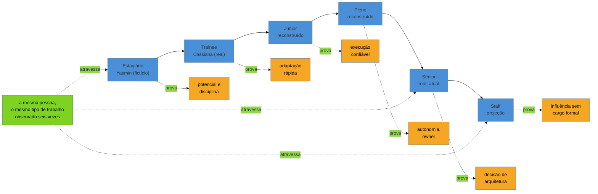

# Seis currículos, uma carreira

> [!abstract] TL;DR
> As 25 notas anteriores deste galho explicaram peça por peça — cabeçalho, sumário, bullet, número, âncora — o que um currículo precisa provar em cada um dos seis níveis que a [[03-Dominios/Carreira/Currículo/03 - Os seis níveis e o que muda entre eles|nota 03]] nomeou. Esta nota não explica mais nada: **mostra**. Seis currículos completos, um por nível — estagiário, trainee, júnior, pleno, sênior, staff —, cada um com a natureza declarada no alto: quatro peças são **reais**, ancoradas em pessoas de carne e osso (uma delas emprestada, com autorização, de outra pessoa; três reconstruídas a partir da própria trajetória pública do autor deste vault); uma peça é **fictícia**, com persona declarada, porque há um degrau da escada — o estágio — por onde o autor nunca passou; e a última é uma **projeção** — o degrau seguinte, ainda não alcançado, escrito como o exercício que a [[03-Dominios/Carreira/Currículo/20 - A âncora|nota 20]] já descreveu ser possível fazer em qualquer ponto da carreira. A leitura que fecha este capstone não é sobre currículo — é sobre o que muda, degrau a degrau, e o que não muda nunca, e sobre o contrapeso que o galho inteiro vem cultivando desde a [[03-Dominios/Carreira/Currículo/01 - Para que serve um currículo|nota 01]]: nenhuma das seis portas se abriu por causa do documento sozinho.

## A composição, e por que ela é honesta sobre a própria origem

Um capstone que promete "seis currículos, uma carreira" tem uma tentação óbvia, e vale nomeá-la antes de começar: seria mais fácil, e mais limpo visualmente, inventar uma única pessoa fictícia e escrever os seis documentos dela do zero, como a [[03-Dominios/Carreira/Currículo/03 - Os seis níveis e o que muda entre eles|nota 03]] fez com Renata e a [[03-Dominios/Carreira/Currículo/07 - O sumário profissional|nota 07]] fez com Camila. Essa opção foi descartada de propósito. Um galho que ensina, na [[03-Dominios/Carreira/Currículo/04 - Quem lê o seu currículo — e o que a evidência diz|nota 04]] e em toda etiqueta `[!example]` que carimbou as 25 notas anteriores, que a **procedência do dado é parte do dado**, não pode fechar com seis documentos inventados só porque inventar é mais conveniente do que ir atrás do real. Por isso esta nota mistura as duas coisas, e diz exatamente onde a linha está.

Das seis peças, **quatro são reais**. A do trainee pertence a **Cassiana Gabriela Lima Barreto**, que autorizou a citação nesta nota em 2026-08-20 — é o documento com que ela conseguiu, de fato, a vaga de trainee que abriu a porta seguinte da carreira dela. As do júnior e do pleno são **reconstruções** — não documentos que existiram tal como aqui reproduzidos, mas currículos montados hoje a partir do registro público e datado da trajetória do autor deste vault, disponível em [josenaldo.com.br/experiences](https://josenaldo.com.br/experiences) e verificado ao vivo em 2026-08-20. A do sênior é o **documento que existe hoje**, público, reunindo a página inicial, a página de contratação e a página de experiências do mesmo site, também verificadas ao vivo na mesma data. Uma peça é **fictícia com persona declarada** — a do estagiário, porque o autor nunca foi estagiário: entrou no mercado direto como júnior, e inventar uma passagem por estágio que nunca aconteceu seria exatamente o tipo de embelezamento que este galho passou 25 notas ensinando a evitar. E a última peça, a do staff, é uma **projeção declarada** — não um registro de nada que já aconteceu, mas o degrau seguinte da mesma carreira, escrito como exercício, na cara do leitor, sem fingir que é mais do que isso.

Cada uma das seis seções abaixo abre com a etiqueta que a régua deste galho inteiro exige — `[!example] Caso real` ou `[!example] Caso fictício` — e, dentro dela, a primeira frase declara se o que segue é registro, reconstrução ou projeção. Essa declaração não é rodapé burocrático: é a própria tese do galho, aplicada a si mesma. Um documento que existe para provar coisas sobre uma carreira só convence quando é honesto sobre a origem das provas que carrega — e este capstone não seria coerente com as 25 notas que o precedem se pedisse ao leitor um padrão de honestidade que ele mesmo não seguisse.

## Estagiário — a persona que o autor nunca foi

O primeiro degrau da escada da [[03-Dominios/Carreira/Currículo/03 - Os seis níveis e o que muda entre eles|nota 03]] é o único que este capstone não pode preencher com a trajetória do próprio autor, pela razão mais simples possível: ele nunca foi estagiário. Entrou no mercado de trabalho em 2003, direto como Java júnior, depois de uma bolsa de iniciação científica — a própria peça seguinte deste capstone conta essa história. Preencher esta seção com um documento inventado como se fosse real seria mentir sobre a procedência do dado; por isso a persona abaixo é fictícia, declarada como tal, e construída para ser coerente com o que a [[03-Dominios/Carreira/Currículo/03 - Os seis níveis e o que muda entre eles|nota 03]] já descreveu sobre o que um currículo de estagiário precisa provar — potencial e disciplina de aprendizado, um compromisso sustentado ao longo do tempo, e algo concreto entregue mesmo sem contexto profissional formal.

> [!example] Caso fictício
> A pessoa abaixo, Yasmin Teixeira, é uma persona inventada para esta nota — nenhuma pessoa real corresponde a este nome e a esta trajetória. Ela cursa o sétimo semestre de Ciência da Computação, ainda sem nenhuma experiência profissional formal, e o currículo que segue foi construído para mostrar exatamente o que a nota 03 descreveu sobre este degrau: a formação pesa mais aqui do que em qualquer outro nível, porque, na ausência de histórico de trabalho, ela é o dado mais concreto disponível — e o projeto de disciplina, levado além do que o enunciado pedia, é o único tipo de evidência que compensa essa ausência.
>
> **Yasmin Teixeira** — São Carlos, SP · yasmin.teixeira.dev\@email-exemplo.com · linkedin.com/in/exemplo-fictício · github.com/exemplo-fictício
>
> **Sumário**
>
> Estudante de Ciência da Computação, sétimo semestre, com base em estruturas de dados, banco de dados relacional e desenvolvimento web, buscando primeiro estágio para aplicar em contexto profissional o que já pratica sozinha em projetos próprios. Foi além do enunciado da disciplina de Banco de Dados ao transformar um exercício de CRUD num sistema de reservas hoje usado por colegas do próprio curso, e mantém um repositório pessoal de exercícios com commits registrados nos últimos dez meses seguidos.
>
> **Formação**
>
> Bacharelado em Ciência da Computação — cursando, sétimo semestre de dez, previsão de conclusão em dezembro de 2027.
>
> **Projetos**
>
> Sistema de Reserva de Salas de Estudo (disciplina de Banco de Dados) — o enunciado pedia um CRUD simples de reservas para nota da disciplina; entreguei, além disso, autenticação por e-mail institucional e notificação automática de conflito de horário entre duas reservas na mesma sala, e disponibilizei o sistema hospedado para uso real do Centro Acadêmico, hoje usado por cerca de quarenta colegas do curso em vez de ficar restrito à correção do professor.
>
> Painel de Consumo de Energia Doméstica (projeto pessoal) — construí um raspador de dados da fatura de energia em PDF e um painel simples de visualização em Python, para acompanhar o próprio consumo mês a mês; mantenho o repositório atualizado desde que o projeto começou, há dez meses, com commits registrados quase toda semana.
>
> **Atividades**
>
> Monitoria voluntária da disciplina de Estruturas de Dados, auxiliando colegas do terceiro semestre em horário de plantão semanal, desde o início deste ano letivo.
>
> Participação em uma maratona de programação universitária, em dupla, resolvendo 4 dos 9 problemas propostos dentro do tempo da prova.
>
> **Habilidades**
>
> Linguagens: Python, Java (disciplinas), SQL. Web: HTML, CSS, fundamentos de Flask. Ferramentas: Git, GitHub, Linux (uso diário).

A sequência das duas seções seguintes — Projetos antes de Formação detalhada de habilidades, mas Formação logo depois do Sumário — segue a orientação que a própria [[03-Dominios/Carreira/Currículo/08 - Formação, cursos e certificações|nota 08]] já registrou sobre este nível: quando não há experiência profissional para ancorar o documento, a formação sobe no documento, não desce. E o bullet do sistema de reservas obedece à fórmula que a [[03-Dominios/Carreira/Currículo/11 - A linha de bullet|nota 11]] fixou — verbo de ação, o que foi feito, resultado —, mesmo sem um número de negócio atrás, porque a [[03-Dominios/Carreira/Currículo/15 - Quando não há número|nota 15]] já ensinou que "usado por cerca de quarenta colegas" é uma consequência honesta quando nenhuma métrica formal existe para medir o impacto de um projeto de disciplina.

## Trainee — a evidência que estava enterrada

A segunda peça deste capstone é a única, das seis, que este autor não viveu — e é, por essa mesma razão, a mais valiosa do conjunto inteiro. Cassiana Gabriela Lima Barreto cursou Engenharia Biomédica na Universidade Federal de Uberlândia entre 2008 e 2015, fez mestrado em Engenharia de Sistemas de Saúde na mesma universidade entre 2016 e 2018, e emendou um doutorado em Sistemas Computacionais e dispositivos aplicados à saúde, também na UFU, iniciado em 2020. Sete desses anos foram passados no laboratório NIATS da UFU, trabalhando com sensores inerciais acoplados a um Arduino, limpeza e integração de dados vindos desses sensores, análise estatística de dados de um hospital público federal, e liderança de uma equipe interdisciplinar de pesquisa. O Python entrou na trajetória dela durante o doutorado, por necessidade da própria pesquisa — não como formação de origem, mas como ferramenta aprendida no meio do caminho porque o trabalho passou a exigir.

O currículo abaixo é o documento com que ela entrou no mercado de tecnologia **antes de concluir o doutorado**, e conseguiu, com ele, a vaga de trainee de ciência de dados na Dadosfera em 2024 — sendo alocada, já na entrada, em engenharia de dados. Menos de um ano e meio depois, foi promovida a júnior. É reproduzido aqui com a estrutura e o conteúdo essencialmente preservados, com duas alterações apenas: o telefone e o e-mail pessoal foram substituídos por um marcador genérico, porque nenhum dado de contato pessoal entra nesta nota, mesmo com autorização de citação; e um bullet da seção de mestrado, que no documento original terminava truncado numa única letra solta, foi simplesmente omitido — não por ser um erro grave, mas porque reproduzi-lo aqui, fora de contexto, seria uma distração do que este caso realmente ensina.

> [!example] Caso real
> Documento cedido diretamente por Cassiana Gabriela Lima Barreto, que autorizou a citação nesta nota em 2026-08-20. Link verificável do perfil citado no próprio documento: [linkedin.com/in/cassianalima](http://www.linkedin.com/in/cassianalima). Este é o currículo pré-Dadosfera, com o qual ela conquistou a vaga de trainee — não uma reconstrução, e não o currículo atual dela, que já reflete a promoção a júnior.
>
> **Cassiana Gabriela Lima Barreto** — Uberlândia, Minas Gerais · [contato pessoal removido nesta reprodução] · linkedin.com/in/cassianalima · github.com/cglima
>
> **Sumário Executivo**
>
> Doutoranda em Engenharia Biomédica com experiência em sistemas computacionais e dispositivos aplicados à saúde.
>
> Mestre em Ciências da Saúde, especializada em engenharia de Sistemas de Saúde, com foco em tecnologias em saúde.
>
> Engenheira Biomédica com base sólida em engenharia com ênfase em processamento de sinais biomédicos e desenvolvimento de dispositivos médicos.
>
> 7 anos de experiência em pesquisa e desenvolvimento no laboratório NIATS — UFU, com foco na aplicação de técnicas de processamento de dados.
>
> Contribuição significativa em projeto de pesquisa de processamento de sinais biomédicos, com destaque para a colaboração no desenvolvimento de um sistema inovador em desenvolvimento para a graduação de tremor de mãos em transplantados renais.
>
> Habilidades avançadas em programação, análise de dados (incluindo coleta, limpeza e integração de dados de diversas fontes) e elaboração de documentos técnicos.
>
> Experiência em liderança de equipes interdisciplinares e mentoria acadêmica.
>
> Professora assistente em universidade particular, orientando projetos acadêmicos.
>
> **Experiência Profissional**
>
> *03/2020 — Atual · Pesquisadora de doutorado em Sistemas Computacionais e dispositivos aplicados à saúde · Universidade Federal de Uberlândia — Uberlândia, Minas Gerais*
>
> Condução de revisão bibliográfica para fundamentar pesquisa e desenvolvimento de sistema de graduação de tremor de mãos de pacientes transplantados renais.
>
> Integração de sensores inerciais (acelerômetro, giroscópio e magnetômetro) ao sistema embarcado Arduino para coleta de dados, incluindo limpeza e integração dos dados provenientes desses sensores.
>
> Elaboração e submissão de projetos de pesquisa para submissão ao comitê de ética em pesquisa.
>
> Preparação para aplicação de modelos de machine learning em dados de sensores inerciais para análise e classificação do tremor de mãos.
>
> *08/2019 — 12/2023 · Consultora Acadêmica Autônoma — Uberlândia, Minas Gerais*
>
> Aplicação de técnicas estatísticas em um conjunto de dados de um projeto de mestrado na área de engenharia clínica, incluindo análise descritiva e exploratória de dados de um hospital público.
>
> Manipulação e análise de dados para fornecer insights relevantes para o projeto.
>
> *03/2020 — 07/2020 · Professora Assistente · Centro Universitário Presidente Antônio Carlos (UNIPAC) — Uberlândia, Minas Gerais*
>
> Orientação de alunos em projetos de trabalho de conclusão de curso, enfatizando habilidades de pesquisa e escrita científica.
>
> Desenvolvimento de material de estudo para concluir trabalho de conclusão de curso em 14 semanas.
>
> Avaliação de trabalhos de conclusão de curso de graduação, oferecendo feedback construtivo para o desenvolvimento profissional dos estudantes.
>
> *03/2016 — 11/2018 · Pesquisadora de mestrado em Engenharia de Sistemas de Saúde · Universidade Federal de Uberlândia (UFU) — Uberlândia, Minas Gerais*
>
> Análise de dados coletados em hospital público federal, incluindo gestão e manipulação de informações.
>
> **Projetos Relevantes**
>
> *Em andamento: Desenvolvimento de sistema de graduação do tremor de mãos em pacientes transplantados renais*
>
> Desenvolvimento de dispositivo para coleta de sinais de tremor das mãos, integrando sensores inerciais ao Arduino.
>
> Construção de sistema desktop para operação da coleta de dados.
>
> Implementação de modelos de machine learning para classificação dos dados coletados.
>
> *Projeto de Processamento de Dados Biomédicos (Disciplina Processamento de Sinais Biomédicos)*
>
> Desenvolvimento de software em MATLAB para processamento de sinais biomédicos.
>
> Implementação de funcionalidades para carregamento, pré-processamento, filtragem e análise de sinais.
>
> Criação de algoritmos para cálculo de medidas estatísticas dos sinais.
>
> Geração de gráficos para visualização dos sinais processados e das medidas estatísticas.
>
> **Formação Acadêmica**
>
> Doutorado em Sistemas Computacionais e dispositivos aplicados à saúde — Universidade Federal de Uberlândia | 2020 — Atual. Ênfase em análise de dados e desenvolvimento de sistemas para saúde.
>
> Mestrado em Engenharia de Sistemas de Saúde — Universidade Federal de Uberlândia | 2016 — 2018. Experiência em análise de dados de saúde e elaboração de projetos de pesquisa.
>
> Graduação em Engenharia Biomédica — Universidade Federal de Uberlândia | 2008 — 2015. Base sólida em engenharia e ciências da saúde, com ênfase em análise de dados e desenvolvimento de dispositivos médicos.
>
> **Informações Adicionais**
>
> Entusiasmada em aplicar conhecimento técnico-científico para criar soluções práticas e tangíveis.
>
> Excelente habilidade em analisar dados e informações com precisão e eficácia, demonstrada através de experiências em pesquisa e desenvolvimento.
>
> Capacidade de assimilar rapidamente novas demandas e autogerenciar responsabilidades, essencial em ambientes de pesquisa e projetos interdisciplinares.
>
> Foco e atenção aos detalhes na execução de processos, garantindo a precisão e qualidade dos resultados obtidos.
>
> Orientada para melhorias contínuas nos procedimentos executados, buscando constantemente aprimorar os métodos e técnicas utilizadas.
>
> Capacidade de storytelling e apresentações, facilitando a comunicação de resultados e conceitos complexos para diferentes públicos.
>
> Dedicada à educação contínua, buscando por oportunidades e experiências enriquecedoras para expandir conhecimentos e habilidades.
>
> **Qualificações e habilidades:** Inglês — Nível B2 · Python · Programação Orientada a Objetos · Análise exploratória de dados (EDA) com Pandas, Numpy · Visualização de dados com Matplotlib, Seaborn, Pyplot · Criação de pipeline ETL/ELT com Python · Criação de Dashboard interativo com PowerBI · Machine learning com scikit-learn · Git/GitHub · MySQL · Conhecimentos básicos em Microsoft Azure · Conhecimentos básicos em Apache Airflow · Modelagem de banco de dados MER e DER · Análises de estatística descritiva e estatística inferencial.
>
> **Cursos:** Aprenda Apache Airflow do Zero com Python! Com certificado! (Udemy — 2024) · Santander Bootcamp 2023 — Ciência de dados com Python (DIO — 2023) · Desbravando o Pandas (Instituto Aaron Swartz — 2023) · Clustering K-means, DBSCAN e Mean Shift (Alura — 2023) · Machine Learning: Lidando com dados de muitas dimensões (Alura — 2023) · Machine Learning: Classificação por trás dos panos (Alura — 2022) · Machine Learning: Classificação com Sklearn (Alura — 2022) · Formação Data Science (Alura — 2021) · Formação Python e Orientação a Objetos (Alura — 2021) · Curso de Planejamento e Gestão de Projetos (Udemy — 2020) · Big Data Fundamentos 2.0 (Data Science Academy — 2020) · Introdução à Ciência de Dados 2.0 (Data Science Academy — 2020).

Vale examinar o que este documento faz e o que ele não faz, porque é a lição mais valiosa das seis peças deste capstone. A leitura ingênua da trajetória de Cassiana até este ponto seria "doutoranda decide, por conta própria, entrar em tecnologia" — mas o currículo mostra outra coisa, mais precisa: **a evidência transferível já estava lá, sete anos antes de a Cassiana precisar dela**. O trabalho de sete anos no laboratório NIATS não foi rotulado, na hora em que aconteceu, como "engenharia de dados" — foi rotulado como pesquisa em engenharia biomédica. Mas a seção de Experiência Profissional deste documento, lida com o vocabulário que a [[03-Dominios/Carreira/Currículo/10 - Inventário de evidência|nota 10]] já ensinou a reconhecer, está cheia de trabalho de dados desde a primeira linha: coleta de sensor, limpeza e integração de dados de múltiplas fontes, análise estatística de um conjunto de dados hospitalar real, liderança de equipe. Nenhuma dessas linhas precisou ser inventada para a candidatura de trainee — precisou ser **reenquadrada**, com o mesmo vocabulário que qualquer vaga de dados usa para descrever o próprio trabalho. É a evidência enterrada que a [[03-Dominios/Carreira/Currículo/02 - As portas de entrada no mercado|nota 02]] já previu que existiria em quem entra pela porta da transição de carreira: a competência técnica não nasceu com a candidatura à Dadosfera, só ficou visível quando alguém a nomeou pelo termo certo.

E há uma segunda lição, mais desconfortável, na seção de Informações Adicionais deste mesmo documento — sete bullets seguidos de exatamente o tipo de clichê sem evidência que a [[03-Dominios/Carreira/Currículo/07 - O sumário profissional|nota 07]] descartou com o teste do oposto absurdo: "entusiasmada", "excelente habilidade", "capacidade de assimilar rapidamente", frases que qualquer candidato do mercado poderia assinar sem alterar uma palavra. Por qualquer régua deste galho, essa seção é anti-padrão puro. E, ainda assim, **este foi o currículo que funcionou** — o documento com que Cassiana entrou na Dadosfera. Isso não é uma refutação de 25 notas ensinando a evitar clichê; é o contrapeso mais honesto que este capstone poderia oferecer sobre o próprio conteúdo do galho: o anti-padrão custou espaço no documento e provavelmente custou um pouco de credibilidade diante de quem o leu com atenção — mas não custou a vaga, porque as sete linhas de evidência real que vieram antes já tinham feito o trabalho pesado de convencer. Um currículo perfeito não é o único tipo de currículo que abre porta; é só o tipo que abre porta com menos atrito e menos risco, o que é uma reivindicação bem mais modesta do que o galho às vezes soa fazendo, e vale a pena registrá-la com a mesma honestidade com que se registra qualquer outro dado deste capstone.

## Júnior — o degrau raro deste conjunto

A terceira peça é uma reconstrução, e a declaração precisa vir antes de qualquer outra coisa: **o documento abaixo não existiu, tal como está reproduzido, em novembro de 2003.** É uma montagem feita hoje, em 2026, a partir do registro público e datado da trajetória profissional do autor deste vault, disponível em [josenaldo.com.br/experiences](https://josenaldo.com.br/experiences), verificado ao vivo em 2026-08-20 — não uma cópia de um arquivo que sobreviveu vinte e três anos guardado em algum lugar. O registro público confirma dois fatos que sustentam esta reconstrução com razoável confiança: entre abril de 2003 e agosto de 2004, houve uma bolsa de iniciação científica no Laboratório de Bioinformática da Universidade Estadual de Santa Cruz (UESC), em Ilhéus; e, a partir de novembro de 2003, uma contratação no CEPEDI, na mesma cidade, com o cargo registrado como **Junior Java Programmer**. Vale marcar, com todas as letras, por que esta é a peça mais rara das seis: quase todo júnior do mercado chega a esse degrau vindo de um estágio — a bolsa de iniciação científica é uma porta de entrada que a [[03-Dominios/Carreira/Currículo/02 - As portas de entrada no mercado|nota 02]] já nomeou, mas que raramente aparece sozinha, sem nenhuma passagem por estágio formal entre ela e a primeira contratação como júnior. É exatamente essa combinação que faz deste caso um material difícil de achar publicado em qualquer lugar — a maioria dos guias de carreira nem prevê esse caminho.

Um dado importante fica de fora do documento a seguir, e fica de fora por honestidade, não por descuido: **o nome do curso de graduação e a instituição de origem não foram localizados nas fontes públicas consultadas para esta reconstrução.** A bolsa de iniciação científica pressupõe matrícula ativa numa graduação, mas nenhuma fonte pública deste vault registra qual curso ou quando a formatura teria ocorrido — e inventar esse dado, mesmo que plausível, seria exatamente o tipo de inferência apresentada como medição que este galho passou 25 notas condenando. A seção de Formação, por isso, simplesmente não aparece no documento abaixo — uma lacuna deixada visível, como a [[03-Dominios/Carreira/Currículo/19 - Declarar lacuna|nota 19]] já ensinou a fazer, em vez de preenchida com um dado que ninguém verificou.

> [!example] Caso real
> Reconstrução feita em 2026-08-20 a partir do registro público e datado de [josenaldo.com.br/experiences](https://josenaldo.com.br/experiences), verificado ao vivo na mesma data — não um documento que existiu tal como aqui reproduzido, e sim uma montagem de hoje sobre fatos públicos de 2003 e 2004: período da bolsa de iniciação científica na UESC (abril de 2003 a agosto de 2004) e cargo registrado na contratação do CEPEDI a partir de novembro de 2003 (Junior Java Programmer).
>
> **Josenaldo de Oliveira Matos Filho** — Ilhéus, Bahia · [contato de época não registrado nas fontes públicas consultadas]
>
> **Sumário**
>
> Programador com experiência em desenvolvimento Java através de iniciação científica em ambiente de pesquisa universitária, tendo integrado sistemas de laboratório e automatizado o processamento de dados de sequenciamento genético usando tecnologias web Java EE. Busca posição de desenvolvedor júnior para consolidar, sob orientação, a base técnica já construída no laboratório.
>
> **Experiência**
>
> *Abril de 2003 — em andamento · Bolsista de Iniciação Científica · Laboratório de Bioinformática, Universidade Estadual de Santa Cruz (UESC) — Ilhéus, Bahia*
>
> Desenvolvi interface web em Java EE (Servlets, JSP) para integrar diferentes sistemas do Laboratório de Bioinformática num único ponto de acesso, consolidando ferramentas que antes rodavam separadas.
>
> Automatizei o processamento de dados de sequenciamento genético usando XML, XSLT e XPath, substituindo parte da transformação manual de dados que os próprios pesquisadores faziam antes.
>
> Utilizei o ambiente NetBeans no desenvolvimento diário, mantendo padrão de código consistente ao longo do projeto.
>
> **Habilidades**
>
> Java SE, Java EE (Servlets, JSP), XML, XSLT, XPath, NetBeans.

Repare no que esta reconstrução deliberadamente não faz: não lista o cargo do CEPEDI como se já fosse experiência passada, porque, no momento em que este currículo teria circulado, essa era exatamente a vaga em disputa, não uma linha do histórico. É a mesma disciplina que a [[03-Dominios/Carreira/Currículo/16 - A seção de experiência profissional|nota 16]] já exige de qualquer currículo real: a seção de experiência descreve o que já aconteceu, não o que está prestes a acontecer. E repare também no que a experiência única disponível precisa carregar sozinha: sem um segundo emprego para comparar, sem nenhum owned result de negócio, o sumário se apoia no mesmo tipo de prova que a [[03-Dominios/Carreira/Currículo/03 - Os seis níveis e o que muda entre eles|nota 03]] já descreveu para este degrau — fundamento técnico demonstrável, não impacto organizacional — e os dois bullets seguem a fórmula da [[03-Dominios/Carreira/Currículo/11 - A linha de bullet|nota 11]] fechando em consequência ("consolidando ferramentas que antes rodavam separadas", "substituindo parte da transformação manual"), não em percentual, porque nenhum número medido sobreviveria à régua da [[03-Dominios/Carreira/Currículo/14 - Números que você pode defender|nota 14]] vindo de um projeto acadêmico de mais de vinte anos atrás.

## Pleno — o arco que formou o profissional

A quarta peça é, como a anterior, uma reconstrução — e a mesma declaração vale aqui: **o documento a seguir não existiu, palavra por palavra, em novembro de 2013.** É outra montagem de 2026 sobre o mesmo registro público de [josenaldo.com.br/experiences](https://josenaldo.com.br/experiences), verificado ao vivo em 2026-08-20, desta vez cobrindo o arco de quatro empregos que o registro documenta entre 2008 e 2015: **Java Developer na SWB** (maio de 2008 a junho de 2009), **Systems Analyst na everis** (julho de 2009 a julho de 2011), **Senior Backend Developer na TQI** (outubro de 2011 a outubro de 2012), e **Senior Java Developer na Sankhya** (novembro de 2013 a janeiro de 2015). O documento abaixo representa o momento de aplicar para a última dessas quatro vagas, a da Sankhya — com as três anteriores já compondo o histórico de experiência.

Um alerta honesto merece entrar antes do documento, porque um leitor atento da [[03-Dominios/Carreira/Currículo/03 - Os seis níveis e o que muda entre eles|nota 03]] vai notar algo estranho: o registro público chama o cargo da TQI de "Senior Backend Developer" — sênior, não pleno. Essa é exatamente a armadilha que a nota 03 já nomeou na abertura do galho inteiro: **cargo formal e nível de senioridade descrito por este galho não são a mesma escala.** Empresas atribuem "sênior" a um cargo por motivos internos de banda salarial, estrutura de carreira ou simplesmente inflação de título — nenhum dos quais precisa corresponder ao vocabulário de prova que a nota 03 descreve para o degrau sênior real (decisão de arquitetura com trade-off nomeado, impacto entre times, primeiro sinal de liderança sem cargo). Lido pelo critério desta nota — o que o documento consegue provar, não o rótulo que a empresa deu ao cargo —, o arco SWB → everis → TQI é mais bem descrito como o degrau pleno: autonomia crescente, um sistema de porte relevante sob responsabilidade real, mas ainda sem o alcance entre times e a mentoria formal que caracterizam o degrau seguinte. Assim como não há Formação nomeada na peça anterior, também não há dados de graduação disponíveis nesta reconstrução, e a mesma lacuna, pelo mesmo motivo, fica visível em vez de preenchida.

> [!example] Caso real
> Reconstrução feita em 2026-08-20 a partir do registro público e datado de [josenaldo.com.br/experiences](https://josenaldo.com.br/experiences), verificado ao vivo na mesma data — não um documento que existiu tal como aqui reproduzido, e sim uma montagem de hoje sobre o arco de quatro empregos documentado entre 2008 e 2015, representando o momento de aplicar para a vaga na Sankhya em novembro de 2013.
>
> **Josenaldo de Oliveira Matos Filho** — Uberlândia, Minas Gerais · [contato de época não registrado nas fontes públicas consultadas]
>
> **Sumário**
>
> Desenvolvedor backend com cinco anos de carreira em Java, com passagem recente por arquitetura backend do Buscapé, uma das maiores plataformas de comparação de preços do país, projetando soluções para lidar com alto tráfego e integração entre sistemas heterogêneos. Histórico anterior em processos certificados CMMI nível 3, com experiência mentorando desenvolvedores menos experientes.
>
> **Experiência**
>
> *Outubro de 2011 — Outubro de 2012 · Senior Backend Developer · TQI — Uberlândia, Minas Gerais*
>
> Projetei e implementei arquiteturas backend em Java (SE e EE) e no ecossistema Spring para sustentar a plataforma de alto tráfego do Buscapé, atuando alocado diretamente na sede do cliente.
>
> Integrei múltiplos sistemas e tecnologias — Java, Spring Framework, PHP, MySQL, Oracle e jQuery — na camada de backend de uma plataforma de e-commerce de grande porte.
>
> *Julho de 2009 — Julho de 2011 · Systems Analyst · everis — Uberlândia, Minas Gerais*
>
> Desenvolvi projetos multi-tecnologia (Java, PHP, HTML, JavaScript, MySQL, Oracle, PL/SQL) para clientes de telecomunicações e outros setores, sob processo de desenvolvimento certificado CMMI nível 3.
>
> Mentorei desenvolvedores menos experientes da equipe e implementei uma prova de conceito integrando Adobe Flex e Java para o sistema de back-office da Telefônica, validando a viabilidade da tecnologia para o cliente.
>
> *Maio de 2008 — Junho de 2009 · Java Developer · SWB — Uberlândia, Minas Gerais*
>
> Implementei sistema de auditoria de execução SQL sobre bancos Oracle usando Oracle LogMiner, garantindo rastreabilidade completa da atividade do banco de dados.
>
> Desenvolvi sistema de avaliação de desempenho para a Hewitt com Struts 2, Spring e Hibernate, e sistema de faturamento com JSP, Servlets e Hibernate.
>
> **Habilidades**
>
> Java SE e EE, Spring, Struts 2, Hibernate, PHP, Adobe Flex, MySQL, Oracle (incluindo LogMiner), PL/SQL, jQuery.

Vale notar o que esta reconstrução não consegue fazer, e por que não força a barra tentando: nenhuma das seis linhas de experiência acima carrega um número medido, no sentido que a [[03-Dominios/Carreira/Currículo/14 - Números que você pode defender|nota 14]] chama de dado com fonte reproduzível — o registro público que sustenta esta reconstrução não guardou métricas desse período, e inventar uma agora, vinte anos depois, seria o tipo exato de falsa precisão que a nota 14 já condenou. O que sobrevive, em cada linha, são proxies honestos — "alocado diretamente na sede do cliente", "validando a viabilidade da tecnologia para o cliente" — exatamente o tipo de consequência que a [[03-Dominios/Carreira/Currículo/15 - Quando não há número|nota 15]] recomenda quando o número medido não existe, e não a alternativa mais tentadora, que seria estimar um percentual de cabeça só para preencher o campo. E a unidade de impacto sobe visivelmente ao longo das três passagens, no mesmo eixo que a [[03-Dominios/Carreira/Currículo/03 - Os seis níveis e o que muda entre eles|nota 03]] já descreveu: da SWB, um sistema isolado de auditoria; da everis, um portfólio de projetos multi-cliente sob certificação de processo; da TQI, uma arquitetura inteira dentro de uma das maiores plataformas de e-commerce do país — o mesmo profissional, o mesmo vocabulário técnico de base, um escopo real e crescente de decisão.

## Sênior — o documento que existe hoje

A quinta peça deixa de ser reconstrução e passa a ser registro direto: o documento abaixo reúne, sem inventar nem uma linha, o que está publicado hoje, 2026-08-20, no site pessoal do autor deste vault — a página inicial, a página de contratação (`/hiring`) e a página de experiências (`/experiences`), todas verificadas ao vivo na mesma data. Ele não é a cópia de um único arquivo de currículo em PDF — é uma montagem, transparente sobre a própria origem, de três peças públicas que já são, cada uma, uma das quatro saídas da mesma âncora que a [[03-Dominios/Carreira/Currículo/20 - A âncora|nota 20]] descreveu: a página inicial fala com quem está decidindo contratar; a página de contratação fala com quem está avaliando o encaixe técnico da vaga; a página de experiências documenta o histórico linha a linha. As três, lidas juntas, formam o que um currículo de sênior faria numa única página — ou, seguindo a régua sem fonte primária que a nota 03 já registrou, em duas.

> [!example] Caso real
> Montagem de 2026-08-20 a partir de três páginas públicas do site pessoal do autor deste vault, todas verificadas ao vivo na mesma data: a página inicial em [josenaldo.com.br](https://josenaldo.com.br) (versão em português, `/pt`), a página de contratação em [josenaldo.com.br/hiring](https://josenaldo.com.br/hiring), e a página de experiências em [josenaldo.com.br/experiences](https://josenaldo.com.br/experiences). Frases entre aspas são citações literais; o restante é síntese factual construída a partir dessas mesmas páginas.
>
> **Josenaldo Matos** — Fractional Software Engineer & Architect. 20+ anos. Uberlândia, Minas Gerais, Brasil · Fuso GMT-3 (horário de São Paulo) · josenaldo.com.br
>
> **Sumário**
>
> "Eu construo a máquina que entrega o seu software." Engenheiro de software sênior com ownership ponta a ponta e entrega AI-native, atuando em contratação remota para LATAM (GMT-3). Assumo plataformas que ficaram perigosas de mudar, ou começo sistemas que não podem chegar lá, e projeto em torno delas uma operação de entrega autônoma — especificações, testes, CI/CD e workflows agênticos que consomem requisitos e produzem software confiável. Já apliquei este mesmo padrão duas vezes, em organizações diferentes, com resultado medido nas duas.
>
> **Experiência**
>
> *Junho de 2024 — atual · Senior Full Stack Developer · MedEspecialista — remoto*
>
> Liderei a modernização de uma plataforma de educação médica em produção nos quatro repositórios centrais — API legada, nova fundação de backend, painel administrativo e frontend do aluno — mantendo a entrega de funcionalidades de negócio em paralelo à melhoria de arquitetura.
>
> "Reduced deployment effort from ~1 hour to ~10 minutes with automated CI/CD and repeatable staging/production workflows." — segundo a página de experiências.
>
> "Reduced a manual monthly follow-up operation from ~1 month to ~2 hours by turning it into an operational module." — segundo a mesma página.
>
> A página de contratação, com data de verificação mais recente, descreve o mesmo engajamento com números atualizados: frequência de deploy elevada de "cerca de um release por trimestre para ~4 por mês", ocorrências reportadas por cliente em produção reduzidas de "~100 para ~5 por mês", sem downtime, deploy reduzido de "~2 horas para ~15 minutos", sustentado por "9.000+ testes automatizados".
>
> *Outubro de 2023 — Abril de 2024 · Senior Full Stack Developer · Muvz — remoto*
>
> "Led the modernization initiative by migrating legacy Java (EJB) services into 5 Spring Boot microservices using Java 17, Spring Security, Spring Data JPA, Spring Cloud OpenFeign, and Apache Kafka." — segundo a página de experiências.
>
> "Improved system performance by over 40%, with faster response times and lower latency." "Eliminated an estimated 3-month project delay, enabling on-time delivery and stronger engineering execution." — ambas da mesma página, referentes à mesma migração.
>
> *Março de 2022 — Agosto de 2022 · Senior Full Stack Developer · Conddiz — remoto*
>
> "Designed and delivered a scalable multi-app ecosystem with 1 backend serving 3 frontends" para uma campanha presidencial brasileira de alta visibilidade, com integrações a seis plataformas sociais diferentes. "Supported traffic peaks of ~200k concurrent users/visitors during critical campaign moments with stable performance", e "the official campaign website achieved over 2 million visits throughout the campaign period." — segundo a página de experiências.
>
> *Fevereiro de 2015 — Novembro de 2016 · Software Architect · Digidados — Uberlândia, Minas Gerais*
>
> "Reduced incident response time from 5 days to 1 business day through automated workflows." "Automated billing generation, reducing processing time from 2 days to 3 minutes." — ambas segundo a página de experiências, referentes a um sistema de gestão condominial atendendo mais de 400 condomínios.
>
> **Liderança de comunidade**
>
> "Led the Java Users Group of Triângulo Mineiro (UAIJUG) from 2009 to 2018" — segundo a página pessoal "Carta a um amigo desconhecido", também publicada no mesmo site. Nove anos organizando eventos, palestras e cursos técnicos numa comunidade regional de Java.
>
> **Habilidades**
>
> Java, Spring (Boot, Security, Data JPA, Cloud OpenFeign), TypeScript, Node.js, React, Next.js, Apache Kafka, Docker, Kubernetes, arquitetura hexagonal, DDD, CI/CD, workflows agênticos de IA aplicados à entrega de software.

Este documento merece o mesmo exame crítico que qualquer um dos anteriores, porque montá-lo a partir de três páginas diferentes, em vez de um único arquivo, é uma escolha que precisa ser justificada, não escondida. A [[03-Dominios/Carreira/Currículo/20 - A âncora|nota 20]] já registrou que a frase-âncora do currículo-base privado do autor — "I build delivery machines." — não tem link público disponível, e que a mesma posição aparece reformulada, em segunda pessoa, na página inicial do site. O que este capstone acrescenta é uma terceira renderização, encontrada na página de contratação verificada hoje: "Eu construo máquinas de entrega." — quase idêntica à frase privada que a nota 20 registrou sem poder linkar, só que esta versão está publicada, em português, com data de verificação própria. As três frases não competem entre si; são a mesma âncora, vista de três ângulos, exatamente como a nota 20 já descreveu: uma declaração sobre si (o currículo-base), uma promessa ao leitor (a página inicial), e um argumento de contratação (a página de `/hiring`) — três saídas, uma origem, nenhuma contradição de substância entre elas.

## Staff — o degrau que ainda não foi alcançado

A sexta e última peça é diferente de todas as anteriores num ponto essencial, e este ponto precisa ficar impossível de ignorar: **o documento abaixo não é registro de nada que já aconteceu.** É uma projeção — o degrau seguinte da mesma escada, escrito hoje como exercício, não como fato. Nenhuma linha dele deve ser lida como uma alegação de que o autor deste vault já ocupa, hoje, um cargo de staff engineer. A [[03-Dominios/Carreira/Currículo/20 - A âncora|nota 20]] já ensinou, na seção sobre por que a âncora também existe no início da carreira, que escrever a versão futura da própria posição, apoiada em fatos reais e não em desejo vazio, é uma técnica genuína — e este capstone, em vez de só descrever essa técnica em prosa, escolheu **executá-la na frente do leitor**, sob a mesma régua de honestidade que reprovaria qualquer aspiração disfarçada de conquista.

O material de que esta projeção parte é real, mesmo que a conclusão não seja: o registro público já mostra o mesmo padrão de "máquina de entrega" aplicado duas vezes, em organizações diferentes — Muvz e MedEspecialista, ambas citadas na peça anterior com resultado medido nas duas —, e nove anos de liderança sustentada de uma comunidade técnica regional (UAIJUG, 2009-2018), que é o tipo mais próximo de mentoria em escala que o registro público já documenta. O degrau de staff, segundo a [[03-Dominios/Carreira/Currículo/03 - Os seis níveis e o que muda entre eles|nota 03]], exige mais do que isso: uma decisão que atravessa várias equipes que a pessoa nunca chegou a conhecer diretamente, e influência organizacional sustentada sem cargo formal de gestão. É exatamente a lacuna entre o que já aconteceu duas vezes e o que precisaria acontecer uma terceira vez, em escala maior, que o exercício abaixo torna visível.

> [!example] Caso fictício
> Projeção declarada, não registro. O documento a seguir descreve um degrau da carreira do autor deste vault que ainda não foi alcançado — um exercício de escrever, hoje, o currículo do nível seguinte, apoiado nos fatos reais já citados na peça anterior, sem afirmar que qualquer resultado abaixo já ocorreu.
>
> **Josenaldo Matos** — Staff Software Engineer (projeção) · Uberlândia, Minas Gerais, Brasil · Fuso GMT-3
>
> **Sumário**
>
> Se o padrão de "máquina de entrega" — hoje aplicado uma vez por engajamento, dentro de uma organização de cada vez — se repetir numa terceira e numa quarta operação distintas, e se a prática de projetar especificação, teste, CI/CD e workflow agêntico ao redor de uma plataforma em erosão passar a ser citada e adotada por engenheiros de fora das equipes onde ela nasceu, este seria o sumário correspondente: "Defino o padrão de entrega autônoma — especificação, teste, CI/CD e workflow agêntico — hoje adotado por engenheiros de times que nunca dependeram diretamente de mim para chegar lá." Nenhuma dessas duas condições ("se... se...") está confirmada no registro público hoje; a frase existe para nomear o que precisaria ser verdade, não para afirmar que já é.
>
> **O que este degrau exigiria provar**
>
> Uma decisão de arquitetura ou de processo de entrega adotada por pelo menos duas equipes que o autor não integrou diretamente — não uma decisão implementada por ele em cada equipe, mas um padrão que outras pessoas passaram a seguir sem supervisão direta.
>
> Mentoria em escala: não um pleno de cada vez, mas vários sêniores, ou várias equipes, num período sobreposto — o degrau que a nota 03 descreve como o topo do eixo de liderança técnica sem cargo de gestão.
>
> Um terceiro e um quarto engajamento em que o mesmo padrão de "máquina de entrega" se repita, com resultado medido de forma comparável ao que já existe hoje para Muvz e MedEspecialista — porque, como a [[03-Dominios/Carreira/Currículo/20 - A âncora|nota 20]] já ensinou sobre a diferença entre âncora e slogan, um padrão citado duas vezes ainda é hipótese em consolidação; só a partir de uma terceira repetição independente ele começa a merecer o nome de âncora sem ressalva.

Vale fechar esta peça com a mesma disciplina que a [[03-Dominios/Carreira/Currículo/20 - A âncora|nota 20]] já aplicou ao próprio conceito de âncora: uma projeção escrita cedo demais, sem os fatos que a sustentam, não é uma ferramenta de carreira — é um slogan disfarçado de meta. O que separa o exercício acima de um desejo vazio é o mesmo teste que a nota 20 já propôs para qualquer âncora candidata: peça para a pessoa contar, com detalhe, os eventos concretos por trás da frase. Aqui, dois desses eventos já existem — Muvz e MedEspecialista, cada um com resultado medido e citável. Os outros dois, que a projeção pede, ainda não aconteceram, e é exatamente essa distinção entre o que já tem prova e o que ainda é hipótese que torna esta peça uma projeção honesta, e não uma sexta mentira educada para fechar bonito um capstone.

## O que muda, o que não muda

Lidas as seis peças em sequência, um padrão fica visível que nenhuma delas, isoladamente, consegue mostrar — e é esse padrão, mais do que qualquer currículo individual, o motivo de este capstone existir. Quatro coisas sobem de forma nítida, degrau a degrau, exatamente como a [[03-Dominios/Carreira/Currículo/03 - Os seis níveis e o que muda entre eles|nota 03]] já previu: a unidade de impacto (de um sistema de reservas usado por quarenta colegas, no currículo de Yasmin, até um padrão de entrega que a projeção de staff imagina adotado por equipes inteiras que o autor nunca integrou); a presença e a precisão do número (do zero número medido nas duas primeiras peças até os percentuais e contagens exatas, com fonte reproduzível, do currículo sênior); o sujeito da frase, que passa de "participei" e "implementei" para "conduzi", "defini" e "estabeleci" — o mesmo eixo verbal que a nota 03 já demonstrou com a trajetória fictícia de Renata; e o escopo de quem sente o efeito do trabalho, que cresce de um projeto de disciplina até uma organização inteira.

E três coisas descem, na direção oposta, também como a nota 03 previu: a lista de tecnologias específicas, generosa nos currículos de Yasmin e do júnior reconstruído, quase ausente no sumário do sênior e completamente ausente do sumário da projeção de staff; a certificação e o curso avulso, que pesam nas peças iniciais e desaparecem depois; e a descrição de tarefa de dia a dia, substituída por decisão e padrão à medida que a escada sobe.

O que o diagrama tenta deixar visível é o eixo horizontal — as seis peças, cada uma provando algo diferente — cruzado com uma linha vertical que atravessa todas elas sem se mover: não é a mesma pessoa em cinco das seis peças (Yasmin é fictícia, Cassiana é outra pessoa), mas é o mesmo **mecanismo**, o mesmo tipo de trabalho de reenquadrar evidência real em prova legível, repetido seis vezes em seis momentos e seis pessoas diferentes. É exatamente esse mecanismo — não a extensão da lista de tecnologias, não o número de anos de carreira — que a [[03-Dominios/Carreira/Currículo/03 - Os seis níveis e o que muda entre eles|nota 03]] chamou, na abertura do galho, de vocabulário certo para cada degrau, e que este capstone finalmente mostrou funcionando, seis vezes, em vez de apenas descrever.

## O contrapeso: nenhuma das seis portas se abriu sozinha

Fica faltando, sem esta seção, a ressalva mais honesta que este galho vem cultivando desde a [[03-Dominios/Carreira/Currículo/01 - Para que serve um currículo|nota 01]]: um currículo bem escrito **gera uma conversa** — é esse o objetivo único que a nota 01 fixou para o documento inteiro, e nenhuma das 25 notas anteriores prometeu mais do que isso. Nenhuma das seis peças deste capstone abriu, sozinha, a porta seguinte da carreira que descreve. No caso do autor deste vault, o degrau de júnior no CEPEDI, em novembro de 2003, não nasceu de uma candidatura anônima respondendo a um anúncio — nasceu porque o orientador da iniciação científica na UESC era, ao mesmo tempo, diretor do CEPEDI, e foi essa ponte pessoal, não o currículo reconstruído nesta nota, que tirou o nome da fila antes mesmo de ele existir como fila. O currículo documentou uma competência real — os dois bullets sobre o sistema de integração do laboratório são fatos, não invenção —, mas a competência documentada e a pessoa que decidiu ler aquele documento com atenção são coisas diferentes, e a segunda raramente aparece por acaso.

O mesmo vale, com a mesma honestidade, para as outras cinco peças. O currículo de Cassiana carregava sete anos de evidência real, reenquadrada com precisão — e, ainda assim, alguém dentro da Dadosfera precisou ler aquele documento, decidir que a trajetória de pesquisa valia uma conversa, e agir sobre essa decisão. O trabalho de Yasmin no sistema de reservas é genuíno dentro da história fictícia que a persona representa, mas nenhum projeto de disciplina, por mais além do enunciado que vá, garante sozinho a atenção de quem lê a candidatura de estágio seguinte — precisa de alguém do outro lado disposto a abrir o arquivo. E a projeção de staff, a mais explícita das seis sobre a própria incompletude, deixa isso ainda mais claro: nenhum sumário bem escrito substitui a terceira e a quarta repetição do padrão que ele descreve, e essas repetições, historicamente, tendem a nascer de alguém que já conhece o trabalho de antes, não de um documento lido a frio.

É essa a lição final deste capstone, e do galho inteiro: **o currículo põe a pessoa na fila; quem tira da fila costuma ser alguém.** As 25 notas anteriores ensinaram como escrever o documento que merece um lugar sério nessa fila — legível por máquina, honesto sobre número, específico sobre resultado, consistente entre as quatro saídas da mesma âncora. Nenhuma delas prometeu que o documento, sozinho, bastaria. Um currículo que finge o contrário — que se apresenta como a causa única de toda porta que se abriu — não é apenas impreciso sobre como carreiras de fato acontecem; é o tipo exato de embelezamento que este galho, desde a primeira nota, pediu para evitar.

## Armadilhas comuns

> [!warning] Copiar a estrutura de um dos seis currículos como se fosse um molde universal
> **O que acontece:** o leitor, impressionado com uma das seis peças acima — mais provavelmente a de sênior, por ser a mais rica em número —, copia a estrutura de seção por seção para o próprio currículo, independentemente do próprio nível de carreira. **Por quê:** ver um exemplo forte funcionando cria a tentação de tratá-lo como fórmula, esquecendo que cada uma das seis peças foi construída para provar exatamente o que a [[03-Dominios/Carreira/Currículo/03 - Os seis níveis e o que muda entre eles|nota 03]] descreveu para aquele degrau específico, não para qualquer degrau. **Como evitar:** voltar à tabela-mapa da nota 03 antes de imitar qualquer uma das seis peças, e perguntar qual currículo — não qual formato — corresponde ao próprio momento de carreira.

> [!warning] Confundir o cargo formal de uma empresa com o nível descrito por este galho
> **O que acontece:** ao ler que a TQI chamava o próprio cargo do autor de "Senior Backend Developer" num momento que este capstone trata como pleno, o leitor conclui que o vocabulário de nível deste galho é subjetivo demais para servir de guia. **Por quê:** títulos de cargo carregam peso de banda salarial e política interna de cada empresa, e é natural supor que eles sigam a mesma régua que a nota 03 descreve. **Como evitar:** lembrar que a nota 03 mede pelo que o **documento precisa provar**, não pelo rótulo que uma empresa específica deu a um cargo — a peça de pleno desta nota já examina esse descompasso com todas as letras, e ele se repete com frequência fora deste capstone também.

> [!warning] Tratar a peça de staff como se já fosse fato consumado
> **O que acontece:** um leitor apressado lê só o sumário da última peça — "Defino o padrão de entrega autônoma... hoje adotado por engenheiros..." — sem reparar na declaração de projeção logo acima, e sai da nota achando que o autor já ocupa um cargo de staff engineer. **Por quê:** a frase, isolada do resto do parágrafo, soa como uma alegação de fato, exatamente porque foi escrita para soar como o sumário real que este nível exige, seguindo o mesmo princípio de BLUF da [[03-Dominios/Carreira/Currículo/07 - O sumário profissional|nota 07]]. **Como evitar:** ler cada uma das seis peças pela etiqueta que abre a seção, não só pelo conteúdo — é exatamente a disciplina que este galho pede de qualquer leitor de currículo real, aplicada aqui ao próprio capstone que a ensina.

## Como soa em inglês

> "This closing note doesn't teach one more résumé rule — it shows six complete résumés, one per career level, each one labeled with exactly where it came from: a real document I was given permission to quote, two reconstructions built today from my own dated public record, the document that's actually live on my site right now, a fictional persona for the one rung I never climbed, and a declared projection for the rung I haven't reached yet. Reading all six side by side, what moves between levels is scope, number precision, and the verb doing the work in each sentence; what stays constant is the same mechanism — real evidence, correctly reframed. And none of the six doors opened because of the document alone. Mine opened because my scientific-initiation advisor also happened to run the company that hired me."

| PT | EN |
| --- | --- |
| currículo reconstruído | reconstructed résumé |
| documento cedido, com autorização | shared document, with permission |
| projeção declarada | declared projection |
| evidência enterrada | buried evidence |
| cargo formal vs. nível descrito | formal job title vs. described level |
| a fila (de candidatos) | the pipeline / the queue |
| tirar alguém da fila | pull someone out of the queue |

## O que vem a seguir

Esta é a última nota do galho — não há próxima nota para a qual apontar. Quem quiser continuar a partir daqui tem dois caminhos naturais: voltar ao [[03-Dominios/Carreira/Currículo/index|índice do galho]] para revisitar qualquer uma das 25 notas que sustentam as seis peças acima, ou seguir para o galho parceiro:

- [[03-Dominios/Carreira/Entrevistas/index|Entrevistas]] — o que cada etapa do funil avalia depois que um dos seis currículos deste capstone já fez o próprio trabalho de gerar a conversa.
- [[03-Dominios/Carreira/Currículo/20 - A âncora|20 - A âncora]] — para quem quiser aplicar, à própria carreira, o mesmo drill-down de quatro camadas que sustenta a peça de sênior e a projeção de staff deste capstone.
- [[03-Dominios/Carreira/Currículo/21 - O brag document|21 - O brag document]] — o hábito que evita que a próxima reconstrução, daqui a vinte anos, dependa da mesma sorte de encontrar um registro público datado que esta nota teve.

## Fontes

- **Cassiana Gabriela Lima Barreto** — currículo cedido diretamente à autoria desta nota em 2026-08-20, com autorização explícita para citação nominal. Link verificável do perfil citado no próprio documento: [linkedin.com/in/cassianalima](http://www.linkedin.com/in/cassianalima). O bullet truncado da seção de mestrado do documento original foi omitido nesta reprodução, sem alterar nenhum outro conteúdo.
- **Josenaldo Matos** — [josenaldo.com.br/experiences](https://josenaldo.com.br/experiences), verificado ao vivo em 2026-08-20. Fonte de todos os fatos de data, cargo e empresa usados nas reconstruções de júnior e pleno, e de parte dos bullets citados verbatim na peça de sênior.
- **Josenaldo Matos** — [josenaldo.com.br](https://josenaldo.com.br) (versão em português, `/pt`) e [josenaldo.com.br/en](https://josenaldo.com.br/en) (versão em inglês), ambas verificadas ao vivo em 2026-08-20. Fonte da frase-âncora da página inicial, citada nas duas versões nesta nota.
- **Josenaldo Matos** — [josenaldo.com.br/hiring](https://josenaldo.com.br/hiring), verificado ao vivo em 2026-08-20. Fonte do sumário e dos números atualizados citados na peça de sênior.
- **Josenaldo Matos** — página "Carta a um amigo desconhecido" (arquivo `content/pages/pt/about.md` do repositório público do site, também acessível como `/pt/about`), verificada em 2026-08-20. Fonte da liderança do UAIJUG (2009-2018) e da data de início da carreira profissional em 2003, usada para confirmar a consistência da reconstrução de júnior.
- Yasmin Teixeira é uma persona fictícia inventada por esta nota, seguindo a mesma convenção de etiquetagem usada em todo o galho para personas sem correspondência real.
- A projeção de staff é elaboração própria desta nota, apoiada nos fatos reais já citados sobre Muvz, MedEspecialista e UAIJUG; não descreve nenhum cargo ou resultado já alcançado.

## Veja também

- [[03-Dominios/Carreira/Currículo/index|Currículo]] — o índice do galho, com a tese e o mapa das 26 notas.
- [[03-Dominios/Carreira/Currículo/03 - Os seis níveis e o que muda entre eles|03 - Os seis níveis e o que muda entre eles]] — o vocabulário de nível que este capstone aplica seis vezes em vez de descrever mais uma.
- [[03-Dominios/Carreira/Currículo/20 - A âncora|20 - A âncora]] — o drill-down de quatro camadas e as duas renderizações da mesma âncora, retomadas na peça de sênior e na projeção de staff.
- [[03-Dominios/Carreira/Currículo/07 - O sumário profissional|07 - O sumário profissional]] — o BLUF aplicado, degrau a degrau, em cada um dos seis sumários deste capstone.
- [[03-Dominios/Carreira/Currículo/11 - A linha de bullet|11 - A linha de bullet]] — a fórmula por trás de cada bullet reproduzido ou reconstruído nesta nota.
- [[03-Dominios/Carreira/Currículo/14 - Números que você pode defender|14 - Números que você pode defender]] — os três níveis de confiança que separam os números da peça de sênior das consequências honestas das peças mais antigas.
- [[03-Dominios/Carreira/Currículo/16 - A seção de experiência profissional|16 - A seção de experiência profissional]] — ordem e densidade decrescente, seguidas em todas as seis experiências reproduzidas ou reconstruídas.
- [[03-Dominios/Carreira/Currículo/19 - Declarar lacuna|19 - Declarar lacuna]] — a disciplina de deixar a lacuna visível, aplicada às seções de Formação ausentes nas reconstruções de júnior e pleno.
- [[03-Dominios/Carreira/Currículo/01 - Para que serve um currículo|01 - Para que serve um currículo]] — o objetivo único do documento, retomado no contrapeso final desta nota.
