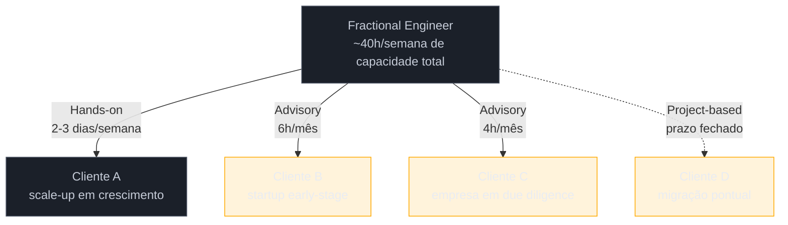

> [!abstract] TL;DR
> Fractional engineering é atuar como executivo ou especialista técnico sênior (CTO, Engineering Lead, Staff Engineer) em regime part-time e recorrente, por retainer mensal, em vez de vínculo full-time. O que define "fractional" não é a seniority — é a estrutura do contrato: uma fração fixa e repetida do seu tempo, não um projeto pontual nem um cargo integral. Existem três modelos de engajamento (advisory, hands-on, project-based), cada um com carga horária e responsabilidade bem diferentes. O ponto central: um fractional é operador, não consultor — ele participa das decisões e responde pelos resultados, não só recomenda.

## O problema que o modelo resolve

Uma startup com 8 engenheiros precisa de decisões de arquitetura sérias — vale a pena migrar pra microsserviços agora? o time está pronto pra isso? — mas não tem caixa pra um CTO full-time de $350 mil por ano (salário + equity + benefícios + custo de recrutamento). Contratar júnior demais pra "aguentar" a vaga é pior: decisões erradas custam caro e demoram meses pra aparecer. Contratar um consultor tradicional também não resolve — ele entrega um relatório e vai embora, sem ficar pra ver a decisão sair do papel.

É exatamente essa lacuna — sênior demais pra não precisar, pequeno demais pra pagar full-time — que o fractional engineering preenche. Do lado do profissional, o mesmo buraco aparece invertido: alguém com 15 anos de experiência como Head of Engineering não quer necessariamente voltar a um único empregador, mas também não quer virar consultor genérico que só dá palpite. Ele quer continuar sendo o dono técnico de um problema, só que em várias empresas ao mesmo tempo, cada uma recebendo uma fração do seu tempo.

## Como funciona o mecanismo

> [!question]- Fractional não é só "trabalhar meio período"?
> Trabalho meio período (part-time employee) ainda é vínculo — um empregador, salário fixo, benefícios, geralmente exclusividade. Fractional é **prestação de serviço recorrente para múltiplos clientes simultaneamente**, estruturada como retainer: você vende uma fatia fixa e repetida da sua capacidade (ex: "8 horas por semana, todo mês"), não um número de horas soltas nem um cargo. A diferença central é que o fractional mantém uma carteira de clientes — geralmente 2 a 4 — em paralelo, cada um recebendo sua fração.

O nome vem daí: você é uma **fração** do que seria um executivo full-time, dividida entre organizações. O termo se popularizou a partir de meados dos anos 2010 no ecossistema de startups americano, primeiro com "Fractional CFO" (finanças é a função mais antiga a adotar esse modelo, porque devia contas trimestrais e não precisa de presença diária), depois se espalhando pra CTO, CMO, Head of People e, mais recentemente, para papéis técnicos abaixo de C-level — Engineering Lead fractional, Staff Engineer fractional.

### Os três modelos de engajamento

Nem todo engajamento fractional é igual. A carga horária e o nível de responsabilidade variam por modelo:

| Modelo | Carga típica | O que o fractional faz | O que NÃO faz |
|--------|--------------|-------------------------|----------------|
| **Advisory** | 4-8h/mês | Participa de reuniões de liderança, revisa decisões de arquitetura, avalia propostas de fornecedor, mentora o engenheiro mais sênior do time | Não escreve código, não gerencia sprints, não é responsável pelo dia a dia |
| **Hands-on** | 2-3 dias/semana | É funcionalmente o CTO/Eng Lead em regime parcial: lidera revisões de arquitetura, gerencia pipeline de contratação, faz 1:1 com engenheiros sênior, representa tecnologia em reuniões de board | Não está presente todos os dias — decisões urgentes fora da janela combinada esperam ou passam por um ponto de contato interno |
| **Project-based** | Variável, com prazo definido | Entrega um output específico: due diligence técnica pra M&A, plano de migração de plataforma, roadmap de auditoria de segurança | O engajamento **termina** quando o entregável é aceito — não é recorrente por padrão |

Advisory e hands-on são recorrentes (retainer mensal contínuo); project-based tem início e fim definidos, mesmo que às vezes vire retainer depois.

## Por que "operador, não consultor" importa

> [!question]- Qual a diferença prática entre um consultor e um fractional CTO hands-on?
> Um consultor entrega um documento com recomendações e a responsabilidade de executar fica com o cliente. Um fractional CTO no modelo hands-on **participa da execução**: ele está no standup, aprova o PR de arquitetura, faz a entrevista final de um candidato sênior, e é ele quem vai explicar pro board por que a migração atrasou. Ele é avaliado pelo resultado técnico do time, não pela qualidade do relatório que escreveu.

Essa distinção é o que justifica o preço. Um fractional CTO cobra na faixa de $8.000 a $25.000 por mês dependendo da carga e da seniority — caro para um "conselho eventual", barato comparado a um CTO full-time de $300 mil a $450 mil por ano contando salário, equity, benefícios e custo de recrutamento. A empresa está comprando responsabilidade por resultado, em fração de tempo, não um parecer.

**Fractional engineering em uma frase:** vender uma fração fixa e recorrente da sua capacidade executiva/técnica sênior para múltiplos clientes, sendo responsável pelo resultado técnico de cada um, não apenas por opinar sobre ele.

## Como a fração se distribui na prática

O diagrama mostra o padrão típico de uma carteira madura: um engagement hands-on consome a maior fatia da semana, enquanto vários advisory cabem nas horas restantes. O project-based entra e sai — não ocupa uma fatia fixa da agenda no longo prazo, por isso a linha pontilhada.

## Casos práticos

### Cenário 1: startup Series A contratando advisory

Uma startup fintech, 12 pessoas, acabou de captar Series A. O time técnico é competente mas júnior em decisões de escala — nunca lidou com volume real de transações, não sabe avaliar se a arquitetura atual aguenta 10x o tráfego. Contratar um CTO full-time agora seria prematuro: o cargo mudaria de escopo em 12 meses, quando o time dobrar. A empresa fecha um fractional CTO advisory, 6 horas por mês: participa da reunião mensal de board, revisa cada decisão de arquitetura antes de virar código, e faz par com o engenheiro mais sênior do time uma vez por mês. Resultado esperado: decisões de arquitetura mais seguras, sem o custo (nem o compromisso de longo prazo) de um executivo full-time.

### Cenário 2: scale-up sem CTO peça de reposição

Uma scale-up de 25 pessoas perdeu o CTO fundador, que saiu pra outro projeto. Contratar um substituto full-time levaria 4-6 meses (processo seletivo para C-level é lento) e o time não pode ficar sem direção técnica nesse meio-tempo. A empresa contrata um fractional CTO hands-on, 3 dias por semana, com mandato explícito: estabilizar a operação, conduzir o processo seletivo do CTO permanente, e fazer a transição de conhecimento quando a pessoa certa for contratada. Esse é um uso comum do modelo hands-on — ponte temporária de liderança técnica, não substituto permanente disfarçado.

## Armadilhas comuns

> [!warning] Tratar advisory como se fosse hands-on
> **O que acontece:** a empresa espera que o fractional responda dúvidas urgentes fora da janela combinada, participe de decisões do dia a dia, ou "esteja disponível" além do que foi contratado. **Por quê:** o modelo advisory é dimensionado pra 4-8 horas por mês — dá pra revisar decisões estruturais, não pra acompanhar a operação diária. Sem um ponto de contato interno que absorve o dia a dia, o fractional vira gargalo ou a empresa fica frustrada com a "falta de presença". **Como evitar:** definir por escrito, no contrato, o que está dentro e fora do escopo advisory — e nomear quem decide no dia a dia quando o fractional não está disponível.

> [!warning] Confundir fractional com "freela de arquitetura"
> **O que acontece:** a empresa trata o engajamento como um projeto de consultoria pontual — pede um documento, aceita, encerra — e nunca chega a testar se o fractional entrega resultado operando junto com o time. **Por quê:** isso ignora o que diferencia fractional de consultoria tradicional (ver [[02 - Fractional vs freelance vs consultoria vs indie hacker]]): o valor está em ficar por perto o suficiente pra ver a decisão sair do papel, não em produzir um relatório. **Como evitar:** desenhar o engajamento com cadência recorrente (retainer), não como entrega única, mesmo em fases iniciais de teste.

> [!warning] Assumir que "fractional" significa "júnior barato"
> **O que acontece:** empresas em fase de corte de custo tentam contratar um fractional por preço de freelancer júnior, esperando o mesmo nível de responsabilidade de um executivo sênior. **Por quê:** o preço do fractional reflete anos de experiência prévia em cargo equivalente full-time — não é trabalho "descontado", é trabalho fatiado. Um fractional CTO bom não vai aceitar retainer abaixo do que sua hora efetivamente vale. **Como evitar:** calcular o retainer a partir do valor-hora equivalente ao cargo full-time (ver [[05 - Precificação — retainer, hourly e project-based]]), não a partir do orçamento disponível.

## Como explicar em inglês

Fractional work is part-time, recurring engagement structured as a retainer — not a full-time role, not a one-off freelance project. A fractional CTO operates alongside the team; they don't just hand over a report and leave, they're accountable for the technical outcome within their allotted time.

| PT | EN |
|----|----|
| Engajamento fractional | Fractional engagement |
| Retainer mensal | Monthly retainer |
| Regime advisory | Advisory model |
| Regime hands-on (mão na massa) | Hands-on model |
| Baseado em projeto | Project-based |
| Operador, não consultor | Operator, not an advisor |

## Veja também

- [[Fator R — tributação para devs PJ]] — a operação fractional no Brasil passa por PJ; entender o Fator R é pré-requisito pra precificar corretamente
- [[03-Dominios/Carreira/Empreendedorismo/Indie Hacker 101/index|Indie Hacker 101]] — outro modelo de trabalho independente, com trade-offs bem diferentes do fractional

## O que vem a seguir

Fractional é só um dos vários modelos de trabalho independente — antes de escolher esse caminho, vale entender como ele se diferencia de opções vizinhas (freelance, consultoria, indie hacking) e em que momento, dos dois lados da mesa, esse modelo realmente faz sentido.

- [[02 - Fractional vs freelance vs consultoria vs indie hacker]] — onde fractional se encaixa no espectro de trabalho independente
- [[03 - Quando contratar e quando virar fractional]] — os gatilhos que levam uma empresa a contratar e um profissional a migrar pra esse modelo

## Fontes

- **fractionaljobs.io** — [Fractional Jobs](https://www.fractionaljobs.io/) — marketplace e guia de referência sobre o modelo fractional em geral: definição, faixas de carga horária (2-30h/semana) e remuneração ($5K-15K/mês ou $55-250/hr)
- **Fractionus** — [Fractional CTO: What They Do and When You Need One (2026)](https://fractionus.com/blog/fractional-cto-what-they-do-when-you-need-one) — detalhamento dos três modelos de engajamento (advisory, hands-on, project-based) e faixas de retainer ($8K-25K/mês)
- **Kompella.io** — [What Is a Fractional CTO? The Definitive Guide for 2026](https://kompella.io/thinking/what-is-a-fractional-cto) — comparação de custo entre fractional e CTO full-time ($300K-450K/ano)
