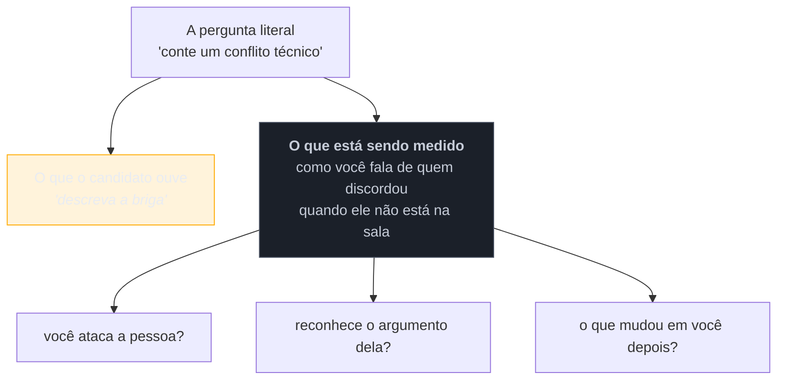

# O que uma entrevista sênior avalia

> [!abstract] TL;DR
> Numa entrevista júnior, a pergunta de fundo é **"você sabe?"**. Numa sênior, ela muda para **"você decide bem, e o que acontece com as pessoas em volta quando você decide?"** — e essa troca explica por que candidatos tecnicamente excelentes são reprovados sem entender o motivo. Todo o processo é uma tentativa de extrair **sinal** sobre julgamento, escopo de impacto e colaboração, usando perguntas que quase nunca dizem literalmente o que estão medindo. Este galho parte daí: entender o critério vale mais que decorar respostas, porque o critério sobrevive à pergunta que você não previu.

## O candidato que acertou tudo e foi reprovado

Um engenheiro com quinze anos de experiência faz um processo. Resolve o problema de código com uma solução elegante, em menos tempo que o previsto. Conhece o framework em profundidade — corrige o entrevistador num detalhe de implementação, e está certo. No system design, desenha uma arquitetura sofisticada, com cache distribuído, fila e sharding.

Recebe um "não" com o retorno vago de sempre: *"decidimos seguir com outro candidato, mas gostamos muito do seu perfil"*.

O que aconteceu, quase sempre, é alguma variação disto: no problema de código, ele não perguntou nada antes de escrever — assumiu os requisitos. No system design, ele não perguntou quantos usuários o sistema teria; a arquitetura sofisticada era para uma escala que ninguém pediu, e ele nunca considerou a solução simples. Ao ser corrigido, corrigiu de volta com uma segurança que, do outro lado da mesa, pareceu inflexibilidade.

**Nada disso é falha técnica. Tudo isso é sinal** — e sinal negativo. Ele foi avaliado o tempo todo em algo que a pergunta literal não mencionava.

## A mudança de critério

O que se avalia muda de natureza conforme a senioridade, e essa é a chave que reorganiza a preparação inteira:

| | Júnior/Pleno | **Sênior** |
| --- | --- | --- |
| Pergunta de fundo | *você sabe fazer?* | *você decide bem?* |
| Código | a solução funciona | como você chegou nela, e o que descartou |
| Arquitetura | conhece os componentes | escolhe o **mínimo** que resolve |
| Erro | evitou o bug | reconhece o custo do que escolheu |
| Escopo | sua tarefa | seu time, o sistema, o negócio |
| Pessoas | colabora | destrava, influencia, mentora |
| Incerteza | pede especificação | **age sob ambiguidade** e explicita premissas |

Repare que a coluna da direita é quase toda sobre **julgamento**, não sobre conhecimento. Conhecimento é pré-requisito: sem ele você não passa da triagem técnica. Mas ele deixa de ser o diferencial, porque todos os finalistas o têm.

Um segundo eixo, mais desconfortável de aceitar: a partir de certo nível, **a entrevista avalia como você fala das outras pessoas**. Como você descreve o time anterior, o gestor que discordou, o código que herdou. Isso não é teste de simpatia — é a melhor amostra disponível de como você vai falar da empresa atual daqui a dois anos, e de como opera quando discorda de alguém.

## Sinal e ruído

Do outro lado da mesa, o entrevistador tem 45 minutos e um problema difícil: prever seu comportamento futuro a partir de uma amostra pequena, enviesada e ensaiada. Ele busca **sinal** — evidência que correlaciona com desempenho real — em meio a muito **ruído** (nervosismo, familiaridade com o formato, quão bem você fala).

Quem responde ao que a pergunta **diz** produz um relato do conflito. Quem responde ao que ela **mede** produz um relato que mostra como avaliou o argumento do outro, o que concedeu e o que aprendeu — e essa é a resposta que sobrevive à pergunta de acompanhamento.

**Em uma frase:** a preparação eficaz não é ter uma resposta pronta por pergunta; é entender o critério por trás da família de perguntas, porque o critério cobre também a variação que você não ensaiou.

> [!question]- Se é tudo julgamento, estudar conteúdo técnico não adianta?
> Adianta, e é condição de entrada — a diferença é o **papel** que ele cumpre. Domínio técnico é o que te faz **passar** nas etapas de filtro; julgamento é o que te faz **ser escolhido** entre os que passaram. Errar um conceito central do seu próprio stack elimina, por mais julgamento que você demonstre. O erro de calibração é o inverso: candidatos sêniores costumam investir 90% do tempo de preparação no eixo em que já são fortes — o técnico — e quase nada no eixo que efetivamente decide. Vale notar que este vault trata os dois lados: o conteúdo técnico de cada domínio tem casa própria (ver a fronteira abaixo), e este galho cuida do resto.

## O que este galho cobre — e o que não

Este galho é sobre **o processo, o comportamental, a comunicação e a negociação**. Ele não ensina conteúdo técnico, porque isso já tem casa:

| Você quer | Vá para |
| --- | --- |
| o que perguntam sobre **um domínio técnico** | as notas *"X em entrevista"* de cada galho — [[03-Dominios/Tecnologia/TypeScript/27 - TypeScript em entrevista\|TypeScript]], [[03-Dominios/Ciência/Banco de Dados/16 - Banco de dados em entrevista\|Banco de Dados]], [[03-Dominios/Ciência/Redes e Protocolos/15 - Redes em entrevista\|Redes]], entre outras |
| conduzir uma entrevista de **system design** | [[03-Dominios/Engenharia/Arquitetura/System Design/index\|System Design]] — trilha completa com framework e [[03-Dominios/Engenharia/Arquitetura/System Design/Conduzindo a entrevista completa\|capstone]] |
| **inglês** — fluência e vocabulário | [[03-Dominios/Carreira/Inglês/index\|Carreira/Inglês]] |
| o **processo** e como se comportar nele | **este galho** |

> [!info] Sobre os exemplos deste galho
> Todos os casos citados aqui são **genéricos e fictícios** — "uma fintech de 40 pessoas", "um time que herdou um monólito". O galho ensina o método; o repertório de histórias reais de cada pessoa é material privado, por natureza. A nota [[10 - O banco de histórias]] trata justamente de **como construir o seu**, sem conter nenhuma.

## Armadilhas comuns

> [!warning] Preparar-se só no eixo técnico
> **O que acontece:** semanas resolvendo exercícios de algoritmo e revisando arquitetura, zero tempo estruturando histórias — e a reprovação vem na etapa comportamental ou no painel com o hiring manager. **Por quê:** é o eixo em que o candidato sênior já é forte, então praticar dá sensação de progresso. E o eixo comportamental parece "conversa", algo que não se estuda. **Como evitar:** distribua o tempo pelo funil real. Se metade das etapas não é técnica, metade da preparação não deveria ser.

> [!warning] Responder à pergunta literal
> **O que acontece:** "conte sobre um fracasso" recebe um relato de fracasso alheio, ou um humblebrag ("trabalhei demais"). O entrevistador não obtém o sinal que buscava e anota ausência de autocrítica. **Por quê:** ninguém disse ao candidato o que a pergunta mede, e o instinto é proteger a imagem. **Como evitar:** antes de responder, pergunte-se **o que isto quer descobrir sobre mim**. Pergunta de fracasso mede se você consegue olhar para o próprio erro sem terceirizar — a resposta precisa conter uma decisão sua que se mostrou errada.

> [!warning] Confundir segurança com rigidez
> **O que acontece:** o candidato defende cada escolha com convicção total, rejeita sugestões do entrevistador e "ganha" todas as discussões. Recebe a avaliação de difícil de trabalhar. **Por quê:** em contexto de avaliação, parece que ceder é perder pontos. É o contrário: uma boa parte do painel existe para observar como você reage a uma ideia diferente da sua. **Como evitar:** trate a sugestão como dado novo — considere em voz alta, diga o que ela melhora e sob que condição você mudaria de posição. **Mudar de ideia com bom motivo é sinal positivo**, não fraqueza.

## Como soa em inglês

> "The bar shifts as you get more senior. For a mid-level role the underlying question is 'can you do this?'; for a senior one it's 'do you make good calls, and what happens to the people around you when you do?'. That's why technically strong candidates get rejected without understanding why — they jumped straight into coding without clarifying requirements, or designed for a scale nobody asked about, or corrected the interviewer in a way that read as inflexible. None of that is a technical failure, but all of it is signal. So the way I prepare is to ask what a question is actually measuring rather than what it literally says. 'Tell me about a conflict' isn't asking for the conflict — it's watching how you talk about someone who disagreed with you when they're not in the room."

| PT | EN |
| --- | --- |
| sinal / ruído | signal / noise |
| julgamento | judgement |
| escopo de impacto | scope of impact |
| sob ambiguidade | under ambiguity |
| explicitar premissas | to state assumptions |
| pergunta de acompanhamento | follow-up question |
| régua / nível exigido | the bar |

## O que vem a seguir

Entendido o critério, falta o terreno: um processo internacional tem várias etapas, conduzidas por pessoas diferentes, e **cada uma decide uma coisa distinta**. Saber qual é qual muda o que você prioriza em cada conversa.

- [[02 - A anatomia do funil internacional]] — as etapas, quem conduz e o que cada uma decide.
- [[03 - Fale sobre você — o pitch de abertura]] — a pergunta mais previsível e a mais desperdiçada.
- [[12 - Red flags que sêniores produzem sem perceber]] — o inverso desta nota, para quem quer ir direto ao ponto.

## Veja também

- [[03-Dominios/Engenharia/Arquitetura/System Design/index|System Design]] — a etapa técnica que tem trilha própria.
- [[03-Dominios/Carreira/Inglês/index|Inglês]] — o galho parceiro, para articulação no idioma.

## Fontes

- **Gayle Laakmann McDowell** — *Cracking the Coding Interview* — a referência sobre o formato técnico e o que os avaliadores registram.
- **Will Larson** — *Staff Engineer* (2021) — o que distingue níveis sênior e staff em escopo e influência, base do eixo desta nota.
- **Laszlo Bock** — *Work Rules!* (2015) — por que entrevistas não estruturadas preveem mal desempenho, e a busca por sinal comparável.
- **Camille Fournier** — *The Manager's Path* (2017) — a perspectiva de quem contrata, e o peso da colaboração na decisão.
