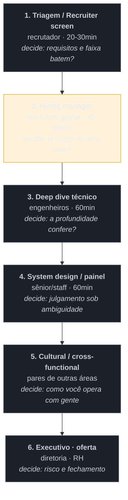

# A anatomia do funil internacional

> [!abstract] TL;DR
> Um processo remoto internacional tem entre quatro e sete etapas, conduzidas por **pessoas diferentes, com poderes diferentes e critérios diferentes** — e o erro mais comum é tratar todas como "a entrevista". O recrutador filtra por requisitos e faixa salarial; o hiring manager decide se te quer no time; o painel técnico verifica profundidade; a etapa cultural checa como você opera com outros; e a rodada executiva costuma ser sobre risco e fechamento. A mesma história precisa de **versões de tamanhos diferentes** conforme a etapa, e a pergunta útil antes de cada conversa é sempre a mesma: *o que esta etapa decide?*

## Quatro conversas, quatro conversas diferentes

Um candidato prepara "a resposta sobre o projeto de migração" — uma versão detalhada, de quatro minutos, com a arquitetura, as tecnologias e os números.

Ele usa **a mesma versão** com o recrutador, que precisava saber em trinta segundos se ele tem experiência com sistemas distribuídos e perde o fio no meio. Usa com o hiring manager, que queria entender por que ele tomou aquela decisão e recebe uma lista de tecnologias. Usa no painel técnico, onde finalmente é a versão certa. E usa na rodada executiva, onde o interlocutor não conhece nenhum dos termos e conclui, educadamente, que o candidato não sabe falar com o negócio.

Uma única preparação, quatro resultados — dois ruins, um neutro, um bom. **A história estava certa; o dimensionamento estava errado três vezes.**

## O mapa do funil

O âmbar não é acaso: **a conversa com o hiring manager é a mais decisiva do processo** e a mais subestimada. É a única pessoa que sai da mesa com o problema — se você for contratado, ela convive com a decisão todo dia. Costuma ter poder de veto e, em muitas empresas, poder de puxar alguém adiante apesar de uma nota morna em outra etapa.

O formato varia: startups pequenas comprimem tudo em três conversas; empresas grandes acrescentam um *hiring committee* que decide sem nunca ter falado com você — a partir das anotações. Esse detalhe tem consequência prática: **o que não foi escrito pelo entrevistador não existe**, então respostas memoráveis e com números sobrevivem melhor à transcrição do que impressões gerais.

## O que cada etapa realmente decide

| Etapa | Quem conduz | O que **decide** | O que reprova |
| --- | --- | --- | --- |
| Triagem | recrutador (não técnico) | requisitos objetivos, faixa salarial, visto/fuso | expectativa fora da faixa; não saber resumir |
| Hiring manager | seu futuro gestor | **quer você no time?** | falar mal do emprego atual; não ter perguntas |
| Deep dive | engenheiros do time | a profundidade confere com o currículo | respostas rasas sobre o que você diz dominar |
| System design | sênior/staff | julgamento sob ambiguidade | não clarificar; superdimensionar |
| Cultural | pares de outras áreas | colaboração, comunicação com não-técnicos | jargão; desprezo por produto ou suporte |
| Executivo | diretoria | risco, motivação, fechamento | não saber por que **aquela** empresa |

Duas assimetrias que vale internalizar:

**A triagem só reprova.** O recrutador raramente decide contratar — ele decide *não desperdiçar o tempo do time*. É a etapa de menor upside e maior downside: você não ganha o emprego ali, mas perde. Daí a importância de responder à questão salarial com cuidado, assunto de [[14 - Negociação de oferta (capstone)|Negociação]].

**A etapa cultural não é formalidade.** É a que mais reprova candidatos sêniores tecnicamente aprovados — porque testa exatamente o que a nota anterior descreve: como você fala de outras pessoas e o que acontece em volta quando você decide.

> [!question]- Como saber em que etapa estou e o que ela decide?
> **Pergunte ao recrutador** — e essa pergunta é bem-vista, não invasiva. Vale pedir, logo na triagem: quantas etapas o processo tem, quem participa de cada uma, quanto tempo dura e qual é o formato da parte técnica. Recrutador competente responde tudo isso de bom grado, porque candidato bem preparado facilita o trabalho dele. E, se a resposta for evasiva ou o processo tiver oito rodadas sem clareza, você acabou de receber uma informação relevante sobre a empresa — o processo seletivo é a primeira amostra de como aquela organização funciona.

## Dimensionar a mesma história

Como a mesma experiência atravessa várias etapas, o que muda é a **profundidade e o eixo**:

| Etapa | Duração | Eixo da mesma história |
| --- | --- | --- |
| Triagem | ~30s | o **quê** e o resultado, sem detalhe técnico |
| Hiring manager | ~2min | a **decisão** e por que você a tomou |
| Deep dive | 5-10min | o **como**, com trade-offs e alternativas descartadas |
| Cultural | ~2min | as **pessoas** — quem discordou, como convergiram |
| Executivo | ~1min | o **impacto de negócio**, sem jargão |

Preparar uma história é, portanto, preparar **cinco versões dela** — o que é bem mais trabalho do que decorar um texto, e bem mais robusto, porque obriga a entender qual é a essência de cada ângulo.

## Armadilhas comuns

> [!warning] Tratar a triagem como conversa informal
> **O que acontece:** o candidato relaxa com o recrutador "porque não é técnico", responde a expectativa salarial de improviso e ancora abaixo do que a vaga pagaria — ou é eliminado por dizer um número fora da faixa sem saber qual era. **Por quê:** a etapa parece burocrática. Mas é a única em que um número dito em cinco segundos vale, às vezes, dezenas de milhares por ano. **Como evitar:** trate a triagem como a etapa mais irreversível. Pesquise a faixa antes, e prefira devolver a pergunta ("qual a faixa prevista para a posição?") antes de dar um número.

> [!warning] Ignorar quem conduz a etapa
> **O que acontece:** resposta cheia de jargão para um par de produto; resposta superficial para um staff engineer que queria profundidade. Nos dois casos a avaliação é a mesma: não calibra a comunicação. **Por quê:** o candidato prepara conteúdo, não audiência — e o convite raramente diz o cargo de quem vai entrevistar. **Como evitar:** pergunte antecipadamente **quem** participa de cada etapa e qual o cargo. Com o nome em mãos, uma olhada no perfil público resolve o calibre da conversa.

> [!warning] Chegar sem perguntas
> **O que acontece:** ao fim da conversa, "alguma pergunta?" recebe um "não, ficou tudo claro". É registrado como baixo interesse — e, num sênior, como falta de critério para avaliar onde vai trabalhar. **Por quê:** o candidato pensa a entrevista como exame, e no exame não se pergunta. **Como evitar:** leve duas ou três perguntas **por etapa**, calibradas para quem está do outro lado — técnicas para engenheiros, de prioridade e processo para o gestor, de estratégia para o executivo. O assunto tem nota própria: [[13 - A entrevista reversa]].

## Como soa em inglês

> "A remote international process usually has four to seven stages, and the mistake is treating them as one interview. The recruiter screen filters on hard requirements and salary band — that stage mostly rejects, it rarely hires, so it's the least forgiving one. The hiring manager conversation is the one that really decides, because that's the person who lives with the outcome. The technical panel verifies depth, the cultural round looks at how you work with people, and the executive round is usually about risk and closing. What that means in practice is that a single story needs several versions: thirty seconds for the recruiter, two minutes on the decision for the manager, ten minutes with trade-offs for the panel, and one minute of business impact for the executive. And it's completely fair to ask the recruiter up front how many stages there are and who's in each one."

| PT | EN |
| --- | --- |
| triagem inicial | recruiter screen |
| gestor contratante | hiring manager |
| painel técnico | technical panel |
| rodada / etapa | round / stage |
| comitê de contratação | hiring committee |
| faixa salarial | salary band / range |
| poder de veto | veto power |

## O que vem a seguir

Quase toda etapa do funil começa com a mesma pergunta — e ela é, simultaneamente, a mais previsível do processo inteiro e a que mais candidatos sêniores desperdiçam.

- [[03 - Fale sobre você — o pitch de abertura]] — a abertura como problema de edição.
- [[04 - Contratação remota internacional]] — o que muda quando o empregador está em outro país.
- [[13 - A entrevista reversa]] — as perguntas que você faz em cada etapa.

## Veja também

- [[01 - O que uma entrevista sênior avalia]] — o critério por trás de todas as etapas.
- [[03-Dominios/Engenharia/Arquitetura/System Design/Conduzindo a entrevista completa|Conduzindo a entrevista de System Design]] — a etapa 4, em profundidade.

## Fontes

- **Gayle Laakmann McDowell** — *Cracking the Coding Interview* — descrição dos formatos de loop e do papel de cada etapa.
- **Laszlo Bock** — *Work Rules!* (2015) — o comitê de contratação e por que a decisão sai das anotações, não da impressão.
- **Will Larson** — *Staff Engineer* (2021) — o que painéis avaliam em níveis sênior e acima.
