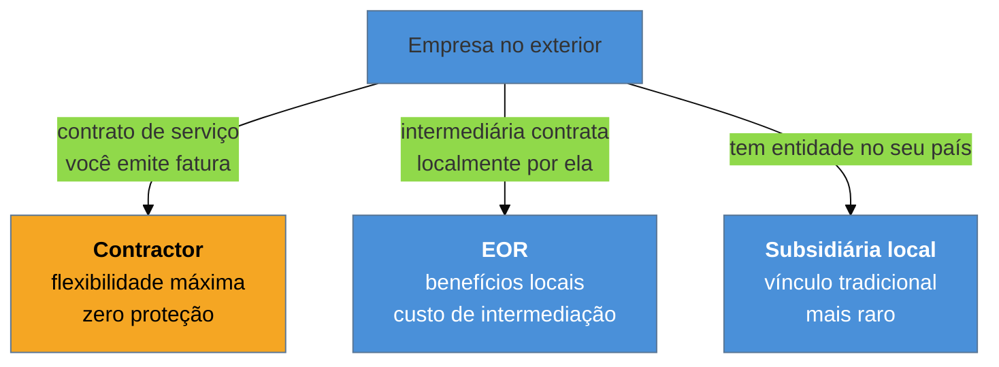

# Contratação remota internacional

> [!abstract] TL;DR
> Passar na entrevista é metade do problema; a outra metade é **sob que arranjo você será contratado** —
> e ela quase nunca é discutida antes da oferta, quando já é tarde para se preparar. As três formas
> usuais são **contractor** (você emite fatura; máxima flexibilidade, zero rede de proteção), **EOR**
> (uma empresa intermediária te contrata localmente em nome da estrangeira; benefícios sem que ela abra
> subsidiária) e **subsidiária local** (vínculo tradicional). Some-se a isso **fuso horário** — que é
> critério eliminatório real, não detalhe — e a assimetria de faixas entre regiões. Esta nota descreve o
> terreno; **não é aconselhamento jurídico nem fiscal**.

> [!warning] O que esta nota não é
> Um panorama para você **saber o que perguntar** — a um contador, a um advogado, ao recrutador. Regras
> tributárias e trabalhistas variam por país, mudam com frequência e dependem da sua situação. Nada aqui
> substitui profissional habilitado, e valores citados são ordens de grandeza, não cotações.

## A oferta que chegou e ninguém sabia responder

Depois de cinco etapas, chega a oferta: um valor anual em dólares, bem acima do que a pessoa ganha hoje. A alegria dura até a frase seguinte: *"você será contratado como contractor"*.

E aí vêm as perguntas que ninguém fez antes: esse valor é bruto ou líquido? Quem paga imposto, e quanto? Tem férias remuneradas? Se eu ficar doente por um mês, recebo? Existe décimo terceiro? E se me desligarem, tem aviso prévio? Quem paga o plano de saúde? A empresa reembolsa equipamento?

Sem essas respostas, é impossível saber se a oferta é melhor ou pior que o emprego atual — e a comparação direta entre um valor bruto em dólar e um salário líquido local é enganosa em uma direção que costuma favorecer a oferta na aparência.

**A hora de entender o arranjo é antes**, porque ele muda tanto quanto o número.

## As três modalidades

| | **Contractor** | **EOR** | **Subsidiária local** |
| --- | --- | --- | --- |
| Vínculo | prestação de serviço | emprego, via intermediária | emprego direto |
| Quem recolhe imposto | **você** | a intermediária | o empregador |
| Férias remuneradas | não (você se paga) | sim | sim |
| Afastamento por doença | **não** | sim | sim |
| Rescisão | conforme contrato, muitas vezes curto | regra local | regra local |
| Benefícios | nenhum por padrão | pacote local | pacote local |
| Flexibilidade | máxima | média | menor |
| Frequência | muito comum | crescente | rara fora de big tech |

**Contractor** é o arranjo mais comum em contratação internacional de tecnologia, porque é o mais simples para a empresa — ela não precisa de presença legal no seu país. O valor costuma parecer maior justamente porque **embute o que você terá de prover sozinho**: sua reserva para férias, sua previdência, seu plano de saúde, seu equipamento, seu risco de interrupção.

**EOR** cresceu muito com a normalização do trabalho remoto. Uma empresa especializada emprega você localmente e "aluga" seu trabalho à contratante. Você ganha carteira, benefícios e proteção da lei local; a empresa paga uma taxa de intermediação por isso.

> [!question]- Como comparar um valor de contractor com um salário local?
> Não compare valores brutos — compare **o que sobra e o que está coberto**. Um roteiro razoável: parta do valor anual proposto; subtraia a carga tributária real do seu enquadramento (pergunte ao contador, não estime); subtraia o que você terá de pagar e que hoje vem do empregador — plano de saúde, previdência, equipamento; e reserve o equivalente às férias e a algum período sem contrato. O que restar é o número comparável. Um segundo fator, menos óbvio, é o **risco**: contrato de contractor costuma ter rescisão curta, então parte da diferença é prêmio por instabilidade — e vale perguntar-se se o valor compensa isso no seu momento de vida.

## Fuso horário: critério, não detalhe

É o requisito eliminatório mais subestimado. Muitas vagas remotas exigem uma **janela de sobreposição** com o time — quatro horas é um número comum — e essa exigência elimina candidatos antes de qualquer avaliação técnica.

Vale entender o que está por trás: times distribuídos funcionam por **assincronia**, mas ainda precisam de uma janela comum para decisão, incidente e ritual. Quando o anúncio diz "must overlap with EST until 1pm", isso não é preferência: é o horário em que as decisões acontecem.

O ponto prático para candidatos na América Latina é que o fuso é uma **vantagem competitiva real** frente a candidatos da Europa ou da Ásia para vagas norte-americanas — e vale dizer isso explicitamente na conversa, porque é um argumento que o recrutador entende de imediato.

## A assimetria de faixas

O mesmo cargo é remunerado de forma muito diferente conforme a região do **empregador** e a do **empregado**, e as empresas adotam políticas distintas: algumas pagam por localidade (ajustando ao custo de vida local), outras pagam faixa única global, e muitas ficam num meio-termo por região.

Três consequências práticas:

**Saber a política importa tanto quanto saber a faixa.** Pergunte cedo se a empresa ajusta por localidade — é pergunta legítima e a resposta muda completamente a expectativa.

**A referência local é uma âncora perigosa.** Responder à pergunta de expectativa com base no que se ganha hoje, num mercado de menor faixa, ancora a negociação num patamar que não é o da vaga. O assunto é de [[14 - Negociação de oferta (capstone)|Negociação]].

**Pesquise antes.** Faixas por cargo, região e empresa são públicas em agregadores de compensação, e chegar sem esse dado é entrar numa negociação com informação assimétrica.

## Armadilhas comuns

> [!warning] Comparar bruto internacional com líquido local
> **O que acontece:** a oferta parece três vezes melhor; depois de impostos, plano de saúde, previdência e reserva de férias, a diferença real é bem menor — às vezes desfavorável, considerando estabilidade.
> **Por quê:** os dois números não são da mesma natureza, mas parecem, porque ambos são "quanto eu ganho".
> **Como evitar:** faça a conta **antes** de negociar, com um contador. Chegar à conversa de oferta sabendo seu número líquido-equivalente muda a qualidade da negociação.

> [!warning] Descobrir a modalidade só na oferta
> **O que acontece:** cinco etapas depois, você descobre que é contractor sem benefícios — e agora precisa decidir sob pressão de prazo, com o custo emocional de ter investido semanas.
> **Por quê:** parece cedo demais ou deselegante perguntar isso no começo.
> **Como evitar:** pergunte na **triagem**. "Qual o modelo de contratação para esta posição — contractor, EOR ou entidade local?" é uma pergunta profissional e comum. Recrutador experiente responde na hora, e a resposta te poupa semanas.

> [!warning] Ignorar o custo do equipamento e do ambiente
> **O que acontece:** a pessoa assume o arranjo sem verificar quem paga notebook, monitor, cadeira, internet e coworking. Em contrato de contractor, o default costuma ser: você.
> **Por quê:** em emprego tradicional isso é invisível — o equipamento simplesmente aparece.
> **Como evitar:** trate como item de negociação. Orçamento de equipamento, *home office stipend* e verba de aprendizado são itens comuns e frequentemente concedidos, inclusive quando o salário-base está travado.

## Como soa em inglês

> "Something worth clarifying early is the engagement model, because it changes the offer as much as the number does. There are basically three: contractor, where you invoice and handle your own taxes and benefits; an employer of record, where a local company employs you on behalf of the client, so you get local benefits without them opening an entity; and a local subsidiary, which is a regular employment relationship and much rarer. I ask about it in the recruiter screen, because a contractor figure and a local salary aren't comparable — the contractor number has to absorb taxes, health insurance, equipment and unpaid time off. The other thing I'd surface early is time zone overlap: for a LATAM-based candidate applying to a US company that's usually an advantage, and it's worth saying out loud."

| PT | EN |
| --- | --- |
| modelo de contratação | engagement model |
| prestador de serviço | contractor |
| empregador registrado | employer of record (EOR) |
| sobreposição de fuso | time zone overlap |
| ajuste por localidade | location-based pay |
| pacote de remuneração | compensation package |
| verba de equipamento | home office stipend |

## O que vem a seguir

Entendido o terreno, volta-se ao começo do funil: antes de qualquer conversa existe um filtro que você não vê acontecendo, e ele opera sobre dois documentos.

- [[05 - Currículo e LinkedIn como artefatos de triagem]] — o filtro que decide se haverá conversa; fecha o bloco Iniciado.
- [[14 - Negociação de oferta (capstone)]] — onde este terreno vira números.
- [[02 - A anatomia do funil internacional]] — a etapa em que perguntar sobre modalidade.

## Veja também

- [[13 - A entrevista reversa]] — outras perguntas que revelam como a empresa funciona.
- [[03-Dominios/Carreira/Empreendedorismo/index|Empreendedorismo]] — o galho vizinho, para quem opera como PJ.

## Fontes

- **GitLab** — [*Remote Playbook* e o handbook público](https://handbook.gitlab.com/handbook/company/culture/all-remote/) — a documentação pública mais completa sobre operação de time distribuído, incluindo fuso e assincronia.
- **Basecamp (Fried & Hansson)** — *Remote: Office Not Required* (2013) — a lógica de sobreposição de horário e trabalho assíncrono.
- **levels.fyi** e agregadores equivalentes — faixas por cargo, região e empresa; a referência pública para pesquisar antes de negociar.
