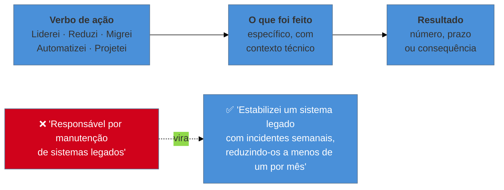

# Currículo e LinkedIn como artefatos de triagem

> [!abstract] TL;DR
> Currículo não é autobiografia: é um **artefato funcional** com um único objetivo — passar por um filtro e gerar uma conversa. Quem lê tem dezenas de candidaturas e dá a cada uma uma varredura de segundos, muitas vezes depois de um sistema já ter filtrado por palavra-chave. Isso muda tudo: a unidade que importa é a **linha de bullet**, e a fórmula que funciona é *verbo de ação + o que foi feito + resultado mensurável*. A construção mais fraca do gênero — e a mais comum — é **"responsável por"**, porque descreve atribuição em vez de realização. O LinkedIn cumpre função diferente: é onde recrutador **procura ativamente**, então ele responde a busca, não a leitura.

## Sete segundos e uma varredura

Uma vaga remota internacional atrai centenas de candidaturas. Quem tria não lê: **varre**, em ordem, procurando confirmar ou descartar — anos de experiência, tecnologias-chave, empresas reconhecíveis, estabilidade, localização e fuso.

Antes disso, é comum que um sistema de rastreamento (ATS) já tenha filtrado por termos da descrição da vaga. Currículo em formato criativo — duas colunas, ícones, tecnologias em barrinhas de proficiência, PDF que é imagem — costuma atravessar mal esse processamento, e o candidato nunca descobre: ele apenas não recebe resposta.

**O erro de enquadramento é tratar o currículo como registro do que você fez.** Ele não é arquivo histórico; é peça de comunicação com um leitor específico, apressado e cético, cujo trabalho é encontrar motivos para descartar. O bom currículo não descreve uma carreira: **remove motivos de descarte e cria um motivo de conversa**.

## A unidade que importa: a linha de bullet

Currículos não são lidos em parágrafos — são varridos em linhas. A linha é, portanto, a unidade de projeto:

**Por que "responsável por" é a construção mais fraca:** ela informa o que estava no seu escopo, não o que aconteceu por causa de você. Duas pessoas com a mesma atribuição podem ter resultados opostos, e é justamente essa diferença que o leitor quer. Toda linha que começa com "responsável por" pode ser reescrita começando por um verbo no passado.

**Sobre números.** Nem toda realização tem métrica, e inventar é inaceitável — é a única coisa que pode custar a vaga depois de conquistada. Mas há mais números disponíveis do que se imagina: tempo (de deploy, de resposta a incidente, de onboarding), volume (requisições, usuários, registros), quantidade (serviços, times, integrações) e frequência (incidentes por mês, releases por semana). Quando não houver, sirva **consequência**: o que passou a ser possível depois.

## O que cada artefato está medindo

**O currículo mede aderência e clareza.** Aderência: os requisitos objetivos batem? Clareza: você consegue descrever o próprio trabalho de forma inteligível para alguém que não estava lá? Um currículo confuso sugere comunicação confusa — e comunicação é critério de senioridade.

**O LinkedIn mede descoberta e consistência.** Ele não é currículo em outra plataforma: é onde recrutador **busca**, com filtros de cargo, tecnologia, localização e senioridade. Isso significa que ele responde a **busca** antes de responder a leitura: o título e os termos que você usa determinam se você aparece. E ele é verificado contra o currículo — divergência de datas ou de cargos é sinal negativo desproporcional ao tamanho do erro.

> [!question]- Preciso adaptar o currículo para cada vaga?
> Não do zero, e não adianta reescrever tudo. O que rende é ter uma **base sólida** e ajustar duas coisas: o **resumo do topo** (duas ou três linhas que espelham o que aquela vaga pede) e a **ordem e ênfase dos bullets** nas experiências recentes, promovendo o que a descrição enfatiza. Se a vaga fala em sistemas legados, a linha sobre estabilização vai para o topo; se fala em escala, a de performance sobe. É trabalho de minutos, não de horas — e é o que faz a diferença entre parecer um candidato genérico e um candidato para aquela vaga. Um detalhe prático: use os termos da descrição, não sinônimos, porque tanto o filtro automático quanto o leitor humano procuram as palavras que eles escreveram.

## Especificidades do processo internacional

- **Idioma:** currículo em inglês, sempre, e escrito em inglês — não traduzido literalmente do português. Construções calcadas soam estranhas e custam credibilidade.
- **Dados pessoais:** foto, idade, estado civil e documento **não** entram — em vários países isso é evitado por razões de viés e conformidade, e a presença sinaliza desconhecimento do mercado.
- **Fuso e disponibilidade:** vale declarar explicitamente a janela de sobreposição, pelo motivo tratado em [[04 - Contratação remota internacional]].
- **Tamanho:** duas páginas é limite razoável para carreiras longas; a terceira quase nunca é lida.
- **Formato:** PDF com texto selecionável, layout de coluna única, sem tabelas nem caixas de texto para conteúdo essencial.

## Armadilhas comuns

> [!warning] Listar atribuições em vez de realizações
> **O que acontece:** o currículo descreve o cargo — "responsável por desenvolvimento e manutenção de aplicações" — e poderia pertencer a qualquer pessoa naquele cargo, em qualquer empresa. **Por quê:** é assim que descrições de vaga são escritas, então o formato parece o correto para descrever trabalho. **Como evitar:** teste linha a linha — *outra pessoa no mesmo cargo poderia escrever isto?* Se sim, a linha descreve o cargo, não você. Reescreva começando por verbo no passado e terminando em resultado.

> [!warning] Formato que quebra na triagem automática
> **O que acontece:** duas colunas, ícones e gráficos de proficiência viram texto embaralhado no processamento. O candidato é descartado por um filtro que nunca leu o conteúdo de verdade. **Por quê:** o design foi pensado para impressionar um humano, e o primeiro leitor não é humano. **Como evitar:** coluna única, cabeçalhos textuais, sem conteúdo essencial dentro de imagem ou tabela. Vale o teste de copiar o texto do PDF e colar num editor: se sair ilegível, o filtro leu ilegível.

> [!warning] Perfil que não bate com o currículo
> **O que acontece:** cargos e datas divergem entre os dois. O recrutador nota, e a leitura de uma inconsistência trivial é desproporcional — passa a sensação de descuido ou de omissão deliberada. **Por quê:** o LinkedIn costuma ser atualizado em outro momento, com menos cuidado, e ninguém revisa os dois lado a lado. **Como evitar:** trate os dois como **uma fonte** com duas apresentações. Ao atualizar um, revise o outro no mesmo dia — especialmente datas, títulos e nomes de empresa.

## Como soa em inglês

> "I treat the CV as a functional artefact, not a biography — its only job is to pass a filter and start a conversation. Whoever screens it has dozens of applications and gives each one a few seconds, often after an ATS has already filtered on keywords from the job description. So the unit of work is the bullet: an action verb, what you actually did, and a measurable outcome. The weakest and most common construction is 'responsible for', because it describes the remit rather than the result — two people with identical responsibilities can have opposite outcomes, and that difference is exactly what the reader is looking for. LinkedIn does a different job: it's where recruiters search, so it has to answer a query before it answers a reader, and it gets checked against the CV — so inconsistent dates cost more than you'd expect."

| PT | EN |
| --- | --- |
| triagem | screening |
| sistema de rastreamento | applicant tracking system (ATS) |
| verbo de ação | action verb |
| realização | accomplishment |
| atribuição | remit / responsibility |
| adaptar à vaga | to tailor to the role |
| palavra-chave | keyword |

## O que vem a seguir

Isso fecha o bloco **Iniciado** — o critério, o funil, a abertura, o terreno contratual e os documentos. O próximo bloco muda de assunto: dos artefatos e do processo para **os formatos de resposta**, começando pela estrutura que organiza toda pergunta comportamental.

- [[06 - STAR e suas variantes]] — a estrutura da resposta; abre o bloco Adepto.
- [[07 - A taxonomia das perguntas comportamentais]] — as famílias e o que cada uma mede.
- [[10 - O banco de histórias]] — de onde vêm os resultados que este currículo afirma.

## Veja também

- [[03 - Fale sobre você — o pitch de abertura]] — a versão falada do que o currículo diz por escrito.
- [[02 - A anatomia do funil internacional]] — a etapa de triagem em que estes artefatos operam.

## Fontes

- **Gayle Laakmann McDowell** — *Cracking the Coding Interview* — o capítulo sobre currículo técnico e o critério de varredura.
- **Laszlo Bock** — *Work Rules!* (2015) — o que a triagem em escala realmente procura, da perspectiva de quem a desenhou.
- **Will Larson** — *Staff Engineer* (2021) — como descrever escopo e impacto em níveis sênior e acima.
