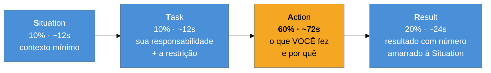

# STAR e suas variantes

> [!abstract] TL;DR
> STAR — **Situation, Task, Action, Result** — é a estrutura padrão para responder pergunta comportamental, e quase todo mundo a conhece. O que quase ninguém respeita é o **time-box**: a proporção saudável é 10% / 10% / **60%** / 20%, com alvo de dois minutos. A Action é o coração porque é onde o julgamento aparece; contextualizar demais é o erro mais comum, e ele consome justamente o tempo da parte que decide. Para histórias de fracasso, a variante obrigatória é **STAR-L**, com *Learning* — sem ele, o relato é confissão sem conclusão. E há um detalhe de linguagem que muda a percepção mais do que parece: dizer **"eu"** onde você realmente agiu.

## Noventa segundos de contexto e trinta de execução

Pergunta: *"conte sobre um projeto tecnicamente desafiador"*.

O candidato começa pela empresa — o que ela fazia, quantas pessoas tinha, como era organizada. Passa para o sistema: a arquitetura anterior, por que estava daquele jeito, quem tinha construído. Descreve o problema em detalhe, com histórico. Aos noventa segundos, chega ao que **ele** fez: *"aí a gente migrou pra uma arquitetura de serviços e melhorou bastante"*. Fim.

Noventa segundos de cenário e trinta de execução — e a execução, que era o objeto da pergunta, saiu em uma frase, no plural, sem número.

O contexto não estava errado; estava **desproporcional**. E a razão é compreensível: contexto é a parte fácil de contar, porque é narrativa e não exige julgar as próprias escolhas. É exatamente por isso que a estrutura precisa de proporção declarada — sem ela, todo mundo derrapa para o mesmo lado.

## O time-box

| Parte | O que entra | O que **não** entra |
| --- | --- | --- |
| **Situation** | o problema de negócio, em 2-3 frases | história da empresa, organograma, stack completa |
| **Task** | sua responsabilidade isolada + a maior restrição | a solução (ela é Action) |
| **Action** | suas decisões, alternativas descartadas, **o porquê** | código linha a linha; o que o time fez sem você |
| **Result** | número ou consequência, ligado ao problema inicial | "ficou bem melhor" |

**Por que a Action leva 60%:** é o único trecho onde o julgamento aparece. Situation e Task são cenário; Result é consequência. A decisão — o que você considerou, o que descartou e sob que critério — só cabe na Action, e é literalmente o que a entrevista sênior está medindo.

**Por que o Result precisa fechar o círculo:** se a Situation abriu com "o deploy demorava horas e travava o time", o Result tem de responder **àquilo**. Resultado que não conversa com o problema inicial deixa a impressão de história montada.

## STAR-L e as outras variantes

| Variante | Estrutura | Quando usar |
| --- | --- | --- |
| **STAR** | Situation · Task · Action · Result | padrão para qualquer pergunta comportamental |
| **STAR-L** | + **Learning** | **obrigatória** em pergunta de fracasso, erro ou conflito |
| **PAR / CAR** | Problem·Action·Result / Challenge·Action·Result | versões comprimidas, boas para 30-60 segundos |
| **SOAR** | Situation·Obstacle·Action·Result | quando o obstáculo é o ponto da história |

O **L** não é enfeite. Numa pergunta de fracasso, a resposta sem aprendizado é um relato de algo que deu errado — e o entrevistador fica sem saber se você entendeu por quê. O Learning é onde a resposta deixa de ser confissão e vira evidência de que você extrai método do erro. Uma formulação eficiente: *o que eu faria diferente hoje, e o que mudei na minha prática desde então*.

## A linguagem: "eu" e os verbos

Dois detalhes pequenos com efeito grande na percepção.

**"Eu" × "nós".** Trabalho de engenharia é coletivo, e o instinto de dar crédito ao time é saudável — mas a entrevista avalia **você**, e o entrevistador não tem como separar sua contribuição de um "nós" genérico. A regra prática: use "nós" para o contexto e o resultado coletivo, e **"eu" para as suas decisões**. Dizer "eu propus separar o processamento em fila, o time discutiu e ajustamos a proposta" é preciso e generoso ao mesmo tempo.

**Verbos.** Existe uma diferença real entre o verbo que descreve execução e o que descreve condução — e ela é mais visível em inglês, onde "I helped with", "I worked on" e "I did" soam a quem recebeu tarefa:

| Em vez de | Prefira | Comunica |
| --- | --- | --- |
| I worked on | **I led / I drove** | condução |
| I helped lead | **I spearheaded** | iniciativa |
| I used | **I leveraged** | escolha deliberada |
| I avoided problems | **I mitigated** | gestão de risco |
| I rewrote | **I overhauled** | escopo da mudança |
| I improved | **I streamlined / I reduced** | resultado específico |

> [!warning] O limite disso
> Verbo forte com conteúdo fraco piora a impressão. "I spearheaded" seguido de uma ação trivial soa inflado, e entrevistador experiente percebe na pergunta seguinte. O verbo deve **descrever com precisão** o que você fez — se você de fato ajudou e não liderou, dizer "I contributed to" é mais forte que exagerar e ser desmentido no follow-up.

> [!question]- Não é artificial responder tudo em estrutura?
> A estrutura é para **você**, não para o entrevistador — ele não deve percebê-la. O que ele nota é uma resposta que começa onde precisa, não se perde e termina com um resultado. Duas ressalvas úteis. Primeira: nem toda pergunta comportamental pede STAR — "como você gosta de trabalhar?" pede opinião, não história, e forçar o formato soa mecânico. Segunda: o entrevistador **vai interromper** com perguntas no meio da Action, e isso é bom sinal — significa que ele achou algo interessante. Volte ao ponto depois de responder; a estrutura serve justamente para você saber onde estava.

## Armadilhas comuns

> [!warning] Situation que consome a resposta
> **O que acontece:** noventa segundos de contexto e trinta de execução — o cenário da abertura desta nota. A parte que decide fica sem tempo. **Por quê:** contexto é a parte confortável: é narrativa, não exige avaliar as próprias escolhas, e dá sensação de estar sendo completo. **Como evitar:** cronometre uma vez, de verdade. A Situation cabe em duas ou três frases: qual era o problema **de negócio** e por que ele importava. O resto do cenário, se for necessário, virá por pergunta.

> [!warning] Action sem o "porquê"
> **O que acontece:** a resposta lista o que foi feito — "criei o serviço, configurei a fila, escrevi os testes" — e não menciona nenhuma decisão. Vira relatório de tarefas. **Por quê:** o "o quê" é factual e fácil de lembrar; o "porquê" exige reconstruir o raciocínio e assumir uma escolha. **Como evitar:** para cada ação principal, acrescente a alternativa descartada e o critério. "Optei por fila em vez de chamada síncrona porque o pico era irregular e a operação tolerava atraso" mostra julgamento em uma frase.

> [!warning] Não ter história de fracasso preparada
> **O que acontece:** a pergunta vem — e vem, em processo sênior — e o candidato improvisa um fracasso pequeno ou disfarçado ("sou perfeccionista demais"). Registra-se ausência de autocrítica, que é pior que o fracasso original. **Por quê:** preparar histórias de sucesso é agradável; preparar as de fracasso exige revisitar erro real. **Como evitar:** tenha ao menos duas, em **STAR-L**, com uma decisão sua que se mostrou errada — não circunstância externa, não erro de outra pessoa. O Learning é o que transforma o relato em ponto positivo.

## Como soa em inglês

> "STAR is the standard structure, and most people know it — what they don't respect is the time-box. The proportion that works is roughly ten percent situation, ten percent task, sixty percent action and twenty percent result, aiming for about two minutes. The action gets the bulk because it's the only part where your judgement shows: situation and task are scene-setting, result is consequence. The most common failure is spending ninety seconds on context and thirty on what you actually did, which is understandable — context is the comfortable part to narrate. For failure questions I'd always use STAR-L, adding what I learned, because without it the story is just a confession. And I try to say 'I' for decisions and 'we' for collective outcomes — an interviewer can't extract your contribution from a generic 'we'."

| PT | EN |
| --- | --- |
| pergunta comportamental | behavioral question |
| tempo delimitado | time-box |
| contexto mínimo | minimal context |
| alternativa descartada | discarded alternative |
| aprendizado | takeaway / learning |
| apropriar-se do resultado | to own the outcome |
| pergunta de acompanhamento | follow-up |

## O que vem a seguir

A estrutura resolve **como** contar. Falta saber **o que** cada pergunta quer ouvir — porque a mesma história, contada com a mesma estrutura, serve ou não serve conforme a família da pergunta.

- [[07 - A taxonomia das perguntas comportamentais]] — as famílias e o que cada uma mede.
- [[10 - O banco de histórias]] — como montar o repertório que alimenta estas respostas.
- [[11 - Comunicar trade-offs sob pressão]] — a Action, aprofundada.

## Veja também

- [[01 - O que uma entrevista sênior avalia]] — por que a Action é a parte que decide.
- [[03 - Fale sobre você — o pitch de abertura]] — a resposta que não usa STAR.

## Fontes

- **Gayle Laakmann McDowell** — *Cracking the Coding Interview* — o formato STAR aplicado a entrevista técnica.
- **Laszlo Bock** — *Work Rules!* (2015) — por que entrevistas estruturadas e perguntas comportamentais preveem melhor que as não estruturadas.
- **Camille Fournier** — *The Manager's Path* (2017) — o que um gestor extrai de uma história bem contada, e o peso do "eu" × "nós".
