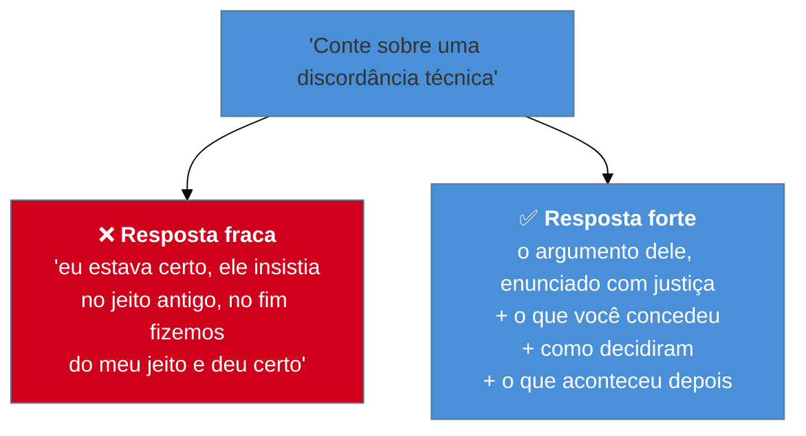

# A taxonomia das perguntas comportamentais

> [!abstract] TL;DR
> Parecem infinitas e não são: as perguntas comportamentais se organizam em **sete famílias**, e cada família mede uma coisa específica que a pergunta não diz. A de conflito não quer o conflito — quer ver **como você fala de quem discordou de você**. A de fracasso não quer o fracasso — quer ver se você consegue olhar para o próprio erro sem terceirizar. Reconhecer a família em dois segundos vale mais que ter cinquenta respostas prontas, porque as variações de enunciado são infinitas e as famílias são sete. E a mesma história costuma servir a várias, com **ênfase diferente**.

## Cinquenta perguntas, sete respostas

Um candidato monta uma lista de cinquenta perguntas prováveis e escreve uma resposta para cada. Na entrevista, ouve: *"me conte sobre uma vez em que você teve que convencer alguém a mudar de abordagem técnica"*.

Não está na lista. Estava "conte sobre um conflito com um colega" — que ele decorou —, mas o enunciado é outro, e a resposta decorada não encaixa direito. Ele hesita, tenta adaptar, e a resposta sai pior do que se não tivesse preparado nada.

O problema é de granularidade. **Enunciados são infinitos; famílias são sete.** Quem prepara por enunciado precisa de sorte; quem prepara por família reconhece o que está sendo pedido e escolhe a história certa do repertório — inclusive para uma formulação que nunca viu.

## As sete famílias

| Família | Enunciados típicos | **O que mede** |
| --- | --- | --- |
| **Conflito / desacordo** | "discordância com colega ou gestor"; "convencer alguém" | como você fala de quem discordou; se considera o argumento alheio |
| **Fracasso / erro** | "algo que deu errado"; "uma decisão que você mudaria" | autocrítica sem terceirização; o que virou método depois |
| **Liderança sem autoridade** | "influenciar sem ser o gestor"; "elevar o time" | como você produz efeito além do próprio teclado |
| **Priorização sob restrição** | "prazo impossível"; "tudo era urgente" | critério de decisão e coragem de cortar escopo |
| **Ambiguidade** | "requisito vago"; "ninguém sabia o que era certo" | se você age sem especificação e explicita premissas |
| **Stakeholder / não-técnico** | "explicar algo técnico a alguém de negócio"; "dizer não" | tradução e postura frente a poder |
| **Aprendizado** | "algo difícil que você aprendeu"; "tecnologia nova sob pressão" | como você aprende e quão rápido se torna produtivo |

**Como reconhecer a família em tempo real:** ignore o cenário do enunciado e escute o **verbo**. "Discordou", "convenceu", "insistiu" → conflito. "Errou", "faria diferente", "não funcionou" → fracasso. "Sem ser gestor", "influenciou", "ajudou o time" → liderança sem autoridade. "Prazo", "escolher", "não dava tempo" → priorização.

## Duas famílias que os sêniores erram mais

**Conflito.** A armadilha está em contar a história como uma disputa que você venceu. O que se mede não é quem tinha razão — é **como você se refere a alguém que não está na sala para se defender**. A resposta forte tem três elementos: qual era o argumento **dele** (enunciado com justiça), o que você concedeu ou incorporou, e como vocês chegaram a uma decisão. Uma história em que você estava certo o tempo todo e o outro simplesmente cedeu é a que mais levanta suspeita.

**Fracasso.** Aqui os dois erros são simétricos e igualmente custosos. O **humblebrag** — "meu fracasso foi me dedicar demais" — informa que você não vai admitir erro, o que é péssimo sinal para quem vai trabalhar com você. E o **fracasso terceirizado** — o projeto falhou porque o cliente mudou de ideia, o time anterior deixou um desastre — informa a mesma coisa por outro caminho. A resposta forte tem uma **decisão sua** que se mostrou errada, dita sem rodeio, seguida do que mudou na sua prática.

> [!question]- Preciso de uma história diferente para cada família?
> Não, e tentar isso é o que faz o repertório inchar sem melhorar. Uma boa história costuma cobrir três ou quatro famílias, mudando a **ênfase**: uma migração difícil pode ser história de priorização (o que ficou de fora), de conflito (quem discordou da abordagem), de liderança sem autoridade (como o time embarcou) e de fracasso (a parte que deu errado no meio). O que muda não é o enredo — é onde você gasta os sessenta por cento da Action. Por isso a preparação eficiente não é escrever cinquenta respostas: é ter **seis a oito histórias**, saber a que famílias cada uma serve e treinar os recortes. É o assunto de [[10 - O banco de histórias]].

## Perguntas de acompanhamento

Toda família tem follow-ups previsíveis, e é neles que a preparação superficial aparece:

- *"O que você faria diferente hoje?"* — cobra reflexão posterior; a resposta "nada, faria igual" desperdiça a chance de mostrar evolução.
- *"E o que o outro time achou disso?"* — verifica se você enxerga a perspectiva alheia.
- *"Como você mediu que funcionou?"* — cobra o número que faltou no Result.
- *"O que você faria se tivesse metade do tempo?"* — testa priorização dentro da própria história.

Vale preparar as duas primeiras para cada história do repertório: são as mais frequentes e as que mais separam a resposta ensaiada da vivida.

## Armadilhas comuns

> [!warning] História sem uma decisão sua dentro
> **O que acontece:** o relato descreve um projeto bem-sucedido em que o candidato participou, mas não fica claro o que **ele** decidiu. O entrevistador anota que não conseguiu isolar a contribuição. **Por quê:** projetos são coletivos, e a memória guarda o resultado do time melhor que a própria escolha. **Como evitar:** toda história do repertório precisa passar no teste — *qual foi a decisão que eu tomei, e qual era a alternativa?* Se não houver resposta, a história serve de contexto, não de resposta comportamental.

> [!warning] Culpar terceiros, mesmo quando é verdade
> **O que acontece:** a explicação do fracasso é factualmente correta — o requisito mudou, o fornecedor atrasou — e ainda assim registra mal, porque o entrevistador não obtém autocrítica nenhuma. **Por quê:** o candidato está explicando causa; a pergunta pedia responsabilidade. **Como evitar:** reconheça a circunstância em uma frase e mova o foco para **sua** parte: o que você poderia ter antecipado, verificado ou comunicado antes. Sempre há uma, e encontrá-la é o que a pergunta mede.

> [!warning] Responder com hipótese em vez de história
> **O que acontece:** "eu normalmente faço assim..." ou "o que eu faria seria...". A pergunta pedia um caso concreto e recebeu política pessoal. **Por quê:** generalizar é mais seguro — não expõe detalhe que possa ser questionado. **Como evitar:** perceba o enunciado. "Conte sobre uma vez" pede **um** evento, com quando, onde e quem. Se a memória não traz nenhum, é sinal de que falta repertório para aquela família — problema de preparação, não de resposta.

## Como soa em inglês

> "Behavioral questions look endless but they cluster into about seven families, and each one measures something the question doesn't state. The conflict question isn't about the conflict — it's watching how you talk about someone who disagreed with you when they're not in the room, so a story where you were right the whole time and the other person just gave in actually reads as a red flag. The failure question isn't about the failure — it's checking whether you can look at your own mistake without outsourcing it, which is why 'the requirements kept changing' scores badly even when it's true. So rather than scripting fifty answers, I keep six to eight strong stories and know which families each one serves, because the wording of the question varies infinitely and the families don't."

| PT | EN |
| --- | --- |
| pergunta comportamental | behavioral question |
| família de perguntas | question category |
| autocrítica | self-awareness |
| terceirizar a culpa | to deflect blame |
| falsa modéstia | humblebrag |
| conceder um ponto | to concede a point |
| repertório de histórias | story bank |

## O que vem a seguir

Vistas as perguntas que pedem história, o bloco muda para as etapas em que você **faz** em vez de contar — e onde o que se avalia é o processo diante do problema, não a resposta final.

- [[08 - A entrevista técnica - os três formatos]] — live coding, take-home e pair programming.
- [[09 - System design em entrevista — a ponte]] — a etapa que tem trilha própria.
- [[10 - O banco de histórias]] — o repertório que alimenta esta taxonomia.

## Veja também

- [[06 - STAR e suas variantes]] — a estrutura para responder a qualquer destas famílias.
- [[12 - Red flags que sêniores produzem sem perceber]] — o que estas perguntas mais frequentemente expõem.

## Fontes

- **Laszlo Bock** — *Work Rules!* (2015) — perguntas comportamentais estruturadas e o que elas de fato preveem.
- **Gayle Laakmann McDowell** — *Cracking the Coding Interview* — o catálogo de famílias e follow-ups em entrevista técnica.
- **Camille Fournier** — *The Manager's Path* (2017) — a leitura do gestor sobre relatos de conflito e de fracasso.
