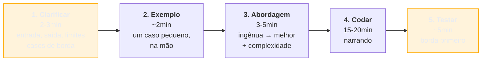

# A entrevista técnica — os três formatos

> [!abstract] TL;DR
> Três formatos, três coisas medidas. **Live coding** avalia o **processo**, não a solução — clarificar antes de escrever, pensar em voz alta e testar valem mais que chegar rápido ao ótimo. **Take-home** avalia o que você faz **sem supervisão**: escopo respeitado, decisões documentadas e um README que explique o que você **não** fez e por quê. **Pair programming / debugging ao vivo** avalia como você trabalha *com alguém* — e é o único em que pedir ajuda bem é sinal positivo. O erro comum aos três é o mesmo: tratar o exercício como prova de conhecimento, quando ele é uma amostra de comportamento.

## O código certo, a entrevista perdida

Um candidato recebe um problema de manipulação de strings. Ele reconhece o padrão de imediato, abaixa a cabeça e escreve. Em oito minutos entrega uma solução correta e eficiente, e olha para o entrevistador esperando o próximo.

O retorno é morno. Do outro lado, o que foi observado: ele não perguntou se a entrada podia vir vazia, se havia limite de tamanho, se caracteres acentuados contavam. Não disse uma palavra durante oito minutos — não houve nada para avaliar além do resultado final. Não testou: entregou dizendo "acho que está certo". E, quando o entrevistador propôs uma variação, teve de reler o próprio código para entender o que tinha escrito.

**A solução estava certa e a amostra foi ruim.** Em quarenta e cinco minutos, o entrevistador precisa prever como será trabalhar com você — e oito minutos de silêncio seguidos de código correto dizem pouquíssimo. É por isso que candidatos que **não terminam** o problema às vezes passam, e candidatos que terminam rápido às vezes não.

## Live coding: o processo é o produto

O âmbar marca as duas etapas que os candidatos mais pulam — e são justamente as que mais pesam.

**Clarificar antes de escrever** é o hábito mais valorizado e o mais ignorado. Entrada vazia? Duplicatas? Ordenado? Cabe em memória? Perguntar demonstra o comportamento que se espera de um sênior diante de um requisito ambíguo — e muitos enunciados são deliberadamente incompletos para observar se você pergunta.

**Pensar em voz alta** é o que torna você avaliável. Sem narração, o entrevistador vê um cursor piscando; com narração, vê raciocínio. Vale narrar inclusive o beco sem saída: *"pensei em ordenar primeiro, mas isso perderia a ordem original, que o enunciado exige"* — descartar com motivo é sinal tão bom quanto acertar.

**Começar pela solução ingênua** não é fraqueza. Dizer "a força bruta é O(n²), me dá uma base correta; agora vejo se dá para melhorar com um mapa" mostra pragmatismo e garante que você tenha **algo funcionando** se o tempo acabar.

**Testar sem ser mandado** — casos de borda primeiro (vazio, um elemento, repetidos) — é o que separa quem entrega código de quem entrega código confiável.

## Take-home: o que você faz sem ninguém olhando

O formato mede outra coisa: **julgamento sem supervisão**, e sobretudo **escopo**.

O que de fato diferencia raramente é o código:

| Diferencia | Não diferencia |
| --- | --- |
| README explicando decisões e trade-offs | quantidade de funcionalidades |
| respeitar o tempo sugerido e **dizer** o que ficou fora | dependência exótica que impressiona |
| testes nas partes que importam | cobertura de 100% em getters |
| commits legíveis, que contam a evolução | um commit único gigante |
| instruções que funcionam na primeira tentativa | README ausente |

**O README é o entregável mais subestimado.** Ele é o único lugar onde você explica as decisões — e um take-home sem explicação obriga o avaliador a adivinhar se uma ausência foi escolha ou desconhecimento. A seção mais valiosa costuma ser *"o que eu não fiz e por quê"*: ela transforma uma lacuna em decisão consciente.

**Over-engineering é o erro clássico do sênior aqui.** Diante de um exercício de quatro horas, a tentação é demonstrar repertório — arquitetura em camadas, injeção de dependência, abstrações para requisitos que ninguém pediu. O avaliador lê isso como **falta de calibragem**: se você faz isso num exercício, fará no produto. A régua é a mesma do trabalho real — a solução mais simples que resolve bem, com espaço para crescer.

> [!question]- E se o take-home for grande demais para o tempo sugerido?
> Acontece, e a forma de lidar **é parte da avaliação**. Não estenda silenciosamente o prazo para entregar tudo: isso ensina ao avaliador que você absorve escopo excedente sem sinalizar — exatamente o comportamento que causa burnout e prazos estourados. O caminho é entregar **o núcleo bem feito** dentro do tempo e documentar no README o que ficou fora, por que, e como você abordaria. Isso é uma demonstração de priorização sob restrição — uma das famílias da nota anterior — em vez de uma resposta a ela. E se o exercício pede vinte horas de trabalho não remunerado, é legítimo perguntar ao recrutador se há formato alternativo.

## Pair programming e debugging ao vivo

O terceiro formato coloca você para trabalhar **com** o entrevistador — estender um código existente, encontrar um bug plantado, evoluir uma base pequena.

Aqui o que se mede é colaboração sob incerteza, e três comportamentos pesam:

**Ler antes de mudar.** Diante de código alheio, quem sai alterando de imediato sinaliza o mesmo que faria na base de produção. Vale dizer o que está fazendo: *"vou primeiro entender como esse fluxo é chamado antes de mexer"*.

**Pedir ajuda bem.** É o único formato em que perguntar conta a favor — desde que seja pergunta específica, depois de tentativa: *"confirmei que o dado chega correto aqui; a transformação é feita nesta camada ou antes?"* é diferente de "não sei o que fazer".

**Aceitar sugestão.** O entrevistador vai propor um caminho, às vezes um pior. Considerar em voz alta, avaliar e responder com critério é o comportamento avaliado — inclusive discordar, se houver motivo.

## Armadilhas comuns

> [!warning] Silêncio prolongado
> **O que acontece:** o candidato pensa em silêncio por vários minutos. Mesmo que chegue a uma boa solução, não há o que avaliar no intervalo — e o entrevistador não sabe se você está travado ou raciocinando. **Por quê:** pensar em voz alta é desconfortável e não é como se programa no dia a dia. **Como evitar:** narre o estado, ainda que pareça óbvio — "estou vendo se dá para fazer numa passada só". Se precisar de silêncio, **anuncie**: "me dá trinta segundos para pensar nisso" é perfeitamente aceito.

> [!warning] Otimizar antes de funcionar
> **O que acontece:** o candidato busca a solução ótima de saída, trava, e o tempo acaba sem nada rodando. **Por quê:** parece que entregar a força bruta é admitir limitação. **Como evitar:** faça funcionar, depois melhore — e **diga que é isso que está fazendo**. Ter algo correto no fim vale mais que uma solução elegante incompleta, e o próprio movimento de otimizar em seguida é conteúdo avaliável.

> [!warning] Take-home com escopo estourado
> **O que acontece:** o exercício sugeria quatro horas e o candidato entrega vinte, com funcionalidades extras. Em vez de dedicação, lê-se falta de calibragem — e, em alguns processos, desrespeito à regra. **Por quê:** mais parece melhor, e o candidato quer se destacar. **Como evitar:** respeite o tempo e use o README para mostrar o que faria a seguir. Escopo controlado **é** a demonstração de senioridade que o exercício procura.

## Como soa em inglês

> "The three formats measure different things. Live coding is about process, not the answer — clarify before you write, think out loud, start with the naive solution and say that's what you're doing, and test edge cases without being asked. I've seen people solve the problem in eight silent minutes and score badly, because eight minutes of silence gives the interviewer nothing to evaluate. A take-home is about judgement without supervision, and the thing that actually differentiates isn't the code, it's the README — especially a section on what I chose not to do and why. Over-engineering is the classic senior mistake there: if you over-build a four-hour exercise, the reviewer assumes you'll do the same in production. And pair programming is the only format where asking for help scores positively, as long as it's a specific question after a real attempt."

| PT | EN |
| --- | --- |
| pensar em voz alta | to think out loud |
| caso de borda | edge case |
| força bruta | brute force |
| escopo estourado | scope creep |
| exercício para casa | take-home assignment |
| bug plantado | planted bug |
| trabalhar em par | to pair |

## O que vem a seguir

Falta a etapa técnica de maior peso num processo sênior — e ela tem trilha própria neste vault, com framework, walkthroughs e capstone. A próxima nota existe para situá-la no funil e apontar o caminho.

- [[09 - System design em entrevista — a ponte]] — o que a etapa mede e onde estudá-la a fundo.
- [[10 - O banco de histórias]] — fecha o bloco Adepto.
- [[07 - A taxonomia das perguntas comportamentais]] — a etapa que antecede esta no funil.

## Veja também

- [[03-Dominios/Engenharia/Testes/16 - Estratégia de testes em entrevista|Estratégia de testes em entrevista]] — o que dizer sobre testes quando perguntarem.
- [[01 - O que uma entrevista sênior avalia]] — por que o processo pesa mais que a solução.

## Fontes

- **Gayle Laakmann McDowell** — *Cracking the Coding Interview* — o framework de resolução em entrevista e o peso da comunicação.
- **Rob Conery** — *The Imposter's Handbook* — os fundamentos que costumam ser cobrados em exercício técnico.
- **Camille Fournier** — *The Manager's Path* (2017) — o que avaliadores procuram num exercício sem supervisão.
