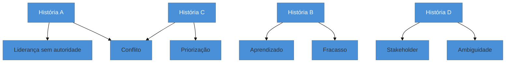

# O banco de histórias

> [!abstract] TL;DR
> Todas as etapas comportamentais consomem o mesmo insumo: um repertório de experiências suas, prontas
> para serem contadas. O erro é montá-lo **por projeto** — a lista fica longa, redundante e não cobre as
> famílias de pergunta. O método que funciona inverte dois eixos: inventariar por **decisão tomada**, não
> por tecnologia usada, e indexar por **família de pergunta**, não por empregador. Seis a oito histórias
> bem trabalhadas cobrem quase todo processo, e batem trinta rasas. E o melhor momento de registrar uma
> história é **quando ela acontece** — não na véspera da entrevista, quando os números já se perderam.

> [!info] Esta nota não contém histórias
> Ela ensina o **método**. O repertório de cada pessoa é material privado por natureza — contém nome de
> empregador, número interno e detalhe de projeto —, e o lugar dele não é um repositório público. O que
> se compartilha é como construí-lo.

## Trinta histórias e nenhuma para a pergunta

Alguém decide se preparar a sério e faz o que parece óbvio: percorre o currículo e escreve, projeto por projeto, o que fez em cada um. Sai uma lista de trinta itens, organizada por empregador e por ano.

Na entrevista, vem: *"conte sobre uma vez em que você discordou de uma decisão técnica e não conseguiu convencer ninguém"*.

A lista não ajuda. Ela está organizada por **onde** as coisas aconteceram, e a pergunta é sobre **que tipo** de coisa aconteceu. A pessoa varre mentalmente trinta projetos procurando um que encaixe, gasta o tempo do silêncio nisso, e acaba contando a história mais recente — que não é a melhor para aquela pergunta.

**O inventário estava certo e o índice estava errado.** Repertório sem índice por família é uma biblioteca sem catálogo: o livro está lá e você não acha na hora.

## Inventariar por decisão, não por tecnologia

O primeiro eixo a inverter é o da coleta. Percorrer a carreira perguntando "o que eu usei?" produz lista de tecnologias — e tecnologia não é história. Percorrer perguntando **"onde eu decidi algo?"** produz matéria-prima de resposta.

Perguntas de garimpo que costumam render:

- Onde eu **escolhi** entre dois caminhos e o outro era defensável?
- Onde eu **discordei** de alguém — e onde eu **fui voltado atrás**?
- O que eu **cortei** de um escopo, e o que aconteceu por causa disso?
- Onde eu **errei** e alguém pagou a conta?
- O que existia antes de mim e **existe diferente** depois?
- Onde eu **convenci** alguém sem ter autoridade para mandar?
- O que eu **aprendi** sob pressão, e como aprendi?

Repare que nenhuma menciona ferramenta. A tecnologia entra como detalhe da decisão — e é assim que ela deve aparecer também na resposta, conforme a [[06 - STAR e suas variantes|nota 06]].

## Indexar por família de pergunta

O segundo eixo a inverter é o do índice. Uma tabela simples resolve, e cobrir as sete famílias da [[07 - A taxonomia das perguntas comportamentais|nota 07]] é o objetivo:

O diagrama mostra a propriedade que torna o método econômico: **uma história serve a várias famílias**, mudando a ênfase. Por isso o repertório é pequeno — seis a oito histórias, se bem escolhidas, cobrem as sete famílias com folga.

A **regra de cobertura**: toda família precisa de pelo menos uma história. Onde houver buraco, você tem um problema de preparação identificado com antecedência — e não na frente do entrevistador. Na prática, o buraco mais comum é *fracasso*: quase ninguém coleta os próprios erros espontaneamente.

## O que registrar de cada história

Para cada uma, o mínimo útil:

| Campo | Por quê |
| --- | --- |
| **Situação em 2 frases** | força a concisão que a resposta vai exigir |
| **A decisão e a alternativa** | é o coração da Action; sem isso não é história comportamental |
| **O número** | resultado sem métrica enfraquece; registre enquanto sabe |
| **O que você faria diferente** | é o follow-up mais provável |
| **Famílias que atende** | o índice |
| **Versão curta / longa** | 30 segundos e 2 minutos, conforme a etapa |

**O número é o campo que mais se perde com o tempo.** Quanto tempo levava o processo antes, quantos incidentes por mês havia, quantos usuários eram afetados — tudo isso é fácil de saber enquanto acontece e quase impossível de reconstruir dois anos depois, quando você não tem mais acesso ao sistema nem aos painéis.

> [!question]- E se minha experiência não tem histórias impressionantes?
> Essa percepção quase sempre vem de comparar o **seu cotidiano** com o **resultado editado** dos outros. Duas correções práticas. Primeira: histórias de escala modesta funcionam perfeitamente — o que se avalia é a qualidade da decisão, não o tamanho do sistema. Uma escolha bem fundamentada num time de três pessoas demonstra o mesmo julgamento que uma decisão de plataforma, e às vezes melhor, porque a restrição era maior. Segunda: o que parece banal para você costuma ser exatamente o que o entrevistador quer ouvir — estabilizar algo instável, dizer não a um pedido inviável, simplificar um processo que ninguém questionava. Se, ainda assim, uma família continuar vazia depois de garimpar, isso é informação útil sobre onde buscar experiência, não um defeito a esconder.

## Manter, não montar na véspera

A diferença entre um repertório bom e um sofrível é quase toda **quando** ele foi escrito.

Montado na véspera, ele depende de memória sob pressão: os números somem, os detalhes achatam, e as histórias saem parecidas entre si. Mantido continuamente — uma nota curta ao fim de um projeto, de um incidente, de uma decisão difícil — ele acumula precisão que não se recupera depois.

Um hábito barato: ao encerrar algo relevante, registre em cinco linhas a decisão, a alternativa, o número e o que você faria diferente. Leva dois minutos e vale por uma hora de tentativa de reconstrução meses adiante. Vale notar que esse registro serve a mais coisas que entrevista — é o mesmo insumo de uma promoção, de uma avaliação de desempenho e da sua própria memória profissional.

## Armadilhas comuns

> [!warning] Organizar por projeto ou por empregador
> **O que acontece:** o repertório espelha o currículo, e a busca em tempo real falha — porque a pergunta chega por tipo de situação, não por empresa.
> **Por quê:** é como a memória guarda a carreira, e como o currículo já está organizado.
> **Como evitar:** índice por **família de pergunta**. O projeto vira metadado, não a chave de busca.

> [!warning] Repertório grande e raso
> **O que acontece:** vinte ou trinta histórias listadas em uma linha cada, nenhuma com decisão explícita, número ou versão curta. Na hora, nenhuma está pronta.
> **Por quê:** quantidade dá sensação de preparo, e é muito mais rápida de produzir que profundidade.
> **Como evitar:** corte para seis a oito e trabalhe cada uma até ter os seis campos da tabela. Uma história pronta vale mais que cinco esboçadas.

> [!warning] Nenhuma história de fracasso
> **O que acontece:** o repertório é todo de sucesso. A pergunta de fracasso vem — e vem — e a resposta é improvisada, tipicamente com um erro pequeno ou terceirizado.
> **Por quê:** ninguém coleta os próprios erros por hábito, e revisitá-los é desconfortável.
> **Como evitar:** trate como item obrigatório de cobertura, com pelo menos duas em STAR-L. E escolha erros **reais**, com consequência — o valor da resposta está proporcionalmente ligado ao que você admite.

## Como soa em inglês

> "Every behavioural stage draws on the same input: a bank of your own experiences, ready to tell. The mistake is organising it by project, because questions don't arrive by employer — they arrive by type of situation. So I invert two axes: I mine my history by decisions I made rather than technologies I used, and I index by question category rather than by company. One story usually serves three or four categories with a different emphasis, which is why six to eight well-developed stories beat thirty shallow ones. The field that decays fastest is the number — how long the process took before, how many incidents a month — so the real trick is writing a story down when it happens, not the week before an interview, when the metrics are already gone."

| PT | EN |
| --- | --- |
| banco de histórias | story bank |
| garimpar experiências | to mine your experience |
| regra de cobertura | coverage rule |
| versão curta / longa | short form / long form |
| métrica que se perde | metric that decays |
| registro contínuo | ongoing log |

## O que vem a seguir

Isso fecha o bloco **Adepto** — o processo, os formatos e o insumo. O último bloco trata do que separa candidatos aprovados de candidatos escolhidos: a comunicação sob pressão, os sinais que desqualificam, as perguntas que você faz e o fechamento financeiro.

- [[11 - Comunicar trade-offs sob pressão]] — abre o bloco Magus.
- [[12 - Red flags que sêniores produzem sem perceber]] — o inverso de tudo que veio até aqui.
- [[07 - A taxonomia das perguntas comportamentais]] — as famílias que este banco precisa cobrir.

## Veja também

- [[06 - STAR e suas variantes]] — a estrutura em que cada história será contada.
- [[05 - Currículo e LinkedIn como artefatos de triagem]] — o mesmo material, em forma escrita e resumida.

## Fontes

- **Gayle Laakmann McDowell** — *Cracking the Coding Interview* — a recomendação de matriz história × tipo de pergunta.
- **Laszlo Bock** — *Work Rules!* (2015) — por que respostas baseadas em evento concreto pontuam melhor que declarações gerais.
- **Will Larson** — *Staff Engineer* (2021) — o registro contínuo de impacto como prática de carreira, não só de entrevista.
