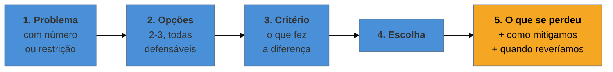

# Comunicar trade-offs sob pressão

> [!abstract] TL;DR
> É a habilidade que mais separa sênior de pleno na avaliação — e ela é de **comunicação**, não de
> arquitetura. A estrutura que funciona tem cinco partes: o problema, as opções consideradas, o critério
> de decisão, a escolha e — a parte que quase todo mundo omite — **o que se perdeu**. Admitir o custo
> não enfraquece a decisão: é o que a torna crível, porque decisão sem custo declarado soa a quem não
> examinou as alternativas. Some-se a isso o ajuste de **profundidade por audiência** e o hábito de abrir
> pela conclusão (**BLUF**) quando o interlocutor é executivo.

## A resposta tecnicamente correta que não convenceu

Pergunta: *"por que vocês escolheram essa arquitetura?"*

Resposta: *"a gente foi de microsserviços porque escala melhor e permite deploy independente"*.

Está correta. E é fraca — por três ausências. Não menciona **alternativa**: parecem ter ido direto ao destino, sem examinar nada. Não menciona **critério**: escala melhor sob que carga, e como sabiam que precisariam disso? E não menciona **custo**: microsserviços cobram complexidade operacional, latência de rede e observabilidade distribuída, e não citar nada disso sugere que a conta não foi feita — ou que foi feita e esquecida.

O entrevistador não conclui "essa pessoa não sabe microsserviços". Conclui algo pior: **"essa pessoa decide por default, não por análise"** — e é exatamente esse o comportamento que ele quer prever antes de contratar.

## A estrutura de cinco partes

O âmbar é o que separa a resposta forte da correta. Um exemplo genérico, com as cinco partes:

> *"Precisávamos suportar picos irregulares com resposta abaixo de 200 ms, e o time era de quatro pessoas. Consideramos três caminhos: monólito com escala vertical, microsserviços, ou um monólito modular. O critério que pesou não foi desempenho — os três atendiam — foi **capacidade operacional**: quatro pessoas não sustentam o overhead de operar múltiplos serviços. Fomos de monólito modular. **O que perdemos** foi a possibilidade de escalar partes independentemente; mitigamos com cache e uma réplica de leitura, e definimos que revisaríamos a decisão se o volume triplicasse ou se o time dobrasse."*

Repare no que a última frase entrega de graça: o **gatilho de revisão**. Ele mostra que a decisão foi tomada para um contexto, com consciência de que o contexto muda — que é a definição prática de julgamento arquitetural.

## Por que admitir o custo aumenta a credibilidade

É contraintuitivo em situação de avaliação, onde o instinto é defender o que se fez. Mas quem ouve raciocina assim:

| A resposta diz | O entrevistador infere |
| --- | --- |
| só benefícios | não examinou alternativas, ou está vendendo |
| benefícios **e** custos | examinou, escolheu conscientemente |
| custos **e** mitigação | operou de verdade e viveu as consequências |
| custos, mitigação e **gatilho de revisão** | pensa em sistema ao longo do tempo |

Toda decisão de engenharia tem custo. Uma resposta que não apresenta nenhum não descreve uma decisão sem custo — descreve alguém que não olhou. É a mesma lógica dos catálogos de padrões deste vault, em que a seção mais valiosa é a de quando **não** usar.

Vale ter à mão o custo dos trade-offs mais frequentes, porque eles reaparecem em qualquer processo:

| Decisão | Ganha | **Perde** |
| --- | --- | --- |
| Monólito → microsserviços | escala e deploy independentes | complexidade operacional, latência, observabilidade |
| SQL → NoSQL | flexibilidade de esquema, escala horizontal | transação, consulta ad hoc, consistência |
| REST → GraphQL | consulta sob medida, sem over-fetching | cache mais difícil, complexidade no servidor |
| Consistência forte → eventual | desempenho e disponibilidade | dado temporariamente divergente, UX a tratar |
| Construir → comprar | controle, sem dependência de fornecedor | tempo, manutenção e custo de oportunidade |
| Síncrono → assíncrono | desacoplamento, absorção de pico | fluxo menos legível, idempotência necessária |

## Ajustar profundidade à audiência

A mesma decisão, quatro conversas — como na [[02 - A anatomia do funil internacional|nota 02]]:

| Audiência | O que quer | Profundidade |
| --- | --- | --- |
| Engenheiro | o mecanismo e a alternativa | alta — pode entrar em detalhe de implementação |
| Hiring manager | o critério e o processo de decisão | média — foco no **porquê**, não no como |
| Produto | o efeito no usuário e no prazo | baixa em técnica, alta em consequência |
| Executivo | risco, custo e resultado | mínima — **BLUF**, sem jargão |

**BLUF** — *bottom line up front* — é a inversão da ordem para audiência executiva: comece pela conclusão e ofereça o raciocínio depois, se pedirem. *"Escolhemos a opção mais lenta de implementar porque a outra criava um risco de indisponibilidade que não podíamos cobrir naquele trimestre"* diz o essencial numa frase; quem quiser, pergunta.

> [!question]- E se eu não tomei a decisão — só executei?
> É uma situação comum e não é um problema, desde que você não finja o contrário. O caminho honesto é dizer o que era seu e o que não era, e então mostrar julgamento **sobre** a decisão alheia: *"a escolha foi do arquiteto; eu discordava do ponto X e propus Y, que foi parcialmente incorporado — hoje entendo melhor por que ele preferiu o caminho original"*. Isso demonstra as três coisas que a etapa procura — você entende o trade-off, tem opinião própria e consegue conviver com decisão que não é sua. Reivindicar decisão que não foi sua é o pior caminho: o follow-up costuma expor, e aí o problema deixa de ser técnico.

## Armadilhas comuns

> [!warning] Apresentar decisão sem alternativa
> **O que acontece:** "escolhemos X porque é melhor". Sem comparação, o entrevistador não tem como avaliar o julgamento — e conclui que houve default, não escolha.
> **Por quê:** a alternativa descartada parece irrelevante, já que não foi usada.
> **Como evitar:** nomeie **ao menos uma** alternativa séria e diga por que ela perdeu. Se a única alternativa era ruim, isso também precisa ser dito — significa que não havia decisão a tomar, e é uma resposta legítima.

> [!warning] Esconder o custo
> **O que acontece:** o candidato descreve a escolha como acerto sem contrapartida. Soa a vendedor, e o follow-up quase sempre vem: "e qual foi o problema disso?".
> **Por quê:** em contexto de avaliação, admitir custo parece admitir erro.
> **Como evitar:** apresente o custo você mesmo, antes da pergunta — e siga com mitigação. Quem antecipa o contra-argumento controla a conversa; quem espera ser confrontado responde na defensiva.

> [!warning] Profundidade errada para a audiência
> **O que acontece:** detalhe de implementação para um executivo, ou resposta genérica para um staff engineer. Nos dois casos, registra-se falha de comunicação — que num sênior pesa tanto quanto falha técnica.
> **Por quê:** o candidato prepara **o conteúdo** e não pensa em quem está do outro lado.
> **Como evitar:** antes de responder, identifique a audiência e escolha a camada. Na dúvida, comece pela conclusão (BLUF) e ofereça: *"posso detalhar a parte técnica, se for útil"* — deixa a profundidade a critério de quem pergunta.

## Como soa em inglês

> "This is mostly a communication skill rather than an architecture one. The structure I use has five parts: the problem with a number attached, the options I considered, the criterion that actually decided it, the choice, and — the part people skip — what we gave up. Saying 'we went with microservices because they scale better' is correct and weak: no alternative, no criterion, no cost, so it reads as deciding by default rather than by analysis. Admitting the trade-off is what makes the decision credible, because every engineering decision has a cost and a story with no cost just means nobody looked. I'd also add the revisit trigger — 'we'd revisit this if volume tripled' — because it shows you decided for a context and know the context changes. And for an executive audience I lead with the bottom line and offer the reasoning only if they want it."

| PT | EN |
| --- | --- |
| custo assumido | accepted trade-off |
| critério de decisão | deciding factor |
| gatilho de revisão | revisit trigger |
| conclusão primeiro | bottom line up front (BLUF) |
| mitigar | to mitigate |
| dependência de fornecedor | vendor lock-in |
| dívida consciente | deliberate debt |

## O que vem a seguir

Sabendo o que fazer bem, falta o inverso — e ele é mais barato de corrigir: um conjunto pequeno de comportamentos que desqualifica candidatos tecnicamente fortes, quase sempre sem que eles percebam que aconteceu.

- [[12 - Red flags que sêniores produzem sem perceber]] — o que elimina, e o que o entrevistador infere.
- [[13 - A entrevista reversa]] — as perguntas que você faz.
- [[14 - Negociação de oferta (capstone)]] — o fechamento.

## Veja também

- [[03-Dominios/Engenharia/Design de Software/Padrões de Projeto/index|Padrões de Projeto]] — o catálogo em que cada padrão vem com o custo declarado.
- [[03-Dominios/Engenharia/Arquitetura/System Design/index|System Design]] — a etapa que mais cobra esta habilidade.

## Fontes

- **Michael Nygard** — *Release It!* (2ª ed., 2018) — a cultura de decidir com o custo à vista.
- **Kathy Sierra** — *Badass: Making Users Awesome* (2015) — por que explicar o raciocínio importa mais que exibir a conclusão.
- **US Army Field Manual** — a origem do BLUF como convenção de comunicação para decisão rápida.
- **Camille Fournier** — *The Manager's Path* (2017) — comunicação técnica calibrada por audiência.
