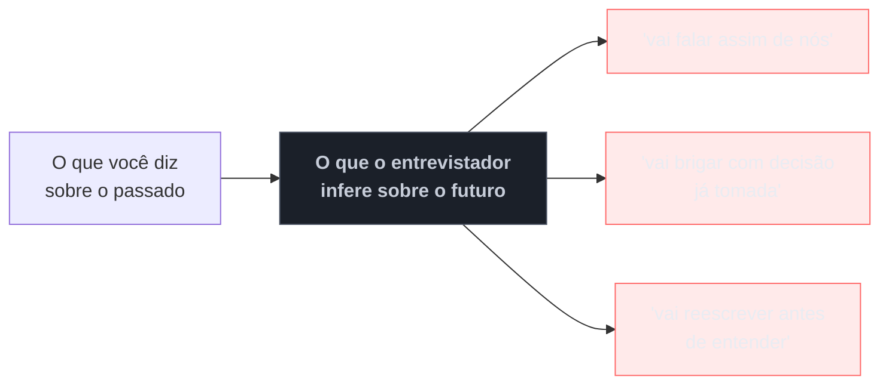

# Red flags que sêniores produzem sem perceber

> [!abstract] TL;DR
> O resto do galho trata do que fazer bem. Esta nota trata do inverso: um conjunto pequeno de comportamentos que **desqualifica candidatos tecnicamente fortes**, quase sempre sem que eles notem que aconteceu. Quase todos têm a mesma origem — a experiência que produz competência também produz **convicção**, e convicção mal calibrada lê-se como rigidez. O padrão que atravessa a lista: o entrevistador não avalia o que você diz sobre o passado, avalia **o que aquilo prevê sobre o futuro** dele com você no time.

## A frase que custou a vaga

Um candidato conta por que saiu do emprego anterior. É uma história real e, em boa medida, justa: gestão desorganizada, decisões técnicas ruins impostas de cima, um time que não queria melhorar.

Ele fala por dois minutos. Tudo verdade.

O entrevistador ouve outra coisa: *é assim que essa pessoa vai falar de nós, daqui a dois anos, na entrevista dela na próxima empresa.* Não importa se a crítica procede — **importa que ela é a única amostra disponível** de como o candidato se refere a um empregador quando ele não está presente. A conclusão não é sobre o emprego antigo; é sobre o risco de contratar.

Essa é a mecânica de quase toda red flag desta nota: um comportamento que faz sentido no contexto em que nasceu, e que é lido como **previsão** de comportamento futuro.

## As oito mais custosas

**1. Falar mal de empregador, gestor ou colega.** A mais cara e a mais comum. Não existe versão segura — mesmo com razão, o custo é assimétrico. *A alternativa:* descreva a **situação** sem julgar as pessoas ("o processo de release era manual e gerava incidentes recorrentes") e diga o que **você** fez a respeito. Se a saída foi por desacordo, uma frase neutra basta: "buscava um contexto com mais espaço para investir em qualidade".

**2. "Nós" que esconde a sua parte.** O relato é todo coletivo e o entrevistador não consegue isolar sua contribuição — e a avaliação é sobre você. Não é falsa modéstia percebida como virtude: é ausência de dado. *A alternativa:* "eu" para decisões, "nós" para o resultado.

**3. Não ter perguntas ao final.** Interpretado como baixo interesse e, num sênior, como falta de critério para escolher onde trabalhar. Alguém com quinze anos de carreira deveria querer saber várias coisas antes de aceitar. *A alternativa:* [[13 - A entrevista reversa|duas ou três perguntas por etapa]].

**4. Rigidez tecnológica.** "X é sempre melhor que Y", "nunca usaria Z". Soa a quem decide por preferência, não por contexto — e prevê atrito com decisões já tomadas no time. *A alternativa:* condicione. "Prefiro X quando o time é pequeno e a operação enxuta; com N times independentes, a conta muda."

**5. Não saber o que faria diferente.** À pergunta "o que você mudaria naquele projeto?", responder "nada, faria igual". Sinaliza ausência de reflexão posterior — e é implausível, porque todo projeto tem algo. *A alternativa:* tenha uma resposta pensada para cada história do repertório.

**6. Desprezar produto, suporte ou usuários.** Comentários sobre "o pessoal de produto que não entende nada", "o usuário que faz besteira". Prevê atrito interfuncional, e frequentemente vem de quem se orgulha de ser direto. *A alternativa:* trate as outras funções como o que são — outras perspectivas do mesmo problema, com restrições que você não vê.

**7. Excesso de certeza sobre um sistema que não conhece.** Diante de um problema de design ou de um trecho do sistema deles, sentenciar de imediato o que está errado e como deveria ser. Prevê alguém que chega reescrevendo antes de entender — o pesadelo de quem tem legado em produção. *A alternativa:* pergunte antes de julgar; hipótese em vez de veredito.

**8. Reivindicar decisão que não foi sua.** O follow-up expõe, e o problema deixa de ser técnico e vira de confiança — irrecuperável dentro do processo. *A alternativa:* separe o que era seu do que não era; julgamento sobre decisão alheia também é sinal positivo.

## O padrão por trás

Note a origem comum de quase todas: **a experiência que produz competência também produz convicção**. Depois de quinze anos, você viu microsserviços falharem, sabe que aquele framework dá problema e reconhece um sistema mal projetado em cinco minutos. Tudo isso é conhecimento legítimo — e, dito sem condicionar ao contexto, chega como rigidez.

A correção não é fingir incerteza. É **explicitar a condição**: em vez de "isso não funciona", "isso costuma não funcionar quando o time é pequeno — como é aqui?". A segunda frase carrega a mesma opinião e convida à conversa, em vez de encerrá-la.

> [!question]- E se a empresa anterior era, de fato, disfuncional?
> Muitas são, e você não precisa mentir — precisa **escolher o nível de abstração**. Diga o que era estruturalmente verdade sobre a situação, sem atribuir caráter a pessoas: "não havia processo de release definido, e isso gerava retrabalho" é verificável e neutro; "meu gestor era incompetente" é julgamento sobre alguém ausente. A segunda parte importa mais: mostre **o que você tentou** naquele contexto. Um relato de disfunção sem nenhuma iniciativa sua lê-se como reclamação; o mesmo relato com duas tentativas concretas lê-se como alguém que age antes de desistir. E se a resposta honesta for "tentei e não consegui mudar", isso é aceitável — inclusive é uma boa história de fracasso.

## Uma nota sobre nervosismo

Vale separar red flag de nervosismo, porque candidatos confundem os dois e se penalizam à toa. Gaguejar, perder o fio, pedir para repetir a pergunta, precisar de um instante para pensar — nada disso é red flag, e entrevistador experiente desconta. O que a lista acima descreve é **conteúdo**, não desempenho: são coisas ditas com calma e convicção, não tropeços.

A distinção prática: se você errou o formato, corrija na hora sem drama ("deixa eu reformular"). Se você disse algo da lista, o custo já foi pago — e a lição é para a próxima.

## Armadilhas comuns

> [!warning] Confundir franqueza com ausência de filtro
> **O que acontece:** o candidato se orgulha de "falar o que pensa" e emite julgamentos duros sobre ex-colegas, tecnologias e o próprio sistema do entrevistador. Entende que está demonstrando autenticidade. **Por quê:** em times técnicos, franqueza é valorizada — e a linha entre franqueza e falta de tato não é óbvia quando se está do lado de dentro. **Como evitar:** franqueza é sobre **conteúdo**, não sobre alvo. Discordar de uma ideia com argumento é franqueza; qualificar pessoas é outra coisa. O teste: você diria isso com a pessoa presente?

> [!warning] Tratar a entrevista como demonstração de superioridade técnica
> **O que acontece:** o candidato corrige o entrevistador em detalhes irrelevantes, exibe conhecimento de nicho e transforma a conversa em competição. Vence os pontos e perde a avaliação. **Por quê:** o contexto parece pedir prova de competência, e competência foi historicamente demonstrada assim. **Como evitar:** corrigir é legítimo quando importa para a decisão em jogo — e o modo importa: "acho que isso mudou nas versões recentes, você chegou a ver?" preserva a conversa e a informação.

> [!warning] Deixar a red flag no ar sem reparo
> **O que acontece:** o candidato percebe, meio segundo depois, que falou mal do gestor anterior — e segue em frente torcendo para que passe. Não passa. **Por quê:** voltar atrás parece constrangedor e reforçar o assunto. **Como evitar:** repare de forma curta e sem drama: "deixa eu reformular — o problema estrutural era a ausência de processo, e o que eu tentei fazer foi...". Reparo consciente **melhora** a impressão, porque demonstra autopercepção.

## Como soa em inglês

> "Most red flags at senior level come from the same place: the experience that gives you competence also gives you conviction, and uncalibrated conviction reads as rigidity. The most expensive one is criticising a former employer — even when it's fair, because the interviewer hears how you'll talk about them in two years. Others: a 'we' that hides what you personally did, having no questions at the end, saying a technology is always better rather than better under conditions, and being certain about a system you've just been shown, which predicts someone who rewrites before understanding. The fix usually isn't to fake uncertainty — it's to state the condition. 'That doesn't work' and 'that tends not to work with a small team, how is it here?' carry the same opinion, but one ends the conversation and the other opens it."

| PT | EN |
| --- | --- |
| sinal de alerta | red flag |
| falar mal de | to badmouth |
| rigidez | inflexibility |
| autopercepção | self-awareness |
| condicionar ao contexto | to qualify with context |
| reparo (na conversa) | course correction |
| atrito interfuncional | cross-functional friction |

## O que vem a seguir

A red flag número três tem nota própria — e ela é a única parte do processo que você controla inteiramente, além de ser a melhor fonte de informação sobre se você quer mesmo aquele emprego.

- [[12a - Defender um hiato longo]] *(broto)* — o caso em que o fato **não** é red flag mas a resposta sobre ele é: um hiato de anos no histórico, e os cinco movimentos que separam uma defesa madura de uma desqualificação autoinfligida.
- [[13 - A entrevista reversa]] — o que perguntar, e o que as respostas revelam.
- [[14 - Negociação de oferta (capstone)]] — o fechamento do processo e do galho.
- [[07 - A taxonomia das perguntas comportamentais]] — onde a maior parte destas red flags aparece.

## Veja também

- [[01 - O que uma entrevista sênior avalia]] — o critério que estas red flags violam.
- [[11 - Comunicar trade-offs sob pressão]] — a versão positiva da rigidez: condicionar ao contexto.

## Fontes

- **Laszlo Bock** — *Work Rules!* (2015) — o que avaliadores registram como risco, e por que pesa mais que acerto técnico.
- **Camille Fournier** — *The Manager's Path* (2017) — a leitura do gestor sobre relatos de empregos anteriores.
- **Kim Scott** — *Radical Candor* (2017) — a distinção entre franqueza com cuidado e agressividade percebida como honestidade.
