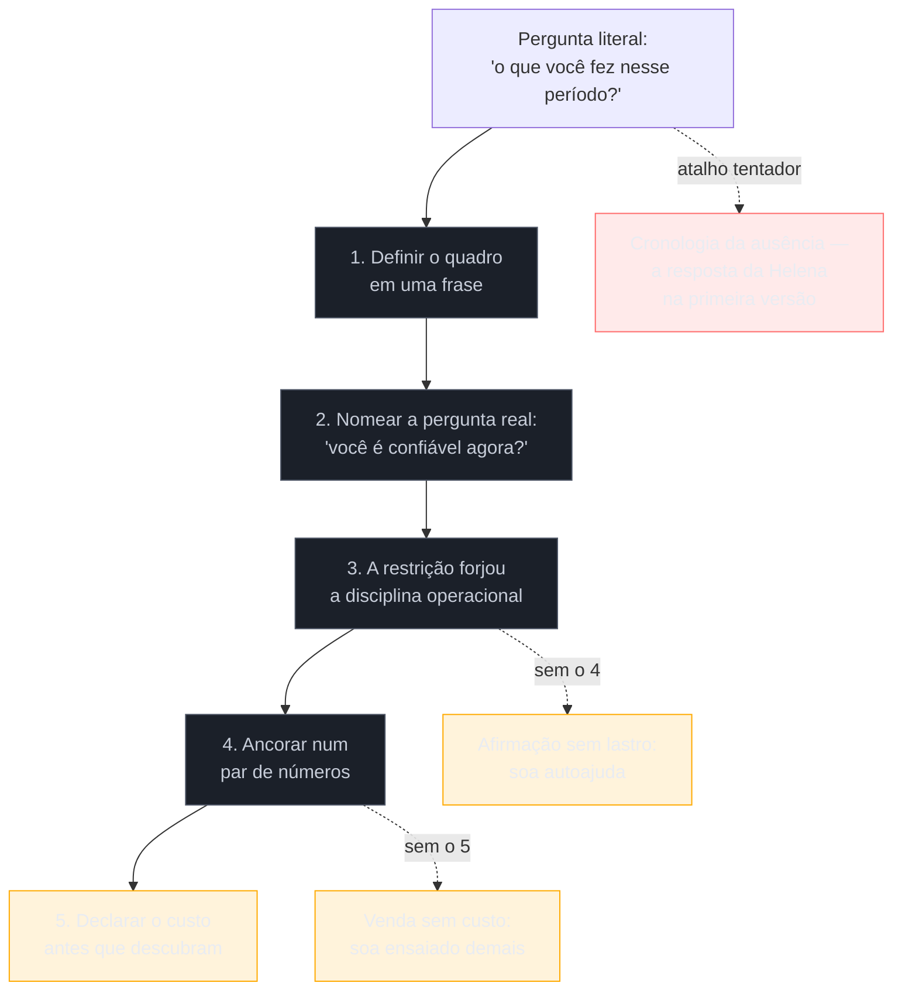

# Defender um hiato longo

> [!abstract] TL;DR
> O intervalo no seu histórico é um fato, e fatos não desqualificam ninguém. A resposta sobre ele é uma performance — e performances desqualificam todos os dias. É essa a tese, e ela herda direto da [[03-Dominios/Carreira/Entrevistas/12 - Red flags que sêniores produzem sem perceber|nota 12]]: o candidato tecnicamente forte que se queima não por incompetência, mas por como fala de alguma coisa. O erro que quase todo mundo comete é responder à pergunta literal — *o que você fez nesse período* —, produzindo uma narrativa inteira sobre um tempo em que não estava trabalhando. A pergunta real é outra, o entrevistador raramente a diz em voz alta porque soaria grosseira, e ela é sobre o futuro: **você é confiável agora?** Trazê-la à superfície e responder a ela é o movimento que mais rende na conversa toda. Daí saem cinco movimentos em ordem, um roteiro literal para ensaiar, e a resposta para o caso de quem **não** declarou a pausa no currículo e é perguntado assim mesmo. Quando o motivo é saúde, entra um eixo que quase nenhum guia menciona: nos Estados Unidos o ADA proíbe a empresa de perguntar sobre condição médica antes da oferta condicional, e no Brasil a LGPD trata saúde como dado sensível — o detalhe é escolha sua, não dívida sua. A metade escrita deste tema está em [[03-Dominios/Carreira/Currículo/16a - Lacuna longa e reentrada|Currículo/16a]].

## A pergunta chega no minuto quatro

Helena Braga tinha ensaiado a apresentação. Tinha ensaiado o "fale sobre você", tinha revisado as histórias do banco, tinha até anotado três perguntas para o fim. O que ela não tinha ensaiado era a única pergunta que era garantida.

A recrutadora foi simpática. Disse o nome da empresa, confirmou que tinha quinze minutos, elogiou o projeto mais recente. E então, no minuto quatro, com a naturalidade de quem faz aquilo trinta vezes por semana: *"eu vi aqui um intervalo grande no seu histórico — me conta o que você estava fazendo nesse período?"*

Helena travou por um segundo e meio. Depois falou por dois minutos e quarenta.

Contou que tinha sido um período difícil. Que precisou se afastar por saúde. Que não foi uma escolha, que ela teria continuado se pudesse, que tentou manter alguma coisa acontecendo mas não deu. Explicou o ano de 2017, explicou por que 2018 tinha sido pior, mencionou que em 2019 já estava melhor. Terminou dizendo que hoje estava totalmente recuperada e que aquilo não seria um problema.

Cada frase era verdadeira. E a soma delas foi um desastre.

Repare no que Helena fez: gastou dois minutos e quarenta segundos — a maior parte do tempo que ela teve com aquela recrutadora — descrevendo em detalhe um período em que ela não estava trabalhando. Terminou a resposta com o entrevistador sabendo muito mais sobre a ausência dela do que sobre a competência dela. E fechou com uma promessa (*"não seria um problema"*) que, na cabeça de quem ouve, é sempre mais frágil do que uma prova.

A recrutadora não era hostil. Ela tinha um trabalho a fazer: apresentar Helena a um gestor que ia olhar as mesmas datas, e chegar lá com uma resposta pronta para não ser pega sem ela. A pergunta era inevitável e legítima.

O que não era inevitável era a resposta.

## Helena respondeu à pergunta errada

A pergunta literal é sobre o passado: *o que você fez*. Quem responde só a ela produz exatamente o que Helena produziu — uma cronologia da própria ausência. Não existe versão boa desse texto. Por mais bem construído que seja, cada frase dele fala de um tempo em que a pessoa não estava produzindo, e reforça o quadro que ela queria dissolver.

A pergunta real é sobre o futuro, e o entrevistador quase nunca a diz em voz alta porque soaria grosseira: *você é confiável agora? Se eu apostar nesta contratação, eu vou ter um problema?*

É essa a decisão que ele precisa tomar. É a única a que vale a pena responder. E a resposta de Helena, tecnicamente irrepreensível em cada frase, não tocou nela uma única vez.

> [!question]- Não é arriscado dizer em voz alta uma pergunta que o entrevistador não fez?
> É o contrário — é o movimento que mais rende na conversa inteira, por um motivo mecânico. Enquanto a pergunta real não é nomeada, ela fica ativa em segundo plano na cabeça de quem ouve, filtrando cada frase da sua resposta em busca de sinal de risco. Nomeá-la desarma o filtro: mostra que você entende o que está em jogo, que não está desviando, e transfere a conversa do terreno em que você é fraco — o passado ausente — para o terreno em que você é forte, que é como você opera hoje. O tom faz toda a diferença. *"A pergunta real por baixo dessa não é o que aconteceu em 2016, é se eu sou confiável agora — então deixa eu responder essa"* funciona. *"O que você realmente quer saber é…"*, em tom de acusação, faz o oposto.

## Como Helena montou a segunda versão

Ela não passou no primeiro processo. Passou no terceiro, com uma resposta que levava um terço do tempo e dizia dez vezes mais. Vale acompanhar como ela chegou lá, porque a construção tem uma ordem, e a ordem não é decorativa — cada peça só funciona depois da anterior.

**Ela começou definindo o quadro, não a cronologia.** A primeira frase da resposta é o único momento em que você está *definindo* alguma coisa em vez de reagir; depois dela, você está sempre respondendo. Helena parou de abrir com "foi um período difícil" e passou a abrir com uma frase que nomeava o período no vocabulário dela: *"entre 2016 e 2019 eu fiz um hiato para recalibrar minha saúde"*. Uma frase. E então — isto é o mais difícil de treinar — **uma pausa**, sem preencher o silêncio. Quase todo candidato atropela essa frase e perde o momento inteiro.

**Depois ela trouxe a pergunta real para a mesa.** Custou-lhe uma frase: *"a pergunta real por baixo dessa não é o que aconteceu em 2016 — é se eu sou confiável agora. Deixa eu responder essa."* A partir dali, o resto da resposta tinha permissão explícita para falar do presente.

**Aí veio a virada, e ela precisa ser concreta ou vira autoajuda.** O argumento de Helena não foi "aprendi muito comigo mesma" — foi que a restrição **forçou uma mudança verificável no jeito de trabalhar**. Quem não pode contar com presença síncrona constante para de usar presença como mecanismo de entrega e constrói governança no lugar: rollback automatizado, teste que faz da rede de segurança um sistema e não a sua atenção, documentação que impede o time de depender de um ping no chat. Isso não é discurso sobre resiliência. É uma lista de práticas que a pessoa faz ou não faz — e que o entrevistador pode sondar, o que é exatamente o ponto.

**Então ela ancorou num número.** A virada acima é uma afirmação, e afirmação sem número é opinião. Um par de números fecha: frequência de deploy antes e depois, tempo de suíte, lead time do pedido até produção. Vale a régua da [[03-Dominios/Carreira/Entrevistas/11 - Comunicar trade-offs sob pressão|nota 11]] e a disciplina de confiança da [[03-Dominios/Carreira/Currículo/14 - Números que você pode defender|nota 14 do Currículo]] — par de números vence percentual, e nada entra na resposta que você não consiga explicar como mediu.

**E fechou declarando o custo.** Este é o movimento que separa uma resposta boa de uma resposta madura, e é o mais contra-intuitivo dos cinco: Helena disse, sem que ninguém perguntasse, em que tipo de empresa o modelo dela **não** funciona. Trabalho assíncrono, escrito e orientado a resultado vai bem onde se valoriza decisão documentada; vai mal onde se confunde presença com produtividade. Dizer isso em voz alta parece vender contra si mesma. Faz três coisas ao mesmo tempo: sinaliza autoconhecimento, sinaliza que ela não está desesperada por qualquer vaga, e filtra um ambiente onde a contratação daria errado em três meses. É a mesma lógica que a [[03-Dominios/Carreira/Entrevistas/11 - Comunicar trade-offs sob pressão|nota 11]] já fixou para decisões técnicas — admitir o custo é o que torna a afirmação crível.



> **Em uma frase:** não explique o período — responda à pergunta que o período fez o entrevistador se fazer.

## O roteiro, para ensaiar em voz alta

A resposta completa leva entre dois e meio e três minutos. Abaixo, o esqueleto com as frases-âncora — as partes em colchetes são suas, o resto é estrutura que aguenta qualquer conteúdo.

```
1. QUADRO      "Entre [ano] e [ano] eu fiz um hiato para [motivo, em uma
                expressão sua]."
               ← pausa aqui. Não preencha o silêncio.

2. A REAL      "A pergunta real por baixo dessa não é o que aconteceu em
                [ano] — é se eu sou confiável agora. Deixa eu responder essa."

3. A VIRADA    "O hiato forçou uma recalibração de como eu trabalho. Quando
                você não pode contar com [a restrição], você para de depender
                de [o atalho fácil] e constrói [o sistema] no lugar:
                [3 práticas concretas]."

4. O NÚMERO    "Em [contexto], isso deu [número antes] → [número depois].
                Essa é a evidência."

5. O CUSTO     "O trade-off que eu nomearia: isso funciona bem em empresas
                que [X]. Não funciona em ambientes que [Y]. Prefiro sinalizar
                isso cedo."
```

Três frases valem ser decoradas ao pé da letra, porque são as que somem sob pressão: **"hiato, não ausência"**; **"a restrição forjou a disciplina"**; **"esse é o meu modelo operacional, não um pedido de acomodação"**.

E ensaie **em voz alta**, cronometrado. Esta é a única pergunta da entrevista em que a **fluência** é parte da resposta: hesitar aqui lê como desconforto, e desconforto lê como assunto não resolvido — o que, na cabeça de quem contrata, projeta risco para dentro do trabalho.

## E se você não declarou a pausa no currículo?

Existe um caso que os guias não cobrem porque não imaginam a estratégia: a pessoa que, seguindo o raciocínio de [[03-Dominios/Carreira/Currículo/16a - Lacuna longa e reentrada|Currículo/16a]], entregou um currículo **curado** — uma seleção declarada dos trabalhos que importam — e por isso não tem nenhuma linha sobre a pausa. O que acontece quando perguntam assim mesmo?

Primeiro, entenda por que ainda perguntam. O currículo curado não some com a informação; ele a move de camada. O LinkedIn tem datas. O site tem o histórico. Um recrutador atento soma um mais um. A pergunta chega com outra cara — *"me conta um pouco da sua trajetória"*, ou *"vi no seu LinkedIn que teve um intervalo por volta de 2017"* — mas chega.

A tentação, nesse momento, é a pior possível: soar como quem foi pego. Qualquer coisa que sugira que a omissão era ocultação destrói de uma vez tanto a resposta quanto a credibilidade do documento inteiro.

O antídoto é assumir a curadoria como o que ela é: uma decisão editorial, tomada por um profissional experiente, sobre um documento de duas páginas. Dita sem defensiva, ela é impecável:

> *"Meu currículo é uma seleção — com vinte anos de carreira, listar tudo não caberia, então eu escolho os trabalhos mais relevantes para cada vaga. O histórico completo está no meu LinkedIn e no meu site, e sim, tem um período entre 2016 e 2019 em que eu estava afastado por saúde. Posso falar dele, se ajudar."*

Três coisas acontecem nessas quatro linhas. A curadoria é nomeada como método, não como omissão — e método de quem tem material demais, o que é uma forma elegante de dizer "eu tenho muita coisa". O caminho para o resto é oferecido de imediato, o que prova que nada estava escondido. E a pausa é reconhecida com naturalidade, no tom de quem não considera aquilo um problema — porque não é.

Depois disso, se a pessoa quiser saber mais, entram os cinco movimentos normalmente.

> [!warning] O que não fazer aqui
> Não invente uma razão editorial que não existe ("achei que não era relevante" soa como desculpa). Não finja surpresa. Não diga "não coloquei porque não me perguntaram". E, acima de tudo, **não deixe o currículo curado sem uma camada seguinte real** — se o LinkedIn também estiver com o período apagado, aí não foi curadoria, foi ocultação, e a conversa fica impossível de salvar.

## Você não é obrigado a detalhar

Quando o motivo é saúde, existe um dado de contexto que muda a postura de quem responde e que raramente aparece nos guias de entrevista: **em boa parte dos mercados, a empresa não pode perguntar.**

Nos Estados Unidos — mercado relevante para quem faz processo internacional —, o *Americans with Disabilities Act* proíbe o empregador de fazer perguntas relacionadas a deficiência ou exigir exame médico **antes de uma oferta condicional**. A orientação da EEOC é explícita: nessa fase, o empregador não pode perguntar se o candidato tem uma deficiência, nem sobre a natureza de uma deficiência aparente, **mesmo que a pergunta seja relacionada ao trabalho**. O que ele pode é perguntar sobre a capacidade de executar as funções do cargo, desde que não formule a pergunta em termos de condição médica, e pode pedir que o candidato descreva ou demonstre como as executaria. Depois da oferta condicional a regra muda, e perguntas médicas passam a ser permitidas, desde que aplicadas a todos os contratados da mesma categoria.

No Brasil o mecanismo é outro, mas o efeito prático se sobrepõe: a **LGPD** (Lei 13.709/2018, Art. 5º, II) classifica dado referente à saúde como **dado pessoal sensível**, categoria com proteção mais estrita justamente porque revela aspecto íntimo e cria risco de discriminação.

Agora, o mais importante: **nada disso deve ser dito numa entrevista.** Citar o ADA numa chamada de triagem é um dos piores movimentos disponíveis — transforma conversa em confronto e cria, na hora, exatamente o risco que a empresa queria evitar. O valor desse conhecimento é **postural**, não jurídico. Saber que o detalhe clínico é uma escolha sua, e não uma dívida sua, é o que permite responder com calma em vez de com a pressa de quem sente que está devendo explicação.

A frase que traduz essa postura sem citar lei nenhuma é curta e educada: *"a recalibração em si é privada; a disciplina que ela forçou é o que eu estou trazendo para o time de vocês."* Ela funciona porque não recusa a conversa — apenas devolve o eixo para o que interessa aos dois lados.

> [!warning] O limite simétrico
> Nada disso autoriza o silêncio total. A [[03-Dominios/Carreira/Currículo/16 - A seção de experiência profissional|nota 16 do Currículo]] já mostrou que uma lacuna sem explicação não desaparece: vira pergunta em aberto, e pergunta em aberto na cabeça de quem lê rápido é preenchida com a hipótese mais simples, nem sempre a mais favorável. Recusar-se a dar **qualquer** enquadramento produz o mesmo vácuo, agora criado ao vivo. O objetivo não é reter informação — é **escolher a granularidade**. Categoria, sempre. Diagnóstico, opcional.

## As mesmas pessoas, agora na conversa

A [[03-Dominios/Carreira/Currículo/16a - Lacuna longa e reentrada|nota 16a do Currículo]] acompanhou quatro situações diferentes no papel. Elas chegam à entrevista com perguntas diferentes, e a resposta muda em cada uma.

### Éverton — formou-se e nunca entrou

A pergunta que ele ouve não é sobre um período, é sobre ele: *"você se formou em 2022 e não trabalhou na área desde então?"* — e o subtexto, que ninguém diz, é *"por que ninguém te quis?"*.

Os cinco movimentos não servem aqui, porque três deles pressupõem uma carreira anterior. O que serve é uma versão de dois passos: **reconhecer sem drama** e **empurrar imediatamente para o presente**. Algo como: *"não consegui entrar logo depois de formado — o mercado júnior estava difícil e eu não tinha projeto nenhum para mostrar. Passei os últimos oito meses corrigindo isso: construí [projeto], que hoje tem [usuários/uso real], e é sobre ele que eu queria falar."* Uma frase para o passado, o resto para o que existe agora.

O erro fatal para Éverton é reclamar do mercado por mais de uma frase. A queixa é legítima e verdadeira, e ainda assim é lida como terceirização — a mesma armadilha que a [[03-Dominios/Carreira/Entrevistas/12 - Red flags que sêniores produzem sem perceber|nota 12]] descreve para quem fala mal de empregador anterior.

### Sandro — trabalhou, mas fora da área

Sandro tem a resposta mais fácil dos quatro e é o que mais sofre, porque acha que precisa se justificar. Não precisa. *"Nesses dois anos eu trabalhei no negócio da minha família"* é uma frase completa, e nenhum recrutador do mundo acha isso estranho.

O único cuidado é não inflar. Se vier um follow-up perguntando o que ele aprendeu ali, a resposta honesta — lidar com cliente irritado, fechar caixa todo dia, controlar estoque sem sistema — é melhor do que qualquer tradução para vocabulário corporativo. E vale uma ponte curta de volta ao técnico: *"foi o período em que eu continuei estudando à noite, e é de lá que vem [projeto/certificação]"*, se for verdade.

### Wilson — dez anos longe

A pergunta dele é a mais dura de todas, e vem em geral disfarçada de gentileza: *"e o que te fez querer voltar agora?"*.

A armadilha é responder com nostalgia — *"sempre gostei de programar", "senti falta da área"* —, porque isso descreve um sentimento e o entrevistador está avaliando um risco. A resposta forte troca sentimento por **evidência de reentrada já em curso**: o que ele fez nos últimos seis meses, o que construiu, o que estudou com prática e não só leitura. E, como no caso de Éverton, o passado antigo entra em uma frase — não como venda, mas como base: *"eu programei profissionalmente até 2014, e isso me dá fundamento que não expira; o que eu reconstruí no último ano foi o ferramental."*

Wilson também é quem mais se beneficia de estreitar o alvo. Voltar "para TI" é grande demais para ser crível. Voltar para um nicho onde o conhecimento antigo ainda paga — um domínio de negócio que ele conhece por dentro, um sistema legado na tecnologia que ele dominava — transforma dez anos de distância em dez anos de contexto.

## Seis maneiras de estragar isso

> [!warning] Abrir pelo detalhe médico
> Foi o que Helena fez na primeira versão. Os primeiros trinta segundos ficam clínicos, e o entrevistador entra imediatamente em modelagem de risco — quantos dias, quantas ausências, e se ele pode sequer fazer as perguntas que acabaram de surgir na cabeça dele (em geral não pode, o que o deixa desconfortável e sem saída). O quadro da conversa fica médico e não volta mais a ser técnico. O movimento 1 existe para ocupar esse espaço: se a primeira frase for clínica, todo o resto será.

> [!warning] O enquadramento apologético
> *"Eu tive que parar de trabalhar"*, *"precisei de um tempo para me recuperar"*, *"desculpa pelo gap"*. Pedido de desculpa é pedido de concessão, e concessão pressupõe falta. A construção entrega uma pessoa negociando perdão em vez de apresentando um profissional. Voz ativa e vocabulário próprio: hiato, recalibração, retomada. Nunca "tive que", nunca "desculpa".

> [!warning] A postura de guerreiro
> O oposto exato, e igualmente caro: *"trabalhei mesmo doente"*, *"nunca deixei isso me atrasar"*, *"levo o laptop comigo"*. Parece força e lê como risco — quem promete operar em condições que não sustentam operação está descrevendo um processo frágil, e um entrevistador experiente ouve isso com clareza. Descreva o sistema, não o esforço: runbook que outra pessoa executa, rollback automatizado, documentação. Arquitetura absorve restrição melhor que heroísmo.

> [!warning] Pedir compreensão ou flexibilidade
> A resposta termina com um pedido — que sejam compreensivos, que ofereçam flexibilidade. Isso enquadra você como **algo a acomodar** em vez de **alguém a contratar**, e traz o custo para a mesa antes de a competência ter sido estabelecida. O momento de discutir arranjo de trabalho existe, e é depois, em geral já com oferta na mesa, quando a assimetria de poder é menor. Até lá: modelo operacional, não pedido.

> [!warning] Estender a defesa para além do afastamento
> Aplicar os cinco movimentos — e o tom grave que vem com eles — a **todo** intervalo do histórico, incluindo os meses entre um contrato e outro de uma carreira freelance. Quem carregou um afastamento longo tende a estender esse vocabulário para tudo o que veio depois, e passa a se defender de períodos que não acusam nada. O efeito é criar um problema onde o entrevistador não tinha visto nenhum. Intervalo entre clientes se responde em uma frase, no tom mais banal disponível: *"trabalho por projeto; entre um contrato e outro há o tempo de prospecção"*. A [[03-Dominios/Carreira/Currículo/16a - Lacuna longa e reentrada|nota 16a do Currículo]] trata da mesma distinção do lado do documento.

> [!warning] Não ensaiar
> A pergunta chega, você hesita, enrola, se corrige no meio da frase. Esta é a única pergunta de toda a entrevista cuja fluência é, ela mesma, parte da resposta — e é justamente a que ninguém treina, porque treinar dói. Três frases-âncora decoradas, testadas em voz alta, cronometradas. É a aplicação mais estrita do método do repertório da [[03-Dominios/Carreira/Entrevistas/10 - O banco de histórias|nota 10]].

## Calibrar pelo tempo e pela etapa

A resposta não é a mesma em todas as etapas do funil que a [[03-Dominios/Carreira/Entrevistas/02 - A anatomia do funil internacional|nota 02]] mapeou.

| Etapa | Quem pergunta | Versão | O que muda |
| --- | --- | --- | --- |
| Triagem com recrutador | recrutador, sem contexto técnico | ~60 segundos | corta o movimento 5 e o detalhe técnico da governança; mantém quadro, pergunta real e um número |
| Hiring manager | quem vai conviver com o risco | 2,5 a 3 minutos | versão completa, os cinco movimentos — é aqui que a decisão acontece |
| Entrevista técnica | par técnico | quase nunca surge | se surgir, responder curto e devolver ao problema técnico em discussão |
| Pós-oferta | RH / operações | outra conversa | aqui sim, arranjo de trabalho e necessidades concretas — com oferta na mesa |

O corte para sessenta segundos importa mais do que parece. Em triagem, a versão longa soa ensaiada demais para o contexto e consome o tempo reservado a outras cinco perguntas. E há um motivo mais fino: a recrutadora precisa de uma resposta que ela consiga **repetir** ao gestor, não de uma que ela precise resumir. Entregue algo repetível.

## Os follow-ups previsíveis

Um hiato bem respondido gera perguntas de acompanhamento — e isso é sinal de que funcionou, porque significa que o entrevistador parou de avaliar risco e começou a explorar.

**"Como é uma semana típica para você?"** Pede concretude sobre o modelo operacional. Resposta forte descreve o desenho: blocos longos de trabalho profundo, tempo síncrono agrupado em poucas janelas, decisões em documento. O sistema absorve a restrição sem torná-la visível para o time.

**"E se acontecer um incidente crítico bem no meio da sua indisponibilidade?"** A pergunta de risco operacional, e a tentação é prometer disponibilidade total. Responda com arquitetura: a maior parte é prevenida por rollback automatizado, observabilidade e runbook; para o resto, o time consegue agir porque o sistema está documentado para ser acionado por outra pessoa. Prometer estar sempre alcançável é prometer um processo frágil.

**"Já aconteceu de isso virar bloqueio de fato?"** Testa honestidade, e negar é o pior movimento. Admita um caso, nomeie a causa em termos de sistema — documentação não delegada fundo o suficiente — e diga o que mudou depois. É o STAR-L da [[03-Dominios/Carreira/Entrevistas/06 - STAR e suas variantes|nota 06]] aplicado a um fracasso operacional próprio.

**"Por que voltar para uma empresa, se o seu modelo é tão autônomo?"** A pergunta de intenção. Separe as duas coisas: trabalhar sozinho é assíncrono **sem alinhamento**; o que você busca é assíncrono **com missão compartilhada**. São problemas diferentes, e um não é a versão diluída do outro.

## Como explicar em inglês

A construção que carrega esta resposta em inglês é nomear a pergunta real antes de respondê-la. Duas ou três frases, ensaiadas ao pé da letra:

*"Between 2016 and 2019 I took a hiatus to recalibrate my health. The real question underneath this one isn't what happened in 2016 — it's whether I'm reliable now, so let me answer that one instead. The constraint forged the discipline: when you can't rely on constant synchronous presence, you stop using presence as a delivery mechanism and build governance instead — automated rollback, tests as the safety net, documentation so the team never depends on a ping. The recalibration itself is private; the discipline it forced is what I'm bringing to your team."*

| PT | EN |
| --- | --- |
| hiato, não ausência | a hiatus, not an absence |
| a pergunta por baixo da pergunta | the real question underneath |
| a restrição forjou a disciplina | the constraint forged the discipline |
| modelo operacional, não pedido de acomodação | an operating model, not an accommodation request |
| recalibrar | to recalibrate |
| governança | governance |
| rede de segurança | safety net |
| plantão / escala de sobreaviso | on-call rotation |
| inovação guiada por restrição | constraint-driven innovation |
| oferta condicional | conditional offer |

## O que vem a seguir

Helena passou no terceiro processo — e a resposta que ela deu sobre o hiato foi, segundo o gestor que a contratou, o momento em que ele decidiu. Não por ser comovente. Por ser a única resposta daquele dia em que alguém nomeou o próprio risco antes que ele precisasse perguntar.

- [[03-Dominios/Carreira/Currículo/16a - Lacuna longa e reentrada|Currículo/16a - Lacuna longa e reentrada]] — **a outra metade**: o que vai no papel, como se parte um vão de anos, e a escolha entre declarar, curar e preencher.
- [[03-Dominios/Carreira/Entrevistas/13 - A entrevista reversa|13 - A entrevista reversa]] — o movimento 5 declarou um trade-off cultural; as suas perguntas são como você **verifica** se ele é compatível com aquela empresa, antes de aceitar.
- [[03-Dominios/Carreira/Entrevistas/14 - Negociação de oferta (capstone)|14 - Negociação de oferta (capstone)]] — a etapa em que a conversa sobre arranjo de trabalho finalmente cabe, com oferta na mesa e a assimetria de poder reduzida.

## Veja também

- [[03-Dominios/Carreira/Entrevistas/12 - Red flags que sêniores produzem sem perceber|12 - Red flags que sêniores produzem sem perceber]] — a nota mãe: o hiato não é a red flag, a resposta é.
- [[03-Dominios/Carreira/Entrevistas/03 - Fale sobre você — o pitch de abertura|03 - Fale sobre você — o pitch de abertura]] — a outra pergunta previsível da triagem, com a mesma economia de primeira frase.
- [[03-Dominios/Carreira/Entrevistas/10 - O banco de histórias|10 - O banco de histórias]] — o método de repertório que esta resposta exige em grau máximo.
- [[03-Dominios/Carreira/Entrevistas/11 - Comunicar trade-offs sob pressão|11 - Comunicar trade-offs sob pressão]] — admitir o custo é o que torna a afirmação crível, aplicado aqui ao movimento 5.
- [[03-Dominios/Carreira/Currículo/19 - Declarar lacuna|Currículo/19 - Declarar lacuna]] — o procedimento de três movimentos para lacuna **técnica**, que esta nota estende para lacuna de **tempo**.
- [[03-Dominios/Carreira/Entrevistas/index|Entrevistas]] — o índice do galho.

## Fontes

- **U.S. Equal Employment Opportunity Commission** — [*Pre-Employment Inquiries and Disability*](https://www.eeoc.gov/pre-employment-inquiries-and-disability) e [*Enforcement Guidance on Preemployment Disability-Related Questions and Medical Examinations under the ADA*](https://www.eeoc.gov/newsroom/eeoc-issues-final-enforcement-guidance-preemployment-disability-related-questions-and-0). Fonte da regra citada: antes da oferta condicional o empregador não pode fazer perguntas relacionadas a deficiência nem exigir exame médico, mesmo que relacionados ao trabalho; pode perguntar sobre capacidade de executar funções do cargo, desde que não formulado em termos de condição médica. Consultado em 2026-08-31.
- **Brasil** — [Lei 13.709/2018 (LGPD), Art. 5º, II](https://www.planalto.gov.br/ccivil_03/_ato2015-2018/2018/lei/l13709.htm). Classifica dado referente à saúde como dado pessoal sensível.
- **Kory Kroft, Fabian Lange e Matthew J. Notowidigdo** — [*Duration Dependence and Labor Market Conditions*](https://www.nber.org/papers/w18387), *The Quarterly Journal of Economics* (2013). Usado indiretamente: a queda de retorno se concentra nos primeiros oito meses, o que sustenta a decisão de não gastar a resposta explicando a duração. O tratamento completo está na [[03-Dominios/Carreira/Currículo/16a - Lacuna longa e reentrada|nota 16a do Currículo]].
- **Josenaldo Matos** — trajetória própria: afastamento de saúde de nov/2016 a nov/2019, encerrado por um projeto de pesquisa de nov/2019 a jun/2020 que marca a reentrada; o período seguinte é de trabalho por projeto, de outra natureza (confirmado pelo autor em 2026-08-31). Métricas do projeto medidas em três repositórios privados em 2026-08-30 (74 commits, 27 issues abertas e fechadas, 20 relatórios). A estrutura de cinco movimentos foi generalizada a partir de material de preparação de entrevista do próprio autor, testado em mentoria de carreira.
- **Helena Braga, Éverton Sales, Sandro Meireles e Wilson Prates** são personagens fictícios, os mesmos da [[03-Dominios/Carreira/Currículo/16a - Lacuna longa e reentrada|nota 16a do Currículo]]. As situações são reais e recorrentes; as pessoas não existem.
