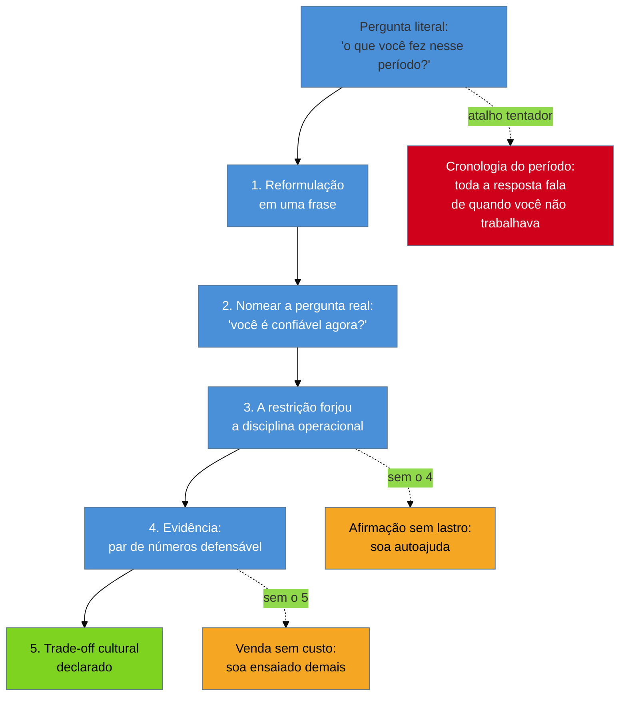

# Defender um hiato longo

> [!abstract] TL;DR
> A [[03-Dominios/Carreira/Entrevistas/12 - Red flags que sêniores produzem sem perceber|nota 12]] catalogou o que desqualifica um candidato tecnicamente forte, e a tese deste broto é uma aplicação direta dela: **um hiato de anos não é red flag — a resposta sobre ele é.** O erro estrutural é responder à pergunta literal ("o que você fez nesses anos?") quando quem pergunta quer saber outra coisa: **você é confiável agora?** Toda a estratégia decorre disso — trazer a pergunta real à superfície e responder a ela, em cinco movimentos nesta ordem: reformulação em uma frase, nome da pergunta por baixo, a restrição como origem de uma disciplina operacional, evidência com dado duro, e o trade-off cultural declarado antes de ser descoberto. Quando o motivo é saúde, entra um segundo eixo que quase nenhum guia menciona: nos Estados Unidos o ADA **proíbe** a empresa de fazer perguntas sobre condição médica antes da oferta condicional, e no Brasil a LGPD trata dado de saúde como sensível — o que significa que o nível de detalhe é escolha do candidato, não obrigação. A metade escrita deste tema — o que vai no papel e como se parte um vão de anos — está em [[03-Dominios/Carreira/Currículo/16a - Lacuna longa e reentrada|Currículo/16a]].

## A pergunta chega, e chega cedo

Uma recrutadora abre a chamada de triagem, diz o nome da empresa, pergunta se você tem quinze minutos, e a terceira ou quarta frase dela é alguma variação de: *"eu vi aqui um intervalo grande no seu histórico — me conta o que você estava fazendo nesse período?"*. Não é hostilidade. É o trabalho dela: ela vai apresentar você a um gestor, o gestor vai olhar as mesmas datas, e ela precisa chegar com a resposta pronta para não ser pega sem ela.

O que acontece na cabeça de quem carrega o hiato, nesse instante, é o problema deste broto. A pergunta ativa constrangimento, o constrangimento produz uma das duas respostas ruins — a versão longa e apologética, ou a versão curta e evasiva —, e ambas confirmam exatamente a suspeita que a pergunta veio testar. A [[03-Dominios/Carreira/Entrevistas/12 - Red flags que sêniores produzem sem perceber|nota 12]] descreve esse padrão para outros conteúdos: o candidato tecnicamente forte que se desqualifica não por incompetência, mas por como fala de algo. É o mesmo mecanismo aqui, e vale nomeá-lo com todas as letras porque ele muda a preparação inteira: **o intervalo no papel é um fato, e fatos não desqualificam ninguém; a resposta é uma performance, e performances desqualificam todos os dias.**

## O erro estrutural: responder à pergunta literal

A pergunta literal é sobre o passado — *o que você fez*. Quem responde só a ela produz uma narrativa cronológica do período afastado, e essa narrativa, por melhor construída que seja, tem um defeito insuperável: ela é inteiramente sobre um tempo em que a pessoa não estava trabalhando. Cada frase reforça o quadro que o candidato queria dissolver.

A pergunta real é sobre o futuro, e o entrevistador quase nunca a formula em voz alta porque ela soaria grosseira: *você é confiável agora? Se eu apostar nesta contratação, eu vou ter um problema?* É essa a decisão que ele precisa tomar, e é a única a que vale a pena responder.

> [!question]- Não é arriscado dizer em voz alta uma pergunta que o entrevistador não fez?
> É o contrário — é o movimento que mais rende, e por um motivo mecânico. Enquanto a pergunta real não é nomeada, ela fica ativa em segundo plano na cabeça de quem ouve, filtrando cada frase da sua resposta em busca de sinal de risco. Nomeá-la desarma esse filtro: mostra que você entende o que está em jogo, que não está tentando desviar, e transfere a conversa do terreno em que você é fraco (o passado ausente) para o terreno em que você é forte (a operação atual). O tom importa — é reconhecimento, não confronto. *"A pergunta real por baixo dessa não é o que aconteceu em 2016, é se eu sou confiável agora — então deixa eu responder essa"* funciona; *"o que você realmente quer saber é..."* em tom de acusação, não.

## Os cinco movimentos

A estrutura abaixo é uma extensão do procedimento de três movimentos que a [[03-Dominios/Carreira/Currículo/19 - Declarar lacuna|nota 19 do Currículo]] fixou para lacuna técnica — nomear, adjacente, prazo. A lógica é a mesma: a ordem não é estética, cada movimento prepara o terreno do seguinte, e invertê-los produz um defeito de leitura específico. O que muda é que uma lacuna de tempo, ao contrário de uma lacuna de competência, não tem prazo de rampa a oferecer — a competência já voltou. No lugar do prazo entram a evidência e o trade-off.

**1. Reformulação em uma frase.** A primeira frase define o enquadramento da conversa inteira, e por isso não pode ser a cronologia. Ela nomeia o período pelo que ele foi, no seu vocabulário, não no vocabulário do medo: *"entre 2016 e 2019 eu fiz um hiato para recalibrar minha saúde"*. Uma frase, dita sem pressa, seguida de uma pausa curta. A maioria dos candidatos atropela essa frase e perde o único momento em que estava definindo o quadro em vez de reagir a ele.

**2. Nomear a pergunta por baixo.** O movimento descrito acima. Custa uma frase e compra a atenção do resto.

**3. A restrição como origem da disciplina.** Aqui está a virada, e ela precisa ser concreta ou vira autoajuda. O argumento não é "aprendi muito comigo mesmo" — é que a restrição **forçou uma mudança verificável no modo de trabalhar**. Quem não pode contar com presença síncrona constante para de usar presença como mecanismo de entrega e constrói governança no lugar: CI/CD com rollback automatizado, teste automatizado para que a rede de segurança seja o sistema e não a sua atenção, documentação para que o time não dependa de um ping. Isso não é discurso sobre resiliência; é uma lista de práticas que a pessoa faz ou não faz, e que o entrevistador pode sondar.

**4. Evidência com dado duro.** O movimento 3 é uma afirmação, e afirmação sem número é opinião. Um par de números fecha: frequência de deploy antes e depois, cobertura de teste, tempo de suíte, lead time. Vale a régua da [[03-Dominios/Carreira/Entrevistas/11 - Comunicar trade-offs sob pressão|nota 11]] e a disciplina de confiança da [[03-Dominios/Carreira/Currículo/14 - Números que você pode defender|nota 14 do Currículo]]: par de números é mais defensável que percentual, e nada entra na resposta que você não consiga explicar como mediu.

**5. O trade-off cultural, declarado antes de ser descoberto.** O fechamento que separa uma resposta boa de uma resposta madura. Um modelo de trabalho assíncrono, escrito e orientado a resultado funciona muito bem em empresas que valorizam decisão documentada e *accountability* por entrega, e funciona mal em ambientes que confundem presença com produtividade. Dizer isso em voz alta parece contra-intuitivo — é vender contra si mesmo? —, mas produz três efeitos de uma vez: sinaliza autoconhecimento, sinaliza que você não está desesperado por qualquer vaga, e filtra um ambiente onde a contratação daria errado em três meses. É a mesma lógica que a [[03-Dominios/Carreira/Entrevistas/11 - Comunicar trade-offs sob pressão|nota 11]] já fixou para decisões técnicas: admitir o custo é o que torna a afirmação crível.

> **Em uma frase:** não explique o período — responda à pergunta que o período fez o entrevistador se fazer.

## O eixo que quase nenhum guia menciona: você não é obrigado a detalhar

Quando o motivo do hiato é saúde, há um dado de contexto que muda a postura de quem responde, e que raramente aparece nos guias de entrevista: **em boa parte dos mercados, a empresa não pode perguntar.**

Nos Estados Unidos — mercado relevante para quem faz processo internacional —, o *Americans with Disabilities Act* proíbe o empregador de fazer perguntas relacionadas a deficiência ou exigir exame médico **antes de uma oferta condicional de emprego**. A orientação da EEOC é explícita: nessa fase, o empregador não pode perguntar se o candidato tem uma deficiência, nem sobre a natureza de uma deficiência aparente, **mesmo que a pergunta seja relacionada ao trabalho**. O que ele pode fazer é perguntar sobre a **capacidade de executar as funções do cargo**, desde que a pergunta não seja formulada em termos de condição médica — e pode pedir que o candidato descreva ou demonstre como executaria essas funções. Depois da oferta condicional, a regra muda e perguntas médicas passam a ser permitidas, desde que aplicadas a todos os contratados da mesma categoria.

No Brasil, o mecanismo é outro mas o efeito prático se sobrepõe: a **LGPD** (Lei 13.709/2018, Art. 5º, II) classifica dado referente à saúde como **dado pessoal sensível**, categoria com regime de proteção mais estrito justamente porque revela aspecto íntimo e cria risco de discriminação.

O valor disso numa entrevista não é jurídico — ninguém deveria citar o ADA numa chamada de triagem, e fazê-lo seria um dos piores movimentos possíveis, porque transforma uma conversa em confronto e cria exatamente o risco que a empresa quer evitar. O valor é **postural**. Saber que o detalhe clínico é uma escolha sua, e não uma dívida sua, é o que permite responder com serenidade em vez de com a urgência de quem sente que está devendo uma explicação. A frase que traduz essa postura sem citar lei nenhuma é curta e educada: *"a recalibração em si é privada; a disciplina que ela forçou é o que eu estou trazendo para o time de vocês"* — e ela funciona porque não recusa a conversa, apenas move o eixo dela de volta para o que interessa aos dois lados.

> [!warning] O limite simétrico
> Nada disso autoriza o silêncio total. A [[03-Dominios/Carreira/Currículo/16 - A seção de experiência profissional|nota 16 do Currículo]] já mostrou que uma lacuna sem explicação não desaparece — vira pergunta em aberto, e pergunta em aberto na cabeça de quem lê rápido é preenchida com a hipótese mais simples, nem sempre a mais favorável. Recusar-se a dar **qualquer** enquadramento produz o mesmo vácuo, agora com o agravante de ter sido criado ao vivo. O objetivo não é reter informação: é **escolher a granularidade**. Categoria, sim; diagnóstico, opcional.

## O que não fazer

> [!warning] Abrir pelo detalhe médico
> **O que acontece:** a resposta começa pelo diagnóstico, pelo tratamento ou pela gravidade, e os primeiros trinta segundos da conversa são clínicos.
> **Por quê:** o entrevistador entra imediatamente em modelagem de risco — quantos dias, quantas ausências, e se ele pode sequer fazer as perguntas de acompanhamento que acabaram de surgir na cabeça dele (na maioria dos casos, não pode, o que o deixa desconfortável e sem saída). O quadro da conversa fica médico e não volta mais a ser técnico.
> **Como evitar:** o movimento 1 existe exatamente para ocupar esse espaço. A primeira frase define o quadro; se ela for clínica, todo o resto será.

> [!warning] O enquadramento apologético
> **O que acontece:** *"eu tive que parar de trabalhar"*, *"precisei de um tempo para me recuperar"*, *"desculpa pelo gap"*.
> **Por quê:** pedido de desculpa é um pedido de concessão, e concessão pressupõe falta. A construção sintática entrega uma postura de quem está negociando perdão em vez de apresentar um profissional.
> **Como evitar:** voz ativa e vocabulário próprio. Hiato, recalibração, retomada — não "tive que", não "precisei", não "desculpa".

> [!warning] A postura de guerreiro
> **O que acontece:** o oposto do apologético — *"trabalhei mesmo doente"*, *"nunca deixei isso me atrasar"*, *"levo o laptop comigo"*.
> **Por quê:** parece força e lê como risco. Quem promete operar em condições que não sustentam operação está descrevendo um processo frágil, e um entrevistador experiente ouve exatamente isso: uma pessoa que vai se comprometer além do que consegue entregar e falhar no pior momento. É a mesma leitura que a [[03-Dominios/Carreira/Entrevistas/12 - Red flags que sêniores produzem sem perceber|nota 12]] descreve para o herói que resolve tudo sozinho.
> **Como evitar:** descrever o sistema, não o esforço. Runbook que outra pessoa executa, rollback automatizado, documentação — arquitetura absorve a restrição melhor do que heroísmo.

> [!warning] Pedir compreensão ou flexibilidade
> **O que acontece:** a resposta termina com um pedido — que sejam compreensivos, que ofereçam flexibilidade, que entendam a situação.
> **Por quê:** enquadra o candidato como **algo a acomodar** em vez de **alguém a contratar**, e desloca a conversa para custo antes de a competência ter sido estabelecida. O momento de discutir arranjo de trabalho existe, e é depois — em geral já com oferta na mesa, quando a assimetria de poder é menor.
> **Como evitar:** apresentar o modelo de trabalho como **arquitetura deliberada**, não como necessidade: *"assíncrono é o meu modelo operacional, não um pedido de acomodação"*.

> [!warning] Estender a defesa para além do afastamento
> **O que acontece:** o candidato aplica os cinco movimentos — e o tom grave que vem com eles — a **todo** intervalo do histórico, incluindo os meses entre um contrato e outro de uma carreira freelance.
> **Por quê:** quem carregou um afastamento longo tende a estender o vocabulário do afastamento para tudo o que veio depois, e passa a se defender de períodos que não acusam nada. O efeito é o oposto do pretendido: transforma o ritmo normal de quem trabalha por projeto — prospecção, proposta, entrega, e o vão até o próximo — em confissão, e sugere ao entrevistador que existe um problema onde ele não tinha visto nenhum.
> **Como evitar:** saber onde o afastamento termina, e parar ali. Intervalo entre clientes se responde em uma frase, no tom mais banal disponível: *"trabalho por projeto; entre um contrato e outro há o tempo de prospecção"*. A [[03-Dominios/Carreira/Currículo/16a - Lacuna longa e reentrada|nota 16a do Currículo]] trata da mesma distinção do lado do documento.

> [!warning] Não ensaiar
> **O que acontece:** a pergunta chega, o candidato hesita, enrola, se corrige no meio da frase.
> **Por quê:** essa é a única pergunta de toda a entrevista cuja **fluência** é, ela mesma, parte da resposta. Hesitação aqui lê como desconforto, e desconforto lê como algo não resolvido — o que, na cabeça de quem contrata, projeta risco para dentro do trabalho.
> **Como evitar:** memória muscular. Três frases-âncora decoradas literalmente, testadas em voz alta e cronometradas. É a aplicação mais estrita do método do repertório da [[03-Dominios/Carreira/Entrevistas/10 - O banco de histórias|nota 10]].

## Calibrar pelo tempo e pela etapa

A resposta completa tem entre dois e meio e três minutos, e não é a mesma em todas as etapas do funil que a [[03-Dominios/Carreira/Entrevistas/02 - A anatomia do funil internacional|nota 02]] mapeou.

| Etapa | Quem pergunta | Versão | O que corta |
| --- | --- | --- | --- |
| Triagem com recrutador | recrutador, sem contexto técnico | ~60 segundos | corta o movimento 5 (trade-off cultural) e o detalhe técnico da governança; mantém reformulação, pergunta real e um número |
| Hiring manager | quem vai conviver com o risco | 2,5 a 3 minutos | versão completa, os cinco movimentos — é aqui que a decisão acontece |
| Entrevista técnica | par técnico | não surge, em geral | se surgir, responder curto e devolver ao problema técnico em discussão |
| Pós-oferta | RH / operações | conversa diferente | aqui, sim, arranjo de trabalho e necessidades concretas — com oferta na mesa |

O corte para sessenta segundos importa mais do que parece: em triagem, a versão longa soa ensaiada demais para o contexto e consome o tempo que o recrutador reservou para outras cinco perguntas. Manter os movimentos 1, 2 e um único número é suficiente — a recrutadora precisa de uma resposta que ela consiga **repetir** ao gestor, não de uma que ela precise resumir.

## Follow-ups previsíveis

Um hiato longo bem respondido gera perguntas de acompanhamento, e isso é sinal de que a resposta funcionou — o entrevistador parou de avaliar risco e começou a explorar. As quatro mais frequentes:

**"Como é uma semana típica para você?"** — a pergunta pede concretude sobre o modelo operacional que o movimento 3 afirmou. Resposta forte descreve o desenho: blocos longos de trabalho profundo, tempo síncrono agrupado em poucas janelas, decisões em documento. O ponto é que o sistema absorve a restrição sem torná-la visível para o time.

**"E se acontecer um incidente crítico bem no meio da sua indisponibilidade?"** — a pergunta de risco operacional, e a tentação é prometer disponibilidade total. Resposta forte responde com arquitetura: a maior parte é prevenida por rollback automatizado, observabilidade e runbook; para o resto, o time consegue agir porque o sistema está documentado para ser acionado por outra pessoa. Prometer estar sempre alcançável seria prometer um processo frágil.

**"Já aconteceu de isso virar bloqueio de fato?"** — a pergunta que testa honestidade, e negar é o pior movimento. Resposta forte admite um caso, nomeia a causa em termos de sistema (documentação não delegada fundo o suficiente) e diz o que mudou depois. É o STAR-L da [[03-Dominios/Carreira/Entrevistas/06 - STAR e suas variantes|nota 06]] aplicado a um fracasso operacional próprio.

**"Por que voltar para uma empresa, se o seu modelo é tão autônomo?"** — a pergunta de intenção. Resposta forte separa as duas coisas: trabalhar sozinho é assíncrono **sem alinhamento**; o que se busca é assíncrono **com missão compartilhada**. São problemas diferentes, e um não é a versão diluída do outro.

## Casos práticos

### Cenário 1 — o hiato com projeto dentro dele

O candidato tem um vão de anos, e dentro dele existe trabalho técnico real que já foi registrado no documento — a operação que a [[03-Dominios/Carreira/Currículo/16a - Lacuna longa e reentrada|nota 16a do Currículo]] chama de partir o vão. A resposta muda de tom: o hiato deixa de ser um bloco e passa a ser uma trajetória com uma retomada datada no meio. O movimento 4 fica mais forte, porque a evidência não é só do emprego atual — é de dentro do período em disputa.

> [!example] Caso real
> A trajetória do autor deste vault tem um afastamento de saúde de longa duração que vai de **nov/2016 a nov/2019**, e que termina num projeto de engenharia de dados para uma pesquisa clínica, entre **nov/2019 e jun/2020**: migração de banco Access e planilhas para MySQL containerizado, e um motor de relatórios configurável que passou a gerar vinte relatórios estatísticos por um comando. O que esse projeto oferece à resposta de entrevista não é o mérito técnico — é a **coordenação**: cliente não técnico, remoto, disponibilidade irregular dos dois lados, e o issue tracker adotado como contrato de trabalho, com template dedicado de solicitação. Vinte e sete issues abertas, vinte e sete fechadas, nenhuma pendente no encerramento.
>
> Isso é o movimento 3 com lastro documental e datado: o modelo assíncrono e orientado a artefato escrito não é uma reconstrução narrativa feita depois, é uma prática registrada em 2020, no exato ponto em que o afastamento termina, e verificável commit a commit. O número de issues fechadas é o tipo de dado que a [[03-Dominios/Carreira/Currículo/14 - Números que você pode defender|nota 14 do Currículo]] classifica como medido, não lembrado.
>
> Note que esse projeto **fecha** o afastamento em vez de acontecer no meio dele — o que veio depois foi trabalho freelance por projeto, com os intervalos entre contratos que esse modelo tem. Na resposta de entrevista, isso importa mais do que parece: a defesa dos cinco movimentos cobre os três anos de afastamento e **para ali**. Estendê-la ao período freelance seria pedir desculpa por uma coisa que não precisa de desculpa.

### Cenário 2 — o hiato sem nada dentro dele

Nem todo afastamento produz artefato, e um tratamento pesado, um luto ou um período de cuidado integral de outra pessoa podem simplesmente não deixar registro técnico nenhum. Fingir que deixaram é o caminho mais curto para a invenção que a [[03-Dominios/Carreira/Currículo/15 - Quando não há número|nota 15 do Currículo]] condena.

Nesse caso, os cinco movimentos continuam válidos — o que muda é de onde vem a evidência do movimento 4. Ela migra inteira para **depois** do retorno: o que foi construído no primeiro emprego pós-hiato, com números medidos ali. A resposta fica mais curta e mais dependente da entrada mais recente, o que reforça a prescrição da nota 16a de concentrar densidade documental exatamente lá. E o movimento 3 continua funcionando, porque a disciplina operacional forjada pela restrição não precisa de projeto para ser verdadeira — precisa de ser demonstrável no trabalho atual, que é onde o entrevistador vai sondá-la de qualquer forma.

## Como explicar em inglês

A construção que carrega esta resposta em inglês é a de nomear a pergunta real antes de respondê-la. Duas ou três frases, ensaiadas literalmente:

*"Between 2016 and 2019 I took a hiatus to recalibrate my health. The real question underneath this one isn't what happened in 2016 — it's whether I'm reliable now, so let me answer that one instead. The constraint forged the discipline: when you can't rely on constant synchronous presence, you stop using presence as a delivery mechanism and build governance instead — automated rollback, tests as the safety net, documentation so the team never depends on a ping. The recalibration itself is private; the discipline it forced is what I'm bringing to your team."*

| PT | EN |
| --- | --- |
| hiato estratégico, não ausência | a strategic hiatus, not an absence |
| a pergunta por baixo da pergunta | the real question underneath |
| a restrição forjou a disciplina | the constraint forged the discipline |
| modelo operacional, não pedido de acomodação | an operating model, not an accommodation request |
| recalibrar | to recalibrate |
| governança | governance |
| rede de segurança | safety net |
| plantão / escala de sobreaviso | on-call rotation |
| inovação guiada por restrição | constraint-driven innovation |
| oferta condicional | conditional offer |

## O que vem a seguir

Este broto tratou da metade falada de um tema que tem duas metades, e é útil ler as duas na ordem em que o processo as apresenta — primeiro o documento que gera a conversa, depois a conversa.

- [[03-Dominios/Carreira/Currículo/16a - Lacuna longa e reentrada|Currículo/16a - Lacuna longa e reentrada]] — **a outra metade**: o que vai no papel, como se parte um vão de anos com trabalho real, e por que o diagnóstico não pertence ao documento.
- [[03-Dominios/Carreira/Entrevistas/13 - A entrevista reversa|13 - A entrevista reversa]] — o movimento 5 declarou um trade-off cultural; as suas perguntas são como você **verifica** se aquele trade-off é compatível com a empresa, antes de aceitar.
- [[03-Dominios/Carreira/Entrevistas/14 - Negociação de oferta (capstone)|14 - Negociação de oferta (capstone)]] — a etapa em que a conversa sobre arranjo de trabalho finalmente cabe, com oferta na mesa e a assimetria de poder reduzida.

## Veja também

- [[03-Dominios/Carreira/Entrevistas/12 - Red flags que sêniores produzem sem perceber|12 - Red flags que sêniores produzem sem perceber]] — a nota mãe: o hiato não é a red flag, a resposta é.
- [[03-Dominios/Carreira/Entrevistas/03 - Fale sobre você — o pitch de abertura|03 - Fale sobre você — o pitch de abertura]] — a outra pergunta previsível da triagem, com a mesma economia de primeira frase.
- [[03-Dominios/Carreira/Entrevistas/10 - O banco de histórias|10 - O banco de histórias]] — o método de repertório que esta resposta exige em grau máximo.
- [[03-Dominios/Carreira/Entrevistas/11 - Comunicar trade-offs sob pressão|11 - Comunicar trade-offs sob pressão]] — o princípio de que admitir o custo é o que torna a afirmação crível, aplicado aqui ao movimento 5.
- [[03-Dominios/Carreira/Currículo/19 - Declarar lacuna|Currículo/19 - Declarar lacuna]] — o procedimento de três movimentos para lacuna **técnica**, que esta nota estende para lacuna de **tempo**.
- [[03-Dominios/Carreira/Entrevistas/index|Entrevistas]] — o índice do galho.

## Fontes

- **U.S. Equal Employment Opportunity Commission** — [*Pre-Employment Inquiries and Disability*](https://www.eeoc.gov/pre-employment-inquiries-and-disability) e [*Enforcement Guidance on Preemployment Disability-Related Questions and Medical Examinations under the ADA*](https://www.eeoc.gov/newsroom/eeoc-issues-final-enforcement-guidance-preemployment-disability-related-questions-and-0). Fonte da regra citada: antes da oferta condicional o empregador não pode fazer perguntas relacionadas a deficiência nem exigir exame médico, mesmo que relacionados ao trabalho; pode perguntar sobre capacidade de executar funções do cargo, desde que não formulado em termos de condição médica. Consultado em 2026-08-31.
- **Brasil** — [Lei 13.709/2018 (LGPD), Art. 5º, II](https://www.planalto.gov.br/ccivil_03/_ato2015-2018/2018/lei/l13709.htm). Classifica dado referente à saúde como dado pessoal sensível.
- **Kory Kroft, Fabian Lange e Matthew J. Notowidigdo** — [*Duration Dependence and Labor Market Conditions*](https://www.nber.org/papers/w18387), *The Quarterly Journal of Economics* (2013). Usado indiretamente aqui: a queda de retorno se concentra nos primeiros oito meses, o que sustenta a decisão de não gastar a resposta explicando a duração. O tratamento completo do achado está na [[03-Dominios/Carreira/Currículo/16a - Lacuna longa e reentrada|nota 16a do Currículo]].
- **Josenaldo Matos** — trajetória própria: afastamento de saúde de nov/2016 a nov/2019, encerrado pelo projeto de pesquisa de nov/2019 a jun/2020, que marca a reentrada; o período seguinte é de trabalho freelance por projeto, de outra natureza (confirmado pelo autor em 2026-08-31). Métricas do projeto, com métricas medidas nos repositórios privados em 2026-08-30 (74 commits, 27 issues abertas e fechadas, 20 relatórios). Repositórios são ferramental privado, sem link público. A estrutura de cinco movimentos desta nota foi generalizada a partir de material de preparação de entrevista do próprio autor, testado em mentoria de carreira.
