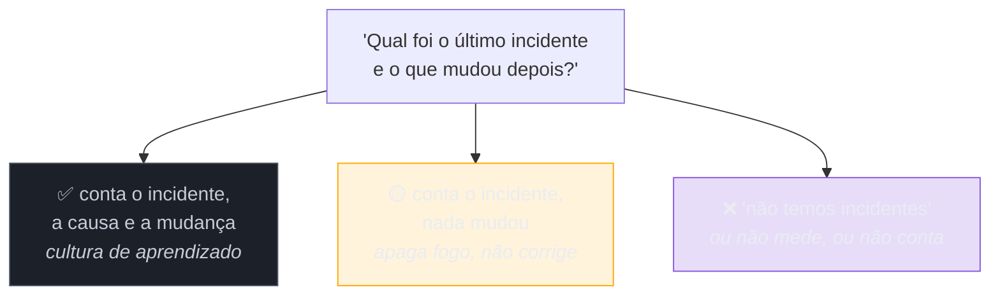

# A entrevista reversa

> [!abstract] TL;DR
> "Você tem alguma pergunta?" não é formalidade de encerramento: é **avaliada**, e é a única parte do processo que você controla inteiramente. Suas perguntas revelam o que você considera importante num trabalho — o que é, em si, um sinal de senioridade. E há o segundo uso, que a maioria dos candidatos desperdiça: essa é a sua janela para descobrir **se você quer o emprego**. Perguntas sobre release, incidente, dívida técnica e priorização produzem respostas que denunciam disfunção organizacional com bastante precisão — desde que você saiba ler o que vem, inclusive o silêncio.

## As duas perguntas que ninguém faz

Fim da conversa, sobram cinco minutos. *"Alguma pergunta para mim?"*

Duas respostas comuns, ambas ruins. A primeira: *"não, ficou tudo claro"* — que, conforme a [[12 - Red flags que sêniores produzem sem perceber|nota anterior]], é lida como desinteresse. A segunda é mais sutil e igualmente desperdiçada: perguntas cuja resposta está no site da empresa — o que ela faz, quantas pessoas tem, quais são os valores. Não custam pontos, mas não produzem nada, e consomem o único espaço da conversa que era seu.

Aqui vale dizer o óbvio que raramente é dito: **você também está decidindo**. Um processo sênior costuma levar semanas e desemboca numa escolha que ocupará anos da sua vida — e a maior parte da informação de que você precisa para escolher bem só existe dentro daquela empresa, acessível por essas perguntas.

## Perguntas que revelam senioridade

O que distingue uma boa pergunta é que a resposta **muda a sua decisão**. Perguntas por área:

**Sobre decisão técnica**
- Como uma decisão de arquitetura é tomada aqui — quem decide, e como um desacordo se resolve?
- Qual foi a última decisão técnica grande do time, e o que a motivou?

**Sobre a realidade do dia a dia**
- Como é o processo de release hoje? Com que frequência, e o que costuma dar errado?
- Como o time lida com dívida técnica — existe espaço reservado, ou entra na disputa com feature?
- Como funciona o on-call? Qual foi o último incidente relevante e **o que mudou depois dele**?

**Sobre o time e o papel**
- Por que esta posição está aberta — crescimento, substituição, projeto novo?
- O que a pessoa nesta vaga precisa entregar nos primeiros seis meses para o senhor considerar a contratação um acerto?
- Qual a maior frustração do time hoje?

**Sobre a pessoa à frente** (funciona bem com o gestor)
- O que te fez ficar aqui?
- O que você mudaria na engenharia se pudesse mudar uma coisa?

A última costuma render mais que todas as outras juntas — porque é a única que pede uma resposta que não está pronta.

## Como ler as respostas

O conteúdo da resposta importa menos que a **forma** dela. Três leituras que raramente falham:

**Hesitação diante de pergunta simples.** Se "com que frequência vocês fazem deploy?" produz uma pausa longa, a resposta provavelmente é desconfortável.

**Resposta genérica para pergunta específica.** Perguntou-se sobre dívida técnica e veio "a gente valoriza qualidade" — o abstrato costuma substituir o concreto quando o concreto não é bonito.

**Divergência entre etapas.** A mesma pergunta feita a três pessoas diferentes é uma das ferramentas mais úteis do processo: respostas que se contradizem sobre prioridade, processo ou papel indicam desalinhamento interno — e desalinhamento é o que você vai viver.

> [!question]- Perguntar sobre incidente e dívida não passa impressão negativa?
> Ao contrário — é uma das coisas que mais sinalizam senioridade, e vale entender por quê. Um júnior pergunta sobre tecnologia; um sênior pergunta sobre **como o trabalho realmente acontece**, porque já viveu o suficiente para saber que o stack importa menos que o processo. Empresa saudável responde a essas perguntas com naturalidade, e frequentemente com alívio: o entrevistador reconhece alguém que já operou de verdade. Se a pergunta gerar desconforto defensivo, você acabou de obter a informação mais valiosa da conversa — e de graça. O tom ajuda: pergunte com curiosidade, não como auditor.

## Calibrar por etapa

Cada interlocutor responde bem a um tipo de pergunta — e mal aos outros:

| Etapa | Pergunte sobre | Evite |
| --- | --- | --- |
| Recrutador | processo, etapas, prazos, modalidade de contratação | detalhe técnico do sistema |
| Hiring manager | prioridades, expectativa de 6 meses, decisão técnica, o que ele mudaria | trivialidades do site |
| Engenheiros | dia a dia, release, on-call, dívida, code review | política de férias |
| Cultural | como o time discorda, como é o feedback | remuneração |
| Executivo | direção do produto, o que muda em 2 anos | detalhe de implementação |

Regra prática: **duas ou três por etapa**, e evite repetir a mesma pessoa a pessoa — salvo quando a repetição for deliberada, para comparar respostas.

## Armadilhas comuns

> [!warning] Perguntar o que está no site
> **O que acontece:** "o que a empresa faz?" ou "quais são os valores de vocês?". Não custa pontos diretamente, mas gasta o espaço e sinaliza que você não pesquisou. **Por quê:** são perguntas seguras — não expõem opinião nem arriscam constranger. **Como evitar:** pergunte o que **não** é publicável: como se decide, o que deu errado, o que o entrevistador mudaria. Informação pública você lê antes.

> [!warning] Perguntar sobre remuneração e benefícios na hora errada
> **O que acontece:** a pergunta surge no meio do painel técnico e desloca a conversa; o entrevistador engenheiro nem tem a informação. **Por quê:** é uma dúvida legítima e urgente para o candidato, e a oportunidade parece boa. **Como evitar:** faixa e modalidade são assunto do **recrutador**, cedo; detalhe de pacote é assunto da **oferta**. Nas etapas técnicas, pergunte sobre trabalho. Isso não é timidez — é [[14 - Negociação de oferta (capstone)|estratégia de negociação]].

> [!warning] Fazer as perguntas e não usar as respostas
> **O que acontece:** o candidato pergunta bem, ouve sinais claros de disfunção — deploy manual mensal, on-call sem compensação, nenhuma mudança após incidente — e aceita a oferta sem incorporar nada disso à decisão. **Por quê:** depois de semanas de processo, existe um custo afundado emocional e a vontade de que dê certo. **Como evitar:** anote as respostas logo após cada etapa, enquanto estão frescas, e releia **antes** de decidir sobre a oferta. As perguntas só valem se as respostas tiverem peso.

## Como soa em inglês

> "The questions at the end are assessed, and they're the only part of the process I fully control — what I ask says what I think matters in a job. But the bigger use is that it's my window to work out whether I want the role. I ask about how architectural decisions get made and how disagreements are resolved, what the release process actually looks like and what usually goes wrong, how technical debt competes with feature work, and what the last significant incident was and what changed afterwards. That last one is the most informative: if the answer is that nothing changed, or that they don't have incidents, I've learned a lot. I also like asking the manager what they'd change about engineering if they could change one thing — it's the only question where the answer isn't pre-prepared."

| PT | EN |
| --- | --- |
| entrevista reversa | reverse interview |
| plantão / sobreaviso | on-call |
| dívida técnica | technical debt |
| pós-incidente | postmortem |
| desalinhamento | misalignment |
| sinal de alerta | warning sign |
| custo afundado | sunk cost |

## O que vem a seguir

Feitas as perguntas e tomada a decisão de que você quer o emprego, resta a última etapa — a que mais gente atravessa mal preparada, e a única em que alguns minutos de conversa valem, literalmente, dezenas de milhares.

- [[14 - Negociação de oferta (capstone)]] — **fecha o galho**: BATNA, ancoragem, estrutura de comp e o mapa das 14 notas.
- [[12 - Red flags que sêniores produzem sem perceber]] — a red flag que esta nota corrige.
- [[02 - A anatomia do funil internacional]] — as etapas em que calibrar as perguntas.

## Veja também

- [[03-Dominios/Engenharia/Operação/4 - Observar e responder/05 - Postmortems e cultura blameless|Postmortems e cultura blameless]] — o que a resposta sobre incidentes deveria descrever.
- [[03-Dominios/Engenharia/Operação/1 - O ofício de operar/01 - O que é operar um sistema|O que é operar um sistema]] — a régua para avaliar o que te contarem.

## Fontes

- **Camille Fournier** — *The Manager's Path* (2017) — o que um gestor espera ouvir e o que revela ao responder.
- **Google SRE Book** — [*Postmortem Culture*](https://sre.google/sre-book/postmortem-culture/) — por que "o que mudou depois do incidente" é uma pergunta diagnóstica.
- **Will Larson** — *Staff Engineer* (2021) — avaliar empresa e escopo antes de aceitar, do ponto de vista de quem já é sênior.
