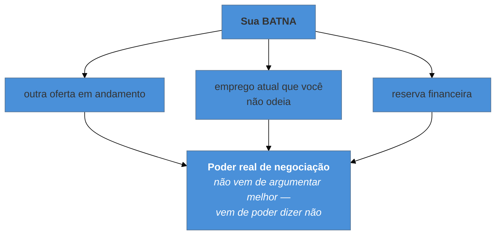

# Negociação de oferta (capstone)

> [!abstract] TL;DR
> A negociação **não começa na oferta** — começa na triagem, quando alguém pergunta sua expectativa
> salarial, e quem responde um número naquele momento define o teto de tudo que vem depois. Os conceitos
> que organizam a etapa são três: **ancoragem** (o primeiro número molda a faixa inteira), **BATNA** (seu
> poder real vem de ter alternativa, não de argumentar bem) e a **estrutura do pacote** (base é um item
> entre muitos, e frequentemente o mais travado). Vale sempre negociar, e vale fazê-lo sem hostilidade:
> a pessoa do outro lado será sua colega na segunda-feira. Esta nota **fecha o galho** com o mapa das 14
> notas por etapa do funil.

## O número dito em cinco segundos

Segunda conversa do processo, ainda com o recrutador. Pergunta de rotina: *"qual sua expectativa salarial?"*.

O candidato responde de improviso, com base no que ganha hoje mais alguma coisa. Diz o número em cinco segundos e a conversa segue.

Cinco semanas depois chega a oferta — exatamente naquele valor. Ele não sabe, e nunca vai saber, que a faixa aprovada para a vaga era substancialmente maior, e que o processo inteiro operou dentro do teto que **ele mesmo** estabeleceu antes de saber qualquer coisa sobre a vaga.

Não houve má-fé: o recrutador trabalhou com a informação que recebeu. **A negociação já tinha acontecido**, num momento em que o candidato nem sabia que estava negociando — e é por isso que esta nota trata da triagem antes de tratar da oferta.

## Ancoragem: o primeiro número manda

Ancoragem é um viés bem documentado: o primeiro valor mencionado numa negociação exerce influência desproporcional sobre o resultado, mesmo quando as partes sabem disso.

A consequência prática é uma preferência clara: **deixe a faixa vir primeiro**. Diante da pergunta de expectativa, três respostas úteis, em ordem de preferência:

1. **Devolver.** *"Qual a faixa prevista para a posição? Assim consigo dizer se faz sentido para os dois lados."* — funciona na maior parte das vezes e é profissional. Em muitos lugares a faixa é inclusive obrigatória por lei.
2. **Adiar com sinceridade.** *"Prefiro entender melhor o escopo antes de falar de número — podemos voltar a isso depois da conversa técnica?"*
3. **Dar uma faixa pesquisada**, se insistirem — larga, ancorada em dados públicos da região e do cargo, e com o piso já acima do seu mínimo real.

O que **não** fazer é ancorar no seu salário atual. Ele reflete o mercado em que você está, não o da vaga — e, para quem está em região de faixa menor, isso é a diferença entre negociar pelo valor do trabalho e negociar pela sua história. É legítimo dizer que prefere não compartilhar a remuneração atual; em várias jurisdições, aliás, perguntá-la é vedado.

## BATNA: de onde vem o poder

**BATNA** — *best alternative to a negotiated agreement* — é a melhor coisa que acontece com você **se esta negociação fracassar**. É o conceito central de negociação, e ele reorganiza a percepção da etapa:

Duas implicações práticas.

**Poder não vem de retórica.** Ninguém melhora a oferta porque você argumentou bem; melhora porque a alternativa de te perder é pior que o custo do aumento. Daí o valor de rodar processos **em paralelo** — não por deslealdade, mas porque isso é literalmente o que cria margem.

**Conheça a sua antes de sentar.** Se a alternativa é um emprego atual do qual você quer sair a qualquer custo, sua BATNA é fraca — e é melhor saber disso e negociar com moderação do que blefar e ter o blefe testado. Um blefe descoberto custa mais que o incremento pretendido.

## O pacote é maior que o salário

Concentrar tudo na base é o erro tático mais comum. A base costuma ser o item **mais travado** — presa a faixas internas e a equidade com quem já está no time —, enquanto vários outros itens têm folga e aprovação mais simples:

| Item | Costuma ter folga? |
| --- | --- |
| Salário-base | pouca — faixa e equidade interna |
| Bônus de contratação (*signing*) | **sim** — pagamento único, não afeta a estrutura |
| Equity / participação | varia muito; peça o quadro completo antes de valorar |
| Verba de equipamento e home office | **sim**, e costuma ser fácil |
| Orçamento de aprendizado e conferência | **sim** |
| Férias e folgas adicionais | às vezes |
| Data de início | **sim** — e vale dinheiro se você tem algo a receber |
| Nível/título | difícil, mas define os próximos anos |

Uma nota sobre **equity**: em empresa de capital fechado, o número de ações não significa nada isolado. O que importa é o percentual do total, o *strike price*, o cronograma de aquisição, a última avaliação e o que acontece se você sair. Pedir esses dados é normal — e a recusa em fornecê-los é, em si, informação.

> [!question]- Negociar não arrisca a oferta?
> Este é o medo que mais dinheiro custa, e ele é largamente infundado. Uma oferta é o fim de um processo caro para a empresa — semanas de entrevistas, várias pessoas envolvidas, e a alternativa de recomeçar. Ninguém retira oferta porque o candidato negociou **com educação e uma justificativa**. O que de fato causa dano é o **modo**: ultimato sem alternativa real, exigência agressiva, ou renegociar algo já acordado. A formulação segura é simples e quase sempre funciona: *"estou muito interessado e quero fechar. Considerando [faixa de mercado / escopo / outra conversa em andamento], seria possível revisar a base para X?"* — interesse afirmado, pedido específico, justificativa. E lembre: quem está do outro lado será sua colega na segunda-feira, então o objetivo não é vencer, é chegar a um acordo bom sem custo relacional.

## Pedir tempo, e recusar bem

**Pedir tempo é padrão.** Nenhuma empresa razoável espera aceite imediato, e alguns dias úteis são normais — sobretudo se há outro processo em andamento. *"Fico muito animado com a oferta. Posso ter até [dia] para dar uma resposta definitiva?"* é uma frase que ninguém recusa. Prazo de 24 horas para decisão sobre anos da sua vida é, em si, um sinal sobre a empresa.

**Recusar sem queimar a ponte** é habilidade de longo prazo. O mercado é menor do que parece: o recrutador de hoje é o de outra empresa em dois anos, e o gestor recusado pode ser quem te contrata depois. Recuse com agradecimento, com um motivo verdadeiro e sem detalhar comparações constrangedoras — e, se fizer sentido, deixe a porta aberta explicitamente.

---

## O mapa do galho

As 14 notas, organizadas pelo momento em que você precisa delas:

| Momento | O que ler |
| --- | --- |
| **Antes de aplicar** | [[01 - O que uma entrevista sênior avalia\|01]] · [[04 - Contratação remota internacional\|04]] · [[05 - Currículo e LinkedIn como artefatos de triagem\|05]] |
| **Preparação geral** | [[02 - A anatomia do funil internacional\|02]] · [[10 - O banco de histórias\|10]] |
| **Triagem** | [[03 - Fale sobre você — o pitch de abertura\|03]] · faixa salarial: esta nota |
| **Hiring manager** | [[03 - Fale sobre você — o pitch de abertura\|03]] · [[11 - Comunicar trade-offs sob pressão\|11]] · [[13 - A entrevista reversa\|13]] |
| **Comportamental** | [[06 - STAR e suas variantes\|06]] · [[07 - A taxonomia das perguntas comportamentais\|07]] · [[12 - Red flags que sêniores produzem sem perceber\|12]] |
| **Técnica** | [[08 - A entrevista técnica - os três formatos\|08]] · [[09 - System design em entrevista — a ponte\|09]] |
| **Toda etapa, ao final** | [[13 - A entrevista reversa\|13]] |
| **Oferta** | esta nota |

## A síntese: o que cada etapa mede

A lente do galho, condensada — porque é o que sobra quando os detalhes se apagam:

| A pergunta parece pedir | O que ela mede |
| --- | --- |
| sua biografia | **edição** — o que você deixa de fora |
| um conflito | como você fala de quem **não está na sala** |
| um fracasso | se você olha o próprio erro **sem terceirizar** |
| a solução do problema | o **processo** até ela — clarificar, narrar, testar |
| uma arquitetura | julgamento sob ambiguidade e o **mínimo** que resolve |
| suas dúvidas | o que você considera importante num trabalho |
| sua expectativa salarial | (nada — é negociação disfarçada de pergunta) |

**Três coisas atravessam o galho inteiro:**

**1. A entrevista prevê, não audita.** Nada do que se pergunta é sobre o passado por si — tudo é amostra para prever como será trabalhar com você. É por isso que o modo de contar pesa tanto quanto o que se conta.

**2. Julgamento é o eixo, e ele aparece no custo.** Da Action do STAR ao trade-off declarado, da escala não pedida no system design à decisão que você mudaria: em toda etapa, o que separa é conseguir mostrar **o que você abriu mão e por quê**. É notável que essa seja a mesma régua do catálogo de padrões deste vault — um padrão nomeia um trade-off, e um sênior nomeia o dele.

**3. Você também está decidindo.** O processo é bilateral, e tratá-lo como exame unilateral custa duas vezes: perde-se sinal de senioridade e perde-se a chance de descobrir, a tempo, o que você vai encontrar na segunda-feira.

## Armadilhas comuns

> [!warning] Ancorar no salário atual
> **O que acontece:** o candidato responde a expectativa com base no que ganha hoje, num mercado de faixa menor, e recebe exatamente isso — sem nunca saber qual era a faixa da vaga.
> **Por quê:** parece a referência honesta e disponível, e a pergunta chega cedo, quando ninguém está pensando em negociação.
> **Como evitar:** devolva a pergunta, adie, ou dê uma faixa **pesquisada** para a vaga e a região. Seu salário atual é dado sobre o seu passado, não sobre o valor do trabalho.

> [!warning] Negociar só a base
> **O que acontece:** a conversa trava no item mais engessado, e o candidato aceita a oferta original achando que não havia espaço — quando havia, em signing, equipamento, aprendizado ou data de início.
> **Por quê:** salário é o número visível e o mais fácil de comparar.
> **Como evitar:** peça o **pacote completo** por escrito e negocie o conjunto. Onde a base está travada por equidade interna, os itens de pagamento único costumam ter aprovação bem mais simples.

> [!warning] Blefar com uma alternativa que não existe
> **O que acontece:** o candidato inventa outra oferta para ganhar margem. Pedem detalhes, ou simplesmente aceitam o risco de perdê-lo — e a negociação termina pior do que começou, às vezes com a relação danificada antes do primeiro dia.
> **Por quê:** BATNA fraca é desconfortável de admitir, e o blefe parece barato.
> **Como evitar:** negocie com o que é verdade. Argumentos de mercado, escopo e responsabilidade funcionam sem exigir alternativa inventada — e, se sua BATNA é fraca, o caminho é construí-la (rodar mais processos), não simulá-la.

## Como soa em inglês

> "The thing I'd stress is that the negotiation doesn't start at the offer — it starts when someone asks your expectation in the recruiter screen, because whoever names a number first sets the anchor for everything after. So I try to have the range come from them: 'what's the band for this role?' works most of the time and is perfectly professional. Real leverage doesn't come from arguing well, it comes from your BATNA — having an alternative — which is why running processes in parallel matters more than any phrasing. And I negotiate the package, not just base: base is usually the most constrained item because of internal equity, while a signing bonus, equipment budget, learning budget or start date often have far more room. Asking is safe if you do it with a reason and without an ultimatum — nobody pulls an offer over a polite, justified request."

| PT | EN |
| --- | --- |
| ancoragem | anchoring |
| melhor alternativa | BATNA |
| faixa salarial | salary band |
| bônus de contratação | signing bonus |
| aquisição de participação | vesting |
| pacote completo | total compensation |
| ultimato | ultimatum |

## O que vem a seguir

Isso **fecha o galho**. Ele é material de consulta: revisitado quando um processo começa, atualizado quando o mercado ou a sua situação mudam.

- [[01 - O que uma entrevista sênior avalia]] — a abertura, para reler com as 14 notas na cabeça.
- [[03-Dominios/Carreira/Inglês/index|Inglês]] — o galho parceiro, para a articulação no idioma.
- [[03-Dominios/Engenharia/Arquitetura/System Design/index|System Design]] — a etapa técnica com trilha própria.

## Veja também

- [[04 - Contratação remota internacional]] — o terreno contratual que esta negociação formaliza.
- [[13 - A entrevista reversa]] — a informação que deveria alimentar a decisão sobre a oferta.

## Fontes

- **Roger Fisher & William Ury** — *Getting to Yes* (1981) — a formulação de BATNA e da negociação por interesses.
- **Chris Voss** — *Never Split the Difference* (2016) — ancoragem, calibragem de perguntas e negociação sem hostilidade.
- **Daniel Kahneman** — *Thinking, Fast and Slow* (2011) — a evidência experimental do efeito de ancoragem.
- **levels.fyi** e agregadores equivalentes — dados públicos de faixa por cargo, região e empresa.
