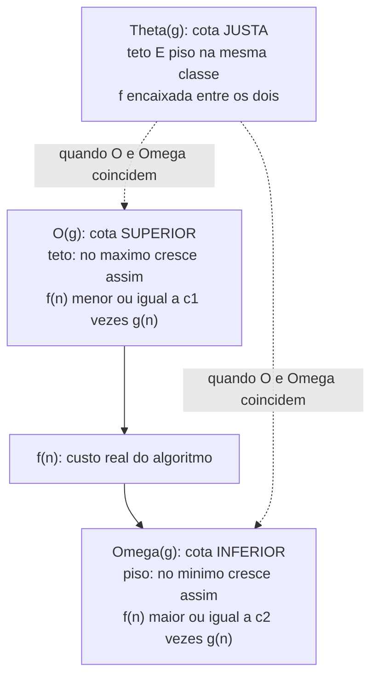
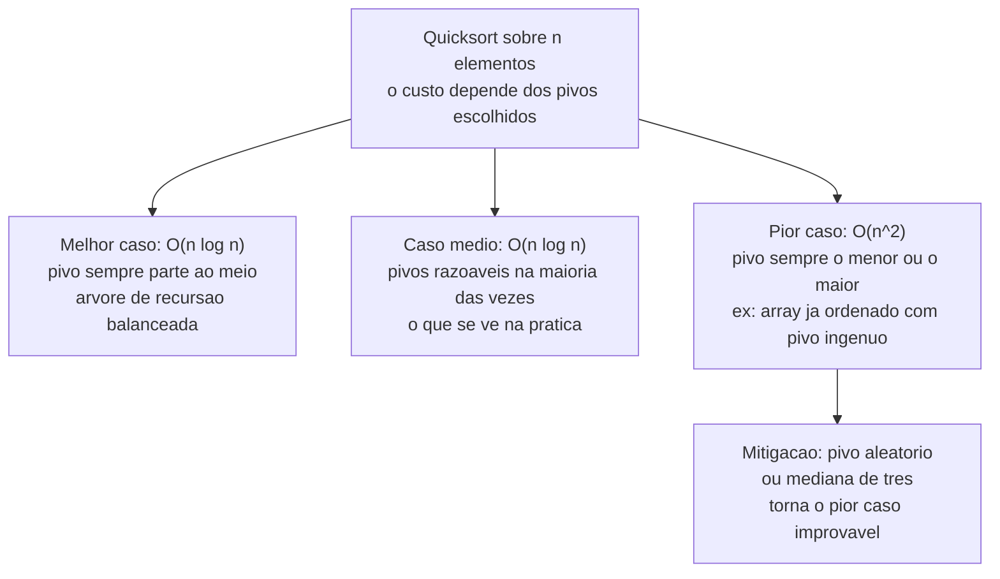
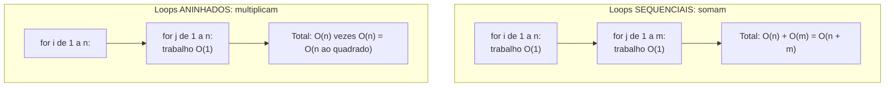

# Análise de complexidade: Big-O

Você baixa um app de fotos. Com 50 fotos, ele abre num piscar de olhos. Com 500, ainda tudo bem. Aí você acumula 50 mil fotos ao longo dos anos e, um dia, a galeria leva oito segundos para abrir. Nada mudou no seu celular — mudou o *tamanho da entrada*. E em algum lugar do código havia uma operação cujo custo cresce mais rápido do que o número de fotos. Esse "mais rápido do que" é o assunto inteiro desta nota.

Esta é a nota-âncora do galho. Tudo o que vem depois — ordenação, busca, programação dinâmica, recorrências — vai citar "isto é O(n log n)", "aquilo colapsa em O(2ⁿ)". Aqui é onde você aprende a ler, escrever e *raciocinar* nessa linguagem. Não é decoração de fórmula: é a habilidade de olhar um trecho de código e prever como ele vai se comportar quando a realidade ficar grande.

> [!abstract] TL;DR
> **Big-O mede comportamento assintótico** — como o custo de tempo ou de espaço *cresce* quando o tamanho da entrada `n` tende ao infinito —, ignorando constantes e termos de menor ordem. A pergunta não é "quantos segundos leva", é "**como escala**". A **hierarquia** vai de O(1) (constante) a O(n!) (fatorial), e cada degrau muda o que é viável: O(n²) já sofre em um milhão de itens, O(2ⁿ) trava antes de n=40. **O / Θ / Ω** são cotas — superior, justa e inferior —, uma dimensão *diferente* de **melhor/médio/pior caso**, que descreve *qual entrada* você está analisando (confundir as duas é o erro clássico). Regras práticas: solte as constantes, o maior termo domina, loops aninhados multiplicam, sequenciais somam, recursão é profundidade × trabalho por nível. **Espaço conta tanto quanto tempo.** Na prática raramente você implementa o algoritmo clássico — mas entender complexidade é o que guia *decisões de arquitetura*: quando indexar, quando desnormalizar, quando um cache por hash evita um round-trip ao banco.

## O que Big-O realmente mede

Comece desfazendo o mal-entendido mais comum.

Big-O **não mede tempo**. Não mede segundos, não mede ciclos de CPU, não mede "rápido" ou "lento" em termos absolutos. Big-O mede **taxa de crescimento**: dado que a entrada tem tamanho `n`, como o custo do algoritmo aumenta conforme `n` aumenta?

A palavra técnica é **assintótico**. Estamos olhando o comportamento *no limite*, quando `n` cresce sem parar. Não importa o que acontece com `n=3` ou `n=10`; importa a *forma da curva* quando `n` vira mil, um milhão, um bilhão. É por isso que se diz: **"não é quanto tempo leva, é como escala."**

### Por que ignorar constantes faz sentido

Suponha que você meça dois algoritmos para o mesmo problema. O primeiro faz `5n + 3` operações. O segundo faz `100n + 50`. O segundo é vinte vezes mais "pesado" por elemento. E, ainda assim, dizemos que **os dois são O(n)**. Por quê?

Porque a análise assintótica pergunta sobre o *comportamento no infinito*, e lá a forma da curva é a mesma: ambos são linhas retas. Dobre `n` e o custo de ambos dobra. Triplique `n` e ambos triplicam. A constante (5 versus 100) muda a *inclinação* da reta, não o fato de ser uma reta. E quando você compara uma reta (O(n)) com uma parábola (O(n²)), a parábola sempre ultrapassa a reta a partir de algum `n` — *não importa* quão grandes sejam as constantes da reta. Para `n` grande o suficiente, `100n` perde feio para `0.001n²`.

Esse é o ponto profundo: a classe assintótica é uma propriedade *robusta*. Ela não depende da linguagem (Python é mais lento que C por um fator constante, e o fator some na análise), não depende do hardware (uma CPU duas vezes mais rápida é um fator constante), não depende dos detalhes mesquinhos de implementação. Por isso a Big-O é a moeda universal para comparar algoritmos: ela isola o que é *intrínseco ao algoritmo* do que é *circunstancial à máquina*.

### Quando constantes importam (e a teoria mente um pouco)

Agora a honestidade. A análise assintótica fala do *infinito*, mas você nunca roda no infinito — você roda com `n` finito, às vezes pequeno. E aí a teoria pode te enganar.

Três armadilhas reais:

- **Constantes grandes engolem ganhos assintóticos em `n` pequeno.** Um algoritmo O(n) com constante enorme pode perder para um O(n²) com constante minúscula quando `n` é pequeno. É exatamente por isso que implementações industriais de ordenação (TimSort, o `sort` da maioria das linguagens) **trocam para insertion sort O(n²) em subarrays pequenos** — porque para `n < ~16`, o O(n²) com pouca sobrecarga bate o merge sort O(n log n) cheio de chamadas recursivas. A constante venceu a assintótica no regime pequeno.
- **`n` na prática raramente é "infinito".** Se você sabe que sua lista *sempre* terá no máximo 20 elementos, a diferença entre O(n) e O(n²) é academicamente irrelevante — 400 operações são instantâneas. Otimizar a classe assintótica de algo que nunca cresce é otimização prematura.
- **Termos de menor ordem e fatores escondidos.** A notação esconde a constante e os termos menores justamente *por design*. Mas em código de altíssimo desempenho (kernels numéricos, jogos, sistemas de baixa latência), essas constantes — cache misses, ramificações de branch, alocações — viram a coisa toda. Big-O é a primeira lente, não a última.

> [!tip] A regra do polegar do senior
> Use Big-O para escolher entre *classes* de soluções (hash map versus busca linear, merge sort versus bubble sort). Use *medição real* (profiling) para escolher entre implementações da *mesma* classe. A assintótica te diz onde *não* olhar; o profiler te diz onde *olhar de fato*.

## A hierarquia das complexidades

Existe uma escada de classes de crescimento, e cada degrau é qualitativamente diferente do anterior. A tabela abaixo é o mapa mental que você precisa carregar. A última coluna é a mais importante: ela mostra quantas operações o algoritmo faria para `n = 1.000.000`, e é onde fica visível por que algumas classes simplesmente *não existem* na prática para entradas grandes.

| Complexidade | Nome | Exemplo canônico | Ops em n=10⁶ | Veredito prático |
| --- | --- | --- | --- | --- |
| **O(1)** | Constante | acesso a array por índice, `HashMap.get`, push numa pilha | ~1 | instantâneo, independe de `n` |
| **O(log n)** | Logarítmica | busca binária, descida em BST balanceada, B-Tree | ~20 | praticamente de graça; dobrar `n` custa +1 passo |
| **O(n)** | Linear | percorrer um array, somar elementos, busca linear | 10⁶ | barato e honesto; o "preço de olhar tudo" |
| **O(n log n)** | Linearítmica | merge sort, heapsort, TimSort, ordenar antes de varrer | ~2×10⁷ | o teto realista de uma ordenação por comparação |
| **O(n²)** | Quadrática | bubble/insertion sort, dois loops aninhados, par a par | 10¹² | já dói em 10⁶; tolerável só até alguns milhares |
| **O(n³)** | Cúbica | Floyd-Warshall, multiplicação de matriz ingênua | 10¹⁸ | inviável em 10⁶; vive em `n` pequeno (centenas) |
| **O(2ⁿ)** | Exponencial | todos os subconjuntos, Fibonacci recursivo sem memo | astronômico | trava antes de n≈40 (2⁴⁰ ≈ 10¹²) |
| **O(n!)** | Fatorial | todas as permutações, força bruta do caixeiro-viajante | inimaginável | trava antes de n≈13 (13! ≈ 6×10⁹) |

Algumas leituras que a tabela esconde e vale tornar explícitas:

- **O(log n) é quase mágico.** Cada vez que você dobra a entrada, gasta *um* passo a mais. Por isso busca binária em um bilhão de itens leva ~30 comparações. Logaritmo é o que você ganha toda vez que consegue *descartar metade do problema* a cada passo.
- **O(n log n) é o "linear com imposto".** O fator `log n` é tão pequeno (20 para um milhão) que, na prática, um algoritmo O(n log n) se comporta quase como linear. É o melhor que uma ordenação genérica por comparação pode fazer — há uma prova de que não dá para baixar disso (o limite Ω(n log n) da ordenação).
- **A fronteira do viável fica entre O(n²) e O(2ⁿ).** Polinomial (n, n², n³...) é o reino do "tratável": cresce feio, mas previsivelmente. Exponencial e fatorial são "intratáveis" — crescem tão rápido que somar mais um elemento à entrada pode *dobrar* o trabalho. Essa fronteira é o coração da teoria de tratabilidade (e da nota [[13 - Intratabilidade]]).

> [!warning] A diferença não é "um pouco maior" — é de outra galáxia
> É tentador achar que O(n²) é "só um pouco pior" que O(n log n). Não é. Para um milhão de elementos, O(n log n) faz ~20 milhões de operações — frações de segundo. O(n²) faz um *trilhão* — minutos a horas. E O(2ⁿ)? Para n=100, 2¹⁰⁰ é mais operações do que átomos no universo observável. Trocar uma classe por outra não é micro-otimização: é a diferença entre o programa terminar e o programa nunca terminar.

Curvas no abstrato convencem menos que números no concreto. A tabela abaixo mostra *quantas operações* cada classe faz para três tamanhos de entrada — `n=10`, `n=100`, `n=1000`. Leia uma coluna de cima para baixo e veja as classes se descolando; leia uma linha da esquerda para a direita e veja o efeito de a entrada crescer 10×.

| Classe | n=10 | n=100 | n=1000 | O que acontece ao crescer n 10× |
| --- | --- | --- | --- | --- |
| O(1) | 1 | 1 | 1 | nada — o custo é fixo |
| O(log n) | ~3 | ~7 | ~10 | sobe +3 ou +4; quase imune ao tamanho |
| O(n) | 10 | 100 | 1.000 | cresce 10× — proporcional, honesto |
| O(n log n) | ~33 | ~664 | ~9.966 | cresce ~10× com um pequeno imposto |
| O(n²) | 100 | 10.000 | 1.000.000 | cresce **100×** — o quadrado do fator |
| O(2ⁿ) | 1.024 | ~10³⁰ | astronômico | de viável a impossível entre n=10 e n=100 |
| O(n!) | ~3,6 milhões | inimaginável | inimaginável | explode antes de n=15 |

Leitura da tabela: repare na *aceleração* ao descer as linhas. O(1) e O(log n) mal se mexem entre as colunas — são as classes que você quer. O(n) e O(n log n) crescem de forma proporcional e gerenciável: aumentar a entrada 10× custa ~10× mais, o que é justo. A partir de O(n²) a história muda de natureza: aumentar a entrada 10× custa *100× mais*, e em O(2ⁿ) um único salto de `n=10` para `n=100` te leva de mil operações para mais átomos do que há no universo observável. A lição: o que importa não é o custo num tamanho fixo — é com que *aceleração* o custo responde quando a entrada cresce.

## Notação formal: O, Θ e Ω

Aqui está a parte que separa quem "ouviu falar de Big-O" de quem entende. "Big-O" é só *uma* das três notações assintóticas, e elas dizem coisas diferentes.

Pense em três tipos de limite de velocidade:

- **O (Big-O) — cota superior.** "No máximo cresce assim." É a promessa de teto: o algoritmo não fica *pior* que isto. Quando você diz "a busca é O(n)", está dizendo "ela não passa de linear".
- **Ω (Big-Omega) — cota inferior.** "No mínimo cresce assim." É o piso: o algoritmo não fica *melhor* que isto. Toda ordenação por comparação é Ω(n log n) — *prova-se* que nenhuma pode ser mais rápida que isso no pior caso.
- **Θ (Big-Theta) — cota justa.** "Cresce *exatamente* assim, nem mais nem menos." É quando o teto e o piso coincidem: O e Ω são a mesma classe. Θ(n) significa que o algoritmo é linear *de fato*, não apenas "no máximo linear".

### A definição intuitiva (correta, sem formalismo de doer)

A definição formal de Big-O é mais simples do que parece. Dizer que `f(n) = O(g(n))` significa:

> Existe uma constante `c > 0` e um ponto de partida `n₀` tais que, **para todo `n ≥ n₀`**, vale `f(n) ≤ c · g(n)`.

Em português humano: a partir de um certo tamanho de entrada (`n₀`), a função `f` fica *abaixo* de `g` multiplicada por alguma constante fixa. A constante `c` é o que nos deixa ignorar fatores como 5 ou 100; o `n₀` é o que nos deixa ignorar o comportamento bagunçado em entradas pequenas. As duas folgas juntas são exatamente o que torna a análise "assintótica" — só nos importa o final da história.

Ω inverte a desigualdade (`f(n) ≥ c · g(n)`): `g` é um piso. E Θ exige as duas coisas ao mesmo tempo — `f` fica *encaixada* entre dois múltiplos de `g`, com constantes possivelmente diferentes.

O diagrama abaixo mostra essas três relações como cercas em torno da curva real do algoritmo.

Leitura do diagrama: imagine a curva real `f(n)` correndo pelo meio. O Big-O é a cerca *por cima* — uma garantia de que `f` nunca a ultrapassa (a partir de `n₀`). O Ω é a cerca *por baixo* — `f` nunca cai abaixo dela. Quando essas duas cercas têm a *mesma forma* (a mesma classe de função), elas se fecham num corredor justo: isso é Θ. Sempre que você consegue provar Θ, sabe a complexidade *exata*; quando só tem O, sabe apenas o pior cenário garantido.

### Por que dizemos "O(n log n)" quando queremos dizer Θ

Aqui está a parte cultural que confunde todo mundo. Tecnicamente, dizer que o merge sort "é O(n log n)" é uma afirmação *fraca* — Big-O é só o teto, então O(n log n) também é tecnicamente O(n²), O(n³), O(2ⁿ)... afinal, todas essas são cotas superiores válidas (se `f` não passa de `n log n`, com mais razão não passa de `n²`). O que realmente queremos dizer, quase sempre, é **Θ(n log n)**: a complexidade *justa*.

Então por que o mundo inteiro escreve "O"? Três motivos práticos:

1. **Convenção e teclado.** "O" é mais fácil de escrever que "Θ", e a literatura informal padronizou o O como sinônimo de "a complexidade é".
2. **Big-O é a garantia que importa.** Na engenharia, o que você precisa prometer ao seu sistema é o *teto* — "no pior caso, isto não passa de O(n log n)". A cota superior é a que entra no SLA, na estimativa de capacidade, na decisão de arquitetura. O piso (Ω) raramente muda uma decisão de produção.
3. **Por preguiça honesta.** Provar Θ exige provar O *e* Ω. Muitas vezes só o O é fácil e suficiente para a decisão. Então diz-se "O" e segue a vida.

> [!note] O que dizer numa entrevista
> Se o entrevistador pedir rigor, a frase certa é: *"This is Θ(n log n) in the average case, but I'll write it as O(n log n) since the upper bound is what matters here."* Demonstra que você sabe a diferença — e a maioria dos candidatos não sabe. É um sinal barato de profundidade.

## Best / average / worst case — uma dimensão *diferente*

Este é o ponto onde mais gente tropeça, então vale câmera lenta.

**O/Θ/Ω são cotas matemáticas sobre uma função.** **Best/average/worst case são afirmações sobre *qual entrada* você está alimentando o algoritmo.** São eixos ortogonais. Você pode falar de "o Big-O do pior caso" ou "o Θ do caso médio" — as duas dimensões se combinam, não se substituem.

Por que existem três casos? Porque o custo de muitos algoritmos *depende da forma da entrada específica*, não só do tamanho. Duas listas com o mesmo `n` podem custar coisas radicalmente diferentes.

- **Melhor caso (best case):** a entrada mais *favorável*. É quase sempre **inútil na prática** — ninguém projeta um sistema esperando o melhor caso. O melhor caso da busca linear é O(1) (o alvo é o primeiro elemento), mas você não conta com isso.
- **Caso médio (average case):** o custo *esperado* sobre uma distribuição típica de entradas. É o que **importa para o throughput de sistemas reais** — quanto seu sistema gasta "em média", no dia a dia, com dados realistas.
- **Pior caso (worst case):** a entrada mais *hostil*. É o que importa para **SLA, sistemas de tempo real e segurança** — porque é a garantia que você consegue dar, e porque um atacante pode *fabricar de propósito* o pior caso para derrubar seu serviço (um ataque de complexidade algorítmica, como colisões de hash forçadas).

O diagrama mostra os três casos coexistindo num *mesmo* algoritmo — o quicksort, o exemplo clássico:

Leitura do diagrama: o *mesmo* algoritmo tem três custos diferentes, e a diferença é *qual entrada* ele recebe. No melhor e no caso médio, o quicksort divide o problema bem ao meio a cada passo — daí o O(n log n). No pior caso (um pivô péssimo a cada rodada, o que acontece, ironicamente, em arrays *já ordenados* com escolha ingênua de pivô), a recursão vira uma cadeia degenerada e o custo desaba para O(n²). A caixa de mitigação mostra a engenharia real: escolher o pivô ao acaso torna o pior caso *estatisticamente improvável*, e é por isso que o quicksort sobrevive em produção apesar do pior caso assustador.

### Os dois exemplos que você precisa saber de cor

**Quicksort:** O(n log n) no caso médio, O(n²) no pior. A mediana-de-três e o pivô aleatório existem justamente para empurrar o pior caso para perto da impossibilidade.

**HashMap:** O(1) no caso médio (a função de hash espalha as chaves), mas **O(n) no pior caso** — quando *todas* as chaves colidem no mesmo bucket e a tabela degenera para uma lista encadeada que você percorre item a item. (Java, desde a versão 8, mitiga isso transformando buckets muito cheios em árvores, virando O(log n) no pior caso — mas o princípio fica: a garantia de O(1) é probabilística, não absoluta.)

> [!example] A consequência arquitetural que vale ouro
> Por que bancos de dados usam **B-Tree** (O(log n) *sempre*) em índices, e não hash, mesmo o hash sendo O(1) no caso médio? Porque um índice de banco precisa de **garantia de pior caso** e de **consultas por intervalo** (`WHERE idade BETWEEN 30 AND 40`). O O(1) do hash é uma média sem garantia, e o hash *não preserva ordem* — não dá para fazer range query. A B-Tree troca o O(1) médio por um O(log n) *garantido e ordenado*. É a diferença entre best/average/worst saindo do quadro e virando uma decisão de engenharia de verdade. Veja [[03-Dominios/Ciência/Estruturas de Dados/index|Estruturas de Dados]] para o porquê de cada estrutura ter o perfil de custo que tem.

## Regras práticas de análise

Você não precisa de cálculo para analisar a maioria dos códigos. Precisa de seis regras e de prática para aplicá-las no automático.

**1. Solte as constantes.** O(2n + 100) = O(n). O(500) = O(1). A constante não muda a *forma* da curva. Se você calculou `3n² + 7n + 12`, a resposta é O(n²) — ponto.

**2. O maior termo domina.** Numa soma de termos, só o de crescimento mais rápido sobrevive. `n² + n + log n` é O(n²), porque para `n` grande o `n²` faz os outros parecerem ruído. Descarte tudo menos o campeão.

**3. Loops aninhados multiplicam.** Um loop dentro de outro, cada um percorrendo `n`, dá `n × n` = O(n²). Três níveis aninhados, O(n³). Se o loop interno depende do externo, ainda pode dar O(n²) (a soma 1+2+...+n = n(n+1)/2, que é O(n²)).

**4. Loops sequenciais somam.** Um loop de `n` *seguido* de outro de `m` (não aninhado) é O(n + m). Se ambos forem sobre o mesmo `n`, é O(n) + O(n) = O(2n) = O(n) (volta à regra 1). Somar, não multiplicar — esse é o erro comum.

**5. Recursão = profundidade × trabalho por nível.** Pergunte: quantos níveis de recursão? E quanto trabalho cada nível faz? Uma recursão que se chama duas vezes e tem profundidade `n` tende a O(2ⁿ); uma que divide o problema ao meio tem profundidade log n. (A ferramenta formal para isso são as recorrências e o Teorema Mestre — [[05 - Recorrências e o Teorema Mestre]].)

**6. Espaço conta tanto quanto tempo.** Toda análise de tempo tem uma gêmea de espaço. Pergunte sempre as duas.

O diagrama abaixo mostra as duas regras de composição que mais geram dúvida — aninhar versus sequenciar:

Leitura do diagrama: à esquerda, dois loops *um depois do outro* — o primeiro termina inteiro antes do segundo começar. Você faz `n` voltas, depois `m` voltas: os custos **somam**. À direita, um loop *dentro* do outro — para cada uma das `n` voltas externas, o loop interno roda `n` voltas completas. Os custos **multiplicam**, e você sobe de classe (linear vira quadrático). A pergunta diagnóstica é sempre: "este loop está *ao lado* ou *dentro* do outro?". Ao lado soma, dentro multiplica.

## Complexidade de espaço

Tempo rouba os holofotes, mas espaço derruba sistema com a mesma facilidade — e de forma mais brutal, porque memória é um teto rígido (você fica sem RAM e o processo *morre*, enquanto tempo de mais só deixa lento).

Complexidade de espaço mede **quanta memória extra** o algoritmo precisa em função de `n` — *além* da entrada em si. Os mesmos critérios e a mesma notação se aplicam: O(1) de espaço (você usa só algumas variáveis, independente do `n`) é "in-place"; O(n) de espaço significa que a memória cresce proporcional à entrada.

Três fontes de custo de espaço que passam despercebidas:

- **Estruturas auxiliares.** O HashSet que você cria para detectar duplicatas em O(n) de tempo custa O(n) de espaço. Você *trocou espaço por tempo* — e essa troca é uma das decisões mais frequentes da computação.
- **Stack frames de recursão.** Cada chamada recursiva pendente ocupa um frame na pilha. Uma recursão de profundidade `n` custa O(n) de espaço *mesmo que cada chamada use pouca memória* — e estourar essa pilha é o famoso *stack overflow*. Uma recursão "sem alocações" não é gratuita: a pilha é a alocação.
- **Memoization (memoização).** A programação dinâmica frequentemente transforma um algoritmo O(2ⁿ) de tempo em O(n) de tempo guardando resultados intermediários — mas isso custa O(n) (ou mais) de espaço para a tabela. O Fibonacci recursivo ingênuo é O(2ⁿ) de tempo e O(n) de espaço (a pilha); com memoization vira O(n) de tempo e O(n) de espaço. A troca espaço-por-tempo, de novo.

> [!tip] Sempre dê *as duas* complexidades
> Em entrevista, declarar só o tempo é um sinal de imaturidade. A frase completa é: *"This runs in O(n) time and O(1) extra space"* — ou *"O(n) time but at the cost of O(n) space for the hash map."* Nomear a troca espaço-por-tempo explicitamente mostra que você pensa como engenheiro, não como quem decorou tabelas.

## Custo amortizado (e onde ele mora)

Há um caso especial que merece nome próprio: e quando uma operação é *normalmente* barata, mas *ocasionalmente* cara — e mesmo assim o custo "médio ao longo de muitas operações" é baixo?

O exemplo canônico é o **array dinâmico** (ArrayList, vector, list do Python). Adicionar ao final é O(1) quase sempre — mas, de vez em quando, o array enche e precisa **dobrar de tamanho**, copiando todos os elementos, um O(n) pontual. A mágica é que esses O(n) acontecem tão raramente (a cada duplicação) que, *diluídos* sobre todas as inserções, o custo médio por operação volta a ser O(1). Isso é o **custo amortizado**: não é o caso médio (que fala de distribuição de entradas), é uma garantia sobre *uma sequência* de operações.

Não vou desenvolver os métodos aqui — agregado, contábil e potencial — porque eles têm casa própria. O aprofundamento completo, com o array dinâmico esmiuçado, está em [[03 - Análise amortizada]]. Por ora, retenha a distinção: **amortizado ≠ caso médio**. Caso médio fala de quais entradas são prováveis; amortizado garante que o *custo total de N operações* dividido por N é baixo, mesmo que operações individuais ocasionalmente espetem.

## Na prática (da minha experiência)

A verdade que ninguém te conta cedo: no dia a dia, você **raramente implementa um algoritmo clássico do zero**. Quase nunca vou escrever um quicksort à mão — a linguagem já tem `sort`. O que muda tudo não é "saber implementar binary search"; é *entender complexidade bem o suficiente para reconhecer o padrão de custo escondido numa decisão de arquitetura* — quando indexar uma coluna, quando desnormalizar um dado, quando um cache baseado em hash evita um round-trip ao banco. Duas histórias minhas tornam isso concreto.

> [!example] MedEspecialista — o conhecimento de Big-O guiou a *modelagem*, não o algoritmo
> No MedEspecialista, um endpoint de busca de profissionais começou com um JOIN ingênuo que rodava em ~3s para alguns filtros. A solução não foi "otimizar o algoritmo" — foi mover a contagem de avaliações para uma coluna desnormalizada e adicionar um índice composto, transformando uma query O(n × m) em O(log n). O conhecimento de Big-O guiou a decisão de *modelagem*: eu sabia *por que* aquele padrão de acesso era quadrático e *qual* mudança estrutural colapsava a classe de custo. A complexidade não me deu o código; me deu o diagnóstico.

> [!example] Digidados — reconhecer o pattern valeu mais que conhecer o algoritmo
> Na Digidados, processávamos lotes de leituras de sensores. A primeira versão usava `list.contains()` dentro de um loop — um O(n²) que travava com 10 mil registros. Trocando por `HashSet.contains()`, virou O(n) e o processamento caiu de minutos para segundos. A diferença não estava em "saber binary search" — estava em *reconhecer o pattern*: um `contains` dentro de um loop é uma bomba quadrática esperando o dado crescer. Big-O foi o detector.

A lição que une as duas: complexidade não é trivia de entrevista que você esquece no trabalho. É a lente que faz você *ver* o custo escondido — o JOIN que vira quadrático, o `contains` no loop, a query que precisa de índice. Você raramente escreve o algoritmo, mas decide a estrutura, o índice e o cache *o tempo todo* — e essas decisões são, no fundo, escolhas de classe de complexidade.

## Em entrevista

Complexidade é o vocabulário básico de uma entrevista de algoritmos. Anunciar a complexidade da sua solução — sem que peçam — é um sinal de senioridade. E saber a diferença entre O/Θ/Ω e best/average/worst te coloca acima da maioria dos candidatos.

### Frases prontas em inglês

- *"The brute-force approach here is O(n squared) in time. Let me see if we can bring it down to O(n)."* — abrindo, reconhecendo o naive e mirando além.
- *"This runs in O(n log n) time and O(n) space — I'm trading space for time by using a hash map."* — anunciando ambas as complexidades e nomeando a troca.
- *"In the average case this is O(1), but the worst case degrades to O(n) if all the keys collide."* — mostrando que você distingue os casos.
- *"It's technically Θ(n log n) — a tight bound — but I'll just say O(n log n) since the upper bound is what matters for us here."* — exibindo o rigor de O versus Θ sem ser pedante.
- *"The dominant term is n squared, so the lower-order terms and constants drop out — it's O(n squared)."* — narrando a regra do termo dominante.
- *"These two loops are sequential, not nested, so the cost adds up to O(n plus m), not O(n times m)."* — desfazendo a confusão clássica em voz alta.
- *"The recursion depth is log n and we do linear work per level, so by the Master Theorem it's O(n log n)."* — conectando recursão a custo.
- *"I'd want to confirm the worst case, because if this is on a hot path with an SLA, the average case isn't the guarantee I can rely on."* — pensando como engenheiro de produção, não de exercício.

### Vocabulário PT → EN

| Português | Inglês |
| --- | --- |
| Complexidade de tempo / espaço | Time / space complexity |
| Comportamento assintótico | Asymptotic behavior |
| Taxa de crescimento | Growth rate |
| Cota superior / inferior / justa | Upper / lower / tight bound |
| Notação O grande | Big-O notation |
| Termo dominante | Dominant term |
| Termos de menor ordem | Lower-order terms |
| Ignorar / descartar constantes | Drop / ignore constants |
| Loops aninhados / sequenciais | Nested / sequential loops |
| Melhor / caso médio / pior caso | Best / average / worst case |
| Profundidade da recursão | Recursion depth |
| Trocar espaço por tempo | Trade space for time |
| Custo amortizado | Amortized cost |
| In-place (sem memória extra) | In-place |
| Colisão de hash | Hash collision |
| Degradar / degenerar para | Degrade / degenerate to |
| Inviável / intratável | Infeasible / intractable |
| Estouro de pilha | Stack overflow |
| Caminho crítico / hot path | Critical path / hot path |

## Veja também

- **Nota anterior:** [[01 - O que é um algoritmo]] — complexidade é uma das três propriedades fundamentais de um algoritmo; esta nota abre a caixa daquela.
- **Próximas:** [[03 - Análise amortizada]] — o custo "diluído sobre uma sequência", com o array dinâmico esmiuçado. E [[05 - Recorrências e o Teorema Mestre]] — a ferramenta formal para analisar a complexidade de algoritmos recursivos (a regra "profundidade × trabalho por nível" formalizada).
- **MOC do galho:** [[03-Dominios/Ciência/Algoritmos/index|Algoritmos]] — o dono canônico da teoria de complexidade no vault; todas as outras notas citam esta.
- **Relacionada:** [[03-Dominios/Ciência/Estruturas de Dados/index|Estruturas de Dados]] — onde cada estrutura tem seu perfil de custo (por que B-Tree em vez de hash num índice, por que array é O(1) de acesso mas O(n) de inserção no meio).

> [!info] Lastro
> - Cormen, Leiserson, Rivest, Stein — *Introduction to Algorithms* (CLRS), 4ª ed. (MIT Press, 2022): notação assintótica (cap. 3), análise de melhor/médio/pior caso, custo amortizado.
> - Donald Knuth — *The Art of Computer Programming*, vol. 1, 3ª ed. (Addison-Wesley): origem e formalização da notação O, Ω e Θ (Knuth popularizou o uso rigoroso das três em "Big Omicron and Big Omega and Big Theta", *SIGACT News*, 1976).
> - Robert Sedgewick & Kevin Wayne — *Algorithms*, 4ª ed. (Addison-Wesley, 2011): análise empírica versus assintótica, o papel das constantes na prática, perfis de custo das estruturas.
> - Steven Skiena — *The Algorithm Design Manual*, 3ª ed. (Springer, 2020): hierarquia de complexidades com a tabela de "operações por segundo" e a fronteira do viável (tratável versus intratável).
> - Joshua Bloch — *Effective Java*, 3ª ed. (Addison-Wesley, 2018): o comportamento O(1) médio / O(n) pior caso de `HashMap` e a treeificação de buckets a partir do Java 8.
