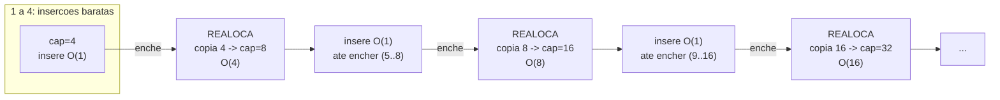
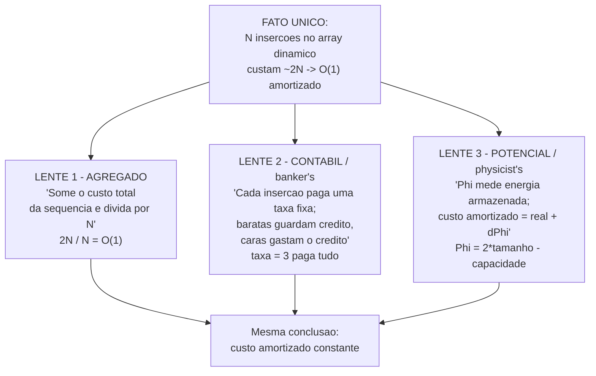
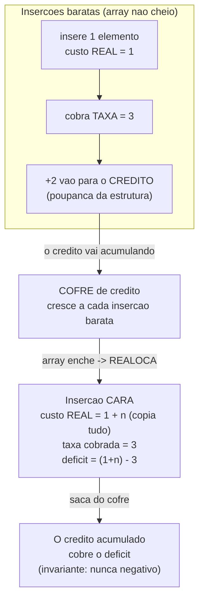

# Análise amortizada

Pense numa assinatura de academia. A mensalidade é R$100. No dia em que você compra um par de tênis novo de R$400 para treinar, aquele "dia" custou R$500. Se alguém perguntasse "quanto custa um dia de academia?" e você respondesse "R$500 — eu vi acontecer", estaria certo *sobre aquele dia* e profundamente errado *sobre o ano*. O custo honesto de um dia é o total gasto no ano dividido por 365. O tênis caro existe, mas ele se *dilui*.

Estruturas de dados fazem exatamente isso o tempo todo. Quase toda operação é barata; de vez em quando uma é cara; e a pergunta "quanto custa uma operação?" só faz sentido se você decidir *qual* operação. A análise amortizada é a ferramenta que troca a pergunta certa: não "qual o pior caso de UMA operação?", mas "qual o custo de uma SEQUÊNCIA de operações, dividido pelo número de operações?".

Esta nota existe separada da [[02 - Análise de complexidade - Big-O]] por um motivo: a Big-O te ensina a ler a *forma da curva* de um único passo, e isso, sozinho, mente sobre estruturas como `ArrayList` e `HashMap`. O pior caso de um `add` é O(n). Mas dizer que `add` "é O(n)" seria tão enganoso quanto dizer que um dia de academia custa R$500. A amortização é como se desfaz essa mentira — e ela tem *três* métodos formais de fazer isso, que são o coração desta nota.

> [!abstract] TL;DR
> **Análise amortizada** mede o custo *médio por operação ao longo de uma sequência* de operações, no pior caso da sequência inteira — não de uma operação isolada. Serve para estruturas onde a maioria das operações é barata mas algumas, raras, são caras (array dinâmico, hash table, contador binário). **Amortizado ≠ caso médio**: caso médio supõe uma *distribuição probabilística* de entradas; amortizado é uma garantia *determinística* sobre a sequência, sem probabilidade nenhuma. Há **três métodos** de provar um limite amortizado: **agregado** (custo total da sequência ÷ N), **contábil/banker's** (cada operação paga uma "taxa" fixa; as baratas guardam crédito que as caras gastam, crédito nunca negativo) e **do potencial** (uma função Φ sobre o estado da estrutura; custo amortizado = custo real + ΔΦ). O exemplo canônico é o **array dinâmico que dobra**: N inserções custam ~2N no total → **O(1) amortizado** por inserção. Crescer dobrando é o que dá O(1); crescer de +1 em +1 daria O(n) amortizado (soma 1+2+...+N = O(N²)). **Cuidado em produção**: O(1) amortizado *não* significa que toda operação é rápida — uma individual pode espetar O(n) (o momento da realocação). Em baixa latência, esse espeto no p99 pode pesar mais que a média boa.

## O problema: quando o pior caso mente

Volte ao mal-entendido. A [[02 - Análise de complexidade - Big-O]] te treinou a olhar uma operação e perguntar "como o custo dela escala com `n`?". Para a maioria das operações isso basta. Mas existe uma família de estruturas onde essa pergunta produz uma resposta tecnicamente correta e praticamente inútil.

Considere `ArrayList.add(x)` em Java — inserir no fim de uma lista dinâmica. Quase sempre é uma escrita num slot livre: O(1). Mas quando o array interno enche, a estrutura precisa **realocar**: aloca um array maior, copia *todos* os `n` elementos para ele, e só então insere. Essa cópia é O(n).

Então qual é o custo de `add`? Pelo pior caso por operação, é **O(n)** — porque *alguma* chamada vai cair no momento da realocação. E essa resposta, embora verdadeira, é pessimista a ponto de ser falsa na intenção. Ela sugere que inserir N elementos custa N × O(n) = O(n²). Você vai ver daqui a pouco que custa O(n). A diferença entre O(n²) e O(n) é a diferença entre o programa travar e o programa voar.

O furo na lógica do "pior caso por operação" é que ele assume que o pior caso pode acontecer *em toda* operação. Mas não pode. A realocação O(n) só ocorre *depois* de muitas inserções O(1) terem enchido o array. As operações caras são *raras por construção*, e a estrutura as torna raras de propósito. Multiplicar o pior caso de uma operação pelo número de operações ignora essa raridade — conta o tênis de R$400 todo dia do ano.

A amortização corrige isso mudando a unidade de análise. Em vez de "custo de UMA operação", ela pergunta:

> Para a **pior sequência possível** de N operações, qual é o custo *total*? Divida por N. Esse é o **custo amortizado por operação**.

Repare na sutileza: continuamos no pior caso — não relaxamos para uma média otimista. O pior caso é só calculado sobre a *sequência inteira*, não sobre o pico de uma operação. É uma garantia, não uma esperança.

### Amortizado ≠ caso médio (a confusão clássica)

Esse é o erro que separa quem entendeu de quem decorou. Os dois conceitos falam de "média", mas são fundamentalmente diferentes.

- **Caso médio (average case)** fala de uma **distribuição probabilística sobre as entradas**. Quando dizemos que o quicksort é O(n log n) no caso médio, estamos *supondo* que as entradas chegam aleatoriamente embaralhadas, e tirando a média *sobre esse universo de entradas possíveis*. Se um adversário te entregar a entrada exata do pior caso, o caso médio não te protege — você cai no O(n²). É uma garantia *probabilística*, e ela pode falhar.

- **Amortizado (amortized)** é uma garantia **determinística**, sem nenhuma suposição sobre probabilidade. Não importa *qual* sequência de operações você escolha — mesmo a mais maligna possível, construída por um adversário que conhece a estrutura por dentro — o custo total dividido por N respeita o limite. Não há "se as entradas forem aleatórias". O limite vale *sempre*.

Uma forma de gravar: caso médio é uma média **sobre as entradas** (e supõe que elas se comportam bem); amortizado é uma média **sobre o tempo / a sequência** (e vale para qualquer sequência). Um aposta na sorte da distribuição; o outro não aposta em nada.

E há uma terceira ideia que costuma se confundir com as duas: o **pior caso por operação**, que é uma garantia *por chamada* — vale toda vez, sem média de espécie alguma. As três respondem perguntas distintas. Pior caso por operação: "quanto custa esta chamada, garantido?". Caso médio: "quanto custa, em média, se as entradas forem aleatórias?" (probabilístico, um adversário pode quebrar). Amortizado: "quanto custa, em média sobre a sequência, para *qualquer* sequência?" (determinístico, ninguém quebra). O amortizado mora na ponta determinística — é por isso que ele é uma promessa mais forte que o caso médio, ainda que ambos produzam um número "médio".

## O exemplo canônico: o array dinâmico

Tudo na amortização gira em torno de um exemplo, e vale entendê-lo até o osso, porque os três métodos vão todos atacá-lo. É o **array dinâmico**: a lista de tamanho variável que você usa todo dia sem pensar — `ArrayList` em Java, `vector` em C++, `list` em Python, `slice` em Go.

Por baixo, ela é um array de tamanho *fixo* (arrays de verdade não crescem). A estrutura guarda dois números: a **capacidade** (quantos slots o array interno tem) e o **tamanho** (quantos estão ocupados). Inserir no fim é trivial *enquanto sobra capacidade*: escreve no próximo slot, incrementa o tamanho. O(1).

O drama acontece quando `tamanho == capacidade` e chega mais um `add`. Não há slot livre. A estrutura então:

1. Aloca um array novo, **maior**.
2. **Copia** todos os elementos antigos para ele — isso é O(n).
3. Descarta o array velho.
4. Insere o novo elemento.

A pergunta de projeto é: **quão maior** deve ser o array novo? E é aqui que mora a mágica.

### Por que dobrar — e não somar

Há duas estratégias intuitivas para crescer, e elas produzem resultados *catastroficamente* diferentes.

**Estratégia A — crescimento aditivo (+k constante).** Quando enche, aumente a capacidade em uma quantidade fixa — digamos, +1, ou +10. Parece econômico (não desperdiça memória). É um desastre. Se você cresce de +1 em +1, *toda* inserção enche o array, e *toda* inserção dispara uma cópia. A inserção número `i` copia `i` elementos. O custo total de N inserções é:

```
1 + 2 + 3 + ... + N = N(N+1)/2 = O(N²)
```

Dividido por N, dá **O(N) amortizado por inserção**. Catastrófico — inserir num array dinâmico ingênuo seria tão caro quanto reembaralhar tudo a cada passo.

**Estratégia B — crescimento geométrico (× fator).** Quando enche, *multiplique* a capacidade por um fator constante > 1 — o caso clássico é **dobrar** (×2). Agora as realocações ficam *exponencialmente espaçadas*: a capacidade cresce 1 → 2 → 4 → 8 → 16 → ... → N. Para inserir N elementos, as cópias acontecem nos pontos 1, 2, 4, 8, ..., N, e o custo total das cópias é:

```
1 + 2 + 4 + 8 + ... + N  (soma de uma série geométrica)
```

Essa soma é `2N − 1`, ou seja **≈ 2N = O(N)**. Some as N escritas baratas (também O(N)) e o total continua O(N). Dividido por N, dá **O(1) amortizado por inserção**.

A intuição profunda: numa série geométrica, **o último termo domina a soma inteira**. A última realocação, sozinha, copia N elementos. *Todas as anteriores juntas* copiam outros ~N elementos. É como se o trabalho total fosse apenas "o dobro da última cópia" — e a última cópia é O(N). Por isso o custo amortizado é constante: a soma de todas as duplicações nunca passa de um múltiplo de N.



Leitura do diagrama: cada caixa azul é uma corrida de inserções baratíssimas O(1); cada caixa "REALOCA" é o espeto O(n) onde tudo é copiado. Repare em dois fatos. Primeiro: os espetos ficam *cada vez mais raros* — o intervalo entre eles dobra a cada vez, porque o array dobrou. Segundo: embora cada espeto seja *maior* que o anterior (copia 4, depois 8, depois 16...), a *frequência* deles cai na mesma proporção. Custo crescente × frequência decrescente = custo amortizado constante. É a tensão exata entre essas duas curvas que diluí o O(n) num O(1).

### Os fatores de crescimento na vida real

"Dobrar" é o exemplo didático, mas qualquer fator constante > 1 dá O(1) amortizado — a escolha do número é um trade-off entre desperdício de memória e frequência de cópias. Os fatores reais variam:

- **Java `ArrayList`** cresce **1.5×** (desde o JDK 6). O código é literalmente `newCapacity = oldCapacity + (oldCapacity >> 1)` — soma metade da capacidade atual. A sequência de capacidades é 10 → 15 → 22 → 33 → 49...
- **Python `list`** cresce de forma mais modesta, perto de **1.125×** (≈ 9/8), com um pequeno offset somado. A ideia é desperdiçar menos memória, ao custo de realocar um pouco mais vezes.
- **Go `slice`** usa uma estratégia *adaptativa*: para slices pequenos (capacidade < 256) ele **dobra**; acima disso, cresce ~**1.25×**. (Essa fórmula mudou no Go 1.18 — antes o corte era em 1024 elementos.)

Por que ninguém usa fator 1.0 + ε minúsculo (quase aditivo)? Porque conforme o fator se aproxima de 1, a série geométrica perde a propriedade de "o último termo domina" e o número de realocações por inserção dispara. E por que não fatores enormes (×4, ×10)? Porque o desperdício de memória cresce: logo após uma realocação, você pode estar usando metade (ou um décimo) da memória alocada. O 1.5–2× é o equilíbrio que a indústria convergiu — todos dão O(1) amortizado, e o número fino é uma decisão de engenharia, não de teoria.

O array dinâmico tem tratamento próprio (com código nas quatro linguagens) no galho de [[03-Dominios/Ciência/Estruturas de Dados/index|Estruturas de Dados]]. Aqui ele entra como o laboratório onde a análise amortizada se aprende.

## Os três métodos de análise amortizada

Provar que algo é "O(1) amortizado" não é só uma intuição — há três técnicas formais, cada uma com seu sabor. Todas levam ao mesmo número; mudam o *raciocínio*. Pense nelas como **três lentes apontadas para o mesmo fato**. A escolha entre elas é pragmática: o agregado é o mais simples quando há um só tipo de operação; o contábil e o do potencial ficam essenciais quando há vários tipos de operação que interagem.



Leitura do diagrama: no topo, o fato bruto que já provamos pela soma geométrica. As três lentes abaixo são *modos de enxergar o mesmo fato*, não três resultados diferentes — todas desembocam na mesma conclusão na base. O agregado é o mais direto (uma divisão). O contábil introduz a ideia de *taxa* e *crédito* — útil quando operações diferentes têm taxas diferentes. O potencial é o mais abstrato e o mais poderoso: ele substitui "crédito guardado em operações" por uma *função do estado* da estrutura. Vamos abrir cada uma aplicando-a ao array dinâmico.

### Método 1 — Agregado (aggregate)

O mais simples e o mais bruto. A receita inteira:

> Calcule o custo **total** no pior caso de uma sequência de N operações. Divida por N. Esse quociente é o custo amortizado de cada operação.

E pronto. Não há sutileza — é a definição literal de amortização aplicada diretamente.

Aplicado ao array dinâmico: já fizemos a conta. As N inserções fazem N escritas O(1) (custo N) mais as cópias das realocações nos pontos 1, 2, 4, ..., N (custo ≈ 2N). Total ≈ 3N = O(N). Dividido por N: **O(1) amortizado**. Fim.

A virtude do agregado é não exigir engenhosidade: você só precisa somar tudo. A limitação é que ele dá **um único número para todas as operações** — ele não distingue tipos. Se a estrutura tem `push` *e* `pop` *e* `multipop` com custos diferentes, o agregado mistura todos num só balde e te diz a média geral, mas não te dá um custo amortizado *por tipo de operação*. Para isso, precisamos das próximas duas lentes.

### Método 2 — Contábil / banker's (accounting)

Aqui entra a analogia financeira que dá nome ao método, e é a que mais gente acha intuitiva.

A ideia: você *inventa* um **custo amortizado** (uma "taxa" fixa) para cada operação, possivelmente diferente do custo real dela. A regra do jogo é:

- Quando uma operação tem custo real **menor** que a taxa que você cobrou, a diferença vira **crédito**, guardado "junto" da estrutura (numa poupança imaginária).
- Quando uma operação tem custo real **maior** que sua taxa, ela **gasta o crédito** acumulado para cobrir a diferença.
- **Invariante sagrada**: o crédito total **nunca pode ficar negativo**, em momento algum da sequência.

Se você consegue escolher taxas que respeitem essa invariante para *qualquer* sequência, então a soma das taxas é um limite superior do custo real total — e a taxa de cada operação *é* seu custo amortizado. (Por quê? Porque crédito nunca-negativo significa que o total cobrado em taxas é ≥ o total realmente gasto. Você nunca "deve" — sempre pré-pagou o suficiente.)

É a conta bancária do começo da nota: nos meses baratos você deposita um pouco a mais na poupança; quando vem o gasto grande (o tênis, a realocação), você saca da poupança em vez de estourar o orçamento. Desde que a poupança nunca zere no vermelho, sua "mensalidade média" cobre tudo.

**Aplicado ao array dinâmico.** Vamos cobrar uma taxa de **3 unidades** por inserção e mostrar que ela nunca deixa o crédito negativo. A intuição do "por quê 3": cada elemento inserido precisa pagar (a) o próprio custo de ser escrito agora — 1 unidade; (b) o custo futuro de *ele mesmo* ser copiado na próxima realocação — 1 unidade; (c) o custo futuro de copiar *um elemento antigo* que já estava lá antes da última realocação — 1 unidade. Total: 3.



Leitura do diagrama: cada inserção barata (array não cheio) custa de verdade 1 unidade, mas você *cobra* 3 — e os 2 de troco caem no cofre. O cofre engorda exatamente durante a longa sequência de inserções baratas que antecede cada realocação. Quando o array finalmente enche e dispara a cópia O(n), a operação cara é cobrada com o cofre: como entre duas realocações o array dobrou (digamos de `n/2` para `n`), houve cerca de `n/2` inserções baratas, cada uma depositando 2 unidades → ~`n` de crédito guardado, *exatamente* o suficiente para pagar a cópia de `n` elementos. A poupança nunca vira negativa. Logo, taxa = 3 é um limite superior válido, e o custo amortizado de `add` é **O(1)** (constante 3). Mesma resposta do agregado, raciocínio diferente — e este, ao contrário do agregado, atribuiria taxas *distintas* a operações distintas se houvesse mais de um tipo.

### Método 3 — Potencial / physicist's (potential)

O método mais abstrato, mais poderoso e mais geral dos três. É o que [Robert Tarjan formalizou em 1985](https://doi.org/10.1137/0606031), no paper que batizou a disciplina inteira de "amortized computational complexity". Quando você vê uma prova amortizada num paper de pesquisa, quase sempre é o método do potencial.

A diferença em relação ao contábil: em vez de guardar crédito *associado a operações específicas* (uma poupança que cresce e encolhe), você define uma **função de potencial Φ** que mapeia o *estado atual da estrutura* num número — uma espécie de "energia armazenada" naquele estado. O crédito deixa de ser uma conta separada e passa a ser uma propriedade *do próprio estado* da estrutura.

A definição central:

```
custo_amortizado(operação) = custo_real(operação) + ΔΦ

onde ΔΦ = Φ(estado_depois) − Φ(estado_antes)
```

Em palavras: o custo amortizado de uma operação é seu custo real *mais* a variação de potencial que ela provoca.

- Operações **baratas** geralmente *aumentam* Φ (ΔΦ > 0) — elas guardam energia, então seu custo amortizado fica um pouco *maior* que o real. (Pagam adiantado, como as inserções baratas que enchem o cofre.)
- Operações **caras** geralmente *liberam* Φ de uma vez (ΔΦ ≪ 0, bem negativo) — a queda no potencial *cancela* o alto custo real, deixando o amortizado pequeno.

A beleza disso: numa sequência, os ΔΦ formam uma **soma telescópica**. O custo amortizado total é o custo real total mais `Φ(final) − Φ(inicial)`. Se você escolher Φ de modo que `Φ ≥ 0` sempre e `Φ(inicial) = 0`, então a soma dos custos amortizados é um limite superior do custo real total — exatamente a garantia que queremos. (É o mesmo papel da "invariante crédito ≥ 0" do método contábil, só que codificado numa função.)

**Aplicado ao array dinâmico.** Precisamos de uma Φ que seja ~0 logo após uma realocação (quando não há energia guardada) e cresça até ~n conforme o array enche (energia máxima, pronta para pagar a próxima cópia). A escolha clássica:

```
Φ = 2 × tamanho − capacidade
```

Vamos sentir os dois regimes:

- **Logo após uma realocação**, o array está meio cheio: `tamanho = capacidade/2`. Então `Φ = 2×(cap/2) − cap = 0`. Energia zerada — acabamos de gastar tudo na cópia.
- **Quando o array está prestes a encher**, `tamanho = capacidade`. Então `Φ = 2×cap − cap = cap`. Energia máxima — há `cap` unidades guardadas, exatamente o que custará copiar tudo.

Agora o custo amortizado em cada caso:

- **Inserção barata** (sem realocar): custo real = 1. O tamanho sobe em 1, a capacidade não muda, então `ΔΦ = +2`. Custo amortizado = `1 + 2 = 3`. Constante.
- **Inserção cara** (com realocação): custo real = `1 + n` (escreve 1, copia n). Aqui a capacidade salta de `n` para `2n`, e o tamanho de `n` para `n+1`. Antes: `Φ = 2n − n = n`. Depois: `Φ = 2(n+1) − 2n = 2`. Então `ΔΦ = 2 − n`. Custo amortizado = `(1 + n) + (2 − n) = 3`. **Constante de novo.**

Note o que aconteceu na operação cara: o custo real `n` foi *exatamente cancelado* pela queda de potencial `−n`. A energia que as inserções baratas vinham acumulando (cada uma somando 2 a Φ) é liberada de uma vez para pagar a cópia. O resultado: **toda** inserção, barata ou cara, tem custo amortizado constante (3). Terceira lente, terceiro caminho, **mesma resposta**: O(1) amortizado.

Por que o potencial é "o mais poderoso"? Porque ele desacopla a análise das operações individuais e a ancora no *estado*. Em estruturas complexas — heaps de Fibonacci, árvores splay, union-find com compressão de caminho — não há uma "taxa por operação" óbvia, mas existe uma função de potencial inteligente que faz a conta fechar. É a ferramenta de eleição para os resultados amortizados mais profundos da área.

> [!tip] Os três métodos, lado a lado
> **Agregado** responde "quanto custa a sequência inteira?" e divide. Simples, mas dá um número só. **Contábil** responde "que taxa cobro de cada operação para nunca ficar no vermelho?". Bom quando há tipos de operação distintos. **Potencial** responde "que energia o estado guarda, e como cada operação a move?". Abstrato, mas o mais geral — o canivete suíço das provas amortizadas. Os três são *provas diferentes do mesmo teorema*.

## Outros exemplos rápidos

A amortização não é um truque de uma estrutura só — é um padrão que reaparece sempre que operações baratas *preparam o terreno* para operações caras raras.

### O contador binário

Tem um contador em binário (um array de bits) e você o incrementa N vezes a partir de zero. Cada incremento vira o bit menos significativo; se ele já era 1, há um "carry" que propaga, virando vários bits de uma vez. Quanto custa um incremento?

No pior caso, um único incremento vira *todos* os bits: passar de `0111...1` para `1000...0` vira `log n` bits. Então o pior caso por operação é O(log n). Mas — o padrão de novo — esse pior caso é raro. O bit menos significativo vira a *toda* operação (N vezes). O segundo bit vira a cada *duas* operações (N/2 vezes). O terceiro a cada quatro (N/4 vezes). O total de viradas de bit em N incrementos é:

```
N + N/2 + N/4 + N/8 + ... < 2N = O(N)
```

A mesma série geométrica do array dinâmico! Dividido por N: **O(1) amortizado por incremento**. (E sim, dá para provar pelo potencial — basta Φ = número de bits iguais a 1.)

### O rehashing do HashMap

Esta é a aplicação que você toca todo dia. Um `HashMap` (ou `dict`, ou `map`) promete `get`/`put` em O(1) — mas como, se ele precisa lidar com colisões e crescer? A resposta é *exatamente* a lógica do array dinâmico.

Por dentro, um hash table é um array de "baldes". Quando a razão de ocupação (load factor) passa de um limiar (em Java, 0.75 por padrão), a estrutura **rehasha**: aloca um array de baldes maior — tipicamente o **dobro** — e redistribui *todos* os elementos para as novas posições. Isso é O(n): uma operação cara e rara. Entre dois rehashings, os `put` são O(1). A diluição é idêntica: porque o array de baldes **dobra**, os rehashings ficam exponencialmente espaçados, a soma das redistribuições é ≈ 2N, e o custo amortizado de `put` é **O(1)** — não O(1) "de verdade por operação", mas O(1) amortizado. (O hash table tem tratamento próprio no galho de [[03-Dominios/Ciência/Estruturas de Dados/index|Estruturas de Dados]].)

Quando alguém afirma com a maior naturalidade que "hash map é O(1)", o que está realmente dizendo, se for rigoroso, é "**O(1) amortizado** (e, no caso médio sobre boas funções de hash, sem muitas colisões)". As duas qualificações estão ali, escondidas no "O(1)" casual.

## A armadilha em produção: amortizado não é uniforme

Aqui mora a lição que separa a teoria da operação de sistemas reais, e ela merece um aviso enfático.

> [!warning] O(1) amortizado NÃO significa "toda operação é rápida"
> Significa que a *média ao longo da sequência* é constante. Uma operação *individual* ainda pode espetar O(n) — o momento exato da realocação, do rehashing, da propagação total do carry. Se você medir o tempo de cada `add` separadamente, a esmagadora maioria será nanosegundos e *uma de vez em quando* será um pico gritante. A média é ótima; a *variância* é alta.

Para a maioria dos sistemas — processamento em lote, scripts, backend comum — isso é irrelevante. Você se importa com o tempo total, e o amortizado entrega.

Mas existe uma classe de sistemas onde a média boa não basta: **tempo real e baixa latência**. Sistemas de trading de alta frequência, motores de jogos com orçamento de 16 ms por frame, controle industrial, telecomunicações. Nesses contextos, a métrica que importa não é a *média* — é a **cauda**: o p99, o p99.9, o pior pico observado. E um único `add` que dispara uma realocação de um array com milhões de elementos pode estourar o orçamento de latência daquele frame, daquela requisição, daquele tick. A média continua linda; o p99 quebrou o SLA.

A consequência prática é uma escolha de design que parece contraintuitiva à luz da Big-O: às vezes vale a pena **trocar uma estrutura com ótimo custo amortizado por uma com pior caso garantido melhor**, mesmo que o caso médio piore. Exemplos:

- **Pré-alocar a capacidade** (`new ArrayList<>(tamanhoEsperado)`, `make([]T, 0, n)`, `list` que você reserva). Se você já sabe o tamanho final, dimensiona o array de uma vez e *elimina* todas as realocações. Você troca um pouco de memória pela ausência dos espetos. É a otimização mais comum e mais barata.
- Em casos extremos, escolher estruturas com **pior caso garantido O(1) ou O(log n) verdadeiro** (sem amortização), aceitando uma constante maior na média, porque a *previsibilidade* vale mais que a velocidade média. (É um dos motivos pelos quais alocadores e GCs de tempo real existem.)

A moral é sutil e importante: a análise amortizada é uma ferramenta *correta* — ela não mente sobre o custo total. Mas ela responde a pergunta "qual o custo de uma sequência?", e há contextos onde a pergunta certa é "qual o custo do *pior* momento individual?". Saber qual pergunta o seu sistema está fazendo é a diferença entre um throughput excelente e um p99 que derruba o SLA. A Big-O amortizada te dá o throughput; ela não te promete a uniformidade.

## Em entrevista

A análise amortizada cai com frequência em entrevistas de fundamentos — especialmente quando o entrevistador pergunta "qual a complexidade de inserir num `ArrayList`/`HashMap`?" e está testando se você sabe a palavra **amortized** e a distinção em relação a *average case*.

Frases prontas, em inglês:

- "Appending to a dynamic array is **O(1) amortized**, not O(1) worst case — the occasional resize is O(n), but it's diluted across the cheap insertions."
- "**Amortized is not the same as average case.** Average case assumes a probability distribution over inputs; amortized is a deterministic guarantee over a sequence of operations, with no probabilistic assumption."
- "The array **doubles** its capacity on resize, so the resizes are exponentially spaced. The total copy work across N inserts is a geometric series that sums to about 2N, which gives O(1) per operation."
- "There are three ways to prove an amortized bound: the **aggregate method**, the **accounting (banker's) method**, and the **potential (physicist's) method**. They all reach the same result."
- "In the accounting method, cheap operations are **overcharged** and bank the surplus as **credit**; expensive operations **spend** that credit. The invariant is that **credit never goes negative**."
- "In the potential method, we define a **potential function Φ** over the structure's state, and the amortized cost is the **real cost plus ΔΦ**."
- "Amortized O(1) **doesn't mean every operation is fast** — a single one can spike to O(n). In **low-latency** systems we care about the **p99 tail**, not the average, so sometimes we **pre-allocate capacity** to avoid the resize spikes altogether."
- "`HashMap` is O(1) **amortized** because **rehashing** doubles the bucket array and redistributes everything — same logic as the dynamic array."

Vocabulário PT → EN:

| Português | English |
| --- | --- |
| análise amortizada | amortized analysis |
| custo amortizado | amortized cost |
| caso médio | average case |
| pior caso | worst case |
| array dinâmico | dynamic array |
| realocar / redimensionar | to reallocate / to resize |
| dobrar a capacidade | to double the capacity |
| fator de crescimento | growth factor |
| crescimento geométrico | geometric growth |
| série geométrica | geometric series |
| método agregado | aggregate method |
| método contábil | accounting (banker's) method |
| método do potencial | potential (physicist's) method |
| função de potencial | potential function |
| crédito (guardado) | (banked / stored) credit |
| cobrar a mais / sobrecarregar uma taxa | to overcharge |
| invariante | invariant |
| nunca fica negativo | never goes negative |
| espeto / pico de latência | latency spike |
| cauda (de latência) | (latency) tail |
| pré-alocar | to pre-allocate |
| garantia determinística | deterministic guarantee |
| diluir (o custo) | to amortize / to spread out (the cost) |

> [!info] Lastro
> - **Cormen, Leiserson, Rivest, Stein (CLRS), _Introduction to Algorithms_, 4ª ed., Cap. 16 "Amortized Analysis".** A referência canônica: define e exemplifica os três métodos (aggregate, accounting, potential) usando o array dinâmico (table doubling) e o contador binário.
> - **Robert E. Tarjan, "Amortized Computational Complexity", _SIAM Journal on Algebraic and Discrete Methods_, vol. 6, nº 2, 1985.** O paper seminal que introduziu e formalizou o método do potencial e cunhou o termo. [doi.org/10.1137/0606031](https://doi.org/10.1137/0606031)
> - **Sedgewick & Wayne, _Algorithms_, 4ª ed. (e o curso em algs4.cs.princeton.edu).** Tratamento do array dinâmico (resizing array) e da análise amortizada de pilhas/filas, com a conta da série geométrica.
> - **Fatores de crescimento reais verificados em jun/2026:** Java `ArrayList` cresce 1.5× (`oldCapacity + (oldCapacity >> 1)`, código-fonte do JDK desde 6); Python `list` ~1.125× (CPython `listobject.c`, `list_resize`); Go `slice` dobra abaixo de cap 256 e ~1.25× acima (runtime `growslice`, fórmula revista no Go 1.18).

---

## Navegação

- **Anterior:** [[02 - Análise de complexidade - Big-O]] — a nota-âncora; é lá que "amortizado" é mencionado de passagem e aponta para cá.
- **Próxima:** [[04 - Recursão]]
- **MOC:** [[03-Dominios/Ciência/Algoritmos/index|Algoritmos]]
- **Estruturas relacionadas:** [[03-Dominios/Ciência/Estruturas de Dados/index|Estruturas de Dados]] — array dinâmico e hash table têm tratamento próprio (com código nas quatro linguagens) lá.
