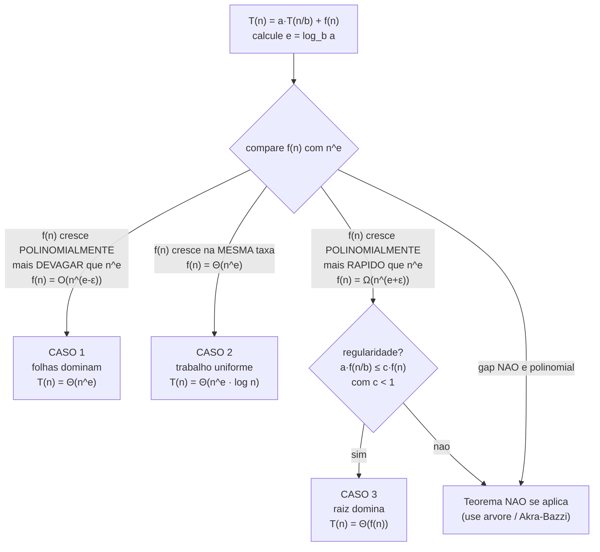
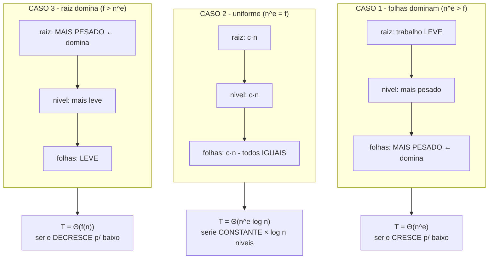

# Recorrências e o Teorema Mestre

Imagine que você é o gerente de uma equipe e recebe uma tarefa grande. Você não a faz sozinho: parte ela em dois pedaços, entrega cada metade para um subordinado, e fica responsável só por *cortar* a tarefa no começo e *colar* os resultados no fim. Cada subordinado faz a mesma coisa — corta a metade dele em duas e delega — e assim por diante, até que alguém receba um pedaço tão pequeno que o resolve na hora, sem delegar. Quanto trabalho a organização inteira fez? Essa pergunta — "qual o custo *total* de uma hierarquia que se subdivide?" — é exatamente a pergunta de uma **recorrência**. E o **Teorema Mestre** é a fórmula de bolso que responde a maioria das versões dela sem você ter que somar a planilha de horas de cada nível.

Em [[04 - Recursão]] vimos *como* uma função se chama a si mesma. Aqui respondemos a pergunta que sobrou: **quanto custa** uma função que se chama a si mesma? Você não pode usar o método de "conte os loops aninhados" de [[02 - Análise de complexidade - Big-O]], porque não há loops aninhados — há chamadas que geram chamadas que geram chamadas. O custo está *escondido na recursão*. Precisamos de uma ferramenta que desenrole essa recursão e produza um número.

> [!abstract] TL;DR
> Uma **recorrência** é uma equação que define `T(n)` — o custo de um algoritmo sobre uma entrada de tamanho `n` — em termos do custo sobre entradas **menores**. É a ferramenta natural para a complexidade de algoritmos **recursivos**. A forma canônica de *divide-and-conquer* é **T(n) = a·T(n/b) + f(n)**: `a` subproblemas, cada um de tamanho `n/b`, mais `f(n)` de trabalho fora das chamadas (dividir + combinar). Três métodos para resolvê-la: (1) **árvore de recursão** — desenhe, some o trabalho por nível × número de níveis (o mais intuitivo); (2) **substituição** — chute uma cota e prove por indução (o mais rigoroso); (3) **Teorema Mestre** — o atalho. O Teorema compara `f(n)` com **n^(log_b a)** (o "peso das folhas"): **Caso 1** — `f(n)` cresce *polinomialmente mais devagar* → folhas dominam → **Θ(n^(log_b a))**; **Caso 2** — `f(n) = Θ(n^(log_b a))`, mesma taxa → trabalho uniforme por nível → **Θ(n^(log_b a)·log n)**; **Caso 3** — `f(n)` cresce *polinomialmente mais rápido* **e** vale a regularidade (`a·f(n/b) ≤ c·f(n)`, `c<1`) → raiz domina → **Θ(f(n))**. Merge sort = `2T(n/2)+n` → Caso 2 → **Θ(n log n)**. Binary search = `T(n/2)+O(1)` → Caso 2 → **Θ(log n)**. O Teorema **NÃO** se aplica quando `a` ou `b` não são constantes, quando os subproblemas têm tamanhos *diferentes* (ex.: `T(n/3)+T(2n/3)+n`), ou quando o gap entre `f` e `n^(log_b a)` não é polinomial. Para subproblemas desiguais, a generalização é **Akra-Bazzi**.

## O que é uma recorrência

Comece pelo objeto mais simples possível. Uma recorrência é uma equação que se refere a si mesma — exatamente como uma função recursiva se chama a si mesma. Pegue o fatorial recursivo de [[04 - Recursão]]: cada chamada faz uma multiplicação (custo constante) e delega o resto a `fatorial(n-1)`. O custo, então:

```
T(n) = T(n-1) + c
T(0) = c₀          (caso base: custo constante)
```

Leia em voz alta: "o custo de resolver tamanho `n` é o custo de resolver tamanho `n-1`, mais uma constante". Isso é uma recorrência. Desenrolando à mão — `T(n) = T(n-1) + c = T(n-2) + 2c = ... = T(0) + n·c` — chegamos a `T(n) = Θ(n)`. Faz sentido: `n` multiplicações.

A estrutura tem sempre **duas partes**, espelhando os dois ingredientes da recursão:

- **O passo recursivo:** `T(n)` em função de `T` de algo menor (`T(n-1)`, `T(n/2)`, `T(n/2)+T(n/2)`...). É o que acontece "no meio".
- **O caso base:** `T(1)` ou `T(0)` é uma constante. Sem ele, a recorrência não tem fundo — exatamente como uma recursão sem caso base não termina. Em análise assintótica costumamos escrever `T(1) = Θ(1)` e nem mencionar, porque o caso base não muda a ordem de grandeza do resultado.

A maioria dos algoritmos recursivos interessantes não subtrai (`n-1`) — eles **dividem** (`n/2`, `n/3`). Essa é a família *divide-and-conquer*, e ela tem uma forma canônica que vamos usar o resto da nota:

> **T(n) = a · T(n/b) + f(n)**

Três botões para girar, e cada um tem um significado físico:

- **`a`** = **quantos** subproblemas você gera. Merge sort gera 2 (as duas metades). Karatsuba gera 3. Strassen gera 7.
- **`b`** = **por quanto** o tamanho encolhe a cada nível. Cortar pela metade → `b=2`. Cortar em terços → `b=3`. (Cuidado: `a` e `b` não são necessariamente iguais. Karatsuba tem `a=3, b=2` — gera 3 subproblemas, mas cada um é *metade* do tamanho.)
- **`f(n)`** = o trabalho que **você** faz, fora das chamadas recursivas: dividir o problema no começo + combinar as respostas no fim. No merge sort, `f(n) = Θ(n)`, porque o *merge* de duas listas ordenadas de tamanho `n/2` percorre `n` elementos.

Com `a`, `b` e `f(n)` na mão, a pergunta vira mecânica: **como esses três números se combinam num custo total?** Há três jeitos de responder. Vamos do mais visual ao mais rigoroso, e fechamos com o atalho.

## Método 1 — a árvore de recursão (o mais intuitivo)

A ideia é literal: **desenhe a árvore de chamadas e some o trabalho**. Cada nó é uma chamada; o rótulo do nó é o `f(·)` daquela chamada (o trabalho *local*, não o dos filhos). Os filhos são as chamadas recursivas. Some tudo e você tem `T(n)`.

O truque que torna isso tratável: em vez de somar nó a nó, **some por nível**. Em cada nível horizontal, calcule o trabalho total daquele nível; depois multiplique pelo número de níveis (a altura da árvore). Vamos fazer o merge sort inteiro, que é o exemplo canônico.

**Merge sort:** `T(n) = 2·T(n/2) + c·n`. Dois subproblemas (`a=2`), cada metade (`b=2`), e o merge custa `c·n` (linear).

- **Nível 0 (a raiz):** uma chamada com problema de tamanho `n`. Trabalho local: `c·n`.
- **Nível 1:** duas chamadas, cada uma de tamanho `n/2`. Trabalho local de cada: `c·(n/2)`. Total do nível: `2 · c·(n/2) = c·n`.
- **Nível 2:** quatro chamadas, cada uma de tamanho `n/4`. Total do nível: `4 · c·(n/4) = c·n`.
- **Nível `i`:** `2^i` chamadas, cada uma de tamanho `n/2^i`. Total: `2^i · c·(n/2^i) = c·n`.

Repare no padrão mágico: **cada nível faz exatamente `c·n` de trabalho**. O número de chamadas dobra a cada nível, mas o tamanho de cada uma cai pela metade, e os dois efeitos se cancelam perfeitamente. O trabalho é *uniforme* na vertical.

Agora, **quantos níveis há?** A árvore para quando o problema chega ao caso base, tamanho 1. Partindo de `n` e dividindo por 2 a cada nível, isso leva `log₂ n` divisões. A altura é `log₂ n` (mais precisamente `log₂ n + 1` contando o nível 0, mas a constante some no Θ).

Some: `(trabalho por nível) × (número de níveis) = c·n × log₂ n = Θ(n log n)`. Pronto — o famoso `n log n` do merge sort sai de uma soma de retângulos iguais.

```mermaid
flowchart TD
    R["n &rarr; trabalho c&middot;n"]
    R --> A["n/2 &rarr; c&middot;n/2"]
    R --> B["n/2 &rarr; c&middot;n/2"]
    A --> A1["n/4 &rarr; c&middot;n/4"]
    A --> A2["n/4 &rarr; c&middot;n/4"]
    B --> B1["n/4 &rarr; c&middot;n/4"]
    B --> B2["n/4 &rarr; c&middot;n/4"]
    A1 --> D["... folhas: tamanho 1 ..."]
    A2 --> D
    B1 --> D
    B2 --> D
    R -.->|"nivel 0: soma = c&middot;n"| L0["c&middot;n"]
    A -.->|"nivel 1: soma = 2 &times; c&middot;n/2 = c&middot;n"| L1["c&middot;n"]
    A1 -.->|"nivel 2: soma = 4 &times; c&middot;n/4 = c&middot;n"| L2["c&middot;n"]
    L0 --> TOT["altura log&#8322; n niveis &times; c&middot;n por nivel = &Theta;(n log n)"]
    L1 --> TOT
    L2 --> TOT
```



Leitura do diagrama: o lado esquerdo é a árvore de chamadas do merge sort — cada nó delega a duas metades. A coluna direita (setas tracejadas) é o resumo por nível: somando o trabalho horizontal de cada nível, dá sempre `c·n`. Como há `log₂ n` níveis e cada um custa `c·n`, o total é `c·n · log₂ n = Θ(n log n)`. A árvore não é uma metáfora vaga — é o cálculo literal, e a forma dela (uniforme por nível) é o que produz o `log n`.

O valor da árvore não é só dar o número. Ela mostra **onde** o trabalho mora — e isso, vamos ver, é a alma do Teorema Mestre. No merge sort o trabalho é espalhado igualmente por todos os níveis. Em outras recorrências ele se acumula na raiz, ou nas folhas. Guarde essa ideia.

## Método 2 — substituição (o mais rigoroso)

A árvore *sugere* uma resposta, mas uma soma desenhada à mão pode esconder erros — somei os níveis certos? a altura é mesmo `log n`? O **método da substituição** dá rigor: você **chuta** uma cota (geralmente inspirado na árvore) e **prova por indução** que ela vale.

São dois passos, como toda indução: (1) **hipótese** — assuma que a cota vale para todos os valores menores que `n`; (2) **passo** — use isso para mostrar que vale para `n`. Vamos provar que `T(n) = 2·T(n/2) + n` é **O(n log n)**.

**Chute:** existe uma constante `d > 0` tal que `T(n) ≤ d · n · log₂ n` para todo `n` suficientemente grande.

**Hipótese de indução:** suponha que vale para `n/2`, ou seja, `T(n/2) ≤ d · (n/2) · log₂(n/2)`.

**Passo:** substitua a hipótese na recorrência.

```
T(n) = 2·T(n/2) + n
     ≤ 2·[ d·(n/2)·log₂(n/2) ] + n          (pela hipótese)
     = d·n·log₂(n/2) + n
     = d·n·(log₂ n − 1) + n                  (log₂(n/2) = log₂ n − 1)
     = d·n·log₂ n − d·n + n
     = d·n·log₂ n − (d − 1)·n
     ≤ d·n·log₂ n                            (desde que d ≥ 1, pois −(d−1)·n ≤ 0)
```

A última linha é exatamente o que queríamos: `T(n) ≤ d·n·log₂ n`, ou seja, `T(n) = O(n log n)`. A indução fecha desde que escolhamos `d ≥ 1` e tratemos o caso base (`T` de uma constante é uma constante, o que se acomoda absorvendo na escolha de `d`).

Duas armadilhas clássicas da substituição, que valem para entrevista:

- **Você precisa provar a forma *exata* chutada.** Um erro comum é mostrar `T(n) ≤ d·n·log₂ n + n` e declarar vitória — esse `+ n` extra *invalida* a indução, porque a hipótese pediu `d·n·log₂ n` sem sobra. O passo acima funcionou justamente porque a sobra (`−(d−1)·n`) era *negativa* e pôde ser descartada.
- **O chute tem que ser bom.** A substituição prova ou refuta o que você chutar, mas não *descobre* a cota. Por isso a ordem natural é: árvore primeiro (para adivinhar a forma), substituição depois (para cravar). O Teorema Mestre, que vem a seguir, automatiza esse "adivinhar" para a forma `a·T(n/b)+f(n)`.

## Método 3 — o Teorema Mestre (o atalho)

A árvore do merge sort tinha trabalho uniforme por nível. Mas isso é coincidência da combinação `a=2, b=2, f(n)=n`. Mude os números e a forma da árvore muda: o trabalho pode despencar rumo às folhas, ou inflar rumo à raiz. O **Teorema Mestre** captura essa observação numa fórmula. Ele se aplica a qualquer recorrência da forma

> **T(n) = a · T(n/b) + f(n)**, com **a ≥ 1**, **b > 1**, e `f(n)` assintoticamente positiva.

A grandeza central é **n^(log_b a)**. De onde ela vem? Conte as **folhas** da árvore. A árvore tem altura `log_b n` (dividimos por `b` até chegar a 1), e cada nó tem `a` filhos. Logo o número de folhas é `a^(log_b n)`, que por uma identidade de logaritmos é igual a **n^(log_b a)**. Cada folha é um caso base de custo `Θ(1)`, então o **trabalho total das folhas** é `Θ(n^(log_b a))`. Chame esse expoente de `e = log_b a`.

O Teorema é uma **disputa**: quem domina o custo total, o trabalho das **folhas** (`n^e`) ou o trabalho da **raiz e níveis de cima** (`f(n)`)? Você compara `f(n)` com `n^e` e cai num de três casos.



Leitura do diagrama: tudo começa calculando `e = log_b a`, o expoente do peso das folhas. A pergunta única é "como `f(n)` se compara a `n^e`?". Mais devagar (por um fator polinomial `n^ε`) → Caso 1, folhas vencem. Empate → Caso 2, ninguém vence e ganhamos um `log n`. Mais rápido → você ainda precisa passar pela porta da **regularidade** antes de declarar Caso 3; se ela falhar (ou se o gap não for polinomial), o Teorema básico não decide e você volta para a árvore ou para Akra-Bazzi. As palavras "polinomialmente" e "regularidade" são as letras miúdas que separam quem sabe o Teorema de quem decorou.

### Caso 1 — as folhas dominam

**Condição:** `f(n) = O(n^(e−ε))` para algum `ε > 0`. Em português: `f(n)` cresce *polinomialmente mais devagar* que `n^e`. O trabalho local de cada nó é tão barato comparado à explosão do número de nós que, somando, **as folhas carregam o custo**.

**Resultado:** `T(n) = Θ(n^e) = Θ(n^(log_b a))`.

**Intuição pela árvore:** o número de nós multiplica por `a` a cada nível, mas o trabalho por nó cai mais devagar que isso. A soma por nível *cresce* descendo a árvore, e o último nível (as folhas, que são a maioria esmagadora dos nós) domina a soma. É uma série geométrica dominada pelo termo final.

**Exemplo:** `T(n) = 4·T(n/2) + n`. Aqui `a=4, b=2`, então `e = log₂ 4 = 2`, e `n^e = n²`. Compare com `f(n) = n`: temos `n = O(n^(2−1)) = O(n)`, logo `f` é polinomialmente menor (gap de `ε=1`). Caso 1 → **T(n) = Θ(n²)**. Faz sentido: 4 subproblemas de metade do tamanho geram uma árvore "gorda", com `n²` folhas, e cada uma custa `Θ(1)` — as folhas é que mandam.

### Caso 2 — trabalho uniforme

**Condição:** `f(n) = Θ(n^e)`. `f(n)` cresce *na mesma taxa* que o peso das folhas. Nenhum dos dois domina; o trabalho se distribui igualmente por todos os níveis.

**Resultado:** `T(n) = Θ(n^e · log n) = Θ(n^(log_b a) · log n)`.

**Intuição pela árvore:** é exatamente o caso do merge sort que desenhamos. Cada nível faz a mesma quantidade de trabalho (`Θ(n^e)`), e há `Θ(log n)` níveis. Multiplique: `n^e · log n`. O `log n` é literalmente "o número de andares da árvore", e ele aparece *porque* os andares são todos iguais.

**Exemplos:**

- **Merge sort:** `T(n) = 2·T(n/2) + n`. `a=2, b=2`, `e = log₂ 2 = 1`, `n^e = n`. Compare com `f(n) = n`: igual. Caso 2 → **T(n) = Θ(n log n)**.
- **Binary search:** `T(n) = T(n/2) + O(1)`. `a=1, b=2`, `e = log₂ 1 = 0`, `n^e = n⁰ = 1`. Compare com `f(n) = Θ(1)`: igual. Caso 2 → **T(n) = Θ(1 · log n) = Θ(log n)**. Repare o caso especial elegante: com `a=1` (um subproblema só, busca um lado e descarta o outro), o "peso das folhas" é constante e o `log n` vem inteiro do número de níveis. É por isso que busca binária é logarítmica — uma árvore de chamadas de altura `log n` e largura 1.

### Caso 3 — a raiz domina

**Condição:** **duas** condições, e ambas são obrigatórias.

1. `f(n) = Ω(n^(e+ε))` para algum `ε > 0` — `f(n)` cresce *polinomialmente mais rápido* que `n^e`.
2. **Condição de regularidade:** `a · f(n/b) ≤ c · f(n)` para alguma constante `c < 1` e `n` grande.

**Resultado:** `T(n) = Θ(f(n))`.

**Intuição pela árvore:** o trabalho local da raiz é tão pesado que sozinho ele já é maior que tudo que vem abaixo somado. A soma por nível *encolhe* descendo (série geométrica decrescente), e o termo dominante é o primeiro — a raiz. Por isso `T(n) = Θ(f(n))`: o resto é ruído.

**Por que a regularidade?** Essa é a pergunta que separa o senior. A condição 1 sozinha não basta. A regularidade `a·f(n/b) ≤ c·f(n)` com `c<1` é justamente o que **garante que a série geométrica decresce de fato** — que o trabalho de um nível é uma *fração* (`< 1`) do trabalho do nível de cima. Sem ela, `f(n)` poderia ser maior que `n^e` em ordem mas oscilar de um jeito patológico que impede a soma de convergir para `Θ(f(n))`. Para `f(n)` polinomiais bem-comportadas (que é quase sempre o caso na prática), a regularidade vem de graça — mas em entrevista você *menciona* que verificou, porque é a marca de quem entende e não só decorou.

**Exemplo:** `T(n) = 2·T(n/2) + n²`. `a=2, b=2`, `e = log₂ 2 = 1`, `n^e = n`. Compare com `f(n) = n²`: temos `n² = Ω(n^(1+1))`, logo polinomialmente maior (gap `ε=1`). Cheque a regularidade: `a·f(n/b) = 2·(n/2)² = 2·n²/4 = n²/2 = ½·f(n)` — vale com `c = ½ < 1`. Caso 3 → **T(n) = Θ(n²)**. O `n²` da raiz engole todo o resto.

### Os três casos numa imagem só

Vale parar e *ver* os três casos lado a lado, porque a diferença entre eles é, no fundo, uma só pergunta visual: **em que andar da árvore mora a maior parte do trabalho?** A soma por nível forma uma série geométrica, e o caso é decidido pela razão dessa série.



Leitura do diagrama: cada coluna é a *mesma* árvore, mas com o trabalho distribuído de um jeito diferente conforme `f(n)` se compara a `n^e`. No **Caso 1** o trabalho infla descendo (a série geométrica cresce), então as folhas — a maioria dos nós — pagam a conta: `Θ(n^e)`. No **Caso 2** todo andar paga igual, e o resultado é o trabalho de um andar vezes o número de andares: `Θ(n^e log n)` — o `log n` é o número de degraus. No **Caso 3** o trabalho míngua descendo (série decrescente), a raiz sozinha já é maior que tudo abaixo somado, e o total é `Θ(f(n))`. Os três casos não são regras arbitrárias para decorar — são as três formas possíveis de uma série geométrica se comportar: crescente, constante, decrescente.

## Os limites do Teorema Mestre (honestidade)

O Teorema Mestre é um atalho poderoso, mas tem fronteiras nítidas, e fingir que ele resolve tudo é erro de júnior. Quatro situações em que ele **não se aplica**:

**1. `a` ou `b` não são constantes.** A forma exige `a ≥ 1` e `b > 1` *fixos*. Uma recorrência como `T(n) = n·T(n/2) + n` (onde o número de subproblemas depende de `n`) está fora — `a` tem que ser um número, não uma função de `n`.

**2. Subproblemas de tamanhos *diferentes*.** A forma assume que **todos** os `a` subproblemas têm o mesmo tamanho `n/b`. Mas considere `T(n) = T(n/3) + T(2n/3) + n` (aparece em análise de algoritmos como certas variantes de quickselect e na busca em listas desbalanceadas). Os dois subproblemas têm tamanhos *desiguais* — `n/3` e `2n/3`. Não há um único `b`. O Teorema Mestre básico é mudo aqui. (A árvore de recursão ainda funciona: ela é desbalanceada, mas o trabalho por nível continua `Θ(n)` até o ramo mais profundo, e o ramo mais longo tem altura `log_{3/2} n`, dando `Θ(n log n)`.)

**3. O gap entre `f(n)` e `n^e` não é polinomial.** Os casos 1 e 3 exigem que a diferença seja por um fator `n^ε` — *polinomial*. Existe uma terra de ninguém. Tome `T(n) = 2·T(n/2) + n·log n`. Aqui `e=1`, `n^e = n`, e `f(n) = n log n`. É `f(n)` maior que `n`? Sim, mas só por um fator `log n`, que **não é polinomial** (não existe `ε>0` com `n log n = Ω(n^(1+ε))`). O gap é *logarítmico*, não polinomial. Caso 1, 2 e 3 todos falham. (Resposta correta, via árvore: `Θ(n log² n)`. Há uma **versão estendida** do Teorema — às vezes chamada de Caso 2 generalizado — que cobre `f(n) = Θ(n^e · log^k n)` e dá `Θ(n^e · log^(k+1) n)`; o Teorema *básico* das três caixas não a inclui.)

**4. Recorrências por *subtração*, não divisão.** `T(n) = T(n−1) + n` (o pior caso do quicksort, abaixo) não é `a·T(n/b)` — não há divisão, há decremento. Forma totalmente fora do escopo do Teorema Mestre. Resolve-se desenrolando à mão (vira uma soma aritmética → `Θ(n²)`) ou pelo Teorema Mestre *para recorrências de subtração*, que é outro teorema.

### Akra-Bazzi — a generalização para subproblemas desiguais

Para o problema dos **subproblemas de tamanhos diferentes** (item 2), existe a artilharia pesada: o **método de Akra-Bazzi** (M. Akra e L. Bazzi, 1998). Ele resolve recorrências da forma geral

> **T(n) = Σᵢ aᵢ · T(n/bᵢ) + f(n)**

onde cada subproblema pode ter um fator de redução `bᵢ` *próprio* — exatamente o caso `T(n/3) + T(2n/3) + n` que o Teorema Mestre não toca. Não vou desenvolver a fórmula completa aqui (ela envolve achar um expoente `p` tal que `Σ aᵢ/bᵢ^p = 1` e integrar `f`), porque foge ao escopo de uma nota de fundamentos — mas o que você precisa saber em entrevista é: **quando os subproblemas têm tamanhos desiguais, o Teorema Mestre não basta, e a generalização canônica é Akra-Bazzi**. Saber *nomear* a ferramenta certa já te diferencia.

## Tabela de recorrências famosas → complexidade

Esta é a tabela para memorizar — são as recorrências que mais aparecem em entrevista, com o caso do Teorema Mestre identificado.

| Algoritmo | Recorrência | a, b, e=log_b a | Caso / método | Complexidade |
|---|---|---|---|---|
| **Binary search** | `T(n) = T(n/2) + O(1)` | a=1, b=2, e=0 | Caso 2 | **Θ(log n)** |
| **Merge sort** | `T(n) = 2T(n/2) + O(n)` | a=2, b=2, e=1 | Caso 2 | **Θ(n log n)** |
| **Quicksort (melhor/médio)** | `T(n) = 2T(n/2) + O(n)` | a=2, b=2, e=1 | Caso 2 | **Θ(n log n)** |
| **Quicksort (pior caso)** | `T(n) = T(n−1) + O(n)` | — (subtração) | *fora do Master* | **Θ(n²)** |
| **Karatsuba** (mult. de inteiros) | `T(n) = 3T(n/2) + O(n)` | a=3, b=2, e≈1.585 | Caso 1 | **Θ(n^1.585)** |
| **Strassen** (mult. de matrizes) | `T(n) = 7T(n/2) + O(n²)` | a=7, b=2, e≈2.807 | Caso 1 | **Θ(n^2.807)** |
| **Travessia de árvore binária** | `T(n) = 2T(n/2) + O(1)` | a=2, b=2, e=1 | Caso 1 | **Θ(n)** |

Três observações que rendem pontos:

- **O pior caso do quicksort não é forma Master.** Quando o pivô é sempre o pior elemento, um lado fica com `n−1` e o outro vazio — a recorrência é `T(n−1) + O(n)`, *subtração*, não divisão. Desenrola para `Σ i = Θ(n²)`. Confundir isso com o caso médio (`Θ(n log n)`) é erro comum.
- **Karatsuba é o exemplo perfeito de `a ≠ b`.** Multiplicar dois números de `n` dígitos parece exigir `n²`, mas Karatsuba reduz de 4 para **3** multiplicações de metade do tamanho: `a=3, b=2`. Como `log₂ 3 ≈ 1.585 > 1` e `f(n)=n = O(n^(1.585−ε))`, é Caso 1 → `Θ(n^1.585)`. As folhas dominam, e o expoente sub-2 é exatamente o ganho do algoritmo.
- **Strassen** faz o mesmo truque para matrizes: 8 multiplicações `n/2×n/2` reduzidas a **7**. `a=7, b=2`, `log₂ 7 ≈ 2.807 < 3` — bate o `n³` ingênuo. Também Caso 1.

## Em entrevista

Recorrências aparecem o tempo todo na hora de justificar a complexidade de qualquer algoritmo recursivo. O entrevistador raramente pede "resolva esta recorrência" no vácuo — ele pergunta "qual a complexidade do seu merge sort?" e *espera* que você monte a recorrência e a resolva em voz alta. O Teorema Mestre é a forma rápida; a árvore é o backup quando o Master não se aplica.

**Frases prontas:**

- "Let me set up the recurrence. We make `a` recursive calls on subproblems of size `n` over `b`, plus `f of n` work to divide and combine."
- "This fits the Master Theorem form, `T of n equals a times T of n over b, plus f of n`."
- "I compare `f of n` against `n` to the power `log base b of a`. Here they grow at the same rate, so we're in **case two**, which gives `n^e times log n`."
- "Since `f of n` grows polynomially faster, this is **case three** — but I need to check the **regularity condition** before I conclude `Theta of f of n`."
- "The Master Theorem doesn't apply here because the subproblems have **different sizes**, so I'll fall back to the **recursion-tree method** — or cite **Akra-Bazzi** for the general form."
- "I'll **guess and verify** with the substitution method: assume `T of n` is at most `d n log n`, then prove the inductive step holds."
- "Quicksort's worst case isn't a Master-Theorem recurrence — it's `T of n minus one plus n`, a **subtraction recurrence**, which unrolls to `Theta of n squared`."

**Vocabulário PT → EN:**

| Português | English |
|---|---|
| recorrência | recurrence (relation) |
| Teorema Mestre | Master Theorem |
| árvore de recursão | recursion tree |
| método da substituição | substitution method |
| chutar e provar (por indução) | guess and verify (by induction) |
| hipótese de indução | induction hypothesis |
| caso base | base case |
| subproblema | subproblem |
| dividir e combinar | divide and combine / merge |
| fator de redução | reduction factor / shrink factor |
| trabalho por nível | work per level |
| altura da árvore | height of the tree |
| as folhas dominam | the leaves dominate |
| a raiz domina | the root dominates |
| trabalho uniforme | even / uniform work |
| condição de regularidade | regularity condition |
| polinomialmente menor/maior | polynomially smaller/larger |
| desenrolar a recorrência | unroll / expand the recurrence |
| recorrência por subtração | subtraction recurrence |
| subproblemas de tamanhos desiguais | unequal-sized subproblems |

**Armadilhas que o entrevistador adora:**

- Aplicar o Teorema Mestre a `T(n)=T(n/3)+T(2n/3)+n` (subproblemas desiguais — não se aplica).
- Esquecer a **condição de regularidade** no Caso 3 e cantar `Θ(f(n))` sem checar.
- Tratar o gap `log n` (ex.: `f(n)=n log n` com `n^e=n`) como se fosse polinomial — não é, e nenhum dos três casos básicos cobre.
- Confundir caso médio e pior caso do quicksort (divisão vs. subtração).

## Veja também

- [[04 - Recursão]] — *como* uma função se chama a si mesma; aqui medimos *quanto custa*.
- [[06 - Divisão e conquista]] — onde estas recorrências aparecem na prática (merge sort, Karatsuba, closest pair).
- [[02 - Análise de complexidade - Big-O]] — a base: notação O/Θ/Ω que usamos para expressar os resultados.
- [[03-Dominios/Ciência/Algoritmos/index|Algoritmos]] — MOC do galho.

> [!info] Lastro
> - **Cormen, Leiserson, Rivest, Stein — *Introduction to Algorithms* (CLRS), 4ª ed., Cap. 4 "Divide-and-Conquer"** — tratamento canônico de recorrências, recursion-tree, substitution method e o enunciado formal do Master Theorem com os três casos e a condição de regularidade.
> - **M. Akra, L. Bazzi — "On the solution of linear recurrence equations" (*Computational Optimization and Applications*, 1998)** — a generalização para subproblemas de tamanhos desiguais (o método de Akra-Bazzi).
> - **Sedgewick & Wayne — *Algorithms*, 4ª ed.** — análise de merge sort e quicksort via recorrências, com o enfoque empírico/experimental característico.
> - **Sedgewick & Flajolet — *An Introduction to the Analysis of Algorithms*, 2ª ed.** — tratamento mais profundo de recorrências e métodos de resolução, além do Teorema Mestre básico.
