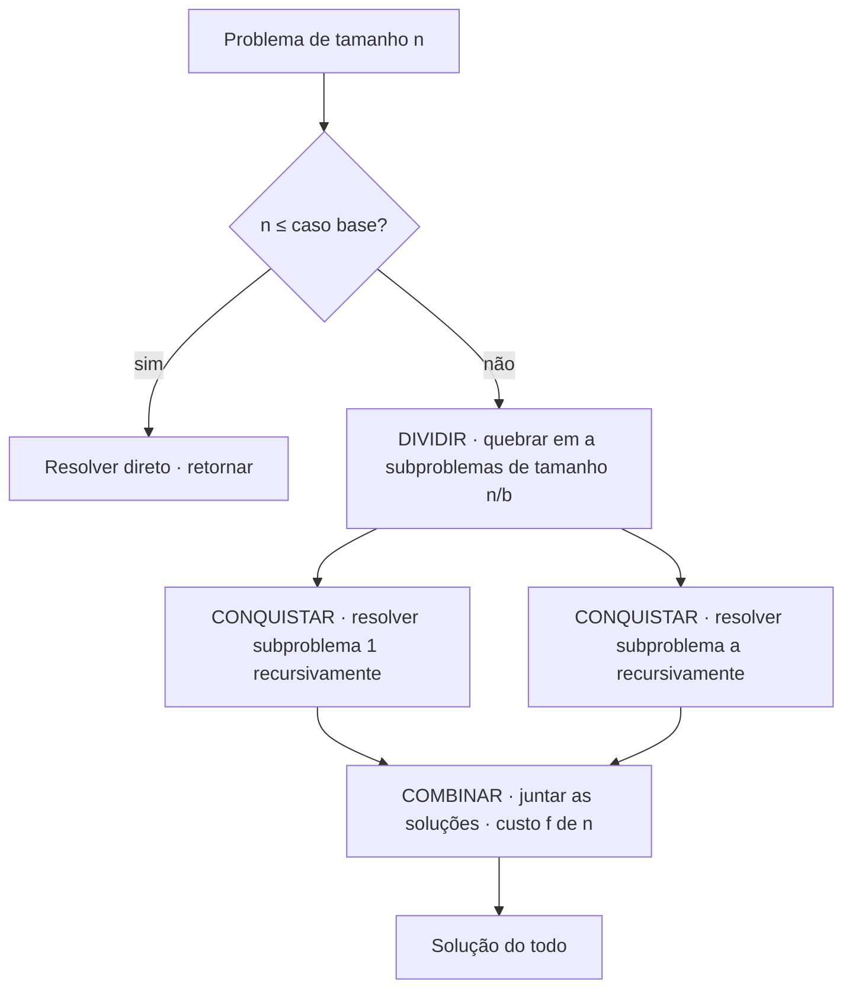
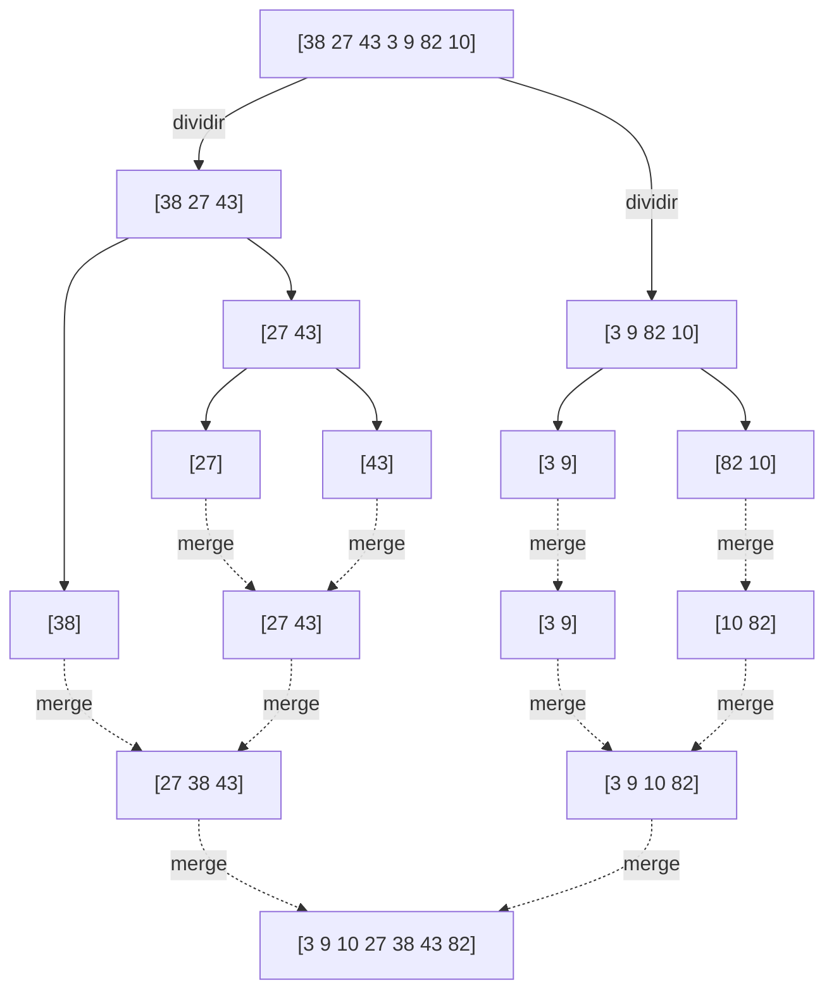

# Divisão e conquista

Imagine que você precisa contar quantas pessoas há num estádio lotado. Sozinho, você levaria horas — andaria fileira por fileira, sem nunca ter certeza de não recontar ou pular alguém. Agora imagine que você divide o estádio em quatro quadrantes e entrega cada um a um amigo. Cada amigo, achando o trabalho ainda grande, divide o quadrante dele em quatro e delega de novo. Em algum momento alguém recebe um pedaço tão pequeno — uma fileira de dez cadeiras — que conta na hora. Aí os números sobem de volta: somam-se as fileiras numa arquibancada, as arquibancadas num quadrante, os quadrantes no estádio. Ninguém fez muito trabalho, e o total saiu correto. Isso é **divisão e conquista**: parta o problema, resolva os pedaços recursivamente, junte as respostas.

A palavra-chave aqui é *junte*. Contar pessoas é fácil porque a junção é trivial — basta somar. O que torna divisão e conquista uma *técnica*, e não uma obviedade, é que para muitos problemas a junção é a parte difícil, e o ganho só aparece quando a junção é mais barata que resolver o problema do zero. Quando isso acontece, a complexidade despenca: um algoritmo quadrático vira `n log n`, uma multiplicação de números gigantes fica subquadrática, e problemas geométricos que pareciam exigir comparar todos os pares contra todos caem para `n log n`.

Em [[04 - Recursão]] vimos *como* uma função delega trabalho a si mesma. Em [[05 - Recorrências e o Teorema Mestre]] vimos *quanto* custa essa delegação — a fórmula `T(n) = a·T(n/b) + f(n)`. Esta nota junta as duas: divisão e conquista é o **paradigma de projeto** que produz exatamente essas recorrências, e o Teorema Mestre é a calculadora que diz quanto elas custam.

> [!abstract] TL;DR
> **Divisão e conquista** resolve um problema em três fases: **dividir** (quebrar em subproblemas menores do *mesmo tipo*, idealmente independentes), **conquistar** (resolver cada subproblema recursivamente; o caso base resolve direto) e **combinar** (juntar as soluções dos subproblemas na solução do todo). O custo obedece à recorrência **T(n) = a·T(n/b) + f(n)** de [[05 - Recorrências e o Teorema Mestre]], onde `f(n)` é justamente o custo de dividir + combinar. Funciona quando os subproblemas são **independentes** e a combinação é mais barata que resolver do zero. Quando os subproblemas se **sobrepõem**, divisão e conquista repete trabalho — essa é a fronteira com programação dinâmica ([[10 - Programação dinâmica]]); Fibonacci ingênuo é "D&C ruim" exatamente por isso. Exemplares: **merge sort** (`2T(n/2)+O(n) → O(n log n)`, trabalho na combinação, estável, O(n) extra), **quicksort** (particiona em torno de um pivô, trabalho *antes* da recursão, in-place, médio `O(n log n)`, pior `O(n²)`), **busca binária** (`T(n/2)+O(1) → O(log n)`, D&C degenerado de 1 subproblema, ver [[08 - Busca]]), **closest pair** (`O(n log n)` geométrico) e **Karatsuba** (`3T(n/2)+O(n) → O(n^1.585)`, o "aha" de trocar 4 multiplicações por 3). O tratamento *completo* de ordenação está em [[07 - Ordenação]]; aqui merge sort e quicksort são *ilustrações do paradigma*, não aula de sorts. NÃO use D&C quando os subproblemas se sobrepõem (→ DP), quando o problema é sequencial, ou em entradas tão pequenas que o overhead de recursão domina (daí o corte para insertion sort).

## A estratégia em três fases

Todo algoritmo de divisão e conquista, sem exceção, tem o mesmo esqueleto de três fases. Decore esse esqueleto, porque ele é o gabarito que você vai preencher para qualquer problema novo.

**Dividir.** Quebre a instância de tamanho `n` em `a` subproblemas, cada um de tamanho `n/b`. A condição que faz tudo funcionar: os subproblemas têm de ser do **mesmo tipo** do original (ordenar uma metade é o mesmo problema que ordenar o todo, só menor) e, idealmente, **independentes** (a solução de um não depende da do outro). Independência é o que permite resolvê-los em qualquer ordem — e, se você quiser, em paralelo.

**Conquistar.** Resolva cada subproblema **recursivamente**. Aqui não há mágica nova: é a mesma função se chamando sobre uma entrada menor. A recursão desce até o **caso base** — uma instância tão pequena que a resposta é imediata, sem mais divisão. Uma lista de um elemento já está ordenada; um único ponto não tem par; um número de um dígito multiplica-se direto. Sem caso base, a recursão não tem fundo, exatamente como em [[04 - Recursão]].

**Combinar.** Pegue as soluções dos subproblemas e monte a solução do problema inteiro. Esta é a fase que separa um paradigma elegante de um truque inútil. Se combinar custar tão caro quanto resolver do zero, você não ganhou nada. O segredo de todo bom algoritmo D&C está em uma combinação **barata** — `O(n)`, `O(n log n)`, qualquer coisa abaixo do custo de resolver o problema inteiro de forma ingênua.

Vamos ver o ciclo como um diagrama. Pense numa única chamada da função: ela divide, dispara as recursões, espera as respostas e combina.



Leitura do diagrama: o losango é o teste de caso base — toda chamada começa perguntando "já cheguei no fundo?". Se sim, resolve e volta (o ramo curto à esquerda). Se não, a chamada se ramifica nas três fases: DIVIDIR gera os `a` subproblemas, cada um vira uma chamada recursiva de CONQUISTAR (mostrei só a primeira e a última para não poluir), e quando todas voltam, COMBINAR funde os resultados ao custo `f(n)`. As setas que reentram em COMBINAR são o ponto em que a recursão "espera": a combinação só roda depois que todos os filhos terminaram.

E como o custo dessa estrutura se traduz em número? Exatamente na recorrência de [[05 - Recorrências e o Teorema Mestre]]:

> **T(n) = a · T(n/b) + f(n)**

A correspondência é literal, fase por fase:

- **`a`** é quantos subproblemas a fase *dividir* produz.
- **`n/b`** é o tamanho de cada um — `b` é o fator de encolhimento.
- **`f(n)`** é o trabalho das fases *dividir* e *combinar* somadas — tudo o que a chamada faz **fora** das recursões. No merge sort, dividir é `O(1)` (calcular o meio) e combinar é `O(n)` (o merge), então `f(n) = O(n)`.

Note o que `f(n)` *não* inclui: o trabalho dos filhos. Esse já está contado dentro de `T(n/b)`. O Teorema Mestre, então, é só a máquina que pega esses três botões — `a`, `b`, `f(n)` — e cospe a classe de complexidade. Por isso esta nota e a 05 são gêmeas: a 05 ensina a *resolver* a recorrência; esta ensina a *produzir* a recorrência projetando o algoritmo.

## Por que funciona — e quando aplicar

Divisão e conquista não é uma chave de fenda universal. Ela rende quando **duas** condições se encontram, e fracassa feio quando uma delas falta.

**Condição 1 — decomponibilidade em subproblemas independentes do mesmo tipo.** O problema tem de quebrar em peças que são versões menores dele mesmo, e cuja solução não dependa uma da outra. Ordenar quebra lindamente: ordenar `[ ... ]` é ordenar a primeira metade, ordenar a segunda, e elas não conversam durante a recursão. Encontrar o máximo de um array idem. Mas "encontrar o caminho mais curto que respeita uma capacidade global" *não* quebra assim — cada decisão afeta as outras, e os pedaços não são independentes.

**Condição 2 — combinação mais barata que a força bruta.** Mesmo com subproblemas perfeitamente independentes, se juntar as respostas custar `Θ(n²)`, o paradigma não compensa. O ganho do merge sort vem inteiro de o merge ser `O(n)`; se fundir duas metades ordenadas custasse quadrático, merge sort seria pior que o insertion sort. A pergunta de ouro ao projetar um D&C é sempre: *"a combinação é assintoticamente mais barata que resolver o todo na marra?"*

Quando a condição 1 falha de um jeito específico — quando os subproblemas se **sobrepõem** em vez de serem independentes — entra a fronteira mais importante desta nota.

### A ponte para programação dinâmica: Fibonacci é "D&C ruim"

O contraponto canônico de D&C é a **programação dinâmica** ([[10 - Programação dinâmica]]). As duas partem de subproblemas; a diferença é a relação entre eles. D&C assume subproblemas **independentes** — cada um aparece uma vez na árvore de recursão. DP existe para quando os subproblemas **se sobrepõem** — o mesmo subproblema reaparece muitas vezes.

O exemplo que cristaliza isso é o Fibonacci recursivo ingênuo:

```python
def fib(n):
    if n < 2:
        return n
    return fib(n - 1) + fib(n - 2)
```

Parece divisão e conquista — quebra `fib(n)` em dois subproblemas menores, resolve cada um recursivamente, combina (soma). Mas é **D&C ruim**, e a árvore de recursão explica por quê:

```mermaid
flowchart TD
    F5["fib&#40;5&#41;"] --> F4a["fib&#40;4&#41;"]
    F5 --> F3a["fib&#40;3&#41;"]
    F4a --> F3b["fib&#40;3&#41;"]
    F4a --> F2a["fib&#40;2&#41;"]
    F3a --> F2b["fib&#40;2&#41;"]
    F3a --> F1a["fib&#40;1&#41;"]
    F3b --> F2c["fib&#40;2&#41;"]
    F3b --> F1b["fib&#40;1&#41;"]
```



Leitura do diagrama: olhe quantas vezes `fib(3)` aparece — duas, uma sob `fib(5)` direto e outra dentro de `fib(4)`. `fib(2)` aparece três vezes. Esses subproblemas **se sobrepõem**: a árvore recalcula do zero coisas que já calculou em outro ramo. Como cada chamada gera duas, a árvore tem `Θ(φⁿ)` nós — custo **exponencial** para computar um número que tem fórmula fechada. A independência que D&C exige simplesmente não existe aqui: `fib(4)` e `fib(3)` *compartilham* o subproblema `fib(3)`.

A correção é DP: guarde o resultado de cada subproblema na primeira vez (memoização) e devolva o valor guardado nas próximas. Aí cada `fib(k)` é calculado **uma** vez, e o custo cai para `O(n)`. A regra prática que sai daí, e que vale ouro em entrevista: **se a árvore de recursão tem nós repetidos, você não tem um problema de D&C — tem um problema de DP.** D&C é para árvores de subproblemas *distintos*.

## Merge sort — combinação é tudo

O merge sort é o exemplar didático de divisão e conquista porque suas três fases são limpas e a combinação carrega todo o peso. As fases:

1. **Dividir:** parta o array ao meio. Custo `O(1)` (só calcular o índice do meio).
2. **Conquistar:** ordene recursivamente cada metade.
3. **Combinar:** **funda** (merge) as duas metades já ordenadas numa só, ordenada. Custo `O(n)`.

A recorrência sai direto: dois subproblemas de metade do tamanho, mais o merge linear.

> **T(n) = 2·T(n/2) + O(n)**

Pelo Teorema Mestre ([[05 - Recorrências e o Teorema Mestre]]), `a=2`, `b=2`, `f(n)=Θ(n)`; como `n^(log_b a) = n¹ = n` casa com `f(n)`, é o **Caso 2** → **Θ(n log n)**. Intuição: a árvore tem `log n` níveis (cada nível corta o tamanho pela metade), e cada nível faz `O(n)` de merge no total. `log n` níveis × `n` por nível = `n log n`.

O diagrama mostra os dois movimentos: a descida que divide até as folhas, e a subida que funde.



Leitura do diagrama: as setas **cheias** (de cima para baixo) são a fase *dividir* — o array se parte ao meio repetidamente até virar folhas de um elemento, que já estão trivialmente ordenadas (o caso base). As setas **pontilhadas** (de baixo para cima) são a fase *combinar* — cada par de listas ordenadas se funde numa lista maior ordenada, até reconstruir o array inteiro, agora em ordem. Repare: nenhum trabalho de ordenação acontece na descida; **tudo acontece na subida**, no merge. Esse é o traço característico do merge sort.

O coração é o merge — duas listas ordenadas viram uma, em uma passada linear com dois ponteiros:

```java
// Funde a[lo..mid] e a[mid+1..hi], ambas já ordenadas, usando aux como buffer.
static void merge(int[] a, int[] aux, int lo, int mid, int hi) {
    for (int k = lo; k <= hi; k++) aux[k] = a[k];   // copia para o buffer
    int i = lo, j = mid + 1;
    for (int k = lo; k <= hi; k++) {
        if      (i > mid)          a[k] = aux[j++];  // metade esquerda esgotou
        else if (j > hi)           a[k] = aux[i++];  // metade direita esgotou
        else if (aux[j] < aux[i])  a[k] = aux[j++];  // direita é menor
        else                       a[k] = aux[i++];  // esquerda é menor (ou empate → estável)
    }
}
```

Duas propriedades do merge sort que valem cravar — e que são objeto de pergunta direta em entrevista:

- **Estável.** Quando há empate (`aux[i] == aux[j]`), o `else` final pega o elemento da **esquerda** primeiro, preservando a ordem original entre iguais. Estabilidade importa quando você ordena por chaves secundárias.
- **Espaço `O(n)`.** O merge precisa de um buffer auxiliar do tamanho do array. Esse é o preço do `n log n` garantido — diferente do quicksort, o merge sort não é in-place na sua forma clássica.

> [!warning] Fronteira com [[07 - Ordenação]]
> Aqui o merge sort entra como **ilustração do paradigma** divisão e conquista: o ponto é *trabalho na combinação*, a recorrência `2T(n/2)+O(n)` e a estrutura de três fases. O tratamento **completo** de ordenação — comparativo de todos os algoritmos de sort, análise de estabilidade e in-place lado a lado, qual sort cada linguagem usa por baixo dos panos, sorts não-comparativos — está em [[07 - Ordenação]]. Não duplique aqui; linke para lá.

## Quicksort — o trabalho vem antes

O quicksort é o *outro* exemplar de D&C, e o contraste com o merge sort é o que o torna instrutivo. As fases:

1. **Dividir:** escolha um **pivô** e **particione** o array — todos os elementos menores que o pivô vão para a esquerda, os maiores para a direita, o pivô fica na posição final correta. Custo `O(n)`.
2. **Conquistar:** ordene recursivamente as duas partições (esquerda e direita do pivô).
3. **Combinar:** **nada.** Não há fase de combinação.

Essa ausência é o ponto. No merge sort, as metades são triviais de produzir e difíceis de juntar — o trabalho está na **combinação**, *depois* das recursões. No quicksort, é o inverso: produzir as partições é o trabalho duro (a partição em si), e depois que elas estão prontas, juntar é grátis — os pedaços já estão nos lugares certos, lado a lado no array. O trabalho está na **divisão**, *antes* das recursões.

```mermaid
flowchart TD
    A["[3 8 1 7 5 4] &middot; pivô = 5"] -->|particionar| P["[3 1 4] &lt; 5 &lt; [8 7]"]
    P --> L["[3 1 4] &middot; pivô = 4"]
    P --> R["[8 7] &middot; pivô = 7"]
    L --> L1["[3 1] &lt; 4"]
    L --> L2["&#40;vazio&#41; &gt; 4"]
    R --> R1["&#40;vazio&#41; &lt; 7"]
    R --> R2["[8] &gt; 7"]
    L1 --> LL["[1] &lt; 3 &lt; &#40;vazio&#41;"]
```



Leitura do diagrama: cada nível escolhe um pivô e parte o array em "menores à esquerda, pivô no meio, maiores à direita". Note que **não há setas de volta** — uma vez particionado, o pivô já está na posição final e não se move mais. A recursão desce nas duas sublistas em torno de cada pivô. Quando todas as partições têm tamanho 0 ou 1, o array inteiro está ordenado *no lugar*, sem nenhuma fusão. Compare com o diagrama do merge sort: lá o trabalho subia; aqui ele desce.

A partição, no esquema de **Lomuto** (o mais fácil de memorizar — usa o último elemento como pivô e um ponteiro que marca a fronteira dos "menores"):

```java
// Particiona a[lo..hi] em torno de a[hi]; devolve a posição final do pivô.
static int partition(int[] a, int lo, int hi) {
    int pivot = a[hi];
    int i = lo - 1;                     // fronteira: a[lo..i] são < pivô
    for (int j = lo; j < hi; j++) {
        if (a[j] < pivot) {
            i++;
            int t = a[i]; a[i] = a[j]; a[j] = t;   // joga a[j] para o lado dos menores
        }
    }
    int t = a[i + 1]; a[i + 1] = a[hi]; a[hi] = t;  // pivô para sua posição final
    return i + 1;
}

static void quicksort(int[] a, int lo, int hi) {
    if (lo >= hi) return;              // caso base: 0 ou 1 elemento
    int p = partition(a, lo, hi);
    quicksort(a, lo, p - 1);
    quicksort(a, p + 1, hi);
}
```

Propriedades do quicksort, em contraste com o merge sort:

- **In-place.** A partição troca elementos dentro do próprio array; não precisa de buffer auxiliar `O(n)`. (Há o custo `O(log n)` da pilha de recursão no caso médio, mas nada proporcional a `n`.) Essa frugalidade de memória é a grande razão de o quicksort ser o padrão de fato para ordenação em memória.
- **Caso médio `O(n log n)`, pior caso `O(n²)`.** Se o pivô parte o array em duas metades equilibradas, a recorrência é `2T(n/2)+O(n) → O(n log n)`, igual ao merge sort. Mas se o pivô for sempre o menor (ou maior) elemento — o que acontece, ironicamente, num array **já ordenado** com pivô fixo no extremo — uma partição fica vazia e a outra com `n-1` elementos: `T(n) = T(n-1) + O(n) → O(n²)`. A recorrência degenera de "divisão" para "subtração".
- **Não estável** (na forma clássica com trocas), e o pior caso é real, não teórico.

Como esquivar do `O(n²)`? Quebre a previsibilidade do pivô:

- **Pivô aleatório.** Escolha uma posição ao acaso para o pivô. O pior caso ainda *existe*, mas passa a depender da sorte, não da entrada — nenhum adversário consegue forçá-lo com um array específico. O caso médio `O(n log n)` vira esperado com probabilidade altíssima.
- **Mediana de três.** Tome o pivô como a mediana entre o primeiro, o meio e o último elemento. Custa `O(1)` e elimina o pior caso justamente para a entrada que mais o provoca na prática: o array já ordenado.

> [!warning] Fronteira com [[07 - Ordenação]]
> De novo: aqui o quicksort serve para mostrar o *outro sabor* de D&C — trabalho na **divisão**, sem combinação, in-place. O comparativo definitivo quicksort × merge sort × heapsort, a discussão de quando cada um vence, os híbridos reais (introsort, Timsort) e o que cada linguagem usa estão em [[07 - Ordenação]].

## Closest pair of points — D&C na geometria

Os dois sorts mostram D&C em arrays. O **par de pontos mais próximo** mostra D&C resolvendo algo que não tem nada a ver com ordenação — prova de que o paradigma é geral.

O problema: dados `n` pontos no plano, encontre o par com a menor distância euclidiana entre eles. A solução ingênua compara todos os pares: `Θ(n²)`. Divisão e conquista derruba para `O(n log n)`, e o caminho é instrutivo porque a fase de *combinação* tem uma sutileza linda.

A estrutura:

1. **Dividir:** ordene os pontos por coordenada `x` e trace uma linha vertical que parte o conjunto em duas metades, esquerda e direita, com `n/2` pontos cada.
2. **Conquistar:** encontre recursivamente o par mais próximo de cada metade. Chame de `δ` (delta) a menor das duas distâncias — o melhor candidato visto até agora *dentro* de uma das metades.
3. **Combinar:** aqui está a sutileza. O par mais próximo *global* pode ter um ponto à esquerda e outro à direita — um par que **cruza** a linha divisória, e que nenhuma das duas recursões viu. Precisamos checar esses pares cruzados. A força bruta seria `Θ(n²)` de novo. O truque salva o dia.

```mermaid
flowchart TD
    A["n pontos no plano"] -->|dividir pela linha x| L["Metade esquerda &middot; n/2 pontos"]
    A -->|dividir pela linha x| R["Metade direita &middot; n/2 pontos"]
    L -->|recursão| DL["menor distância à esquerda"]
    R -->|recursão| DR["menor distância à direita"]
    DL --> COMB["&delta; = min das duas"]
    DR --> COMB
    COMB --> STRIP["Faixa de largura 2&delta; em torno da linha"]
    STRIP --> CHECK["Checar só pares dentro da faixa &middot; O&#40;n&#41;"]
    CHECK --> RES["Par mais próximo global"]
```



Leitura do diagrama: as duas recursões devolvem cada uma a sua menor distância interna; `δ` é a menor delas. A fase de combinação não varre o plano inteiro — ela se restringe a uma **faixa** vertical de largura `2δ` centrada na linha divisória. Qualquer par cruzado capaz de bater `δ` precisa ter ambos os pontos a menos de `δ` da linha, logo dentro dessa faixa; pontos fora dela já estão garantidamente a mais de `δ` um do outro.

O insight que torna a combinação `O(n)` em vez de `O(n²)`: dentro da faixa, ordene os pontos por coordenada `y`. Para cada ponto, você só precisa comparar com um **número constante** de vizinhos seguintes na ordem `y` (clássico argumento mostra que bastam os próximos ~7). Por quê? Porque um quadrado de lado `δ` não cabe mais que um punhado de pontos sem que dois deles fiquem a menos de `δ` — o que contradiria `δ` ser a menor distância de cada metade. Então a faixa, mesmo com até `n` pontos, custa `O(n)` para varrer, não `O(n²)`.

A recorrência fecha em `T(n) = 2T(n/2) + O(n) → O(n log n)` — a mesma forma do merge sort, e pelo mesmo Caso 2 do Teorema Mestre. O par mais próximo é o exemplo que costuma aparecer em entrevista de empresa forte em geometria computacional, e foi formalizado por Shamos & Hoey nos anos 1970.

## Karatsuba — o "aha" de trocar 4 por 3

Se o closest pair mostra que D&C é geral, **Karatsuba** mostra a jogada mais elegante do paradigma: reduzir o *número* de subproblemas muda a *classe de complexidade*.

O problema: multiplicar dois números de `n` dígitos. O algoritmo que você aprendeu na escola — cada dígito de um por cada dígito do outro — é `Θ(n²)`. Por décadas se acreditou que era o limite. Em 1960, num seminário de Kolmogorov, **Anatolii Karatsuba** mostrou que não.

A ideia. Parta cada número de `n` dígitos em duas metades de `n/2` dígitos. Escrevendo `x = x₁·10^(n/2) + x₀` e `y = y₁·10^(n/2) + y₀`, o produto é:

```
x·y = x₁y₁·10ⁿ + (x₁y₀ + x₀y₁)·10^(n/2) + x₀y₀
```

Ingenuamente, isso pede **quatro** multiplicações de `n/2` dígitos: `x₁y₁`, `x₁y₀`, `x₀y₁`, `x₀y₀`. A recorrência seria `T(n) = 4T(n/2) + O(n)` → pelo Teorema Mestre, `n^(log₂4) = n²` — nada ganho. O `aha` de Karatsuba é que o termo do meio, `x₁y₀ + x₀y₁`, pode sair de **uma** multiplicação extra em vez de duas, usando os produtos que já temos:

```
(x₁ + x₀)(y₁ + y₀) = x₁y₁ + x₁y₀ + x₀y₁ + x₀y₀
                   = x₁y₁ + (termo do meio) + x₀y₀
```

Logo `termo do meio = (x₁ + x₀)(y₁ + y₀) − x₁y₁ − x₀y₀`. Calculando `x₁y₁`, `x₀y₀` e esse **único** produto novo, montamos tudo com somas e subtrações (que são `O(n)`). **Três** multiplicações em vez de quatro:

> **T(n) = 3·T(n/2) + O(n)**

Pelo Teorema Mestre: `n^(log₂3) ≈ n^1.585` domina o `f(n)=O(n)`, então é o **Caso 1** → **Θ(n^1.585)**. Subquadrático. O diagrama mostra de onde vem o ganho.

```mermaid
flowchart TD
    NAIVE["Ingênuo &middot; 4 multiplicações de n/2"] --> NREC["T&#40;n&#41; = 4T&#40;n/2&#41; + O&#40;n&#41;"]
    NREC --> NRES["&Theta;&#40;n²&#41;"]
    KARA["Karatsuba &middot; 3 multiplicações de n/2"] --> KREC["T&#40;n&#41; = 3T&#40;n/2&#41; + O&#40;n&#41;"]
    KREC --> KRES["&Theta;&#40;n^1.585&#41;"]
```



Leitura do diagrama: os dois algoritmos têm a *mesma* estrutura D&C — dividir o número ao meio, recursão, combinar com somas — e o `b=2` é idêntico. A **única** diferença é `a`: 4 contra 3. Mas como `a` é o expoente da recorrência (`n^(log_b a)`), trocar 4 por 3 muda o expoente de `2` para `1.585`. Essa é a lição mais profunda de D&C: **o número de subproblemas é o botão que controla a classe de complexidade.** Reduzir `a` é o jackpot.

O análogo direto na multiplicação de **matrizes** é **Strassen** (1969): multiplicar duas matrizes `n×n` em blocos pede ingenuamente **8** multiplicações de blocos `n/2 × n/2` (`T(n)=8T(n/2)+O(n²) → O(n³)`). Strassen rearranja para **7** multiplicações → `T(n)=7T(n/2)+O(n²)` → `n^(log₂7) ≈ n^2.807`. Mesma melodia de Karatsuba, outra letra: baixe `a` de 8 para 7 e o cubo vira subcúbico. Os dois são o cartão de visita de divisão e conquista no cânone da computação.

## Quando NÃO usar divisão e conquista

Saber quando o paradigma **não** serve é metade da maturidade. Três armadilhas:

- **Subproblemas sobrepostos.** Já vimos: se a árvore de recursão recalcula os mesmos subproblemas (Fibonacci ingênuo), D&C faz trabalho exponencial redundante. A resposta é **programação dinâmica** / memoização ([[10 - Programação dinâmica]]). Teste mental: *os subproblemas se repetem?* Se sim, não é D&C.
- **Overhead de recursão em entradas pequenas.** Para `n` minúsculo, o custo de criar frames de pilha, calcular meios e fazer chamadas pode superar o de um algoritmo `O(n²)` simples e sem ramificação. Por isso implementações reais de merge sort e quicksort **cortam para insertion sort** quando a sublista cai abaixo de um limiar (tipicamente 10–20 elementos). Híbridos como o Timsort fazem exatamente isso.
- **Problemas inerentemente sequenciais.** Alguns problemas não decompõem em pedaços independentes — cada passo depende do resultado do anterior, e não há como dividir sem que as partes precisem conversar. Aí D&C não tem o que partir.

Vale fechar com a **busca binária** ([[08 - Busca]]), o D&C *degenerado*. Ela divide o array ao meio, mas — diferente do merge sort — descarta uma das metades e recursa em **apenas uma**: `a=1`, não `a=2`. Não há combinação (a resposta de um único subproblema *é* a resposta). A recorrência `T(n) = T(n/2) + O(1)` dá `O(log n)`. É divisão e conquista no esqueleto, mas com `a=1` ela vira o caso mais magro possível — divide, e nem precisa conquistar os dois lados nem combinar.

## Em entrevista

Divisão e conquista é o vocabulário que separa quem "sabe ordenar" de quem "entende projeto de algoritmo". Quando você reconhece em voz alta a estrutura de três fases e a recorrência por trás, sinaliza maturidade imediatamente.

Frases úteis em inglês:

- "This problem **breaks down into independent subproblems** of the same type, so it's a natural fit for divide and conquer."
- "Merge sort does the work **in the combine step** — the merge — while quicksort does it **in the divide step**, the partition. That's why merge sort has no combine phase and quicksort has no combine phase."
- "The recurrence is **T(n) = 2T(n/2) + O(n)**, which the Master Theorem resolves to **O(n log n)**."
- "Naive Fibonacci looks like divide and conquer, but the **subproblems overlap**, so it's really a dynamic programming problem — I'd **memoize** it."
- "To avoid quicksort's worst case, I'd pick a **randomized pivot** or **median of three**, so a sorted input can't force O(n²)."
- "Karatsuba turns **four multiplications into three**, which drops the exponent from n² to roughly n^1.585 — fewer subproblems, lower complexity class."
- "For small subarrays I'd **cut over to insertion sort** to avoid recursion overhead."

Vocabulário PT → EN:

| Português | English |
|---|---|
| divisão e conquista | divide and conquer |
| dividir / conquistar / combinar | divide / conquer / combine |
| subproblema | subproblem |
| caso base | base case |
| recorrência | recurrence (relation) |
| fundir (merge sort) | to merge |
| particionar | to partition |
| pivô | pivot |
| in-place / no lugar | in-place |
| estável | stable |
| espaço auxiliar | auxiliary space |
| subproblemas sobrepostos | overlapping subproblems |
| memoização | memoization |
| pior caso / caso médio | worst case / average case |
| par de pontos mais próximo | closest pair of points |
| faixa (closest pair) | strip |
| multiplicação de números grandes | big-integer / large-number multiplication |

Perguntas que o entrevistador pode disparar:

- *"Why is merge sort O(n log n)?"* — "Log n levels of division, O(n) merge work per level."
- *"Why is quicksort O(n²) in the worst case?"* — "A bad pivot leaves one partition empty; the recurrence degenerates to T(n-1)+O(n)."
- *"Is this a divide-and-conquer or a DP problem?"* — sua resposta deve girar em torno de *overlapping vs. independent subproblems*.

## Fontes

> [!info] Lastro
> - **Cormen, Leiserson, Rivest, Stein — *Introduction to Algorithms* (CLRS), 4ª ed.** Capítulo "Divide-and-Conquer": a forma `T(n)=aT(n/b)+f(n)`, merge sort como exemplo canônico, e a análise do closest pair via faixa (strip).
> - **Karatsuba, A. & Ofman, Yu. (1962). "Multiplication of Many-Digital Numbers by Automatic Computers."** *Doklady Akademii Nauk SSSR.* O algoritmo subquadrático de multiplicação (a ideia foi de Karatsuba em 1960; publicada em 1962).
> - **Shamos, M. I. & Hoey, D. (1975). "Closest-point problems."** *16th Annual Symposium on Foundations of Computer Science (FOCS).* Algoritmo `O(n log n)` para o par mais próximo via divisão e conquista. (Tratamento também em CLRS.)
> - **Sedgewick, R. & Wayne, K. — *Algorithms*, 4ª ed.** Implementações idiomáticas e estáveis de merge sort e quicksort (incluindo partição de Lomuto/Hoare e mediana de três), com a discussão de corte para insertion sort.

---

**Anterior:** [[05 - Recorrências e o Teorema Mestre]] · **Próxima:** [[07 - Ordenação]] **Base:** [[04 - Recursão]] · **Contraste:** [[10 - Programação dinâmica]] (subproblemas sobrepostos), [[08 - Busca]] (busca binária = D&C de 1 subproblema) **MOC:** [[03-Dominios/Ciência/Algoritmos/index|Algoritmos]]
